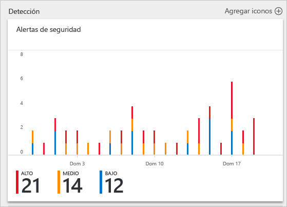
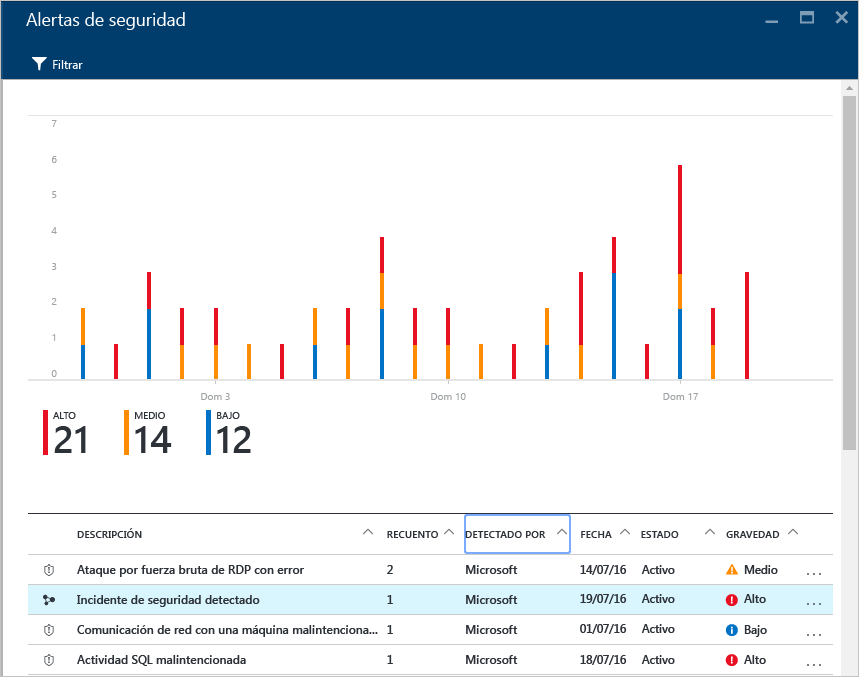
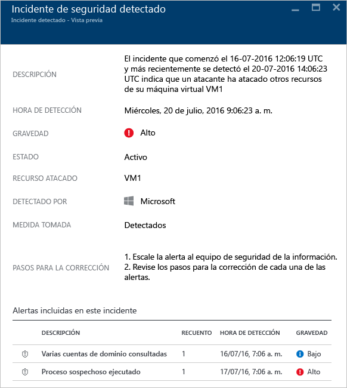
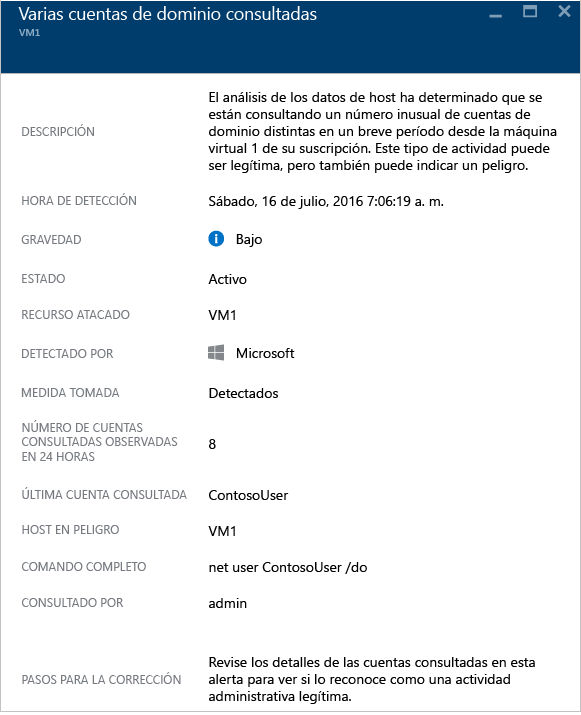

<properties
   pageTitle="Control de incidentes de seguridad en Azure Security Center | Microsoft Azure"
   description="Este documento le ayuda a usar las funcionalidades de Azure Security Center para controlar los incidentes de seguridad."
   services="security-center"
   documentationCenter="na"
   authors="YuriDio"
   manager="swadhwa"
   editor=""/>

<tags
   ms.service="security-center"
   ms.topic="hero-article"
   ms.devlang="na"
   ms.tgt_pltfrm="na"
   ms.workload="na"
   ms.date="08/03/2016"
   ms.author="yurid"/>

# Control de incidentes de seguridad en Azure Security Center 
La clasificación e investigación de las alertas de seguridad puede ser un proceso largo incluso para los analistas de seguridad más cualificados, y para muchos es difícil saber incluso por dónde empezar. Con el [análisis](security-center-detection-capabilities.md) para conectar la información entre las distintas [alertas de seguridad](security-center-managing-and-responding-alerts.md), Security Center le proporcionará una vista única de una campaña de ataque y de todas las alertas relacionadas; de esta forma podrá comprender rápidamente las acciones que realizó el atacante y qué recursos se vieron afectados.

Este documento describe cómo usar las funcionalidades de alerta de seguridad de Security Center para ayudarle a controlar los incidentes de seguridad.

## ¿Qué es un incidente de seguridad?

En Security Center, un incidente de seguridad es la suma de todas las alertas de un recurso que se alinean con patrones de [cadenas de eliminación](https://blogs.technet.microsoft.com/office365security/addressing-your-cxos-top-five-cloud-security-concerns/). Los incidentes aparecen en el icono y en la hoja [Alertas de seguridad](security-center-managing-and-responding-alerts.md). El incidente mostrará la lista de alertas relacionadas, lo que permite obtener más información sobre cada repetición.

## Administración de incidentes de seguridad

Puede revisar los incidentes de seguridad actuales en el icono Alertas de seguridad. Acceda al Portal de Azure y siga los pasos que se indican a continuación para ver más detalles sobre cada incidente de seguridad:

1. En el panel Security Center, verá el icono **Alertas de seguridad**.

    

2.  Haga clic en este icono para expandirlo y, si se detecta un incidente de seguridad, aparecerá en el gráfico de alertas de seguridad, tal como se muestra a continuación.

    

3.	Observe que la descripción de incidentes de seguridad tiene un icono diferente si se compara con otras alertas. Haga clic en él para ver más detalles sobre este incidente.

	

4. 	En la hoja encontrará más detalles sobre este incidente de seguridad, como su descripción completa, su gravedad (en este caso alta), su estado actual (en este caso aún *activo*, lo que implica que el usuario no ha realizado acción alguna para *descartarlo* - lo que se puede hacer haciendo clic con el botón derecho en el incidente en la hoja **Alertas de seguridad**), el recurso asociado (en este caso *VM1*) y los pasos de corrección del incidente. Además, en el panel inferior tiene las alertas que se incluyeron en este incidente. Para más información sobre cada alerta, solo tiene que hacer clic en ella y se abrirá otra hoja, tal como se muestra a continuación:

	

La información sobre esta hoja variará según la alerta. Para más información sobre cómo administrar estas alertas, consulte [Administración y respuesta a las alertas de seguridad en Azure Security Center](security-center-managing-and-responding-alerts.md). Algunas consideraciones importantes con respecto a esta funcionalidad son las siguientes:

- Un nuevo filtro le permite personalizar la vista a solo incidente, solo alertas o ambos.
- La misma alerta puede existir como parte de un incidente (si procede), así como a estar visible como alerta independiente.
- Si se descarta un incidente, no se descartarán las alertas relacionadas.

## Otras referencias

En este documento, aprendió a usar la funcionalidad de incidente de seguridad en el Security Center. Para más información sobre el Centro de seguridad, consulte los siguientes recursos:

- [Administración y respuesta a las alertas de seguridad en el Centro de seguridad de Azure](security-center-managing-and-responding-alerts.md)
- [Funcionalidades de detección de Azure Security Center](security-center-detection-capabilities.md)
- [Guía de planeamiento y operaciones de Azure Security Center](security-center-planning-and-operations-guide.md)
- [Administración y respuesta a las alertas de seguridad en el Centro de seguridad de Azure](security-center-managing-and-responding-alerts.md)
- [Preguntas más frecuentes sobre Azure Security Center](security-center-faq.md): encuentre las preguntas más frecuentes sobre el uso del servicio.
- [Blog de seguridad de Azure](http://blogs.msdn.com/b/azuresecurity/): encuentre entradas de blog sobre el cumplimiento y la seguridad en Azure.

<!---HONumber=AcomDC_0817_2016-->