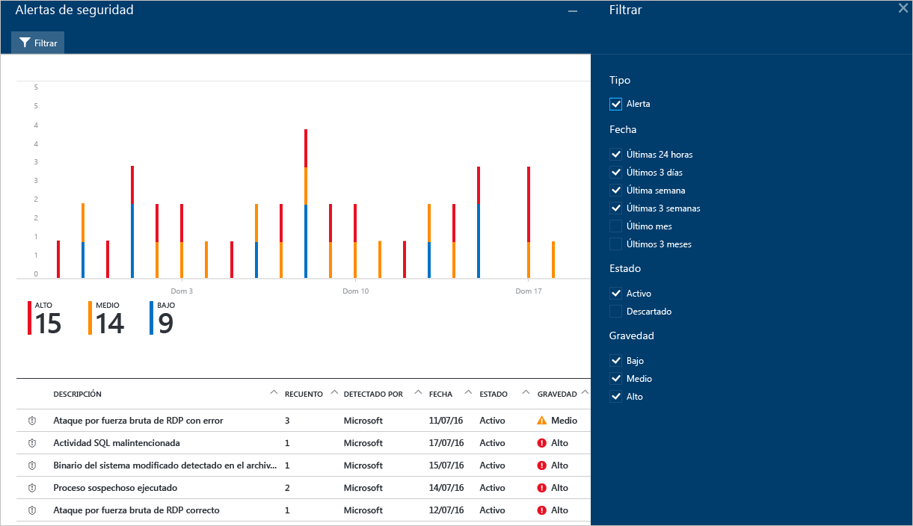
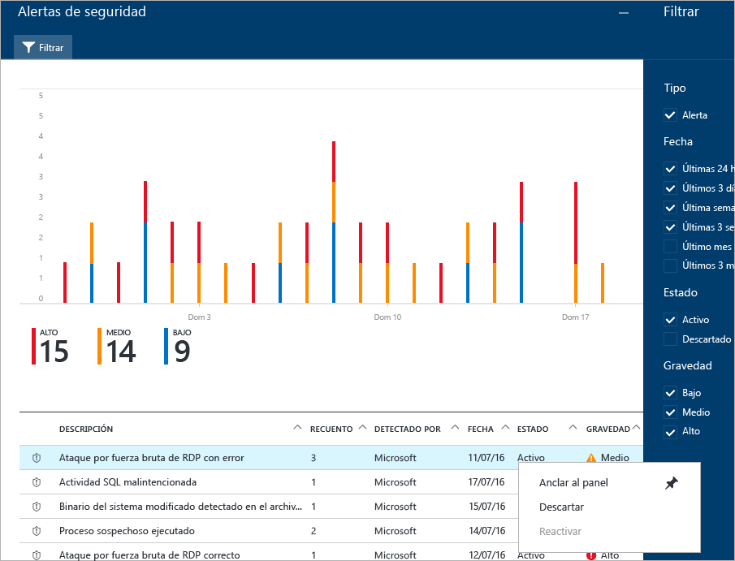
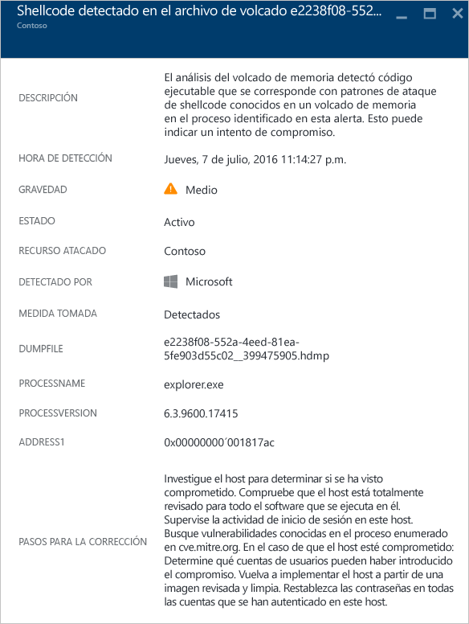
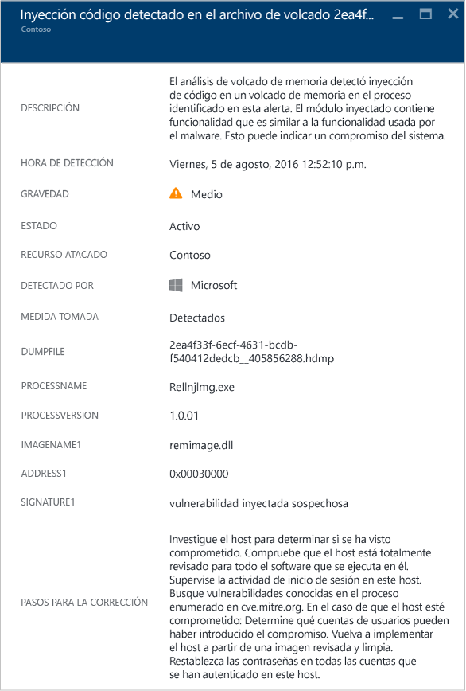
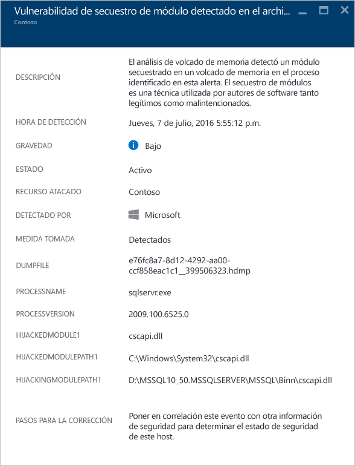
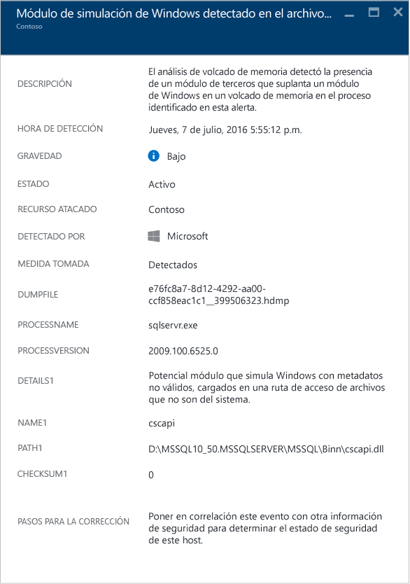

<properties
   pageTitle="Administración y respuesta a las alertas de seguridad en el Centro de seguridad de Azure | Microsoft Azure"
   description="Este documento le ayuda a usar las capacidades del Centro de seguridad de Azure para administrar y responder a las alertas de seguridad."
   services="security-center"
   documentationCenter="na"
   authors="YuriDio"
   manager="swadhwa"
   editor=""/>

<tags
   ms.service="security-center"
   ms.topic="hero-article"
   ms.devlang="na"
   ms.tgt_pltfrm="na"
   ms.workload="na"
   ms.date="08/26/2016"
   ms.author="yurid"/>

# Administración y respuesta a las alertas de seguridad en el Centro de seguridad de Azure
Este documento le ayuda a usar Azure Security Center para administrar las alertas de seguridad y responder a ellas.

> [AZURE.NOTE] Para habilitar las detecciones avanzadas, actualice a la versión estándar de Azure Security Center. Hay una prueba de evaluación gratuita de 90 días disponible. Para realizar la actualización, seleccione el plan de tarifa en la [directiva de seguridad](security-center-policies.md). Para más información, consulte la [página de precios](https://azure.microsoft.com/pricing/details/security-center/).

## ¿Qué son las alertas de seguridad?
Security Center recopila, analiza e integra automáticamente los datos de registro de los recursos de Azure, la red y las soluciones de asociados conectados, como firewalls y soluciones de protección de puntos de conexión, para detectar amenazas reales y reducir los falsos positivos. En Security Center, se muestra una lista de alertas de seguridad prioritarias, junto con la información que necesita para investigar rápidamente y recomendaciones para corregir un ataque. Azure Security Center también agrupa las alertas que se alinean para terminar los patrones de cadena en el artículo sobre [incidentes](security-center-incident.md).

> [AZURE.NOTE] Para más información acerca de cómo actúan las funcionalidades de detección de Security Center, consulte [Funcionalidades de detección de Azure Security Center](security-center-detection-capabilities.md).

## Administración de alertas de seguridad

Puede revisar las alertas actuales en el icono **Alertas de seguridad**. Abra el Portal de Azure y siga los pasos siguientes para ver más detalles sobre cada alerta:

1. En el panel Security Center, verá el icono **Alertas de seguridad**.

    

2.  Haga clic en el icono para abrir la hoja **Alertas de seguridad**, que contiene más detalles acerca de las alertas, como se muestra a continuación.

    

En la parte inferior de esta hoja aparecen los detalles de cada alerta. Para ordenar, haga clic en la columna que desea ordenar. A continuación se muestra la definición de cada columna:

- **Alerta**: una breve explicación de la alerta.
- **Recuento**: una lista de todas las alertas de este tipo específico que se han detectado en un día concreto.
- **Detectado por**: el servicio responsable de desencadenar la alerta.
- **Fecha**: la fecha en que se ha producido el evento.
- **Estado**: el estado actual de esa alerta. Existen dos tipos de servicios:
    - **Activa**: se ha detectado la alerta de seguridad.
    - **Descartada**: el usuario ha descartado la alerta de seguridad. Este estado suele utilizarse para alertas que se han investigado pero que no se han mitigado, o se ha observado que no plantean un ataque real.

- **Gravedad**: el nivel de gravedad, que puede ser alto, medio o bajo.

### Filtrado de alertas

Puede filtrar alertas en función de la fecha, el estado y la gravedad. Puede resultar útil filtrar las alertas en aquellos escenarios en que necesite restringir el ámbito de las alertas de seguridad que se muestran. Por ejemplo, podría comprobar las alertas de seguridad que se produjeron en las 24 horas anteriores, ya que se está investigando una posible brecha en el sistema.

1. Haga clic en **Filtro** en la hoja **Alertas de seguridad**. Se abre la hoja **Filtro**, donde podrá seleccionar los valores de fecha, estado y gravedad que desee ver.

	

2. 	Después de investigar una alerta de seguridad, es posible que descubra que es un falso positivo para su entorno o que indica un comportamiento normal de un recurso determinado. En cualquier caso, si determina que una alerta de seguridad no es aplicable, puede descartarla y después filtrarla de la vista. Hay dos formas de descartar una alerta de seguridad. Haga clic con el botón derecho en una alerta y seleccione **Descartar**, o bien mantenga el puntero sobre un elemento, haga clic en los tres puntos que aparecen a la derecha y seleccione **Descartar**. Para ver las alertas de seguridad descartadas, haga clic en **Filtro** y seleccione **Descartada**.

	

### Responder a alertas de seguridad

Seleccione una alerta de seguridad para ver más información sobre el evento o los eventos que la desencadenaron y, si existen, los pasos que debe seguir para corregir un ataque. Las alertas de seguridad se agrupan según el tipo y la fecha. Haga clic en una alerta de seguridad y se abrirá una hoja que contiene una lista de las alertas agrupadas.

En este caso, las alertas desencadenadas hacen referencia a las actividades sospechosas del Protocolo de escritorio remoto (RDP). En la primera columna se muestran los recursos atacados, en la segunda, las veces que el recurso fue atacado, en la tercera, la hora en la que se produjo el ataque, en la cuarta, el estado de la alerta y, en la quinta, la gravedad del ataque. Después de revisar esta información, haga clic en el recurso atacado y se abrirá una nueva hoja.

En el campo **Descripción** de esta hoja encontrará más detalles sobre este evento. Estos detalles adicionales ofrecen información detallada sobre lo que activó la alerta de seguridad, el recurso de destino, la dirección IP de origen si corresponde, y recomendaciones sobre cómo corregirla. En algunos casos, la dirección IP de origen estará vacía (no disponible) porque no todos los registros de eventos de seguridad de Windows incluyen la dirección IP.

> [AZURE.NOTE] La corrección sugerida por el Centro de seguridad variará según la alerta de seguridad. En algunos casos, tendrá que utilizar otras capacidades de Azure para implementar la corrección recomendada. Por ejemplo, la solución para este ataque consiste en colocar la dirección IP que lo está generando en la lista negra mediante una [ACL de red](../virtual-network/virtual-networks-acl.md) o una regla de [grupo de seguridad de red](../virtual-network/virtual-networks-nsg.md).

## Alertas de seguridad por tipo
Los mismos pasos que se usaron para acceder a la alerta de actividad sospechosa de RDP pueden utilizarse para acceder a otro tipo de alertas. Estos son otros ejemplos de alertas que se pueden ver en las alertas de Security Center:

### Posible inyección de código SQL
La inyección de código SQL es un ataque en el que se inserta código malintencionado en cadenas que posteriormente se pasan a una instancia de SQL Server para su análisis y ejecución. Deben revisarse todos los procedimientos que crean instrucciones SQL en busca de vulnerabilidades por inyección de código, porque SQL Server ejecutará todas las consultas sintácticamente válidas que reciba.

Esta alerta proporciona información que le permite identificar el recurso atacado, la hora de detección, el estado del ataque y también proporciona un vínculo a pasos de investigación adicionales.

### Suspicious outgoing traffic detected (Tráfico saliente sospechoso detectado)

Se pueden detectar dispositivos de red y perfiles de la misma manera que otros tipos de sistemas. Los atacantes suelen comenzar con la exploración de puertos o con el barrido de puertos. En el ejemplo siguiente se muestra un tráfico SSH sospechoso desde una máquina virtual que puede estar realizando un ataque por fuerza bruta de SSH o un barrido de puerto contra un recurso externo.

Esta alerta proporciona información que le permite identificar el recurso que se usó para iniciar este ataque, el equipo en riesgo, la hora de detección, el protocolo y puerto que se utilizó. Esta hoja también proporciona una lista de pasos de corrección que pueden utilizarse para mitigar este problema.

### Network communication with a malicious machine (Comunicación de red con una máquina malintencionada)
 
Mediante el aprovechamiento de las fuentes de inteligencia de amenazas de Microsoft, Azure Security Center puede detectar equipos en peligro que se comunican con direcciones IP malintencionadas, en muchos casos, mediante un comando y un centro de control. En este caso, Azure Security Center ha detectado que la comunicación se realizó mediante el malware Pony Loader (también conocido como [Fareit](https://www.microsoft.com/security/portal/threat/encyclopedia/entry.aspx?Name=PWS:Win32/Fareit.AF)).

Esta alerta proporciona información que le permite identificar el recurso que se usó para iniciar este ataque, el recurso atacado, la dirección IP víctima, la dirección IP del atacante y la hora de detección.

> [AZURE.NOTE] Las direcciones IP activas se quitaron de esta captura de pantalla por privacidad.

### Shellcode detectado 

Shellcode es la carga que se ejecuta después de que un malware haya aprovechado una vulnerabilidad en el software. Esta alerta indica que el análisis del volcado de bloqueo ha detectado código ejecutable que muestra un comportamiento normalmente realizado mediante cargas malintencionadas. Aunque el software no malintencionado puede tener este comportamiento, no es típico en las prácticas de desarrollo de software normal.

Los siguientes campos son comunes a todas las alertas de volcado de bloqueo:

- DUMPFILE (ARCHIVO DE VOLCADO): nombre del archivo de volcado
- PROCESSNAME (NOMBRE DEL PROCESO): nombre del proceso de bloqueo
- PROCESSVERSION (VERSIÓN DEL PROCESO): versión del proceso de bloqueo

Esta alerta proporciona el siguiente campo adicional:

- ADDRESS (DIRECCIÓN): ubicación de la memoria del shellcode

A continuación se muestra un ejemplo de este tipo de alerta:

### Inserción de código detectada

La inserción de código es la inserción de módulos ejecutables en procesos o subprocesos que se están ejecutando. El malware usa esta técnica para tener acceso a datos, ocultar o evitar su eliminación (por ejemplo, persistencia). Esta alerta indica que el análisis del volcado de bloqueo ha detectado un módulo insertado con el archivo de volcado.
 
Los desarrolladores de software legítimo ocasionalmente insertan código por motivos no intencionados, como modificar o extender una aplicación o un componente de sistema operativo existentes. Para ayudar a diferenciar entre módulos insertados malintencionados y benignos, Azure Security Center comprueba si el módulo insertado se ajusta a un perfil de comportamiento sospechoso. El resultado de esta comprobación se indica en el campo "SIGNATURE" (FIRMA) de la alerta y se refleja en la gravedad de la alerta, su descripción y los pasos de corrección.

Además de los campos comunes que se describen en la anterior sección, "Shellcode detectado", esta alerta proporciona los siguientes campos adicionales:

- ADDRESS (DIRECCIÓN): ubicación de la memoria del módulo insertado
- IMAGENAME (NOMBRE DE LA IMAGEN): nombre del módulo insertado. Tenga en cuenta que este campo puede estar en blanco si no se proporciona el nombre de la imagen dentro de la imagen.
- SIGNATURE (FIRMA): indica si el módulo insertado se ajusta a un perfil de comportamiento sospechoso. En la tabla siguiente se muestran ejemplos de resultados y su descripción:

| **Valor de firma** | **Descripción** |
|--------------------------------------|-------------------------------------------------------------------------------------------------------------------|
| Vulnerabilidad de seguridad del cargador reflectivo sospechoso | Este comportamiento sospechoso a menudo está relacionado con cargar código insertado independientemente del cargador del sistema operativo. |
| Vulnerabilidad de seguridad insertada sospechosa | Significa vulneraciones malintencionadas que a menudo están relacionadas con la inserción de código en la memoria. |
| Vulnerabilidad de seguridad de inserción sospechosa | Significa vulneraciones malintencionadas que a menudo están relacionadas con la utilización del código insertado en la memoria. |
| Vulnerabilidad de seguridad del depurador insertado sospechoso | Significa vulneraciones malintencionadas que a menudo están relacionadas con la detección o la elusión de un depurador. |
| Vulnerabilidad de seguridad remota de inserción sospechosa | Significa vulneraciones malintencionadas relacionadas a menudo con escenarios de control (C2) n del comando. |

A continuación se muestra un ejemplo de este tipo de alerta:

### Detectado secuestro de módulo

Windows se basa en las bibliotecas de vínculos dinámicos (DLL) para que el software pueda utilizar la funcionalidad del sistema Windows común. El secuestro de DLL se produce cuando el malware cambia el orden de carga de las DLL para realizar cargas malintencionadas en la memoria, donde se puede ejecutar código arbitrario. Esta alerta indica que el análisis del volcado de bloqueo ha detectado que se carga un módulo con un nombre similar desde dos rutas de acceso diferentes, una de las cuales procede de una ubicación binaria de un sistema Windows común.

Los desarrolladores de software legítimo ocasionalmente cambian el orden de carga DLL por razones no malintencionadas, como instrumentar, extender el sistema operativo Windows o aplicaciones de Windows. Para ayudar a diferenciar entre los cambios de código malintencionados y potencialmente benignos en el orden de carga de la DLL, Azure Security Center comprueba si un módulo cargado se ajusta a un perfil sospechoso. El resultado de esta comprobación se indica en el campo "SIGNATURE" (FIRMA) de la alerta y se refleja en la gravedad de la alerta, su descripción y los pasos de corrección. El análisis de la copia en disco del módulo secuestrador, como comprobar la firma digital de los archivos o realizar un examen antivirus, puede proporcionar más información acerca de la naturaleza legítima o malintencionada del módulo secuestrador.

Además de los campos comunes que se describen en la anterior sección, "Shellcode detectado", esta alerta proporciona los siguientes campos:

- SIGNATURE (FIRMA): indica si el módulo secuestrador se ajusta a un perfil de comportamiento sospechoso.
- HIJACKEDMODULE (MÓDULO SECUESTRADO): nombre del módulo del sistema Windows secuestrado.
- HIJACKEDMODULEPATH (RUTA DEL MÓDULO SECUESTRADO): ruta de acceso del módulo del sistema Windows secuestrado.
- HIJACKINGMODULEPATH (RUTA DEL MÓDULO SECUESTRADOR): ruta de acceso del módulo secuestrador.

A continuación se muestra un ejemplo de este tipo de alerta:

### Detectado módulo de Windows enmascarado

El malware puede usar nombres comunes de archivos binarios (por ejemplo, SVCHOST. (EXE) o módulos (por ejemplo, NTDLL.DLL) del sistema Windows para mezclarse y ocultar la naturaleza del software malintencionado a los administradores de sistemas. Esta alerta indica que el análisis del volcado de bloqueo ha detectado que el archivo de volcado contiene módulos que utilizan nombres de módulo del sistema Windows, pero no cumplen otros criterios típicos de módulos de Windows. El análisis de la copia en disco del módulo enmascarado puede proporcionar más información acerca de la naturaleza legítima o malintencionada de este módulo. El análisis puede incluir:

- Confirmar que el archivo en cuestión se distribuye como parte de un paquete de software legítimo.
- Verificar la firma digital del archivo.
- Ejecutar un examen antivirus del archivo.

Además de los campos comunes que se describen en la anterior sección, "Shellcode detectado", esta alerta proporciona los siguientes campos adicionales:

- DETAILS (DETALLES): describe si los metadatos de los módulos son válidos y si el módulo se cargó desde una ruta de acceso del sistema.
- NAME (NOMBRE): nombre del módulo de Windows enmascarado.
- PATH (RUTA DE ACCESO): ruta de acceso para el módulo de Windows enmascarado.

Esta alerta también extrae y muestra determinados campos del encabezado PE del módulo, como "CHECKSUM" (SUMA DE COMPROBACIÓN) y "TIMESTAMP" (MARCA DE TIEMPO). Estos campos solo se muestran si los campos están presentes en el módulo. Consulte la [especificación de Microsoft PE y COFF](https://msdn.microsoft.com/windows/hardware/gg463119.aspx) para más información sobre estos campos.

A continuación se muestra un ejemplo de este tipo de alerta:

### Detectados archivos binarios del sistema modificados 

El malware puede modificar archivos binarios del sistema básicos para un acceso clandestino a los datos o persistir clandestinamente en un sistema en peligro. Esta alerta indica que el análisis del volcado de bloqueo ha detectado que se han modificado archivos binarios básicos del sistema operativo Windows en la memoria o el disco.

Los desarrolladores de software legítimo modifican ocasionalmente módulos del sistema en la memoria por razones no malintencionados, como desvíos o compatibilidad de aplicaciones. Para ayudar a diferenciar entre módulos malintencionados y potencialmente legítimos, Azure Security Center comprueba si el módulo modificado se ajusta a un perfil sospechoso. El resultado de esta comprobación se indica mediante la gravedad de la alerta, su descripción y los pasos de corrección.

Además de los campos comunes que se describen en la anterior sección, "Shellcode detectado", esta alerta proporciona los siguientes campos adicionales:

- MODULENAME (NOMBRE DEL MÓDULO): nombre del archivo binario del sistema modificado.
- MODULEVERSION (VERSIÓN DEL MÓDULO): versión del archivo binario del sistema modificado.

A continuación se muestra un ejemplo de este tipo de alerta:

## Otras referencias

En este documento ha aprendido a configurar directivas de seguridad en el Centro de seguridad. Para más información sobre el Centro de seguridad, consulte los siguientes recursos:

- [Control de incidentes de seguridad en Azure Security Center](security-center-incident.md)
- [Funcionalidades de detección de Azure Security Center](security-center-detection-capabilities.md)
- [Guía de planeamiento y operaciones de Azure Security Center](security-center-planning-and-operations-guide.md)
- [Preguntas más frecuentes sobre Azure Security Center](security-center-faq.md): encuentre las preguntas más frecuentes sobre el uso del servicio.
- [Blog de seguridad de Azure](http://blogs.msdn.com/b/azuresecurity/): encuentre publicaciones en el blog sobre el cumplimiento y la seguridad de Azure.

<!---HONumber=AcomDC_0831_2016-->