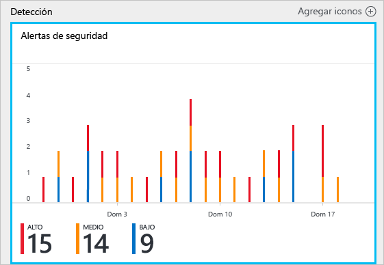
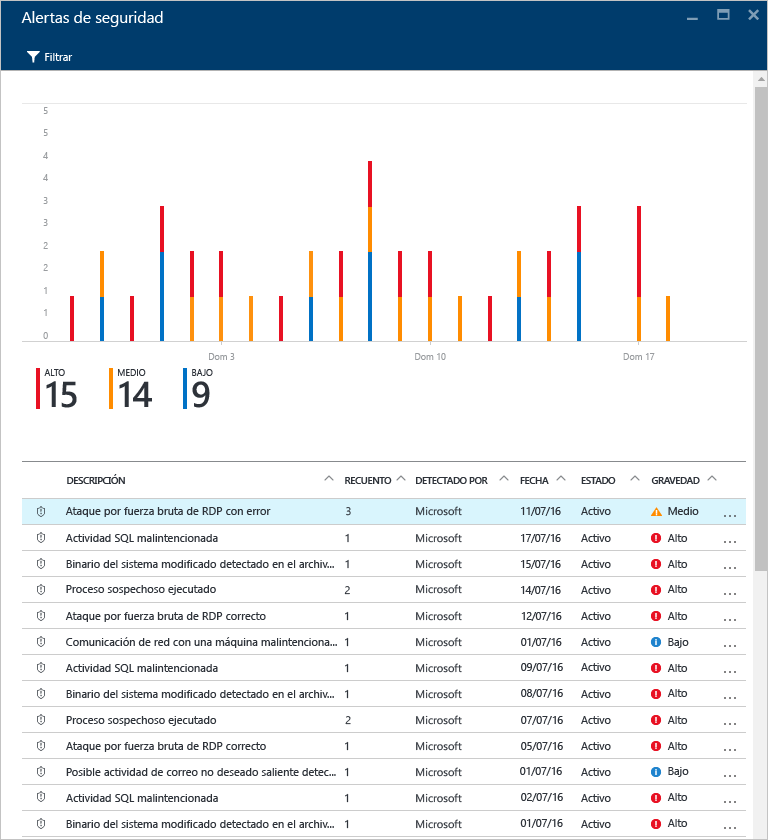
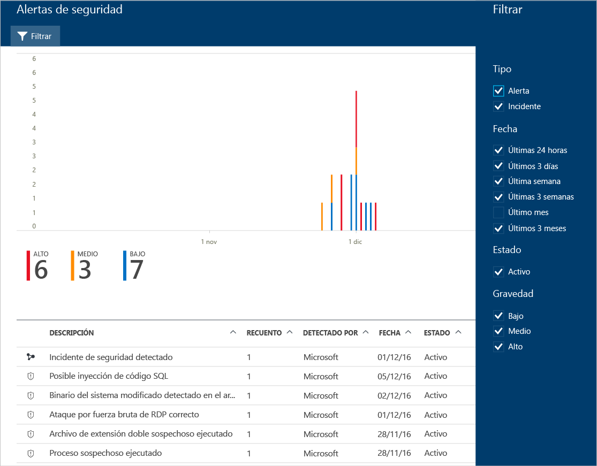
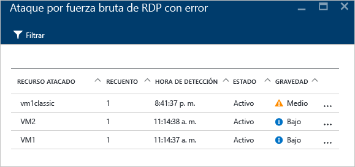
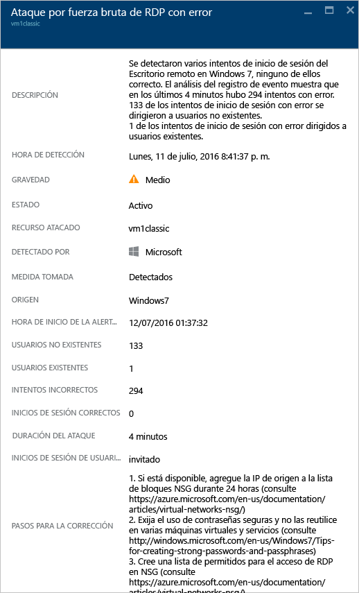

# Administración y respuesta a las alertas de seguridad en el Centro de seguridad de Azure
Este documento le ayuda a usar Azure Security Center para administrar las alertas de seguridad y responder a ellas.

> [!NOTE]
> Para habilitar las detecciones avanzadas, actualice a la versión estándar de Azure Security Center. Hay disponible una versión de evaluación gratuita de 60 días. Para realizar la actualización, seleccione el plan de tarifa en la [directiva de seguridad](security-center-policies.md). Consulte [Precios de Azure Security Center](security-center-pricing.md) para más información.
>
>

## ¿Qué son las alertas de seguridad?
Security Center recopila, analiza e integra automáticamente los datos de registro de los recursos de Azure, la red y las soluciones de asociados conectados, como firewalls y soluciones de protección de puntos de conexión, para detectar amenazas reales y reducir los falsos positivos. En Security Center, se muestra una lista de alertas de seguridad prioritarias, junto con la información que necesita para investigar rápidamente y recomendaciones para corregir un ataque.

> [!NOTE]
> Para más información acerca de cómo actúan las funcionalidades de detección de Security Center, consulte [Funcionalidades de detección de Azure Security Center](security-center-detection-capabilities.md).
>
>

## Administración de alertas de seguridad
Puede revisar las alertas actuales en el icono **Alertas de seguridad** . Siga estos pasos para ver más detalles sobre cada alerta:

1. En el panel Security Center, verá el icono **Alertas de seguridad**.

    

2. Haga clic en el icono para abrir **Alertas de seguridad** y ver más detalles sobre las alertas.

   

En la parte inferior de esta página aparecen los detalles de cada alerta. Para ordenar, haga clic en la columna que desea ordenar. A continuación se muestra la definición de cada columna:

* **Descripción**: una breve explicación de la alerta.
* **Recuento**: una lista de todas las alertas de este tipo específico que se han detectado en un día concreto.
* **Detectado por**: el servicio responsable de desencadenar la alerta.
* **Fecha**: la fecha en que se ha producido el evento.
* **Estado**: el estado actual de esa alerta. Existen dos tipos de servicios:
  * **Activa**: se ha detectado la alerta de seguridad.
* **Gravedad**: el nivel de gravedad, que puede ser alto, medio o bajo.

> [!NOTE]
> Las alertas de seguridad que genera Security Center también aparecerá en el registro de actividad de Azure. Para más información acerca de cómo acceder al registros de actividad en Azure, consulte [Visualización de registros de actividad para auditar las acciones sobre los recursos](https://docs.microsoft.com/azure/azure-resource-manager/resource-group-audit).
>

### Filtrado de alertas
Puede filtrar alertas en función de la fecha, el estado y la gravedad. Puede resultar útil filtrar las alertas en aquellos escenarios en que necesite restringir el ámbito de las alertas de seguridad que se muestran. Por ejemplo, podría comprobar las alertas de seguridad que se produjeron en las 24 horas anteriores, ya que se está investigando una posible brecha en el sistema.

1. Haga clic en **Filtro** en **Alertas de seguridad**. Se abre la hoja **Filtro**, donde podrá seleccionar los valores de fecha, estado y gravedad que desee ver.

    

### Responder a alertas de seguridad
Seleccione una alerta de seguridad para ver más información sobre el evento o los eventos que la desencadenaron y, si existen, los pasos que debe seguir para corregir un ataque. Las alertas de seguridad se agrupan según el tipo y la fecha. Al hacer clic en una alerta de seguridad se abre una página que contiene una lista de las alertas agrupadas.

En este caso, las alertas desencadenadas hacen referencia a las actividades sospechosas del Protocolo de escritorio remoto (RDP). En la primera columna se muestran los recursos atacados, en la segunda, las veces que el recurso fue atacado, en la tercera, la hora en la que se produjo el ataque, en la cuarta, el estado de la alerta y, en la quinta, la gravedad del ataque. Después de revisar esta información, haga clic en el recurso atacado.

En el campo **Descripción**, encontrará más detalles sobre este evento. Estos detalles adicionales ofrecen información detallada sobre lo que activó la alerta de seguridad, el recurso de destino, la dirección IP de origen si corresponde, y recomendaciones sobre cómo corregirla.  En algunos casos, la dirección IP de origen está vacía (no disponible) porque no todos los registros de eventos de seguridad de Windows incluyen la dirección IP.

La corrección sugerida por Security Center varía según la alerta de seguridad. En algunos casos, tendrá que utilizar otras capacidades de Azure para implementar la corrección recomendada. Por ejemplo, la solución para este ataque consiste en colocar la dirección IP que lo está generando en la lista negra mediante una [ACL de red](../virtual-network/virtual-networks-acl.md) o una regla de [grupo de seguridad de red](../virtual-network/virtual-networks-nsg.md). Para más información sobre los distintos tipos de alertas, consulte [Alertas de seguridad por tipo en Azure Security Center](security-center-alerts-type.md).

> [!NOTE]
> Security Center ha lanzado un nuevo conjunto de detecciones en versión preliminar limitada que aprovecha los registros de auditoría, un marco de auditoría común, para detectar comportamientos malintencionados en máquinas Linux. Envíe un correo electrónico con los identificadores de suscripción a [nuestro equipo](mailto:ASC_linuxdetections@microsoft.com) para unirse a la versión preliminar.

## Otras referencias
En este documento ha aprendido a configurar directivas de seguridad en el Centro de seguridad. Para más información sobre el Centro de seguridad, consulte los siguientes recursos:

* [Control de incidentes de seguridad en Azure Security Center](security-center-incident.md)
* [Funcionalidades de detección de Azure Security Center](security-center-detection-capabilities.md)
* [Guía de planeamiento y operaciones de Azure Security Center](security-center-planning-and-operations-guide.md)
* [Preguntas más frecuentes sobre Azure Security Center](security-center-faq.md) : encuentre las preguntas más frecuentes sobre el uso del servicio.
* [Blog de seguridad de Azure](http://blogs.msdn.com/b/azuresecurity/) : encuentre entradas de blog sobre el cumplimiento y la seguridad de Azure.
