# Supervisión del estado de seguridad en el Centro de seguridad de Azure
Este artículo le ayuda a usar las funcionalidades de supervisión de Azure Security Center para supervisar el cumplimiento de las directivas.

## ¿Qué es la supervisión del estado de seguridad?
Con frecuencia se piensa que supervisar es observar y esperar que se produzca un evento, para así poder reaccionar ante la situación. La supervisión de seguridad se refiere a contar con una estrategia proactiva que audita los recursos a fin de identificar los sistemas que no cumplen con los estándares o los procedimientos recomendados de la organización.

## Supervisión del estado de seguridad
Después de habilitar las [directivas de seguridad](security-center-policies.md) para los recursos de una suscripción, Security Center analizará la seguridad de los recursos para identificar vulnerabilidades potenciales. La información acerca de la configuración de la red está disponible de inmediato. Dependiendo del número de máquinas virtuales y de los equipos que tenga con el agente instalado, la recopilación de información sobre máquinas virtuales y la configuración del equipo, como el estado de actualización de seguridad y la configuración del sistema operativo, puede tardar una hora o más en estar disponible. Puede ver el estado de seguridad de sus recursos, además de cualquier problema, en la sección **Prevención**. Una lista de dichos problemas también se puede encontrar en el icono **Recomendaciones**.

Para más información sobre cómo aplicar las recomendaciones, lea [Implementación de recomendaciones de seguridad en Azure Security Center](security-center-recommendations.md).

En la sección **Prevención**, puede supervisar el estado de seguridad de los recursos. En el ejemplo siguiente, puede ver que, en el icono de cada recurso (Compute, Network, Storage y datos, y Aplicación) tiene el número total de problemas que se han identificado.

### Supervisión de proceso
Al hacer clic en el icono **Compute**, verá tres pestañas:

- **Información general**: supervisión y recomendaciones.
- **VM y equipos**: lista de todas las máquinas virtuales, equipos y su estado de seguridad actual.
- **Cloud Services** (Servicios en la nube): lista de todos los roles web y de trabajo que supervisa Security Center.

Todas las pestañas pueden tener varias secciones y en cada una de ella se puede seleccionar cualquiera de las opciones para ver más detalles acerca de los pasos recomendados para abordar un problema concreto.

#### Supervisión de las recomendaciones
En esta sección se muestra el número total de máquinas virtuales y equipos que se inicializaron para el aprovisionamiento automático y sus estados actuales. En este ejemplo hay una recomendación, **Problemas de mantenimiento del agente de supervisión**.  Seleccione esta recomendación.

Se abre **Problemas de mantenimiento del agente de supervisión**. Se enumeran las máquinas virtuales y los equipos que el Centro de seguridad no puede supervisar correctamente. Seleccione una máquina virtual o un equipo para obtener información detallada. **ESTADO DE SUPERVISIÓN** proporciona un motivo por el que Security Center no puede supervisar. Consulte la [Guía de solución de problemas de Security Center](security-center-troubleshooting-guide.md#monitoring-agent-health-issues) para obtener una lista de los valores, las descripciones y los pasos de resolución de **ESTADO DE SUPERVISIÓN**.

#### Recomendaciones
Esta sección contiene un conjunto de [recomendaciones para cada máquina virtual y equipo](security-center-virtual-machine-recommendations.md) que supervisa Azure Security Center. La primera columna muestra la recomendación. La segunda columna muestra el número total de máquinas virtuales y equipos a los que afecta esa recomendación. La tercera columna muestra la gravedad del problema como se muestra en la captura de pantalla siguiente:

> [!NOTE]
> Solo las máquinas virtuales con al menos un punto de conexión público se muestran en **Networking Health** (Estado de red) en la lista de **topología de red**.
>

Cada recomendación tiene un conjunto de acciones que se podrán realizar una vez que haga clic en ella. Por ejemplo, si hace clic en **Faltan las actualizaciones del sistema**, aparece una lista de máquinas virtuales y equipos a los que les faltan revisiones y la gravedad de la actualización que falta, como se muestra en la captura de pantalla siguiente:

Las **actualizaciones del sistema que faltan** tienen un resumen de actualizaciones críticas en formato de grafo, uno para Windows y otro para Linux. La segunda parte tiene una tabla con la siguiente información:

* **NOMBRE**: nombre de la actualización que falta.
* **NÚMERO DE MÁQUINAS VIRTUALES Y EQUIPOS**: número total de máquinas virtuales y equipos que no tienen esta actualización.
* **ESTADO**: el estado actual de la recomendación:
  * **Abierta**: la recomendación aún no se ha abordado.
  * **En curso**: la recomendación se está aplicando actualmente a esos recursos y no se requiere ninguna acción por su parte.
  * **Resuelta**: la recomendación ya terminó. (Si se ha resuelto el problema, la entrada aparecerá atenuada).
* **GRAVEDAD**: describe la gravedad de una recomendación concreta:
  * **Alta**: existe una vulnerabilidad en un recurso importante (aplicación, máquina virtual o grupo de seguridad de red) y requiere atención.
  * **Media**: para completar un proceso o eliminar una vulnerabilidad se requieren pasos adicionales o no críticos.
  * **Baja**: es preciso abordar una vulnerabilidad, pero esta no requiere una atención inmediata. (De manera predeterminada no se muestran las recomendaciones bajas, pero si desea verlas, puede filtrar por ellas).

Para ver los detalles de recomendación, haga clic en el nombre de la actualización que falta en la lista.

> [!NOTE]
> Las recomendaciones de seguridad que se indican aquí son las mismas que aparecen en la opción **Recomendaciones**. Para más información sobre cómo resolver las recomendaciones, consulte [Implementación de recomendaciones de seguridad en Azure Security Center](security-center-recommendations.md). Esto no solo se aplica a máquinas virtuales o equipos, sino también a todos los recursos disponibles en el icono **Resource Health**.
>

#### Sección de máquinas virtuales y equipos
La sección de máquinas virtuales y equipos ofrece una visión general de todas las recomendaciones de máquinas virtuales y equipos. Cada columna representa un conjunto de recomendaciones tal como se muestra en la siguiente captura de pantalla:

Hay cuatro tipos de iconos que se representan en esta lista, como se explica a continuación:

 Equipo que no es de Azure.

 Máquina virtual de Azure Resource Manager.

 Máquina virtual de Azure clásico.

 Máquinas virtuales que se identifican solo desde el área de trabajo que forma parte de la suscripción visualizada. Aquí se incluyen máquinas virtuales de otras suscripciones que informan al área de trabajo de esta suscripción y máquinas virtuales que se instalaron con el agente directo de SCOM y no tienen id. de recurso.

El icono que aparece en cada recomendación le ayuda a identificar rápidamente las máquinas virtuales y los equipos que necesitan atención y el tipo de recomendación. También puede usar la opción **Filtro** para seleccionar las opciones que verá en esta pantalla.

En el ejemplo anterior, una máquina virtual tiene una recomendación crítica sobre la protección del punto de conexión. Para más información sobre la máquina virtual, haga clic en ella:

Aquí verá los detalles de seguridad de la máquina virtual o del equipo. En la parte inferior puede ver la acción recomendada y la gravedad de cada problema.

#### Sección de servicios en la nube
En el caso de los servicios en la nube, se crea una recomendación cuando la versión del sistema operativo está obsoleta, como se muestra en la siguiente captura de pantalla:

En un escenario en el que haya alguna recomendación (lo que no ocurre en el ejemplo anterior), es preciso seguir los pasos descritos en la recomendación para actualizar la versión del sistema operativo. Cuando haya alguna actualización disponible, aparecerá una alerta (su color, rojo o naranja, depende de la gravedad del problema). Al hacer clic en esta alerta en las filas WebRole1 (ejecuta Windows Server con la aplicación web implementada automáticamente en IIS) o WorkerRole1 (ejecuta Windows Server con la aplicación web implementada automáticamente en IIS), puede ver más detalles sobre esta recomendación, como se muestra en la siguiente captura de pantalla:

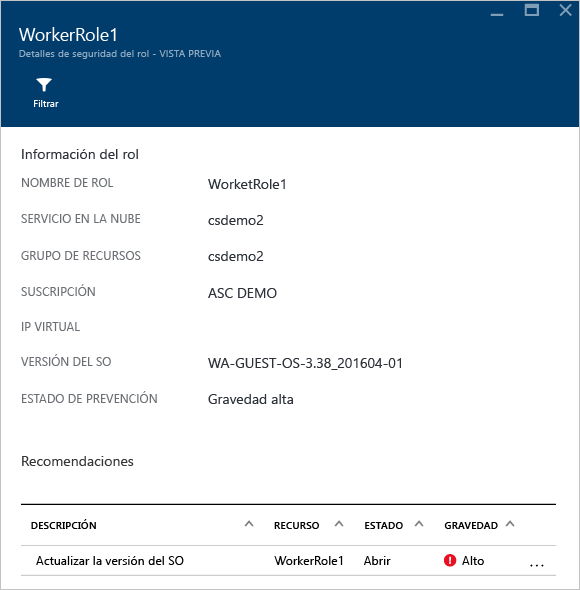

Para ver una explicación más preceptiva con respecto a esta recomendación, haga clic en **Actualizar versión del SO** en la columna **DESCRIPCIÓN**.

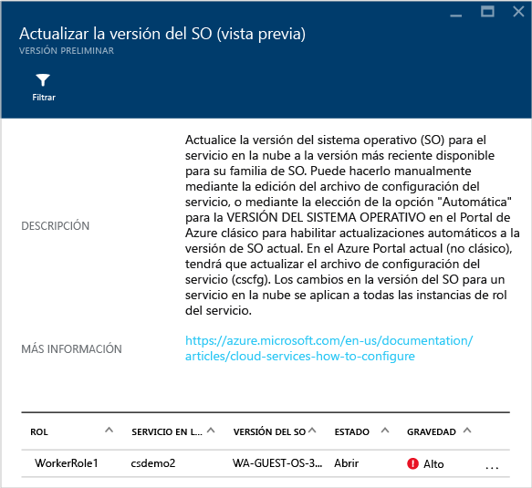  

### Supervisión de redes virtuales
Al hacer clic en el icono **Redes**, se abre la hoja **Redes**, donde encontrará más información, como se muestra en la siguiente captura de pantalla:

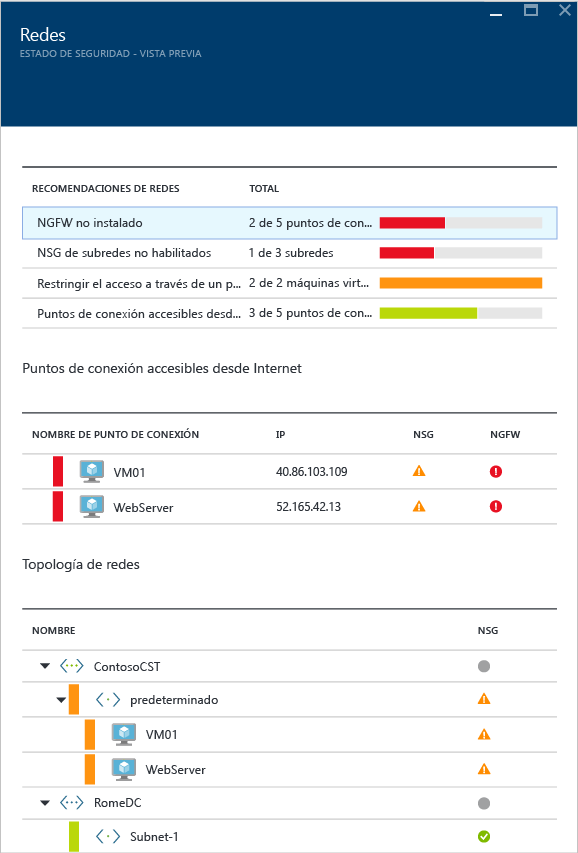

#### Recomendaciones de redes
De manera similar a la información del estado de los recursos de las máquinas virtuales, aquí puede ver una lista resumida de los problemas en la parte superior y una lista de las redes supervisadas en la parte inferior.

La sección de desglose del estado de las redes enumera los potenciales problemas de seguridad y ofrece [recomendaciones](security-center-network-recommendations.md). Entre los posibles problemas se pueden incluir:

* Firewall de próxima generación (NGFW) no instalado
* Grupos de seguridad de red en subredes no habilitados
* Grupos de seguridad de red en máquinas virtuales no habilitados
* Restringir el acceso externo por medio de puntos de conexión externos públicos
* Puntos de conexión con conexión a Internet correctos

Al hacer clic en una recomendación, puede ver más detalles sobre la recomendación, como se muestra en el ejemplo siguiente:

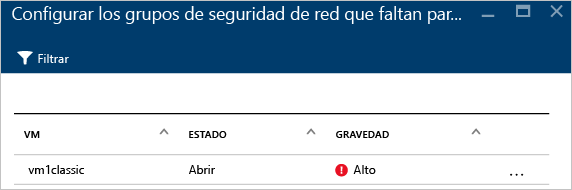

En este ejemplo, la hoja **Configurar los grupos de seguridad de red que faltan para las subredes** tiene una lista de subredes y máquinas virtuales que carecen de la protección de grupo de seguridad de red. Si hace clic en la subred a la que desea aplicar el grupo de seguridad de red, verá la opción **Elegir grupo de seguridad de red**. Aquí puede seleccionar el grupo de seguridad de red más adecuado para la subred o crear uno nuevo.

#### Sección Internet facing endpoints
En la sección **Puntos de conexión accesibles desde Internet**, podrá ver las máquinas virtuales que están configuradas con un punto de conexión accesible desde Internet y su estado actual.

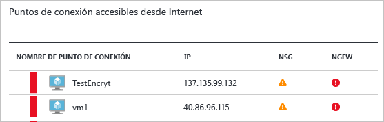

Esta tabla incluye el nombre del punto de conexión que representa la máquina virtual, la dirección IP accesible desde Internet, el estado de gravedad actual del grupo de seguridad de red y el NGFW. La tabla está ordenada por gravedad:

* Rojo (arriba): alta prioridad; se debe solucionar de inmediato.
* Naranja: prioridad media; se debe solucionar lo antes posible.
* Verde (al final): estado de mantenimiento.

#### Sección Networking topology
En la sección **Topología de red**, se ofrece una vista jerárquica de los recursos, como se muestra en la siguiente captura de pantalla:

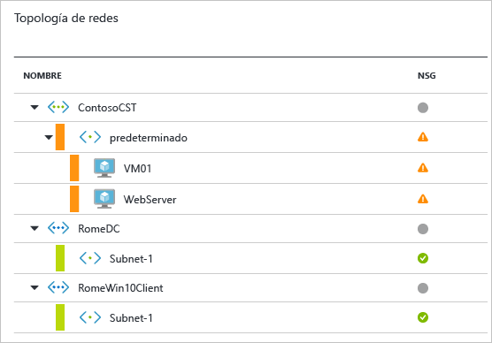

Esta tabla está ordenada (máquinas virtuales y subredes) por gravedad:

* Rojo (arriba): alta prioridad; se debe solucionar de inmediato.
* Naranja: prioridad media; se debe solucionar lo antes posible.
* Verde (al final): estado de mantenimiento.

En esta vista de topología, el primer nivel tiene [redes virtuales](../virtual-network/virtual-networks-overview.md), [puertas de enlace de red virtual](/vpn-gateway/vpn-gateway-site-to-site-create.md) y [redes virtuales (clásicas)](/virtual-network/virtual-networks-create-vnet-classic-pportal.md). El segundo nivel tiene subredes y el tercero, las máquinas virtuales que pertenecen a esas subredes. La columna derecha contiene el estado actual del grupo de seguridad de red para esos recursos, tal como se muestra en el ejemplo siguiente:

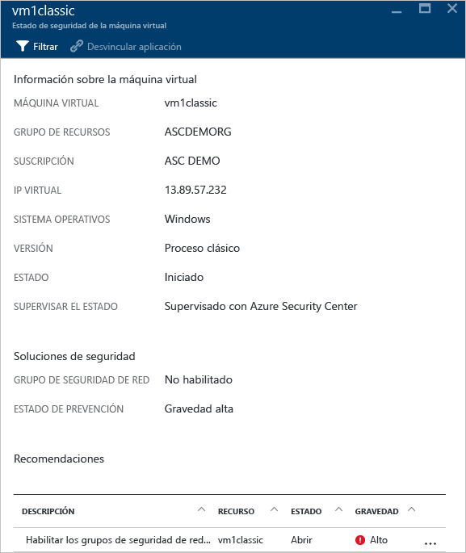

En la parte inferior de esta hoja, aparecerán las recomendaciones para esta máquina virtual, parecidas a las que se han descrito antes. Puede hacer clic en una recomendación para ver más información o aplicar la configuración o el control de seguridad necesario.

### Supervisión de Almacenamiento y datos

Al hacer clic en **Almacenamiento y datos** en la sección **Prevención**, se abre la hoja **Recursos de datos** con las recomendaciones para SQL y Storage. También tiene [recomendaciones](security-center-sql-service-recommendations.md) sobre el estado general de la base de datos. Para más información acerca del cifrado de almacenamiento, consulte [Enable encryption for Azure storage account in Azure Security Center](security-center-enable-encryption-for-storage-account.md) (Habilitación del cifrado para la cuenta de almacenamiento de Azure en Azure Security Center).

En **SQL Recommendations** (Recomendaciones de SQL) puede hacer clic en cualquier recomendación y obtener más detalles acerca de cómo realizar más acciones para resolver un problema. El ejemplo siguiente muestra la expansión de la recomendación **Auditoría de la base de datos y detección de amenazas en bases de datos de SQL**.

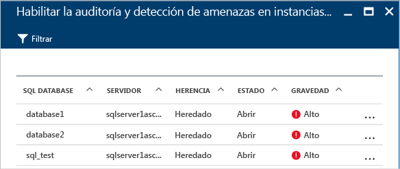

La hoja **Habilitar la auditoría y la detección de amenazas en bases de datos de SQL** contiene la siguiente información:

* Una lista de bases de datos SQL.
* El servidor en el que se encuentran.
* Información sobre si esta configuración se heredó del servidor o si es única en la base de datos.
* El estado actual.
* La gravedad del problema.

Al hacer clic en la base de datos para abordar esta recomendación, se abre la hoja **Auditoría y detección de amenazas**, como se muestra en la siguiente pantalla.

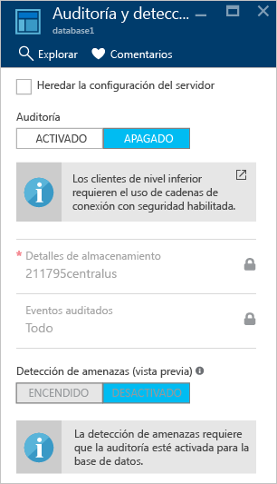

Para habilitar la auditoría, seleccione **Activar** en la opción **Auditoría**.

### Supervisión de aplicaciones

Si la carga de trabajo de Azure tiene aplicaciones en las [máquinas virtuales (creadas con Resource Manager)](../azure-resource-manager/resource-manager-deployment-model.md) con puertos web expuestos (puertos TCP 80 y 443), Security Center puede supervisarlas para identificar posibles problemas de seguridad y recomendar pasos para su corrección. Al hacer clic en el icono **Aplicaciones**, se abre la hoja **Aplicaciones** con una serie de recomendaciones en la sección **Application recommendations** (Recomendaciones de aplicación). También se muestra el desglose de la aplicación por host, IP y dominio y si hay instalada una solución WAF:

Lo mismo que hizo con las demás recomendaciones, puede hacer clic en la recomendación para ver más información sobre el problema y cómo corregirlo. El ejemplo que se muestra en la ilustración siguiente es una aplicación que se identificó como aplicación web no segura. Cuando selecciona la aplicación que se consideró como no segura, está disponible la siguiente opción:

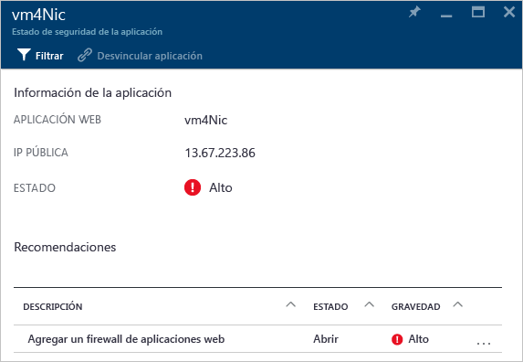

Aquí tiene una lista de todas las recomendaciones para esta aplicación. Al hacer clic en la recomendación **Agregar un firewall de aplicaciones web**, se abre la hoja **Agregar un firewall de aplicaciones web**, en la que encontrará las opciones necesarias para instalar un firewall de aplicaciones web (WAF) de un asociado, como se muestra en la siguiente captura de pantalla.

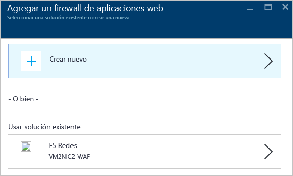

## Otras referencias
En este artículo, aprendió a usar las funcionalidades de supervisión en Azure Security Center. Para obtener más información sobre el Centro de seguridad de Azure, consulte los siguientes recursos:

* [Establecimiento de directivas de seguridad en Azure Security Center](security-center-policies.md): obtenga información sobre cómo configurar los ajustes de seguridad en Azure Security Center.
* [Administración y respuesta a las alertas de seguridad en Azure Security Center](security-center-managing-and-responding-alerts.md): obtenga información sobre cómo administrar y responder a alertas de seguridad.
* [Supervisión de las soluciones de asociados con Azure Security Center](security-center-partner-solutions.md): aprenda a supervisar el estado de mantenimiento de las soluciones de asociados.
* [Preguntas más frecuentes sobre Azure Security Center](security-center-faq.md): encuentre las preguntas más frecuentes sobre el uso del servicio.
* [Blog de seguridad de Azure](http://blogs.msdn.com/b/azuresecurity/): encuentre entradas de blog sobre el cumplimiento y la seguridad de Azure.
