# Supervisión del estado de seguridad en el Centro de seguridad de Azure
Este artículo le ayuda a usar las funcionalidades de supervisión de Azure Security Center para supervisar el cumplimiento de las directivas.

## ¿Qué es la supervisión del estado de seguridad?
Con frecuencia se piensa que supervisar es observar y esperar que se produzca un evento, para así poder reaccionar ante la situación. La supervisión de seguridad se refiere a contar con una estrategia proactiva que audita los recursos a fin de identificar los sistemas que no cumplen con los estándares o los procedimientos recomendados de la organización.

## Supervisión del estado de seguridad
Después de habilitar las [directivas de seguridad](security-center-policies.md) para los recursos de una suscripción, Security Center analizará la seguridad de los recursos para identificar vulnerabilidades potenciales. La información acerca de la configuración de la red está disponible de inmediato. Sin embargo, la información acerca de la configuración de las máquinas virtuales, como el estado de las actualizaciones de seguridad y la configuración del sistema operativo, puede tardar una hora, o más, en estar disponible. Puede consultar el estado de seguridad de sus recursos, además de cualquier problema que exista, en las hojas de **Estado de seguridad de los recursos**. También puede ver una lista de esos problemas en las hojas de **Recomendaciones** .

Para más información sobre cómo aplicar las recomendaciones, lea [Implementación de recomendaciones de seguridad en Azure Security Center](security-center-recommendations.md).

El icono **Estado de seguridad del recurso** permite supervisar el estado de seguridad de los recursos. En el ejemplo siguiente puede ver varios problemas con una gravedad alta y media que requieren atención. Las directivas de seguridad habilitadas afectarán a los tipos de controles que se supervisan.

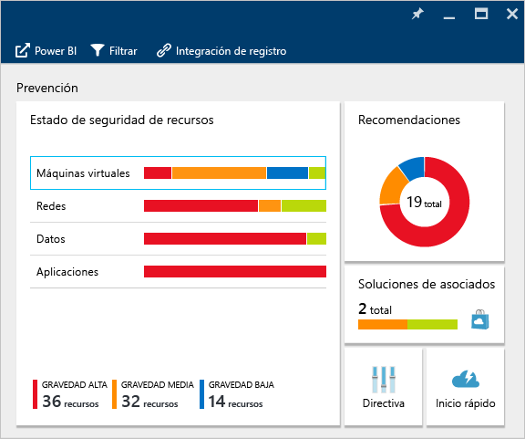

Si Security Center identifica una vulnerabilidad que se debe abordar, como una máquina virtual donde faltan actualizaciones de seguridad o una subred sin un [grupo de seguridad de red](../virtual-network/virtual-networks-nsg.md), se enumerará aquí.

### Supervisión de máquinas virtuales
Al hacer clic en **Máquinas virtuales** en el icono **Estado de seguridad del recurso**, se abrirá la hoja **Máquinas virtuales**, donde encontrará más detalles sobre los pasos de incorporación y prevención, así como una lista de las máquinas virtuales que supervisa Security Center, tal como se muestra en la siguiente captura de pantalla.

* Pasos para la incorporación
* Recomendaciones sobre máquinas virtuales
* Máquinas virtuales

En cada sección puede seleccionar una opción individual para ver más detalles sobre los pasos recomendados para abordar el problema. Las siguientes secciones explican estas áreas con más detalle.

#### Supervisión de las recomendaciones
En esta sección se muestra el número total de máquinas virtuales que se inicializaron para la recopilación de datos y su estado actual. Una vez que se haya inicializado la recopilación de datos en todas las máquinas virtuales, estarán listas para recibir las directivas de seguridad de Security Center. Al hacer clic en esta entrada, se abre la hoja **Estado de la instalación de recopilación de datos**, donde podrá ver los nombres de las máquinas virtuales y el estado actual de la recopilación de datos en la columna **ESTADO DE LA INSTALACIÓN**, como se muestra en la siguiente captura de pantalla.

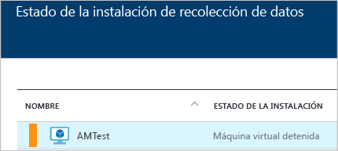

#### Recomendaciones sobre máquinas virtuales
Esta sección contiene un conjunto de [recomendaciones para cada máquina virtual](security-center-virtual-machine-recommendations.md) supervisadas por Azure Security Center. La primera columna muestra la recomendación. La segunda columna muestra el número total de máquinas virtuales a las que afecta esa recomendación. La tercera columna muestra la gravedad del problema como se muestra en la captura de pantalla siguiente.

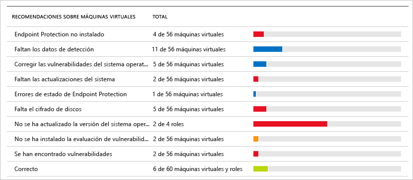

> [!NOTE]
> Solo las máquinas virtuales con al menos un punto de conexión público se muestran en la hoja de **estado de red** en la lista de **topología de red**.
> 
> 

Cada recomendación tiene un conjunto de acciones que se podrán realizar una vez que haga clic en ella. Por ejemplo, si hace clic en **Actualizaciones del sistema que faltan**, se abrirá la hoja **Actualizaciones del sistema que faltan**. En dicha hoja se enumeran las máquinas virtuales a las que faltan revisiones y la gravedad de la actualización que falta, como se muestra en la siguiente captura de pantalla.

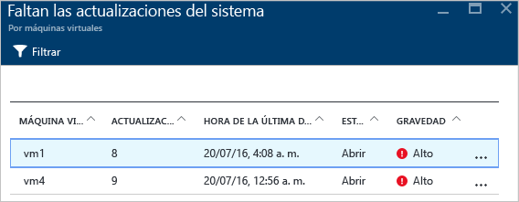

La hoja **Actualizaciones del sistema que faltan** muestra una tabla con la siguiente información:

* **MÁQUINA VIRTUAL**: el nombre de la máquina virtual en la que faltan actualizaciones.
* **ACTUALIZACIONES DEL SISTEMA**: el número actualizaciones del sistema que faltan.
* **HORA DEL ÚLTIMO EXAMEN**: la hora en que Security Center realizó el último examen de la máquina virtual en busca de actualizaciones.
* **ESTADO**: el estado actual de la recomendación:
  * **Abierta**: la recomendación aún no se ha abordado.
  * **En curso**: la recomendación se está aplicando actualmente a esos recursos y no se requiere ninguna acción por su parte.
  * **Resuelta**: la recomendación ya terminó. (Si se ha resuelto el problema, la entrada aparecerá atenuada).
* **GRAVEDAD**: describe la gravedad de una recomendación concreta:
  * **Alta**: existe una vulnerabilidad en un recurso importante (aplicación, máquina virtual o grupo de seguridad de red) y requiere atención.
  * **Media**: para completar un proceso o eliminar una vulnerabilidad se requieren pasos adicionales o no críticos.
  * **Baja**: es preciso abordar una vulnerabilidad, pero esta no requiere una atención inmediata. (De manera predeterminada no se muestran las recomendaciones bajas, pero si desea verlas, puede filtrar por ellas).

Para ver los detalles de las recomendaciones, haga clic en el nombre de la máquina virtual. Aparecerá una nueva hoja para esa máquina virtual con la lista de actualizaciones tal y como se muestra en la siguiente captura de pantalla.

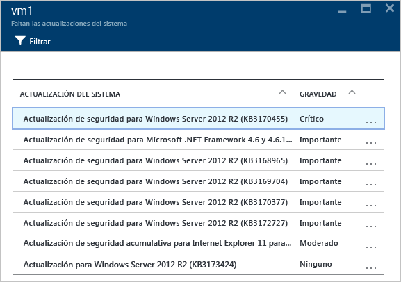

> [!NOTE]
> Las recomendaciones de seguridad son las mismas que aparecen en la hoja **Recomendaciones**. Para más información sobre cómo resolver las recomendaciones, consulte [Implementación de recomendaciones de seguridad en Azure Security Center](security-center-recommendations.md). Esto no se aplica solo a las máquinas virtuales, sino también a todos los recursos disponibles en el icono **Estado de los recursos**.
> 
> 

#### Sección Máquinas virtuales
La sección de máquinas virtuales ofrece una visión general de todas las máquinas virtuales y recomendaciones. Cada columna representa un conjunto de recomendaciones tal como se muestra en la siguiente captura de pantalla:

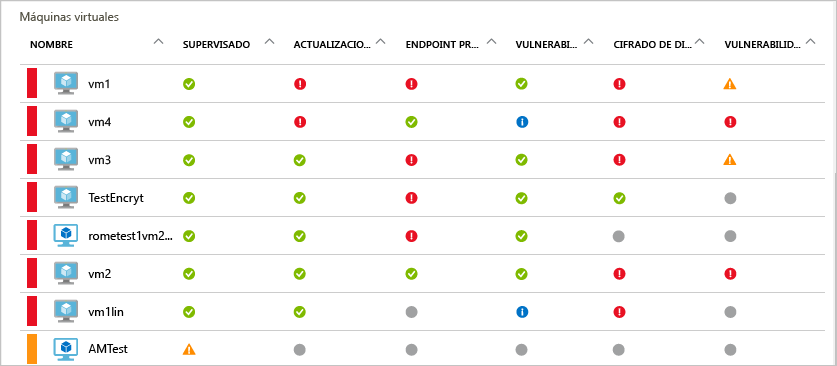

El icono que aparece en cada recomendación le ayuda a identificar rápidamente tanto las máquinas virtuales que necesitan atención como el tipo de recomendación que necesitan.

En el ejemplo anterior, una máquina virtual tiene una recomendación crítica sobre la protección del punto de conexión. Para más información acerca de la máquina virtual, haga clic en ella. Se abrirá una nueva hoja que representa a esta máquina virtual como se muestra en la captura de pantalla siguiente.

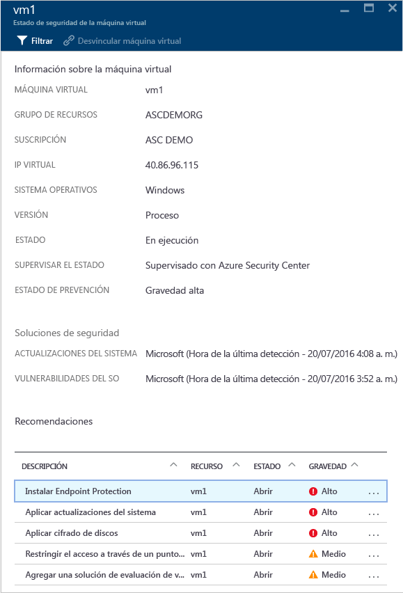

Esta hoja tiene los detalles de seguridad de la máquina virtual. En la parte inferior de la hoja puede ver la acción recomendada y la gravedad de cada problema.

#### Sección Servicios en la nube (versión preliminar)
El estado de mantenimiento de los servicios en la nube se incluye en el icono de **estado de seguridad** de las máquinas virtuales. Se crea una recomendación cuando la versión del sistema operativo es antigua como se muestra en la siguiente captura de pantalla:

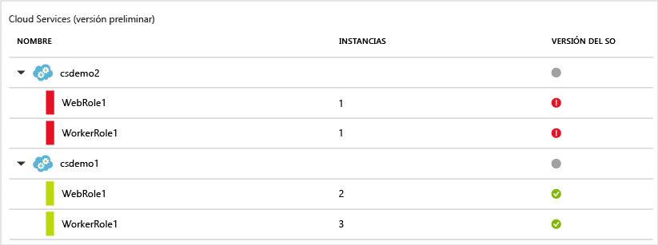

Es necesario que siga los pasos de la recomendación para actualizar la versión del sistema operativo. Por ejemplo, si hace clic en la alerta roja en las filas de WebRole1 (ejecuta Windows Server con la aplicación web implementada automáticamente en IIS) o en WorkerRole1 (ejecuta Windows Server con la aplicación web implementada automáticamente en IIS), se abrirá una nueva hoja con más detalles sobre esta recomendación, como se muestra en la siguiente captura de pantalla:

Para ver una explicación más preceptiva con respecto a esta recomendación, haga clic en **Actualizar versión del SO** en la columna **DESCRIPCIÓN**. Se abrirá la hoja **Actualizar versión del SO (versión preliminar)** con más detalles.

  

### Supervisión de redes virtuales
Al hacer clic en **Redes** en el icono **Estado de seguridad del recurso**, se abrirá la hoja **Redes**, donde encontrará más detalles, tal como se muestra en la siguiente captura de pantalla:

#### Recomendaciones de redes
De manera similar a la información del estado de los recursos de las máquinas virtuales, esta hoja proporciona una lista resumida de los problemas en la parte superior de la hoja y una lista de las redes supervisadas en la parte inferior.

La sección de desglose del estado de las redes enumera los potenciales problemas de seguridad y ofrece [recomendaciones](security-center-network-recommendations.md). Entre los posibles problemas se pueden incluir:

* Firewall de próxima generación (NGFW) no instalado
* Grupos de seguridad de red en subredes no habilitados
* Grupos de seguridad de red en máquinas virtuales no habilitados
* Restringir el acceso externo por medio de puntos de conexión externos públicos
* Puntos de conexión con conexión a Internet correctos

Al hacer clic en una recomendación, se abre una hoja nueva con más detalles acerca de la recomendación, como se muestra en el ejemplo siguiente.

En este ejemplo, la hoja **Configurar los grupos de seguridad de red que faltan para las subredes** tiene una lista de subredes y máquinas virtuales que carecen de la protección de grupo de seguridad de red. Si hace clic en la subred a la que desea aplicar el grupo de seguridad de red, se abrirá otra hoja.

En la hoja **Elegir grupo de seguridad de red**, puede seleccionar el grupo de seguridad de red más adecuado para la subred o crear uno.

#### Sección Internet facing endpoints
En la sección **Puntos de conexión accesibles desde Internet**, podrá ver las máquinas virtuales que están configuradas con un punto de conexión accesible desde Internet y su estado actual.

Esta tabla incluye el nombre del punto de conexión que representa la máquina virtual, la dirección IP accesible desde Internet, el estado de gravedad actual del grupo de seguridad de red y el NGFW. La tabla está ordenada por gravedad:

* Rojo (arriba): alta prioridad; se debe solucionar de inmediato.
* Naranja: prioridad media; se debe solucionar lo antes posible.
* Verde (al final): estado de mantenimiento.

#### Sección Networking topology
En la sección **Topología de red**, se ofrece una vista jerárquica de los recursos, como se muestra en la siguiente captura de pantalla:

Esta tabla está ordenada (máquinas virtuales y subredes) por gravedad:

* Rojo (arriba): alta prioridad; se debe solucionar de inmediato.
* Naranja: prioridad media; se debe solucionar lo antes posible.
* Verde (al final): estado de mantenimiento.

En esta vista de topología, el primer nivel tiene [redes virtuales](../virtual-network/virtual-networks-overview.md), [puertas de enlace de red virtual](../vpn-gateway/vpn-gateway-site-to-site-create.md) y [redes virtuales (clásicas)](../virtual-network/virtual-networks-create-vnet-classic-pportal.md). El segundo nivel tiene subredes y el tercero, las máquinas virtuales que pertenecen a esas subredes. La columna derecha contiene el estado actual del grupo de seguridad de red para esos recursos, tal como se muestra en el ejemplo siguiente:

En la parte inferior de esta hoja, aparecerán las recomendaciones para esta máquina virtual, parecidas a las que se han descrito antes. Puede hacer clic en una recomendación para ver más información o aplicar la configuración o el control de seguridad necesario.

### Supervisión de datos
Al hacer clic en **Datos** en el icono **Resources security health** (Estado de seguridad de recursos), se abrirá la hoja **SQL**, que contiene recomendaciones para problemas como el hecho de que no estén habilitados la auditoría ni el cifrado de datos transparente. También tiene [recomendaciones](security-center-sql-service-recommendations.md) sobre el estado general de la base de datos.

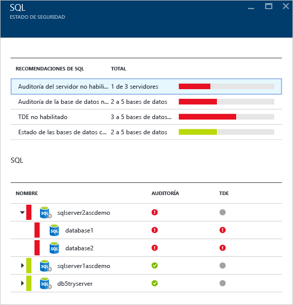

Puede hacer clic en cualquier recomendación y obtener más detalles acerca de cómo realizar más acciones para resolver un problema. El ejemplo siguiente muestra la expansión de la recomendación **Auditoría de la base de datos no habilitada**.

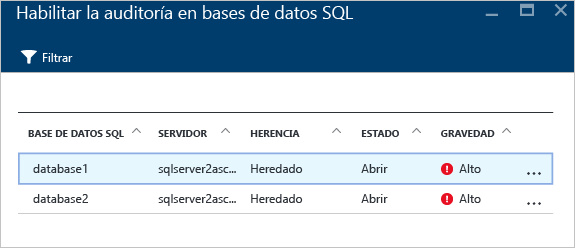

La hoja **Habilitar la auditoría en bases de datos SQL** contiene la siguiente información:

* Una lista de bases de datos SQL.
* El servidor en el que se encuentran.
* Información sobre si esta configuración se heredó del servidor o si es única en la base de datos.
* El estado actual.
* La gravedad del problema.

Al hacer clic en la base de datos para abordar esta recomendación, se abrirá la hoja **Auditoría y detección de amenazas**, como se muestra en la siguiente captura de pantalla.

Para habilitar la auditoría, seleccione **Activar** en la opción **Auditoría**.

### Supervisión de aplicaciones
Si la carga de trabajo de Azure tiene aplicaciones en las [máquinas virtuales (creadas con Resource Manager)](../resource-manager-deployment-model.md) con puertos web expuestos (puertos TCP 80 y 443), Security Center puede supervisarlas para identificar posibles problemas de seguridad y recomendar pasos para su corrección. Al hacer clic en el icono **Aplicaciones**, se abrirá la hoja **Aplicaciones** con una serie de recomendaciones en la sección de **pasos de prevención**. También mostrará el desglose de la aplicación por host o IP virtual, tal como aparece en la siguiente captura de pantalla.

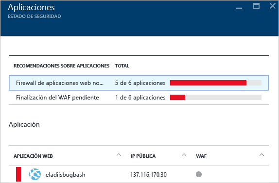

Al igual que en las restantes recomendaciones, puede hacer clic en ella para ver más información acerca del problema y cómo corregirlo. El ejemplo que se muestra en la ilustración siguiente es una aplicación que se identificó como aplicación web no segura. Cuando selecciona la aplicación que se consideró como no segura, se abre otra hoja con la siguiente opción disponible:

Esta hoja tendrá una lista de todas las recomendaciones para esta aplicación. Al hacer clic en la recomendación **Agregar un firewall de aplicaciones web**, se abrirá la hoja **Agregar un firewall de aplicaciones web**, en la que encontrará las opciones necesarias para instalar un firewall de aplicaciones web (WAF) de un asociado, como se muestra en la siguiente captura de pantalla.

## Consulte también
En este artículo, aprendió a usar las funcionalidades de supervisión en Azure Security Center. Para obtener más información sobre el Centro de seguridad de Azure, consulte los siguientes recursos:

* [Establecimiento de directivas de seguridad en Azure Security Center](security-center-policies.md): obtenga información sobre cómo configurar los ajustes de seguridad en Azure Security Center.
* [Administración y respuesta a las alertas de seguridad en Azure Security Center](security-center-managing-and-responding-alerts.md): obtenga información sobre cómo administrar y responder a alertas de seguridad.
* [Supervisión de las soluciones de asociados con Azure Security Center](security-center-partner-solutions.md): aprenda a supervisar el estado de mantenimiento de las soluciones de asociados.
* [Preguntas más frecuentes sobre Azure Security Center](security-center-faq.md): encuentre las preguntas más frecuentes sobre el uso del servicio.
* [Blog de seguridad de Azure](http://blogs.msdn.com/b/azuresecurity/): encuentre entradas de blog sobre el cumplimiento y la seguridad de Azure.

<!---HONumber=Nov16_HO2-->

