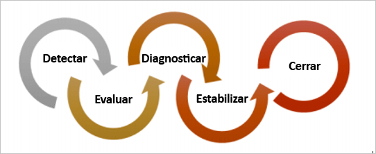
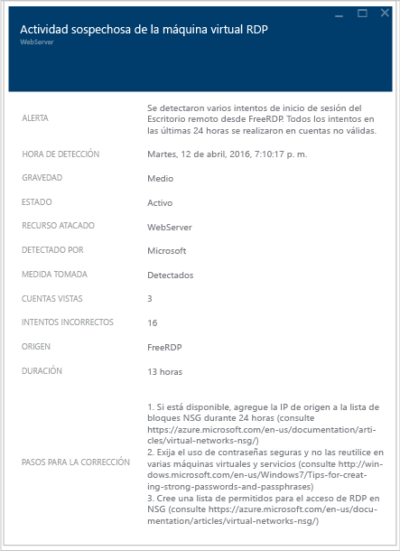

# Guía de planeamiento y operaciones de Azure Security Center
Esta guía está destinada a profesionales de tecnologías de la información (TI), arquitectos de TI, analistas de seguridad de la información y administradores de la nube cuyas organizaciones estén planeando utilizar Azure Security Center.

    
## Guía de planeamiento
Esta guía abarca un conjunto de pasos y tareas que se pueden seguir para optimizar el uso de Security Center en función de los requisitos de seguridad y el modelo de administración de nube de su organización. Para poder beneficiarse plenamente de Security Center, es importante comprender cómo distintas personas o equipos de su organización usarán el servicio para satisfacer las necesidades relativas al desarrollo y las operaciones seguros, la supervisión, el gobierno y la respuesta a incidentes. Las áreas clave que se deben tener en cuenta al planear el uso de Security Center son:

* Roles de seguridad y controles de acceso
* Directivas de seguridad y recomendaciones
* Recopilación de datos y almacenamiento
* Recursos que no son de Azure en curso
* Supervisión continuada de la seguridad
* Respuesta a los incidentes

En la siguiente sección obtendrá información sobre cómo planear cada una de esas áreas y aplicar las recomendaciones según sus requisitos.

> [!NOTE]
> Lea en [Preguntas más frecuentes sobre Azure Security Center](security-center-faq.md) una lista de preguntas habituales que también pueden ser útiles durante la fase de diseño y planeamiento.
> 

## Roles de seguridad y controles de acceso
Según el tamaño y la estructura de su organización, puede que varias personas y equipos usen Security Center para llevar a cabo diferentes tareas relacionadas con la seguridad. En el siguiente diagrama se ofrece un ejemplo de personas ficticias y sus respectivos roles y responsabilidades en cuanto a la seguridad:

Security Center hace posible que estos usuarios cumplan estas diversas responsabilidades. Por ejemplo: 

**Jeff (Propietario de la carga de trabajo)**

* Administración de una carga de trabajo de nube y sus recursos relacionados
* Responsable de la implementación y el mantenimiento de las protecciones de acuerdo con la directiva de seguridad de la empresa

**Ellen (CISO/CIO)**

* Responsable de todos los aspectos de seguridad de la empresa
* Desea comprender la postura de la empresa en materia de seguridad con respecto a las cargas de trabajo de nube
* Se le debe informar de los riesgos y ataques principales

**David (Seguridad de TI)**

* Define directivas de seguridad de la empresa para garantizar que existen las protecciones adecuadas
* Supervisa el cumplimiento con directivas
* Genera informes para la dirección ejecutiva o los auditores

**Judy (Operaciones de seguridad)**

* Supervisa y responde a alertas de seguridad las 24 horas, los 7 días de la semana
* Transfiere el problema al propietario de la carga de trabajo de nube o al analista de seguridad de TI

**Sam (Analista de seguridad)**

* Investigación de los ataques
* Trabajar con el propietario de la carga de trabajo de nube para aplicar correcciones 

Security Center usa el [control de acceso basado en rol (RBAC)](../active-directory/role-based-access-control-configure.md), que proporciona [roles integrados](../active-directory/role-based-access-built-in-roles.md) que se pueden asignar a usuarios, grupos y servicios en Azure. Cuando un usuario abre Security Center, solo ve la información relacionada con los recursos a los que tienen acceso. Esto significa que al usuario se le asigna el rol de Propietario, Colaborador o Lector para la suscripción o el grupo de recursos a los que pertenece un recurso. Además de estos roles, hay dos roles específicos de Security Center:

- **Lector de seguridad**: un usuario que pertenece a este rol solo puede ver las configuraciones de Security Center, que incluyen recomendaciones, alertas, directivas y estados, pero no puede realizar cambios.
- **Administrador de seguridad**: igual que el lector de seguridad pero también puede actualizar la directiva de seguridad o descartar recomendaciones y alertas.

Los roles de Security Center descritos anteriormente no tienen acceso a otras áreas de servicio de Azure, como Storage, Web y móvil o Internet de las cosas.  

> [!NOTE]
> El usuario debe ser al menos propietario de una suscripción o de un grupo de recursos, o ser colaborador de estos, para poder ver Security Center en Azure. 
> 
> 

Con las personas que se explican en este diagrama, sería necesario el siguiente control de acceso basado en rol (RBAC):

**Jeff (Propietario de la carga de trabajo)**

* Propietario o colaborador del grupo de recursos

**David (Seguridad de TI)**

* Propietario o colaborador de la suscripción o administrador de seguridad

**Judy (Operaciones de seguridad)**

* Lector de suscripción o lector de seguridad para ver alertas
* Debe ser propietario o colaborador de la suscripción o administrador de seguridad para descartar alertas

**Sam (Analista de seguridad)**

* Lector de la suscripción para ver las alertas
* Debe ser propietario o colaborador de la suscripción para descartar las alertas
* Puede requerir acceso al área de trabajo

Otra información importante que se debe tener en cuenta:

* Solo los propietarios o colaboradores de la suscripción y los administradores de seguridad pueden editar una directiva de seguridad
* Los únicos que pueden aplicar recomendaciones de seguridad para un recurso son los propietarios y los colaboradores de la suscripción y del grupo de recursos.

Cuando planee el control de acceso mediante RBAC para Security Center, asegúrese de comprender quiénes en su organización van a usar Security Center. También, los tipos de tareas que realizarán, y luego configure RBAC en consecuencia.

> [!NOTE]
> Es recomendable que asigne el rol de menos permisos que los usuarios necesiten para realizar sus tareas. Por ejemplo, a los usuarios que solo necesiten ver información sobre el estado de seguridad de los recursos, pero no llevar a cabo acciones como aplicar recomendaciones o editar directivas, se les debe asignar el rol Lector.
> 
> 

## Directivas de seguridad y recomendaciones
Una directiva de seguridad define la configuración deseada de las cargas de trabajo. Además, ayuda a garantizar el cumplimiento de los requisitos de seguridad normativos o de la empresa. En Security Center, puede definir directivas para las suscripciones de Azure, que se pueden adaptar al tipo de carga de trabajo o la confidencialidad de los datos.

Las directivas de Security Center contienen los componentes siguientes:
- [Recopilación de datos](https://docs.microsoft.com/azure/security-center/security-center-enable-data-collection): configuración de colección de datos y aprovisionamiento de agente.
- [Directiva de seguridad](https://docs.microsoft.com/azure/security-center/security-center-policies): una [directiva de Azure](http://docs.microsoft.com/azure/azure-policy/azure-policy-introduction) que determina qué controles supervisa y recomienda Security Center. También puede usar Azure Policy para crear nuevas definiciones, definir directivas adicionales y asignar directivas en los grupos de administración.
- [Notificaciones por correo electrónico](https://docs.microsoft.com/azure/security-center/security-center-provide-security-contact-details): configuración de contactos de seguridad y notificaciones.
- [Nivel de precios](https://docs.microsoft.com/azure/security-center/security-center-pricing): selección de precios de nivel gratuito o estándar, que determina qué características de Security Center están disponibles para los recursos en el ámbito (se puede especificar para suscripciones, grupos de recursos y áreas de trabajo).

> [!NOTE]
> Al especificar un contacto de seguridad se garantiza que Azure puede llegar a la persona adecuada de su organización si se produce un incidente de seguridad. Consulte [Proporcionar detalles de contacto de seguridad en Azure Security Center](https://docs.microsoft.com/azure/security-center/security-center-provide-security-contact-details) para más información sobre cómo habilitar esta recomendación.

### Definiciones y recomendaciones de directivas de seguridad
Security Center crea automáticamente una directiva de seguridad predeterminada para cada una de las suscripciones de Azure. Puede modificar la directiva en Security Center o usar Azure Policy para crear nuevas definiciones, definir directivas adicionales y asignar directivas en grupos de administración (que pueden representar toda la organización, una unidad de negocio de ella, etc.) y supervisar el cumplimiento de estas directivas en estos ámbitos.

Antes de configurar las directivas de seguridad, revise cada una de las [recomendaciones de seguridad](https://docs.microsoft.com/azure/security-center/security-center-recommendations)y determine si son adecuadas para los diversos grupos de recursos y suscripciones. También es importante entender qué acción debe realizarse para abordar las recomendaciones de seguridad y qué persona de su organización será responsable de supervisar las nuevas recomendaciones y llevar a cabo los pasos necesarios.

## Recopilación de datos y almacenamiento
Azure Security Center usa Microsoft Monitoring Agent, que es el mismo agente que usan la solución Operations Management Suite y el servicio Log Analytics, para recopilar datos de seguridad de las máquinas virtuales. Los [datos recopilados](https://docs.microsoft.com/azure/security-center/security-center-enable-data-collection) por este agente se almacenan en las áreas de trabajo de Log Analytics.

### Agente

Cuando el aprovisionamiento automático está habilitado en la directiva de seguridad, Microsoft Monitoring Agent (para [Windows](https://docs.microsoft.com/azure/log-analytics/log-analytics-windows-agents) o [Linux](https://docs.microsoft.com/azure/log-analytics/log-analytics-linux-agents)) se instala en todas las máquinas virtuales de Azure admitidas y en las nuevas que se hayan creado. Si la máquina virtual o el equipo ya tienen instalado Microsoft Monitoring Agent, Azure Security Center aprovechará al agente instalado actual. El proceso del agente está diseñado para que no sea invasivo y tenga un impacto mínimo sobre el rendimiento de la máquina virtual.

Microsoft Monitoring Agent para Windows requiere el uso del puerto TCP 443. Para más información, consulte el [artículo de solución de problemas](security-center-troubleshooting-guide.md).

Si en algún momento desea deshabilitar la recopilación de datos, puede desactivarla en la directiva de seguridad. Sin embargo, como Microsoft Monitoring Agent se puede usar en otros servicios de administración y supervisión de Azure, el agente no se desinstalará automáticamente cuando desactive la recopilación de datos en  Security Center. En caso necesario, puede desinstalar el agente manualmente.

> [!NOTE]
> Para encontrar una lista de máquinas virtuales admitidas, lea las [preguntas frecuentes sobre Azure Security Center](security-center-faq.md).
> 

### Área de trabajo

Un área de trabajo es un recurso de Azure que actúa como contenedor de los datos. Tanto usted como otros miembros de la organización pueden usar varias áreas de trabajo para administrar diferentes conjuntos de datos, recopilados a partir de toda la infraestructura de TI o de algunos de sus componentes.

Los datos recopilados por Microsoft Monitoring Agent (en nombre de Azure Security Center) se almacenarán en las áreas de trabajo existentes de Log Analytics asociadas con la suscripción de Azure o en unas nuevas áreas de trabajo, según la región geográfica de la máquina virtual. 

En el portal de Azure, puede realizar una exploración para ver una lista de las áreas de trabajo de Log Analytics, incluidas las creadas por Azure Security Center. Se creará un grupo de recursos relacionado para las nuevas áreas de trabajo. Ambas siguen esta convención de nomenclatura: 

* Área de trabajo: *DefaultWorkspace-[subscription-ID]-[geo]*
* Grupo de recursos: *DefaultResouceGroup-[geo]*

En el caso de las áreas de trabajo creadas por Azure Security Center, los datos se conservan durante 30 días. En las áreas de trabajo existentes, la retención se basa en el plan de tarifa del área de trabajo. Si lo desea, también puede usar un área de trabajo existente.

> [!NOTE]
> Microsoft está totalmente comprometido a proteger la privacidad y la seguridad de estos datos. Microsoft se adhiere a instrucciones estrictas de seguridad y cumplimiento de normas, desde la codificación hasta la operación de un servicio. Para más información sobre el control de datos y la privacidad, lea [Seguridad de datos de Azure Security Center](security-center-data-security.md).
> 

## Incorporación de recursos que no son de Azure

Security Center puede supervisar la situación de seguridad de los equipos que no son de Azure, pero para ello antes hay que incorporar esos recursos. Para más información sobre cómo incorporar recursos que no son de Azure, lea [Incorporación a Azure Security Center Estándar para una seguridad mejorada](https://docs.microsoft.com/azure/security-center/security-center-onboarding#onboard-non-azure-computers).

## Supervisión continuada de la seguridad
Después de la configuración inicial y la aplicación de las recomendaciones de Security Center, el siguiente paso consiste en considerar los procesos operativos de Security Center.

La información general de Security Center proporciona una vista unificada de la seguridad en todos los recursos de Azure y los recursos que no son de Azure que ha conectado. En el ejemplo siguiente se muestra un entorno con muchos problemas que se deben solucionar:

> [!NOTE]
> Security Center no interferirá en los procedimientos operativos normales, sino que supervisará de forma pasiva las implementaciones y proporcionará recomendaciones basadas en las directivas de seguridad que se hayan habilitado.

Cuando elige por primera vez usar Security Center para su entorno actual de Azure, debe asegurarse de revisar todas las recomendaciones. Puede hacerlo en el icono **Recomendaciones** o por recurso (**Compute**, **Redes**, **Almacenamiento y datos** y **Aplicación**).

Después de que procese todas las recomendaciones, la sección **Prevención** debería aparecer en verde para los recursos correspondientes. A partir de este momento, la supervisión continua resulta más sencilla, ya que solo tomará medidas en respuesta a los cambios en los iconos de recomendaciones y estado de seguridad.

La sección **Detección** es más reactiva, ya que se trata de alertas sobre los problemas que están ocurriendo en ese momento o que ocurrieron en el pasado y se detectaron en los controles de Security Center y sistemas de terceros. El icono Alertas de seguridad mostrará gráficos de barras que representan el número de alertas de detección de amenazas encontradas cada día y su distribución entre las diversas categorías de gravedad (baja, media, alta). Para más información sobre Alertas de seguridad, lea [Administración y respuesta a las alertas de seguridad en Azure Security Center](security-center-managing-and-responding-alerts.md).

Planee la visita a la opción de [inteligencia sobre amenazas](https://docs.microsoft.com/azure/security-center/security-center-threat-intel) como parte de las operaciones de seguridad diarias. Ahí puede identificar las amenazas de seguridad en el entorno, como determinar si un determinado equipo es parte de una red de robots (botnet).

### Supervisión de recursos nuevos o modificados
La mayor parte de los entornos de Azure son dinámicos, con incorporaciones o retiradas periódicas de recursos, configuraciones o cambios, etc. Security Center ayuda a garantizar la visibilidad del estado de seguridad de estos nuevos recursos.

Cuando agregue nuevos recursos (máquinas virtuales, bases de datos SQL) a su entorno de Azure, Security Center los detectará automáticamente y empezará a supervisar su seguridad. Esto también incluye los roles web de PaaS y los roles de trabajo. Si la recopilación de datos está habilitada en la [directiva de seguridad](security-center-policies.md), se habilitarán automáticamente funcionalidades de supervisión adicionales para las máquinas virtuales.

1. En máquinas virtuales, haga clic en **Compute**, en la sección **Prevención**. Cualquier problema con la habilitación de los datos o recomendaciones relacionadas aparecerán en la pestaña **Información general** y la sección **Monitoring Recommendations** (Recomendaciones de supervisión).
2. Vea las **recomendaciones** para comprobar si se identificó algún riesgo de seguridad para el nuevo recurso.
3. Es muy habitual que cuando se agregan nuevas máquinas virtuales a su entorno, al principio solo esté instalado el sistema operativo. Es posible que el propietario del recurso tarde un tiempo en implementar otras aplicaciones que se usarán en estas máquinas virtuales.  Idealmente, debe conocer el objetivo final de esta carga de trabajo. ¿Va a ser un servidor de aplicaciones? En función de lo que vaya a ser esta nueva carga de trabajo, puede habilitar la **directiva de seguridad**correspondiente, lo cual es el tercer paso de este flujo de trabajo.
4. A medida que se agreguen nuevos recursos a su entorno de Azure, es posible que aparezcan nuevas alertas en el icono **Alertas de seguridad** . Compruebe siempre si hay nuevas alertas en este icono y actúe según las recomendaciones de Security Center.

También debería supervisar periódicamente el estado de los recursos existentes para identificar los cambios de configuración que hayan creado riesgos de seguridad, la separación respecto a las líneas base recomendadas y las alertas de seguridad. Comience en el panel de Security Center. Desde allí deberá revisar tres áreas principales de forma periódica.

1. En el panel de la sección **Prevención** se proporciona acceso rápido a los recursos principales. Use esta opción para supervisar los recursos Compute, Redes, Almacenamiento y datos y Aplicación.
2. El panel **Recomendaciones** permite revisar las recomendaciones de Security Center. Durante la supervisión continuada, es posible que no vea recomendaciones todos los días, lo cual es normal ya que procesó todas las recomendaciones durante la configuración inicial de Security Center. Por este motivo, es posible que no aparezca en esta sección información nueva todos los días y solo tenga que acceder a ella cuando sea necesario.
3. La sección **Detección** podría cambiar con mucha frecuencia o con muy poca. Revise siempre las alertas de seguridad y tome medidas basadas en las recomendaciones de Security Center.

### Protección de acceso y aplicaciones

Como parte de las operaciones de seguridad, también debe adoptar medidas preventivas para restringir el acceso a las máquinas virtuales y controlar las aplicaciones que se ejecutan en ellas. Si bloquea el tráfico entrante a las máquinas virtuales de Azure, reduce la exposición a los ataques y, al mismo tiempo, proporciona un acceso fácil para conectarse a ellas cuando es necesario. Use la característica [Acceso a VM Just-In-Time](https://docs.microsoft.com/azure/security-center/security-center-just-in-time) para proteger el acceso a las máquinas virtuales. 

Puede usar [controles de aplicación adaptables](https://docs.microsoft.com/azure/security-center/security-center-adaptive-application) como ayuda para controlar qué aplicaciones se pueden ejecutar en las máquinas virtuales que se encuentran en Azure y, entre otras ventajas, le ayudan a proteger las máquinas virtuales frente a malware. Security Center usa el aprendizaje automático para analizar los procesos que se ejecutan en la máquina virtual y le ayuda a aplicar reglas de inclusión en listas de permitidos con esta inteligencia.

## Respuesta a los incidentes
Security Center detecta amenazas y alerta sobre ellas a medida que se producen. Las organizaciones deben estar al tanto de las nuevas alertas de seguridad y tomar medidas según sea necesario para investigarlas o solucionar el ataque. Para más información sobre cómo funciona la detección de amenazas de Security Center, consulte [Funcionalidades de detección de Azure Security Center](security-center-detection-capabilities.md).

Aunque el objetivo de este artículo no es ayudarle a crear su propio plan de respuesta a incidentes, vamos a usar las respuestas de seguridad de Microsoft Azure en el ciclo de vida de la nube como base para las fases de la respuesta a incidentes. Estas fases se muestran en el diagrama siguiente:

> [!NOTE]
> Puede usar la guía [Computer Security Incident Handling Guide](http://nvlpubs.nist.gov/nistpubs/SpecialPublications/NIST.SP.800-61r2.pdf) sobre el tratamiento de los incidentes de seguridad informática del National Institute of Standards and Technology (NIST) de EE. UU. como ayuda para crear el suyo propio.
> 

Puede utilizar alertas de Security Center durante las fases siguientes:

* **Detectar**: identifique una actividad sospechosa en uno o varios recursos. 
* **Evaluar**: realice la evaluación inicial para más información acerca de la actividad sospechosa.
* **Diagnosticar**: siga los pasos de corrección para llevar a cabo el procedimiento técnico para solucionar el problema.

Cada alerta de seguridad proporciona información que sirve para comprender la naturaleza del ataque y sugerir posibles mitigaciones. Algunas alertas también proporcionan vínculos a más datos o a otras fuentes de información dentro de Azure. Puede usar la información proporcionada para proseguir la investigación y para iniciar la mitigación, y también puede buscar datos relacionados con la seguridad que se almacenan en el área de trabajo.

En el ejemplo siguiente se muestra una actividad sospechosa de RDP:

En esta página se muestran los detalles relacionados con la hora en que ocurrió el ataque, el nombre del host de origen, la máquina virtual de destino y también pasos recomendados. En algunas circunstancias, la información de origen del ataque puede estar vacía. Consulte [Missing Source Information in Azure Security Center Alerts](https://blogs.msdn.microsoft.com/azuresecurity/2016/03/25/missing-source-information-in-azure-security-center-alerts/) (Falta de información de origen en las alertas de Azure Security Center) para más información acerca de este tipo de comportamiento.

Desde esta página, también puede iniciar una [investigación](https://docs.microsoft.com/azure/security-center/security-center-investigation) para entender mejor la escala de tiempo del ataque, cómo se produjo, qué sistemas se vieron potencialmente comprometidos o qué credenciales se usaron. Asimismo, puede ver una representación gráfica de toda la cadena de ataques.

Una vez identificado el sistema en peligro, puede ejecutar los [playbooks](https://docs.microsoft.com/azure/security-center/security-center-playbooks) de seguridad que se crearon anteriormente. Los playbooks de seguridad son una colección de procedimientos que se pueden ejecutar desde Security Center cuando un determinado playbook se desencadena desde la alerta seleccionada.

En el vídeo [How to Leverage the Azure Security Center & Microsoft Operations Management Suite for an Incident Response](https://channel9.msdn.com/Blogs/Taste-of-Premier/ToP1703) (Uso de Azure Security Center y Microsoft Operations Management Suite para dar respuesta a incidentes), puede ver algunas demostraciones que le ayuden a entender cómo se puede usar Security Center en cada una de estas fases.

> [!NOTE]
> Para más información acerca de cómo usar las funcionalidades de Security Center durante el proceso de respuesta ante incidentes, consulte [Uso de Azure Security Center para responder a incidentes](security-center-incident-response.md) . 
> 
> 

## pasos siguientes
En este documento, ha aprendido a planear la adopción de Security Center. Para más información sobre el Centro de seguridad, consulte los siguientes recursos:

* [Administración y respuesta a las alertas de seguridad en el Centro de seguridad de Azure](security-center-managing-and-responding-alerts.md)
* [Supervisión del estado de seguridad en Azure Security Center](security-center-monitoring.md) : obtenga información sobre cómo supervisar el estado de los recursos de Azure.
* [Supervisión de las soluciones de asociados con Azure Security Center](security-center-partner-solutions.md) : aprenda a supervisar el estado de mantenimiento de las soluciones de asociados.
* [Preguntas más frecuentes sobre Azure Security Center](security-center-faq.md) : encuentre las preguntas más frecuentes sobre el uso del servicio.
* [Blog de seguridad de Azure](http://blogs.msdn.com/b/azuresecurity/) : encuentre entradas de blog sobre el cumplimiento y la seguridad de Azure.

