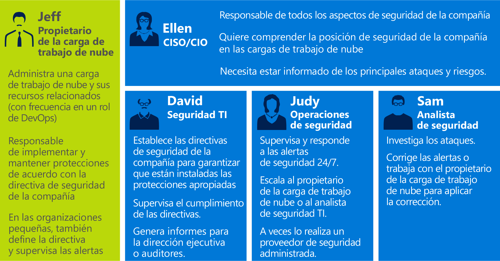
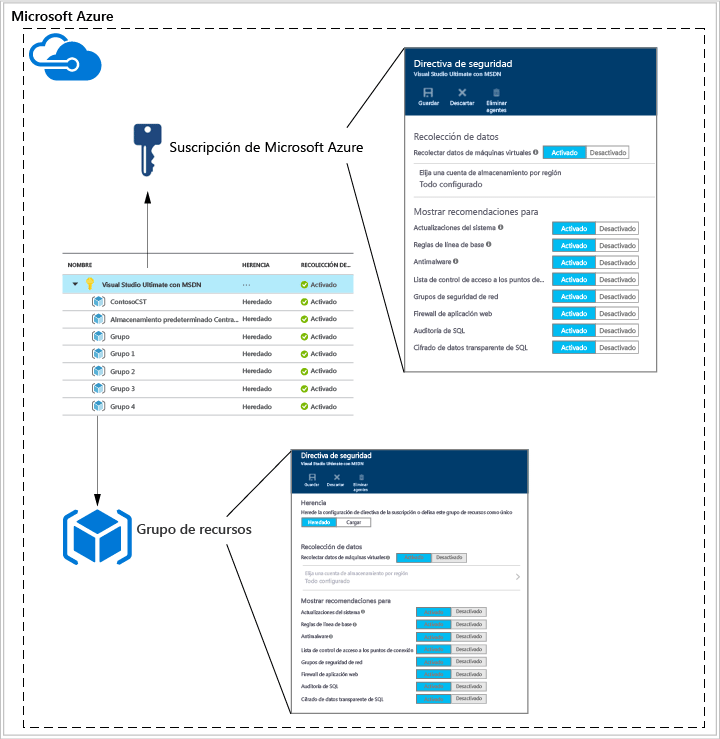
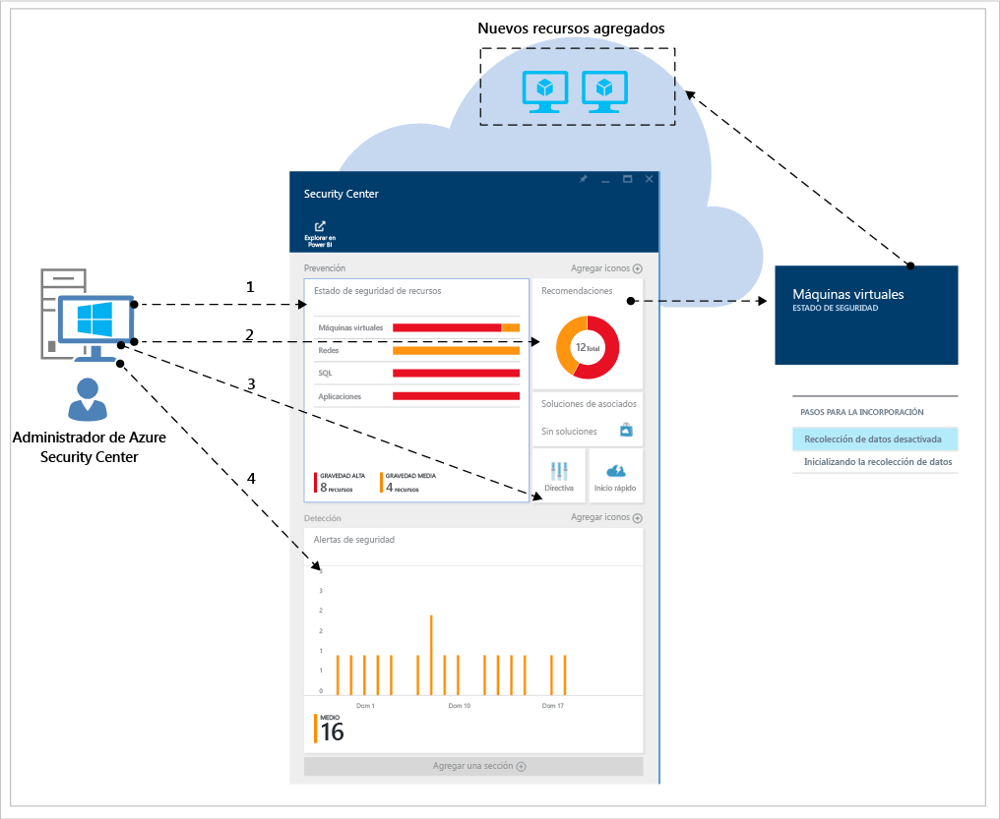
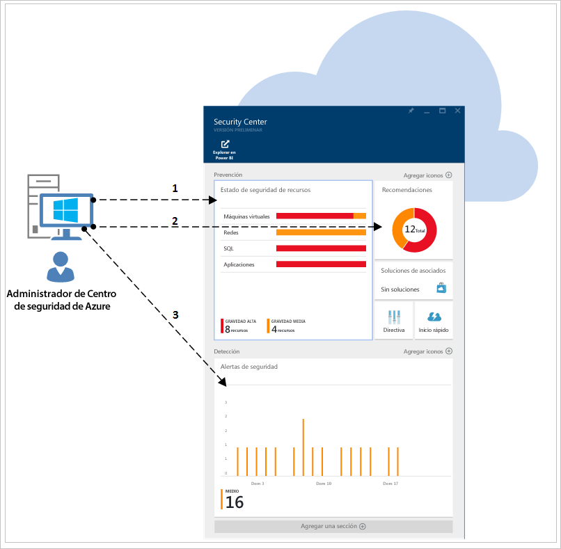

# Guía de planeamiento y operaciones de Azure Security Center
Esta guía está destinada a profesionales de tecnologías de la información (TI), arquitectos de TI, analistas de seguridad de la información y administradores de la nube cuyas organizaciones estén planeando utilizar Azure Security Center.

## Guía de planeamiento
Esta guía abarca un conjunto de pasos y tareas que se pueden seguir para optimizar el uso de Security Center en función de los requisitos de seguridad y el modelo de administración de nube de su organización. Para poder beneficiarse plenamente de Security Center, es importante comprender cómo distintas personas o equipos de su organización usarán el servicio para satisfacer las necesidades relativas al desarrollo y las operaciones seguros, la supervisión, el gobierno y la respuesta a incidentes. Las áreas clave que se deben tener en cuenta al planear el uso de Security Center son:

* Roles de seguridad y controles de acceso
* Directivas de seguridad y recomendaciones
* Recopilación de datos y almacenamiento
* Supervisión continuada de la seguridad
* Respuesta a los incidentes

En la siguiente sección obtendrá información sobre cómo planear cada una de esas áreas y aplicar las recomendaciones según sus requisitos.

> [!NOTE]
> Lea en [Preguntas más frecuentes sobre Azure Security Center](security-center-faq.md) una lista de preguntas habituales que también pueden ser útiles durante la fase de diseño y planeamiento.
> 
> 

## Roles de seguridad y controles de acceso
Según el tamaño y la estructura de su organización, puede que varias personas y equipos usen Security Center para llevar a cabo diferentes tareas relacionadas con la seguridad. En el siguiente diagrama se ofrece un ejemplo de personas ficticias y sus respectivos roles y responsabilidades en cuanto a la seguridad:

Security Center hace posible que estos usuarios cumplan estas diversas responsabilidades. Por ejemplo:

**Jeff (Propietario de la carga de trabajo de la nube)**

* Administración de una carga de trabajo de nube y sus recursos relacionados
* Responsable de la implementación y el mantenimiento de las protecciones de acuerdo con la directiva de seguridad de la empresa

**Ellen (CISO/CIO)**

* Responsable de todos los aspectos de seguridad de la empresa
* Desea comprender la postura de la empresa en materia de seguridad con respecto a las cargas de trabajo de nube
* Se le debe informar de los riesgos y ataques principales

**David (Seguridad de TI)**

* Define directivas de seguridad de la empresa para garantizar que existen las protecciones adecuadas
* Supervisa el cumplimiento con directivas
* Genera informes para la dirección ejecutiva o los auditores

**Judy (Operaciones de seguridad)**

* Supervisa y responde a alertas de seguridad las 24 horas, los 7 días de la semana
* Transfiere el problema al propietario de la carga de trabajo de nube o al analista de seguridad de TI

**Sam (Analista de seguridad)**

* Investigación de los ataques
* Busca soluciones para las alertas o trabaja con el propietario de la carga de trabajo de nube para aplicar correcciones 

Security Center usa el [control de acceso basado en rol (RBAC)](../active-directory/role-based-access-control-configure.md), que proporciona [roles integrados](../active-directory/role-based-access-built-in-roles.md) que se pueden asignar a usuarios, grupos y servicios en Azure. Cuando un usuario abre Security Center, solo ve la información relacionada con los recursos a los que tienen acceso. Esto significa que al usuario se le asigna el rol de Propietario, Colaborador o Lector para la suscripción o el grupo de recursos a los que pertenece un recurso. 

> [!NOTE]
> Un usuario debe ser al menos propietario de una suscripción o de un grupo de recursos, o ser colaborador de estos, para poder ver Security Center en Azure.
> 
> 

Con las personas que se explican en este diagrama, sería necesario el siguiente control de acceso basado en rol (RBAC):

**Jeff (Propietario de la carga de trabajo de la nube)**

* Propietario o colaborador del grupo de recursos

**David (Seguridad de TI)**

* Propietario o colaborador de la suscripción

**Judy (Operaciones de seguridad)**

* Lector de la suscripción para ver alertas
* Propietario o colaborador de la suscripción, necesario para descartar alertas

**Sam (Analista de seguridad)**

* Lector de la suscripción para ver alertas
* Propietario o colaborador de la suscripción, necesario para corregir o descartar alertas
* Puede requerir acceso al almacenamiento

Otra información importante que se debe tener en cuenta:

* Los únicos que pueden editar una directiva de seguridad son los colaboradores y los propietarios de la suscripción.
* Los únicos que pueden aplicar recomendaciones de seguridad para un recurso son los propietarios y los colaboradores de la suscripción y del grupo de recursos.

Cuando planee el control de acceso mediante RBAC para Security Center, asegúrese de comprender quiénes en su organización van a usar Security Center. También, los tipos de tareas que realizarán, y luego configure RBAC en consecuencia.

> [!NOTE]
> Es recomendable que asigne el rol de menos permisos que los usuarios necesiten para realizar sus tareas. Por ejemplo, a los usuarios que solo necesiten ver información sobre el estado de seguridad de los recursos, pero no llevar a cabo acciones como aplicar recomendaciones o editar directivas, se les debe asignar el rol Lector.
> 
> 

## Directivas de seguridad y recomendaciones
Una directiva de seguridad define el conjunto de controles recomendados para los recursos en la suscripción o el grupo de recursos especificados. En Security Center, se definen directivas de acuerdo con los requisitos de seguridad de la compañía y el tipo de aplicaciones o la confidencialidad de los datos.

Las directivas que están habilitadas en el nivel de suscripción se propagarán automáticamente a todos los grupos de recursos de la suscripción, como se muestra en el diagrama siguiente:

Como se muestra en la ilustración anterior, las directivas de seguridad para grupos de recursos se pueden heredar del nivel de suscripción.

En algunos escenarios en que los recursos pueden estar en un grupo de recursos que requiera un conjunto diferente de directivas, puede deshabilitar la herencia y aplicar directivas personalizadas a un grupo de recursos específico.

Si necesita directivas personalizadas en grupos de recursos específicos, debe deshabilitar la herencia en el grupo de recursos y cambiar las directivas de seguridad. Por ejemplo, si algunas cargas de trabajo no requieren la directiva de cifrado de datos transparente (TDE) de SQL, desactive la directiva en el nivel de suscripción y habilítela solo en los grupos de recursos donde se requiera TDE de SQL.

Cuando empiece a crear directivas personalizadas para diferentes grupos de recursos, debe planear la implementación de directivas teniendo en cuenta que, en caso de conflicto entre ellas (suscripción frente a grupo de recursos), prevalece la del grupo de recursos.

> [!NOTE]
> Si necesita revisar qué directivas se han cambiado, puede usar los [registros de auditoría de Azure](https://blogs.msdn.microsoft.com/cloud_solution_architect/2015/03/10/audit-logs-for-azure-events/). Los cambios en directivas se reflejan siempre en los registros de auditoría de Azure.
> 
> 

### Recomendaciones de seguridad
Antes de configurar las directivas de seguridad, revise cada una de las [recomendaciones de seguridad](security-center-recommendations.md)y determine si son adecuadas para los diversos grupos de recursos y suscripciones. También es importante entender qué acción se llevará a cabo para poner en práctica las recomendaciones de seguridad.

**Protección de los puntos de conexión**: si una máquina virtual no tiene una solución de protección de puntos de conexión habilitada, Security Center recomienda que instale una. Si tiene una solución preferida que ya haya adoptado localmente, debe decidir si va a usar el mismo antimalware para las máquinas virtuales de Azure. Security Center proporciona varias opciones para proteger los puntos de conexión.  Puede usar la aplicación Microsoft Antimalware, que es gratis, o elegir entre una lista de soluciones de protección de puntos de conexión de asociados integrados. Para más información sobre cómo implementar antimalware mediante Security Center, lea [Instalación de Endpoint Protection en Azure Security Center](security-center-install-endpoint-protection.md).

**Actualizaciones del sistema**: Security Center identifica las máquinas virtuales a las que les faltan actualizaciones críticas o de seguridad del sistema operativo para IaaS y Servicios en la nube (PaaS). Piense quién se encargará de aplicar las actualizaciones cuando sea necesario y cómo se van a aplicar. Muchas organizaciones usan WSUS, Windows Update u otra herramienta.

**Configuraciones de línea base**: si las configuraciones del sistema operativo de la máquina virtual no coinciden con las líneas base recomendadas, aparece una recomendación. Revise el conjunto de líneas base [aquí](https://gallery.technet.microsoft.com/Azure-Security-Center-a789e335) y tenga en cuenta cómo se aplicarán las configuraciones del sistema operativo.

**Cifrado de disco**: si tiene discos de máquina virtual que no están cifrados, Security Center recomienda aplicar Cifrado de discos de Azure. Esta característica usa BitLocker para Windows y DM-Crypt para Linux con la finalidad de proporcionar cifrado de volumen para discos de datos y del sistema operativo. Esta recomendación le redirigirá a una [guía paso a paso](security-center-disk-encryption.md) con instrucciones para realizar este cifrado.

Tenga en cuenta que hay varios escenarios de cifrado que deben tratarse. Debe planear en función de los requisitos exclusivos de cada uno de estos escenarios:

* Cifrado de nuevas máquinas virtuales de Azure desde discos duros virtuales que haya cifrado con sus propias claves de cifrado
* Cifrado de nuevas máquinas virtuales de Azure que se crearon desde la Galería de Azure
* Cifrado de máquinas virtuales de Azure que ya se están ejecutando en Azure

Los requisitos de planeamiento variarán para cada uno de estos escenarios. Consulte las [notas del producto para Cifrado de discos de Azure](https://gallery.technet.microsoft.com/Azure-Disk-Encryption-for-a0018eb0) , que incluyen información detallada sobre cada uno de estos escenarios.

**Firewall de aplicaciones web**: Security Center identifica las máquinas virtuales que ejecutan aplicaciones web y recomienda instalar un firewall de aplicaciones web (WAF). Evalúe las soluciones de asociados disponibles para averiguar cuál es la mejor para su organización y determine cómo se concede la licencia de la solución (es posible que los asociados apliquen modelos Traiga su propia licencia o de pago por uso). Para más información sobre cómo implementar un firewall de aplicaciones web en las máquinas virtuales de Azure mediante Security Center, lea [Adición de un firewall de aplicaciones web en Azure Security Center](security-center-add-web-application-firewall.md).

**Firewall de última generación**: permite aprovisionar un dispositivo virtual de los principales proveedores, como Check Point y, poco después, Fortinet y Cisco. Esto amplía las medidas de protección de la red más allá de los grupos de seguridad de red, que están integrados en Azure. Security Center detectará las implementaciones para las que se recomiende un firewall de próxima generación y permitirá que se aprovisione una aplicación virtual.

**Redes virtuales**: Security Center evaluará la infraestructura y la configuración de [Azure Virtual Network](https://azure.microsoft.com/documentation/services/virtual-network/) para comprobar que los [grupos de seguridad de red](../virtual-network/virtual-networks-nsg.md) tengan aplicadas y configuradas correctamente reglas de tráfico de entrada. Debe considerar qué reglas de tráfico se deben definir y comunicárselas a las personas que van a aplicar las recomendaciones de seguridad relacionadas.

Security Center recomendará que proporcione los detalles de contacto de seguridad para su suscripción de Azure. Esta información la utilizará Microsoft para ponerse en contacto con usted si Microsoft Security Response Center (MSRC) detecta que un tercero no autorizado o ilegal ha accedido a los datos de clientes. Consulte [Proporcionar detalles de contacto de seguridad en Azure Security Center](security-center-provide-security-contact-details.md) para más información sobre cómo habilitar esta recomendación.

## Recopilación de datos y almacenamiento
Se recomienda activar la recopilación de datos para cada una de las suscripciones, ya que esto garantizará la disponibilidad de la supervisión de seguridad para todas las máquinas virtuales. La recopilación de datos se habilita a través de la extensión Supervisión de seguridad de Azure (ASMMonitoringAgent.exe) y el Agente de supervisión de Azure (ASMAgentLauncher.exe).

La extensión Supervisión de seguridad de Azure busca diversas configuraciones relevantes para la seguridad y recopila registros de seguridad de la máquina virtual. Estos datos se envían a una cuenta de almacenamiento que especifique. El administrador de exámenes (ASMSoftwareScanner.exe) se instala también en la máquina virtual y se utiliza para buscar revisiones.

El Agente de supervisión de seguridad (ASM) de Azure tiene la siguiente línea de base de superficie:

* Superficie de memoria de 3 MB para la mayor parte, con posibles aumentos de 10 MB cuando un escenario se ejecuta cada 12 horas.  
* CPU insignificante de procesos persistentes y exámenes. 
* Uso de disco insignificante.

El agente ASM tiene una cadena de procesos que puede totalizar unos 30 MB de memoria.  Cada instancia del agente de supervisión puede usar hasta 3 GB del disco. Cada instancia está limitada al 20 % de CPU, aunque en la práctica es mucho menor. 

Una vez habilitada la recopilación de datos en la directiva de seguridad, el agente de supervisión y las extensiones se instalan automáticamente en todas las máquinas virtuales existentes y recién admitidas que estén aprovisionadas en Azure.  El proceso del agente está diseñado para que no sea invasivo y tenga un impacto mínimo sobre el rendimiento de la máquina virtual.

> [!NOTE]
> Para solucionar problemas relacionados con el agente de supervisión de seguridad de Azure, consulte [Guía de solución de problemas de Azure Security Center](security-center-troubleshooting-guide.md).
> 
> 

Si en algún momento desea deshabilitar la recopilación de datos, puede desactivarla en la directiva de seguridad. Para eliminar los agentes de supervisión que implementó antes, seleccione la opción de menú Delete Agents (Eliminar agentes).

> [!NOTE]
> Para obtener una lista de máquinas virtuales admitidas, lea [Preguntas más frecuentes sobre Azure Security Center](security-center-faq.md).
> 
> 

Para cada región en la que disponga de máquinas virtuales en funcionamiento, elija la cuenta de almacenamiento en la que se almacenan los datos recopilados de esas máquinas virtuales. Si no elige una cuenta de almacenamiento para cada región, se creará una automáticamente. Puede elegir la ubicación de almacenamiento por región o almacenar toda la información en una ubicación central. Aunque las directivas de seguridad se pueden establecer en el nivel de suscripción y de grupo de recursos de Azure, la región para la cuenta de almacenamiento solo se puede seleccionar en el nivel de suscripción.

Si usa una cuenta de almacenamiento compartida entre distintos recursos de Azure, asegúrese de leer [Objetivos de escalabilidad y rendimiento de Almacenamiento de Azure](../storage/storage-scalability-targets.md) para más información sobre los límites de tamaño y las restricciones. Su suscripción también tiene límites para las cuentas de almacenamiento; consulte [Límites, cuotas y restricciones de suscripción y servicios de Microsoft Azure](../azure-subscription-service-limits.md) para comprenderlos mejor.

Los costos asociados con este almacenamiento no están incluidos en el precio del servicio Security Center y se cobrarán por separado según los [precios normales de almacenamiento de Azure](https://azure.microsoft.com/pricing/details/storage/). Desde la perspectiva del planeamiento, debe tener en cuenta que Security Center agregará datos al almacenamiento de Azure, lo que aumentará el costo entre 1 y 3 dólares al año.

También se deben prever las consideraciones de rendimiento y escalabilidad en función del tamaño del entorno de Azure y los recursos que se consumen en su cuenta de almacenamiento. Consulte [Lista de comprobación de rendimiento y escalabilidad de Almacenamiento de Microsoft Azure](../storage/storage-performance-checklist.md) para más información.

> [!NOTE]
> Microsoft está totalmente comprometido a proteger la privacidad y la seguridad de estos datos. Microsoft se adhiere a instrucciones estrictas de seguridad y cumplimiento de normas, desde la codificación hasta la operación de un servicio. Para más información sobre el control de datos y la privacidad, lea [Seguridad de datos de Azure Security Center](security-center-data-security.md).
> 
> 

## Supervisión continuada de la seguridad
Después de la configuración inicial y la aplicación de las recomendaciones de Security Center, el siguiente paso consiste en considerar los procesos operativos de Security Center.

Para acceder a Security Center desde Azure Portal, haga clic en **Examinar** y escriba **Security Center** en el campo **Filtro**. Las vistas que el usuario obtiene varían según los filtros aplicados.

Security Center no interferirá en los procedimientos operativos normales, sino que supervisará de forma pasiva las implementaciones y proporcionará recomendaciones basadas en las directivas de seguridad que se hayan habilitado.

El panel de Security Center se divide en dos partes principales:

* Prevención
* Detección

Cuando habilite por primera vez la recopilación de datos en Security Center para su entorno actual de Azure, asegúrese de revisar todas las recomendaciones. Puede hacerlo en la hoja **Recomendaciones** o por recurso (**Máquina virtual**, **Redes**, **SQL** y **Aplicación**).

Después de que procese todas las recomendaciones, la sección **Prevención** debería aparecer en verde para los recursos correspondientes. A partir de este momento, la supervisión continua resulta más sencilla, ya que solo tomará medidas en respuesta a los cambios en los iconos de recomendaciones y estado de seguridad.

La sección **Detección** es más reactiva, ya que se trata de alertas sobre los problemas que están ocurriendo en ese momento o que ocurrieron en el pasado y se detectaron en los controles de Security Center y sistemas de terceros. El icono Alertas de seguridad mostrará gráficos de barras que representan el número de alertas de detección de amenazas encontradas cada día y su distribución entre las diversas categorías de gravedad (baja, media, alta). Para más información sobre Alertas de seguridad, lea [Administración y respuesta a las alertas de seguridad en Azure Security Center](security-center-managing-and-responding-alerts.md).

> [!NOTE]
> También puede aprovechar Microsoft Power BI para visualizar los datos de Security Center. Consulte [Obtención de información mediante los datos de Azure Security Center con Power BI](security-center-powerbi.md).
> 
> 

### Supervisión de recursos nuevos o modificados
La mayor parte de los entornos de Azure son dinámicos, con incorporaciones o retiradas periódicas de recursos, configuraciones o cambios, etc. Security Center ayuda a garantizar la visibilidad del estado de seguridad de estos nuevos recursos.

Cuando agregue nuevos recursos (máquinas virtuales, bases de datos SQL) a su entorno de Azure, Security Center los detectará automáticamente y empezará a supervisar su seguridad. Esto también incluye los roles web de PaaS y los roles de trabajo. Si la recopilación de datos está habilitada en la [directiva de seguridad](security-center-policies.md), se habilitarán automáticamente funcionalidades de supervisión adicionales para las máquinas virtuales.

1. Para las máquinas virtuales, acceda al icono **Estado de seguridad del recurso** y haga clic en **Máquinas virtuales**. Los problemas con la habilitación de la recopilación de datos o las recomendaciones relacionadas aparecerán en la sección **Supervisar las recomendaciones** .
2. Vea las **recomendaciones** para comprobar si se identificó algún riesgo de seguridad para el nuevo recurso.
3. Es muy habitual que cuando se agregan nuevas máquinas virtuales a su entorno, al principio solo esté instalado el sistema operativo. Es posible que el propietario del recurso tarde un tiempo en implementar otras aplicaciones que se usarán en estas máquinas virtuales.  Idealmente, debe conocer el objetivo final de esta carga de trabajo. ¿Va a ser un servidor de aplicaciones? En función de lo que vaya a ser esta nueva carga de trabajo, puede habilitar la **directiva de seguridad**correspondiente, lo cual es el tercer paso de este flujo de trabajo.
4. A medida que se agreguen nuevos recursos a su entorno de Azure, es posible que aparezcan nuevas alertas en el icono **Alertas de seguridad** . Compruebe siempre si hay nuevas alertas en este icono y actúe según las recomendaciones de Security Center.

También debería supervisar periódicamente el estado de los recursos existentes para identificar los cambios de configuración que hayan creado riesgos de seguridad, la separación respecto a las líneas base recomendadas y las alertas de seguridad. Comience en el panel de Security Center. Desde allí deberá revisar tres áreas principales de forma periódica.

1. El panel **Estado de seguridad del recurso** le proporciona acceso rápido a los recursos clave. Use esta opción para supervisar las máquinas virtuales, las redes, SQL y las aplicaciones.
2. El panel **Recomendaciones** permite revisar las recomendaciones de Security Center. Durante la supervisión continuada, es posible que no vea recomendaciones a diario, lo cual es normal ya que procesó todas las recomendaciones durante la configuración inicial de Security Center. Por este motivo, es posible que no aparezca en esta sección información nueva todos los días y solo tenga que acceder a ella cuando sea necesario.
3. El panel **Detección** podría cambiar con mucha frecuencia o con muy poca. Revise siempre las alertas de seguridad y tome medidas basadas en las recomendaciones de Security Center.

## Respuesta a los incidentes
Security Center detecta amenazas y alerta sobre ellas a medida que se producen. Las organizaciones deben estar al tanto de las nuevas alertas de seguridad y tomar medidas según sea necesario para investigarlas o solucionar el ataque. Para más información sobre cómo funciona la detección de amenazas de Security Center, consulte [Funcionalidades de detección de Azure Security Center](security-center-detection-capabilities.md).

Aunque el objetivo de este artículo no es ayudarle a crear su propio plan de respuesta a incidentes, vamos a usar las respuestas de seguridad de Microsoft Azure en el ciclo de vida de la nube como base para las fases de la respuesta a incidentes. Estas fases se muestran en el diagrama siguiente:

> [!NOTE]
> Puede usar la guía [Computer Security Incident Handling Guide](http://nvlpubs.nist.gov/nistpubs/SpecialPublications/NIST.SP.800-61r2.pdf) sobre el tratamiento de los incidentes de seguridad informática del National Institute of Standards and Technology (NIST) de EE. UU. como ayuda para crear el suyo propio.
> 
> 

Puede utilizar alertas de Security Center durante las fases siguientes:

* **Detectar**: identifique una actividad sospechosa en uno o varios recursos. 
* **Evaluar**: realice la evaluación inicial para más información acerca de la actividad sospechosa.
* **Diagnosticar**: siga los pasos de corrección para llevar a cabo el procedimiento técnico para solucionar el problema.

Cada alerta de seguridad proporciona información que sirve para comprender la naturaleza del ataque y sugerir posibles mitigaciones. Algunas alertas también proporcionan vínculos a más datos o a otras fuentes de información dentro de Azure. Puede usar la información proporcionada como base para investigar más a fondo y comenzar la mitigación.

En el ejemplo siguiente se muestra una actividad sospechosa de RDP:

Como ve, esta hoja muestra detalles relacionados con la hora en que ocurrió el ataque, el nombre del host de origen, la máquina virtual de destino y también pasos recomendados. En algunas circunstancias, la información de origen del ataque puede estar vacía. Consulte [Missing Source Information in Azure Security Center Alerts](https://blogs.msdn.microsoft.com/azuresecurity/2016/03/25/missing-source-information-in-azure-security-center-alerts/) (Falta de información de origen en las alertas de Azure Security Center) para más información acerca de este tipo de comportamiento.

En el vídeo [How to Leverage the Azure Security Center & Microsoft Operations Management Suite for an Incident Response](https://channel9.msdn.com/Blogs/Taste-of-Premier/ToP1703) (Uso de Azure Security Center y Microsoft Operations Management Suite para dar respuesta a incidentes), puede ver algunas demostraciones que le ayuden a entender cómo se puede usar Security Center en cada una de estas fases.

> [!NOTE]
> Para más información acerca de cómo usar las funcionalidades de Security Center durante el proceso de respuesta ante incidentes, consulte [Uso de Azure Security Center para responder a incidentes](security-center-incident-response.md) . 
> 
> 

## Consulte también
En este documento, ha aprendido a planear la adopción de Security Center. Para más información sobre el Centro de seguridad, consulte los siguientes recursos:

* [Administración y respuesta a las alertas de seguridad en el Centro de seguridad de Azure](security-center-managing-and-responding-alerts.md)
* [Supervisión del estado de seguridad en Azure Security Center](security-center-monitoring.md) : obtenga información sobre cómo supervisar el estado de los recursos de Azure.
* [Supervisión de las soluciones de asociados con Azure Security Center](security-center-partner-solutions.md) : aprenda a supervisar el estado de mantenimiento de las soluciones de asociados.
* [Preguntas más frecuentes sobre Azure Security Center](security-center-faq.md) : encuentre las preguntas más frecuentes sobre el uso del servicio.
* [Blog de seguridad de Azure](http://blogs.msdn.com/b/azuresecurity/) : encuentre entradas de blog sobre el cumplimiento y la seguridad de Azure.

<!--HONumber=Dec16_HO2-->

