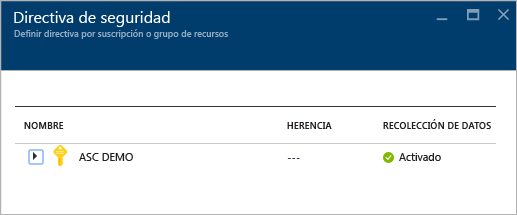
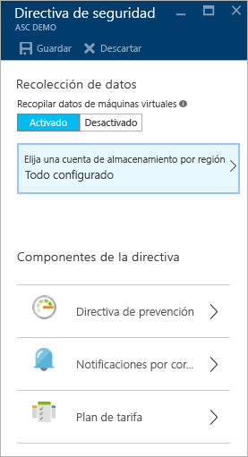
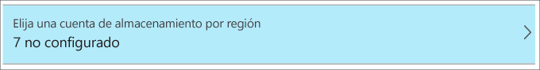
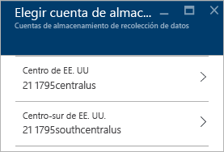
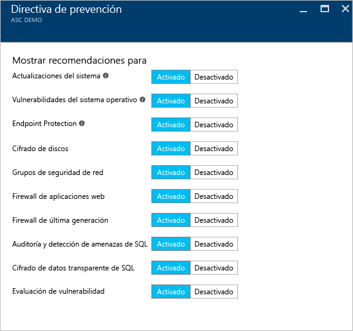
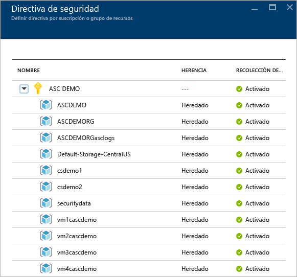
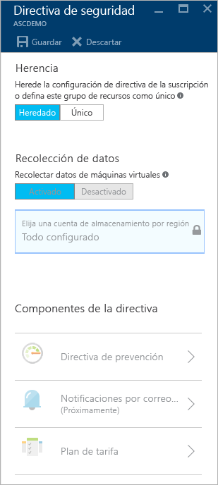

# Establecimiento de directivas de seguridad en Azure Security Center
Este documento le ayuda a configurar las directivas de seguridad en Security Center guiándole por los pasos necesarios para realizar esta tarea.

## ¿Qué son las directivas de seguridad?
Una directiva de seguridad define el conjunto de controles recomendados para los recursos en la suscripción o el grupo de recursos especificados. En Security Center, el usuario define directivas para sus suscripciones o grupos de recursos de Azure de acuerdo con las necesidades de seguridad de la compañía y el tipo de aplicaciones o la confidencialidad de los datos de cada suscripción.

Por ejemplo, es posible que los recursos usados para el desarrollo o las pruebas tengan requisitos de seguridad diferentes a los de los recursos que se emplean para aplicaciones de producción. Del mismo modo, es posible que las aplicaciones que usan datos regulados, como la información de identificación personal, requieran un mayor nivel de seguridad. Las directivas de seguridad habilitadas en Azure Security Center controlan las recomendaciones de seguridad y la supervisión para ayudarle a identificar posibles vulnerabilidades y mitigar las amenazas. Consulte [Guía de planeamiento y operaciones de Azure Security Center](security-center-planning-and-operations-guide.md) para más información sobre cómo determinar la opción más adecuada para usted.

## Configuración de directivas de seguridad para las suscripciones
Puede configurar directivas de seguridad para cada suscripción o grupo de recursos. Para modificar una directiva de seguridad, debe ser propietario o colaborador de esa suscripción. Inicie sesión en Azure Portal y siga estos pasos para configurar directivas de seguridad en Security Center:

1. Haga clic en el icono **Directiva** en el panel de Security Center.
2. En la hoja **Directiva de seguridad - Definir directiva por suscripción o grupo de recursos** que se abre, seleccione la suscripción para la que desee habilitar la directiva de seguridad. Si prefiere habilitar la directiva de seguridad para un grupo de recursos en lugar de para toda la suscripción, vaya hasta la siguiente sección, en la que hablamos sobre cómo configurar directivas de seguridad para grupos de recursos.
   
    
3. Se abre la hoja **Directiva de seguridad** de la suscripción seleccionada con un conjunto de opciones, como las que aparecen en la captura de pantalla siguiente:
   
    
   
    Las opciones disponibles en esta hoja son:
   
   * **Directiva de prevención**: esta opción permite configurar directivas por suscripción o por grupo de recursos.  
   * **Notificación por correo electrónico**: utilice esta opción para configurar una notificación por correo electrónico que se envía en la primera aparición diaria de una alerta y en las alertas con un nivel de gravedad elevado. Las preferencias de correo electrónico solo pueden configurarse para las directivas de suscripción. Para más información sobre cómo configurar la notificación por correo electrónico, consulte [Proporcionar detalles de contacto de seguridad en Azure Security Center](security-center-provide-security-contact-details.md) .
   * **Plan de tarifa**: utilice esta opción para actualizar al plan de tarifa seleccionado. Para más información acerca de las opciones de precios, consulte la [página de Security Center](https://azure.microsoft.com/pricing/details/security-center/) .
4. Asegúrese de que la opción **Recopilar datos de máquinas virtuales** está **Activada**. Esta opción habilita la recopilación de inicio de sesión automático para recursos nuevos y existentes.
   
   > [!NOTE]
   > Recomendamos activar la recopilación de datos para cada una de las suscripciones con el fin de garantizar la disponibilidad de la supervisión de seguridad para todas las máquinas virtuales nuevas y existentes. Al habilitar la recopilación de datos se instala el agente de supervisión. Si no desea activar la recopilación de datos ahora desde esta ubicación, puede hacerlo más tarde desde las vistas **Mantenimiento** y **Recomendaciones**. También puede habilitar la recopilación de datos solo para la suscripción o para determinadas máquinas virtuales. Consulte las [preguntas más frecuentes sobre el Centro de seguridad de Azure](security-center-faq.md) para más información sobre VM compatibles.
   > 
   > 
5. Si aún no está configurada la cuenta de almacenamiento, puede que aparezca una advertencia similar a la mostrada en la siguiente captura de pantalla al abrir la **Directiva de seguridad**:
   
    
6. Si aparece esta advertencia, haga clic en esta opción y seleccione la región como se muestra en la siguiente captura de pantalla:
   
    
7. Para cada región en la que tenga máquinas virtuales en funcionamiento, elija la cuenta de almacenamiento en la que se almacenan los datos recopilados de esas máquinas virtuales. Esto facilita el mantenimiento de los datos en la misma zona geográfica para fines de privacidad y soberanía de datos. Cuando decida qué región va a utilizar, selecciónela y elija la cuenta de almacenamiento.
8. En la hoja **Elija las cuentas de almacenamiento** haga clic en **Aceptar**.
   
   > [!NOTE]
   > Si lo prefiere, puede agregar datos en una cuenta de almacenamiento central para máquinas virtuales que están varias regiones. Consulte las [preguntas más frecuentes sobre Azure Security Center](security-center-faq.md) para más información.
   > 
   > 
9. En la hoja **Directiva de seguridad**, haga clic en **Activar** para habilitar las recomendaciones de seguridad que desee usar en esta suscripción. Haga clic en **Directiva de prevención** para ver opciones como las de la captura de pantalla siguiente:
   
    

Utilice la tabla siguiente como referencia para entender cada opción:

| Directiva | Cuando el estado es Activado |
| --- | --- |
| Actualizaciones del sistema |Recupera una lista diaria de las actualizaciones críticas y de seguridad disponibles en Windows Update o Windows Server Update Services. La lista recuperada depende del servicio que está configurado para esa máquina virtual y recomienda aplicar las actualizaciones que faltan. Para los sistemas Linux, la directiva utiliza el sistema de administración de paquetes proporcionado por la distribución para determinar los paquetes que tienen actualizaciones disponibles. También comprueba las actualizaciones de seguridad y críticas de las máquinas virtuales de [Azure Cloud Services](../cloud-services/cloud-services-how-to-configure.md). |
| Vulnerabilidades del SO |Analiza las configuraciones del sistema operativo diariamente para determinar los problemas que podrían hacer que la máquina virtual sea vulnerable a ataques. La directiva también recomienda cambios en la configuración para afrontar estas vulnerabilidades. Consulte la [lista de líneas de base recomendadas](https://gallery.technet.microsoft.com/Azure-Security-Center-a789e335) para más información sobre las configuraciones específicas que se están supervisando. |
| Endpoint Protection |Recomienda que se aprovisione el servicio Endpoint Protection para todas las máquinas virtuales de Windows para ayudar a identificar y a quitar virus, spyware y otro software malintencionado. |
| Cifrado de discos |Se recomienda habilitar el cifrado de disco en todas las máquinas virtuales para mejorar la protección de datos en reposo. |
| Grupos de seguridad de red |Recomienda configurar los [grupos de seguridad de red](../virtual-network/virtual-networks-nsg.md) para controlar el tráfico entrante y saliente de máquinas virtuales que tienen puntos de conexión públicos. Todas las interfaces de red de máquina virtual heredarán los grupos de seguridad de red configurados para una subred, a menos que se especifique lo contrario. Además de comprobar que se ha configurado un grupo de seguridad de red, esta directiva evalúa las reglas de seguridad de entrada para identificar las reglas que permiten el tráfico entrante. |
| Firewall de aplicaciones web |Recomienda aprovisionar un firewall de aplicaciones web en máquinas virtuales cuando se cumple una de las siguientes acciones:  [Dirección IP pública a nivel de instancia](../virtual-network/virtual-networks-instance-level-public-ip.md) (ILPIP) se utiliza y las reglas de seguridad de entrada para el grupo de seguridad de red asociado se configuran para permitir el acceso al puerto 80/443.  Se utiliza la IP de carga equilibrada y el equilibrio de carga asociado y las reglas de traducción de direcciones de red (NAT) entrantes están configuradas para permitir el acceso al puerto 80 o 443. Para más información, consulte [Compatibilidad de Azure Resource Manager con Load Balancer](../load-balancer/load-balancer-arm.md). |
| Firewall de próxima generación |Amplía las medidas de protección de la red más allá de los grupos de seguridad de red, que están integrados en Azure. Security Center detectará las implementaciones para las que se recomienda un firewall de próxima generación y permitirá aprovisionar una aplicación virtual. |
| Auditoría de SQL y detección de amenazas |Se recomienda que se habilite la auditoría del acceso a Azure Database, con fines de cumplimiento, así como la detección avanzada de amenazas, con fines de investigación. |
| Cifrado de datos transparente de SQL |Recomienda que el cifrado en reposo se habilite para Azure SQL Database, las copias de seguridad asociadas y los archivos de registro de transacciones. De esta forma, aunque haya infracción de datos, no se podrán leer. |
| Evaluación de vulnerabilidades |Se recomienda instalar una solución de evaluación de vulnerabilidades en la máquina virtual. |

Después de configurar todas las opciones, haga clic en **Aceptar** en la hoja **Directiva de seguridad** que tiene las recomendaciones y, después, en **Guardar** en la hoja **Directiva de seguridad** que tiene la configuración inicial.

## Configuración de directivas de seguridad para grupos de recursos
Si prefiere configurar sus directivas de seguridad por grupo de recursos, los pasos son similares a los que se usan para configurar directivas de seguridad para las suscripciones. La principal diferencia es que necesitará expandir el nombre de la suscripción y seleccionar el grupo de recursos para el que desea configurar la directiva de seguridad exclusiva:

Después de seleccionar el grupo de recursos, se abre la hoja **Directiva de seguridad** . De forma predeterminada, la opción **Herencia** está habilitada. Esto significa que todas las directivas de seguridad de este grupo de recursos se heredan del nivel de suscripción. Puede cambiar esta configuración en caso de que desee una directiva de seguridad personalizada para un grupo de recursos. En ese caso, debe seleccionar **Única** y realizar los cambios en la opción **Directiva de prevención**.

> [!NOTE]
> En caso de un conflicto entre las directivas del nivel de suscripción y del nivel de grupo de recursos, la del nivel de grupo de recursos tiene prioridad.
> 
> 

## Otras referencias
En este documento ha aprendido a configurar directivas de seguridad en el Centro de seguridad de Azure. Para obtener más información sobre el Centro de seguridad de Azure, consulte los siguientes recursos:

* [Guía de planeamiento y operaciones de Azure Security Center](security-center-planning-and-operations-guide.md). Aprenda a planificar y entender las consideraciones de diseño para adoptar Azure Security Center.
* [Supervisión del estado de seguridad en Azure Security Center](security-center-monitoring.md). Aprenda a supervisar el estado de los recursos de Azure.
* [Administración y respuesta a las alertas de seguridad en Azure Security Center](security-center-managing-and-responding-alerts.md). Aprenda a administrar y responder a las alertas de seguridad.
* [Supervisión de las soluciones de asociados con Azure Security Center](security-center-partner-solutions.md). Aprenda cómo supervisar el estado de mantenimiento de las soluciones de sus asociados.
* [Preguntas más frecuentes sobre Azure Security Center](security-center-faq.md). Preguntas más frecuentes acerca del uso del servicio.
* [Blog de seguridad de Azure](http://blogs.msdn.com/b/azuresecurity/). Encuentre artículos de blog sobre el cumplimiento y la seguridad de Azure.

<!--HONumber=Nov16_HO2-->

