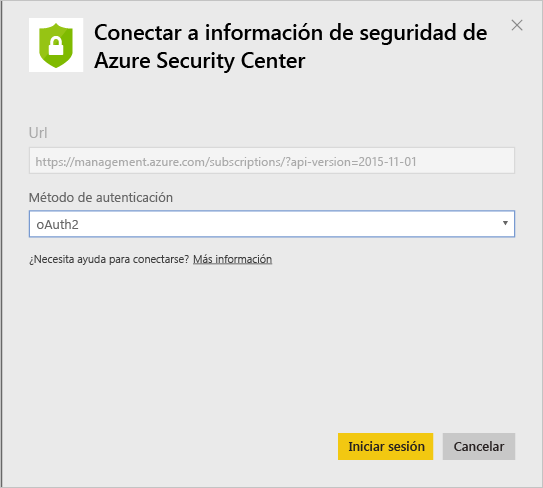
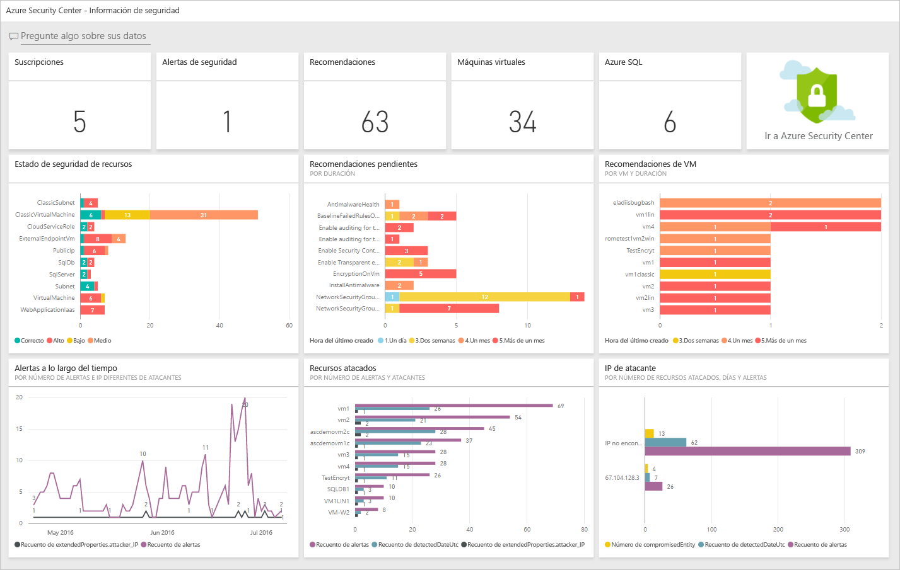
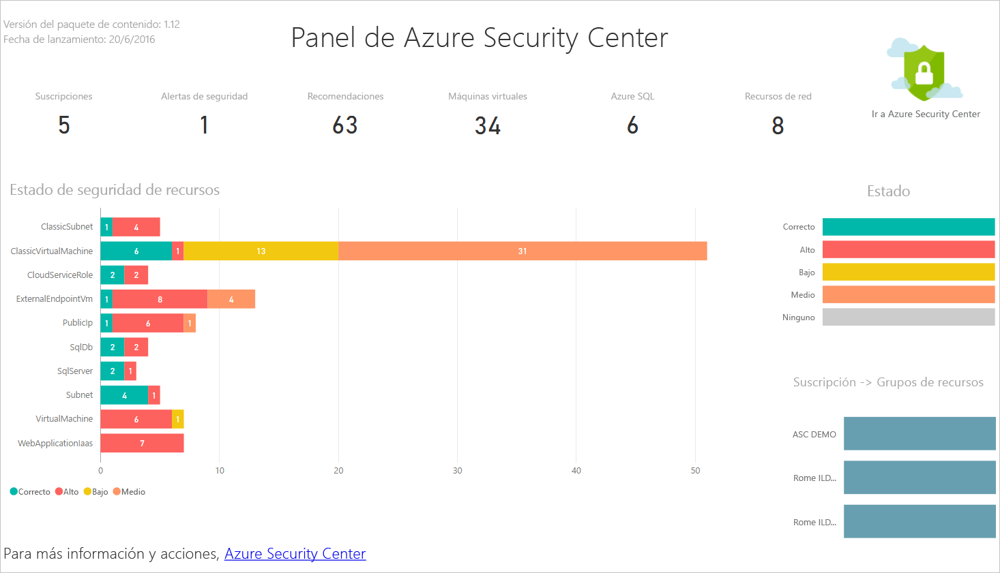
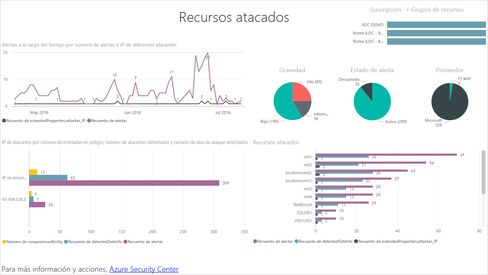
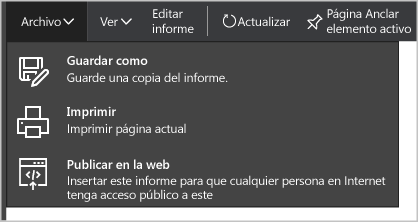
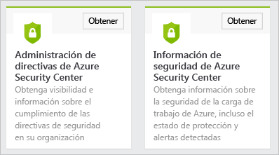
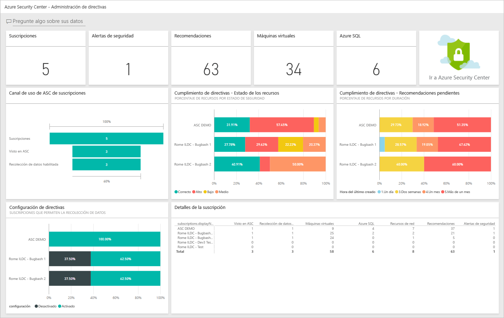

# Obtención de información mediante los datos de Azure Security Center con Power BI
El [panel de Power BI](http://aka.ms/azure-security-center-power-bi) para Azure Security Center le permite visualizar, analizar y filtrar las recomendaciones y alertas de seguridad desde cualquier lugar, incluido su dispositivo móvil. Utilice el panel de Power BI para mostrar tendencias y patrones de ataque. Consulte alertas de seguridad por recursos o dirección IP de origen y riesgos de seguridad no solucionados por recursos o antigüedad.

También puede mezclar recomendaciones de Security Center y alertas de seguridad con otros datos de diversas maneras, por ejemplo, con los datos de los [registros de auditoría de Azure](https://powerbi.microsoft.com/blog/monitor-azure-audit-logs-with-power-bi/) y la [auditoría de Azure SQL Database](https://powerbi.microsoft.com/blog/monitor-your-azure-sql-database-auditing-activity-with-power-bi/). Ambos ofrecen paneles de Power BI; también puede exportar estos datos a Excel para obtener informes fácilmente sobre el estado de seguridad de los recursos de nube.

## Utilización del panel de Azure Security Center para acceder a Power BI
También puede utilizar el panel de Azure Security Center para tener acceso a informes de Power BI. Siga estos pasos para realizar esta tarea:

1. En el panel de **Azure Security Center**, haga clic en el botón **Power BI**.

    
2. La hoja **Power BI** se abre a la derecha, como se muestra en la pantalla siguiente:

    
3. Al crear el panel de Power BI por primera vez, puede elegir una de las siguientes opciones de la hoja **Explorar en Power BI** :

   * **Security insights dashboard**(Panel de información de seguridad): elija esta opción si desea crear un panel que incluya el estado de seguridad, los subprocesos y las detecciones. Se trata de una opción más habitual para el rol de DevOps, cuya responsabilidad es analizar su estado de protección y las alertas detectadas en las suscripciones.
   * **Panel de administración de directivas**: elija esta opción si desea explorar la administración y la aplicación de directivas.  Se trata de una opción más habitual para TI central, que se concentra más en el control. Pueden usar este panel para obtener visibilidad e información sobre el cumplimiento de las directivas de seguridad en toda su organización.
   * Si ya tiene un panel de Power BI, haga clic en **Ir al panel de Power BI actual**.
4. Para este ejemplo, haga clic en **Panel de información de seguridad** . Si es la primera vez que va a crear un panel de Power BI para Security Center, se le pedirá que instale el paquete de contenido. Haga clic en el botón **Get** (Obtener) de la ventana **Content packs for Power BI** (Paquetes de contenido para Power BI), como se muestra en la siguiente pantalla:

    
5. Aparece la ventana **Connect to Azure Security Center Security Insights** (Conectar a información de seguridad de Azure Security Center). Asegúrese de que el método de **Autenticación** sea **oAuth2**, como se muestra a continuación y haga clic en el botón **Iniciar sesión**.

    
6. Se le pedirá que vuelva a autenticarse con sus credenciales de Azure. Después de autenticarse, se creará el panel. Una vez creado el panel, verá un informe con una estructura parecida a la de la siguiente pantalla:

    

> [!NOTE]
> Hay una actualización diaria del informe programada. Si se produce un error al actualizar, consulte [Potential Refresh Issues with the Azure Security Center Power BI](https://blogs.msdn.microsoft.com/azuresecurity/2016/04/07/azure-security-center-power-bi-refresh-fails/)(Posibles problemas de actualización en Azure Security Center con Power BI), para más información sobre cómo solucionarlo.
>
>

Aquí se ve el número de alertas de seguridad y recomendaciones, así como el número de máquinas virtuales, bases de datos SQL de Azure y recursos de red supervisados por Azure Security Center.

Un vínculo a Azure Security Center le redirigirá al Portal de Azure. Los gráficos facilitan la visualización de la información acerca de las recomendaciones y alertas de seguridad, incluidas:

* Estado de seguridad de los recursos
* Recomendaciones pendientes
* Recomendaciones de máquina virtual
* Alertas a lo largo del tiempo
* Recursos atacados
* Direcciones IP atacadas

Detrás de cada gráfico hay información adicional. Seleccione un icono para ver más información. Por ejemplo, el icono **Resource Security State** (Estado de seguridad de los recursos) muestra detalles adicionales sobre recomendaciones pendientes por recursos, como se muestra en la siguiente pantalla:

Al hacer clic en cualquier línea de este gráfico, las demás se atenuarán y podrá centrarse en la que ha seleccionado. Para volver al panel, haga clic en **Azure Security Center**, en la opción **Paneles** del panel izquierdo de esta página.

> [!NOTE]
> Si desea personalizar los informes agregando más campos o cambiando los objetos visuales existentes, puede editar el informe. Lea el artículo [Interacción con un informe en la vista de edición en Power BI](https://powerbi.microsoft.com/documentation/powerbi-service-interact-with-a-report-in-editing-view/) para más información.
>
>

Los iconos para **Alerts over Time, Attacked Resources** (Alertas a lo largo del tiempo, Recursos atacados) y **Attacker IPs** (Direcciones IP atacantes) proporcionarán una salida similar al hacer clic en ellos. Esto se debe a que el informe agrega información acerca de las tres variables y la llama **Resources under Attack** (Recursos bajo ataque) tal como se muestra en la siguiente pantalla:

En este momento puede también guardar una copia del informe, imprimirlo o publicarlo en Internet con las opciones disponibles en el menú **Archivo** .

## Exploración de los datos de Azure Security Center con los servicios de Power BI
Conéctese a los [Power BI Content Pack Services](https://msit.powerbi.com/groups/me/getdata/services) (servicios de paquete de contenido de Power BI) en Power BI y realice estos pasos:

1. En la ventana **Content Pack for Power BI** (Paquete de contenido para Power BI), verá dos opciones, como se muestra a continuación.

    

   > [!NOTE]
   > Si ya ha seguido las instrucciones de la primera parte de este artículo, solo verá una opción, que es Azure Security Center Policy Management (Administración de directivas de Azure Security Center).
   >
   >
2. Para este ejemplo, haga clic en **Get** (Obtener) en el icono **Azure Security Center Policy Management** (Administración de directivas de Azure Security Center).
3. En la ventana **Connect to Azure Security Center Policy Management** (Conectarse a Administración de directivas de Azure Security Center), asegúrese de seleccionar **oAuth2** en la lista desplegable **Método de autenticación**, como se ve a continuación, y haga clic en el botón **Iniciar sesión**.

    
4. Se le redirigirá a una página de autenticación donde debe escribir las credenciales que usa para conectarse a Azure Security Center. Una vez completado el proceso de autenticación, Power BI iniciará la importación de datos para generar los informes. Durante este tiempo puede ver el mensaje siguiente en la esquina derecha del explorador:

    

   > [!NOTE]
   > Al crear el panel por primera vez, puede tardar más de lo habitual, sobre todo en los escenarios con varias suscripciones.
   >
   >
5. Una vez finalizado el proceso, se cargará el panel de Power BI para Azure Security Center con un informe **Administración de directivas** similar al siguiente:

    

## Otras referencias
En este documento, ha aprendido a usar Power BI en Azure Security Center. Para obtener más información sobre el Centro de seguridad de Azure, consulte los siguientes recursos:

* [Guía de planeamiento y operaciones de Azure Security Center](security-center-planning-and-operations-guide.md) : aprenda a planear la adopción de Azure Security Center.
* [Establecimiento de directivas de seguridad en Azure Security Center](security-center-policies.md) : obtenga información sobre cómo configurar los ajustes de seguridad en Azure Security Center.
* [Administración y respuesta a las alertas de seguridad en Azure Security Center](security-center-managing-and-responding-alerts.md) : obtenga información sobre cómo administrar y responder a alertas de seguridad.
* [Preguntas más frecuentes sobre Azure Security Center](security-center-faq.md) : encuentre las preguntas más frecuentes sobre el uso del servicio.
* [Blog de seguridad de Azure](http://blogs.msdn.com/b/azuresecurity/) : encuentre entradas de blog sobre el cumplimiento y la seguridad de Azure.
