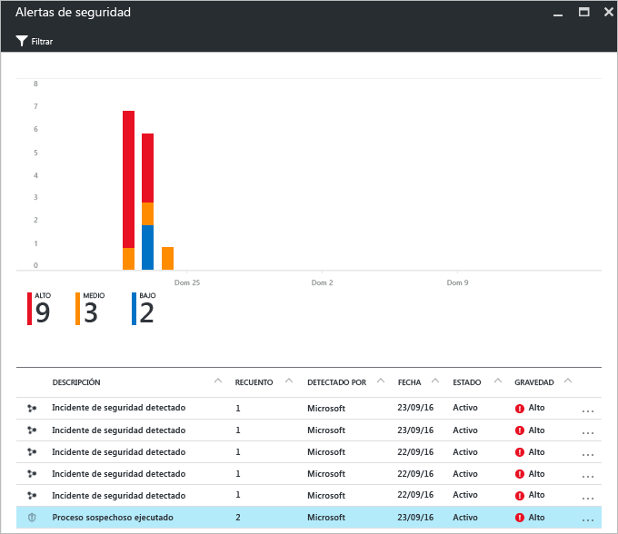
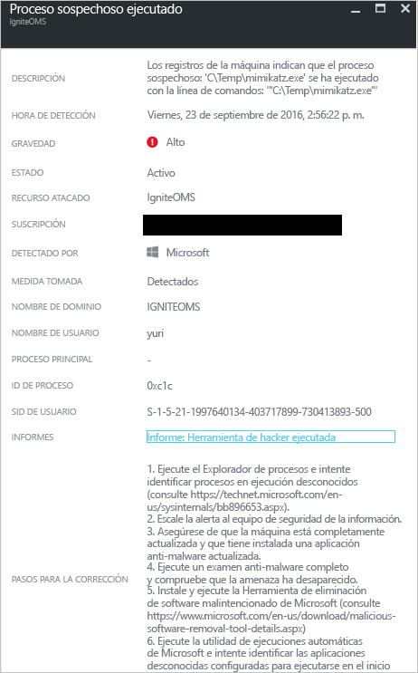

# Informe de inteligencia frente a amenazas de Azure Security Center
En este documento se explica cómo los informes de inteligencia frente a amenazas de Azure Security Center pueden ayudarle a aprender más sobre una amenaza que ha generado una alerta de seguridad.

## ¿Qué es un informe de inteligencia frente a amenazas?
La detección de amenazas de Security supervisa la información de seguridad de sus recursos de Azure, la red y las soluciones de asociados relacionadas. Después, analiza estos datos (a menudo, relacionando la información de diferentes orígenes) para identificar las amenazas. Este proceso forma parte de las [funcionalidades de detección](security-center-detection-capabilities.md) de Security Center.

Cuando Security Center identifica una amenaza, desencadena una [alerta de seguridad](security-center-managing-and-responding-alerts.md), que contiene información detallada sobre un evento determinado, junto con sugerencias para remediarlo. Para ayudar a los equipos de respuesta a incidentes a investigar y solucionar las amenazas, Security Center incluye un informe de inteligencia frente a amenazas que contiene información sobre la amenaza detectada, y además:

* Identidad o asociaciones del atacante (si esta información está disponible)
* Objetivos de los atacantes
* Campañas de ataques históricas y actuales (si esta información está disponible)
* Tácticas, herramientas y procedimientos de los atacantes
* Indicadores asociados de peligro (IoC), como direcciones URL y hash de archivo
* Victimología, que es el predominio geográfico y del sector para ayudarle a determinar si sus recursos de Azure están en peligro
* Información de corrección y mitigación

> [!NOTE]
> La cantidad de información de cualquier informe determinado variará; el nivel de detalle se basa en la actividad y el predominio del malware.
>
>

Security Center tiene tres tipos de informes de amenazas, que pueden variar según el ataque. Los informes disponibles son:

* **Informe de grupo de actividad**: proporciona información detallada sobre los atacantes, sus objetivos y las tácticas que empelan.
* **Informe de campaña**: se centra en los detalles de campañas de ataque específicas.
* **Informe de resumen de amenazas**: cubre todos los elementos de los dos informes anteriores.

Este tipo de información es muy útil durante los procesos de [respuesta a incidentes](security-center-incident-response.md), donde hay una investigación en curso para comprender el origen del ataque, las motivaciones del atacante y lo que se debe hacer para mitigar este problema más adelante.

## ¿Cómo acceder al informe de inteligencia frente a amenazas?
Puede revisar las alertas actuales en el icono **Alertas de seguridad** . Abra Azure Portal y siga los pasos siguientes para ver más detalles sobre cada alerta:

1. En el panel Security Center, verá el icono **Alertas de seguridad** .
2. Haga clic en el icono para abrir la hoja **Alertas de seguridad** que contiene información más detallada sobre las alertas y haga clic en la alerta de seguridad sobre la que quiere más información.

    
3. En este caso, la hoja **Suspicious process executed** (Proceso sospechoso ejecutado) muestra los detalles sobre la alerta, como se puede ver en la siguiente ilustración:

    
4. La cantidad de información disponible para cada alerta de seguridad variará según el tipo de alerta. En el campo **INFORMES** hay un vínculo al informe de inteligencia frente a amenazas. Haga clic en él. Aparecerá otra ventana del explorador con el archivo PDF.

   

Desde aquí puede descargar el PDF de este informe y leer más sobre el problema de seguridad que se ha detectado para actuar en función de la información proporcionada.

## Consulte también
En este documento, ha aprendido cómo los informes de inteligencia frente a amenazas de Azure Security Center pueden ayudar durante una investigación sobre alertas de seguridad. Para obtener más información sobre el Centro de seguridad de Azure, consulte los siguientes recursos:

* [Preguntas más frecuentes sobre Azure Security Center](security-center-faq.md). Preguntas más frecuentes acerca del uso del servicio.
* [Cómo aprovechar Azure Security Center para dar respuesta a incidentes](security-center-incident-response.md)
* [Funcionalidades de detección de Azure Security Center](security-center-detection-capabilities.md)
* [Guía de planeamiento y operaciones de Azure Security Center](security-center-planning-and-operations-guide.md). Aprenda a planificar y entender las consideraciones de diseño para adoptar Azure Security Center.
* [Administración y respuesta a las alertas de seguridad en Azure Security Center](security-center-managing-and-responding-alerts.md). Aprenda a administrar y responder a las alertas de seguridad.
* [Control de incidentes de seguridad en Azure Security Center](security-center-incident.md)
* [Blog de seguridad de Azure](http://blogs.msdn.com/b/azuresecurity/). Encuentre artículos de blog sobre el cumplimiento y la seguridad de Azure.
