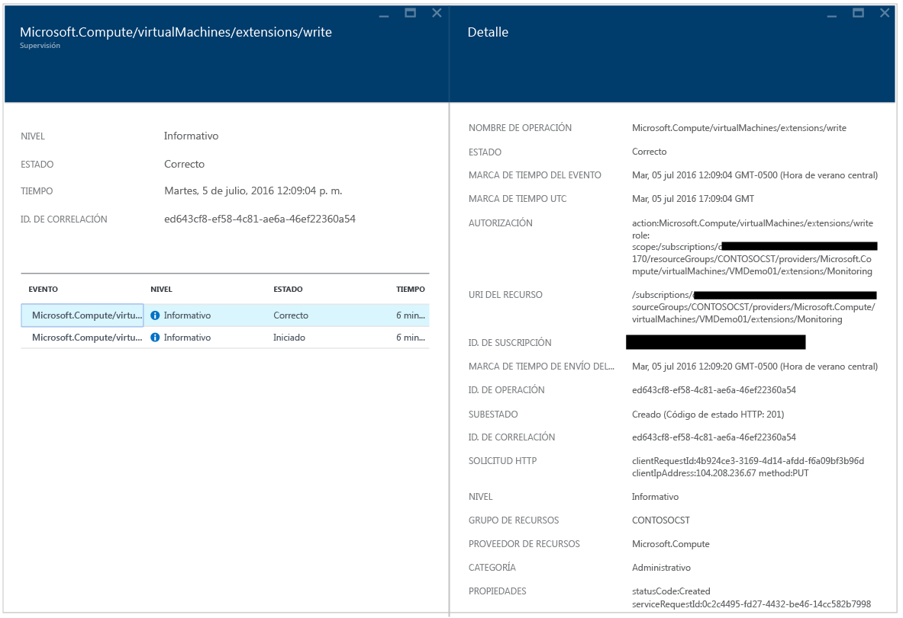

# Guía de solución de problemas de Azure Security Center
Esta guía está destinada a profesionales de tecnologías de la información (TI), analistas de seguridad de la información y administradores de la nube cuyas organizaciones utilizan Azure Security Center y necesitan solucionar problemas relacionados con Security Center.

## Guía de solución de problemas
Esta guía explica cómo solucionar problemas relacionados con Security Center. La mayoría de las soluciones de problemas en Security Center se realizan examinando primero el [registro de auditoría](https://azure.microsoft.com/updates/audit-logs-in-azure-preview-portal/) del componente afectado. A través de los registros de auditoría puede determinar:

* Qué operaciones se han llevado a cabo
* Quién inició la operación
* Cuándo tuvo lugar la operación
* El estado de la operación
* Los valores de otras propiedades que podrían ayudarle en la investigación de la operación

El registro de auditoría contiene todas las operaciones de escritura (PUT, POST, DELETE) realizadas en los recursos, pero no incluye las operaciones de lectura (GET).

## Solución de problemas de instalación del agente de supervisión en Windows
El agente de supervisión de Security Center se utiliza para realizar la recopilación de datos. Una vez habilitada la recopilación de datos e instalado correctamente el agente en el equipo de destino, los siguientes procesos deben estar en ejecución:

* ASMAgentLauncher.exe: agente de supervisión de Azure 
* ASMMonitoringAgent.exe: extensión Supervisión de seguridad de Azure
* ASMSoftwareScanner.exe: administrador de análisis de Azure

La extensión Supervisión de seguridad de Azure busca diversas configuraciones relevantes para la seguridad y recopila registros de seguridad de la máquina virtual. El administrador de análisis se utilizará como un detector de revisiones.

Si la instalación se realizó correctamente, debería ver una entrada similar a la siguiente en los Registros de auditoría para la máquina virtual de destino:

También puede obtener más información sobre el proceso de instalación leyendo los registros del agente, que se encuentran en *%systemdrive%\windowsazure\logs* (ejemplo: C:\WindowsAzure\Logs).

> [!NOTE]
> Si el comportamiento del agente de Azure Security Center no es correcto, debe reiniciar la máquina virtual de destino, ya que no hay ningún comando para detener e iniciar al agente.
> 
> 

## Solución de problemas de instalación del agente de supervisión en Linux
Al solucionar problemas de instalación del agente de máquina virtual en un sistema Linux, debe asegurarse de que la extensión se descargó en /var/lib/waagent/. Puede ejecutar el comando siguiente para comprobar si se ha instalado:

`cat /var/log/waagent.log` 

Los otros archivos de registro que puede consultar para la solución de problemas son: 

* /var/log/mdsd.err
* /var/log/azure/

En un sistema de trabajo debería ver una conexión con el proceso mdsd en TCP 29130. Se trata del registro syslog comunicándose con el proceso de mdsd. Para validar este comportamiento, ejecute el comando siguiente:

`netstat -plantu | grep 29130`

## Contacto con el soporte técnico de Microsoft
Algunos problemas pueden identificarse mediante las instrucciones proporcionadas en este artículo; también puede encontrar otros en el [foro](https://social.msdn.microsoft.com/Forums/en-US/home?forum=AzureSecurityCenter)público de Security Center. Sin embargo, si necesita más información para solucionar el problema, puede abrir una nueva solicitud de soporte técnico mediante el Portal de Azure, como se indica a continuación: 

## Consulte también
En este documento ha aprendido a configurar directivas de seguridad en el Centro de seguridad de Azure. Para obtener más información sobre el Centro de seguridad de Azure, consulte los siguientes recursos:

* [Guía de planeamiento y operaciones de Azure Security Center](security-center-planning-and-operations-guide.md) : aprenda a planear y conozca las consideraciones de diseño necesarias para usar Azure Security Center.
* [Supervisión del estado de seguridad en Azure Security Center](security-center-monitoring.md) : obtenga información sobre cómo supervisar el estado de los recursos de Azure.
* [Administración y respuesta a las alertas de seguridad en Azure Security Center](security-center-managing-and-responding-alerts.md) : obtenga información sobre cómo administrar y responder a alertas de seguridad.
* [Supervisión de las soluciones de asociados con Azure Security Center](security-center-partner-solutions.md) : aprenda a supervisar el estado de mantenimiento de las soluciones de asociados.
* [Preguntas más frecuentes sobre Azure Security Center](security-center-faq.md) : encuentre las preguntas más frecuentes sobre el uso del servicio.
* [Blog de seguridad de Azure](http://blogs.msdn.com/b/azuresecurity/) : encuentre entradas de blog sobre el cumplimiento y la seguridad de Azure.

<!--HONumber=Nov16_HO2-->

