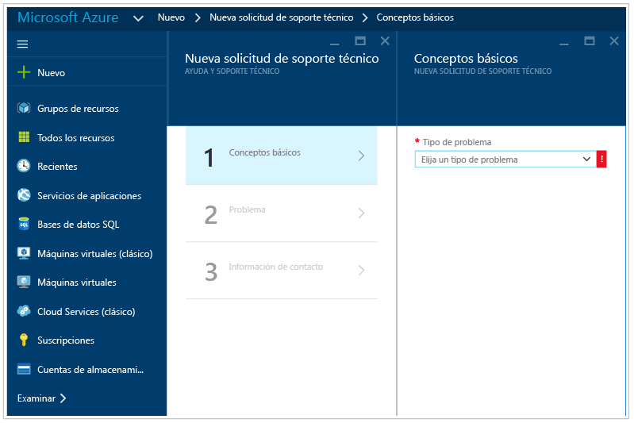

# Guía de solución de problemas de Azure Security Center
Esta guía está destinada a profesionales de tecnologías de la información (TI), analistas de seguridad de la información y administradores de la nube cuyas organizaciones utilizan Azure Security Center y necesitan solucionar problemas relacionados con Security Center.

>[!NOTE] 
>Desde primeros de junio de 2017, Security Center usa Microsoft Monitoring Agent para recopilar y almacenar datos. Consulte [Migración de la plataforma de Azure Security Center](security-center-platform-migration.md) para más información. La información de este artículo representa la funcionalidad de Security Center después de la transición a Microsoft Monitoring Agent.
>

## Guía de solución de problemas
Esta guía explica cómo solucionar problemas relacionados con Security Center. La mayoría de las soluciones de problemas en Security Center se realizan examinando primero el [registro de auditoría](https://azure.microsoft.com/updates/audit-logs-in-azure-preview-portal/) del componente afectado. A través de los registros de auditoría puede determinar:

* Qué operaciones se han llevado a cabo
* Quién inició la operación
* Cuándo tuvo lugar la operación
* El estado de la operación
* Los valores de otras propiedades que podrían ayudarle en la investigación de la operación

El registro de auditoría contiene todas las operaciones de escritura (PUT, POST, DELETE) realizadas en los recursos, pero no incluye las operaciones de lectura (GET).

## Microsoft Monitoring Agent
Security Center usa Microsoft Monitoring Agent, que es el mismo agente que usan la solución Operations Management Suite y el servicio Log Analytics, para recopilar datos de seguridad de las máquinas virtuales de Azure. Una vez que se ha habilitado la recopilación de datos y se ha instalado correctamente el agente en la máquina de destino, los siguientes procesos deben estar en ejecución:

* HealthService.exe

Si abre la consola de administración de servicios (services.msc), también verá el servicio Microsoft Monitoring Agent que se ejecuta como se muestra a continuación:

Para ver qué versión del agente tiene, abra **Administrador de tareas**, en la pestaña **Procesos** busque el servicio **Microsoft Monitoring Agent**, haga clic en él con el botón derecho y haga clic en **Propiedades**. En la pestaña **Detalles**, examine la versión del archivo tal y como se muestra a continuación:

   

## Escenarios de instalación de Microsoft Monitoring Agent
Existen dos escenarios de instalación que pueden producir resultados diferentes al instalar Microsoft Monitoring Agent en el equipo. Los escenarios admitidos son:

* **Agente instalado automáticamente por Security Center**: en este escenario podrá ver las alertas en ambas ubicaciones: Security Center y la búsqueda de registros. Recibirá notificaciones por correo electrónico a la dirección de correo electrónico que configuró en la directiva de seguridad para la suscripción a la que pertenece el recurso.
.
* **Agente instalado manualmente en una máquina virtual ubicada en Azure**: en este escenario, si está usando los agentes descargados e instalados antes de febrero de 2017, podrá ver las alertas en el portal de Security Center solo si filtra por la suscripción a la que pertenece el área de trabajo. En caso de filtrar por la suscripción a la que pertenece el recurso, no podrá ver ninguna alerta. Recibirá notificaciones por correo electrónico a la dirección de correo electrónico que configuró en la directiva de seguridad para la suscripción a la que pertenece el área de trabajo.

>[!NOTE]
> Para evitar el comportamiento explicado en el segundo caso, asegúrese de que descargar la versión más reciente del agente.
> 

## Solución de problemas de los requisitos e red del agente de supervisión
Para que los agentes se puedan conectar a Security Center y registrarse ahí, deben tener acceso a los recursos de red, lo que incluye los números de puerto y las direcciones URL de dominio.

- Para los servidores proxy, debe asegurarse de que los recursos de servidor proxy adecuados están configurados en la configuración del agente. Lea este artículo para más información sobre [cómo cambiar la configuración del servidor proxy](https://docs.microsoft.com/en-us/azure/log-analytics/log-analytics-windows-agents#configure-proxy-settings).
- Si usa un firewall para restringir el acceso a Internet, deberá configurarlo para que permita el acceso a OMS. No es necesario realizar ninguna acción en la configuración del agente.

En la siguiente tabla se muestran los recursos necesarios para la comunicación.

| Recurso del agente | Puertos | Omitir inspección de HTTPS |
|---|---|---|
| *.ods.opinsights.azure.com | 443 | Sí |
| *.oms.opinsights.azure.com | 443 | Sí |
| *.blob.core.windows.net | 443 | Sí |
| *.azure-automation.net | 443 | Sí |

Si experimenta problemas con la incorporación del agente, asegúrese de leer el artículo [Solución de problemas de incorporación en Operations Management Suite](https://support.microsoft.com/en-us/help/3126513/how-to-troubleshoot-operations-management-suite-onboarding-issues).

## La solución de problemas de Endpoint Protection no funciona correctamente

El agente invitado es el proceso primario de todo lo que hace la extensión [Microsoft Antimalware](../security/azure-security-antimalware.md). Cuando se produce un error en el proceso del agente invitado, es posible que se produzca un error en la instancia de Microsoft Antimalware que se ejecuta como proceso secundario del agente invitado.  En escenarios como este se recomienda comprobar las opciones siguientes:

- Si la máquina virtual de destino es una imagen personalizada y el creador de la máquina virtual nunca instaló el agente invitado.
- Si el destino es una máquina virtual de Linux en lugar de una máquina virtual de Windows, se producirá un error en la instalación de la versión de Windows de la extensión del antimalware en una máquina virtual de Linux. El agente invitado Linux tiene requisitos específicos en términos de la versión de SO y los paquetes necesarios y si no se cumplen esos requisitos, el agente de máquina virtual no funcionará ahí tampoco. 
- Si la máquina virtual se creó con una versión anterior del agente invitado. Si así fue, debe tener en cuenta que es posible que algunos agentes anteriores no realicen actualizaciones automáticas a la versión más recientes, lo que podría generar este problema. Use siempre la versión más reciente del agente invitado si crea sus propias imágenes.
- Algunos software de administración de terceros podrían deshabilitar el agente invitado o bloquear el acceso a ciertas ubicaciones de archivos. Si tiene instalado este tipo de software de terceros en la máquina virtual, asegúrese de que el agente esté en la lista de exclusiones.
- Ciertos ajustes del firewall o un grupo de seguridad de red (NSG) pueden bloquear el tráfico de red desde y hacia el agente invitado.
- Cierta lista de control de acceso (ACL) puede impedir el acceso al disco.
- La falta de espacio en disco puede impedir que el agente invitado funcione correctamente. 

De manera predeterminada, la interfaz de usuario de Microsoft Antimalware está deshabilitada, lea [Enabling Microsoft Antimalware User Interface on Azure Resource Manager VMs Post Deployment](https://blogs.msdn.microsoft.com/azuresecurity/2016/03/09/enabling-microsoft-antimalware-user-interface-post-deployment/) (Habilitación de la interfaz de usuario de Microsoft Antimalware en máquinas virtuales de Azure Resource Manager tras la implementación) para más información sobre cómo habilitarla si necesita hacerlo.

## Solución de problemas al cargar el panel

Si experimenta problemas al cargar el panel de Security Center, asegúrese de que el usuario que registra la suscripción a Security Center (es decir, el primer usuario que abrió Security Center con la suscripción) y el usuario que desearía activar la recopilación de datos son *propietarios* o *colaboradores* en la suscripción. A partir de ese momento, los usuarios *lectores* en la suscripción también podrán ver el panel, las alertas, las recomendaciones y las directivas.

## Contacto con el soporte técnico de Microsoft
Algunos problemas pueden identificarse mediante las instrucciones proporcionadas en este artículo; también puede encontrar otros en el [foro](https://social.msdn.microsoft.com/Forums/en-US/home?forum=AzureSecurityCenter)público de Security Center. Sin embargo, si necesita más información para solucionar el problema, puede abrir una nueva solicitud de soporte técnico mediante **Azure Portal**, como se indica a continuación: 

## Consulte también
En este documento ha aprendido a configurar directivas de seguridad en el Centro de seguridad de Azure. Para obtener más información sobre el Centro de seguridad de Azure, consulte los siguientes recursos:

* [Guía de planeamiento y operaciones de Azure Security Center](security-center-planning-and-operations-guide.md) : aprenda a planear y conozca las consideraciones de diseño necesarias para usar Azure Security Center.
* [Supervisión del estado de seguridad en Azure Security Center](security-center-monitoring.md) : obtenga información sobre cómo supervisar el estado de los recursos de Azure.
* [Administración y respuesta a las alertas de seguridad en Azure Security Center](security-center-managing-and-responding-alerts.md) : obtenga información sobre cómo administrar y responder a alertas de seguridad.
* [Supervisión de las soluciones de asociados con Azure Security Center](security-center-partner-solutions.md) : aprenda a supervisar el estado de mantenimiento de las soluciones de asociados.
* [Preguntas más frecuentes sobre Azure Security Center](security-center-faq.md) : encuentre las preguntas más frecuentes sobre el uso del servicio.
* [Blog de seguridad de Azure](http://blogs.msdn.com/b/azuresecurity/) : encuentre entradas de blog sobre el cumplimiento y la seguridad de Azure.

