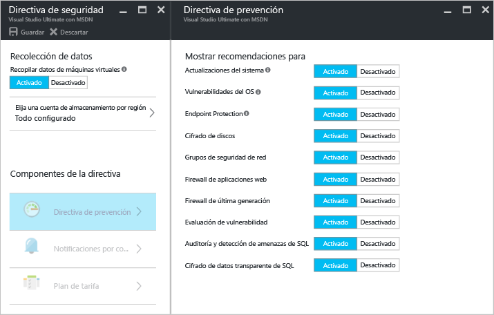
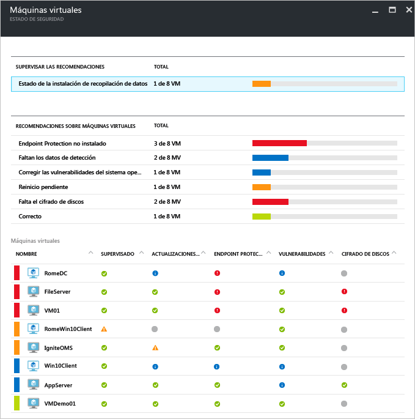
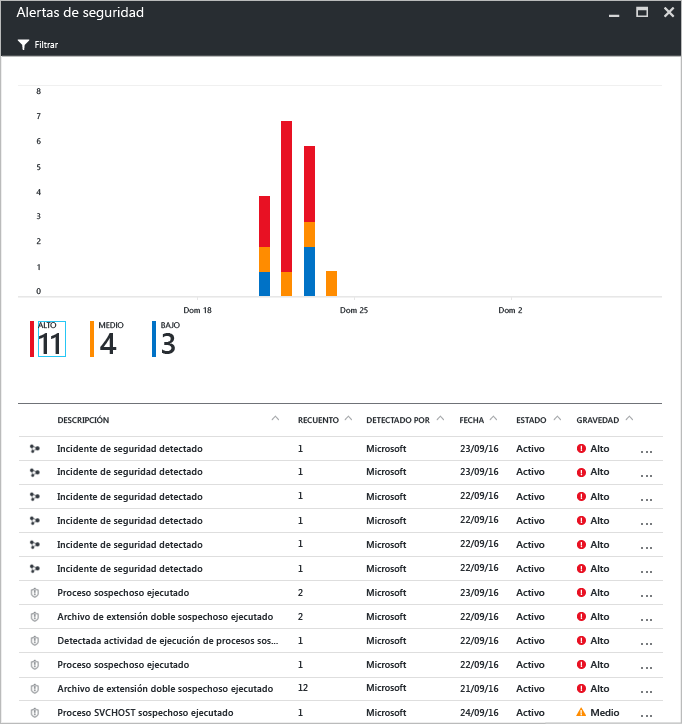

# Azure Security Center y Azure Virtual Machines
[Azure Security Center](https://azure.microsoft.com/services/security-center/) ayuda a evita y a detectar las amenazas, además de a responder a ellas. Proporciona administración de directivas y supervisión de la seguridad integrada en las suscripciones de Azure, ayuda a detectar las amenazas que podrían pasar desapercibidas y funciona con un amplio ecosistema de soluciones de seguridad.

En este artículo se explica cómo Security Center puede ayudarle a proteger las instancias de Azure Virtual Machines (VM).

## Razones para usar Security Center
Security Center le ayuda a proteger los datos de máquinas virtuales en Azure proporcionando visibilidad en la configuración de seguridad de su máquina virtual. Cuando Security Center protege las máquinas virtuales, las siguientes funcionalidades están disponibles:

* Configuración de seguridad del sistema operativo (SO) con las reglas de configuración recomendadas
* Seguridad del sistema y actualizaciones críticas que faltan
* Recomendaciones de protección de puntos de conexión
* Validación de cifrado de disco
* Evaluación y corrección de vulnerabilidades
* Detección de amenazas

Además de ayudarle a proteger las máquinas virtuales de Azure, Security Center también proporciona funcionalidades de administración y supervisión de seguridad de Cloud Services, App Services, Virtual Networks y mucho más. 

> [!NOTE]
> Para más información sobre Azure Security Center, consulte el artículo [Introducción a Azure Security Center](security-center-intro.md).
> 
> 

## Requisitos previos
Para empezar a trabajar con Azure Security Center, debe conocer y tener en cuenta lo siguiente:

* Debe disponer de una suscripción a Microsoft Azure. Para más información sobre los niveles Gratis y Estándar de Security Center, consulte [Precios de Security Center](https://azure.microsoft.com/pricing/details/security-center/).
* Planee la adopción de Security Center. Para ello, consulte la [Guía de planeamiento y operaciones de Azure Security Center](security-center-planning-and-operations-guide.md) para más información sobre consideraciones de este tipo.
* Para más información sobre la compatibilidad del sistema operativo, consulte [Preguntas más frecuentes (P+F) sobre Azure Security Center](security-center-faq.md). 

## Establecimiento de directivas de seguridad
Se debe habilitar la recopilación de datos para que Azure Security Center pueda recopilar la información que necesita para proporcionar recomendaciones y alertas que se generarán en función de la directiva de seguridad que configure. En la ilustración siguiente, puede ver que **la recopilación de datos** se ha **activado**.

Una directiva de seguridad define el conjunto de controles recomendados para los recursos en la suscripción o el grupo de recursos especificados. Antes de habilitar la directiva de seguridad, debe habilitar la recopilación de datos ya que Security Center recopilará datos de las máquinas virtuales para evaluar su estado de seguridad, proporcionar recomendaciones de seguridad y avisarle de las amenazas. En Security Center, el usuario define directivas para las suscripciones o grupos de recursos de Azure de acuerdo con las necesidades de seguridad de la compañía y el tipo de aplicaciones o la confidencialidad de los datos de cada suscripción. 

> [!NOTE]
> Para más información sobre cada una de las **directivas de prevención** disponibles, consulte el artículo [Configuración de directivas de seguridad](security-center-policies.md).
> 
> 

## Administración de recomendaciones de seguridad
El Centro de seguridad analiza el estado de seguridad de los recursos de Azure. Cuando el Centro de seguridad identifica vulnerabilidades de seguridad potenciales, crea recomendaciones. Las recomendaciones le guían en el proceso de configuración de los controles necesarios.

Después de establecer una directiva de seguridad, el Centro de seguridad analiza el estado de seguridad de los recursos, con el fin de identificar vulnerabilidades potenciales. Las recomendaciones aparecen en un formato de tabla, donde cada línea representa una recomendación determinada. En la tabla siguiente se proporcionan algunos ejemplos de recomendaciones para máquinas virtuales de Azure y lo que sucede si se aplica cada una de ellas. Cuando selecciona una recomendación, se le proporciona información que muestra cómo implementar la recomendación en Security Center.

| Recomendación | Description |
| --- | --- |
| [Habilitar la colección de datos de las suscripciones](security-center-enable-data-collection.md) |Recomienda activar la recopilación de datos en la directiva de seguridad para cada una de las suscripciones y para todas las máquinas virtuales de la suscripción. |
| [Corrección de vulnerabilidades del SO](security-center-remediate-os-vulnerabilities.md) |Recomienda armonizar las configuraciones del SO con las reglas de configuración recomendadas; por ejemplo, no permitir guardar las contraseñas. |
| [Aplicar actualizaciones del sistema](security-center-apply-system-updates.md) |Recomienda implementar las actualizaciones críticas y de seguridad del sistema en las máquinas virtuales. |
| [Reiniciar tras actualizar el sistema](security-center-apply-system-updates.md#reboot-after-system-updates) |Se recomienda que reinicie una máquina virtual para completar el proceso de aplicación de actualizaciones del sistema. |
| [Instalación de Endpoint Protection](security-center-install-endpoint-protection.md) |Recomienda aprovisionar programas antimalware a las máquinas virtuales (solo máquinas virtuales de Windows). |
| [Habilitar el Agente de máquina virtual](security-center-enable-vm-agent.md) |Permite ver las VM que requieren el Agente de VM. El agente de máquina virtual debe estar instalado en las máquinas virtuales para aprovisionar la detección de revisiones, la detección de línea de base y los programas antimalware. De manera predeterminada, el agente de máquina virtual está instalado en las máquinas virtuales que se implementan desde Azure Marketplace. El artículo [VM Agent and Extensions – Part 2](http://azure.microsoft.com/blog/2014/04/15/vm-agent-and-extensions-part-2/) (Agente de VM y extensiones, parte 2) proporciona información sobre cómo instalar el Agente de VM. |
| [Aplicar cifrado de discos](security-center-apply-disk-encryption.md) |Se recomienda cifrar los discos de la máquina virtual mediante Cifrado de discos de Azure (máquinas virtuales Linux y Windows). Se recomienda cifrar tanto los volúmenes de datos como los del sistema operativo en la máquina virtual. |
| [Evaluación de vulnerabilidades no instalada](security-center-vulnerability-assessment-recommendations.md) |Se recomienda instalar una solución de evaluación de vulnerabilidades en la máquina virtual. |
| [Corrección de vulnerabilidades](security-center-vulnerability-assessment-recommendations.md#review-the-recommendation) |Permite ver las vulnerabilidades tanto del sistema como de las aplicaciones que ha detectado la solución de evaluación de vulnerabilidades instalada en la máquina virtual. |

> [!NOTE]
> Para más información sobre las recomendaciones, consulte el artículo sobre cómo [administrar recomendaciones de seguridad](security-center-recommendations.md).
> 
> 

## Supervisión del estado de la seguridad
Después de habilitar las [directivas de seguridad](security-center-policies.md) para los recursos de una suscripción, Security Center analizará la seguridad de los recursos para identificar vulnerabilidades potenciales.  Puede consultar el estado de seguridad de sus recursos, además de cualquier problema que exista, en las hojas de **Estado de seguridad de los recursos**. Al hacer clic en **Máquinas virtuales** en el icono de estado de **seguridad del recurso**, se abrirá la hoja **Máquinas virtuales** con las recomendaciones para estas. 

## Administración de las alertas de seguridad y respuesta a ellas
Security Center recopila, analiza e integra automáticamente los datos de registro de los recursos de Azure, la red y las soluciones de asociados conectados, como firewalls y soluciones de protección de puntos de conexión, para detectar amenazas reales y reducir los falsos positivos. Gracias a una agrupación variada de [funcionalidades de detección](security-center-detection-capabilities.md), Security Center es capaz de generar alertas de seguridad por prioridad para ayudarle a investigar el problema rápidamente y proporcionar recomendaciones para corregir posibles ataques.

Seleccione una alerta de seguridad para ver más información sobre el evento o los eventos que la desencadenaron y, si existen, los pasos que debe seguir para corregir un ataque. Las alertas de seguridad se agrupan según el [tipo](security-center-alerts-type.md) y la fecha.

## Consulte también
Para más información sobre el Centro de seguridad, consulte los siguientes recursos:

* [Establecimiento de directivas de seguridad en Azure Security Center](security-center-policies.md) : aprenda a configurar directivas de seguridad para las suscripciones y los grupos de recursos de Azure.
* [Administración y respuesta a las alertas de seguridad en Azure Security Center](security-center-managing-and-responding-alerts.md) : obtenga información sobre cómo administrar y responder a alertas de seguridad.
* [Preguntas más frecuentes sobre Azure Security Center](security-center-faq.md) : encuentre las preguntas más frecuentes sobre el uso del servicio.

