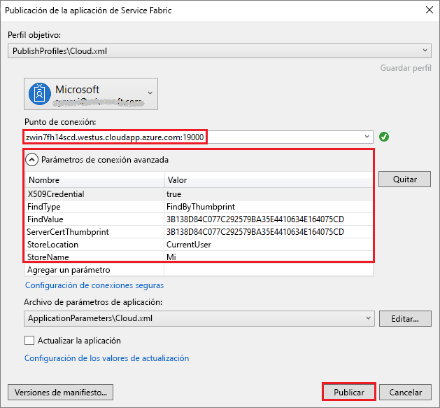

# <a name="deploy-a-service-fabric-windows-container-application-on-azure"></a>Implementación de una aplicación contenedora Windows de Service Fabric en Azure
Azure Service Fabric es una plataforma de sistemas distribuidos para implementar y administrar microservicios y contenedores escalables y confiables. 

Para ejecutar una aplicación que existe en un contenedor de Windows en un clúster de Service Fabric no hay que hacer ningún cambio en la aplicación. Esta guía de inicio rápido muestra cómo implementar una imagen de contenedor Docker creada previamente en una aplicación de Service Fabric. Cuando haya terminado, tendrá un contenedor de Windows Server 2016 Nano e IIS en ejecución. Esta guía de inicio rápido describe la implementación de un contenedor Windows; lea [esta otra guía](service-fabric-quickstart-containers-linux.md) para implementar un contenedor Linux.

![Página web predeterminada de IIS][iis-default]

Este tutorial tratará los siguientes aspectos:
> [!div class="checklist"]
> * Empaquetado de un contenedor de imagen de Docker
> * Configuración de la comunicación
> * Creación y empaquetamiento de la aplicación de Service Fabric
> * Implementación de la aplicación contenedora en Azure

## <a name="prerequisites"></a>Requisitos previos
* Una suscripción de Azure (puede crear una [cuenta gratuita](https://azure.microsoft.com/free/?WT.mc_id=A261C142F)).
* Un equipo de desarrollo en el que se ejecute:
  * Visual Studio 2015 o Visual Studio 2017.
  * [SDK y herramientas de Service Fabric](service-fabric-get-started.md).

## <a name="package-a-docker-image-container-with-visual-studio"></a>Empaquetado de un contenedor de imagen de Docker con Visual Studio
Las herramientas y el SDK de Service Fabric proporcionan una plantilla de servicio que le ayuda a implementar un contenedor en un clúster de Service Fabric.

Inicie Visual Studio como administrador.  Seleccione **Archivo** > **Nuevo** > **Proyecto**.

Seleccione **Aplicación de Service Fabric**, asígnele el nombre "MyFirstContainer" y haga clic en **Aceptar**.

Seleccione **Contenedor** en la lista de **plantillas del servicio**.

En **Nombre de imagen**, escriba "microsoft/iis:nanoserver", la [imagen de base de Windows Server Nano Server e IIS](https://hub.docker.com/r/microsoft/iis/). 

Asigne el nombre "MyContainerService" al servicio y haga clic en **Aceptar**.

## <a name="configure-communication-and-container-port-to-host-port-mapping"></a>Configuración de la comunicación y asignación del puerto "puerto a host" del contenedor
El servicio necesita un punto de conexión para la comunicación.  Agregue el protocolo, el puerto y el tipo a un `Endpoint` en el archivo ServiceManifest.xml. Para esta guía de inicio rápido, el servicio en contenedor realiza escuchas en el puerto 80: 

```xml
<Endpoint Name="MyContainerServiceTypeEndpoint" UriScheme="http" Port="80" Protocol="http"/>
```
Si se especifica `UriScheme`, se registra automáticamente el punto de conexión del contenedor con el servicio de nombres de Service Fabric para facilitar la detección. Al final de este artículo se proporciona un archivo ServiceManifest.xml de ejemplo. 

Configure la asignación de puertos de puerto a host del contenedor, para lo que debe especificar una directiva de `PortBinding` en `ContainerHostPolicies` del archivo ApplicationManifest.xml.  Para esta guía de inicio rápido, `ContainerPort` es 80 y `EndpointRef` es "MyContainerServiceTypeEndpoint" (el punto de conexión definido en el manifiesto del servicio).  Las solicitudes entrantes para el servicio en el puerto 80 se asignan al puerto 80 del contenedor.  

```xml
<ServiceManifestImport>
...
  <ConfigOverrides />
  <Policies>
    <ContainerHostPolicies CodePackageRef="Code">
      <PortBinding ContainerPort="80" EndpointRef="MyContainerServiceTypeEndpoint"/>
    </ContainerHostPolicies>
  </Policies>
</ServiceManifestImport>
```

Al final de este artículo se proporciona un archivo ApplicationManifest.xml de ejemplo.

## <a name="create-a-cluster"></a>Crear un clúster
Para implementar la aplicación en un clúster de Azure, puede crear su propio clúster o usar un clúster de entidad.

Los clústeres de entidad son clústeres de Service Fabric gratuitos y de duración limitada, hospedados en Azure y ejecutados por el equipo de Service Fabric, donde cualquier usuario puede implementar aplicaciones y obtener información sobre la plataforma. Para obtener acceso a un clúster de entidad, [siga estas instrucciones](http://aka.ms/tryservicefabric).  

Para obtener información sobre cómo crear su propio clúster, vea [Creación de un clúster de Service Fabric en Azure](service-fabric-tutorial-create-vnet-and-windows-cluster.md).

Tome nota del punto de conexión, que se utiliza en el paso siguiente.  

## <a name="deploy-the-application-to-azure-using-visual-studio"></a>Implementación de la aplicación en Azure con Visual Studio
Ahora que la aplicación está lista, puede implementarla en un clúster directamente desde Visual Studio.

Haga clic con el botón derecho en **MyFirstContainer** en el Explorador de soluciones y seleccione **Publicar**. Aparece el cuadro de diálogo de publicación.



Especifique el punto de conexión del clúster en el campo **Punto de conexión**. Al registrarse para el clúster de entidad, el punto de conexión se proporciona en el explorador, por ejemplo, `winh1x87d1d.westus.cloudapp.azure.com:19000`.  Haga clic en **Publicar** y la aplicación se implementa.

Abra un explorador y vaya a http://winh1x87d1d.westus.cloudapp.azure.com:80. Debería ver la página web predeterminada de IIS: ![Página web predeterminada de IIS][iis-default]

## <a name="complete-example-service-fabric-application-and-service-manifests"></a>Manifiestos de servicio y de aplicación de Service Fabric de ejemplo completos
Estos son los manifiestos de servicio y de aplicación completos que se usan en esta guía de inicio rápido.

### <a name="servicemanifestxml"></a>ServiceManifest.xml
```xml
<?xml version="1.0" encoding="utf-8"?>
<ServiceManifest Name="MyContainerServicePkg"
                 Version="1.0.0"
                 xmlns="http://schemas.microsoft.com/2011/01/fabric"
                 xmlns:xsd="http://www.w3.org/2001/XMLSchema"
                 xmlns:xsi="http://www.w3.org/2001/XMLSchema-instance">
  <ServiceTypes>
    <!-- This is the name of your ServiceType.
         The UseImplicitHost attribute indicates this is a guest service. -->
    <StatelessServiceType ServiceTypeName="MyContainerServiceType" UseImplicitHost="true" />
  </ServiceTypes>

  <!-- Code package is your service executable. -->
  <CodePackage Name="Code" Version="1.0.0">
    <EntryPoint>
      <!-- Follow this link for more information about deploying Windows containers to Service Fabric: https://aka.ms/sfguestcontainers -->
      <ContainerHost>
        <ImageName>microsoft/iis:nanoserver</ImageName>
      </ContainerHost>
    </EntryPoint>
    <!-- Pass environment variables to your container: -->
    <!--
    <EnvironmentVariables>
      <EnvironmentVariable Name="VariableName" Value="VariableValue"/>
    </EnvironmentVariables>
    -->
  </CodePackage>

  <!-- Config package is the contents of the Config directoy under PackageRoot that contains an 
       independently-updateable and versioned set of custom configuration settings for your service. -->
  <ConfigPackage Name="Config" Version="1.0.0" />

  <Resources>
    <Endpoints>
      <!-- This endpoint is used by the communication listener to obtain the port on which to 
           listen. Please note that if your service is partitioned, this port is shared with 
           replicas of different partitions that are placed in your code. -->
      <Endpoint Name="MyContainerServiceTypeEndpoint" UriScheme="http" Port="80" Protocol="http"/>
    </Endpoints>
  </Resources>
</ServiceManifest>
```
### <a name="applicationmanifestxml"></a>ApplicationManifest.xml
```xml
<?xml version="1.0" encoding="utf-8"?>
<ApplicationManifest ApplicationTypeName="MyFirstContainerType"
                     ApplicationTypeVersion="1.0.0"
                     xmlns="http://schemas.microsoft.com/2011/01/fabric"
                     xmlns:xsd="http://www.w3.org/2001/XMLSchema"
                     xmlns:xsi="http://www.w3.org/2001/XMLSchema-instance">
  <Parameters>
    <Parameter Name="MyContainerService_InstanceCount" DefaultValue="-1" />
  </Parameters>
  <!-- Import the ServiceManifest from the ServicePackage. The ServiceManifestName and ServiceManifestVersion 
       should match the Name and Version attributes of the ServiceManifest element defined in the 
       ServiceManifest.xml file. -->
  <ServiceManifestImport>
    <ServiceManifestRef ServiceManifestName="MyContainerServicePkg" ServiceManifestVersion="1.0.0" />
    <ConfigOverrides />
    <Policies>
      <ContainerHostPolicies CodePackageRef="Code">
        <PortBinding ContainerPort="80" EndpointRef="MyContainerServiceTypeEndpoint"/>
      </ContainerHostPolicies>
    </Policies>
  </ServiceManifestImport>
  <DefaultServices>
    <!-- The section below creates instances of service types, when an instance of this 
         application type is created. You can also create one or more instances of service type using the 
         ServiceFabric PowerShell module.
         
         The attribute ServiceTypeName below must match the name defined in the imported ServiceManifest.xml file. -->
    <Service Name="MyContainerService" ServicePackageActivationMode="ExclusiveProcess">
      <StatelessService ServiceTypeName="MyContainerServiceType" InstanceCount="[MyContainerService_InstanceCount]">
        <SingletonPartition />
      </StatelessService>
    </Service>
  </DefaultServices>
</ApplicationManifest>
```

## <a name="next-steps"></a>Pasos siguientes
En este tutorial, ha aprendido a hacer lo siguiente:
> [!div class="checklist"]
> * Empaquetado de un contenedor de imagen de Docker
> * Configuración de la comunicación
> * Creación y empaquetamiento de la aplicación de Service Fabric
> * Implementación de la aplicación contenedora en Azure

* Más información acerca de cómo ejecutar [contenedores en Service Fabric](service-fabric-containers-overview.md).
* Consulte el tutorial [Implementación de una aplicación .NET en un contenedor](service-fabric-host-app-in-a-container.md).
* Más información acerca del [ciclo de vida de aplicaciones](service-fabric-application-lifecycle.md) de Service Fabric.
* Consulte [los ejemplos de código de contenedor de Service Fabric](https://github.com/Azure-Samples/service-fabric-containers) en GitHub.

[iis-default]: ./media/service-fabric-quickstart-containers/iis-default.png
[publish-dialog]: ./media/service-fabric-quickstart-containers/publish-dialog.png
