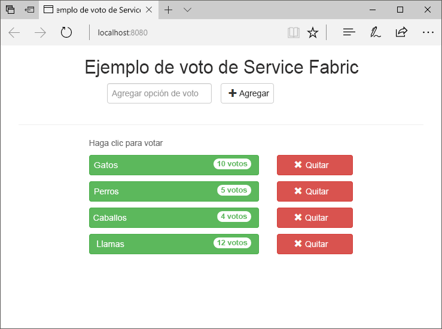
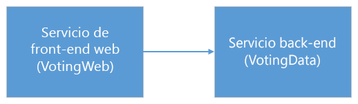
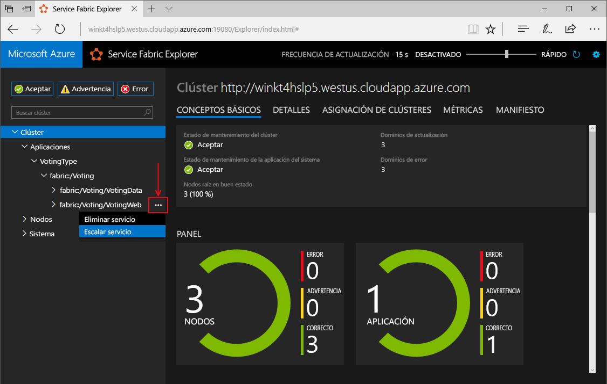
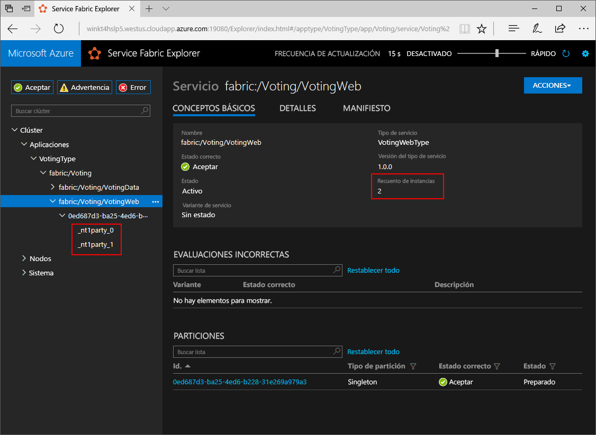
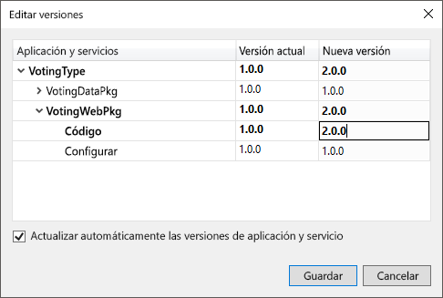
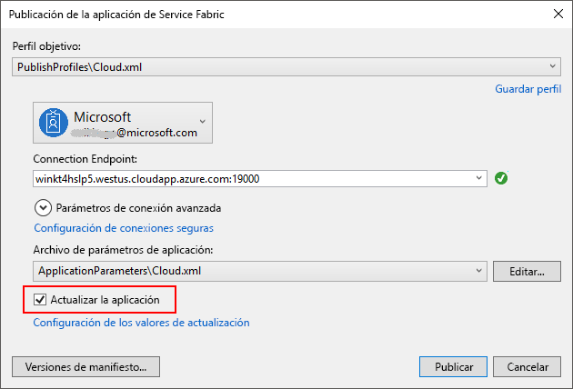
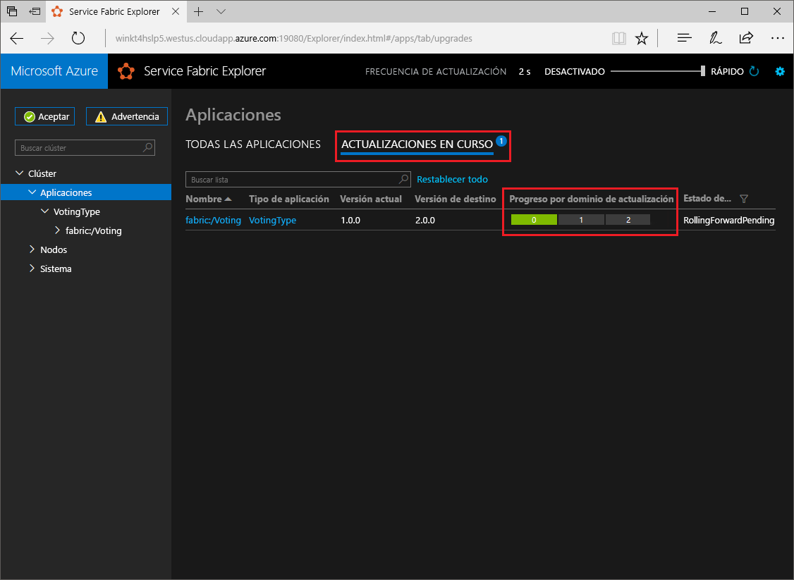

# <a name="create-a-net-service-fabric-application-in-azure"></a>Crear una aplicación .NET de Service Fabric en Azure
Azure Service Fabric es una plataforma de sistemas distribuidos para implementar y administrar microservicios y contenedores escalables y confiables. 

En este tutorial rápido se muestra cómo implementar la primera aplicación .NET en Service Fabric. Cuando termine, tendrá una aplicación de votación con un front-end web de ASP.NET Core que guarda los resultados de una votación en un servicio back-end con estado en el clúster.



Mediante el uso de esta aplicación, aprenderá a hacer lo siguiente:
> [!div class="checklist"]
> * Crear una aplicación con .NET y Service Fabric
> * Usar ASP.NET Core como front-end web
> * Almacenar datos de la aplicación en un servicio con estado
> * Depurar la aplicación de forma local
> * Implementar la aplicación en un clúster en Azure
> * Escalar horizontalmente la aplicación en varios nodos
> * Realizar una actualización gradual de aplicaciones

## <a name="prerequisites"></a>Requisitos previos
Para completar esta guía de inicio rápido:
1. [Instale Visual Studio 2017](https://www.visualstudio.com/) con las cargas de trabajo de **desarrollo de Azure** y de **desarrollo web y de ASP.NET**.
2. [Instalación de Git](https://git-scm.com/)
3. [Instale el SDK de Microsoft Azure Service Fabric](http://www.microsoft.com/web/handlers/webpi.ashx?command=getinstallerredirect&appid=MicrosoftAzure-ServiceFabric-CoreSDK).
4. Ejecute el comando siguiente para permitir que Visual Studio implemente en el clúster de Service Fabric local:
    ```powershell
    Set-ExecutionPolicy -ExecutionPolicy Unrestricted -Force -Scope CurrentUser
    ```

## <a name="download-the-sample"></a>Descarga del ejemplo
En una ventana Comandos, ejecute el comando siguiente para clonar el repositorio de la aplicación de ejemplo en la máquina local.
```
git clone https://github.com/Azure-Samples/service-fabric-dotnet-quickstart
```

## <a name="run-the-application-locally"></a>Ejecución de la aplicación de forma local
Haga clic con el botón derecho en el icono de Visual Studio en el menú Inicio y seleccione **Ejecutar como administrador**. Para asociar el depurador a los servicios, debe ejecutar Visual Studio como administrador.

Abra la solución **Voting.sln** de Visual Studio desde el repositorio que ha clonado.  

De manera predeterminada, la aplicación Voting está configurada para escuchar en el puerto 8080.  El puerto de la aplicación se establece en el archivo */VotingWeb/PackageRoot/ServiceManifest.xml*.  Puede cambiar el puerto de la aplicación si actualiza el atributo **Port** del elemento **Endpoint**.  Para implementar y ejecutar la aplicación localmente, el puerto de la aplicación debe estar abierto y disponible en el equipo.  Si cambia el puerto de la aplicación, sustituya el nuevo valor de este por “8080” a lo largo de este artículo.

Pulse **F5** para implementar la aplicación.

> [!NOTE]
> La primera vez que ejecute e implemente la aplicación, Visual Studio creará un clúster local para la depuración. Es posible que esta operación tarde un tiempo. El estado de creación del clúster se muestra en la ventana de salida de Visual Studio.  En la salida, verá el mensaje "No se ha establecido la dirección URL de la aplicación o no es una dirección HTTP/HTTPS, por lo que no se abrirá el explorador para la aplicación".  Este mensaje no indica un error, sino que un explorador no se inicia de forma automática.

Una vez completada la implementación, inicie un explorador y abra la página `http://localhost:8080`, que es el front-end web de la aplicación.


Ahora puede agregar una serie de opciones de votación y empezar a recibir votos. La aplicación se ejecuta y almacena todos los datos en el clúster de Service Fabric, sin necesidad de una base de datos independiente.

## <a name="walk-through-the-voting-sample-application"></a>Tutorial de la aplicación de ejemplo de votación
La aplicación de votación consta de dos servicios:
- Servicio front-end web (VotingWeb): front-end web de ASP.NET Core, que ofrece servicio a la página web y expone API web para comunicarse con el servicio back-end.
- Servicio back-end (VotingData): servicio web de ASP.NET Core, que expone una API para almacenar los resultados de una votación en un diccionario confiable que se conserva en el disco.



Al votar en la aplicación, se producen los eventos siguientes:
1. JavaScript envía la solicitud de votación a la API web del servicio front-end web como una solicitud HTTP PUT.

2. El servicio front-end web usa un proxy para localizar y reenviar una solicitud HTTP PUT al servicio back-end.

3. El servicio back-end recibe la solicitud entrante y almacena el resultado actualizado en un diccionario confiable, que se replica en varios nodos del clúster y se conserva en el disco. Todos los datos de la aplicación se almacenan en el clúster, por lo que no se necesita una base de datos.

## <a name="debug-in-visual-studio"></a>Depurar en Visual Studio
Cuando se depura una aplicación en Visual Studio, se usa un clúster de desarrollo de Service Fabric local. Tiene la opción de ajustar la experiencia de depuración a su escenario. En esta aplicación, los datos se almacenan en el servicio back-end mediante un diccionario confiable. Visual Studio quita la aplicación de forma predeterminada cuando se detiene el depurador. Cuando se quita la aplicación, los datos del servicio back-end también se quitan. Para conservar los datos entre sesiones de depuración, puede cambiar el **modo de depuración de la aplicación** como una propiedad del proyecto **Voting** en Visual Studio.

Para ver lo que ocurre en el código, siga estos pasos:
1. Abra el archivo **/VotingWeb/Controllers/VotesController.cs** y establezca un punto de interrupción en el método **Put** (línea 47) de la API web. Puede buscar el archivo en el Explorador de soluciones de Visual Studio.

2. Abra el archivo **/VotingData/ControllersVoteDataController.cs** y establezca un punto de interrupción en el método **Put** (línea 50) de esta API web.

3. Vuelva al explorador y haga clic en una opción de votación o agregue una nueva opción de votación. Alcanzará el primer punto de interrupción del controlador de API del front-end web.
    - Aquí es donde el código JavaScript del explorador envía una solicitud al controlador de API web del servicio front-end.
    
    

    - Primero, construya la dirección URL para el valor de ReverseProxy para nuestro servicio back-end **(1)**.
    - A continuación, envíe la solicitud PUT de HTTP a ReverseProxy **(2)**.
    - Por último, devuelva la respuesta desde el servicio back-end al cliente **(3)**.

4. Pulse **F5** para continuar.
    - Ya está en el punto de interrupción del servicio back-end.
    
    

    - En la primera línea del método **(1)**, `StateManager` obtiene un diccionario confiable llamado `counts`, o bien lo agrega.
    - Todas las interacciones con valores de un diccionario confiable requieren una transacción. Esta instrucción using **(2)** crea dicha transacción.
    - Después, en la transacción, actualice el valor de la tecla correspondiente para la opción de votación y confirme la operación **(3)**. Una vez que se devuelve el método Commit, los datos se actualizan en el diccionario y se replican en otros nodos del clúster. Los datos ahora están almacenados de forma segura en el clúster y el servicio back-end puede conmutar por error a otros nodos, mientras sigue teniendo los datos disponibles.
5. Pulse **F5** para continuar.

Para detener la sesión de depuración, pulse **Maýus+F5**.

## <a name="deploy-the-application-to-azure"></a>Implementación de la aplicación en Azure
Para implementar la aplicación en Azure, se necesita un clúster de Service Fabric que ejecute la aplicación. 

### <a name="join-a-party-cluster"></a>Unirse a un clúster de entidad
Los clústeres de entidad son clústeres de Service Fabric gratuitos y de duración limitada, hospedados en Azure y ejecutados por el equipo de Service Fabric, donde cualquier usuario puede implementar aplicaciones y obtener información sobre la plataforma. 

Inicie sesión y [únase a un clúster de Windows](http://aka.ms/tryservicefabric). Recuerde el valor de **Punto de conexión**, ya que será necesario en los pasos siguientes.

> [!Note]
> De manera predeterminada, el servicio front-end web está configurado para escuchar en el puerto 8080 el tráfico entrante. El puerto 8080 está abierto en el clúster de entidad.  Si necesita cambiar el puerto de la aplicación, cámbielo a uno de los puertos abiertos en el clúster de entidad.
>

### <a name="deploy-the-application-using-visual-studio"></a>Implementar la aplicación con Visual Studio
Ahora que la aplicación está lista, puede implementarla en un clúster directamente desde Visual Studio.

1. Haga clic con el botón derecho en el proyecto **Voting** en el Explorador de soluciones y seleccione **Publicar**. Aparece el cuadro de diálogo de publicación.

    

2. Copie el valor de **Punto de conexión** de la página Clúster de entidad en el campo **Punto de conexión** y haga clic en **Publicar**. Por ejemplo: `winh1x87d1d.westus.cloudapp.azure.com:19000`.

    Todas las aplicaciones del clúster deben tener un nombre único.  Sin embargo, los clústeres de entidad son un entorno compartido y público, por lo que es posible que se produzca un conflicto con una aplicación existente.  Si se produce un conflicto de nombres, cambie el nombre del proyecto de Visual Studio y vuelva a realizar la implementación.

3. Abra un explorador y escriba la dirección del clúster seguida de ": 8080" para llegar a la aplicación en el clúster, por ejemplo, `http://winh1x87d1d.westus.cloudapp.azure.com:8080`. Ahora debería ver la aplicación en ejecución en el clúster de Azure.


## <a name="scale-applications-and-services-in-a-cluster"></a>Escalar aplicaciones y servicios en un clúster
Es fácil escalar servicios de Service Fabric en un clúster para adaptarse a un cambio en la carga en los servicios. Para escalar un servicio, cambie el número de instancias que se ejecutan en el clúster. Existen varias formas de escalar los servicios, ya sea mediante scripts o comandos de PowerShell o la CLI de Service Fabric (sfctl). En este ejemplo, se usa Service Fabric Explorer.

Service Fabric Explorer se ejecuta en todos los clústeres de Service Fabric y es accesible desde un explorador. Para ello, vaya al puerto de administración HTTP de clústeres (19080), por ejemplo, `http://winh1x87d1d.westus.cloudapp.azure.com:19080`.

Para escalar el servicio front-end web, siga estos pasos:

1. Abra Service Fabric Explorer en el clúster, por ejemplo, `http://winh1x87d1d.westus.cloudapp.azure.com:19080`.
2. Haga clic en el botón de puntos suspensivos (tres puntos) situado junto al nodo **fabric:/Voting/VotingWeb** en la vista de árbol y seleccione **Scale Service** (Escalar servicio).

    

    Ahora puede escalar el número de instancias del servicio front-end web.

3. Cambie el número a **2** y haga clic en **Scale Service** (Escalar servicio).
4. Haga clic en el nodo **fabric:/Voting/VotingWeb** en la vista de árbol y expanda el nodo de partición (representado por un GUID).

    

    Tras un pequeño retraso, podrá ver que el servicio tiene dos instancias.  En la vista de árbol puede consultar en qué nodos se ejecutan las instancias.

Mediante esta sencilla tarea de administración, los recursos disponibles para el servicio front-end se duplican para procesar la carga de usuarios. Es importante entender que no hacen falta varias instancias de un servicio para que se ejecute de forma confiable. Si se produce un error en un servicio, Service Fabric se asegurará de que se ejecute una nueva instancia de servicio en el clúster.

## <a name="perform-a-rolling-application-upgrade"></a>Realizar una actualización gradual de aplicaciones
Al implementar nuevas actualizaciones en la aplicación, Service Fabric implementa la actualización de forma segura. Las actualizaciones graduales eliminan el tiempo de inactividad durante el proceso de actualización y permiten la reversión automática en caso de que se produzcan errores.

Para actualizar la aplicación, haga lo siguiente:

1. Abra el archivo **/VotingWeb/Views/Home/Index.cshtml** en Visual Studio.
2. Cambie el <h2> encabezado de la página agregando o actualizando el texto. Por ejemplo, cambie el encabezado a "Ejemplo de votación de Service Fabric v2".
3. Guarde el archivo .
4. Haga clic con el botón derecho en el proyecto **Voting** en el Explorador de soluciones y seleccione **Publicar**. Aparece el cuadro de diálogo de publicación.
5. Haga clic en el botón **Versión de manifiesto** para cambiar la versión del servicio y la aplicación.
6. Cambie la versión del elemento **Code** situado bajo **VotingWebPkg** a "2.0.0", por ejemplo, y haga clic en **Guardar**.

    
7. En el cuadro de diálogo **Publicación de la aplicación de Service Fabric**, active la casilla Actualizar la aplicación y haga clic en **Publicar**.

    
8. Abra el explorador y vaya a la dirección del clúster en el puerto 19080, por ejemplo, `http://winh1x87d1d.westus.cloudapp.azure.com:19080`.
9. Haga clic en el nodo **Aplicaciones** en la vista de árbol y, después, en **Upgrades in Progress** (Actualizaciones en curso) en el panel de la derecha. Verá cómo la actualización se aplica en los dominios de actualización del clúster y se asegura de que cada dominio es correcto antes de continuar con el siguiente. Una vez que se haya verificado el estado del dominio, aparecerá uno actualizado en verde en la barra de progreso.
    

    Service Fabric hace que las actualizaciones sean seguras, ya que espera dos minutos después de actualizar el servicio en cada nodo del clúster. El proceso completo de actualización tardará aproximadamente ocho minutos.

10. Mientras se ejecuta la actualización, puede usar la aplicación. Dado que en el clúster se ejecutan dos instancias del servicio, algunas de las solicitudes podrían obtener una versión actualizada de la aplicación, mientras que otras podrían obtener la versión anterior.

## <a name="next-steps"></a>Pasos siguientes
En este tutorial, ha aprendido a hacer lo siguiente:

> [!div class="checklist"]
> * Crear una aplicación con .NET y Service Fabric
> * Usar ASP.NET Core como front-end web
> * Almacenar datos de la aplicación en un servicio con estado
> * Depurar la aplicación de forma local
> * Implementar la aplicación en un clúster en Azure
> * Escalar horizontalmente la aplicación en varios nodos
> * Realizar una actualización gradual de aplicaciones

Para obtener más información sobre Service Fabric y .NET, eche un vistazo a este tutorial:
> [!div class="nextstepaction"]
> [Aplicación .NET en Service Fabric](service-fabric-tutorial-create-dotnet-app.md)