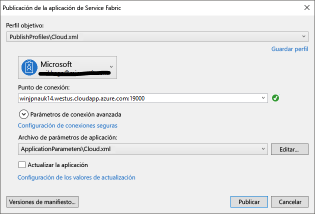

# Implementación de una aplicación en un clúster de entidad en Azure
En este tutorial se muestra cómo implementar una aplicación de Azure Service Fabric en un clúster de entidad en Azure.

En esta parte del tutorial, aprenderá a:
> [!div class="checklist"]
> * Implementar una aplicación en un clúster remoto con Visual Studio
> * Eliminar una aplicación de un clúster mediante de Service Fabric Explorer

El tutorial se divide en tres artículos; este artículo es el segundo de la serie.

## Requisitos previos
Antes de empezar este tutorial:
- Si no tiene ninguna suscripción a Azure, cree una [cuenta gratuita](https://azure.microsoft.com/free/?WT.mc_id=A261C142F).
- [Instale Visual Studio 2017](https://www.visualstudio.com/) y las cargas de trabajo de **desarrollo de Azure** y de **desarrollo web y de ASP.NET**.
- [Instale el SDK de Service Fabric](service-fabric-get-started.md).

## Configuración de un clúster de entidad
Los clústeres de entidad son clústeres de Service Fabric gratuitos y de duración limitada, hospedados en Azure y ejecutados por el equipo de Service Fabric, donde cualquier usuario puede implementar aplicaciones y obtener información sobre la plataforma. ¡Gratis!

Para obtener acceso a un clúster de entidad, vaya al sitio http://aka.ms/tryservicefabric y siga las instrucciones para acceder a un clúster. Necesita una cuenta de Facebook o GitHub para acceder a un clúster de entidad.

> [!NOTE]
> Los clústeres de entidades no están protegidos, por lo que las aplicaciones y los datos que coloque en ellos los pueden ver otros usuarios. No implemente nada que no desea que vean los demás usuarios. Asegúrese de leer nuestros términos de uso para conocer todos los detalles.

## Preparación de la aplicación para la implementación
Dado que nuestro servicio de api web de ASP.NET Core actúa como front-end para esta aplicación y acepta tráfico externo, queremos enlazar dicho servicio a un puerto fijo y conocido. Para ello, especificaremos el puerto en el archivos **ServiceManifest.xml** de servicios.

1. En el Explorador de soluciones, abra **WebAPIFrontEnd->PackageRoot->ServiceManifest.xml**.
2. Cambie el atributo **Puerto** del elemento **Punto de conexión** existente a **80** y guarde los cambios.

## Implementación de la aplicación en Azure
Ahora que la aplicación está lista, puede implementarla en un clúster de entidad directamente desde Visual Studio.

1. Haga clic con el botón derecho en el proyecto **MyApplication** en el Explorador de soluciones y seleccione **Publicar**.

    

2. Escriba el punto de conexión del clúster de entidad en el campo **Punto de conexión** y haga clic en **Publicar**.

    Cuando la publicación haya finalizado, debería poder enviar una solicitud a la aplicación a través de un explorador.

3. Abra su explorador preferido, escriba la dirección del clúster (punto de conexión sin la información de puerto; por ejemplo, win1kw5649s.westus.cloudapp.azure.com) y agregue `/api/values` a la dirección URL.

    Ahora debería ver el mismo resultado que vio cuando se ejecuta la aplicación localmente.

    

## Eliminación de la aplicación de un clúster mediante Service Fabric Explorer
Service Fabric Explorer es una interfaz gráfica de usuario para explorar y administrar aplicaciones en un clúster de Service Fabric.

Para quitar la aplicación que implementamos en el clúster de entidad:

1. Vaya a Service Fabric Explorer mediante el vínculo que proporciona la página de suscripción del clúster de entidad. Por ejemplo, http://win1kw5649s.westus.cloudapp.azure.com:19080/Explorer/index.html.

2. En Service Fabric Explorer, navegue hasta el nodo **fabric://MyApplication** en la vista de árbol del lado izquierdo.

3. Haga clic en el botón **Acción** en el recuadro **Essentials** de la derecha y elija **Eliminar aplicación**. Confirme la eliminación de la instancia de aplicación, lo que eliminará la instancia de la aplicación que se ejecuta en el clúster.

Las aplicaciones se implementan como tipos de aplicaciones en un clúster de Service Fabric, lo que permite tener varias instancias y versiones de la aplicación ejecutándose dentro del clúster. Una vez quitada la instancia en ejecución de nuestra aplicación, también podemos quitar el tipo para completar la limpieza de la implementación.

Para más información sobre el modelo de aplicación de Service Fabric, consulte [Modelar una aplicación en Service Fabric](service-fabric-application-model.md).

1. Navegue hasta el nodo **MyApplicationType** en la vista de árbol.

2. Haga clic en el botón **Acción** en el recuadro **Essentials** de la derecha y elija **Deshacer aprovisionamiento del tipo**. Confirme la anulación del aprovisionamiento del tipo de aplicación.

De este modo se finaliza el tutorial.

## Pasos siguientes
En este tutorial, ha aprendido cómo:

> [!div class="checklist"]
> * Implementar una aplicación en un clúster remoto con Visual Studio
> * Eliminar una aplicación de un clúster mediante de Service Fabric Explorer

Avanzar hasta el siguiente tutorial:
> [!div class="nextstepaction"]
> [Configurar la integración continua con Visual Studio Team Services](service-fabric-tutorial-deploy-app-with-cicd-vsts.md)
