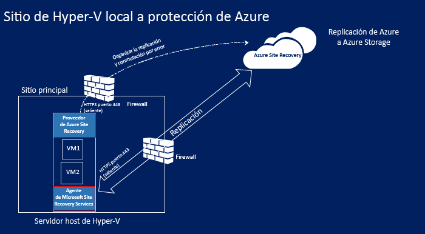
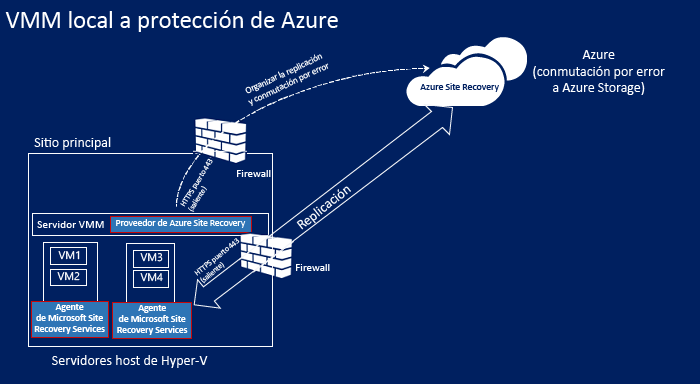
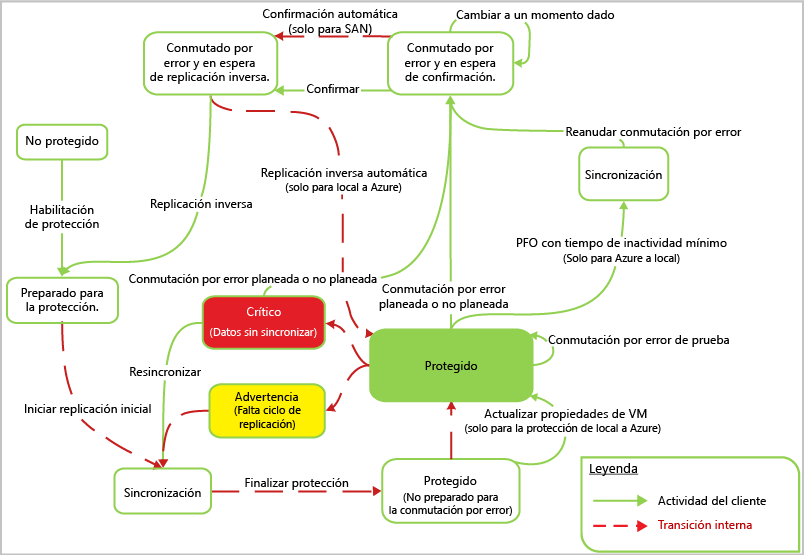

# Funcionamiento de la replicación de Hyper-V en Azure en Site Recovery

En este artículo se describen los componentes y procesos que tienen lugar al replicar máquinas virtuales de Hyper-V locales, a Azure mediante el servicio [Azure Site Recovery](site-recovery-overview.md).

Site Recovery puede replicar máquinas virtuales de Hyper-V en clústeres de Hyper-V y hosts independientes que se administren con o sin System Center Virtual Machine Manager (VMM).

Publique cualquier comentario que tenga en la parte inferior de este artículo, o bien en el [foro de Azure Recovery Services](https://social.msdn.microsoft.com/forums/azure/home?forum=hypervrecovmgr).

## Componentes de la arquitectura

En la replicación de las máquinas virtuales de Hyper-V a Azure, intervienen una serie de componentes.

**Componente** | **Ubicación** | **Detalles**
--- | --- | ---
**Las tablas de Azure** | En Azure, necesitará una cuenta de Microsoft Azure, una cuenta de almacenamiento de Azure y una red de Azure. | Los datos replicados se almacenan en la cuenta de almacenamiento y las máquinas virtuales de Azure se crean con los datos replicados cuando se produce la conmutación por error desde el sitio local.   Las máquinas virtuales de Azure se conectan a la red virtual de Azure cuando se crean.
**Servidor VMM** | Los hosts de Hyper-V están ubicados en nubes de VMM | Si los hosts de Hyper-V se administran en nubes de VMM, registre el servidor de VMM en el almacén de Recovery Services.   En el servidor de VMM, instale el proveedor de Site Recovery para organizar la replicación con Azure.   Necesita redes de máquinas virtuales y lógicas configuradas para configurar a su vez la asignación de red. Una red de VM debe estar vinculada a una red lógica asociada con la nube.
**Host de Hyper-V** | Los host y clústeres de Hyper-V pueden implementarse con o sin un servidor de VMM. | Si no hay ningún servidor VMM, el proveedor de Site Recovery se instala en el host para organizar la replicación con Site Recovery a través de Internet. Si hay servidor de VMM, el proveedor se instala en él y no en el host.   El agente de Recovery Services se instala en el host para controlar la replicación de datos.   Las comunicaciones del proveedor y el agente son seguras y cifradas. También se cifran los datos replicados en el almacenamiento de Azure.
**Máquinas virtuales de Hyper-V** | Necesita una o varias máquinas virtuales que se ejecuten en un servidor host de Hyper-V. | No es necesario instalar nada explícitamente en las máquinas virtuales.

Aprenda sobre los requisitos previos de implementación y los requisitos de cada uno de estos componentes en la [matriz de compatibilidad](site-recovery-support-matrix-to-azure.md).

**Figura 1: Replicación del sitio de Hyper-V a Azure**

**Figura 2: Replicación de Hyper-V en nubes de VMM a Azure**

## Proceso de replicación

**Figura 3: Proceso de replicación y recuperación para la replicación de Hyper-V a Azure**

### Habilitar protección

1. Después de habilitar la protección de una máquina virtual de Hyper-V, en el Azure Portal o de forma local, la opción **Habilitar la protección** se inicia.
2. El trabajo comprueba que la máquina cumpla los requisitos previos e invoca [CreateReplicationRelationship](https://msdn.microsoft.com/library/hh850036.aspx) para que configure la replicación con su configuración.
3. El trabajo comienza la replicación inicial con la invocación del método [StartReplication](https://msdn.microsoft.com/library/hh850303.aspx) para inicializar una replicación completa de la máquina virtual y enviar los discos virtuales de la máquina virtual a Azure.
4. Puede supervisar el trabajo en la pestaña **Trabajos**.
        

### Replicación de los datos iniciales

1. Cuando se desencadena la replicación inicial, se toma una [instantánea de la máquina virtual de Hyper-V](https://technet.microsoft.com/library/dd560637.aspx).
2. Los discos duros virtuales se replican uno a uno hasta que se copian todos en Azure. Esto puede tardar unos minutos, en función del tamaño de la máquina virtual y el ancho de banda de la red. Para optimizar el uso de la red, consulte cómo [administrar el uso de ancho de banda de red para la protección en entornos locales en Azure](https://support.microsoft.com/kb/3056159).
3. Si se producen cambios en el disco con la replicación inicial en curso, el seguimiento de replicaciones de Réplica de Hyper-V realiza un seguimiento de esos cambios en los registros de replicación de Hyper-V (.hrl). Estos archivos se encuentran en la misma carpeta que los discos. Cada disco tiene un archivo .hrl asociado que se enviará al almacenamiento secundario.
4. Los archivos de instantáneas y de registro consumen recursos de disco mientras la replicación inicial está en curso.
5. Cuando finalice la replicación inicial, se elimina la instantánea de la máquina virtual. Los cambios diferenciales en el registro del disco se sincronizan y se combinan en el disco primario.

### Fin de la protección

1. Una vez finalizada la replicación inicial, el trabajo **Finalizar la protección en la máquina virtual** configura la red y otras opciones posteriores a la replicación para proteger la máquina virtual.
    
2. Si va a replicar en Azure, debe ajustar la configuración de la máquina virtual para que esté preparada para conmutación por error. En este momento puede ejecutar una conmutación por error de prueba para comprobar que todo funciona según lo esperado.

### Replicación diferencial

1. Después de la replicación inicial, comienza la sincronización diferencial según la configuración de replicación.
2. La herramienta de seguimiento de la replicación de Réplica de Hyper-V supervisa los cambios realizados en un disco duro virtual como archivos .hrl. Cada disco configurado para la replicación tiene un archivo .hrl asociado. Este registro se envía a la cuenta de almacenamiento del cliente una vez completada la replicación inicial. Cuando un registro se encuentra en tránsito hacia Azure, los cambios en el disco principal se siguen en otro archivo de registro del mismo directorio.
3. Durante la replicación inicial y diferencial puede supervisar la máquina virtual en su vista. [Más información](site-recovery-monitoring-and-troubleshooting.md#monitor-replication-health-for-virtual-machines).  

### Sincronización de la replicación

1. Si se produce un error en la replicación diferencial y una replicación completa sería costosa en términos de ancho de banda o de tiempo, se marca una máquina virtual para la resincronización. Por ejemplo, si los archivos .hrl alcanzan el 50 % del tamaño del disco, la máquina virtual se marcará para repetir la sincronización.
2.  La resincronización reduce al mínimo la cantidad de datos que se envían; para ello, calcula las sumas de comprobación de las máquinas virtuales de origen y de destino, y envía solo los datos diferenciales. La resincronización utiliza un algoritmo de fragmentación de bloques fijos donde los archivos de origen y destino se dividen en fragmentos fijos. Se generan sumas de comprobación para cada fragmento y, luego, se comparan para determinar qué bloques del origen se deben aplicar al destino.
3. Una vez finalizada la resincronización, se debe reanudar la replicación diferencial normal. De forma predeterminada, la resincronización está programada para ejecutarse automáticamente fuera del horario de oficina, pero puede resincronizar una máquina virtual manualmente. Por ejemplo, si se produce una interrupción de la red o de otro tipo, la resincronización se puede reanudar. Para ello, seleccione la máquina virtual en el portal > **Volver a sincronizar**.

    

### Lógica de reintento

Si se produce un error de replicación, se realiza un reintento de forma predefinida. Esta lógica se puede clasificar en dos categorías:

**Categoría** | **Detalles**
--- | ---
**Errores irrecuperables** | No se realiza ningún reintento. El estado de la máquina virtual será **Crítico** y se requiere la intervención del administrador. Ejemplos de estos errores: división de la cadena de disco duro virtual; estado no válido para la réplica de máquina virtual; errores de autenticación de red (de autorización); sin detección de errores en la máquina virtual (para servidores de Hyper-V independientes)
**Errores recuperables** | Los reintentos se producen con cada intervalo de replicación mediante el uso de la interrupción exponencial, lo que aumenta el intervalo de reintentos desde el inicio del primer intento en 1, 2, 4, 8 y 10 minutos. Si el error persiste, reintente cada 30 minutos. Ejemplos: errores de red; errores de espacio insuficiente en disco; memoria insuficiente |

## Proceso de conmutación por error y conmutación por recuperación

1. Puede ejecutar una [conmutación por error](site-recovery-failover.md), planeada o no, desde máquinas virtuales de Hyper-V locales en Azure. Si ejecuta una conmutación por error planeada, las máquinas virtuales de origen se apagan para garantizar que no se pierdan datos.
2. Puede conmutar por error una única máquina o crear [planes de recuperación](site-recovery-create-recovery-plans.md) para organizar la conmutación por error de varias máquinas.
4. Después de ejecutar la conmutación por error, podrá ver las máquinas virtuales de la réplica creadas en Azure. Puede asignar una dirección IP pública a la máquina virtual si es necesario.
5. Después, ejecute una conmutación por error para iniciar el acceso a la carga de trabajo desde la máquina virtual de Azure de la réplica.
6. Cuando el sitio local principal esté disponible de nuevo, podrá realizar una [conmutación por recuperación](site-recovery-failback-from-azure-to-hyper-v.md). Inicie una conmutación por error planeada desde Azure al sitio principal. Para una conmutación por error planeada puede elegir realizar una conmutación por recuperación en la misma máquina virtual o en una ubicación alternativa y sincronizar los cambios entre Azure y el sitio local para garantizar que no se produzca ninguna pérdida de datos. Cuando las máquinas virtuales se crean en una ubicación local, puede ejecutar la conmutación por error.

## Pasos siguientes

Revise la [matriz de compatibilidad](site-recovery-support-matrix-to-azure.md).
