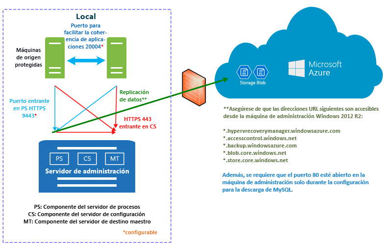

# ¿Cómo funciona Azure Site Recovery?

Lea este artículo para conocer la arquitectura subyacente del servicio Azure Site Recovery y los componentes que hacen que funcione.

Las organizaciones necesitan una estrategia de recuperación ante desastres y continuidad empresarial (BCDR) que determine cómo seguirán en funcionamiento y disponibles las aplicaciones, las cargas de trabajo y los datos durante los tiempos de inactividad planeados y no planeados, y cómo recuperar las condiciones de funcionamiento normales lo antes posible. Su estrategia de BCDR se centra en soluciones que mantengan los datos empresariales seguros y recuperables, y garanticen que las cargas de trabajo estarán disponibles continuamente en caso de desastre.

Site Recovery es un servicio de Azure que contribuye a su estrategia de BCDR mediante la coordinación de la replicación de servidores físicos locales y máquinas virtuales en la nube (Azure) o en un centro de datos secundario. Cuando se producen interrupciones en la ubicación principal, se realiza la conmutación por error a la ubicación secundaria para mantener disponibles las aplicaciones y cargas de trabajo. La conmutación por recuperación a la ubicación principal se produce cuando vuelve a su funcionamiento normal. Más información en [¿Qué es Site Recovery?](site-recovery-overview.md)

En este artículo se describe cómo realizar la implementación en [Azure Portal](https://portal.azure.com). El [Portal de Azure clásico](https://manage.windowsazure.com/) se puede utilizar para conservar los almacenes de Site Recovery existentes, pero no podrá crear almacenes nuevos.

Publique sus comentarios en la parte inferior de este artículo. Formule cualquier pregunta técnica en el [Foro de Servicios de recuperación de Azure](https://social.msdn.microsoft.com/forums/azure/home?forum=hypervrecovmgr).

## Escenarios de implementación

Site Recovery se puede implementar para organizar la replicación en varios escenarios:

- **Réplica de máquinas virtuales de VMware**: las máquinas virtuales de VMware locales se pueden replicar en Azure o en un centro de datos secundario.
- **Réplica de máquinas físicas**: las máquinas físicas (Windows o Linux) se pueden replicar en Azure o en un centro de datos secundario. El proceso para la replicación de máquinas físicas es prácticamente el mismo que el proceso para la replicación de máquinas virtuales de VMware.
- **Replica de máquinas virtuales de Hyper-V**: puede replicar máquinas virtuales de Hyper-V en Azure o en un sitio secundario de VMM. Si quiere replicarlas en un sitio secundario, se deben administrar en nubes de System Center Virtual Machine Manager (VMM).
- **Migración de máquinas virtuales**: además de replicar (réplica, conmutación por error y conmutación por recuperación) máquinas virtuales locales y servidores físicos en Azure, también puede migrarlos a máquinas virtuales de Azure (réplica, conmutación por error, sin conmutación por recuperación). Esto es lo que se puede migrar:
    - Migre cargas de trabajo en ejecución en máquinas virtuales de Hyper-V locales, máquinas virtuales de VMware y servidores físicos, para que pasen a ejecutarse en máquinas virtuales de Azure.
    - Migre [máquinas virtuales de IaaS de Azure](site-recovery-migrate-azure-to-azure.md) entre regiones de Azure. Actualmente, en este escenario solo se admite la migración, lo que significa que no se admite la conmutación por recuperación.
    - Migre [instancias de AWS Windows](site-recovery-migrate-aws-to-azure.md) a máquinas virtuales de IaaS de Azure. Actualmente, en este escenario solo se admite la migración, lo que significa que no se admite la conmutación por recuperación.

Site Recovery permite replicar aplicaciones que se ejecutan en máquinas virtuales y servidores físicos admitidos. En [¿Qué cargas de trabajo se pueden proteger con Azure Site Recovery?](site-recovery-workload.md)

## Replicación de máquinas virtuales de VMware o servidores físicos en Azure

### Componentes

**Componente** | **Detalles**
--- | ---
**Las tablas de Azure** | En Azure, necesitará una cuenta de Microsoft Azure, una cuenta de almacenamiento de Azure y una red de Azure.   Las de almacenamiento y red pueden ser cuentas de Resource Manager o cuentas clásicas.    Los datos replicados se almacenan en la cuenta de almacenamiento y las máquinas virtuales de Azure se crean con los datos replicados cuando se produce la conmutación por error desde el sitio local. Las máquinas virtuales de Azure se conectan a la red virtual de Azure cuando se crean.
**Servidor de configuración** | Configure un servidor de configuración local para coordinar las comunicaciones entre el sitio local y Azure y para administrar la replicación de datos.
**Servidor de proceso** | Se instala de forma predeterminada en el servidor de configuración local.   Actúa como puerta de enlace de replicación. Recibe datos de replicación de máquinas de origen protegidas, los optimiza con almacenamiento en caché, compresión y cifrado, y los envía al Almacenamiento de Azure.   Controla la instalación de inserción del Servicio de movilidad en máquinas protegidas y realiza la detección automática de máquinas virtuales de VMware.   A medida que crezca la implementación, podrá agregar más servidores de procesos dedicados independientes para controlar mayores volúmenes de tráfico de replicación.
**Servidor de destino principal** | Se instala de forma predeterminada en el servidor de configuración local.   Controla los datos de replicación durante la conmutación por recuperación desde Azure. Si los volúmenes de tráfico de la conmutación por recuperación son altos, puede implementar un servidor de destino maestro independiente para la conmutación por recuperación.
**Servidores de VMware** | Agregue servidores de vCenter y vSphere a su almacén de Recovery Services para replicar máquinas virtuales de VMware.   Si se replican servidores físicos, necesitará una infraestructura de VMware local para la conmutación por recuperación. No se puede realizar la conmutación por recuperación en una máquina física.
**Máquinas replicadas** | El servicio de movilidad se deberá instalar en cada máquina que desee replicar. Se puede instalar manualmente en cada equipo o con una instalación de inserción desde el servidor de procesos.

**Figura 1: VMware en componentes de Azure**

### Proceso de replicación

1. Configure la implementación, incluidos los componentes de Azure y un almacén de Recovery Services. En el almacén, especifique el origen y el destino de la replicación, configure el servidor de configuración, agregue servidores de VMware, cree una directiva de replicación, implemente el servicio de movilidad, habilite la replicación y ejecute una prueba de conmutación por error.
2.  Las máquinas se empiezan a replicar de acuerdo con la directiva de replicación y una copia inicial de los datos se replica en el almacenamiento de Azure.
4. La replicación de los cambios diferenciales en Azure comienza después de que finaliza la replicación inicial. Las marcas de revisión de una máquina se conservan en un archivo .hrl.
    - Las máquinas que están en replicación se comunican con el servidor de configuración en el puerto HTTPS 443 entrante para la administración de la replicación.
    - Las máquinas que están en replicación envían datos de replicación al servidor de procesos en el puerto HTTPS 9443 entrante (se puede configurar).
    - El servidor de configuración organiza la administración de la replicación con Azure a través del puerto HTTPS 443 saliente.
    - El servidor de procesos recibe datos de las máquinas de origen, los optimiza y los cifra y los envía al almacenamiento de Azure a través del puerto 443 saliente.
    - Si habilita la coherencia entre varias máquinas virtuales, las máquinas del grupo de replicación se comunican entre sí a través del puerto 20004. La implementación de varias máquinas virtuales se usa si agrupa varias máquinas en grupos de replicación que tienen puntos de recuperación coherentes con los bloqueos y coherentes con la aplicación cuando conmutan por error. Esto resulta útil si las máquinas ejecutan la misma carga de trabajo y necesitan ser coherentes.
5. El tráfico se replica en los puntos de conexión públicos del almacenamiento de Azure a través de Internet. Como alternativa, puede usar el [emparejamiento público](https://docs.microsoft.com/en-us/azure/expressroute/expressroute-circuit-peerings#public-peering) de Azure ExpressRoute. No se admite la replicación del tráfico a través de una VPN de sitio a sitio desde un sitio local en Azure.

**Figura 2: VMware en replicación de Azure**

### Proceso de conmutación por error y conmutación por recuperación

1. Puede realizar conmutaciones por error no planeadas desde máquinas virtuales de VMware locales y servidores físicos en Azure. No se admite la conmutación por error planeada.
2. Puede conmutar por error una única máquina o crear [planes de recuperación](site-recovery-create-recovery-plans.md) para organizar la conmutación por error de varias máquinas.
3. Cuando se ejecuta una conmutación por error, las máquinas virtuales de la réplica se crearán en Azure. Realice una conmutación por error para iniciar el acceso a la carga de trabajo desde la máquina virtual de Azure de la réplica.
4. Cuando el sitio local principal esté disponible de nuevo, podrá realizar una conmutación por recuperación. Configure una infraestructura de conmutación por recuperación, empiece a replicar la máquina desde el sitio secundario al principal y ejecute una conmutación por error no planeada desde el sitio secundario. Después de ejecutar esta conmutación por error, los datos volverán a la ubicación local y deberá habilitar la replicación en Azure de nuevo. [Más información](site-recovery-failback-azure-to-vmware.md)

Hay varios requisitos para la conmutación por recuperación:

- **No se admite la conmutación por recuperación de físico a físico**: esto significa que si realiza la conmutación por error de los servidores físicos a Azure y luego desea realizar la conmutación por recuperación, debe realizarla a una máquina virtual de VMware. No se puede realizar la conmutación por recuperación a un servidor físico. Necesitará una máquina virtual de Azure a la que realizar la conmutación por recuperación y si no ha implementado el servidor de configuración como una máquina virtual de VMware, será preciso que configure un servidor de destino maestro independiente como una máquina virtual de VMware. Esto es necesario porque el servidor de destino maestro interactúa y se adjunta al almacenamiento de VMware para restaurar los discos a una máquina virtual de VMware.
- **Servidor de procesos temporal en Azure**: si desea realizar la conmutación por recuperación desde Azure después de una conmutación por error, será preciso que configure una máquina virtual de Azure como servidor de procesos para que controle la replicación desde Azure. Dicha máquina virtual se puede eliminar cuando finalice la conmutación por recuperación.
- **Conexión VPN**: para realizar la conmutación por recuperación, necesitará que se haya configurado una conexión VPN (o Azure ExpressRoute) desde la red de Azure y el sitio local.
- **Servidor de destino maestro local independiente**: el servidor de destino maestro local controla la conmutación por recuperación. El servidor de destino maestro se instala de forma predeterminada en el servidor de administración, pero si se va a realizar la conmutación por recuperación de grandes volúmenes de tráfico, se debe configurar un servidor de destino maestro local independiente para este propósito.
- **Directiva de conmutación por recuperación**: para replicar de nuevo en el sitio local, necesita una directiva de conmutación por recuperación. Esta se crea automáticamente al crear la directiva de replicación.

**Figura 3: VMware y conmutación por recuperación física**

## Replicación de máquinas virtuales de VMware o servidores físicos en un sitio secundario

### Componentes

**Componente** | **Detalles**
--- | ---
**Las tablas de Azure** | Este escenario se implementa con InMage Scout. Para obtenerlo, necesitará una suscripción a Azure.   Después de crear un almacén de Recovery Services descargue InMage Scout e instale las actualizaciones más recientes para configurar la implementación.
**Servidor de proceso** | Implemente el componente de servidor de proceso en el sitio principal para administrar el almacenamiento en caché, la compresión y la optimización de los datos.   También controla la instalación por inserción del agente unificada en las máquinas que desea proteger.
**Servidor de VMware ESX/ESXi y vCenter** |  Necesita una infraestructura de VMware para replicar máquinas virtuales de VMware.
**Máquinas virtuales y servidores físicos** |  Instale el agente unificado en máquinas virtuales de VMware o en los servidores físicos Windows o Linux que desee replicar.   Dicho agente actúa como un proveedor de comunicación entre todos los componentes.
**Servidor de configuración** | El servidor de configuración se instala en el sitio secundario para administrar, configurar y supervisar la implementación, ya sea mediante el sitio web de administración o la consola de vContinuum.
**Servidor de vContinuum** | Se instala en la misma ubicación que el servidor de configuración.   Proporciona una consola para administrar y supervisar su entorno protegido.
**Servidor de destino maestro (sitio secundario)** | El servidor de destino maestro contiene los datos replicados. Recibe los datos del servidor de proceso, crea una máquina de réplica en el sitio secundario y contiene los puntos de retención de datos.   El número de servidores de destino maestros que necesita depende del número de equipos que va a proteger.   Si desea realizar una conmutación por recuperación al sitio principal, necesita un servidor de destino maestro allí también. El agente unificado se instala en este servidor.

### Proceso de replicación

1. Configure los servidores de componentes de cada sitio (configuración, proceso y destino principal) e instale Unified Agent en las máquinas que desee replicar.
2. Después de la replicación inicial, el agente de cada máquina envía los cambios de replicación diferencial al servidor de procesos.
3. Por su parte, el servidor de procesos optimiza los datos y los transfiere al servidor de destino maestro del sitio secundario. El servidor de configuración administra el proceso de replicación.

**Figura 4: VMware en replicación de VMware**

## Replicación de máquinas virtuales de Hyper-V en Azure

### Componentes

**Componente** | **Detalles**
--- | ---
**Las tablas de Azure** | En Azure, necesitará una cuenta de Microsoft Azure, una cuenta de almacenamiento de Azure y una red de Azure.   Las de almacenamiento y red pueden basarse en cuentas de Resource Manager o cuentas clásicas.   Los datos replicados se almacenan en la cuenta de almacenamiento y las máquinas virtuales de Azure se crean con los datos replicados cuando se produce la conmutación por error desde el sitio local.   Las máquinas virtuales de Azure se conectan a la red virtual de Azure cuando se crean.
**Servidor VMM** | Si los hosts de Hyper-V se encuentran en nubes de VMM, debe configurar redes lógicas y de máquinas virtuales para configurar la [asignación de red](site-recovery-network-mapping.md). Una red de VM debe estar vinculada a una red lógica asociada con la nube.
**Host de Hyper-V** | Necesita uno o varios servidores host de Hyper-V.
**Máquinas virtuales de Hyper-V** | Necesita una o varias máquinas virtuales en el servidor host de Hyper-V. El proveedor en ejecución en el host de Hyper-V coordina y organiza la replicación con el servicio de Site Recovery a través de Internet. El agente se encarga de la replicación de datos a través de HTTPS 443. Las comunicaciones del proveedor y el agente son seguras y cifradas. También se cifran los datos replicados en el almacenamiento de Azure.

## Proceso de replicación

1. Configure los componentes de Azure. Se recomienda que configure las cuentas de almacenamiento y de red antes de comenzar la implementación de Site Recovery.
2. Cree un almacén de servicios de replicación para Site Recovery y configure el almacén, incluyendo:
    - Si no está administrando hosts de Hyper-V en una nube de VMM, cree un contenedor de sitios de Hyper-V y agréguele hosts de Hyper-V.
    - El origen y destino de la replicación. Si los hosts de Hyper-V se administran en VMM, el origen es la nube de VMM. En caso contrario, el origen es el sitio de Hyper-V.
    - Instalación del proveedor de Azure Site Recovery y del agente de Microsoft Azure Recovery Services. Si tiene VMM, el proveedor se instalará en este y el agente en cada host de Hyper-V. Si no dispone de VMM, el proveedor y el agente se instalarán en cada host.
    - Cree una directiva de replicación para el sitio de Hyper-V o la nube de VMM. La directiva se aplica a todas las máquinas virtuales ubicadas en los hosts del sitio o la nube.
    - Habilite la replicación de máquinas virtuales de Hyper-V. La replicación inicial se produce según la configuración de la directiva de replicación.
4. Los cambios en los datos se registran y la replicación de los cambios diferenciales en Azure comienza después de que finaliza la replicación inicial. Las marcas de revisión de un elemento se conservan en un archivo .hrl.
5. Ejecute una conmutación por error de prueba para asegurarse de que todo funciona.

### Proceso de conmutación por error y conmutación por recuperación

1. Puede ejecutar una [conmutación por error](site-recovery-failover.md), planeada o no, desde máquinas virtuales de Hyper-V locales en Azure. Si ejecuta una conmutación por error planeada, las máquinas virtuales de origen se apagan para garantizar que no se pierdan datos.
2. Puede conmutar por error una única máquina o crear [planes de recuperación](site-recovery-create-recovery-plans.md) para organizar la conmutación por error de varias máquinas.
4. Después de ejecutar la conmutación por error, podrá ver las máquinas virtuales de la réplica creadas en Azure. Puede asignar una dirección IP pública a la máquina virtual si es necesario.
5. Después, ejecute una conmutación por error para iniciar el acceso a la carga de trabajo desde la máquina virtual de Azure de la réplica.
6. Cuando el sitio local principal esté disponible de nuevo, podrá realizar una conmutación por recuperación. Inicie una conmutación por error planeada desde Azure al sitio principal. Para una conmutación por error planeada puede elegir realizar una conmutación por recuperación en la misma máquina virtual o en una ubicación alternativa y sincronizar los cambios entre Azure y el sitio local para garantizar que no se produzca ninguna pérdida de datos. Cuando las máquinas virtuales se crean en una ubicación local, puede ejecutar la conmutación por error.

**Figura 5: Sitio de Hyper-V en replicación de Azure**

**Figura 6: Hyper-V en nubes de VMM en replicación de Azure**

## Replicación de máquinas virtuales de Hyper-V a un sitio secundario

### Componentes

**Componente** | **Detalles**
--- | ---
**Cuenta de Azure** | Necesita una cuenta de Microsoft Azure.
**Servidor VMM** | Se recomienda un servidor VMM en el sitio principal y otro en el sitio secundario, conectados a Internet.   Cada servidor debe tener al menos una nube privada de VMM con el perfil de funcionalidad de Hyper-V.   Instale el proveedor de Azure Site Recovery en el servidor VMM. El proveedor coordina y organiza la replicación con el servicio Site Recovery a través de Internet. Las comunicaciones entre el proveedor y Azure son seguras y cifradas.
**Servidor de Hyper-V** |  Necesita uno o varios servidores host de Hyper-V en las nubes VMM principal y secundaria. Los servidores deben estar conectados a Internet.   Los datos se replican entre los servidores host de Hyper-V principales y secundarios a través de la LAN o VPN mediante autenticación Kerberos o de certificado.  
**Máquinas de origen** | El servidor host de Hyper-V de origen debe tener, como mínimo, una máquina virtual que se desee replicar.

## Proceso de replicación

1. Configure la cuenta de Azure.
2. Cree un almacén de servicios de replicación para Site Recovery y configure el almacén, incluyendo:

    - El origen y destino de la replicación (sitios principales y secundarios).
    - Instalación del proveedor de Azure Site Recovery y del agente de Microsoft Azure Recovery Services. El proveedor está instalado en servidores VMM y el agente en cada host de Hyper-V.
    - Cree una directiva de replicación para la nube de VMM de origen. La directiva se aplica a todas las máquinas virtuales ubicadas en los hosts de la nube.
    - Habilite la replicación de máquinas virtuales de Hyper-V. La replicación inicial se produce según la configuración de la directiva de replicación.
4. Los cambios en los datos se registran y la replicación de los cambios diferenciales comienza después de que finaliza la replicación inicial. Las marcas de revisión de un elemento se conservan en un archivo .hrl.
5. Ejecute una conmutación por error de prueba para asegurarse de que todo funciona.

**Figura 7: VMM en replicación de VMM**

### Proceso de conmutación por error y conmutación por recuperación

1. Puede ejecutar una [conmutación por error](site-recovery-failover.md), planeada o no, entre sitios locales. Si ejecuta una conmutación por error planeada, las máquinas virtuales de origen se apagan para garantizar que no se pierdan datos.
2. Puede conmutar por error una única máquina o crear [planes de recuperación](site-recovery-create-recovery-plans.md) para organizar la conmutación por error de varias máquinas.
4. Si realiza una conmutación por error no planeada en un sitio secundario, tras ella las máquinas de la ubicación secundaria no están habilitadas para su protección ni replicación. Si realizó una conmutación por error planeada, tras ella las máquinas de la ubicación secundaria están protegidas.
5. Después, ejecute una conmutación por error para iniciar el acceso a la carga de trabajo desde la máquina virtual de la réplica.
6. Cuando el sitio principal esté disponible de nuevo, inicie la replicación inversa para replicar desde el sitio secundario al principal. La replicación inversa pone las máquinas virtuales en un estado protegido pero el centro de datos secundario sigue siendo la ubicación activa.
7. Para que el sitio principal se convierta de nuevo en la ubicación activa, debe iniciar una conmutación por error planeada desde el secundario al principal, seguida de otra replicación inversa.

### Flujo de trabajo de replicación de Hyper-V

**Fase de flujo de trabajo** | **Acción**
--- | ---
1. **Habilitar la protección** | Después de habilitar la protección de una máquina virtual de Hyper-V el trabajo **Habilitar la protección** se inicia para comprobar que la máquina cumple los requisitos previos. El trabajo invoca dos métodos:   [CreateReplicationRelationship](https://msdn.microsoft.com/library/hh850036.aspx) para configurar la replicación con las opciones que haya configurado.   [StartReplication](https://msdn.microsoft.com/library/hh850303.aspx), para inicializar una réplica completa de la máquina virtual.
2. **Replicación inicial** |  Se toma una instantánea de la máquina virtual y se replican los discos duros virtuales uno por uno hasta que todos se copian en la ubicación secundaria.   El tiempo necesario para completar esta tarea depende del tamaño de la máquina virtual, del ancho de banda de la red y del método de replicación inicial.   Si se producen cambios en el disco mientras la replicación inicial está en curso, el seguimiento de replicaciones de Réplica de Hyper-V realiza un seguimiento de esos cambios en registros de replicación de Hyper-V (.hrl) que se encuentran en la misma carpeta que los discos.   Cada disco tiene un archivo .hrl asociado que se enviará al almacenamiento secundario.   Los archivos de instantáneas y de registro consumen recursos de disco mientras la replicación inicial está en curso. Cuando la replicación inicial finaliza, se elimina la instantánea de la máquina virtual y se sincronizan y se combinan los cambios diferenciales del disco en el registro.
3. **Finalizar la protección** | Una vez que finaliza la replicación inicial, el trabajo **Finalizar la protección** configura la red y otras opciones posteriores a la replicación, con el fin de que la máquina virtual esté protegida.   Si replica en Azure, es posible que tenga que ajustar la configuración de la máquina virtual para que esté preparada para la conmutación por error.   En este momento puede ejecutar una conmutación por error de prueba para comprobar que todo funciona según lo esperado.
4. **Replicación** | Después de la replicación inicial, comienza la sincronización diferencial según la configuración de replicación.   **Error de replicación**: si se produce un error en la replicación diferencial y una replicación completa sería costosa, en términos de ancho de banda o de tiempo, se produce una resincronización. Por ejemplo, si los archivos .hrl alcanzan el 50 % del tamaño del disco, la máquina virtual se marcará para repetir la sincronización. La resincronización minimiza la cantidad de datos que se envían; para ello, calcula las sumas de comprobación de las máquinas virtuales de origen y destino, y envía solo los datos diferenciales. Una vez finalizada la resincronización, se reanudará la replicación diferencial. De forma predeterminada, la resincronización está programada para ejecutarse automáticamente fuera del horario de oficina, pero puede resincronizar una máquina virtual manualmente.   **Error de replicación**: si se produce un error de replicación, se realiza un reintento de forma predefinida. Si el error es irrecuperable, como un error de autenticación o de autorización, o una máquina de réplica se encuentra en un estado no válido, no se realizará ningún reintento. Si se produce un error recuperable, como un error de red o poco espacio en disco o memoria, se realizarán reintentos, con intervalos cada vez mayores entre cada reintento (1, 2, 4, 8, 10 y después cada 30 minutos).
5. **Conmutación por error planeada o no planeada** | Las conmutaciones por error planeadas o no planeadas se pueden ejecutar cuando sea necesario.   Si ejecuta una conmutación por error planeada, las máquinas virtuales de origen se apagan para garantizar que no se pierdan datos.   Una vez creadas las máquinas virtuales de réplica, se colocan en estado pendiente de confirmación. Debe ejecutar y, a continuación, completar la conmutación por error.   Una vez que el sitio principal está en funcionamiento, puede realizar una conmutación por recuperación a este, cuando esté disponible.

**Figura 8: Flujo de trabajo de Hyper-V**

## Pasos siguientes

[Preparación de la implementación](site-recovery-best-practices.md)

<!--HONumber=Feb17_HO3-->

