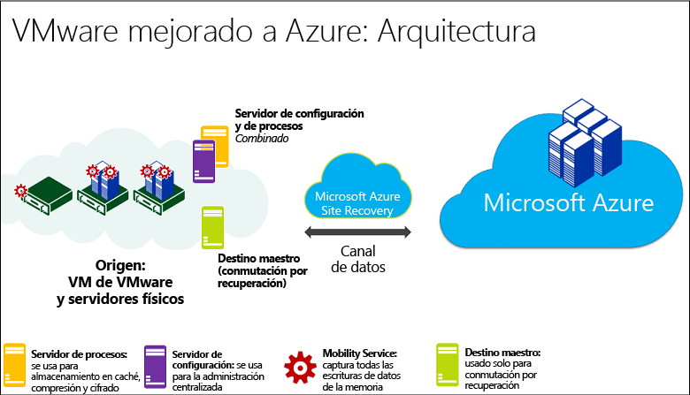
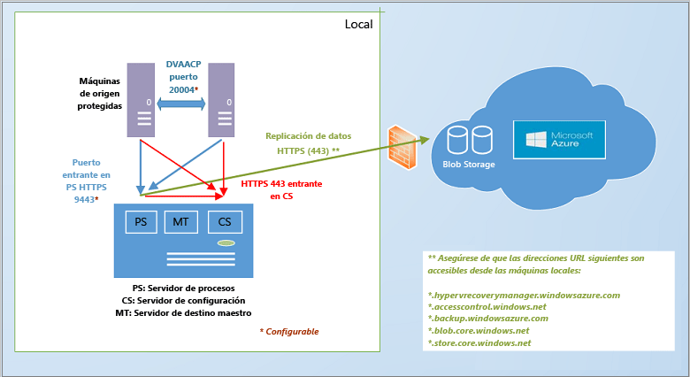
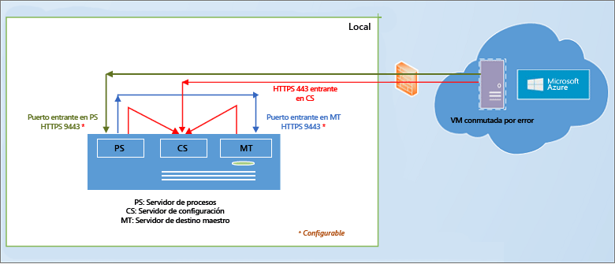
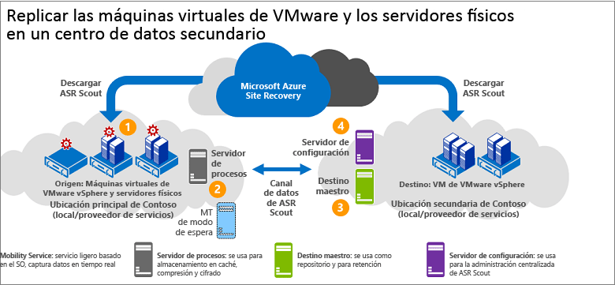
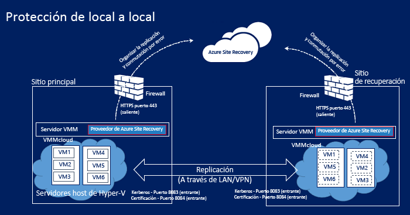
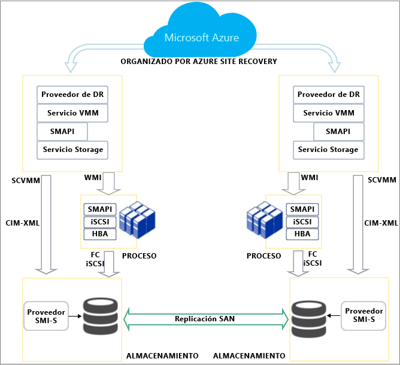

<properties
	pageTitle="¿Cómo funciona Azure Site Recovery? | Microsoft Azure"
	description="Este artículo proporciona información general sobre la arquitectura de Site Recovery"
	services="site-recovery"
	documentationCenter=""
	authors="rayne-wiselman"
	manager="jwhit"
	editor=""/>

<tags
	ms.service="site-recovery"
	ms.workload="backup-recovery"
	ms.tgt_pltfrm="na"
	ms.devlang="na"
	ms.topic="get-started-article"
	ms.date="03/27/2016"
	ms.author="raynew"/>

# ¿Cómo funciona Azure Site Recovery?

Lea este artículo para conocer la arquitectura subyacente del servicio Azure Site Recovery y los componentes que hacen que funcione.

Publique cualquier comentario o pregunta que tenga en la parte inferior de este artículo, o bien en el [foro de Servicios de recuperación de Azure](https://social.msdn.microsoft.com/forums/azure/home?forum=hypervrecovmgr).

## Información general

Las organizaciones necesitan una estrategia de continuidad empresarial y recuperación ante desastres (BCDR) que determine la forma en que las aplicaciones, las cargas de trabajo y los datos van a seguir estando disponibles durante los tiempos de inactividad planeados y no planeados, y cómo recuperar las condiciones de trabajo normales lo antes posible.

Site Recovery es un servicio de Azure que contribuye a cualquier estrategia de BCDR, ya que organiza la replicación tanto de servidores físicos locales como de máquinas virtuales en la nube (Azure) o en un centro de datos secundario. Cuando se producen interrupciones en la ubicación principal, se realiza la conmutación por error al sitio secundario para mantener disponibles las aplicaciones y cargas de trabajo. La conmutación por recuperación a la ubicación principal se produce cuando vuelve a su funcionamiento normal.

Site Recovery se puede implementar para organizar la replicación en varios escenarios:

- **Réplica de máquinas virtuales de VMware**: puede replicar proteger máquinas virtuales de VMware locales en [Azure](site-recovery-vmware-to-azure-classic.md) o en un [centro de datos secundario](site-recovery-vmware-to-vmware.md).
- **Réplica de máquinas físicas**: puede replicar máquinas físicas que ejecutan Windows o Linux en [Azure](site-recovery-vmware-to-azure-classic.md) o en un [centro de datos secundario](site-recovery-vmware-to-vmware.md).
- **Réplica de máquinas virtuales de Hyper-V administradas en nubes de System Center VMM**: puede replicar máquinas virtuales de Hyper-V locales en nubes de VMM en [Azure](site-recovery-vmm-to-azure.md) o en un [centro de datos secundario](site-recovery-vmm-to-vmm.md). 
- **Réplica de máquinas virtuales de Hyper-V (sin VMM)**: puede replicar máquinas virtuales de Hyper-V no administradas por VMM en [Azure](site-recovery-hyper-v-site-to-azure.md).
- **Migración de máquinas virtuales**: puede usar Site Recovery para [migrar máquinas virtuales IaaS de Azure](site-recovery-migrate-azure-to-azure.md) de una región a otra o para [migrar instancias de Windows en AWS](site-recovery-migrate-aws-to-azure.md) a máquinas virtuales IaaS de Azure. Actualmente solo se admite la migración, lo que significa que estás máquinas virtuales se pueden conmutar por error, pero no es posible conmutarlas por recuperación.

Site Recovery puede replicar la mayoría de las aplicaciones que se ejecutan en estas máquinas virtuales y estos servidores físicos. En [¿Qué cargas de trabajo se pueden proteger con Azure Site Recovery?](site-recovery-workload.md), puede obtener un resumen completo de las aplicaciones compatibles.

## Replicación de máquinas virtuales de VMware locales o servidores físicos en Azure

Actualmente hay dos arquitecturas diferentes disponibles para la replicación de máquinas virtuales de VMware o servidores físicos de Windows/Linux en Azure:

- [Arquitectura heredada](site-recovery-vmware-to-azure-classic-legacy.md): esta arquitectura no se debe usar para nuevas implementaciones. 
- [Arquitectura mejorada](site-recovery-vmware-to-azure-classic.md): es la arquitectura más reciente y se debe usar para todas las implementaciones nuevas. Si ya ha implementado este escenario mediante la arquitectura heredada, [obtenga información acerca de la migración](site-recovery-vmware-to-azure-classic-legacy.md#migrate-to-the-enhanced-deployment) a la implementación mejorada.

En la implementación mejorada, será preciso que configuré un servidor de administración local con todos los componentes de Site Recovery. En todas las máquinas que desee proteger, inserte automáticamente (o instale manualmente) el Servicio de movilidad. Después de la replicación inicial el servicio de Movilidad de la máquina envía los datos de replicación delta al servidor de procesos, que los optimiza antes de enviarlos al Almacenamiento de Azure.

 

### Local
Esto es lo que se necesita en el entorno local:

- **Servidor de administración**: necesitará una máquina con Windows Server 2012 R2 para que actúe como servidor de administración. En dicho servidor instalará todos los componentes de Site Recovery con un único archivo de instalación:

	- **Componente del servidor de configuración**: coordina la comunicación entre el entorno local y Azure, además de administrar la replicación y recuperación de datos.
	- **Componente del servidor de procesos**: actúa como puerta de enlace de replicación. Recibe datos de replicación de máquinas de origen protegidas, los optimiza con almacenamiento en caché, compresión y cifrado, y los envía al Almacenamiento de Azure. También controla la instalación de inserción del Servicio de movilidad en máquinas protegidas y realiza al detección automática de máquinas virtuales de VMware. A medida que crezca la implementación, podrá agregar más servidores de procesos dedicados independientes para controlar mayores volúmenes de tráfico de replicación.
	- **Componente del servidor de destino maestro**: controla los datos de replicación durante la conmutación por recuperación desde Azure. 
- **Host VMware ESX/ESXi y servidor vCenter**: necesitará uno o varios servidores de host ESX/ESXi donde en los que se ejecuten las máquinas virtuales de VMware. Se recomienda implementar un servidor vCenter para administrar dichos hosts. **Nota:** **Aunque se repliquen servidores físicos, es preciso conmutarlos por recuperación a VMware**. Al replicar un servidor físico se ejecutará como una máquina virtual de Azure al conmutar por error a Azure. Se conmutará por recuperación a local como una máquina virtual de VMware. 
	
- **Máquinas virtuales o servidores físicos**: todas las máquinas virtuales que desee replicar en Azure deberán tener instalado el componente del Servicio de movilidad. Este servicio captura las escrituras de datos en la máquina y las reenvía al servidor de procesos. Este componente se puede instalar manualmente, o bien puede insertarlo e instalarlo automáticamente el servidor de procesos cuando se habilita la replicación en una máquina.

### Azure

Esto es lo que debe haber en la infraestructura de Azure:- **Cuenta de Azure**: necesitará una cuenta de Microsoft Azure. - **Almacenamiento de Azure**: necesitará una cuenta de Almacenamiento de Azure para almacenar los datos replicados. Cuando se produce la conmutación por error, los datos replicados se almacenan en el Almacenamiento de Azure y se activan las máquinas virtuales de Azure. - **Red de Azure**: necesitará una red virtual de Azure a la que se puedan conectar las máquinas virtuales de Azure al activarse cuando se produzca la conmutación por error.
	
	
### Conmutación por recuperación

La conmutación por recuperación a un sitio local es siempre a máquinas virtuales de VMware, aunque la conmutación por error se realizara de un servidor físico. Esto es lo que necesita:

- **Servidor de procesos temporal en Azure**: si desea que realizar la conmutación por recuperación desde Azure después de una conmutación por error, será preciso que configure una máquina virtual de Azure configurada como servidor de procesos para controlar la replicación de Azure. Dicha máquina virtual se puede eliminar cuando finalice la conmutación por recuperación.
- **Conexión VPN**: para realizar la conmutación por recuperación, necesitará una conexión VPN (o Azure ExpressRoute) configurada entre la red de Azure y el sitio local.
- **Servidor de destino maestro local independiente**: el servidor de destino maestro local controla la conmutación por recuperación. El servidor de destino maestro se instala de forma predeterminada en el servidor de administración, pero si se va a realizar la conmutación por recuperación de grandes volúmenes de tráfico, se debe configurar un servidor de destino maestro local independiente para este propósito. 

[Más información](site-recovery-vmware-to-azure-classic.md#before-you-start-deployment) sobre los requisitos de la implementación mejorada. [Más información](site-recovery-failback-azure-to-vmware-classic.md) sobre la conmutación por recuperación para la implementación mejorada.

## Replicación de máquinas virtuales de Hyper-V de nubes VMM en Azure

Para implementar este escenario durante la implementación de Site Recovery, será preciso que el proveedor de Azure Site Recovery se instale en el servidor VMM. El proveedor coordina y organiza la replicación con el servicio Site Recovery a través de Internet. El agente de Servicios de recuperación de Azure se instala durante la implementación de Site Recovery en el servidor host de Hyper-V y los datos se replican entre él y el Almacenamiento de Azure a través de HTTPS 443. Las comunicaciones del proveedor y el agente son seguras y cifradas. También se cifran los datos replicados en el almacenamiento de Azure.

- Local: 
	- **Servidor VMM**: al menos un servidor VMM con al menos una nube privada de VMM. El servidor debe ejecutarse en System Center 2012 R2 y debe tener conectividad a Internet. Si desea asegurarse de que las máquinas virtuales de Azure estén conectadas a una red después de la conmutación por error, debe configurar la asignación de red. Para ello, las máquinas virtuales de origen debe estar conectado a una red de máquinas virtuales de VMM. Dicha red debe estar vinculada a una red lógica asociada con la nube.
	- **Servidor de Hyper-V**: al menos un servidor host de Hyper-V ubicado en la nube VMM. Los hosts de Hyper-V se deben ejecutar en Windows Server 2012 R2.
	- **Máquinas protegidas**: el servidor host de Hyper-V de origen debe tener, como mínimo, una máquina virtual que desee proteger.
	
- Azure:
	- **Cuenta de Azure**: necesitará una cuenta de Microsoft Azure.
	- **Almacenamiento de Azure**: necesitará una cuenta de Almacenamiento de Azure para almacenar los datos replicados. Los datos replicados se almacenan en el almacenamiento de Azure y las máquinas virtuales de Azure se ponen en marcha cuando se produce la conmutación por error.
	- **Red de Azure**: si desea configurar la asignación de red de forma que las máquinas virtuales de Azure estén conectadas a redes después de la conmutación por error, debe configurar una red de Azure.

	

Más información sobre los [requisitos de implementación](site-recovery-vmm-to-azure.md#before-you-start) exactos.

## Replicación de máquinas virtuales de VMware o servidores físicos en un sitio secundario

Para replicar máquinas virtuales VMware o servidores físicos con Windows/Linux en un sitio secundario, descargue InMage Scout, que se incluye en la suscripción de Azure Site Recovery. Configure los servidores de componentes de cada sitio (configuración, proceso y destino principal) e instale Unified Agent en las máquinas que desee replicar. Después de la replicación inicial el agente de cada máquina envía los cambios de replicación diferencial al servidor de procesos. Por su parte, el servidor de procesos optimiza los datos y los transfiere al servidor de destino maestro del sitio secundario. El servidor de configuración administra el proceso de replicación.

### Sitio principal local

- **Servidor de proceso**: configure el componente de servidor de proceso en el sitio principal para administrar el almacenamiento en caché, la compresión y la optimización de los datos. También controla la instalación por inserción del agente unificada en las máquinas que desea proteger. 
- **VMware ESX/ESXi y servidor vCenter**: si va a proteger máquinas virtuales VMware, necesitará un hipervisor VMware EXS/ESXi y, opcionalmente, un servidor VMware vCenter que administre los hipervisores.
- **Máquinas virtuales/servidores físicos**: las máquinas virtuales VMware o los servidores físicos con Windows o Linux que desee proteger deberán tener Unified Agent instalado. También se instala el agente unificado en las máquinas que actúan de servidor de destino maestro. Dicho agente actúa como un proveedor de comunicación entre todos los componentes. 
	
### Sitio secundario local
 
- **Servidor de configuración**: el servidor de configuración es el primer componente que se instala, y se instala en el sitio secundario para administrar, configurar y supervisar la implementación, ya sea mediante el sitio web de administración o la consola de vContinuum. Solo hay un servidor de configuración en una implementación y debe instalarse en una máquina que se ejecute en Windows Server 2012 R2.
- **Servidor de vContinuum**: se instala en la misma ubicación (sitio secundario) que el servidor de configuración. Proporciona una consola para administrar y supervisar su entorno protegido. En una instalación predeterminada, el servidor de vContinuum es el primer servidor de destino maestro y tiene instalado Unified Agent.
- **Servidor de destino maestro**: el servidor de destino maestro contiene los datos replicados. Recibe los datos del servidor de proceso, crea una máquina de réplica en el sitio secundario y contiene los puntos de retención de datos. El número de servidores de destino maestros que necesita depende del número de equipos que va a proteger. Si desea realizar una conmutación por recuperación al sitio principal, necesitará un servidor de destino maestro allí también. 

### Azure

Este escenario se implementa con InMage Scout. Para obtenerlo, necesitará una suscripción a Azure. Después de crear un almacén de Site Recovery descargue InMage Scout e instale las actualizaciones más recientes para configurar la implementación.

## Replicación de máquinas virtuales de Hyper-V en Azure (sin VMM)

Para replicar en Azure las máquinas virtuales de Hyper-V no administradas en nubes VMM, instale el proveedor de Azure Site Recovery y el agente de Servicios de recuperación de Azure en el host de Hyper-V durante la implementación de Site Recovery. El proveedor coordina y organiza la replicación con el servicio Site Recovery a través de Internet. El agente se encarga de la replicación de datos a través de HTTPS 443. Las comunicaciones del proveedor y el agente son seguras y cifradas. También se cifran los datos replicados en el almacenamiento de Azure.

### Local

- **Servidor Hyper-V**: al menos un servidor host Hyper-V. Los hosts de Hyper-V se deben ejecutar en Windows Server 2012 R2.
- **Máquinas protegidas**: el servidor host de Hyper-V de origen debe tener, como mínimo, una máquina virtual que desee proteger.
	
### Azure

- **Cuenta de Azure**: necesitará una cuenta de Microsoft Azure.
- **Almacenamiento de Azure**: necesitará una cuenta de Almacenamiento de Azure para almacenar los datos replicados. Los datos replicados se almacenan en el almacenamiento de Azure y las máquinas virtuales de Azure se ponen en marcha cuando se produce la conmutación por error.

[Más información](site-recovery-hyper-v-site-to-azure.md#before-you-start) sobre los requisitos de implementación.

## Replicación de máquinas virtuales de Hyper-V de nubes VMM en Azure

Para implementar este escenario, en la implementación de Site Recovery instale el proveedor de Azure Site Recovery en el servidor VMM y el agente de Servicios de recuperación de Azure en el host de Hyper-V. El proveedor coordina y organiza la replicación con el servicio Site Recovery a través de Internet. El agente se encarga de la replicación de datos a través de HTTPS 443. Las comunicaciones del proveedor y el agente son seguras y cifradas. Los datos replicados en Almacenamiento de Azure (en reposo) también se cifran.

### Local

- **Servidor VMM**: al menos un servidor VMM con al menos una nube privada de VMM. El servidor debe ejecutarse en System Center 2012 R2 y debe tener conectividad a Internet. Si desea asegurarse de que las máquinas virtuales de Azure estén conectadas a una red después de la conmutación por error, debe configurar la asignación de red. Para hacerlo, necesita conectar las máquinas virtuales de origen a una red de máquinas virtuales VMM. Esa red debe estar vinculada a una red lógica asociada con la nube.
- **Servidor de Hyper-V**: al menos un servidor host de Hyper-V ubicado en la nube VMM. Los hosts de Hyper-V se deben ejecutar en Windows Server 2012 R2.
- **Máquinas protegidas**: el servidor host de Hyper-V de origen debe tener, como mínimo, una máquina virtual que desee proteger.
	
### Azure

- **Cuenta de Azure**: necesitará una cuenta de Microsoft Azure.
- **Almacenamiento de Azure**: necesitará una cuenta de Almacenamiento de Azure para almacenar los datos replicados. Los datos replicados se almacenan en el almacenamiento de Azure y las máquinas virtuales de Azure se ponen en marcha cuando se produce la conmutación por error.
- **Red de Azure**: si desea asegurarse de que las máquinas virtuales de Azure están conectadas a redes después de la conmutación por error, debe configurar la asignación de red. Para hacerlo, necesitará una red de Azure.

[Más información](site-recovery-vmm-to-azure.md#before-you-start) sobre los requisitos de implementación.

## Replicación de máquinas virtuales de Hyper-V en un centro de datos secundario

Para implementar este escenario, durante la implementación de Site Recovery, será preciso que el proveedor de Azure Site Recovery se instale en el servidor VMM. El proveedor coordina y organiza la replicación con el servicio Site Recovery a través de Internet. Los datos se replican entre los servidores host de Hyper-V principales y secundarios a través de la LAN o VPN mediante autenticación Kerberos o de certificado. Las comunicaciones tanto del proveedor como entre los servidores host Hyper-V son seguras y cifradas.

### Local

- **Servidor VMM**: se recomienda que haya un servidor VMM en el sitio principal y otro en el sitio secundario, y que cada uno contenga al menos una nube privada de VMM. El servidor debe ejecutar al menos System Center 2012 SP1 con las actualizaciones más recientes y que esté conectado a Internet. Las nubes deben tener establecido el perfil de funcionalidad de Hyper-V.
- **Servidor Hyper-V**: los servidores host de Hyper-V se deben ubicar en las nubes VMM principales y secundarias. Los servidores host se deben ejecutar como mínimo en Windows Server 2012 con las últimas actualizaciones instaladas y estar conectados a Internet.
- **Máquinas protegidas**: el servidor host de Hyper-V de origen debe tener, como mínimo, una máquina virtual que desee proteger.
	
### Azure

Necesitará una suscripción a Azure.

[Más información](site-recovery-vmm-to-vmm.md#before-you-start) sobre los requisitos de implementación.

## Replicación de máquinas virtuales de Hyper-V en un centro de datos secundario con replicación SAN

En este escenario, durante la implementación de Site Recovery, será preciso que el proveedor de Azure Site Recovery se instale en los servidores VMM. El proveedor coordina y organiza la replicación con el servicio Site Recovery a través de Internet. Los datos se replican entre las matrices de almacenamiento principal y secundaria mediante replicación SAN sincrónica.

### Local

- **Matriz SAN**: una [matriz SAN admitida](http://social.technet.microsoft.com/wiki/contents/articles/28317.deploying-azure-site-recovery-with-vmm-and-san-supported-storage-arrays.aspx) administrada por el servidor VMM principal. La SAN comparte infraestructura de red con otra matriz de SAN en el sitio secundario.
- **Servidor VMM**: se recomienda que haya un servidor VMM en el sitio principal y otro en el sitio secundario, y que cada uno contenga al menos una nube privada de VMM. El servidor debe ejecutar al menos System Center 2012 SP1 con las actualizaciones más recientes y que esté conectado a Internet. Las nubes deben tener establecido el perfil de funcionalidad de Hyper-V.
- **Servidor Hyper-V**: los servidores host de Hyper-V se ubican en las nubes VMM principales y secundarias. Los servidores host se deben ejecutar como mínimo en Windows Server 2012 con las últimas actualizaciones instaladas y estar conectados a Internet.
- **Máquinas protegidas**: el servidor host de Hyper-V de origen debe tener, como mínimo, una máquina virtual que desee proteger.
	
### Azure

Necesitará una suscripción a Azure.

[Más información](site-recovery-vmm-san.md#before-you-start) sobre los requisitos de implementación.

## Ciclo de vida de protección de Hyper-V

Este flujo de trabajo muestra el proceso de protección, replicación y conmutación por error de máquinas virtuales Hyper-V.

1. **Habilitar la protección**: se configura el almacén de Site Recovery, se configuran las opciones de replicación para una nube de VMM o un sitio de Hyper-V y se habilita la protección de las máquinas virtuales. Se inicia un trabajo llamado **Habilitar la protección** y se puede supervisar en la pestaña **Trabajos**. El trabajo comprueba que el equipo cumple los requisitos previos y después se invoca el método [CreateReplicationRelationship](https://msdn.microsoft.com/library/hh850036.aspx) donde se configura la replicación en Azure con la configuración establecida. El trabajo **Habilitar la protección** también invoca el método [StartReplication](https://msdn.microsoft.com/library/hh850303.aspx) para inicializar una replicación completa de la máquina virtual.
2. **Replicación inicial**: se toma una instantánea de la máquina virtual y se replican los discos duros virtuales uno por uno hasta que todos se copian en Azure o en el centro de datos secundario. El tiempo necesario para completar esta tarea depende del tamaño de la máquina virtual, del ancho de banda de la red y del método de replicación inicial. Si se producen cambios en el disco mientras la replicación inicial está en curso, el seguimiento de replicaciones de Réplica de Hyper-V realiza un seguimiento de esos cambios en registros de replicación de Hyper-V (.hrl) que se encuentran en la misma carpeta que los discos. Cada disco tiene un archivo .hrl asociado que se enviará al almacenamiento secundario. Tenga en cuenta que los archivos de instantáneas y de registro consumen recursos de disco mientras la replicación inicial está en curso. Cuando la replicación inicial finaliza, se elimina la instantánea de la máquina virtual y se sincronizan y se combinan los cambios diferenciales del disco en el registro.
3. **Finalizar la protección**: una vez que finaliza la replicación inicial, el trabajo **Finalizar la protección** configura la red y otras opciones posteriores a la replicación, con el fin de que la máquina virtual esté protegida. Si va a replicar en Azure, debe ajustar la configuración de la máquina virtual para que esté preparada para conmutación por error. En este momento puede ejecutar una conmutación por error de prueba para comprobar que todo funciona según lo esperado.
4. **Replicación**: después de la replicación inicial, comienza la sincronización diferencial, de acuerdo con la configuración de replicación. 
	- **Error de replicación**: si se produce un error en la replicación diferencial y una replicación completa sería costosa en términos de ancho de banda o de tiempo, se produce una resincronización. Por ejemplo, si los archivos .hrl alcanzan el 50% del tamaño del disco, la máquina virtual se marcará para su resincronización. La resincronización minimiza la cantidad de datos que se envían; para ello, calcula las sumas de comprobación de las máquinas virtuales de origen y destino y envía solo los datos diferenciales. Una vez finalizada la resincronización, se reanudará la replicación diferencial. De forma predeterminada, la resincronización está programada para ejecutarse automáticamente fuera del horario de oficina, pero puede resincronizar una máquina virtual manualmente.
	- **Error de replicación**: si se produce un error de replicación, se realiza un reintento de forma predefinida. Si el error es irrecuperable, como un error de autenticación o de autorización, o una máquina de réplica se encuentra en un estado no válido, no se realizará ningún reintento. Si se produce un error recuperable, como un error de red o poco espacio en disco o memoria, se realizarán reintentos, con intervalos cada vez mayores entre cada reintento (1, 2, 4, 8, 10 y después cada 30 minutos).
4. **Conmutaciones por error planeadas y no planeadas**: las conmutaciones por error planeadas o no planeadas se ejecutan cuando sea necesario. Si ejecuta una conmutación por error planeada, las máquinas virtuales de origen se apagan para que no haya pérdida de datos. Después de que se crean máquinas virtuales de réplica, se colocan en estado pendiente de confirmación. Para completar la conmutación por error será preciso que las confirmen, a menos que vaya a realizar una réplica con SAN, en cuyo caso la confirmación es automática. Una vez configurado y en marcha el sitio primario, puede producirse la conmutación por recuperación. Si replicó en Azure, la replicación inversa es automática. De lo contrario, inicie una replicación inversa de forma manual.
 

## Pasos siguientes

[Preparación de la implementación](site-recovery-best-practices.md)

<!---HONumber=AcomDC_0330_2016-->