# <a name="azure-site-recovery-deployment-planner"></a>Azure Site Recovery Deployment Planner
Este artículo es la guía del usuario de Azure Site Recovery Deployment Planner para implementaciones de producción de VMware en Azure.

## <a name="overview"></a>Información general

Antes de empezar a proteger cualquier máquina virtual (VM) de VMware mediante Site Recovery, asigne suficiente ancho de banda, según la frecuencia diaria de cambio de datos, para cumplir el objetivo de punto de recuperación (RPO) deseado. Asegúrese de implementar localmente el número correcto de servidores de configuración y de proceso.

También es preciso que cree el tipo y número correctos de cuentas de Azure Storage de destino. Cree cuentas de almacenamiento Estándar o Premium, para lo que debe tener en cuenta el crecimiento en los servidores de producción de origen debido al aumento del uso con el paso del tiempo. Elija el tipo de almacenamiento por máquina virtual, en función de las características de la carga de trabajo (por ejemplo, operaciones de E/S por segundo [IOPS] de lectura/escritura o actividad de datos) y de los límites de Site Recovery.

La versión preliminar pública de Site Recovery Deployment Planner es una herramienta de línea de comandos que actualmente solo está disponible para el escenario de VMware en Azure. Con esta herramienta es posible generar de forma remota un perfil para las máquinas virtuales de VMware (sin ningún efecto en la producción) para conocer el ancho de banda y los requisitos de Azure Storage necesarios para realizar una correcta replicación y conmutación por error de prueba. La herramienta se puede ejecutar sin que sea preciso instalar localmente ningún componente de Site Recovery. Sin embargo, para obtener unos resultados de rendimiento adecuados, se recomienda ejecutar el organizador en una instancia de Windows Server que cumpla los requisitos mínimos del servidor de configuración de Site Recovery que debería implementarse como uno de los primeros pasos de la implementación en producción.

La herramienta proporciona los detalles siguientes:

**Evaluación de compatibilidad**

* Evaluación de la idoneidad de la máquina virtual en función del número de discos, el tamaño de estos, las IOPS, la actividad de datos y el tipo de arranque (EFI/BIOS)
* El ancho de banda de red necesario para la replicación diferencial

**Necesidad de ancho de banda de red frente a evaluación de RPO**

* El ancho de banda de red necesario para la replicación diferencial
* El rendimiento que Site Recovery puede obtener del paso de local a Azure
* El número de máquinas virtuales que se agrupan en lotes, en función del ancho de banda estimado para completar la replicación inicial en un período determinado de tiempo

**Requisitos de infraestructura de Azure**

* El tipo de almacenamiento (cuenta de almacenamiento Estándar o Premium) de cada máquina virtual
* El número total de cuentas de almacenamiento Estándar y Premium que se van a configurar para la replicación
* Sugerencias de nomenclatura de las cuentas de almacenamiento, según la guía de Azure Storage
* La posición de las cuentas de almacenamiento de todas las máquinas virtuales
* El número de núcleos de Azure que se deben configurar antes de realizar una conmutación por error, de prueba o real, en la suscripción
* El tamaño de máquina virtual de Azure que se recomienda para cada máquina virtual local

**Requisitos de la infraestructura local**
* El número requerido de servidores de configuración y de proceso que se van a implementar localmente

>[!IMPORTANT]
>
>Dado que es probable que el uso aumente con el tiempo, al realizar todos los cálculos anteriores de la herramienta se asume un factor de crecimiento de las características de carga de trabajo de un 30 por ciento y se usa un valor del percentil 95 de todas las métricas de la generación de perfiles (IOPS de lectura y escritura, actividad de datos, etc.) Ambos elementos (el cálculo del percentil y el factor de crecimiento) se pueden configurar. Para más información acerca del factor de crecimiento, consulte la sección "Consideraciones acerca del factor de crecimiento". Para más información acerca del valor de percentil, consulte la sección "Valor del percentil usado para el cálculo".
>

## <a name="requirements"></a>Requisitos
La herramienta tiene dos fases principales: la generación de perfiles y la generación de informes. También hay una tercera opción para calcular solo el rendimiento. Los requisitos del servidor desde el que se inician la medición del rendimiento y la generación de perfiles se presentan en la tabla siguiente:

| Requisito del servidor | Descripción|
|---|---|
|Generación de perfiles y medición de rendimiento| <ul><li>Sistema operativo: Microsoft Windows Server 2012 R2<br>(lo ideal es que coincida al menos con las [recomendaciones de tamaño del servidor de configuración](https://aka.ms/asr-v2a-on-prem-components)).</li><li>Configuración del equipo: 8 vCPU, 16 GB de RAM y 300 GB de HDD</li><li>[Microsoft .NET 4.5 Framework](https://aka.ms/dotnet-framework-45)</li><li>[VMware vSphere PowerCLI 6.0 R3](https://aka.ms/download_powercli)</li><li>[Microsoft Visual C++ Redistributable para Visual Studio 2012](https://aka.ms/vcplusplus-redistributable)</li><li>Acceso a través de Internet a Azure desde este servidor</li><li>Cuenta de almacenamiento de Azure</li><li>Acceso de administrador en el servidor</li><li>Mínimo de 100 GB de espacio libre en disco (asumiendo 1000 máquinas virtuales con un promedio de tres discos cada una, con perfil para 30 días)</li><li>La configuración del nivel de las estadísticas de VMware vCenter debe establecerse en 2, o en un nivel superior</li><li>Permitir el puerto 443: ASR Deployment Planner utiliza este puerto para conectarse al servidor de vCenter o host ESXi</ul></ul>|
| Generación de informes | Un PC con Windows o Windows Server con Microsoft Excel 2013, o cualquier versión posterior |
| Permisos de usuario | El permiso de solo lectura para la cuenta de usuario que se utiliza para acceder al servidor de VMware vCenter o host de VMware vSphere ESXi durante la generación de perfiles |

> [!NOTE]
>
>La herramienta puede generar perfiles solo de las máquinas virtuales con discos VMDK y RDM. No se pueden generar perfiles de máquinas virtuales con discos iSCSI o NFS. Site Recovery admite discos iSCSI y NFS para los servidores de VMware pero, como Deployment Planner no se encuentra dentro del invitado y solo genera perfiles mediante el uso de 
contadores de rendimiento de vCenter, la herramienta ve estos tipos de disco.
>

## <a name="download-and-extract-the-public-preview"></a>Descarga y extracción de la versión preliminar pública
1. Descargue la versión más reciente de la [versión preliminar pública de Site Recovery Deployment Planner](https://aka.ms/asr-deployment-planner).  
La herramienta está empaquetada en una carpeta en formato zip. La versión actual de la herramienta solo admite el escenario de VMware en Azure.

2. Copie la carpeta .zip en la instancia de Windows Server desde la que desea ejecutar la herramienta.  
La herramienta se puede ejecutar desde Windows Server 2012 R2 si el servidor tiene acceso a la red para conectarse al servidor de vCenter/host de vSphere ESXi que contiene las máquinas virtuales cuyo perfil se va a generar. Sin embargo, se recomienda ejecutar la herramienta en un servidor cuya configuración de hardware cumpla las [instrucciones de ajuste de tamaño del servidor de configuración](https://aka.ms/asr-v2a-on-prem-components). Si ya ha implementado los componentes de Site Recovery de forma local, ejecute la herramienta desde el servidor de configuración.

 Se recomienda que tenga la misma configuración de hardware sea la misma que el servidor de configuración (que tiene un servidor de procesos incorporado) en el servidor en el que se ejecuta la herramienta. Dicha configuración garantiza que el rendimiento obtenido que indica la herramienta coincide con el rendimiento real que Site Recovery puede lograr durante la replicación. El cálculo del rendimiento depende del ancho de banda de red disponible en el servidor y de la configuración del hardware (CPU, almacenamiento, etc.) del servidor. Si ejecuta la herramienta desde cualquier otro servidor, el rendimiento se calcula desde dicho servidor en Microsoft Azure. Además, dado que la configuración del hardware del servidor puede diferir de la del servidor de configuración, el rendimiento obtenido del que informa la herramienta puede ser imprecisa.

3. Extraiga la carpeta .zip.  
La carpeta contiene varios archivos y subcarpetas. El archivo ejecutable es ASRDeploymentPlanner.exe y está en la carpeta primaria.

    Ejemplo:  
    Copie el archivo .zip en la unidad E:\ y extráigalo.
   E:\ASR Deployment Planner-Preview_v1.2.zip

    E:\ASR Deployment Planner-Preview_v1.2\ ASR Deployment Planner-Preview_v1.2\ ASRDeploymentPlanner.exe

## <a name="capabilities"></a>Capacidades
La herramienta de línea de comandos (ASRDeploymentPlanner.exe) se puede ejecutar en cualquiera de los tres modos siguientes:

1. Generación de perfiles  
2. Generación de informes
3. Obtención de rendimiento

En primer lugar, ejecute la herramienta en modo de generación de perfiles de modo para recopilar la actividad de datos y las IOPS de la máquina virtual. Después, ejecute la herramienta para generar el informe para ver los requisitos de ancho de banda de red y de almacenamiento.

## <a name="profiling"></a>Generación de perfiles
En el modo de generación de perfiles, la herramienta Deployment Planner se conecta al servidor vCenter/host de vSphere ESXi para recopilar datos relativos al rendimiento de la máquina virtual.

* La generación de perfiles no afecta al rendimiento de las máquinas virtuales de producción, porque no se realiza ninguna conexión directa con ellas. Todos los datos de rendimiento se recopilan del servidor vCenter/host de vSphere ESXi.
* Para asegurarse de que solo haya un efecto insignificante en el servidor debido a la generación de perfiles, la herramienta consulta el servidor vCenter/host vSphere ESXi una vez cada 15 minutos. Este intervalo de consulta no afecta a la precisión de la generación de perfiles, ya que la herramienta almacena los datos de los contadores de rendimiento cada minuto.

### <a name="create-a-list-of-vms-to-profile"></a>Creación de una lista de máquinas virtuales cuyo perfil se va a generar
En primer lugar, se necesita una lista de las máquinas virtuales cuyo perfil se va a generar. Para obtener todos los nombres de las máquinas virtuales de un servidor vCenter/host de vSphere ESXi, utilice los comandos de VMware vSphere PowerCLI en el siguiente procedimiento. Como alternativa, puede enumerar en un archivo los nombres descriptivos o las direcciones IP de las máquinas virtuales cuyos perfiles desea generar de forma manual.

1. Inicie sesión en la máquina virtual en la que está instalado VMware vSphere PowerCLI.
2. Abra la consola de VMware vSphere PowerCLI.
3. Asegúrese de que la directiva de ejecución está deshabilitada en el script. Si está deshabilitada, inicie la consola de VMware vSphere PowerCLI en modo de administrador y habilítela, para lo que debe ejecutar el siguiente comando:

            Set-ExecutionPolicy –ExecutionPolicy AllSigned

4. Opcionalmente, es posible que necesite ejecutar el siguiente comando si no se reconoce al servidor de Connect-VI como nombre del cmdlet.
 
            Add-PSSnapin VMware.VimAutomation.Core 

5. Para obtener todos los nombres de las máquinas virtuales en un servidor vCenter/host de vSphere ESXi y almacenar la lista en un archivo .txt, ejecute los dos comandos que se enumeran aquí.
Reemplace &lsaquo;server name&rsaquo; (nombre del servidor), &lsaquo;user name&rsaquo; (nombre de usuario), &lsaquo;password&rsaquo; (contraseña), &lsaquo;outputfile.txt&rsaquo;; (archivo de salida.txt) por sus entradas.

            Connect-VIServer -Server <server name> -User <user name> -Password <password>

            Get-VM |  Select Name | Sort-Object -Property Name >  <outputfile.txt>

6. Abra el archivo de salida en el Bloc de notas y, después, copie en otro archivo los nombres de todas las máquinas virtuales cuyo perfil desea generar (por ejemplo, ProfileVMList.txt), un nombre de máquina virtual por línea. Este archivo se usa como entrada para el parámetro *-VMListFile* de la herramienta de línea de comandos.

    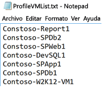

### <a name="start-profiling"></a>Inicio de la generación de perfiles
Una vez que tenga la lista de máquinas virtuales cuyo perfil se va a generar, puede ejecutar la herramienta en modo de generación de perfiles. Esta es la lista de parámetros obligatorios y opcionales de la herramienta para que se ejecute en modo de generación de perfiles.

ASRDeploymentPlanner.exe -Operation StartProfiling /?

| Nombre de parámetro | Descripción |
|---|---|
| -Operation | Inicio de la generación de perfiles |
| -Server | El nombre de dominio completo o la dirección IP del servidor vCenter/host de vSphere ESXi de cuyas máquinas virtuales se va a generar el perfil.|
| -User | El nombre de usuario para conectarse al servidor de vCenter/host de vSphere ESXi. El usuario debe tener, como mínimo, acceso de solo lectura.|
| -VMListFile | El archivo que contiene la lista de máquinas virtuales cuyos perfiles se van a generar. La ruta de acceso del archivo puede ser absoluta o relativa. El archivo debe contener un nombre de máquina virtual o una dirección IP en cada línea. El nombre de la máquina virtual especificado en el archivo debe ser el mismo que el nombre de la máquina virtual del servidor vCenter/host de vSphere ESXi.<br>Por ejemplo, el archivo VMList.txt contiene las siguientes máquinas virtuales:<ul><li>virtual_machine_A</li><li>10.150.29.110</li><li>virtual_machine_B</li><ul> |
| -NoOfDaysToProfile | El número de días durante el que se va a ejecutar la generación de perfiles. Se recomienda ejecutar la generación de perfiles durante más de 15 días para asegurarse de que el patrón de carga de trabajo en su entorno durante el período especificado se observa y se usa para proporcionar una recomendación adecuada. |
| -Directory | (Opcional) La convención de nomenclatura universal (UNC) o ruta de acceso del directorio local para almacenar los datos de la generación de perfiles que se han producido durante esta. Si no se especifica un nombre de directorio, se usará "ProfiledData" de la ruta de acceso actual como directorio predeterminado. |
| -Password | (Opcional) La contraseña que se usa para conectarse al servidor vCenter/host de vSphere ESXi. Si no se especifica ahora, se le pedirá que lo haga cuando se ejecute el comando.|
| -StorageAccountName | (Opcional) El nombre de la cuenta de almacenamiento que se usa para ver el rendimiento que se puede obtener en la replicación de datos desde una ubicación local a Azure. La herramienta carga los datos de prueba en esta cuenta de almacenamiento para calcular el rendimiento.|
| -StorageAccountKey | (Opcional) La clave de la cuenta de almacenamiento utilizada para acceder a dicha cuenta. Vaya a Azure Portal > Cuentas de almacenamiento > *nombre de la cuenta de almacenamiento*> > Configuración > Claves de acceso > Key1 (o clave de acceso principal para la cuenta de almacenamiento clásico). |
| -Environment | (Opcional) Se trata del entorno de la cuenta de Azure Storage de destino. Puede ser uno de estos tres valores: AzureCloud, AzureUSGovernment y AzureChinaCloud. El valor predeterminado es AzureCloud. Use el parámetro si la región de Azure de destino se corresponde con las nubes de Azure Gobierno de EE.UU. o Azure China. |


Se recomienda generar perfiles de las máquinas virtuales durante un mínimo de entre 15 y 30 días. Durante el período de generación de perfiles ASRDeploymentPlanner.exe sigue ejecutándose. La herramienta admite la entrada de tiempo de generación de perfiles en días. Si desea generar perfiles solo durante unas pocas horas o minutos para realizar una prueba rápida de la herramienta, en la versión preliminar pública tendrá que convertir el tiempo en la medida equivalente en días. Por ejemplo, para generar perfiles durante 30 minutos, la entrada debe ser 30/(60*24) = 0,021 días. El tiempo mínimo de generación de perfiles permitido es de 30 minutos.

Durante la generación de perfiles, también se pueden pasar un nombre y una clave de cuenta de almacenamiento para ver el rendimiento que Site Recovery puede lograr en el momento de la replicación desde el servidor de configuración o de procesos a Azure. Si el nombre y la clave de la cuenta de almacenamiento no se pasan durante la generación de perfiles, la herramienta no calculará el rendimiento que se puede obtener.

Puede ejecutar varias instancias de la herramienta para varios conjuntos de máquinas virtuales. Asegúrese de que los nombres de máquina virtual no se repiten en ninguno de los conjuntos de generación de perfiles. Por ejemplo, si ha generado el perfil de diez máquinas virtuales (de VM1 a VM10) y unos días después desea generar el de otras cinco (de VM11 a VM15), puede ejecutar la herramienta desde otra consola de línea de comandos para el segundo conjunto de máquinas virtuales (de VM11 a VM15). Asegúrese de que el segundo conjunto de máquinas virtuales no tiene ningún nombre de máquina virtual de la primera instancia de generación de perfiles o utilice un directorio de salida diferente para la segunda ejecución. Si se usan dos instancias de la herramienta para generar los perfiles de las mismas máquinas virtuales y se usa el mismo directorio de salida, el informe generado no será correcto.

Las configuraciones de las máquinas virtuales se capturan una vez al principio de la operación de generación de perfiles y se almacena en un archivo denominado VMDetailList.xml. Esta información se usa cuando se genera el informe. Los cambios en la configuración de una máquina virtual (por ejemplo, un mayor número de núcleos, discos o NIC) que se realizan desde el principio hasta el final de la generación de perfiles no se capturan. Esta es la solución alternativa para obtener la información más reciente de la máquina virtual más reciente al generar un informe en caso de que la configuración de una máquina virtual haya cambiado durante el transcurso de la generación de perfiles en la versión preliminar pública:

* Realice una copia de seguridad de VMdetailList.xml y elimine el archivo de su ubicación actual.
* Pase los argumentos -User y -Password en el momento de la generación de informes.

El comando de generación de perfiles genera varios archivos en el directorio de generación de perfiles. No elimine ninguno de los archivos, ya que la generación de informes puede resultar afectada.

#### <a name="example-1-profile-vms-for-30-days-and-find-the-throughput-from-on-premises-to-azure"></a>Ejemplo 1: Generar perfiles de máquinas virtuales durante 30 días y ver el rendimiento desde una ubicación local a Azure
```
ASRDeploymentPlanner.exe -Operation StartProfiling -Directory “E:\vCenter1_ProfiledData” -Server vCenter1.contoso.com -VMListFile “E:\vCenter1_ProfiledData\ProfileVMList1.txt”  -NoOfDaysToProfile  30  -User vCenterUser1 -StorageAccountName  asrspfarm1 -StorageAccountKey Eby8vdM02xNOcqFlqUwJPLlmEtlCDXJ1OUzFT50uSRZ6IFsuFq2UVErCz4I6tq/K1SZFPTOtr/KBHBeksoGMGw==
```

#### <a name="example-2-profile-vms-for-15-days"></a>Ejemplo 2: Generar perfiles de máquinas virtuales durante 15 días

```
ASRDeploymentPlanner.exe -Operation StartProfiling -Directory “E:\vCenter1_ProfiledData” -Server vCenter1.contoso.com -VMListFile “E:\vCenter1_ProfiledData\ProfileVMList1.txt”  -NoOfDaysToProfile  15  -User vCenterUser1
```

#### <a name="example-3-profile-vms-for-1-hour-for-a-quick-test-of-the-tool"></a>Ejemplo 3: Generación de perfiles de máquinas virtuales durante una hora para realizar una prueba rápida de la herramienta
```
ASRDeploymentPlanner.exe -Operation StartProfiling -Directory “E:\vCenter1_ProfiledData” -Server vCenter1.contoso.com -VMListFile “E:\vCenter1_ProfiledData\ProfileVMList1.txt”  -NoOfDaysToProfile  0.04  -User vCenterUser1
```

>[!NOTE]
>
>* Si el servidor en el que se ejecuta la herramienta se reinicia o se ha bloqueado, o si cierra la herramienta con Ctrl + C, se conservan los datos de los perfiles generados. Sin embargo, es posible que falten los últimos 15 minutos de los datos de los perfiles generados. En ese caso, vuelva a ejecutar la herramienta en modo de generación de perfiles después de que se reinicie el servidor.
>* Cuando se pasan el nombre y la clave de la cuenta de almacenamiento, la herramienta mide el rendimiento en el último paso de la generación de perfiles. Si la herramienta se cierra antes de que se complete la generación de perfiles, no se calcula el rendimiento. Para hallar el rendimiento antes de generar el informe, puede ejecutar la operación de GetThroughput desde la consola de línea de comandos. Si no lo hace, el informe generado no contendrá la información de rendimiento.


## <a name="generate-a-report"></a>Generación de un informe
La herramienta genera un archivo de Microsoft Excel habilitado para macros (archivo XLSM) como la salida del informe, que resume todas las recomendaciones de implementación. El informe se denomina DeploymentPlannerReport_<*identificador numérico único*>.xlsm y se coloca en el directorio especificado.

Una vez que se completa la generación de perfiles, se puede ejecutar la herramienta en modo de generación de informes. La siguiente tabla contiene una lista de los parámetros obligatorios y opcionales de la herramienta que se ejecutan en modo de generación de informes.

`ASRDeploymentPlanner.exe -Operation GenerateReport /?`

|Nombre de parámetro | Descripción |
|-|-|
| -Operation | GenerateReport |
| -Server |  El nombre de dominio completo o la dirección IP del servidor vCenter o vSphere (use el mismo nombre o dirección IP que utilizó en la generación de perfiles) en el que se encuentran las máquinas virtuales con perfiles cuyo informe va a generar. Tenga en cuenta que si usó un servidor vCenter en el momento de la generación de perfiles, no puede usar un servidor de vSphere para la generación de informes, y viceversa.|
| -VMListFile | El archivo que contiene la lista de máquinas virtuales con perfiles para las que se va a generar el informe. La ruta de acceso del archivo puede ser absoluta o relativa. El archivo debe contener un nombre de máquina virtual o una dirección IP en cada línea. Los nombres de máquina virtual que se especifican en el archivo deben ser los mismos que los del servidor vCenter/host de vSphere ESXi y coincidir con los que se usaron en la generación de perfiles.|
| -Directory | (Opcional) El UNC o la ruta de acceso del directorio local en que se almacenan los datos de la generación de perfiles (los archivos que se crean en la generación de perfiles). Estos datos son necesarios para generar el informe. Si no se especifica ningún nombre, se usará el directorio 'ProfiledData'. |
| -GoalToCompleteIR | (Opcional) El número de horas en que se debe completar la replicación inicial de las máquinas virtuales cuyo perfil se va a generar. El informe generado proporciona el número de máquinas virtuales en las que se puede completar la replicación inicial en el tiempo especificado. El valor predeterminado es 72 horas. |
| -User | (Opcional) El nombre de usuario que se utiliza para conectarse al servidor vCenter o vSphere. Se utiliza para capturar la información de configuración más reciente de las máquinas virtuales, como el número de discos, de núcleos y de NIC que se usan en el informe. Si no se especifica el nombre, se usa la información de configuración recopilada al principio de la generación de perfiles. |
| -Password | (Opcional) La contraseña que se usa para conectarse al servidor vCenter/host de vSphere ESXi. Si la contraseña no se especifica como parámetro, se le pedirá más tarde, cuando se ejecute el comando. |
| -DesiredRPO | (Opcional) El objetivo del punto de recuperación deseado, en minutos. El valor predeterminado es 15 minutos.|
| -Bandwidth | Ancho de banda en Mbps. El parámetro se usa para calcular el RPO que se puede lograr para el ancho de banda especificado. |
| -StartDate | (Opcional) La fecha y hora de inicio en DD-MM-AAAA:HH:MM (formato de 24 horas). *StartDate* se debe especificar junto con *EndDate*. Cuando se especifica StartDate, se genera el informe de los datos de generación de perfiles que se recopilan entre StartDate y EndDate. |
| -EndDate | (Opcional) La fecha y hora de finalización en DD-MM-AAAA:HH:MM (formato de 24 horas). *EndDate* se debe especificar junto con *StartDate*. Cuando se especifica EndDate, se genera el informe para los datos de la generación de perfiles recopilados entre StartDate y EndDate. |
| -GrowthFactor | (Opcional) El factor de crecimiento, expresado en forma de porcentaje. El valor predeterminado es 30 %. |
| -UseManagedDisks | (Opcional) UseManagedDisks - Yes/No. El valor predeterminado es Yes. El cálculo del número de máquinas virtuales que se pueden colocar en una única cuenta de almacenamiento se realiza teniendo en cuenta si se ha realizado la conmutación por error o la conmutación por error de prueba en discos administrados y no en discos sin administrar. |

#### <a name="example-1-generate-a-report-with-default-values-when-the-profiled-data-is-on-the-local-drive"></a>Ejemplo 1: Generación de un informe con los valores predeterminados cuando los datos de generación de perfiles están en la unidad local
```
ASRDeploymentPlanner.exe -Operation GenerateReport -Server vCenter1.contoso.com -Directory “\\PS1-W2K12R2\vCenter1_ProfiledData” -VMListFile “\\PS1-W2K12R2\vCenter1_ProfiledData\ProfileVMList1.txt”
```

#### <a name="example-2-generate-a-report-when-the-profiled-data-is-on-a-remote-server"></a>Ejemplo 2: Generación de un informe cuando los datos de generación de perfiles están en un servidor remoto
El usuario debe tener acceso de lectura y escritura en el directorio remoto.
```
ASRDeploymentPlanner.exe -Operation GenerateReport -Server vCenter1.contoso.com -Directory “\\PS1-W2K12R2\vCenter1_ProfiledData” -VMListFile “\\PS1-W2K12R2\vCenter1_ProfiledData\ProfileVMList1.txt”
```

#### <a name="example-3-generate-a-report-with-a-specific-bandwidth-and-goal-to-complete-ir-within-specified-time"></a>Ejemplo 3: Generación de un informe con un ancho de banda y objetivo específicos para finalizar IR en el tiempo especificado
```
ASRDeploymentPlanner.exe -Operation GenerateReport -Server vCenter1.contoso.com -Directory “E:\vCenter1_ProfiledData” -VMListFile “E:\vCenter1_ProfiledData\ProfileVMList1.txt” -Bandwidth 100 -GoalToCompleteIR 24
```

#### <a name="example-4-generate-a-report-with-a-5-percent-growth-factor-instead-of-the-default-30-percent"></a>Ejemplo 4: Generación de un informe con un factor de crecimiento del 5 %, en lugar del valor predeterminado del 30 %
```
ASRDeploymentPlanner.exe -Operation GenerateReport -Server vCenter1.contoso.com -Directory “E:\vCenter1_ProfiledData” -VMListFile “E:\vCenter1_ProfiledData\ProfileVMList1.txt” -GrowthFactor 5
```

#### <a name="example-5-generate-a-report-with-a-subset-of-profiled-data"></a>Ejemplo 5: Generación de un informes con un subconjunto de datos de la generación de perfiles
Por ejemplo, tiene 30 días de datos de generación de perfiles y desea generar un informe de solo 20 días.
```
ASRDeploymentPlanner.exe -Operation GenerateReport -Server vCenter1.contoso.com -Directory “E:\vCenter1_ProfiledData” -VMListFile “E:\vCenter1_ProfiledData\ProfileVMList1.txt” -StartDate  01-10-2017:12:30 -EndDate 01-19-2017:12:30
```

#### <a name="example-6-generate-a-report-for-5-minute-rpo"></a>Ejemplo 6: Generación de un informes para un RPO de 5 minutos
```
ASRDeploymentPlanner.exe -Operation GenerateReport -Server vCenter1.contoso.com -Directory “E:\vCenter1_ProfiledData” -VMListFile “E:\vCenter1_ProfiledData\ProfileVMList1.txt”  -DesiredRPO 5
```

## <a name="percentile-value-used-for-the-calculation"></a>Valor del percentil usado para el cálculo
**¿Qué valor del percentil predeterminado de las métricas de rendimiento recopiladas durante la generación de perfiles utiliza la herramienta al generar informes?**

La herramienta usa los valores del percentil 95 como valor predeterminado de las IOPS de lectura/escritura, las IOPS de escritura y la actividad de datos que se recopilan en la generación de perfiles de todas las máquinas virtuales. Esta métrica garantiza que el pico del percentil 100 que las máquinas virtuales pueden ver debido a eventos temporales no se utiliza para determinar los requisitos de ancho de banda del origen y de la cuenta de almacenamiento de destino. Por ejemplo, un evento temporal podría ser un trabajo de copia de seguridad que se ejecuta una vez al día, una actividad periódica de indexación de base de datos o de generación de informes de análisis, u otros eventos similares de corta duración que se producen en un momento dado.

El uso de valores del percentil 95 ofrece una imagen real de las verdaderas características de las cargas de trabajo y ofrece el mejor rendimiento cuando dichas cargas se ejecutan en Azure. No se espera que haga falta cambiar este número. Si cambia el valor (por ejemplo, al percentil 90), puede actualizar el archivo de configuración *ASRDeploymentPlanner.exe.config* en la carpeta predeterminada y guardarlo para generar un nuevo informe de los datos de generación de perfiles existentes.
```
<add key="WriteIOPSPercentile" value="95" />      
<add key="ReadWriteIOPSPercentile" value="95" />      
<add key="DataChurnPercentile" value="95" />
```

## <a name="growth-factor-considerations"></a>Consideraciones acerca del factor de crecimiento
**¿Por qué hay que tener en cuenta el factor de crecimiento al planear implementaciones?**

Es fundamental tener en cuenta el crecimiento en las características de la carga de trabajo y suponer que el uso puede aumentar con el tiempo. Una vez instaurada la protección, si las características de la carga de trabajo cambian, no podrá cambiar a otra cuenta de almacenamiento sin tener que deshabilitar y volver a habilitar la protección.

Por ejemplo, supongamos que en la actualidad la máquina virtual se ajusta a una cuenta de replicación de almacenamiento estándar. En los tres próximos meses, es probable que se produzcan varios cambios:

* Aumentará el número de usuarios de la aplicación que se ejecuta en la máquina virtual.
* El aumento de actividad resultante en la máquina virtual requerirá que la máquina virtual use Premium Storage para que la replicación de Site Recovery pueda mantener el ritmo.
* En consecuencia, tendrá que deshabilitar y volver a habilitar la protección en una cuenta de Premium Storage.

Se recomienda encarecidamente que planee el crecimiento durante el planeamiento de la implementación y mientras el valor predeterminado sea el 30 por ciento. El usuario es quien mejor conoce el patrón de uso de sus aplicaciones y las proyecciones de crecimiento, y este número se puede cambiar según sea necesario durante la generación de un informe. Además, puede generar varios informes con distintos factores de crecimiento con los mismos datos de generación de perfiles y determinar qué recomendaciones de ancho de banda de origen y de almacenamiento de destino son las más apropiadas en su caso.

El informe de Microsoft Excel generado contiene la siguiente información:

* [Entrada](site-recovery-deployment-planner.md#input)
* [Recomendaciones](site-recovery-deployment-planner.md#recommendations-with-desired-rpo-as-input)
* [Recomendaciones: entrada de ancho de banda](site-recovery-deployment-planner.md#recommendations-with-available-bandwidth-as-input)
* [VM<->Selección de ubicación de almacenamiento](site-recovery-deployment-planner.md#vm-storage-placement)
* [VM compatibles](site-recovery-deployment-planner.md#compatible-vms)
* [VM incompatibles](site-recovery-deployment-planner.md#incompatible-vms)


## <a name="get-throughput"></a>Obtención de rendimiento

Para calcular el rendimiento que Site Recovery puede lograr durante la replicación desde una ubicación local a Azure, ejecute la herramienta en modo GetThroughput. La herramienta calcula el rendimiento desde el servidor en el que se ejecuta la herramienta. Idealmente, este servidor se basa en la guía de ajuste de tamaño del servidor de configuración. Si ya ha implementado los componentes de la infraestructura de Site Recovery de forma local, ejecute la herramienta en el servidor de configuración.

Abra una consola de línea de comandos y vaya a la carpeta de la herramienta de planeamiento de la implementación de Site Recovery. Ejecute ASRDeploymentPlanner.exe con los siguientes parámetros.

`ASRDeploymentPlanner.exe -Operation GetThroughput /?`

|Nombre de parámetro | Descripción |
|-|-|
| -Operation | GetThroughput |
| -Directory | (Opcional) El UNC o la ruta de acceso del directorio local en que se almacenan los datos de la generación de perfiles (los archivos que se crean en la generación de perfiles). Estos datos son necesarios para generar el informe. Si no se especifica un nombre de directorio, se utiliza el directorio 'ProfiledData'. |
| -StorageAccountName | El nombre de la cuenta de almacenamiento que se usa para hallar el ancho de banda consumido durante la replicación de datos desde una ubicación local a Azure. La herramienta carga los datos de prueba en esta cuenta de almacenamiento para calcular el ancho de banda consumido. |
| -StorageAccountKey | La clave de la cuenta de almacenamiento utilizada para acceder a dicha cuenta. Vaya a Azure Portal > Cuentas de almacenamiento > <*Nombre de cuenta de almacenamiento*> > Configuración > Claves de acceso > Key1 (o una clave de acceso principal para una cuenta de almacenamiento clásico). |
| -VMListFile | El archivo que contiene la lista de máquinas virtuales de las que se va a generar el perfil para calcular el ancho de banda consumido. La ruta de acceso del archivo puede ser absoluta o relativa. El archivo debe contener un nombre de máquina virtual o una dirección IP en cada línea. Los nombres de máquina virtual especificados en el archivo debe ser los mismo que los nombres de máquina virtual del servidor vCenter/host de vSphere ESXi.<br>Por ejemplo, el archivo VMList.txt contiene las siguientes máquinas virtuales:<ul><li>VM_A</li><li>10.150.29.110</li><li>VM_B</li></ul>|
| -Environment | (Opcional) Se trata del entorno de la cuenta de Azure Storage de destino. Puede ser uno de estos tres valores: AzureCloud, AzureUSGovernment y AzureChinaCloud. El valor predeterminado es AzureCloud. Use el parámetro si la región de Azure de destino se corresponde con las nubes de Azure Gobierno de EE.UU. o Azure China. |

La herramienta crea varios archivos llamados asrvhdfile<#>.vhd de 64 MB (donde "#" es el número de archivos) en el directorio especificado. La herramienta carga los archivos en la cuenta de almacenamiento para hallar el rendimiento. Después de medir el rendimiento, la herramienta elimina todos estos archivos de la cuenta de almacenamiento y del servidor local. Si la herramienta se termina por cualquier motivo mientras calcula el rendimiento, no elimina los archivos del almacenamiento ni del servidor local. Será preciso eliminarlos manualmente.

El rendimiento se mide en un momento especificado y es el rendimiento máximo que Site Recovery puede lograr durante la replicación, siempre que los restantes factores no varíen. Por ejemplo, si alguna aplicación empieza a consumir más ancho de banda en la misma red, el rendimiento real variará durante la replicación. Si se ejecuta el comando GetThroughput desde un servidor de configuración, la herramienta no detecta las máquinas virtuales protegidas ni la replicación en curso. El resultado de rendimiento medido es distinto si la operación de GetThroughput se ejecuta cuando las máquinas virtuales protegidas tienen una actividad de datos alta. Se recomienda ejecutar la herramienta en varios momentos de la generación de perfiles para saber qué niveles de rendimiento se pueden lograr en cada uno de ellos. En el informe, la herramienta muestra el último rendimiento medido.

### <a name="example"></a>Ejemplo
```
ASRDeploymentPlanner.exe -Operation GetThroughput -Directory  E:\vCenter1_ProfiledData -VMListFile E:\vCenter1_ProfiledData\ProfileVMList1.txt  -StorageAccountName  asrspfarm1 -StorageAccountKey by8vdM02xNOcqFlqUwJPLlmEtlCDXJ1OUzFT50uSRZ6IFsuFq2UVErCz4I6tq/K1SZFPTOtr/KBHBeksoGMGw==
```

>[!NOTE]
>
> Ejecute la herramienta en un servidor que tenga las mismas características de almacenamiento y de CPU que el servidor de configuración.
>
> En la replicación, establezca el ancho de banda recomendado de forma que cubra el RPO el 100 % del tiempo. Después de establecer el ancho de banda correcto, si no percibe un aumento en el rendimiento obtenido que notifica la herramienta, siga estos pasos:
>
>  1. Realice las comprobaciones necesarias para determinar si hay algún requisito de calidad de servicio (QoS) de la red que limite el rendimiento de Site Recovery.
>
>  2. Realice las comprobaciones necesarias para determinar si el almacén de Site Recovery está en la región física de Microsoft Azure más cercana admitida para minimizar la latencia de red.
>
>  3. Compruebe las características del almacenamiento local para determinar si puede mejorar el hardware (por ejemplo, pasar de HDD a SSD).
>
>  4. Cambie la configuración de Site Recovery en el servidor de procesos para [aumentar la cantidad de ancho de banda de red que se usa para la replicación](./site-recovery-plan-capacity-vmware.md#control-network-bandwidth).

## <a name="recommendations-with-desired-rpo-as-input"></a>Recomendaciones con el RPO deseado como entrada

### <a name="profiled-data"></a>Datos de generación de perfiles

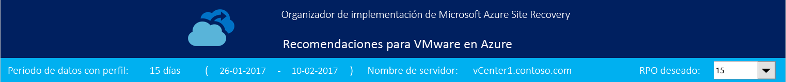

**Período de datos de generación de perfiles**: el período durante el que se ejecutó la generación de perfiles. De manera predeterminada, la herramienta incluye todos los datos de generación de perfiles en el cálculo, a menos que genere el informe para un período específico mediante las opciones StartDate y EndDate durante la generación de informes.

**Nombre del servidor**: el nombre o la dirección IP del servidor VMware vCenter o host de ESXi cuyo informe de máquinas virtuales se genera.

**RPO deseado**: el objetivo de punto de recuperación para la implementación. De manera predeterminada, se calcula el ancho de banda de red necesario para los valores de RPO de 15, 30 y 60 minutos. En función de la selección, los valores afectados se actualizan en la hoja. Si ha usado el parámetro *DesiredRPOinMin* al generar el informe, ese valor se muestra en el resultado de RPO deseado.

### <a name="profiling-overview"></a>Información general sobre la generación de perfiles

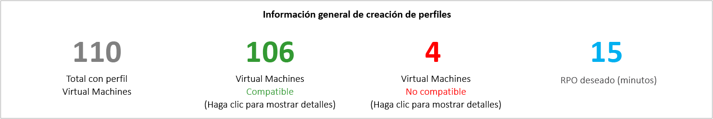

**Total de máquinas virtuales de las que se ha generado el perfil**: El número total de las máquinas virtuales cuyos datos de generación de perfiles están disponibles. Si VMListFile contiene los nombres de las máquinas virtuales de las que no se ha generado el perfil, dichas máquinas virtuales no se tienen en cuenta en la generación de informes y se excluyen del número total de máquinas virtuales de las que se ha generado el perfil.

**Máquinas virtuales compatibles**: el número de máquinas virtuales que se pueden proteger en Azure mediante Site Recovery. Es el número total de máquinas virtuales compatibles para el que se calculan el ancho de banda de red, el número de cuentas de almacenamiento, el número de núcleos de Azure y el número de servidores de configuración y de servidores de proceso adicionales que se requieren. Los detalles de todas las máquinas virtuales compatibles están disponibles en la sección "Máquinas virtuales compatibles".

**Máquinas virtuales no compatibles**: el número de máquinas virtuales de las que se ha generado el perfil que no son compatibles para la protección con Site Recovery. Los motivos de dicha incompatibilidad se indican en la sección "Máquinas virtuales no compatibles". Si VMListFile contiene los nombres de las máquinas virtuales cuyo perfil no se ha generado, dichas máquinas se excluyen del número de máquinas virtuales no compatibles. Estas máquinas aparecen como "Datos no encontrados" al final de la sección "Máquinas virtuales no compatibles".

**RPO deseado**: el objetivo del punto de recuperación deseado, en minutos. El informe se genera para tres valores de RPO: 15 (valor predeterminado), 30 y 60 minutos. La recomendación que se hace sobre el ancho de banda en el informe se cambia en función de la selección que se realice en la lista desplegable de Desired RPO (RPO deseado) de la parte superior derecha de la hoja. Si el informe se ha generado mediante el parámetro *-DesiredRPO* con un valor personalizado, dicho valor personalizado se mostrará como valor predeterminado en la lista desplegable Desired RPO (RPO deseado).

### <a name="required-network-bandwidth-mbps"></a>Ancho de banda de red requerido (Mbps)

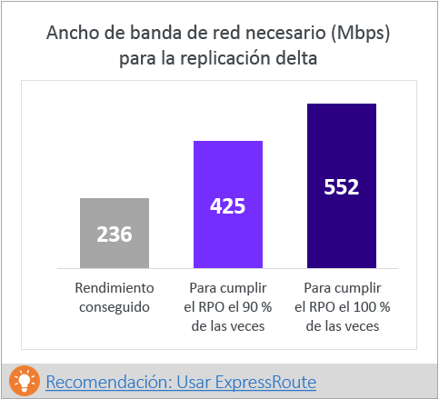

**Para cubrir el RPO en el 100 % de las ocasiones:** el ancho de banda recomendado, en Mbps, que se debe asignar para cubrir el RPO deseado en todo momento. Esta cantidad de ancho de banda debe estar dedicada a la replicación diferencial de estado estable de todas las máquinas virtuales compatibles para evitar infracciones de RPO.

**Para cubrir el RPO en el 90 % de las ocasiones**: a causa de los precios del ancho de banda o por cualquier otra razón, si no puede establecer el ancho de banda necesario para cubrir el RPO deseado en todo momento, puede elegir usar un valor de ancho de banda inferior que le permita satisfacer el RPO deseado en el 90 % de las ocasiones. Para conocer las implicaciones de establecer un ancho de banda inferior, el informe proporciona el análisis de hipótesis del número previsible de infracciones de RPO y su duración.

**Rendimiento obtenido**: El rendimiento del servidor en el que ha ejecutado el comando GetThroughput para la región de Microsoft Azure en la que se encuentra la cuenta de almacenamiento. Este número de rendimiento indica el nivel estimado que se puede lograr al proteger las máquinas virtuales compatibles mediante Site Recovery, siempre que las características de red y de almacenamiento tanto del servidor de configuración como del servidor de procesos sean las mismas que las del servidor en el que se ha ejecutado la herramienta.

En la replicación, debe establecer el ancho de banda recomendado de forma que cubra el RPO el 100 % del tiempo. Después de establecer el ancho de banda, si no percibe un aumento en el rendimiento obtenido que notifica la herramienta, siga estos pasos:

1. Realice las comprobaciones necesarias para ver si hay algún requisito de calidad de servicio (QoS) de la red que limite el rendimiento de Site Recovery.

2. Realice las comprobaciones necesarias para ver si el almacén de Site Recovery está en la región física de Microsoft Azure más cercana admitida para minimizar la latencia de red.

3. Compruebe las características del almacenamiento local para determinar si puede mejorar el hardware (por ejemplo, pasar de HDD a SSD).

4. Cambie la configuración de Site Recovery en el servidor de procesos para [aumentar la cantidad de ancho de banda de red que se usa para la replicación](./site-recovery-plan-capacity-vmware.md#control-network-bandwidth).

Si ejecuta la herramienta en un servidor de configuración o de procesos que ya tiene máquinas virtuales protegidas, ejecute la herramienta varias veces. El número de rendimiento logrado cambia en función de la cantidad de activación que se procesa en ese momento.

Para todas las implementaciones de Site Recovery que se realicen en la empresa, se recomienda usar [ExpressRoute](https://aka.ms/expressroute).

### <a name="required-storage-accounts"></a>Cuentas de almacenamiento requeridas
El siguiente gráfico muestra el número total de cuentas de almacenamiento (Estándar y Premium) que se requieren para proteger todas las máquinas virtuales compatibles. Para saber qué cuenta de almacenamiento se debe usar para cada máquina virtual, consulte la sección "selección de ubicación de almacenamiento de máquina virtual".

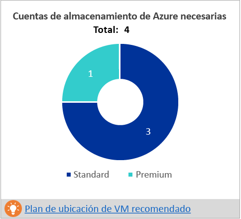

### <a name="required-number-of-azure-cores"></a>Número de núcleos de Azure requeridos
Este resultado es el número total de núcleos que se deben configurar antes de realizar una conmutación por error real o de prueba de todas las máquinas virtuales compatibles. Si hay muy pocos núcleos en la suscripción, Site Recovery no puede crear las máquinas virtuales en el momento de realizar la conmutación por error real o de prueba.

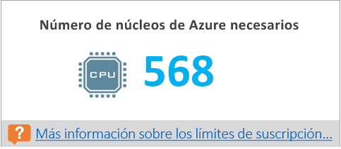

### <a name="required-on-premises-infrastructure"></a>Infraestructura local requerida
Esta cifra es el número total de servidores de configuración y servidores de proceso adicionales configurables que serían suficientes para proteger todas las máquinas virtuales compatibles. En función de las [recomendaciones de tamaño para el servidor de configuración](https://aka.ms/asr-v2a-on-prem-components) admitidas, la herramienta puede recomendar más servidores. Las recomendaciones se basan en el valor mayor de los siguientes elementos, la actividad diaria o el número máximo de máquinas virtuales (se supone que cada máquina virtual tiene tres discos), lo que se alcance primero en el servidor de configuración o en el servidor de procesos adicional. La información de la actividad total por día y el número total de discos protegidos se encontrará en la sección "Entrada".

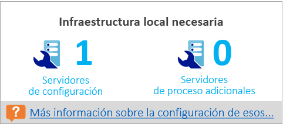

### <a name="what-if-analysis"></a>Análisis de hipótesis
Este análisis indica el número de infracciones que pueden producirse durante el período de generación de perfiles si se establece un ancho de banda menor para cumplir el RPO deseado solo en el 90 % de las ocasiones. Pueden producirse una o varias infracciones de RPO en cualquier día determinado. El gráfico muestra el RPO máximo del día.
En función de este análisis, puede decidir si el número de infracciones de RPO a lo largo de todos los días y el límite máximo de RPO por día es aceptable para el ancho de banda menor especificado. Si es aceptable, puede asignar el ancho de banda menor para la replicación. En caso contrario, asigne el ancho de banda mayor como se sugirió anteriormente para satisfacer el RPO deseado en el 100 % de las ocasiones.

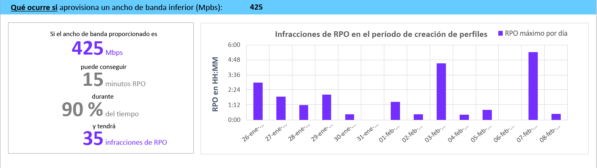

### <a name="recommended-vm-batch-size-for-initial-replication"></a>Tamaño de lote de máquinas virtuales recomendado para la replicación inicial
En esta sección, se recomienda el número de máquinas virtuales que se pueden proteger en paralelo para completar la replicación inicial en 72 horas con el ancho de banda sugerido para satisfacer el RPO deseado el 100 % del tiempo que se establece. Este valor se puede configurar. Para cambiarlo en el momento de generación de informes, use el parámetro *GoalToCompleteIR*.

Este gráfico muestra un intervalo de valores de ancho de banda y un recuento del tamaño del lote de máquinas virtuales que se calcula que son necesarias para completar la replicación inicial en 72 horas, en función del valor medio de tamaño de las máquinas virtuales detectadas entre todas las máquinas virtuales compatibles.

En la versión preliminar pública, el informe no especifica las máquinas virtuales que deben incluirse en un lote. Puede usar el tamaño de disco que se muestra en la sección "Máquinas virtuales compatibles" para hallar el tamaño de cada máquina virtual y seleccionarlas para un lote, o bien puede seleccionarlas en función de características de carga de trabajo conocidas. La hora de finalización de la replicación inicial cambia proporcionalmente en función del tamaño real de los discos de las máquinas virtuales, del espacio de disco usado y del rendimiento de red disponible.

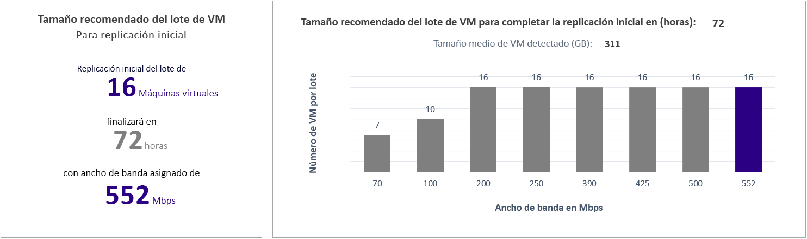

### <a name="growth-factor-and-percentile-values-used"></a>Factor de crecimiento y valores de percentil utilizados
Esta sección de la parte inferior de la hoja muestra el valor del percentil que se utiliza en todos los contadores de rendimiento de las máquinas virtuales de las que se ha generado el perfil (el valor predeterminado es el percentil 95) y el factor de crecimiento (el valor predeterminado es el 30 %) que se usa en todos los cálculos.

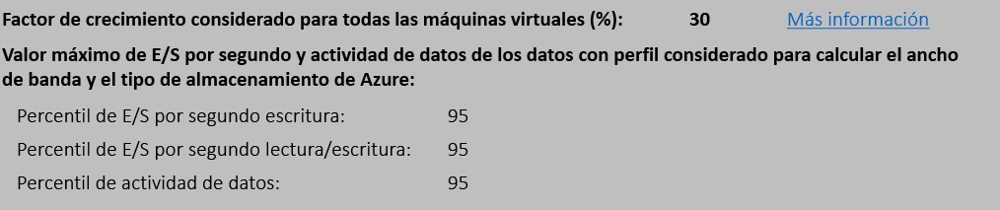

## <a name="recommendations-with-available-bandwidth-as-input"></a>Recomendaciones relacionadas con el ancho de banda disponible como entrada

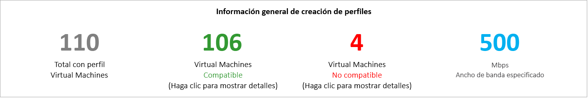

Puede darse el caso de que sepa que no puede establecer un ancho de banda de más de x Mbps para la replicación de Site Recovery. La herramienta le permite especificar el ancho de banda disponible (mediante el parámetro -Bandwidth durante la generación de informes) y obtener el RPO factible en minutos. Con este valor de RPO factible, puede decidir si necesita aprovisionar más ancho de banda o si está conforme con tener una solución de recuperación ante desastres con este RPO.

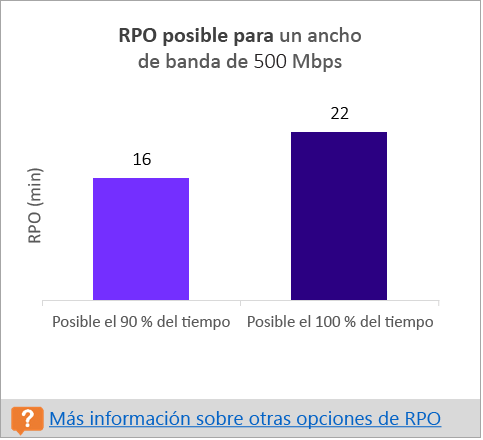

## <a name="input"></a>Entrada
La hoja de cálculo Entrada proporciona información general del entorno de VMware en el que se han generado perfiles.

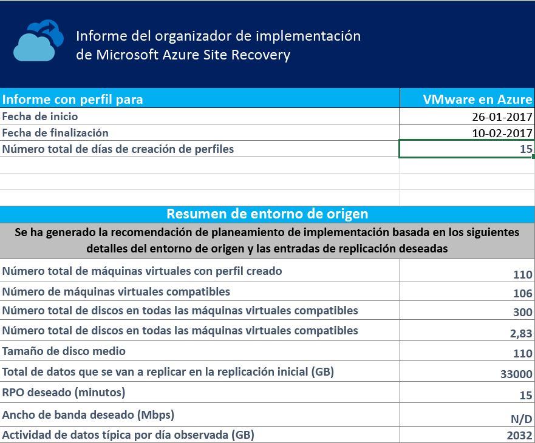

**Fecha de inicio** y **Fecha de finalización**: las fechas de inicio y finalización de los datos de generación de perfiles que se tienen en cuenta para la generación de informes. De forma predeterminada, la fecha de inicio es la fecha en que comienza la generación de perfiles, mientras que la de finalización es la fecha en la que se detiene. Esta se puede especificar mediante los valores "StartDate" y "EndDate" si el informe se genera con estos parámetros.

**Número total de días de generación de perfiles**: el número total de días de generación de perfiles comprendido entre las fechas de inicio y de finalización para el que se genera el informe.

**Número de máquinas virtuales compatibles**: el número total de máquinas virtuales compatibles para el que se calculan el ancho de banda de red necesario, el número de cuentas de almacenamiento requeridas, los núcleos de Microsoft Azure y los servidores de configuración y los servidores de proceso adicionales.

**Número total de discos en todas las máquinas virtuales compatibles**: el número que se usa como una de las entradas para decidir el número de servidores de configuración y servidores de proceso adicionales que se usarán en la implementación.

**Número medio de discos por máquina virtual compatible**: el número medio de discos calculado en todas las máquinas virtuales compatibles.

**Tamaño medio de disco (GB)**: el tamaño medio de disco calculado en todas las máquinas virtuales compatibles.

**RPO deseado (en minutos)**: el objetivo de punto de recuperación predeterminado o el valor pasado para el parámetro "DesiredRPO" en el momento de la generación de informes para calcular el ancho de banda necesario.

**Ancho de banda deseado (Mbps)**: el valor que ha pasado para el parámetro "Bandwidth" en el momento de la generación de informes para calcular el RPO factible.

**Actividad de datos normal observada por día (GB)**: el valor medio de la actividad de datos observada en todos los días de generación de perfiles. Este número se utiliza como una de las entradas para decidir el número de servidores de configuración y servidores de procesos adicionales que se usarán en la implementación.


## <a name="vm-storage-placement"></a>Selección de ubicación de almacenamiento de máquina virtual

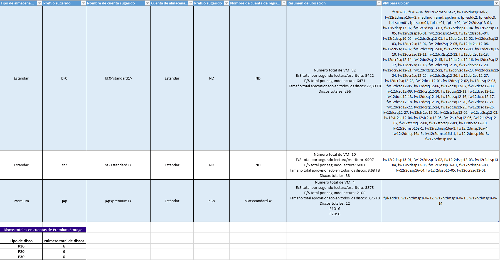

**Tipo de almacenamiento en disco**: cuenta de almacenamiento Estándar o Premium, que se usa para replicar todas las máquinas virtuales correspondientes que se mencionan en la columna **Máquinas virtuales que se colocan**.

**Prefijo sugerido**: el prefijo de tres caracteres sugerido que se puede usar para asignar un nombre a la cuenta de almacenamiento. Puede usar su propio prefijo, pero el que sugiere la herramienta sigue la [convención de nomenclatura de particiones de las cuentas de almacenamiento](https://aka.ms/storage-performance-checklist).

**Nombre de cuenta sugerido**: el nombre de la cuenta de almacenamiento después de incluir el prefijo sugerido. Reemplace el nombre entre corchetes angulares (< y >) por una entrada personalizada.

**Cuenta de almacenamiento del registro**: todos los registros de la replicación se almacenan en una cuenta de almacenamiento Estándar. En el caso de las máquinas virtuales que se replican en una cuenta de almacenamiento Premium, configure una cuenta de almacenamiento Estándar adicional para el almacenamiento de registros. Varias cuentas de almacenamiento de replicación Premium puede usar una única cuenta de almacenamiento de registros Estándar. Las máquinas virtuales que se replican en las cuentas de almacenamiento Estándar usan la misma cuenta de almacenamiento para los registros.

**Nombre de cuenta de registros sugerido**: el nombre de la cuenta de registros de almacenamiento después de incluir el prefijo sugerido. Reemplace el nombre entre corchetes angulares (< y >) por una entrada personalizada.

**Resumen de la selección de ubicación**: un resumen de la carga total de máquinas virtuales en la cuenta de almacenamiento en el momento de la replicación y la conmutación por error real o de prueba. Incluye el número total de máquinas virtuales asignadas a la cuenta de almacenamiento, el total de IOPS de lectura/escritura en todas las máquinas virtuales colocadas en esta cuenta de almacenamiento, el total de IOPS de escritura (replicación), el tamaño total configurado en todos los discos y el número total de discos.

**Máquinas virtuales que se colocan**: una lista de todas las máquinas virtuales que se deben colocar en la cuenta de almacenamiento especificada para que tanto el rendimiento como el uso sean óptimos.

## <a name="compatible-vms"></a>Máquinas virtuales compatibles
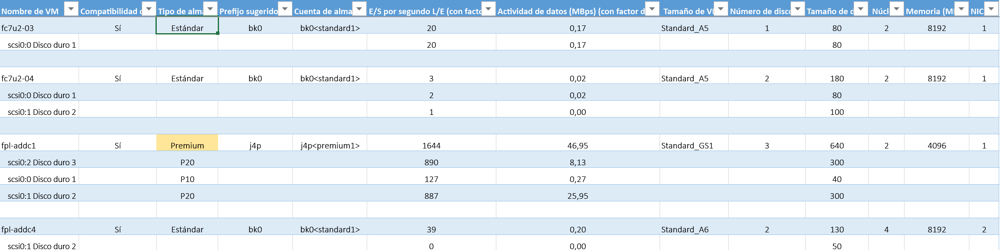

**Nombre de máquina virtual**: el nombre o la dirección IP de la máquina virtual que se utilizan en VMListFile cuando se genera un informe. Esta columna también muestra los discos (VMDK) que están conectados a las máquinas virtuales. Para distinguir las máquinas virtuales de vCenter con nombres o direcciones IP, los nombres incluyen el nombre del host de ESXi. El host de ESXi enumerado es en el que se colocó la máquina virtual cuando la herramienta la detecto en el período de generación de perfiles.

**Compatibilidad de máquina virtual**: los valores son **Sí** y **Sí**\*. **Sí**\* es para las instancias en que la máquina virtual es una opción para [Azure Premium Storage](https://aka.ms/premium-storage-workload). En este caso, la alta actividad de la generación de perfiles o el disco de IOPS se encuadra en las categorías P20 o P30, pero el tamaño del disco hace que se asigne a una categoría P10 o P20. La cuenta de almacenamiento decide a qué tipo de disco de almacenamiento Premium se asigna un disco, en función de su tamaño. Por ejemplo:
* Menos de 128 GB es P10.
* De 128 GB a 512 GB es P20.
* De 512 GB a 1024 GB es P30.
* De 1025 GB a 2048 GB es P40.
* De 2049 GB a 4095 GB es P50.

Si las características de carga de trabajo de un disco lo colocan en la categoría P20 o P30, pero el tamaño lo asigna a un tipo de disco de almacenamiento Premium inferior, la herramienta marca la máquina virtual como **Sí**\*. La herramienta también recomienda que cambie el tamaño del disco de origen para poder encuadrarlo en el tipo de disco de almacenamiento Premium recomendado o que cambie el tipo de disco de destino después de la conmutación por error.

**Tipo de almacenamiento**: Estándar o Premium.

**Prefijo sugerido**: el prefijo de tres caracteres de la cuenta de almacenamiento.

**Cuenta de almacenamiento**: el nombre que utiliza el prefijo sugerido para la cuenta de almacenamiento.

**IOPS de lectura y escritura (con factor de crecimiento)**: el valor máximo de IOPS de lectura/escritura en carga de trabajo en el disco (el percentil 95 es el predeterminado) incluido el factor de crecimiento futuro (el valor predeterminado es el 30 %). Tenga en cuenta que el total de IOPS de lectura y escritura de una máquina virtual no es siempre la suma de las IOPS de lectura y escritura de los discos individuales de la máquina virtual, ya que las IOPS de lectura y escritura máximas de la máquina virtual es el máximo de la suma de las IOPS de lectura y escritura sus discos individuales durante cada minuto del período de generación de perfiles.

**Actividad de datos, en Mbps, (con factor de crecimiento)**: el máximo índice de actividad en el disco (el percentil 95 es el predeterminado), incluido el factor de crecimiento futuro (el valor predeterminado es el 30 %). Tenga en cuenta que el total de actividad de datos de la máquina virtual no siempre es la suma de la actividad de datos de los discos individuales de la máquina virtual, ya que la actividad de datos máxima de la máquina virtual es el máximo de la suma de las actividades de los discos individuales durante cada minuto del período de generación de perfiles.

**Tamaño de la máquina virtual de Azure**: el tamaño ideal de la máquina virtual de Azure Cloud Services asignada para esta máquina virtual local. La asignación basada en la memoria, el número de núcleos de discos/núcleos/NIC y las IOPS de lectura y escritura de la máquina virtual local. La recomendación es usar siempre el menor tamaño de máquina virtual de Azure que cumpla todas las características de la máquina virtual local.

**Número de discos**: el número total de discos (VMDK) de la máquina virtual.

**Tamaño de disco (en GB)**: el tamaño total configurado de todos los discos de la máquina virtual. La herramienta también muestra el tamaño de los discos individuales de la máquina virtual.

**Núcleos**: el número de núcleos de CPU de la máquina virtual.

**Memoria (en MB)**: la memoria RAM de la máquina virtual.

**NIC**: el número de NIC de la máquina virtual.

**Tipo de arranque**: se trata del tipo de arranque de la máquina virtual. Puede ser BIOS o EFI. Actualmente, Azure Site Recovery admite solo el tipo de arranque BIOS. Todas las máquinas virtuales del tipo de arranque EFI se muestran en la hoja de cálculo de máquinas virtuales incompatibles.

**Tipo de sistema operativo**: se trata del tipo de sistema operativo de la máquina virtual. Puede ser Windows, Linux u otro.

## <a name="incompatible-vms"></a>Máquinas virtuales no compatibles

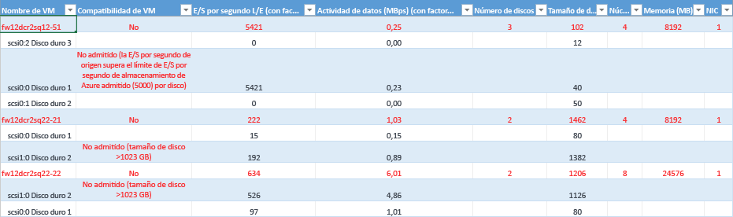

**Nombre de máquina virtual**: el nombre o la dirección IP de la máquina virtual que se utilizan en VMListFile cuando se genera un informe. Esta columna también muestra los VMDK que están conectados a las máquinas virtuales. Para distinguir las máquinas virtuales de vCenter con nombres o direcciones IP, los nombres incluyen el nombre del host de ESXi. El host de ESXi enumerado es en el que se colocó la máquina virtual cuando la herramienta la detecto en el período de generación de perfiles.

**Compatibilidad de la máquina virtual**: indica el motivo por el que una máquina virtual dada no es compatible con Site Recovery. Se describen las razones de cada disco incompatible de la máquina virtual, que, en función de los [límites de almacenamiento](https://aka.ms/azure-storage-scalbility-performance) publicados, pueden ser cualesquiera de las siguientes:

* El tamaño del disco es superior a 4095 GB. Azure Storage no admite actualmente discos de datos cuyo tamaño supere 4095 GB.
* El tamaño del disco de sistema operativo es superior a 2048 GB. Azure Storage no admite actualmente discos de sistema operativo cuyo tamaño supere 2048 GB.
* El tipo de arranque es EFI. Azure Site Recovery actualmente solo admite máquinas virtuales con tipo de arranque BIOS.

* El tamaño total de la máquina virtual (replicación + TFO) supera el límite de tamaño de la cuenta de almacenamiento que se admite (35 TB). Esta incompatibilidad se produce normalmente cuando uno de los discos de la máquina virtual tiene una característica de rendimiento que supera los límites de almacenamiento estándar de Azure o de Site Recovery. Una instancia de este tipo coloca la máquina virtual en la zona de almacenamiento premium. Sin embargo, el tamaño máximo que se admite de una cuenta de almacenamiento Premium es de 35 TB y una sola máquina virtual protegida no se puede proteger en varias cuentas de almacenamiento. Tenga también en cuenta que si se realiza una conmutación por error de prueba en una máquina virtual protegida, esta se ejecuta en la misma cuenta de almacenamiento en la que se lleva a cabo la replicación. En este caso, configure el doble del tamaño del disco para que la replicación y la conmutación por error de prueba puedan realizarse en paralelo.
* El valor de IOPS de origen supera el límite que admite el almacenamiento, 5000 por disco.
* El valor de IOPS de origen supera el límite que admite el almacenamiento, 80 000 por máquina virtual.
* La actividad de datos media supera el límite que admite Site Recovery, 10 MBps para el tamaño medio de E/S de disco.
* La actividad de datos total en todos los discos de la máquina virtual supera el límite máximo que admite Site Recovery, 54 MBps por máquina virtual.
* El valor medio de las IOPS de escritura efectiva supera el límite que admite Site Recovery, 840 por disco.
* El almacenamiento de instantáneas estimado supera el límite admitido de 10 TB.

**IOPS de lectura y escritura (con factor de crecimiento)**: el valor máximo de IOPS en carga de trabajo en el disco (el percentil 95 es el predeterminado) incluido el factor de crecimiento futuro (el valor predeterminado es el 30 %). Tenga en cuenta que el total de IOPS de lectura y escritura de la máquina virtual no es siempre la suma de las IOPS de lectura y escritura de los discos individuales de la máquina virtual, ya que las IOPS de lectura y escritura máximas de la máquina virtual es el máximo de la suma de las IOPS de lectura y escritura sus discos individuales durante cada minuto del período de generación de perfiles.

**Actividad de datos, en Mbps, (con factor de crecimiento)**: el máximo índice de actividad en el disco (el percentil 95 es el predeterminado), incluido el factor de crecimiento futuro (el valor predeterminado es el 30 %). Tenga en cuenta que el total de actividad de datos de la máquina virtual no siempre es la suma de la actividad de datos de los discos individuales de la máquina virtual, ya que la actividad de datos máxima de la máquina virtual es el máximo de la suma de las actividades de los discos individuales durante cada minuto del período de generación de perfiles.

**Número de discos**: el número total de VMDK de la máquina virtual.

**Tamaño de disco (en GB)**: el tamaño total configurado de todos los discos de la máquina virtual. La herramienta también muestra el tamaño de los discos individuales de la máquina virtual.

**Núcleos**: el número de núcleos de CPU de la máquina virtual.

**Memoria (en MB)**: la cantidad de memoria RAM de la máquina virtual.

**NIC**: el número de NIC de la máquina virtual.

**Tipo de arranque**: se trata del tipo de arranque de la máquina virtual. Puede ser BIOS o EFI. Actualmente, Azure Site Recovery admite solo el tipo de arranque BIOS. Todas las máquinas virtuales del tipo de arranque EFI se muestran en la hoja de cálculo de máquinas virtuales incompatibles.

**Tipo de sistema operativo**: se trata del tipo de sistema operativo de la máquina virtual. Puede ser Windows, Linux u otro.


## <a name="site-recovery-limits"></a>Límites de Site Recovery

**Destino de almacenamiento de la replicación** | **Tamaño medio de E/S de disco de origen** |**Actividad de datos media de disco de origen** | **Actividad de datos de disco de origen total por día**
---|---|---|---
Standard storage | 8 KB | 2 MBps | 168 GB por disco
Disco P10 Premium | 8 KB | 2 MBps | 168 GB por disco
Disco P10 Premium | 16 KB | 4 MBps | 336 GB por disco
Disco P10 Premium | 32 KB, o más | 8 MBps | 672 GB por disco
Disco Premium P20 o P30 | 8 KB  | 5 MBps | 421 GB por disco
Disco Premium P20 o P30 | 16 KB, o más |10 MBps | 842 GB por disco

Estos son los números promedio si la superposición de E/S es del 30 %. Site Recovery es capaz de controlar un mayor rendimiento en función de la relación de superposición, tamaños de escritura mayores y el comportamiento real de E/S de la carga de trabajo. Los números anteriores asumen un trabajo pendiente típico de aproximadamente cinco minutos. Es decir, una vez que se cargan los datos, se procesan y se crea un punto de recuperación en menos de cinco minutos.

Estos límites se basan en nuestras pruebas, pero no pueden cubrir todas las combinaciones de E/S posibles de la aplicación. Los resultados reales pueden variar en función de la combinación de E/S de la aplicación. Para obtener mejores resultados, incluso después del planeamiento de la implementación, es aconsejable probar siempre la aplicación de forma exhaustiva mediante una conmutación por error de prueba para obtener una imagen real del rendimiento.

## <a name="updating-the-deployment-planner"></a>Actualización de Deployment Planner
Para actualizar Deployment Planner, siga estos pasos:

1. Descargue la versión más reciente de [Azure Site Recovery Deployment Planner](https://aka.ms/asr-deployment-planner).

2. Copie la carpeta .zip al servidor en que desea que se ejecute.

3. Extraiga la carpeta .zip.

4. Realice cualquiera de las siguientes acciones:
 * Si la versión más reciente no contiene una corrección de la generación de perfiles y la generación de perfiles ya está en curso en la versión actual del programador, continúe con la generación de perfiles.
 * Si la versión más reciente contiene una corrección de la generación de perfiles, se recomienda detener la versión actual de la generación de perfiles y reiniciar la generación de perfiles con la nueva versión.

  >[!NOTE]
  >
  >Al iniciar la generación de perfiles con la nueva versión, pase la misma ruta de acceso del directorio de salida, con el fin de que la herramienta anexe los datos del perfil a los archivos existentes. Para generar el informe, se usará un conjunto completo de datos de la generación de perfiles. Si pasa otro directorio de salida, se crean nuevos archivos y los datos anteriores de generación de perfiles no se usan al generar el informe.
  >
  >Cada nueva instancia de Deployment Planner es una actualización acumulativa del archivo zip. No es preciso copiar los archivos más recientes en la carpeta anterior. Se puede crear y usar una carpeta nueva.


## <a name="version-history"></a>Historial de versiones

### <a name="131"></a>1.3.1
Última actualización: 19 de julio de 2017

Se agrega la siguiente característica nueva:

* Se agregó compatibilidad con discos de gran tamaño (> 1TB) en la generación de informes. Ahora puede usar el programador de implementación para planear la replicación de máquinas virtuales que tengan tamaños de disco superiores a 1 TB (hasta 4095 GB).
Para más información, consulte [Compatibilidad con discos de gran tamaño en Azure Site Recovery](https://azure.microsoft.com/en-us/blog/azure-site-recovery-large-disks/)


### <a name="13"></a>1.3
Actualización: 9 de mayo de 2017

Se agrega la siguiente característica nueva:

* Se ha agregado la compatibilidad con discos administrados en la generación de informes. El número de máquinas virtuales que se pueden colocar en una cuenta de almacenamiento individual se calcula en función de si el disco administrado está seleccionado para la conmutación por error o la conmutación por error de prueba.        


### <a name="12"></a>1.2
Actualización: 7 de abril de 2017

Se han agregado las revisiones siguientes:

* Se ha agregado la comprobación del tipo de arranque (BIOS o EFI) para cada máquina virtual, a fin de determinar si la máquina virtual es compatible o incompatible a efectos de protección.
* Se ha agregado la información del tipo de sistema operativo para cada máquina virtual en las hojas de cálculo de máquinas virtuales compatibles y máquina virtuales incompatibles.
* La operación GetThroughput ahora se admite en las regiones de Microsoft Azure US Government y China.
* Se han agregado algunas comprobaciones más de requisitos previos para el servidor vCenter y ESXi.
* Se genera un informe incorrecto cuando la configuración local no está establecida en inglés.


### <a name="11"></a>1.1
Actualización: 9 de marzo de 2017

Se han corregido los siguientes problemas:

* La herramienta no puede generar perfiles de máquinas virtuales si vCenter tiene dos, o más, máquinas virtuales con el mismo nombre o dirección IP entre los distintos hosts de ESXi.
* La copia y búsqueda se deshabilita en las hojas de cálculo Máquinas virtuales compatibles y Máquinas virtuales no compatibles.

### <a name="10"></a>1.0
Actualización: 23 de febrero de 2017

La versión preliminar pública 1.0 de Azure Site Recovery Deployment Planner presenta los siguientes problemas conocidos (que se solucionarán en próximas actualizaciones):

* La herramienta funciona solo en escenarios de VMware a Azure, pero no para las implementaciones de Hyper-V a Azure. En el caso de los escenarios de Hyper-V a Azure, utilice la [herramienta de planeamiento de la capacidad de Hyper-V](./site-recovery-capacity-planning-for-hyper-v-replication.md).
* La operación GetThroughput no se admite en las regiones de Microsoft Azure de gobierno de EE.UU. y China.
* La herramienta no puede generar perfiles de máquinas virtuales si el servidor vCenter tiene dos, o más, máquinas virtuales con el mismo nombre o dirección IP entre los distintos hosts de ESXi. En esta versión, la herramienta omite la generación de perfiles de los nombres o direcciones IP de máquinas virtuales duplicados de VMListFile. La solución alternativa consiste en generar perfiles de las máquinas virtuales mediante un host de ESXi, en lugar del servidor vCenter. Debe ejecutar una instancia para cada host de ESXi.
