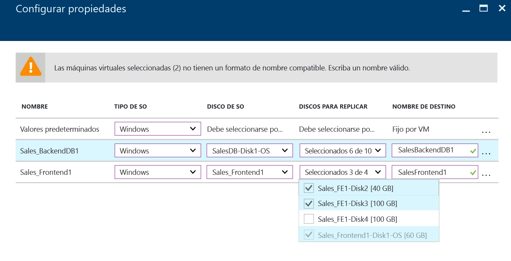
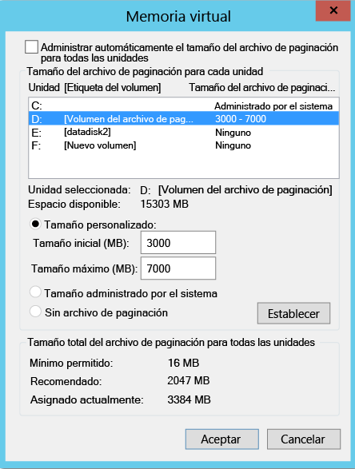
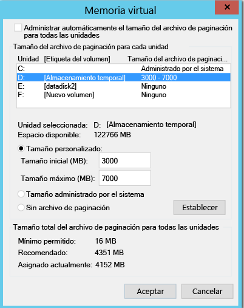
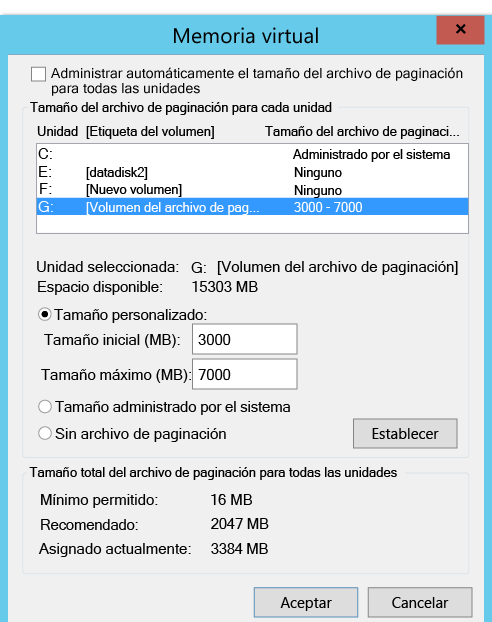
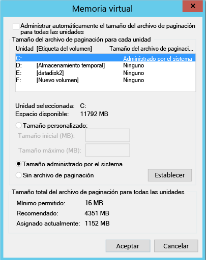

# Excluir discos de la replicación
En este artículo se describe cómo excluir discos de la replicación. Esta exclusión puede optimizar el ancho de banda consumido con la replicación u optimizar los recursos del lado del destino que utilizan estos discos. La característica es compatible con escenarios de VMware a Azure y de Hyper-V a Azure.

## Requisitos previos

De manera predeterminada, se replican todos los discos de una máquina. Si se va a replicar de VMware a Azure, para excluir un disco, la instancia de Mobility Service debe instalarse manualmente en la máquina antes de habilitar la replicación.

## ¿Por qué excluir discos de la replicación?
A menudo es necesario excluir discos de replicación porque:

- Los datos renovados en el disco excluido no son importantes o no es necesario replicarlos.

- No quiere replicar la renovación para ahorrar recursos de almacenamiento y de red.

## ¿Cuáles son los escenarios típicos?
Encontrará ejemplos específicos de datos renovados que son estupendos candidatos para la exclusión. Algunos de ellos podrían ser operaciones de escritura en un archivo de paginación (pagefile.sys) y entradas en el archivo de tempdb de Microsoft SQL Server. Según la carga de trabajo y el subsistema de almacenamiento, el archivo de paginación puede registrar una renovación considerable. Sin embargo, esta réplica de datos del sitio principal a Azure consumiría muchos recursos. Por lo tanto, puede usar los siguientes pasos para optimizar la replicación de una máquina virtual con un único disco virtual que contenga tanto el sistema operativo como el archivo de paginación:

1. Divida el disco virtual único en dos. Uno para el sistema operativo y el otro para el archivo de paginación.
2. Excluya el disco del archivo de paginación de la replicación.

De forma similar, puede usar los siguientes pasos para optimizar un disco que tenga el archivo de la base de datos tempbd de Microsoft SQL Server y el de la base de datos del sistema:

1. Guarde la base de datos del sistema y tempdb en dos discos diferentes.
2. Excluya el disco de tempdb de la replicación.

## ¿Cómo se excluyen discos de la replicación?

### VMware en Azure
Siga el flujo de trabajo de [Habilitación de la replicación](site-recovery-vmware-to-azure.md) para proteger una máquina virtual desde el portal de Azure Site Recovery. En el cuarto paso del flujo de trabajo, use la columna **DISCOS PARA REPLICAR** para excluir los discos de la replicación. De forma predeterminada se seleccionan todos los discos para la replicación. Anule la selección de la casilla del disco que desee excluir y complete los pasos para habilitar la replicación.

>[!NOTE]
>
> * Solo puede excluir discos que tengan instalado Mobility Service. Mobility Service se instala manualmente, ya que la instalación solo se puede hacer con el mecanismo de notificación push una vez habilitada la replicación.
> * Solo se pueden excluir los discos básicos de la replicación. No se pueden excluir los discos dinámicos ni del sistema operativo.
> * Una vez habilitada la replicación, no puede agregar ni quitar discos de la replicación. Si desea agregar o excluir un disco, deberá deshabilitar la protección de la máquina y volver a habilitarla.
> * Si excluye un disco necesario para que una aplicación funcione, después de la conmutación por error a Azure, debe crearlo manualmente en Azure para poder ejecutar la aplicación replicada. También puede integrar Azure Automation en un plan de recuperación para crear el disco durante la conmutación por error de la máquina.
> * Máquina virtual Windows: no se producirá una conmutación por recuperación de los discos creados manualmente en Azure. Por ejemplo, si realiza la conmutación por error de tres discos y crea dos directamente en Azure Virtual Machines, solo los tres discos que se conmutaran por error se conmutarán por recuperación. No puede incluir los discos creados manualmente en la conmutación por recuperación ni volver a protegerlos de un entorno local a Azure.
> * Máquina virtual Linux: se producirá una conmutación por recuperación de los discos creados manualmente en Azure. Por ejemplo, si realiza una conmutación por error de tres discos y crea dos directamente en Azure Virtual Machines, los cinco experimentarán conmutación por recuperación. No se pueden excluir discos creados manualmente de la conmutación por recuperación.
>

### Hyper-V en Azure
Siga el flujo de trabajo de [Habilitación de la replicación](site-recovery-hyper-v-site-to-azure.md) para proteger una máquina virtual desde el portal de Azure Site Recovery. En el cuarto paso del flujo de trabajo, use la columna **DISCOS PARA REPLICAR** para excluir los discos de la replicación. De forma predeterminada se seleccionan todos los discos para la replicación. Anule la selección de la casilla del disco que desee excluir y complete los pasos para habilitar la replicación.

>[!NOTE]
>
> * De la replicación solo se pueden excluir discos básicos. No se pueden excluir los discos del sistema operativo. Se recomienda no excluir discos dinámicos. Azure Site Recovery no puede identificar qué disco duro virtual (VHD) es básico o dinámico en la máquina virtual invitada.  Si no se excluye ningún disco del volumen dinámico dependiente, el disco dinámico protegido aparecerá como erróneo en la máquina virtual de conmutación por error y no se podrá acceder a los datos de ese disco.
> * Una vez habilitada la replicación, no puede agregar ni quitar discos de la replicación. Si desea agregar o excluir un disco, deberá deshabilitar la protección de la máquina virtual y volver a habilitarla.
> * Si excluye un disco necesario para que una aplicación funcione, después de la conmutación por error a Azure, debe crearlo manualmente en Azure para poder ejecutar la aplicación replicada. También puede integrar Azure Automation en un plan de recuperación para crear el disco durante la conmutación por error de la máquina.
> * No se producirá una conmutación por recuperación de los discos creados manualmente en Azure. Por ejemplo, si realiza la conmutación por error de tres discos y crea dos directamente en Azure Virtual Machines, solo los tres discos que se conmutaron por error se conmutarán por recuperación de Azure a Hyper-V. No puede incluir los discos creados manualmente en la conmutación por recuperación ni en la replicación inversa de Hyper-V a Azure.

## Escenarios completos de exclusión de discos
Veamos dos escenarios para comprender la característica de exclusión de discos:

- Disco de la base de datos tempdb de SQL Server
- Disco del archivo de paginación (pagefile.sys)

### Exclusión del disco de la base de datos tempdb de SQL Server
Veamos una máquina virtual de SQL Server con una base de datos tempdb que se puede excluir.

El nombre del disco virtual es SalesDB.

Los discos de la máquina virtual de origen son los siguientes:

**Nombre del disco** | **Sistema operativo invitado** | **Unidad** | **Tipo de datos en el disco**
--- | --- | --- | ---
DB-Disk0-OS | DISK0 | C:\ | Disco del sistema operativo
DB-Disk1| Disk1 | D:\ | Base de datos del sistema SQL y Database1 del usuario
DB-Disk2 (disco excluido de la protección) | Disk2 | E:\ | Archivos temporales
DB-Disk3 (disco excluido de la protección) | Disk3 | F:\ | Base de datos tempdb de SQL (ruta de acceso de carpeta) F:\MSSQL\Data\)    Anote la ruta de acceso de la carpeta antes de la conmutación por error.
DB-Disk4 | Disk4 |G:\ |Database2 del usuario

Dado que la renovación de datos en dos discos de la máquina virtual es temporal, al mismo tiempo que protege la máquina virtual de SalesDB, excluya Disk2 y Disk3 de la replicación. Azure Site Recovery no replicará esos discos. En la conmutación por error, esos discos no estarán presentes en la máquina virtual de conmutación por error de Azure.

Los discos de la máquina virtual de Azure después de la conmutación por error son los siguientes:

**Sistema operativo invitado** | **Unidad** | **Tipo de datos en el disco**
--- | --- | ---
DISK0 | C:\ | Disco del sistema operativo
Disk1 | E:\ | Almacenamiento temporal   Azure agrega este disco y asigna la primera unidad disponible.
Disk2 | D:\ | Base de datos del sistema SQL y Database1 del usuario
Disk3 | G:\ | Database2 del usuario

Puesto que Disk2 y Disk3 se excluyeron de la máquina virtual de SalesDB, E: es la primera unidad disponible de la lista. Azure la asigna al volumen de almacenamiento temporal. Para todos los discos replicados, la unidad permanece igual.

Disk3, que era el disco de la base de datos tempdb de SQL (ruta de acceso de carpeta de tempdb F:\MSSQL\Data\), se ha excluido de la replicación. El disco no está disponible en la máquina virtual de conmutación por error. Como resultado, el servicio SQL está detenido y necesita la ruta de acceso F:\MSSQL\Data.

Hay dos maneras de crear esta ruta de acceso:

- Agregar un disco nuevo y asignar la ruta de acceso de carpeta de tempdb.
- Usar un disco de almacenamiento temporal existente para la ruta de acceso de carpeta de tempdb.

#### Incorporación de un disco nuevo:

1. Anote las rutas de acceso de tempdb.mdf y tempdb.ldf de SQL antes de la conmutación por error.
2. Desde Azure Portal, agregue un disco nuevo a la máquina virtual de conmutación por error con el mismo o mayor tamaño que el del disco de la base de datos tempdb de SQL de origen (Disk3).
3. Inicie sesión en la máquina virtual de Azure. Desde la consola de administración de disco (diskmgmt.msc), inicialice y formatee el disco recién agregado.
4. Asigne la misma unidad del disco de la base de datos tempdb de SQL (F:).
5. Cree la carpeta para tempdb en el volumen F: (F:\MSSQL\Data).
6. Inicie el servicio SQL desde la consola de servicio.

#### Uso de un disco de almacenamiento temporal existente para la ruta de acceso de carpeta de tempdb de SQL:

1. Abra el símbolo del sistema.
2. Ejecute SQL Server en modo de recuperación desde el símbolo del sistema.

        Net start MSSQLSERVER /f / T3608

3. Ejecute el siguiente sqlcmd para cambiar a la nueva ruta de acceso de tempdb.

        sqlcmd -A -S SalesDB        **Use your SQL DBname**
        USE master;     
        GO      
        ALTER DATABASE tempdb       
        MODIFY FILE (NAME = tempdev, FILENAME = 'E:\MSSQL\tempdata\tempdb.mdf');
        GO      
        ALTER DATABASE tempdb       
        MODIFY FILE (NAME = templog, FILENAME = 'E:\MSSQL\tempdata\templog.ldf');       
        GO

4. Detenga el servicio Microsoft SQL Server.

        Net stop MSSQLSERVER
5. Inicie el servicio Microsoft SQL Server.

        Net start MSSQLSERVER

Consulte las siguientes directrices de Azure para el disco de almacenamiento temporal:

* [Using SSDs in Azure VMs to store SQL Server TempDB and Buffer Pool Extensions](https://blogs.technet.microsoft.com/dataplatforminsider/2014/09/25/using-ssds-in-azure-vms-to-store-sql-server-tempdb-and-buffer-pool-extensions/) (Uso de SSD en máquinas virtuales de Azure para almacenar la base de datos TempDB de SQL Server y las extensiones del grupo de búferes)
* [Procedimientos recomendados para SQL Server en Azure Virtual Machines](https://docs.microsoft.com/azure/virtual-machines/windows/sql/virtual-machines-windows-sql-performance)

### Conmutación por recuperación (de Azure a un host local)
Ahora debemos conocer los discos que se replican al realizar la conmutación por error de Azure al host de Hyper-V o VMware locales. Los discos creados manualmente en Azure no se replicarán. Por ejemplo, si realiza la conmutación por error de tres discos y crea dos directamente en Azure Virtual Machines, solo los tres discos que se conmutaran por error se conmutarán por recuperación. No puede incluir los discos creados manualmente en la conmutación por recuperación ni volver a protegerlos de un entorno local a Azure. Tampoco se replicará el disco de almacenamiento temporal en el host local.

#### Conmutación por recuperación en la ubicación original

En el ejemplo anterior, la configuración del disco de la máquina virtual de Azure es la siguiente:

**Sistema operativo invitado** | **Unidad** | **Tipo de datos en el disco**
--- | --- | ---
DISK0 | C:\ | Disco del sistema operativo
Disk1 | E:\ | Almacenamiento temporal   Azure agrega este disco y asigna la primera unidad disponible.
Disk2 | D:\ | Base de datos del sistema SQL y Database1 del usuario
Disk3 | G:\ | Database2 del usuario

#### VMware en Azure
Cuando se realiza la conmutación por recuperación en la ubicación original, la configuración del disco de la máquina virtual de conmutación por recuperación no tiene exclusiones. Los discos que excluyeran de VMware a Azure, no estarán disponibles en la máquina virtual de conmutación por recuperación.

Discos de la máquina virtual de VMWare (ubicación original) después de la conmutación por error planeada de Azure a VMware local:

**Sistema operativo invitado** | **Unidad** | **Tipo de datos en el disco**
--- | --- | ---
DISK0 | C:\ | Disco del sistema operativo
Disk1 | D:\ | Base de datos del sistema SQL y Database1 del usuario
Disk2 | G:\ | Database2 del usuario

#### Hyper-V en Azure
Cuando se realiza la conmutación por recuperación en la ubicación original, la configuración del disco de la máquina virtual de conmutación por recuperación es la misma que la original del disco de la máquina virtual para Hyper-V. Los discos que se excluyeran del sitio de Hyper-V a Azure no estarán disponibles en la máquina virtual de conmutación por recuperación.

Discos de la máquina virtual de Hyper-V (ubicación original) después de la conmutación por error planeada de Azure a Hyper-V local:

**Nombre del disco** | **Sistema operativo invitado** | **Unidad** | **Tipo de datos en el disco**
--- | --- | --- | ---
DB-Disk0-OS | DISK0 |   C:\ | Disco del sistema operativo
DB-Disk1 | Disk1 | D:\ | Base de datos del sistema SQL y Database1 del usuario
DB-Disk2 (disco excluido) | Disk2 | E:\ | Archivos temporales
DB-Disk3 (disco excluido) | Disk3 | F:\ | Base de datos tempdb de SQL (ruta de acceso de carpeta): F:\MSSQL\Data\)
DB-Disk4 | Disk4 | G:\ | Database2 del usuario

#### Exclusión del disco del archivo de paginación (pagefile.sys)

Veamos una máquina virtual con un disco del archivo de paginación que se puede excluir.
Hay dos casos.

#### Caso 1: el archivo de paginación está configurado en la unidad D:
Configuración del disco:

**Nombre del disco** | **Sistema operativo invitado** | **Unidad** | **Tipo de datos en el disco**
--- | --- | --- | ---
DB-Disk0-OS | DISK0 | C:\ | Disco del sistema operativo
DB-Disk1 (disco excluido de la protección) | Disk1 | D:\ | pagefile.sys
DB-Disk2 | Disk2 | E:\ | Datos del usuario 1
DB-Disk3 | Disk3 | F:\ | Datos del usuario 2

Esta es la configuración del archivo de paginación en la máquina virtual de origen:

Después de la conmutación por error de la máquina virtual de VMware o Hyper-V a Azure, los discos de la máquina virtual de Azure son los siguientes:

**Nombre del disco** | **Sistema operativo invitado** | **Unidad** | **Tipo de datos en el disco**
--- | --- | --- | ---
DB-Disk0-OS | DISK0 | C:\ | Disco del sistema operativo
DB-Disk1 | Disk1 | D:\ | Almacenamiento temporal   pagefile.sys
DB-Disk2 | Disk2 | E:\ | Datos del usuario 1
DB-Disk3 | Disk3 | F:\ | Datos del usuario 2

Dado que se ha excluido Disk1 (D:), D: es la primera unidad disponible de la lista. Azure la asigna al volumen de almacenamiento temporal. Dado que D: está disponible en la máquina virtual de Azure, la configuración del archivo de paginación de la máquina virtual sigue siendo el mismo.

Esta es la configuración del archivo de paginación en la máquina virtual de Azure:

#### Caso 2: el archivo de paginación está configurado en otra unidad (que no sea D:)

Esta es la configuración del disco de la máquina virtual de origen:

**Nombre del disco** | **Sistema operativo invitado** | **Unidad** | **Tipo de datos en el disco**
--- | --- | --- | ---
DB-Disk0-OS | DISK0 | C:\ | Disco del sistema operativo
DB-Disk1 (disco excluido de la protección) | Disk1 | G:\ | pagefile.sys
DB-Disk2 | Disk2 | E:\ | Datos del usuario 1
DB-Disk3 | Disk3 | F:\ | Datos del usuario 2

Esta es la configuración del archivo de paginación en la máquina virtual local:

Después de la conmutación por error de la máquina virtual de VMware o Hyper-V a Azure, los discos de la máquina virtual de Azure son los siguientes:

**Nombre del disco**| **Sistema operativo invitado**| **Unidad** | **Tipo de datos en el disco**
--- | --- | --- | ---
DB-Disk0-OS | DISK0  |C:\ |Disco del sistema operativo
DB-Disk1 | Disk1 | D:\ | Almacenamiento temporal   pagefile.sys
DB-Disk2 | Disk2 | E:\ | Datos del usuario 1
DB-Disk3 | Disk3 | F:\ | Datos del usuario 2

Como D: es la primera unidad disponible en la lista, Azure la asigna al volumen de almacenamiento temporal. Para todos los discos replicados, la unidad permanece igual. Dado que el disco de G: no está disponible, el sistema usará la unidad C: para el archivo de paginación.

Esta es la configuración del archivo de paginación en la máquina virtual de Azure:

## Pasos siguientes
Después de que la implementación esté configurada y en ejecución, [obtenga más información](site-recovery-failover.md) sobre los diferentes tipos de conmutación por error.
