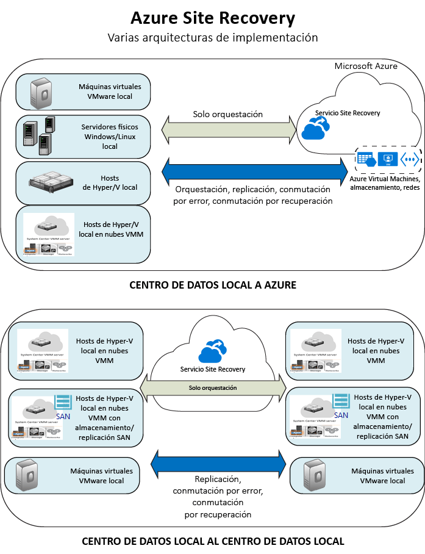

<properties
	pageTitle="¿Qué es Site Recovery? | Microsoft Azure" 
	description="Proporciona información general sobre el servicio de Azure Site Recovery y explica cómo se puede implementar el servicio." 
	services="site-recovery" 
	documentationCenter="" 
	authors="rayne-wiselman" 
	manager="jwhit" 
	editor=""/>

<tags 
	ms.service="site-recovery" 
	ms.devlang="na"
	ms.topic="get-started-article"
	ms.tgt_pltfrm="na"
	ms.workload="storage-backup-recovery" 
	ms.date="09/29/2016" 
	ms.author="raynew"/>

#  ¿Qué es Site Recovery?

¡Bienvenido a Azure Site Recovery! Puede comenzar con este artículo para obtener una descripción general rápida del servicio Site Recovery y cómo puede este contribuir a su estrategia de continuidad del negocio y recuperación ante desastres (BCDR).

## Información general

Las organizaciones necesitan una estrategia de recuperación ante desastres y continuidad empresarial (BCDR) que determine cómo seguirán en funcionamiento y disponibles las aplicaciones, las cargas de trabajo y los datos durante los tiempos de inactividad planeados y no planeados, y cómo recuperar las condiciones de funcionamiento normales lo antes posible. Su estrategia de BCDR se centra en soluciones que mantengan los datos empresariales seguros y recuperables, y garanticen que las cargas de trabajo estarán disponibles continuamente en caso de desastre.

Site Recovery es un servicio de Azure que contribuye a su estrategia de BCDR mediante la coordinación de la replicación de servidores físicos locales y máquinas virtuales en la nube (Azure) o en un centro de datos secundario. Cuando se producen interrupciones en la ubicación principal, se realiza la conmutación por error a la ubicación secundaria para mantener disponibles las aplicaciones y cargas de trabajo. La conmutación por recuperación a la ubicación principal se produce cuando vuelve a su funcionamiento normal. Más información en [¿Qué es Site Recovery?](site-recovery-overview.md)

## Site Recovery en el Portal de Azure

Azure tiene dos [modelos de implementación](../resource-manager-deployment-model.md) diferentes para crear recursos y trabajar con ellos: el modelo de Azure Resource Manager y el modelo clásico de administración de servicios. Azure también tiene dos portales: el [Portal de Azure clásico](https://manage.windowsazure.com/) que admite el modelo de implementación clásico y el [Portal de Azure](https://portal.azure.com) que es compatible con ambos modelos de implementación.

Site Recovery está disponible tanto en el portal clásico como en el Portal de Azure. En el Portal de Azure clásico, Site Recovery se puede usar con el modelo de administración de servicios clásico. En el Portal de Azure, se pueden usar tanto el modelo de implementación clásica como el modelo de Resource Manager. [Más información](site-recovery-overview.md#site-recovery-in-the-azure-portal) acerca de la implementación con el Portal de Azure.

La información de este artículo se aplica tanto a la implementación clásica como a la del Portal de Azure. Las diferencias se indicarán cuando corresponda.

## ¿Por qué usar Site Recovery? 

Esto es lo que Site Recovery puede hacer por su empresa:

- **Simplificar su estrategia de BCDR**: Site Recovery facilita el control de la replicación, la conmutación por error y la recuperación de varias cargas de trabajo y aplicaciones de negocios desde una única ubicación. Site recovery organiza la replicación y la conmutación por error pero no intercepta los datos de su aplicación ni obtiene información alguna sobre ella.
- **Proporcionar replicación flexible**: con Site Recovery puede replicar las cargas de trabajo que se ejecutan en máquinas virtuales de Hyper-V, máquinas virtuales de VMware y servidores físicos con Windows o Linux.
- **Recuperación y conmutación por error sencillas**: Site Recovery proporciona conmutaciones por error de prueba que admiten maniobras de recuperación ante desastres sin que los entornos de producción se vean afectados. También puede ejecutar conmutaciones por error planeadas sin pérdidas de datos para interrupciones previstas o conmutaciones por error con una pérdida de datos mínima (según la frecuencia de replicación) ante desastres inesperados. Después de la conmutación por error puede ejecutar una conmutación por recuperación a los sitios principales. Site Recovery proporciona planes de recuperación que pueden incluir scripts y libros de Automatización de Azure para que pueda personalizar la conmutación por error y la recuperación de aplicaciones de varios niveles.
- **Eliminar centros de datos secundarios**: puede replicar en un sitio local secundario o en Azure. Si usa Azure como destino para la recuperación ante desastres, eliminará el costo y la complejidad de mantener un sitio secundario, y los datos replicados se almacenarán en Almacenamiento de Azure, con todas la resistencia que esto proporciona.
- **Integrarse con tecnologías de BCDR existentes**: Site Recovery se asocia con las características de BCDR de otras aplicaciones. Por ejemplo, puede utilizar Site Recovery para proteger el back-end de SQL Server de cargas de trabajo corporativas, incluida la compatibilidad nativa para SQL Server AlwaysOn, a fin de administrar la conmutación por error de grupos de disponibilidad.

## ¿Qué puedo replicar?

Este es un resumen de lo que puede replicar con Site Recovery.

**REPLICATE** | **REPLICACIÓN DESDE (LOCAL)** | **REPLICACIÓN EN** | **ARTÍCULO**
---|---|---|---
Máquinas virtuales de VMware | Servidor de VMware | Las tablas de Azure | [Más información](site-recovery-vmware-to-azure-classic.md)
Máquinas virtuales de VMware | Servidor de VMware | Sitio secundario de VMware | [Más información](site-recovery-vmware-to-vmware.md) 
Máquinas virtuales de Hyper-V | Host de Hyper-V en la nube VMM | Las tablas de Azure | [Más información](site-recovery-vmm-to-azure.md) 
Máquinas virtuales de Hyper-V | Host de Hyper-V en la nube VMM | Sitio secundario de VMM | [Más información](site-recovery-vmm-to-vmm.md)
Máquinas virtuales de Hyper-V | Host de Hyper-V en la nube VMM con almacenamiento SAN| Sitio secundario de VMM con almacenamiento SAN | [Más información](site-recovery-vmm-san.md)
Máquinas virtuales de Hyper-V | Host de Hyper-V (no VMM) | Las tablas de Azure | [Más información](site-recovery-hyper-v-site-to-azure.md)
Servidores físicos de Windows/Linux | Servidor físico | Las tablas de Azure | [Más información](site-recovery-vmware-to-azure-classic.md)
Cargas de trabajo que se ejecutan en servidores físicos de Windows o Linux | Servidor físico | Centro de datos secundario | [Más información](site-recovery-vmware-to-vmware.md) 

## ¿Qué cargas de trabajo puedo proteger?

Site Recovery puede ayudarle con la estrategia de BCDR en función de la aplicación para que las cargas de trabajo y aplicaciones sigan ejecutándose de forma coherente cuando se producen interrupciones. Site Recovery proporciona:

- **Instantáneas coherentes con la aplicación**: replicación mediante instantáneas coherentes con la aplicación para aplicaciones únicas o de n niveles.
- **Replicación casi sincrónica**: frecuencia de replicación de tan solo 30 segundos para Hyper-V y replicación continua para VMware.
- **Integración con SQL Server AlwaysOn**: puede administrar la conmutación por error de grupos de disponibilidad en los planes de recuperación de Site Recovery.
- **Planes de recuperación flexibles**: puede crear y personalizar planes de recuperación con scripts externos, acciones manuales y Runbooks de Automatización de Azure que permiten recuperar toda la pila de aplicaciones con un solo clic.
- **Biblioteca de automatización**: una rica biblioteca de Automatización de Azure que proporciona scripts específicos de la aplicación y preparados para la producción que pueden descargarse e integrarse con Site Recovery.
- **Administración de red simple**: la administración de red avanzada en Site Recovery y Azure simplifica los requisitos de red para una aplicación, incluida la reserva de direcciones IP, la configuración de equilibradores de carga o la integración del Administrador de tráfico de Azure para conmutaciones de red eficientes.

## Pasos siguientes

- Más información en [¿Qué cargas de trabajo se pueden proteger con Azure Site Recovery?](site-recovery-workload.md)
- Más información acerca de la arquitectura de Site Recovery en [¿Cómo funciona Azure Site Recovery?](site-recovery-components.md)
 

<!---HONumber=AcomDC_1005_2016-->