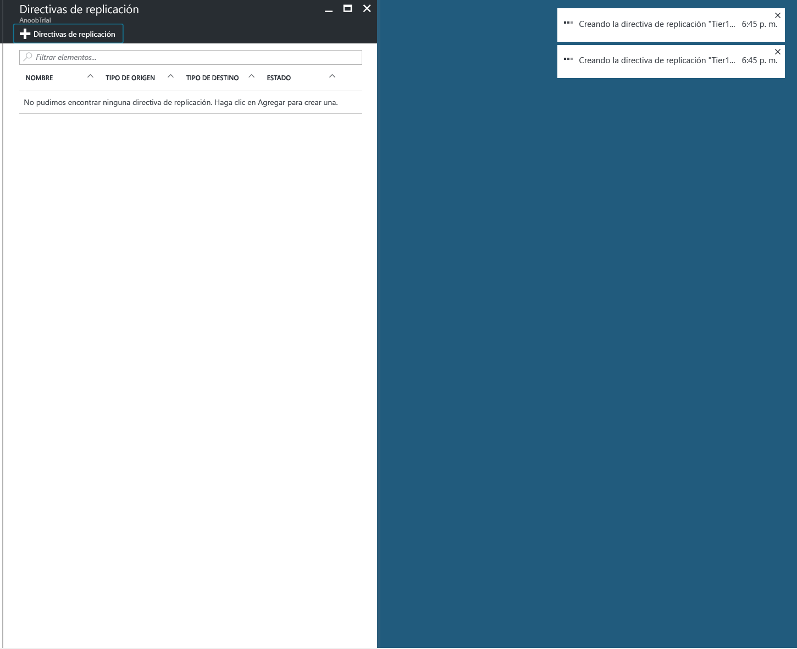
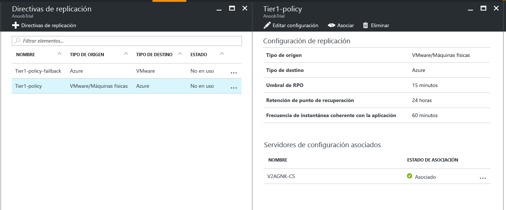
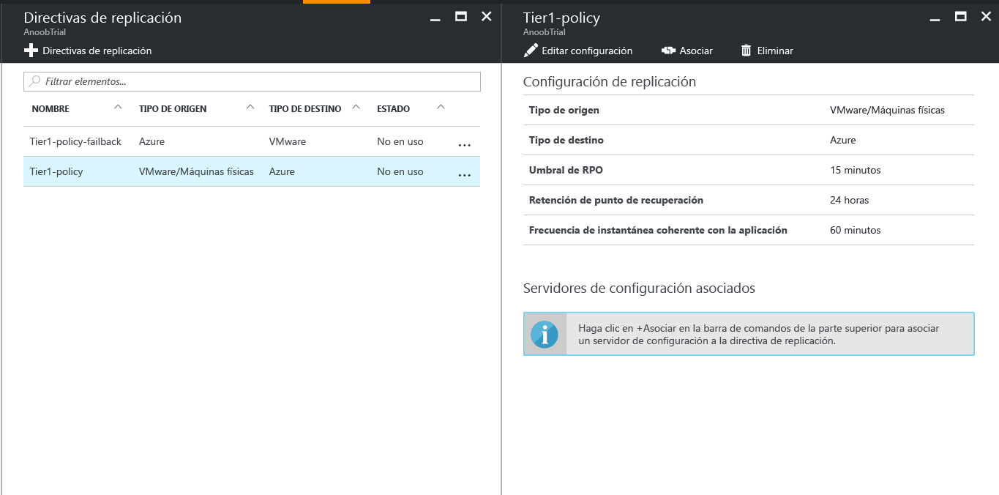
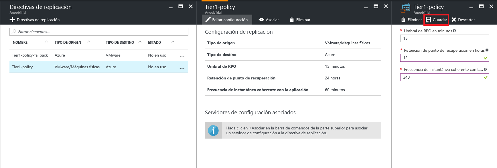

# Administración de una directiva de replicación de VMware en Azure

## Creación de una directiva de replicación

1. Seleccione **Administrar** > **Infraestructura de Site Recovery**.
2. Seleccione **Directivas de replicación** en **Para VMware y máquinas físicas**.
3. Seleccione **+Directiva de replicación**.

    

4. Escriba el nombre de la directiva.

5. En **Umbral de RPO**, especifique el límite de RPO. Se generarán alertas cuando la replicación continua supera este límite.
6. En **Retención de punto de recuperación**, especifique (en horas) la duración del período de retención para cada punto de recuperación. Las máquinas protegidas se pueden recuperar en cualquier punto dentro de un período de retención.

    > [!NOTE]
    > Se admite una retención de hasta 24 horas para máquinas replicadas en Premium Storage. Se admite una retención de hasta 72 horas para máquinas replicadas en almacenamiento estándar.

    > [!NOTE]
    > Se crea automáticamente una directiva de replicación para la conmutación por recuperación.

7. En **Frecuencia de instantánea coherente con la aplicación**especifique la frecuencia (en minutos) con la que se crearán puntos de recuperación que contengan las instantáneas coherentes con la aplicación.

8. Haga clic en **Aceptar**. La directiva debe demorar entre 30 y 60 segundos en crearse.

## Asociación de un servidor de configuración con una directiva de replicación
1. Elija la directiva de replicación a la que desea asociar el servidor de configuración.
2. Haga clic en **Asociar**.

3. Seleccione el servidor de configuración en la lista de servidores.
4. Haga clic en **Aceptar**. El servidor de configuración debería demorar entre uno y dos minutos en asociarse.

## Edición de una directiva de replicación
1. Elija la directiva de replicación cuya configuración desee editar.

2. Haga clic en **Edit Settings**(Editar configuración).

3. Cambie la configuración para ajustarla a sus necesidades.
4. Haga clic en **Guardar**. La directiva debería demorar entre dos y cinco minutos en guardarse, en función del número de máquinas virtuales que la usen.

## Desasociación de un servidor de configuración de una directiva de replicación
1. Elija la directiva de replicación a la que desea asociar el servidor de configuración.
2. Haga clic en **Desasociar**.
3. Seleccione el servidor de configuración en la lista de servidores.
4. Haga clic en **Aceptar**. El servidor de configuración debería demorar entre uno y dos minutos en desasociarse.

    > [!NOTE]
    > Un servidor de configuración no se puede desasociar si hay al menos un elemento replicado que use la directiva. Asegúrese de que no hay elementos replicados que usen la directiva antes de desasociar el servidor de configuración.

## Eliminación de una directiva de replicación

1. Elija la directiva de replicación que desea eliminar.
2. Hacer clic en **Eliminar**. La directiva debería demorar entre 30 y 60 segundos en eliminarse.

    > [!NOTE]
    > Una directiva de replicación no se puede eliminar si tiene al menos un servidor de configuración asociado. Asegúrese de que no hay elementos replicados que usen la directiva y elimine todos los servidores de configuración asociados antes de eliminar la directiva.
