# Replicación de máquinas virtuales de Hyper-V que están en nubes VMM en Azure mediante Site Recovery en Azure Portal
> [!div class="op_single_selector"]
> * [Portal de Azure](site-recovery-vmm-to-azure.md)
> * [Azure clásico](site-recovery-vmm-to-azure-classic.md)
> * [PowerShell Resource Manager](site-recovery-vmm-to-azure-powershell-resource-manager.md)
> * [PowerShell clásico](site-recovery-deploy-with-powershell.md)

Este artículo describe cómo replicar máquinas virtuales locales de Hyper-V, administradas en nubes de System Center VMM, en Azure mediante el servicio [Azure Site Recovery](site-recovery-overview.md) en Azure Portal.

Publique cualquier comentario que tenga en la parte inferior de este artículo, o bien en el [foro de Azure Recovery Services](https://social.msdn.microsoft.com/forums/azure/home?forum=hypervrecovmgr).

## Pasos de implementación

1. [Obtenga más información](site-recovery-components.md#hyper-v-to-azure) sobre la arquitectura de esta implementación. Además, [conozca](site-recovery-hyper-v-azure-architecture.md) cómo funciona la replicación de Hyper-V en Site Recovery.
2. Compruebe los requisitos previos y las limitaciones.
3. Configure las cuentas de red y almacenamiento de Azure.
4. Prepare el servidor VMM local y los hosts de Hyper-V.
5. Cree un almacén de Recovery Services. El almacén contiene valores de configuración y organiza la replicación.
6. Especifique la configuración de origen. Registre los servidores VMM en el almacén. Instale el proveedor de Azure Site Recovery en el servidor VMM y el agente de Recovery Services en los hosts de Hyper-V.
7. Especifique la configuración de destino y replicación.
8. Habilite la replicación para las máquinas virtuales.
9. Ejecute una conmutación por error de prueba para asegurarse de que todo funcione de la forma esperada.

## Requisitos previos

**Requisito de compatibilidad** | **Detalles**
--- | ---
**Las tablas de Azure** | Obtén información sobre los [requisitos de Azure](site-recovery-prereq.md#azure-requirements)
**Servidores locales** | [Obtenga más información](site-recovery-prereq.md#disaster-recovery-of-hyper-v-virtual-machines-in-virtual-machine-manager-clouds-to-azure) sobre los requisitos del servidor VMM local y los hosts de Hyper-V.
**Máquinas virtuales de Hyper-V locales** | Las máquinas virtuales que desee replicar deben ejecutar un [sistema operativo compatible](site-recovery-support-matrix-to-azure.md#support-for-replicated-machine-os-versions) y cumplir los [requisitos previos de Azure](site-recovery-support-matrix-to-azure.md#failed-over-azure-vm-requirements).
**Direcciones URL de Azure** | El servidor VMM también necesita acceder a estas direcciones URL:   [!INCLUDE [site-recovery-URLS](../../includes/site-recovery-URLS.md)]   Si tiene reglas de firewall basadas en direcciones IP, asegúrese de que permitan la comunicación con Azure.   Permita los [intervalos IP del centro de datos de Azure](https://www.microsoft.com/download/confirmation.aspx?id=41653) y el puerto HTTPS (443).   Permita los intervalos de direcciones IP correspondientes a la región de Azure de su suscripción y del oeste de EE. UU. (se usan para Access Control y para Identity Management).

## Preparación de la implementación
Para preparar la implementación debe:

1. [Configurar una red de Azure](#set-up-an-azure-network) en la que se coloquen las máquinas virtuales de Azure después de la conmutación por error.
2. [Configurar una cuenta de almacenamiento de Azure](#set-up-an-azure-storage-account) para datos replicados.
3. [Preparar el servidor VMM](#prepare-the-vmm-server) para la implementación de Site Recovery.
4. Preparar la asignación de red. Configurar redes para que pueda configurar la asignación de red durante la implementación de Site Recovery.

### Configurar una red de Azure
Se necesita una red de Azure para que las máquinas virtuales de Azure creadas después de la conmutación por error se conecten.

* La red debe estar en la misma región que el almacén de Recovery Services.
* Según el modelo de recursos que desee usar para las máquinas virtuales de Azure conmutadas por error, va a configurar la red de Azure en [modo Resource Manager](../virtual-network/virtual-networks-create-vnet-arm-pportal.md) o en [modo clásico](../virtual-network/virtual-networks-create-vnet-classic-pportal.md).
* Es recomendable configurar una red antes de empezar. Si no lo hace, deberá hacerlo durante la implementación de Site Recovery.
Las redes de Azure usadas en Site Recovery no se pueden [mover](../azure-resource-manager/resource-group-move-resources.md) dentro de la misma suscripción o entre suscripciones diferentes.

### Configurar una cuenta de almacenamiento de Azure
* Necesita una cuenta de almacenamiento estándar para almacenar los datos replicados en Azure. La cuenta debe estar en la misma región que el almacén de Servicios de recuperación.
* Según el modelo de recursos que desee usar para las máquinas virtuales de Azure conmutadas por error, va a configurar una cuenta en [modo Resource Manager](../storage/storage-create-storage-account.md) o en [modo clásico](../storage/storage-create-storage-account-classic-portal.md).
* Es recomendable configurar una cuenta antes de empezar. Si no lo hace, deberá hacerlo durante la implementación de Site Recovery.
- Tenga en cuenta que las cuentas de almacenamiento usadas en Site Recovery no se pueden [mover](../azure-resource-manager/resource-group-move-resources.md) dentro de la misma suscripción o entre suscripciones diferentes.

### Preparar el servidor VMM
* Asegúrese de que el servidor VMM cumpla con los [requisitos previos](#on-premises-prerequisites).
* Durante la implementación de Site Recovery puede especificar que todas las nubes de un servidor VMM deben estar disponibles en el Portal de Azure. Si solo desea que aparezcan nubes concretas en el portal, puede habilitar este valor en la nube en la consola de administrador de VMM.

### Preparar la asignación de red
Debe configurar la asignación de red durante la implementación de Site Recovery. La asignación de red se produce entre redes de máquinas virtuales de VMM de origen y redes de Azure de destino para permitir lo siguiente:

* Las máquinas que se conmuten por error en la misma red pueden conectarse entre sí, aunque no estén conmutadas de la misma manera o en el mismo plan de recuperación.
* Si se configura una puerta de enlace de red en la red Azure de destino, las máquinas virtuales se podrán conectar a máquinas virtuales locales.
* Para configurar una asignación de red, esto es lo que necesita:

  * Asegúrese de que las máquinas virtuales del servidor host de Hyper-V de origen estén conectadas a una red de máquinas virtuales de VMM. Esa red debe estar vinculada a una red lógica asociada con la nube.
  * Una red de Azure como la descrita [anteriormente](#set-up-an-azure-network)

## Creación de un almacén de Servicios de recuperación
1. Inicie sesión en el [Portal de Azure](https://portal.azure.com).
2. Haga clic en **Nuevo** > **Administración** > **Recovery Services**. También puede hacer clic en **Examinar** > **Almacenes de Recovery Services**> **Agregar**.

    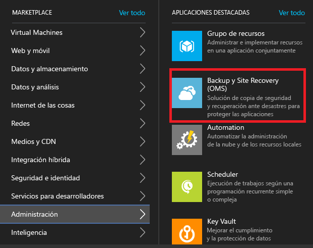
3. En **Nombre**, especifique un nombre descriptivo para identificar el almacén. Si tiene más de una suscripción, seleccione una de ellas.
4. [Cree un grupo de recursos](../azure-resource-manager/resource-group-template-deploy-portal.md)o seleccione uno existente. Especifique una región de Azure. Las máquinas se replicarán en esta región. Para comprobar las regiones admitidas, consulte Disponibilidad geográfica en [Detalles de precios de Azure Site Recovery](https://azure.microsoft.com/pricing/details/site-recovery/)
5. Si quiere acceder rápidamente al almacén desde el panel, haga clic en **Anclar al panel** > **Crear almacén**.

    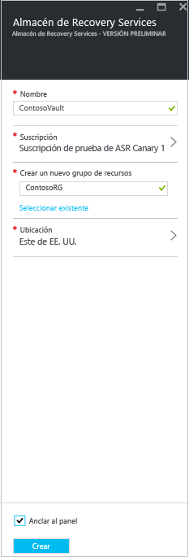

El nuevo almacén aparecerá en **Panel** > **Todos los recursos** y en la hoja principal de **Almacenes de servicios de recuperación**.

## Primeros pasos

Site Recovery proporciona una experiencia introductoria que le ayuda a realizar la implementación lo más rápido posible. Esta introducción comprueba los requisitos previos y le guía a través de los pasos de implementación de Site Recovery en el orden correcto.

Va a seleccionar el tipo de máquinas que desea replicar y la ubicación donde desea replicarlas. Puede configurar servidores locales, cuentas de almacenamiento de Azure y redes. Es posible crear directivas de replicación y planear la capacidad. Si ya cuenta con la infraestructura, habilite la replicación para máquinas virtuales. Puede ejecutar conmutaciones por error para máquinas específicas o crear planes de recuperación para conmutar por error varias máquinas.

Comience la experiencia de introducción decidiendo cómo desea implementar Site Recovery. El flujo descrito en esta introducción cambia ligeramente en función de los requisitos de replicación.

## Paso 1: Seleccione los objetivos de protección
Seleccione aquello que desea replicar y la ubicación en donde se va a realizar la replicación.

1. En la hoja **Almacenes de Recovery Services**, seleccione el almacén.
2. En **Introducción**, haga clic en **Site Recovery** > **Paso 1: Preparar la infraestructura** > **Objetivo de protección**.

    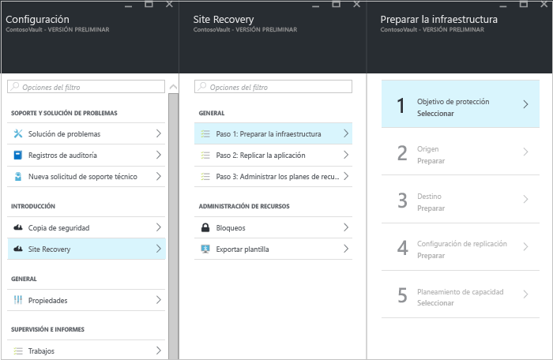
3. En **Objetivo de protección** seleccione **En Azure**, y seleccione **Sí, con Hyper-V**. Seleccione **Sí** para confirmar que usa VMM para administrar los hosts de Hyper-V y el sitio de recuperación. y, a continuación, haga clic en **Aceptar**.

## Paso 2: Configuración del entorno de origen
Instale el Proveedor de Azure Site Recovery en el servidor VMM y registre el servidor en el almacén. Instale el agente de los Servicios de recuperación de Azure en servidores host de Hyper-V.

1. Haga clic en **Paso 2: Preparar la infraestructura** > **Origen**.

    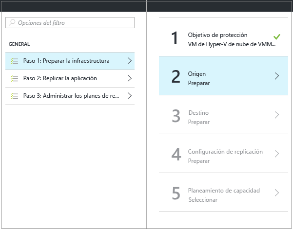

2. En **Preparar origen**, haga clic en **+ VMM** para agregar un servidor VMM.

    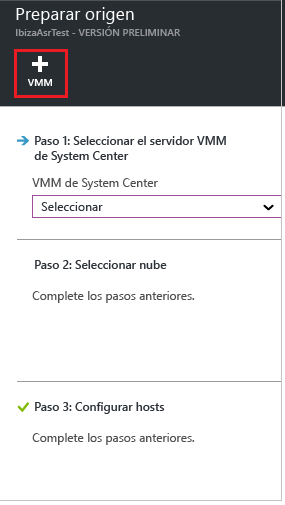

3. En la hoja **Agregar servidor**, compruebe que aparece el **servidor de System Center VMM** en **Tipo de servidor** y que este cumple los [requisitos previos y los requisitos de direcciones URL](#on-premises-prerequisites).
4. Descargue el archivo de instalación del proveedor de Azure Site Recovery.
5. Descargue la clave de registro. Se le solicitará cuando ejecute el programa de instalación. La clave será válida durante cinco días a partir del momento en que se genera.

    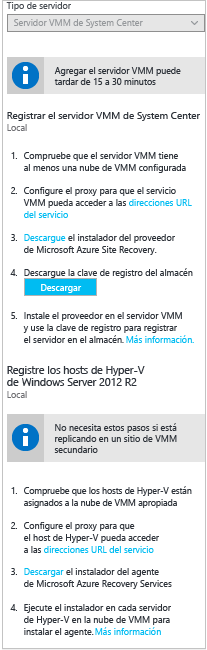

6. Instale el proveedor de Azure Site Recovery en el servidor VMM.

### Instalación del proveedor de Azure Site Recovery
1. Ejecute el archivo de configuración del proveedor.
2. En **Microsoft Update** puede optar por recibir actualizaciones para que las actualizaciones del proveedor se realicen según las directivas de Microsoft Update.
3. En **Instalación** acepte o modifique la ubicación predeterminada de instalación del proveedor y haga clic en **Instalar**.

    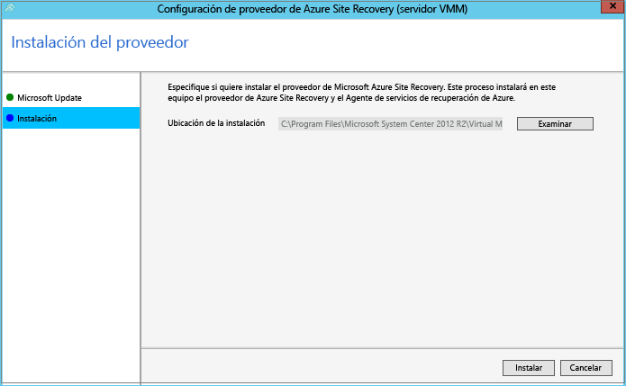
4. Una vez finalizada la instalación, haga clic en **Registrar** para registrar el servidor VMM en el almacén.
5. En la página **Configuración de almacén**, haga clic en **Examinar** para seleccionar el archivo de clave del almacén. Especifique la suscripción de Azure Site Recovery y el nombre del almacén.

    
6. En **Conexión a Internet**, especifique cómo se conecta a Site Recovery el proveedor que se ejecuta en el servidor VMM mediante Internet.

   * Si quiere que el proveedor se conecte directamente, seleccione **Conectar directamente con Azure Site Recovery sin un servidor proxy**.
   * Si el proxy existente requiere autenticación, o si quiere utilizar un proxy personalizado, seleccione **Conectar con Azure Site Recovery con un servidor proxy**.
   * Si utiliza un proxy personalizado, especifique la dirección, el puerto y las credenciales.
   * Si utiliza un servidor proxy, se deberían haber permitido ya las direcciones URL descritas en los [requisitos previos](#on-premises-prerequisites).
   * Si utiliza un proxy personalizado, se creará una cuenta de ejecución de VMM (DRAProxyAccount) mediante el uso automático de las credenciales de proxy especificadas. Configure el servidor proxy para que esta cuenta pueda autenticarse correctamente. La configuración de la cuenta de ejecución de VMM puede modificarse en la consola VMM. En **Configuración**, expanda **Seguridad** > **Cuentas de ejecución** y, luego, modifique la contraseña de DRAProxyAccount. Deberá reiniciar el servicio VMM para que esta configuración surta efecto.

     
7. Puede especificar o modificar la ubicación de un certificado SSL que se genera automáticamente para el cifrado de datos. Este certificado se usa si habilita el cifrado de datos para una nube protegida por Azure en el portal de Azure Site Recovery. Mantenga el certificado en un lugar seguro. Cuando ejecute una conmutación por error en Azure lo necesitará para descifrar si está habilitado el cifrado de datos.
8. En **Nombre del servidor**, especifique un nombre descriptivo para identificar el servidor VMM en el almacén. En una configuración de clúster, especifique el nombre del rol de clúster VMM.
9. Habilite la **sincronización de metadatos de la nube** si quiere sincronizar los metadatos de todas las nubes del servidor VMM con el almacén. Esta acción solo se debe ejecutar una vez en cada servidor. Si no desea sincronizar todas las nubes, puede dejar este parámetro sin marcar y sincronizar cada nube individualmente en las propiedades de la nube de la consola de VMM. Haga clic en **Register** para finalizar el proceso.

    
10. Con ello, se iniciará el registro. Después de finalizar el registro, el servidor aparece en **Infraestructura de Site Recovery** > **Servidores VMM**.

#### Instalación mediante la línea de comandos del proveedor de Azure Site Recovery
El proveedor de Azure Site Recovery puede instalarse desde la línea de comandos. Este método se puede usar para instalar el proveedor en un Server Core para Windows Server 2012 R2.

1. Descargue el archivo de instalación del proveedor y la clave de registro en una carpeta. Por ejemplo, C:\ASR.
2. Desde un símbolo del sistema con privilegios elevados, ejecute estos comandos para extraer el instalador del proveedor.

            C:\Windows\System32> CD C:\ASR
            C:\ASR> AzureSiteRecoveryProvider.exe /x:. /q
3. Ejecute este comando para instalar los componentes:

            C:\ASR> setupdr.exe /i
4. Ejecute estos comandos para registrar el servidor en el almacén:

        CD C:\Program Files\Microsoft System Center 2012 R2\Virtual Machine Manager\bin
        C:\Program Files\Microsoft System Center 2012 R2\Virtual Machine Manager\bin\> DRConfigurator.exe /r  /Friendlyname <friendly name of the server> /Credentials <path of the credentials file> /EncryptionEnabled <full file name to save the encryption certificate>       

Donde:

* **/Credentials**: parámetro obligatorio que especifica la ubicación donde se encuentra el archivo de clave de registro.  
* **/FriendlyName**: parámetro obligatorio para el nombre del servidor host Hyper-V que aparece en el portal de Azure Site Recovery.
* * **/EncryptionEnabled**: parámetro opcional que solo se usa cuando se están replicando máquinas virtuales de Hyper-V en nubes de VMM en Azure. Especifique si desea cifrar máquinas virtuales en Azure (en cifrado en reposo). Asegúrese de que el nombre del archivo tiene la extensión **.pfx** . El cifrado está desactivado de forma predeterminada.
* **/proxyAddress**: parámetro opcional que especifica la dirección del servidor proxy.
* **/proxyport**: parámetro opcional que especifica el puerto del servidor proxy.
* **/proxyUsername**: parámetro opcional que especifica el nombre de usuario de proxy (si el proxy requiere autenticación).
* **/proxyPassword**: parámetro opcional que especifica la contraseña para autenticarse con el servidor proxy (si el proxy requiere autenticación).

### Instale el agente de los Servicios de recuperación de Azure en servidores host de Hyper-V
1. Después de configurar el proveedor, debe descargar el archivo de instalación del agente de Servicios de recuperación de Azure. Ejecute el programa de instalación en cada servidor de Hyper-V en la nube de VMM.

    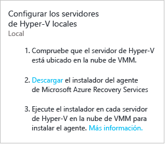
2. En **Comprobación de requisitos previos**, haga clic en **Siguiente**. Todos los requisitos previos que falten se instalarán automáticamente.

    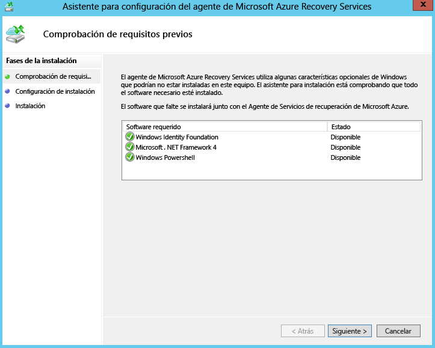
3. En **Configuración de la instalación**, acepte o modifique la ubicación de instalación y la ubicación de la memoria caché. Puede configurar la memoria caché en una unidad que tenga al menos 5 GB de almacenamiento disponible, pero se recomienda usar una unidad de caché con 600 GB o más de espacio libre. Luego haga clic en **Instalar**.
4. Una vez completada la instalación, haga clic en **Cerrar** para terminar.

    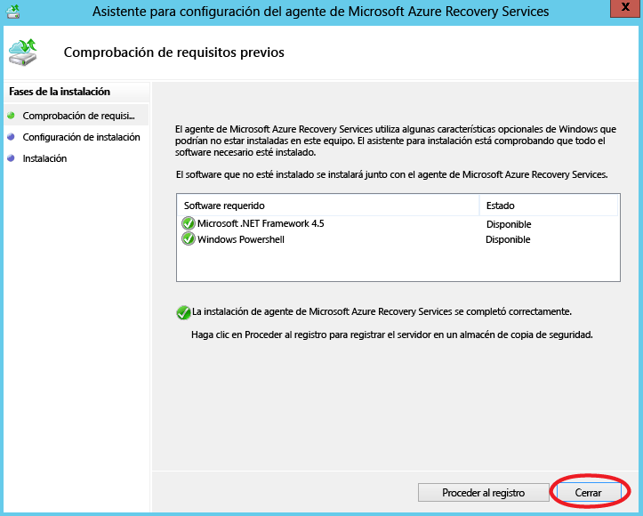

#### Instalación mediante la línea de comandos del agente de Servicios de Azure Site Recovery
Puede instalar el agente de Servicios de recuperación de Microsoft Azure desde la línea de comandos mediante el comando siguiente:

     marsagentinstaller.exe /q /nu

#### Configuración del acceso de proxy a Internet para Site Recovery desde hosts de Hyper-V
El agente de Servicios de recuperación que se ejecuta en los hosts de Hyper-V necesita acceso a Internet para conectarse a Azure para la replicación de máquina virtual. Si va a acceder a Internet a través de un proxy, configúrelo como sigue:

1. Abra el complemento Copia de seguridad de Microsoft Azure en el host de Hyper-V. De manera predeterminada, hay disponible un acceso directo para Microsoft Azure Backup en el escritorio o en la siguiente ruta de acceso: C:\Program Files\Microsoft Azure Recovery Services Agent\bin\wabadmin.
2. En el complemento, haga clic en **Cambiar propiedades**.
3. En la pestaña **Configuración de proxy** especifique la información del servidor proxy.

    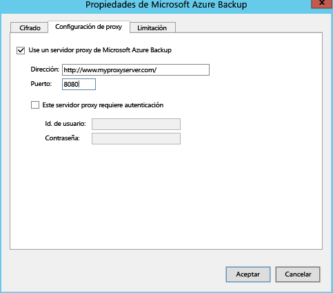
4. Compruebe que el agente puede llegar a las direcciones URL descritas en los [requisitos previos](#on-premises-prerequisites).

## Paso 3: Configuración del entorno de destino
Especifique la cuenta de almacenamiento de Azure que se utilizará para la replicación y la red de Azure a la que se conectarán las máquinas virtuales de Azure después de la conmutación por error.

1. Haga clic en **Preparar infraestructura** > **Destino** y seleccione la suscripción y el grupo de recursos donde desee crear las máquinas virtuales conmutadas por error. Elija el modelo de implementación que desee usar en Azure (clásico o de Resource Manager) para las máquinas virtuales conmutadas por error.

    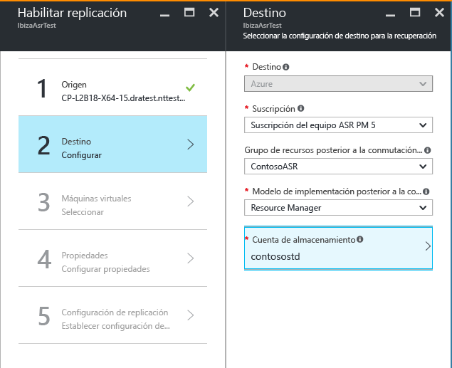

2. Site Recovery comprueba que tiene una o más cuentas de almacenamiento y redes compatibles.
      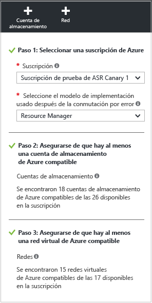

4. Si no ha creado una cuenta de almacenamiento y desea crear una con Resource Manager, haga clic en **+Cuenta de almacenamiento** para hacerlo directamente.  En la hoja **Crear cuenta de almacenamiento** , especifique el nombre, el tipo, la suscripción y la ubicación de la cuenta. La cuenta debe estar en la misma ubicación que el almacén de Servicios de recuperación.

   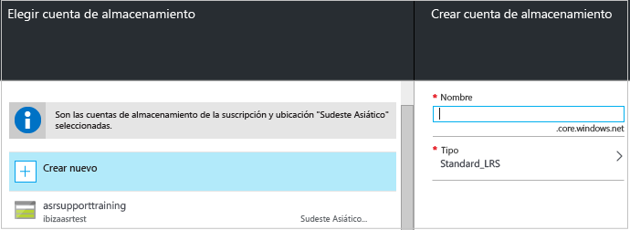

   Observe lo siguiente:

   * Si desea crear una cuenta de almacenamiento mediante el modelo clásico, lo hará en Azure Portal. [Más información](../storage/storage-create-storage-account-classic-portal.md)
   * Si utiliza una cuenta de almacenamiento premium para los datos replicados, configure una cuenta de almacenamiento estándar adicional para los registros de replicación del almacén que capturan los cambios continuos de los datos locales.
5. Si no ha creado una red de Azure y desea crear una con Resource Manager, haga clic en **+Red** para hacerlo directamente. En la hoja **Crear red virtual** , especifique el nombre, el intervalo de direcciones, los detalles de subred, la suscripción y la ubicación de la red. La red debe estar en la misma ubicación que el almacén de Servicios de recuperación.

   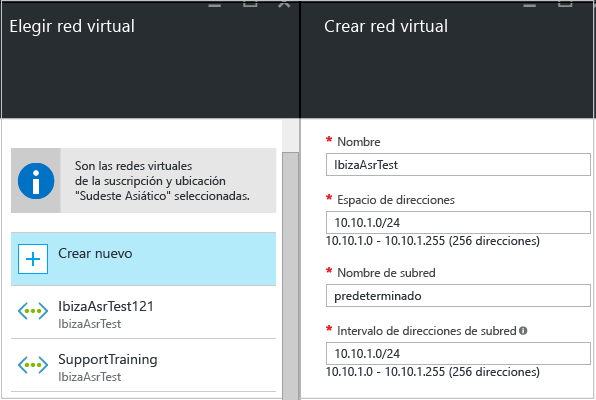

   Si desea crear una red mediante el modelo clásico, lo hará en Azure Portal. [Más información](../virtual-network/virtual-networks-create-vnet-classic-pportal.md).

### Configurar asignación de red

* [Lea](#prepare-for-network-mapping) una rápida introducción de lo que puede hacer la asignación de redes.
* Compruebe que las máquinas virtuales del servidor VMM están conectadas a una red de máquinas virtuales y que ha creado al menos una red virtual de Azure. Se pueden asignar varias redes de VM a una sola red de Azure.

Configure la asignación como sigue:

1. En **Infraestructura de Site Recovery** > **Asignaciones de red** > **Asignación de red**, haga clic en el icono de **+Asignación de red**.

    
2. En **Agregar asignación de red**, seleccione el servidor VMM de origen y **Azure** como destino.
3. Compruebe la suscripción y el modelo de implementación después de la conmutación por error.
4. En **Red de origen**, seleccione la red de máquinas virtuales de origen local que desea asignar en la lista asociada con el servidor VMM.
5. En **Red de destino**seleccione la red de Azure en la que se ubicarán las máquinas virtuales de Azure replicadas cuando estas se creen. y, a continuación, haga clic en **Aceptar**.

    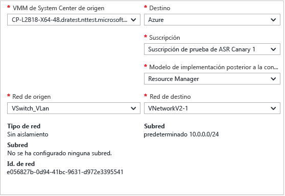

Esto es lo que sucede cuando comienza la asignación de red:

* Las máquinas virtuales existentes en la red de máquinas virtuales de origen se conectan a la red de destino cuando comienza la asignación. Las nuevas máquinas virtuales conectadas a la red de VM de origen se conectarán a la red de Azure asignada cuando se produzca la replicación.
* Si modifica una asignación de red existente, las máquinas virtuales de réplica se conectarán con la nueva configuración.
* Si la red de destino tiene varias subredes y una de estas subredes tiene el mismo nombre que la subred en la que se encuentra la máquina virtual de origen, la máquina virtual de réplica se conectará a esa subred de destino después de la conmutación por error.
* Si no hay ninguna subred de destino con un nombre coincidente, la máquina virtual se conectará a la primera subred de la red.

## Paso 4: Configuración de las opciones de replicación
1. Para crear una nueva directiva de replicación, haga clic en **Preparar infraestructura** > **Configuración de la replicación** > **+Crear y asociar**.

    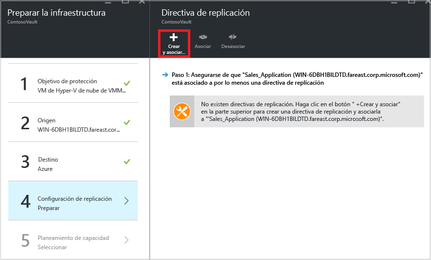
2. En **Crear y asociar directiva**, especifique un nombre de directiva.
3. En **Frecuencia de copia**, especifique la frecuencia con la que desea replicar diferencias de datos después de la replicación inicial (cada 30 segundos, 5 o 15 minutos).
4. En **Retención de punto de recuperación**, especifique, en horas, el tiempo que estará disponible el período de retención para cada punto de recuperación. Los equipos protegidos se pueden recuperar en cualquier punto dentro de un período.
5. En **Frecuencia de instantánea coherente con la aplicación**especifique la frecuencia (entre 1 y 12 horas) con la que se crearán los puntos de recuperación que contengan las instantáneas coherentes con la aplicación. Hyper-V usa dos tipos de instantáneas, una instantánea estándar que proporciona una instantánea incremental de toda la máquina virtual y una instantánea coherente con la aplicación que toma una instantánea en un momento concreto de los datos de la aplicación dentro de la máquina virtual. Las instantáneas coherentes con la aplicación utilizan el Servicio de instantáneas de volumen (VSS) para asegurarse de que las aplicaciones se encuentren en un estado coherente cuando se captura la instantánea. Tenga en cuenta que si habilita las instantáneas coherentes con la aplicación, se verá afectado el rendimiento de aplicaciones que se ejecutan en las máquinas virtuales de origen. Asegúrese de que el valor establecido es menor que el número de puntos de recuperación adicionales configurados.
6. En **Hora de inicio de la replicación inicial**, indique cuándo debe comenzar la replicación inicial. La replicación se produce utilizando el ancho de banda de Internet, así que puede que deba programarla fuera del horario de trabajo.
7. En **Cifrar datos almacenados en Azure**especifique si desea cifrar los datos en reposo en Almacenamiento de Azure. y, a continuación, haga clic en **Aceptar**.

    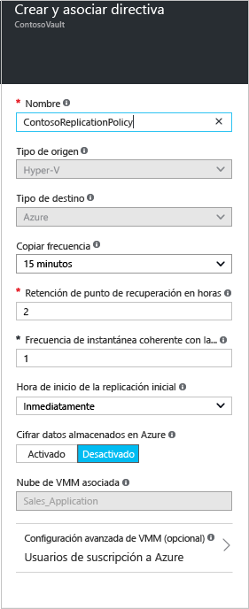
8. Cuando se crea una nueva directiva se asocia automáticamente con la nube de VMM. Haga clic en **Aceptar**. Puede asociar más nubes VMM (y las máquinas virtuales que contienen) a esta directiva de replicación en **Replicación** > nombre de directiva > **Associate VMM Cloud** (Asociar nube VMM).

    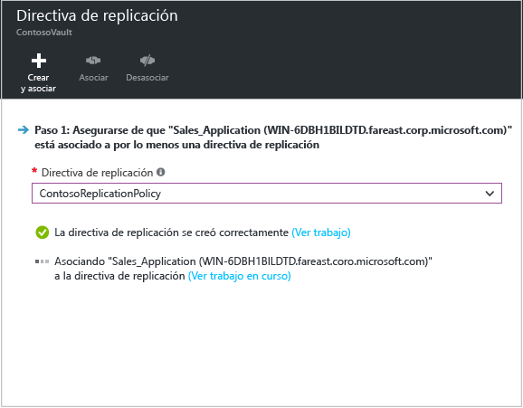

## Paso 5: Pleaneamiento de capacidad
Ahora que tiene la infraestructura básica configurada, planee la capacidad y averigüe si necesitará recursos adicionales.

Site Recovery proporciona una herramienta de planeación de capacidad para ayudarle a asignar los recursos adecuados para el entorno de origen, los componentes de Site Recovery, las redes y el almacenamiento. Puede ejecutar la herramienta de planeación en modo rápido para obtener resultados basados en un promedio de máquinas virtuales, discos y almacenamiento o en el modo detallado en el que podrá especificar las cifras en el nivel de carga de trabajo. Antes de comenzar:

* Recopilar información sobre su entorno de replicación, incluidas las máquinas virtuales, discos por máquina virtual y almacenamiento por disco.
* Calcular la tasa de cambio (renovación) diaria para los datos replicados. Para ayudarle a ello, puede usar la [herramienta de planeamiento de capacidad para réplicas de Hyper-V](https://www.microsoft.com/download/details.aspx?id=39057) .

1. Haga clic en **Descargar** para descargar la herramienta y, luego, ejecútela. [Lea el artículo](site-recovery-capacity-planner.md) que acompaña a la herramienta.
2. Una vez que haya terminado, seleccione **Yes** (Sí) en **Have you run the Capacity Planner**? (¿Ha ejecutado la herramienta Capacity Planner?)

   

### Consideraciones sobre el ancho de banda de red
Puede utilizar la herramienta de planeación de capacidad para calcular el ancho de banda necesario para la replicación (replicación inicial y, a continuación, la diferencial). Para controlar el uso de ancho de banda de la replicación tiene algunas opciones:

* **Limitar el ancho de banda**: el tráfico de Hyper-V que se replica en un sitio secundario pasa a través de un host de Hyper-V específico. Puede limitar el ancho de banda en el servidor host.
* **Retocar el ancho de banda**: puede influir en el ancho de banda utilizado para la replicación mediante un par de claves del Registro.

#### Limitar el ancho de banda
1. Abra el complemento Copia de seguridad de Microsoft Azure en el servidor host de Hyper-V. De manera predeterminada, hay disponible un acceso directo para Microsoft Azure Backup en el escritorio o en la siguiente ruta de acceso: C:\Program Files\Microsoft Azure Recovery Services Agent\bin\wabadmin.
2. En el complemento, haga clic en **Cambiar propiedades**.
3. En la pestaña **Limitación**, seleccione **Habilitar límite de uso del ancho de banda de Internet para las operaciones de copia de seguridad** y defina los límites durante las horas de trabajo y fuera de las horas de trabajo. Los intervalos válidos van de 512 Kbps a 102 Mbps por segundo.

    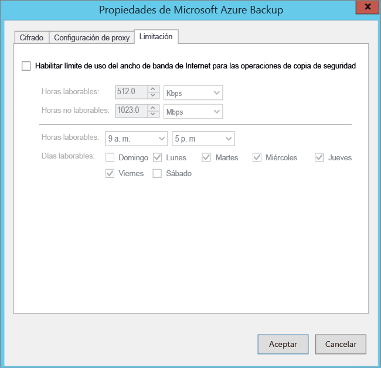

También puede utilizar el cmdlet [Set-OBMachineSetting](https://technet.microsoft.com/library/hh770409.aspx) para establecer la limitación. Aquí tiene un ejemplo:

    $mon = [System.DayOfWeek]::Monday
    $tue = [System.DayOfWeek]::Tuesday
    Set-OBMachineSetting -WorkDay $mon, $tue -StartWorkHour "9:00:00" -EndWorkHour "18:00:00" -WorkHourBandwidth  (512*1024) -NonWorkHourBandwidth (2048*1024)

**Set-OBMachineSetting -NoThrottle** indica que no se requiere ninguna limitación.

#### Control del uso de ancho de banda de red
El valor de registro **UploadThreadsPerVM** controla el número de subprocesos que se utilizan para la transferencia de datos (replicación inicial o diferencial) de un disco. Un valor mayor aumenta el ancho de banda de red utilizado para la replicación. El valor de registro **DownloadThreadsPerVM** especifica el número de subprocesos usados para la transferencia de datos durante la conmutación por recuperación.

1. En el Registro, vaya a **HKEY_LOCAL_MACHINE\SOFTWARE\Microsoft\Windows Azure Backup\Replication**.

   * Modifique el valor **UploadThreadsPerVM** (o cree la clave, si no existe) para controlar los subprocesos utilizados para la replicación de disco.
   * Modifique el valor **DownloadThreadsPerVM** (o cree la clave, si no existe) para controlar los subprocesos utilizados para el tráfico de conmutación por recuperación desde Azure.
2. El valor predeterminado es 4. En una red "sobreaprovisionada", se deben cambiar los valores predeterminados de estas claves de registro. El valor máximo es 32. Supervise el tráfico para optimizar el valor.

## Paso 6: Habilitamiento de la replicación

Ahora habilite la replicación como sigue:

1. Haga clic en **Paso 2: Replicar la aplicación** > **Origen**. Después de habilitar la replicación por primera vez, haga clic en **+Replicar** en el almacén para habilitar la replicación de más máquinas.

    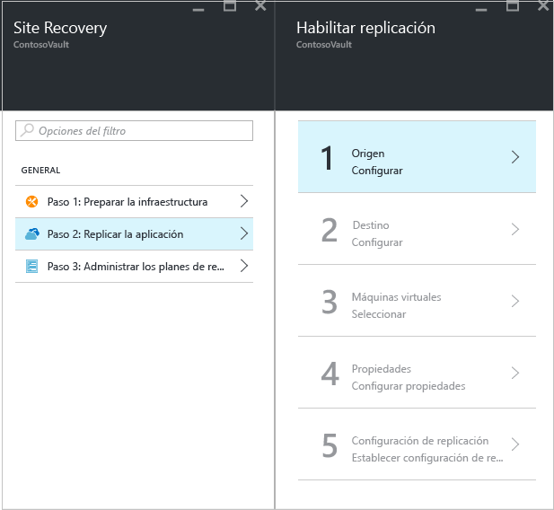
2. En la hoja **Origen**, seleccione el servidor VMM y la nube en la que se encuentran los hosts de Hyper-V. y, a continuación, haga clic en **Aceptar**.

    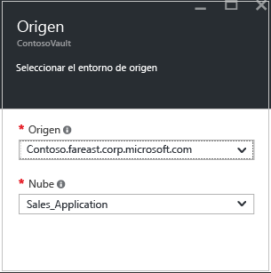
3. En **Destino** seleccione la suscripción, el modelo de implementación posterior a la conmutación por error y la cuenta de almacenamiento que va a usar para los datos replicados.

    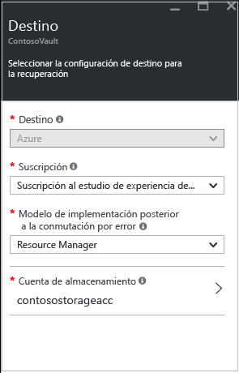
4. Seleccione la cuenta de almacenamiento que desea usar. Si desea utilizar una cuenta de almacenamiento diferente de las que tiene, puede [crear una](#set-up-an-azure-storage-account). Para crear una cuenta de almacenamiento mediante el modelo de Resource Manager, haga clic en **Crear nueva**. Si desea crear una cuenta de almacenamiento mediante el modelo clásico, lo hará [en Azure Portal](../storage/storage-create-storage-account-classic-portal.md). y, a continuación, haga clic en **Aceptar**.
5. Seleccione la red y la subred de Azure a la que se conectarán las máquinas virtuales de Azure cuando se creen después de la conmutación por error. Seleccione la opción **Configurar ahora para las máquinas seleccionadas** con el fin de aplicar la configuración de red a todas las máquinas que seleccione para su protección. Seleccione **Configurar más tarde** para seleccionar la red de Azure por máquina. Si desea utilizar una red diferente de las que tiene, puede [crear una](#set-up-an-azure-network). Para crear una red mediante el modelo de Resource Manager, haga clic en **Crear nueva**. Si desea crear una red mediante el modelo clásico, lo hará [en Azure Portal](../virtual-network/virtual-networks-create-vnet-classic-pportal.md). Seleccione una subred si es posible. y, a continuación, haga clic en **Aceptar**.
6. En **Máquinas virtuales** > **Seleccionar máquinas virtuales**, haga clic en cada máquina que desea replicar y selecciónela. Solo puede seleccionar aquellas máquinas en las que se pueda habilitar la replicación. y, a continuación, haga clic en **Aceptar**.

    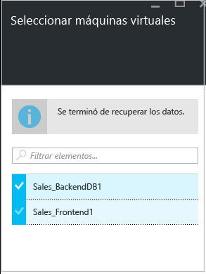

7. En **Propiedades** > **Configurar propiedades**, seleccione el sistema operativo para las máquinas virtuales seleccionadas y el disco del sistema operativo. De forma predeterminada se seleccionan todos los discos de la máquina virtual para la replicación. Puede que quiera excluir discos de la replicación con el fin de reducir el consumo de ancho de banda por la replicación de datos innecesarios en Azure. Por ejemplo, es posible que no desee replicar los discos con datos temporales, o los datos que se actualizan cada vez que se reinicia una máquina o aplicación (por ejemplo, pagefile.sys o tempdb de Microsoft SQL Server). Para excluir el disco de la replicación, deselecciónelo. Compruebe que el nombre de la máquina virtual de Azure (nombre de destino) cumple los [requisitos de la máquina virtual de Azure](site-recovery-support-matrix-to-azure.md#failed-over-azure-vm-requirements) y modifíquelo si es necesario. y, a continuación, haga clic en **Aceptar**. Puede establecer propiedades adicionales más adelante.

    

    >[!NOTE]
    >
    > * Solo se pueden excluir los discos básicos de la replicación. No se pueden excluir los discos de sistema operativo y no se recomienda excluir los discos dinámicos. Site Recovery no se puede identificar si un disco VHD es básico o dinámico dentro de la máquina virtual invitada.  Si no se excluyen los discos de volumen dinámico dependientes, el disco dinámico protegido se mostrará como uno fallido en la conmutación por error de la máquina virtual, y no se podrá tener acceso a los datos de dicho disco.
    > * Una vez habilitada la replicación, no puede agregar ni quitar discos para la replicación. Si quiere agregar o excluir un disco, deberá deshabilitar la protección de la máquina y luego volver a habilitarla.
    > * Si excluye un disco necesario para que una aplicación funcione, después de la conmutación por error a Azure, debe crearlo manualmente en Azure para poder ejecutar la aplicación replicada. También puede integrar Azure Automation en un plan de recuperación para crear el disco durante la conmutación por error de la máquina.
    > * No se producirá una conmutación por recuperación de los discos creados manualmente en Azure. Por ejemplo, si realiza la conmutación por error de tres discos y crea dos directamente en una máquina virtual de Azure, solo tres discos que se conmutaron por error se conmutarán por recuperación desde Azure hasta Hyper-V. No puede incluir los discos creados manualmente en la conmutación por recuperación o en la replicación inversa de Hyper-V a Azure.
    >
    >

8. En **Configuración de replicación** > **Establecer configuración de replicación**, seleccione la directiva de replicación que desea aplicar para las máquinas virtuales protegidas. A continuación, haga clic en **Aceptar**. Puede modificar la directiva de replicación en **Directivas de replicación** > nombre de directiva > **Editar configuración**. Los cambios que aplique se utilizarán tanto para las máquinas que ya se estén replicando como para otras nuevas.

   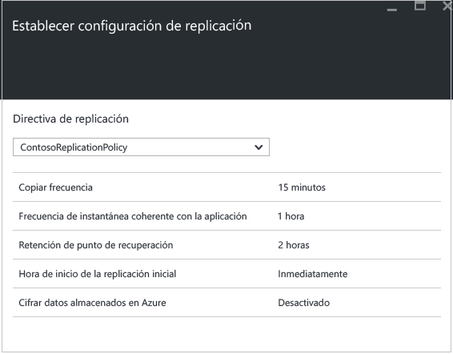

Puede hacer un seguimiento del progreso del trabajo **Habilitar protección** en **Trabajos** > **Trabajos de Site Recovery**. La máquina estará preparada para la conmutación por error después de que finalice el trabajo **Finalizar la protección**.

### Visualización y administración de las propiedades de la máquina virtual
Es recomendable que compruebe las propiedades de la máquina de origen. Recuerde que el nombre de la máquina virtual de Azure debe cumplir los [requisitos para las máquinas virtuales de Azure](site-recovery-support-matrix-to-azure.md#failed-over-azure-vm-requirements).

1. En **Elementos protegidos**, haga clic en **Elementos replicados** y seleccione la máquina para ver sus detalles.

    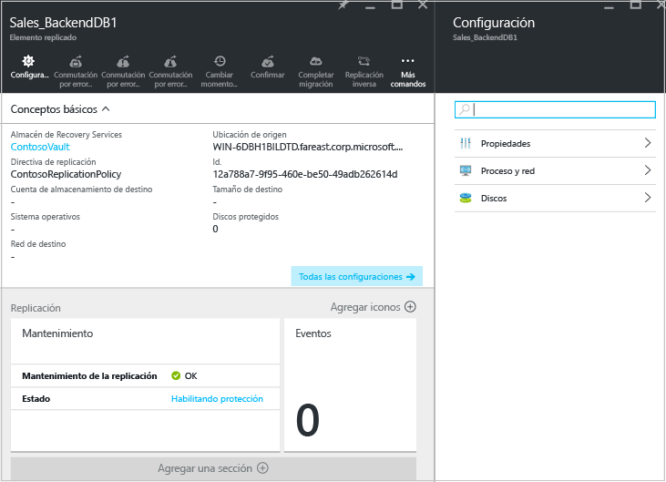
2. En **Propiedades** puede ver la información de replicación y conmutación por error de la máquina virtual.

    
3. En **Proceso y red** > **Propiedades de proceso**, puede especificar el nombre y el tamaño de destino de la máquina virtual de Azure. Modifique el nombre para que cumpla con los [requisitos de Azure](site-recovery-support-matrix-to-azure.md#failed-over-azure-vm-requirements) si es necesario. También puede ver y modificar la información acerca de la red, la subred y la dirección IP de destino que se asignarán a la máquina virtual de Azure.
Observe lo siguiente:

   * Puede establecer la dirección IP de destino. Si no proporciona una dirección, la máquina conmutada por error usará DHCP. Si establece una dirección que no está disponible en el momento de la conmutación por error, se producirá un error. Se puede utilizar la misma dirección IP de destino para la conmutación por error de prueba si la dirección está disponible en la red.
   * El número de adaptadores de red viene determinado por el tamaño que especifique para la máquina virtual de destino, de la siguiente manera:

     * Si el número de adaptadores de red en el equipo de origen es menor o igual al número de adaptadores permitido para el tamaño de la máquina de destino, el destino tendrá el mismo número de adaptadores que el origen.
     * Si el número de adaptadores para la máquina virtual de origen supera el número permitido para el tamaño de destino, entonces se utilizará el tamaño máximo de destino.
     * Por ejemplo, si una máquina de origen tiene dos adaptadores de red y el tamaño de la máquina de destino es compatible con cuatro, el equipo de destino tendrá dos adaptadores. Si el equipo de origen tiene dos adaptadores pero el tamaño de destino compatible solo admite uno, el equipo de destino tendrá solo un adaptador.     
     * Si la máquina virtual tiene varios adaptadores de red, todos ellos se conectarán a la misma red.

     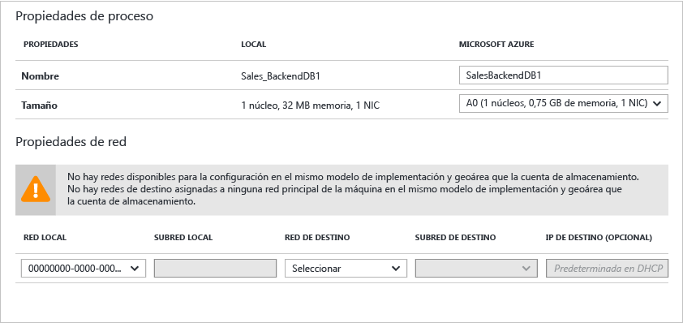
4. En **Discos** puede ver los discos de datos y del sistema operativo en la máquina virtual que se va a replicar.

### Preparación para la conexión a las máquinas virtuales de Azure después de la conmutación por error
Si desea conectarse a máquinas virtuales de Azure mediante RDP después de la conmutación por error, asegúrese de que hace lo siguiente:

**En la máquina local antes de la conmutación por error**:

* Para obtener acceso a través de Internet, habilite el protocolo RDP, asegúrese de que se agregan las reglas de TCP y UDP para **Público**, así como de que el protocolo RDP se permite en **Firewall de Windows** -> **Aplicaciones y características permitidas** para todos los perfiles.
* Para obtener acceso a través de una conexión de sitio a sitio, habilite el protocolo RDP en la máquina y asegúrese de que este está permitido en **Firewall de Windows** -> **Aplicaciones y características permitidas** para redes **Dominio** y **Privadas**.
* Instale el [agente de máquina virtual de Azure](http://go.microsoft.com/fwlink/?LinkID=394789&clcid=0x409) en la máquina local.
* Asegúrese de que la directiva SAN del sistema operativo está establecida en OnlineAll. [Más información](https://support.microsoft.com/kb/3031135)
* Desactive el servicio IPSec antes de ejecutar la conmutación por error.

**En la máquina virtual de Azure después de la conmutación por error**:

* Agregue un punto de conexión público para el protocolo RDP (puerto 3389) y especifique las credenciales de inicio de sesión.
* Asegúrese de no tener ninguna directiva de dominio que impida que se conecte a una máquina virtual mediante una dirección pública.
* Intente conectarse. Si no se puede conectar, compruebe que se está ejecutando la máquina virtual. Para obtener más sugerencias sobre solución de problemas, consulte este [artículo](http://social.technet.microsoft.com/wiki/contents/articles/31666.troubleshooting-remote-desktop-connection-after-failover-using-asr.aspx).

Si desea acceder a una máquina virtual de Azure con Linux después de la conmutación por error mediante un cliente de Secure Shell (ssh), haga lo siguiente:

**En la máquina local antes de la conmutación por error**:

* Asegúrese de que el servicio de Secure Shell en la máquina virtual de Azure está configurado para iniciarse automáticamente en el arranque del sistema.
* Compruebe que las reglas de firewall permiten una conexión SSH.

**En la máquina virtual de Azure después de la conmutación por error**:

* Las reglas del grupo de seguridad de red de la máquina virtual conmutada por error y la subred de Azure a la que esta se conecta necesitan permitir las conexiones entrantes al puerto SSH.
* Debe crearse un punto de conexión público para permitir las conexiones entrantes en el puerto SSH (de forma predeterminada es el puerto TCP 22).
* Si se accede a la máquina virtual a través de una conexión VPN (Express Route o VPN de sitio a sitio), el cliente puede utilizarse para conectarse directamente a la máquina virtual a través de SSH.

## Paso 7: Prueba de la implementación
Para probar la implementación, puede ejecutar una conmutación por error de prueba para una sola máquina virtual o un plan de recuperación que contenga una o varias máquinas virtuales.

1. Para conmutar por error una sola máquina virtual, en **Elementos replicados**, haga clic en la máquina virtual > **+Conmutación por error de prueba**.
1. Para conmutar por error un plan de recuperación, en **Planes de recuperación**, haga clic con el botón derecho en el plan > **Probar conmutación por error**. Para crear un plan de recuperación, [siga estas instrucciones](site-recovery-create-recovery-plans.md).
1. En **Probar conmutación por error**, seleccione la red de Azure a la que se conectarán las máquinas virtuales de Azure después de la conmutación por error.
1. Haga clic en **Aceptar** para iniciar la conmutación por error. Puede hacer un seguimiento del progreso haciendo clic en la máquina virtual para abrir sus propiedades o en el trabajo de **Conmutación por error de prueba** en **Trabajos de Site Recovery**.
1. Cuando se complete la conmutación por error, debería ver la máquina de réplica de Azure en Azure Portal > **Virtual Machines**. Debe asegurarse de que la máquina virtual tiene el tamaño adecuado, que se ha conectado a la red correspondiente y que se está ejecutando.
1. Si se [preparó para las conexiones después de la conmutación por error](#prepare-to-connect-to-Azure-VMs-after-failover), debe ser capaz de conectarse a la máquina virtual de Azure.
1. Una vez que haya terminado, haga clic en **Cleanup test failover** (Limpieza de conmutación por error de prueba) en el plan de recuperación. En **Notas** , registre y guarde las observaciones asociadas a la conmutación por error de prueba. Así se eliminarán las máquinas virtuales que se crearon durante la conmutación por error de prueba.

Para más información, consulte el documento [Test Failover to Azure in Site Recovery](site-recovery-test-failover-to-azure.md) (Conmutación por error de prueba de Azure en Site Recovery).

## Supervisión de la implementación
Le mostramos cómo puede supervisar la configuración y el estado de la implementación de Site Recovery:

1. Haga clic en el nombre del almacén para acceder al panel **Essentials** . En este panel puede ver los trabajos de Site Recovery, el estado de la replicación, los planes de recuperación, y el estado y los eventos del servidor.  Puede personalizar **Essentials** para mostrar los iconos y los diseños que sean más útiles para usted, incluido el estado de otros almacenes de Backup y Site Recovery.

    
2. En **Estado**, puede supervisar problemas en los servidores locales (servidores VMM o de configuración) y los eventos que Site Recovery generó en las últimas 24 horas.
3. Puede administrar y supervisar la replicación en los iconos de **Elementos replicados**, **Planes de recuperación** y **Trabajos de Site Recovery**. Puede ver más detalles de los trabajos en **Trabajos** > **Trabajos de Site Recovery**.

## Pasos siguientes
Después de que la implementación esté configurada y en ejecución, [obtenga más información](site-recovery-failover.md) acerca de la conmutación por error.

