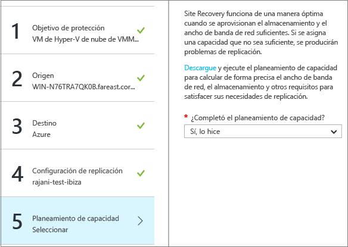

# Replicación de máquinas virtuales de Hyper-V (en nubes VMM) en un sitio de VMM secundario mediante el Portal de Azure
> [!div class="op_single_selector"]
> * [Portal de Azure](site-recovery-vmm-to-vmm.md)
> * [Portal clásico](site-recovery-vmm-to-vmm-classic.md)
> * [PowerShell: administrador de recursos](site-recovery-vmm-to-vmm-powershell-resource-manager.md)
>
>

¡Bienvenido al servicio Azure Site Recovery!

Site Recovery es un servicio de Azure que contribuye a su estrategia de recuperación ante desastres y continuidad empresarial (BCDR). Este servicio organiza la replicación de máquinas virtuales y servidores físicos locales en la nube (Azure) o en un centro de datos secundario. Cuando se producen interrupciones en la ubicación principal, se realiza la conmutación por error a la ubicación secundaria para mantener disponibles las aplicaciones y cargas de trabajo. La conmutación por recuperación a la ubicación principal se produce cuando vuelve a su funcionamiento normal. Más información en [¿Qué es Azure Site Recovery?](site-recovery-overview.md)

En este artículo se describe cómo utilizar Site Recovery en Azure Portal para replicar máquinas virtuales locales de Hyper-V, administradas en nubes de System Center Virtual Machine Manager (VMM), en un sitio secundario.

Después de leer este artículo, publique los comentarios en la parte inferior de los comentarios de Disqus. Formule cualquier pregunta técnica en el [Foro de Servicios de recuperación de Azure](https://social.msdn.microsoft.com/forums/azure/home?forum=hypervrecovmgr).

## Resumen rápido
Se recomienda encarecidamente que siga todos los pasos del artículo para que la implementación sea completa. Pero si se está quedando sin tiempo, aquí tiene un resumen rápido.

| **Ámbito** | **Detalles** |
| --- | --- |
| **Escenario de implementación** |Replicación de máquinas virtuales de Hyper-V en hosts de Hyper-V entre nubes VMM|
| **Requisitos locales** | Los servidores VMM locales deben estar ejecutando, como mínimo, System Center 2012 SP1 con las actualizaciones más recientes.   Se recomienda usar un servidor VMM en cada sitio, pero puede replicar máquinas virtuales entre nubes en el mismo servidor VMM. [Más información](site-recovery-single-vmm.md)   El servidor VMM tiene una o varias nubes que contienen hosts de Hyper-V.   Los servidores Hyper-V deben estar ejecutando, como mínimo, Windows Server 2012 con las actualizaciones más recientes.   Los servidores VMM y hosts de Hyper-V necesitan acceso a Internet.   [Direcciones URL obligatorias](#on-premises-prerequisites) (directamente o a través de proxy).  |
| **Limitaciones locales** | No se admite un proxy basado en HTTPS
| **Requisitos de Azure** | Cuenta de Azure   Almacén de Servicios de recuperación |
| **Replicación de máquina virtual** | Cualquier máquina virtual compatible con Hyper-V. |
| **Agentes** | Proveedor de Azure Site Recovery instalado en los servidores VMM.   No se requiere ningún agente en los hosts de Hyper-V. |
| **Pasos de implementación** | **1)** Prepare el servidor VMM local. -> **2)** Cree el almacén de Recovery Services. -> **3)** Configure el servidor VMM y regístrelo en el almacén. -> **4)** Configure las opciones de replicación. -> **5)** Configure la asignación de redes. -> **6)** Habilite la replicación. -> **7)** Pruebe la replicación y la conmutación por error.

## Site Recovery en Azure Portal

Azure tiene dos [modelos de implementación](../azure-resource-manager/resource-manager-deployment-model.md) diferentes para crear recursos y trabajar con ellos: el de Azure Resource Manager y el clásico. Azure cuenta también con dos portales: el Portal de Azure clásico y Azure Portal.

En este artículo, se describe cómo realizar la implementación en Azure Portal, donde se lleva a cabo de forma simplificada. Se puede usar el portal clásico para mantener los almacenes existentes. No se pueden crear almacenes con el portal clásico.

## Site Recovery en su empresa
Las organizaciones necesitan una estrategia de recuperación ante desastres y continuidad empresarial (BCDR) que determine cómo seguirán en funcionamiento y disponibles las aplicaciones y los datos durante los tiempos de inactividad planeados y no planeados, y cómo recuperar las condiciones de funcionamiento normales lo antes posible. Esto es lo que Site Recovery puede hacer:

- Proporcionar protección remota para cargas de trabajo empresariales que se ejecutan en máquinas virtuales de Hyper-V.
- Proporcionar una ubicación única para configurar, administrar y supervisar la replicación, la conmutación por error y la recuperación.
- Realizar tareas sencillas de conmutación por error y conmutación por recuperación en todos los sitios locales.
- Replicar y conmutar por error varias máquinas virtuales.  Puede recopilar varias máquinas en planes de recuperación, de modo que las cargas de trabajo de aplicaciones organizadas en niveles en distintas máquinas conmuten por error al mismo tiempo.

## Arquitectura del escenario

* **Sitio primario**: en el sitio primario, necesita uno o varios servidores VMM. Estos servidores tienen nubes privadas de VMM, que contiene los servidores de host Hyper-V que incluyen las máquinas virtuales que quiere replicar.
* **Sitio secundario**: en el sitio secundario, necesita uno o varios servidores VMM. Los servidores de host Hyper-V en nubes VMM ejecutan máquinas virtuales de destino en las que se replicarán las máquinas virtuales principales.
* **Proveedor**: durante la implementación de Site Recovery, se instala el proveedor de Azure Site Recovery en los servidores VMM, y dichos servidores se registran en un almacén de Recovery Services. El proveedor se comunica con Site Recovery mediante HTTPS 443 para replicar la orquestación. La replicación de datos se produce entre los servidores host de Hyper-V principal y secundario. Los datos replicados permanecen dentro de los sitios y las redes locales y no se envían a Azure. Obtenga más información sobre la [privacidad](#privacy-information-for-site-recovery).

### Información general sobre la privacidad de los datos

En esta tabla se resume cómo se almacenan los datos en este escenario:

- - -
| Acción | **Detalles** | **Datos recopilados** | **Uso** | **Obligatorio** |
| --- | --- | --- | --- | --- |
| **Registro** | Registra un servidor VMM en un almacén de Servicios de recuperación. Si más tarde desea anular el registro de un servidor, puede hacerlo eliminando la información de este en el Portal de Azure. | Después de que se registra un servidor VMM, Site Recovery recopila, procesa y transfiere metadatos sobre el servidor VMM y los nombres de las nubes VMM detectadas. | Los datos se utilizan para identificar el servidor VMM adecuado y comunicarse con él, y para configurar las nubes VMM correctas. | Esta característica es necesaria. Si no desea enviar esta información a Site Recovery, no utilice dicho servicio. |
| **Habilitar replicación** | El proveedor de Azure Site Recovery se instala en el servidor VMM y es el conducto para la comunicación con el servicio Site Recovery. El proveedor es una biblioteca de vínculos dinámicos (DLL) que se hospeda en el proceso VMM. Después de instalar el proveedor, se habilita la característica "Datacenter Recovery" en la consola de administrador de VMM. Se puede habilitar esta característica en las máquinas virtuales nuevas y existentes para estar protegidas. |Con esta propiedad establecida, el proveedor envía el nombre y el identificador de la máquina virtual a Site Recovery.  La replicación se habilita mediante la réplica de Hyper-V de Windows Server 2012 o Windows Server 2012 R2. Los datos de la máquina virtual se replican de un host de Hyper-V a otro (normalmente se encuentran en un centro de datos de "recuperación" diferente). |Site Recovery usa los metadatos para rellenar la información de la máquina virtual en el Portal de Azure. | Esta característica es una parte esencial del servicio y no se puede desactivar. Si no desea enviar esta información, no habilite la protección de Site Recovery para máquinas virtuales. Tenga en cuenta que todos los datos que envía el proveedor a Site Recovery es través de HTTPS. |
| **Plan de recuperación** | Los planes de recuperación le ayudan a crear un plan de orquestación para el centro de datos de recuperación. Puede definir el orden en el que se deben iniciar las máquinas virtuales, o un grupo de ellas, en el sitio de recuperación. También puede especificar los scripts automatizados que se pueden ejecutar, o cualquier acción manual que se debe emprender, en el momento de la recuperación para cada máquina virtual. Normalmente se activa la conmutación por error en el nivel del plan de recuperación para la recuperación coordinada. | Site Recovery recopila, procesa y transmite los metadatos para el plan de recuperación, incluidos los metadatos de la máquina virtual y los metadatos de todos los scripts de automatización y las notas de la acción manual. |Los metadatos se utilizan para crear el plan de recuperación en el Portal de Azure. |Esta característica es una parte esencial del servicio y no se puede desactivar. Si no desea enviar esta información a Site Recovery, no cree planes de recuperación. |
| **Asignación de red** | Permite asignar la información de red del centro de datos principal al centro de datos de recuperación. Cuando se recuperan máquinas virtuales en el sitio de recuperación, la asignación de red ayuda a establecer la conectividad de red. |Site Recovery recopila, procesa y transmite los metadatos de las redes lógicas de cada sitio (principal y centro de datos). |Los metadatos se usan para rellenar la configuración de red de modo que pueda asignar la información de red. | Esta característica es una parte esencial del servicio y no se puede desactivar. Si no desea enviar esta información a Site Recovery, no utilice la asignación de red. |
| **Conmutación por error (planeada o no planeada y prueba)** | Se produce un error en la conmutación por error en las máquinas virtuales entre un centro de datos administrado por VMM y otro. La acción de conmutación por error se desencadena manualmente en el Portal de Azure. |Site Recovery notifica al proveedor en el servidor VMM el evento de conmutación por error y este ejecuta una acción de conmutación por error en el host de Hyper-V mediante interfaces de VMM. La conmutación por error real de una máquina virtual se realiza de un host de Hyper-V a otro y se administra mediante la réplica de Hyper-V de Windows Server 2012 o Windows Server 2012 R2. Site Recovery usa la información enviada para rellenar el estado de la información de acción de conmutación por error en Azure Portal. | Esta característica es una parte esencial del servicio y no se puede desactivar. Si no desea enviar esta información a Site Recovery, no utilice la conmutación por error. |

## Requisitos previos de Azure
Para implementar este escenario, necesitará lo siguiente en Azure:

| **Requisitos previos** | **Detalles** |
| --- | --- |
| **Las tablas de Azure** |Necesita una cuenta de [Microsoft Azure](http://azure.microsoft.com/) . Puede comenzar con una [evaluación gratuita](https://azure.microsoft.com/pricing/free-trial/). [más información](https://azure.microsoft.com/pricing/details/site-recovery/) sobre los precios de Site Recovery. |

## Requisitos previos locales
Esto es lo que necesita tener en los sitios locales principal y secundario para implementar este escenario:

| **Requisitos previos** | **Detalles** |
| --- | --- |
| **VMM** | Se recomienda implementar un servidor VMM en el sitio principal y otro del mismo tipo en el secundario.   Puede [replicar máquinas virtuales entre nubes en un único servidor VMM](site-recovery-single-vmm.md). Para ello, necesita al menos dos nubes configuradas en el servidor VMM.   Los servidores VMM deben estar ejecutando, como mínimo, System Center 2012 SP1 con las actualizaciones más recientes.   Todos los servidores VMM deben tener una o varias nubes. Además, en todas las nubes se debe haber establecido el perfil de capacidad de Hyper-V.   Las nubes deben incluir uno o más grupos de hosts de VMM.   [Más información](https://msdn.microsoft.com/library/azure/dn469075.aspx#BKMK_Fabric) sobre cómo configurar las nubes de VMM.    Los servidores VMM necesitan acceso a Internet. |
| **Hyper-V** | Los servidores Hyper-V deben estar ejecutando, como mínimo, Windows Server 2012 con el rol Hyper-V y tener instaladas las actualizaciones más recientes.   Un servidor de Hyper-V debe contener una o varias máquinas virtuales.    Los servidores host de Hyper-V deben estar ubicados en grupos host de las nubes de VMM principal y secundaria.   Si ejecuta Hyper-V en un clúster de Windows Server 2012 R2, debe instalar la [actualización 2961977](https://support.microsoft.com/kb/2961977).   Si ejecuta Hyper-V en un clúster de Windows Server 2012, tenga en cuenta que el agente de clúster no se crea automáticamente si tiene un clúster basado en una dirección IP estática. Tiene que configurar manualmente el agente de clúster. [Más información](http://social.technet.microsoft.com/wiki/contents/articles/18792.configure-replica-broker-role-cluster-to-cluster-replication.aspx). |
| **Proveedor** | Durante la implementación de Site Recovery, se instala el proveedor de Azure Site Recovery en los servidores VMM. El proveedor se comunica con Site Recovery mediante HTTPS 443 para organizar la replicación. La replicación de datos se produce entre los servidores Hyper-V principal y secundario mediante la conexión LAN o VPN.   El proveedor que se ejecuta en el servidor VMM necesita tener acceso a estas URL:   ``*.accesscontrol.windows.net``   ``*.backup.windowsazure.com``   ``*.hypervrecoverymanager.windowsazure.com``    ``*.store.core.windows.net``   ``*.blob.core.windows.net``    ``https://www.msftncsi.com/ncsi.txt``   ``time.windows.com``   ``time.nist.gov``   Hay que permitir tanto la comunicación del firewall entre los servidores VMM y los [intervalos IP del centro de datos de Azure](https://www.microsoft.com/download/confirmation.aspx?id=41653) como el protocolo HTTPS (443). |

## Preparación de la implementación
Para preparar la implementación debe:

1. [Preparar el servidor VMM](#prepare-the-vmm-server) para la implementación de Site Recovery.
2. [Preparar la asignación de red](#prepare-for-network-mapping). Configure las redes para poder configurar la asignación de red.

### Preparar el servidor VMM
Asegúrese de que el servidor VMM cumple los [requisitos previos](#on-premises-prerequisites) y que puede tener acceso a las URL enumeradas.

### Preparar la asignación de red
La asignación de red se realiza entre las redes de VM de VMM en los servidores VMM principal y secundario con el fin de:

* Colocar óptimamente las máquinas virtuales de réplica en los hosts de Hyper-V secundarios tras la conmutación por error.
* Conectar las máquinas virtuales de réplica a las redes VM adecuadas.
* Si no configura la asignación de red, las máquinas virtuales de réplica no se conectarán a ninguna red después de la conmutación por error.
* Si quiere configurar la asignación de red durante la implementación de Site Recovery, esto es lo que debe hacer:

  * Asegúrese de que las máquinas virtuales del servidor host de Hyper-V de origen estén conectadas a una red de máquinas virtuales de VMM. Esa red debe estar vinculada a una red lógica asociada con la nube.
  * Compruebe que la nube secundaria que se va a utilizar para la recuperación tenga configurada una red de VM correspondiente. Dicha red de máquina virtual debe estar vinculada a una red lógica asociada con la nube secundaria.
* [más información](site-recovery-network-mapping.md) sobre cómo funciona la asignación de red.

## Preparación para la implementación con un único servidor VMM

Si solo tiene un servidor VMM, puede replicar las máquinas virtuales de hosts de Hyper-V de la nube VMM en [Azure](site-recovery-vmm-to-azure.md) o en una nube VMM secundaria. Se recomienda la primera opción porque la replicación entre nubes no funciona muy bien, pero si necesita hacerlo estos son los pasos que debe seguir:

1. **Configurar VMM en una máquina virtual Hyper-V**. Se recomienda colocar la instancia de SQL Server que usa VMM en la misma máquina virtual. Esto permite ahorrar tiempo, ya que solo se tiene que crear una máquina virtual. Si quiere usar una instancia remota de SQL Server y se produce una interrupción, necesita recuperar esa instancia para poder recuperar VMM.
2. **Asegúrese de que el servidor VMM tenga al menos dos nubes configuradas**. Una nube contendrá las máquinas virtuales que desee replicar y la otra nube actuará como la ubicación secundaria. La nube que contenga las máquinas virtuales que quiere proteger debe cumplir una serie de [requisitos previos](#on-premises-prerequisites).
3. Configure Site Recovery tal como se describe en este artículo. Cree y registre el servidor VMM en el almacén, configure una directiva de replicación y habilite la replicación. Debe especificar que la replicación inicial tenga lugar a través de la red.
4. Al configurar la asignación de red, se asigna la red de VM para la nube principal a la red de VM para la nube secundaria.
5. En la consola de administrador de Hyper-V, habilite la réplica de Hyper-V en el host de Hyper-V que contiene la máquina virtual de VMM y habilite la replicación en la máquina virtual. Asegúrese de no agregar la máquina virtual VMM a las nubes que están protegidas por Site Recovery para garantizar que la configuración de la réplica de Hyper-V no la invalide Site Recovery.
6. Si crea planes de recuperación para la conmutación por error, se usa el mismo servidor VMM de origen y de destino.
7. Puede conmutar por error y realizar la recuperación de la manera siguiente:

   * Realice manualmente la conmutación por error de la máquina virtual de VMM en el sitio secundario utilizando el Administrador de Hyper-V con una conmutación por error planeada.
   * Conmute por error las máquinas virtuales.
   * Cuando la VM de VMM se haya recuperado, inicie sesión en el Portal de Azure -> Almacén de Servicios de recuperación y ejecute una conmutación por error no planeada de las máquinas virtuales desde el sitio secundario hasta el sitio principal.
   * Una vez completada la conmutación por error no planeada, se podrá acceder a todos los recursos de nuevo desde el sitio primario.

### Creación de un almacén de Servicios de recuperación
1. Inicie sesión en el [Portal de Azure](https://portal.azure.com).
2. Haga clic en **Nuevo** > **Administración** > **Recovery Services**. También puede hacer clic en **Examinar** > **Almacenes de Recovery Services**> **Agregar**.

    
3. En **Nombre**, especifique un nombre descriptivo para identificar el almacén. Si tiene más de una suscripción, seleccione una de ellas.
4. [Cree un grupo de recursos nuevo](../azure-resource-manager/resource-group-template-deploy-portal.md) o seleccione uno que ya exista, y especifique una región de Azure. Las máquinas se replicarán en esta región. Para comprobar las regiones admitidas, consulte Disponibilidad geográfica en [Detalles de precios de Azure Site Recovery](https://azure.microsoft.com/pricing/details/site-recovery/)
5. Si quiere acceder rápidamente al almacén desde el panel, haga clic en **Anclar al panel** > **Crear almacén**.

    

El nuevo almacén aparecerá en **Panel**  >  **Todos los recursos** y en la hoja principal de **Almacenes de servicios de recuperación**.

## Introducción
Site Recovery proporciona una experiencia introductoria que le ayuda a realizar la implementación lo más rápido posible. Esta introducción comprueba los requisitos previos y le guía a través de los pasos de implementación de Site Recovery en el orden correcto.

En esta introducción puede seleccionar el tipo de máquinas que desea replicar y la ubicación donde desea replicarlas. Configurará servidores locales, creará directivas de replicación y realizará el planeamiento de la capacidad. Una vez que haya configurado la infraestructura, puede habilitar la replicación para máquinas virtuales. Puede ejecutar conmutaciones por error para máquinas específicas o crear planes de recuperación para conmutar por error varias máquinas.

Comience la experiencia de introducción decidiendo cómo desea implementar Site Recovery. El flujo descrito en esta introducción cambia ligeramente en función de los requisitos de replicación.

## Paso 1: Selección de los objetivos de protección
Seleccione aquello que desea replicar y la ubicación en donde se va a realizar la replicación.

1. En la hoja **Almacenes de Recovery Services**, seleccione el almacén y haga clic en **Configuración**.
2. En **Configuración** > **Introducción**, haga clic en **Site Recovery** > **Paso 1: Preparar la infraestructura** > **Objetivo de protección**.
3. En **Objetivo de protección**, seleccione **Para sitio de recuperación** y seleccione **Yes, with Hyper-V** (Sí, con Hyper-V).
4. Seleccione **Sí** para indicar que usa VMM para administrar los hosts de Hyper-V y haga clic en **Sí** si tiene un servidor VMM secundario. Si va a implementar la replicación entre nubes en un solo servidor VMM, haga clic en **No**. y, a continuación, haga clic en **Aceptar**.

    

## Paso 2: Configuración del entorno de origen
Instale el proveedor de Azure Site Recovery en los servidores VMM y registre los servidores en el almacén.

1. Haga clic en **Paso 2: Preparar la infraestructura** > **Origen**.

    
2. En **Preparar origen**, haga clic en **+ VMM** para agregar un servidor VMM.

    
3. En **Agregar servidor**, compruebe que aparece el **servidor de System Center VMM** en **Tipo de servidor** y que este cumple los [requisitos previos y los requisitos de direcciones URL](#on-premises-prerequisites).
4. Descargue el archivo de instalación del proveedor de Azure Site Recovery.
5. Descargue la clave de registro. Se le solicitará cuando ejecute el programa de instalación. La clave será válida durante 5 días a partir del momento en que se genera.

    
6. Instale el proveedor de Azure Site Recovery en el servidor VMM.

> [!NOTE]
> No es necesario instalar explícitamente nada en los servidores host de Hyper-V.
>
>

### Instalación del proveedor de Azure Site Recovery
1. Ejecute el archivo de instalación del proveedor en cada servidor VMM. Si VMM está implementado en un clúster y va a instalar el proveedor por primera vez, instálelo en un nodo activo y finalice la instalación para registrar el servidor VMM en el almacén. A continuación, instale el proveedor en los demás nodos. Los nodos del clúster deben ejecutar la misma versión del proveedor.
2. El programa de instalación ejecuta algunas comprobaciones de requisitos previos y solicita permiso para detener el servicio VMM. El servicio VMM se reiniciará automáticamente cuando finalice la instalación. Si va a instalarlo en un clúster VMM, se le pedirá que detenga el rol de clúster.
3. En **Microsoft Update** puede optar por recibir actualizaciones para que las actualizaciones del proveedor se realicen según las directivas de Microsoft Update.
4. En **Instalación** acepte o modifique la ubicación predeterminada de instalación del proveedor y haga clic en **Instalar**.

    
5. Cuando finalice la instalación, haga clic en **Registrar** para registrar el servidor en el almacén.

    
6. En **Nombre del almacén**, compruebe el nombre del almacén en el que se registrará el servidor. Haga clic en *Siguiente*.

    
7. En **Conexión a Internet** , especifique cómo se conecta a Internet el proveedor que se ejecuta en el servidor VMM. Seleccione **Conectarse con la configuración de proxy existente** para usar la configuración predeterminada de conexión a Internet establecida en el servidor.

    

   * Si desea utilizar un proxy personalizado, debe configurarlo antes de instalar el proveedor. Al configurar las opciones del proxy personalizado, se ejecuta una prueba para comprobar la conexión del proxy.
   * Si utiliza a un proxy personalizado o el proxy predeterminado requiere autenticación, tiene que especificar los detalles del proxy, incluida la dirección y el puerto del proxy.
   - Compruebe que se puede acceder a las URL necesarias desde el servidor VMM y los hosts de Hyper-V.
   * Si utiliza un proxy personalizado, se creará una cuenta de ejecución de VMM (DRAProxyAccount) mediante el uso automático de las credenciales de proxy especificadas. Configure el servidor proxy para que esta cuenta pueda autenticarse correctamente. La configuración de la cuenta de ejecución de VMM puede modificarse en la consola VMM. Para ello, abra el área de trabajo **Configuración**, expanda **Seguridad**, haga clic en **Cuentas de ejecución** y, a continuación, modifique la contraseña de DRAProxyAccount. Deberá reiniciar el servicio VMM para que esta configuración surta efecto.
8. En **Clave de registro**, seleccione la clave que ha descargado de Azure Site Recovery y copiado en el servidor VMM.
9. La configuración de cifrado solo se usa cuando se está replicando VM de Hyper-V en nubes de VMM en Azure. Si se está replicando en un sitio secundario, no se usa.
10. En **Nombre del servidor**, especifique un nombre descriptivo para identificar el servidor VMM en el almacén. En una configuración de clúster, especifique el nombre del rol de clúster VMM.
11. En **Sincronizar metadatos en la nube** seleccione si quiere sincronizar los metadatos de todas las nubes del servidor VMM con el almacén. Esta acción solo se debe ejecutar una vez en cada servidor. Si no desea sincronizar todas las nubes, puede dejar este parámetro sin marcar y sincronizar cada nube individualmente en las propiedades de la nube de la consola de VMM.
12. Haga clic en **Next** para finalizar el proceso. Después del registro, la Recuperación del sitio de Azure recupera los metadatos del servidor VMM. El servidor se muestra en la pestaña **Servidores VMM** de la página **Servidores** del almacén.

    
13. Después de que el servidor esté disponible en la consola de Site Recovery, en **Origen** > **Preparar origen** , seleccione el servidor VMM y la nube en la que se encuentra el host Hyper-V. y, a continuación, haga clic en **Aceptar**.

#### Instalación de la línea de comandos
El proveedor de Azure Site Recovery puede instalarse desde la línea de comandos. Este método se puede usar para instalar el proveedor en un Server Core para Windows Server 2012 R2.

1. Descargue el archivo de instalación del proveedor y la clave de registro en una carpeta. Por ejemplo, C:\ASR.
2. Detenga el servicio System Center Virtual Machine Manager.
3. Desde un símbolo del sistema con privilegios elevados, ejecute estos comandos para extraer el instalador del proveedor.

        C:\Windows\System32> CD C:\ASR
        C:\ASR> AzureSiteRecoveryProvider.exe /x:. /q
4. Ejecute este comando para instalar el proveedor:

        C:\ASR> setupdr.exe /i
5. Ejecute estos comandos para registrar el servidor en el almacén:

        CD C:\Program Files\Microsoft System Center 2012 R2\Virtual Machine Manager\bin
        C:\Program Files\Microsoft System Center 2012 R2\Virtual Machine Manager\bin\> DRConfigurator.exe /r  /Friendlyname <friendly name of the server> /Credentials <path of the credentials file> /EncryptionEnabled <full file name to save the encryption certificate>     

Los parámetros son los siguientes:

* **/Credentials**: parámetro obligatorio que especifica la ubicación donde se encuentra el archivo de clave de registro.  
* **/FriendlyName**: parámetro obligatorio para el nombre del servidor host Hyper-V que aparece en el portal de Azure Site Recovery.
* **/EncryptionEnabled**: parámetro opcional que se utiliza solo cuando se replica de VMM a Azure.
* **/proxyAddress**: parámetro opcional que especifica la dirección del servidor proxy.
* **/proxyport**: parámetro opcional que especifica el puerto del servidor proxy.
* **/proxyUsername**: parámetro opcional que especifica el nombre de usuario de proxy (si el proxy requiere autenticación).
* **/proxyPassword**: parámetro opcional que especifica la contraseña para autenticarse con el servidor proxy (si el proxy requiere autenticación).  

## Paso 3: Configuración del entorno de destino
Seleccione el servidor VMM y la nube de destino.

1. Haga clic en **Preparar infraestructura** > **Destino** y seleccione el servidor VMM de destino que quiere usar.
2. Se mostrarán las nubes en el servidor que están sincronizadas con Site Recovery. Seleccione la nube de destino.

   

## Paso 4: Configuración de las opciones de replicación
1. Para crear una nueva directiva de replicación, haga clic en **Preparar infraestructura** > **Configuración de la replicación** > **+Crear y asociar**.

    
2. En **Crear y asociar directiva**, especifique un nombre de directiva. El tipo de origen y destino debe ser **Hyper-V**.
3. En **Versión del host de Hyper-V** , seleccione qué sistema operativo se ejecuta en el host.

   > [!NOTE]
   > La nube VMM puede contener hosts de Hyper-V que ejecutan diferentes versiones (admitidas) de Windows Server, pero se aplica una directiva de replicación a los hosts que ejecutan el mismo sistema operativo. Si tiene hosts que ejecutan más de una versión de sistema operativo, cree directivas de replicación independientes.
   >
   >
4. En **Tipo de autenticación** y **Puerto de autenticación**, especifique cómo se autentica el tráfico entre los servidores host Hyper-V principal y secundario. Seleccione **Certificado** , a menos que tenga un entorno Kerberos activo. Azure Site Recovery configurará automáticamente los certificados para la autenticación de HTTPS. No es necesario hacer nada manualmente. De forma predeterminada, se abrirán los puertos 8083 y 8084 (para los certificados) en el Firewall de Windows en los servidores hosts de Hyper-V. Si selecciona **Kerberos**, se usará un vale de Kerberos para la autenticación mutua de los servidores host. Observe que esta configuración solo es pertinente para servidores host de Hyper-V que se ejecutan en Windows Server 2012 R2.
5. En **Frecuencia de copia**, especifique la frecuencia con la que desea replicar diferencias de datos después de la replicación inicial (cada 30 segundos, 5 o 15 minutos).
6. En **Retención de punto de recuperación**, especifique, en horas, el tiempo que estará disponible el período de retención para cada punto de recuperación. Los equipos protegidos se pueden recuperar en cualquier punto dentro de un período.
7. En **Frecuencia de instantánea coherente con la aplicación**especifique la frecuencia (entre 1 y 12 horas) con la que se crearán los puntos de recuperación que contengan las instantáneas coherentes con la aplicación. Hyper-V usa dos tipos de instantáneas, una instantánea estándar que proporciona una instantánea incremental de toda la máquina virtual y una instantánea coherente con la aplicación que toma una instantánea en un momento concreto de los datos de la aplicación dentro de la máquina virtual. Las instantáneas coherentes con la aplicación utilizan el Servicio de instantáneas de volumen (VSS) para asegurarse de que las aplicaciones se encuentren en un estado coherente cuando se captura la instantánea. S habilita las instantáneas coherentes con la aplicación, se verá afectado el rendimiento de aplicaciones que se ejecutan en las máquinas virtuales de origen. Asegúrese de que el valor establecido es menor que el número de puntos de recuperación adicionales configurados.
8. En **Compresión de transferencia de datos**, especifique si se deben comprimir los datos replicados que se transfieren.
9. Seleccione **Eliminar máquina virtual de réplica** para especificar que la máquina virtual de réplica debe eliminarse si se deshabilita la protección para la máquina virtual de origen. Si habilita esta configuración, cuando deshabilita la protección para la máquina virtual de origen, dicha máquina virtual se quita de la consola de Site Recovery, la configuración de Site Recovery de VMM se quita de la consola VMM y la réplica se elimina.
10. En **Método de replicación inicial** , si va a replicar a través de la red, especifique si iniciará la replicación inicial o la programará. Para ahorrar ancho de banda de red, puede que quiera programarla fuera de las horas punta. y, a continuación, haga clic en **Aceptar**.

     
11. Cuando se crea una nueva directiva se asocia automáticamente con la nube de VMM. En **Directiva de replicación**, haga clic en **Aceptar**. Puede asociar más nubes VMM (y las máquinas virtuales que contienen) a esta directiva de replicación en **Configuración** > **Replicación** > nombre de directiva > **Associate VMM Cloud** (Asociar nube VMM).

     

### Preparación para la replicación inicial sin conexión
Puede realizar la replicación sin conexión para la copia de datos inicial. Para preparar esta operación, haga lo siguiente:

* En el servidor de origen, especifique una ubicación de ruta de acceso desde la que se llevará a cabo la exportación de datos. Asigne Control total a NTFS y Compartir permisos con el servicio VMM en la ruta de acceso de exportación. En el servidor de destino, especifique una ubicación de ruta de acceso desde la cual tendrá lugar la importación de datos. Asigne los mismos permisos en esta ruta de acceso de importación.
* Si se comparte la ruta de acceso de importación o exportación, asigne la pertenencia de grupo de administrador, usuario avanzado, operador de impresión o de operador de servidor a la cuenta de servicio de VMM en el equipo remoto en el que se encuentra el recurso compartido.
* Si utiliza cualquier cuenta de ejecución para agregar hosts, en las rutas de acceso de importación y exportación, asigne permisos de lectura y escritura a las cuentas de ejecución de VMM.
* Los recursos compartidos de importación y exportación no deben ubicarse en ningún equipo utilizado como servidor host de Hyper-V, porque la configuración de bucle invertido no es compatible con Hyper-V.
* En Active Directory en cada servidor host de Hyper-V que contiene máquinas virtuales que desea proteger, habilite y configure la delegación restringida para confiar en los equipos remotos en los que se ubican las rutas de acceso de importación y exportación, de la forma siguiente:
  1. En el controlador de dominio, abra **Usuarios y equipos de Active Directory**.
  2. En el árbol de consola, haga clic en **NombreDeDominio** > **Equipos**.
  3. Haga clic con el botón derecho en el nombre del servidor host de Hyper-V > **Propiedades**.
  4. En la pestaña **Delegación**, haga clic en **Confiar en este equipo para la delegación solo a los servicios especificados**.
  5. Haga clic en **Usar cualquier protocolo de autenticación**.
  6. Haga clic en **Agregar** > **Usuarios y equipos**.
  7. Escriba el nombre del equipo que hospeda la ruta de acceso de exportación y haga clic en **Aceptar**. En la lista de servicios disponibles, mantenga presionada la tecla CTRL y haga clic en **cifs** > **Aceptar**. Repita el proceso para el nombre del equipo que hospeda la ruta de acceso de importación. Repita según sea necesario para servidores host de Hyper-V adicionales.

### Configurar asignación de red
Configure la asignación de red entre las redes de origen y destino.

* [Lea](#prepare-for-network-mapping) una rápida introducción de cómo funciona la asignación de red. Además, siga [leyendo](site-recovery-network-mapping.md) para obtener una explicación más detallada.
* Compruebe que las máquinas virtuales de los servidores VMM están conectadas a una red de máquina virtual.

Configure la asignación como sigue:

1. En **Configuración** > **Infraestructura de Site Recovery** > **Asignación de red** > **Asignaciones de red**, haga clic en **+Asignación de red**.

    
2. En la pestaña **Agregar asignación de red** , seleccione los servidores VMM de origen y destino. Se recuperan las redes de VM asociadas a los servidores VMM.
3. En **Red de origen**, seleccione la red que quiere utilizar de la lista de redes de máquina virtual asociadas con el servidor VMM principal.
4. En **Red de destino** , seleccione la red que quiere usar en el servidor VMM secundario. y, a continuación, haga clic en **Aceptar**.

    

Esto es lo que sucede cuando comienza la asignación de red:

* Todas las máquinas virtuales de réplica existentes que correspondan a la red de VM de origen se conectarán a la red de la VM de destino.
* Las nuevas máquinas virtuales que se conecten a la red de VM de origen se conectarán a la red asignada de destino después de la replicación.
* Si modifica una asignación existente a una nueva red, las máquinas virtuales de réplica se conectarán con la nueva configuración.
* Si la red de destino tiene varias subredes y una de estas subredes tiene el mismo nombre que la subred en la que se encuentra la máquina virtual de origen, la máquina virtual de réplica se conectará a esa subred de destino después de la conmutación por error. Si no hay ninguna subred de destino con un nombre coincidente, la máquina virtual se conectará a la primera subred de la red.

### Configurar la asignación de almacenamiento
De forma predeterminada, cuando se replica una máquina virtual en un servidor host de Hyper-V en un servidor host Hyper-V de destino, los datos replicados se almacenan en la ubicación predeterminada indicada para el host de Hyper-V de destino del Administrador de Hyper-V. Para obtener más control sobre dónde se almacenan los datos replicados, puede configurar la asignación de almacenamiento   Para ello, configure las clasificaciones de almacenamiento en los servidores VMM de origen y destino antes de comenzar la implementación.

Actualmente, no se admite la asignación de almacenamiento en el nuevo portal de Azure (Azure Portal). Sin embargo, se puede habilitar con PowerShell. [Más información](site-recovery-vmm-to-vmm-powershell-resource-manager.md#step-7-configure-storage-mapping).

## Paso 5: Pleaneamiento de capacidad

Ahora que tiene la infraestructura básica configurada, planee la capacidad y averigüe si necesitará recursos adicionales.

Site Recovery proporciona una herramienta de planeamiento de capacidad basada en Excel para ayudarle a asignar los recursos adecuados para el entorno de origen, los componentes de recuperación del sitio, las redes y el almacenamiento. Puede ejecutar la herramienta de planeación en modo rápido para obtener resultados basados en un promedio de máquinas virtuales, discos y almacenamiento o en el modo detallado en el que podrá especificar las cifras en el nivel de carga de trabajo. Antes de empezar necesitará:

* Recopilar información sobre su entorno de replicación, incluidas las máquinas virtuales, discos por máquina virtual y almacenamiento por disco.
* Calcule la tasa de cambio (renovación) diaria que tendrá para las diferencias de datos replicadas. Para ayudarle a ello, puede usar la [herramienta de planeamiento de capacidad para réplicas de Hyper-V](https://www.microsoft.com/download/details.aspx?id=39057) .

1. Haga clic en **Descargar** para descargar la herramienta y, luego, ejecútela. [Lea el artículo](site-recovery-capacity-planner.md) que acompaña a la herramienta.
2. Una vez que haya terminado, seleccione **Yes** (Sí) en **Have you run the Capacity Planner**? (¿Ha ejecutado la herramienta Capacity Planner?)

   

### Control del ancho de banda
Después de haber recopilado la información de replicación diferencial en tiempo real mediante la réplica de Hyper-V de Capacity Planner, la herramienta de planeamiento de la capacidad basada en Excel lo ayuda a calcular el ancho de banda que necesita para la replicación (inicial y diferencial). Para controlar la cantidad de ancho de banda utilizada para la replicación, puede configurar la directiva de NetQos mediante la directiva de grupo o Windows PowerShell. Hay varias maneras de hacer esto:

| **PowerShell** | **Detalles** |
| --- | --- |
| **New-NetQosPolicy "QoS a subred de destino"** |Limita el tráfico entre un host de Hyper-V que ejecuta Windows Server 2012 R2 y una subred secundaria. Utilice esta directiva si las subredes principal y secundaria son diferentes. |
| **New-NetQosPolicy "QoS a puerto de destino"** |Limita el tráfico entre un host de Hyper-V que ejecuta Windows Server 2012 R2 y un puerto de destino. |
| **New-NetQosPolicy "Limitación de tráfico desde VMM"** |Limita el tráfico de vmms.exe. Esto limita el tráfico de Hyper-V y el tráfico de migración en vivo. Puede hacer coincidir los protocolos y puertos IP para refinar la operación. |

Puede usar la configuración de peso de ancho de banda o limitar el tráfico de bits por cada subred secundaria. Si utiliza un clúster, debe hacer esto en todos sus nodos. Para obtener más información, consulte:

* Blog de Thomas Maurer sobre la [limitación del tráfico de réplica de Hyper-V](http://www.thomasmaurer.ch/2013/12/throttling-hyper-v-replica-traffic/)
* Información adicional sobre el cmdlet [New-NetQosPolicy](https://technet.microsoft.com/library/hh967468.aspx).

## Paso 6: Habilitamiento de la replicación
Ahora habilite la replicación como sigue:

1. Haga clic en **Paso 2: Replicar la aplicación** > **Origen**. Después de habilitar la replicación por primera vez, haga clic en **+Replicar** en el almacén para habilitar la replicación de más máquinas.

    
2. En la hoja **Origen**, seleccione el servidor VMM y la nube donde se encuentran los hosts de Hyper-V que quiere replicar. y, a continuación, haga clic en **Aceptar**.

    
3. En **Destino**, compruebe el servidor VMM y la nube secundarios.
4. En **Máquinas virtuales**, seleccione las máquinas virtuales que quiere proteger de la lista.

    

Puede hacer un seguimiento del progreso de la acción **Habilitar protección** en **Configuración** > **Trabajos** > **Site Recovery jobs** (Trabajos de Site Recovery). La máquina virtual estará preparada para la conmutación por error después de que finalice el trabajo de **Finalizar protección**.

> [!NOTE]
> También puede habilitar la protección de las máquinas virtuales en la consola VMM. Haga clic en la opción **Habilitar protección** de la barra de herramientas de las propiedades de la máquina virtual > pestaña **Azure Site Recovery**.
>
>

Después de habilitar la replicación, puede ver las propiedades de la máquina virtual en **Configuración** > **Elementos replicados**. En el panel de **información básica**, puede ver información sobre la directiva de replicación de la máquina virtual y su estado. Haga clic en **Propiedades** para obtener más información.

### Incorporación de máquinas virtuales existentes
Si tiene máquinas virtuales en VMM que se replican mediante Réplica de Hyper-V, puede incorporarlas a la replicación de Azure Site Recovery de la forma siguiente:

1. Asegúrese de que el servidor Hyper-V que hospeda la máquina virtual existente se encuentra en la nube principal y que el servidor de Hyper-V que hospeda la máquina virtual de réplica se encuentra en la nube secundaria.
2. Asegúrese de que hay una directiva de replicación configurada para la nube VMM principal.
3. Habilite la replicación para la máquina virtual principal. Azure Site Recovery y VMM garantizan que se detecta el mismo host de réplica y la misma máquina virtual, y Azure Site Recovery reutilizará y restablecerá la replicación mediante los valores configurados.

## Paso 7: Prueba de la implementación
Para probar la implementación, puede ejecutar una conmutación por error de prueba para una sola máquina virtual o un plan de recuperación que contenga una o varias máquinas virtuales.

### Preparación para la conmutación por error
* Para probar completamente la implementación necesitará una infraestructura para que la máquina replicada funcione según lo esperado. Si desea probar Active Directory y DNS, puede crear una máquina virtual como controlador de dominio con DNS y replicar esta en Azure con Azure Site Recovery. Obtenga más información en la página de [consideraciones de la conmutación por error de prueba para Active Directory](site-recovery-active-directory.md#test-failover-considerations).
* En las instrucciones de este artículo se describe cómo ejecutar una conmutación por error de prueba sin ninguna red. Esta opción comprueba que la máquina virtual conmuta por error, pero no prueba la configuración de red de la máquina virtual. [más información](site-recovery-failover.md#run-a-test-failover) sobre otras opciones.
* Si desea ejecutar una conmutación por error no planeada en lugar de una de prueba tenga en cuenta que:

  * Si es posible, debe apagar las máquinas principales antes de ejecutar una conmutación por error no planeada. Esto garantiza que la máquina de origen y de réplica no se ejecuten al mismo tiempo.
  * Cuando ejecuta una conmutación por error no planeada, se detiene la replicación de datos desde las máquinas principales para que no se transfiera ningún diferencial de datos después de que comienza una conmutación por error no planeada. Además, si ejecuta una conmutación por error no planeada en un plan de recuperación, se ejecutará hasta que haya finalizado, incluso si se produce un error.

### Ejecución de una conmutación por error de prueba
1. Para conmutar por error una sola máquina virtual, en **Configuración** > **Elementos replicados**, haga clic en la máquina virtual > **+Probar conmutación por error**.

    
2. Para conmutar por error un plan de recuperación, en **Configuración** > **Planes de recuperación**, haga clic con el botón derecho en el plan > **Probar conmutación por error**. Para crear un plan de recuperación, [siga estas instrucciones](site-recovery-create-recovery-plans.md).
3. En **Conmutación por error de prueba**, seleccione **Ninguna**. Con esta opción se prueba que la máquina virtual conmuta por error como se esperaba, pero la máquina virtual replicada no estará conectada a ninguna red.

    
4. Haga clic en **Aceptar** para iniciar la conmutación por error. Puede hacer un seguimiento del progreso haciendo clic en la máquina virtual para abrir sus propiedades o en el trabajo **Conmutación por error de prueba** en **Configuración** > **Trabajos** > **Site Recovery jobs** (Trabajos de Site Recovery).
5. Cuando el trabajo de conmutación por error alcance la fase **Completar prueba** , haga lo siguiente:

   * Vea la máquina virtual de réplica en la nube VMM secundaria.
   * Haga clic en **Completar la prueba** para finalizar la conmutación por error de prueba.
   * Haga clic en **Notas** para registrar y guardar las observaciones asociadas a la conmutación por error de prueba.
6. La máquina virtual de prueba se creará en el mismo host en el que existe la máquina virtual de réplica. Se ha agregado a la misma nube en la que se encuentra la máquina virtual de réplica.
7. Después de comprobar que las máquinas virtuales se inician correctamente, haga clic en **La conmutación por error de prueba se ha completado**. En esta fase se eliminarán todos los elementos que Site Recovery creó automáticamente durante la conmutación por error de prueba.  

   > [!NOTE]
   > Si una conmutación por error de prueba continua durante más de dos semanas, se dará por terminada de manera forzada.
   >
   >

### Actualización de DNS con la dirección IP de la máquina virtual de réplica
Después de la conmutación por error, puede que la máquina virtual de réplica no tenga la misma dirección IP que la máquina virtual principal.

* Las máquinas virtuales actualizarán el servidor DNS que están utilizando después de iniciarse.
* También puede actualizar manualmente DNS de la manera siguiente:

#### Recupere la dirección IP.
Ejecute este script de ejemplo para recuperar la dirección IP.

        $vm = Get-SCVirtualMachine -Name <VM_NAME>
        $na = $vm[0].VirtualNetworkAdapters>
        $ip = Get-SCIPAddress -GrantToObjectID $na[0].id
        $ip.address  

#### Actualización de DNS
Ejecute este script de ejemplo para actualizar DNS, especificando la dirección IP que ha recuperado con el script de ejemplo anterior.

        string]$Zone,
        [string]$name,
        [string]$IP
        )
        $Record = Get-DnsServerResourceRecord -ZoneName $zone -Name $name
        $newrecord = $record.clone()
        $newrecord.RecordData[0].IPv4Address  =  $IP
        Set-DnsServerResourceRecord -zonename $zone -OldInputObject $record -NewInputObject $Newrecord

## Pasos siguientes
Después de que la implementación esté configurada y en ejecución, [aprenda más](site-recovery-failover.md) sobre los diferentes tipos de conmutación por error.

<!--HONumber=Nov16_HO4-->

