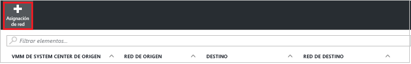

# Replicación de máquinas virtuales de Hyper-V (en nubes VMM) en un sitio de VMM secundario mediante el Portal de Azure
> [!div class="op_single_selector"]
> * [Portal de Azure](site-recovery-vmm-to-vmm.md)
> * [Portal clásico](site-recovery-vmm-to-vmm-classic.md)
> * [PowerShell: administrador de recursos](site-recovery-vmm-to-vmm-powershell-resource-manager.md)
>
>

En este artículo se describe cómo replicar máquinas virtuales de Hyper-V locales administradas en nubes System Center Virtual Machine Manager (VMM) en un sitio secundario mediante [Azure Site Recovery](site-recovery-overview.md) en Azure Portal. Aprenda más sobre la [arquitectura de este escenario](site-recovery-components.md).

Publique cualquier comentario que tenga en la parte inferior de este artículo, o bien en el [foro de Azure Recovery Services](https://social.msdn.microsoft.com/forums/azure/home?forum=hypervrecovmgr).

## Requisitos previos

**Requisito previo** | **Detalles**
--- | ---
**Las tablas de Azure** | Necesita una cuenta de [Microsoft Azure](http://azure.microsoft.com/) . Puede comenzar con una [evaluación gratuita](https://azure.microsoft.com/pricing/free-trial/). [Más información](https://azure.microsoft.com/pricing/details/site-recovery/) sobre los precios de Site Recovery.
**VMM local** | Se recomienda disponer de dos servidores VMM, uno en el sitio principal y otro en el secundario.   Puede replicar entre nubes en un único servidor VMM.   Los servidores VMM deben estar ejecutando, como mínimo, System Center 2012 SP1 con las actualizaciones más recientes.   Los servidores VMM necesitan acceso a Internet.
**Nubes VMM** | Cada servidor VMM debe tener una o más nubes y todas ellas deben tener definido el perfil de capacidad de Hyper-V.   Las nubes deben incluir uno o más grupos de hosts de VMM.   Si solo tiene un servidor VMM, necesita al menos dos nubes, para que actúen como principal y secundaria.
**Hyper-V** | Los servidores Hyper-V deben estar ejecutando, como mínimo, Windows Server 2012 con el rol Hyper-V y tener instaladas las actualizaciones más recientes.   Un servidor de Hyper-V debe contener una o varias máquinas virtuales.    Los servidores host de Hyper-V deben estar ubicados en grupos host de las nubes de VMM principal y secundaria.   Si ejecuta Hyper-V en un clúster con Windows Server 2012 R2, instale la [actualización 2961977](https://support.microsoft.com/kb/2961977).   Si ejecuta Hyper-V en un clúster con Windows Server 2012, el agente de clúster no se crea automáticamente si tiene un clúster basado en una dirección IP estática. Configúrelo manualmente. [Más información](http://social.technet.microsoft.com/wiki/contents/articles/18792.configure-replica-broker-role-cluster-to-cluster-replication.aspx).   Los servidores de Hyper-V necesitan acceso a Internet.
**URLs** | Los servidores VMM y los hosts de Hyper-V deben tener acceso a estas direcciones URL:   [!INCLUDE [site-recovery-URLS](../../includes/site-recovery-URLS.md)]

## Pasos de implementación

Se debe hacer lo siguiente:

1. Compruebe los requisitos previos.
2. Prepare el servidor VMM y los hosts de Hyper-V.
3. Cree un almacén de Recovery Services. El almacén contiene valores de configuración y organiza la replicación.
4. Especifique la configuración de origen, destino y replicación.
5. Implemente el servicio de movilidad en las máquinas virtuales que desee replicar.
6. Prepare la replicación y habilítela para máquinas virtuales de Hyper-V.
7. Ejecute una conmutación por error de prueba para asegurarse de que todo funcione de la forma esperada.

## Preparación de servidores VMM y hosts de Hyper-V

Para prepararse para la implementación:

1. Asegúrese de que el servidor VMM y los hosts de Hyper-V cumplan los requisitos previos descritos antes y que pueda acceder a las direcciones URL necesarias.
2. Configure las redes VMM para poder configurar la [asignación de red](#network-mapping-overview).

    - Asegúrese de que las máquinas virtuales del servidor host de Hyper-V de origen estén conectadas a una red de máquinas virtuales de VMM. Esa red debe estar vinculada a una red lógica asociada con la nube.
    Compruebe que la nube secundaria que se va a utilizar para la recuperación tenga configurada una red de VM correspondiente. Dicha red de máquina virtual debe estar vinculada a una red lógica asociada con la nube secundaria.

3. Prepárese para una [implementación de un solo servidor](#single-vmm-server-deployment), si desea replicar máquinas virtuales entre nubes en el mismo servidor VMM.

## Creación de un almacén de Servicios de recuperación
1. Inicie sesión en el [Portal de Azure](https://portal.azure.com).
2. Haga clic en **Nuevo** > **Administración** > **Recovery Services**.
3. En **Nombre**, especifique un nombre descriptivo para identificar el almacén. Si tiene más de una suscripción, seleccione una de ellas.
4. [Cree un grupo de recursos](../azure-resource-manager/resource-group-template-deploy-portal.md)o seleccione uno existente. Especifique una región de Azure. Las máquinas se replican en esta región. Para comprobar las regiones admitidas, consulte Disponibilidad geográfica en [Detalles de precios de Azure Site Recovery](https://azure.microsoft.com/pricing/details/site-recovery/)
5. Si quiere acceder rápidamente al almacén desde el panel, haga clic en **Anclar al panel** > **Crear almacén**.

    

El nuevo almacén aparece en **Panel**, en **Todos los recursos**, y en la hoja principal **Almacenes de Recovery Services**.

## Elección de un objetivo de protección

Seleccione aquello que desea replicar y la ubicación en donde se va a realizar la replicación.

2. Haga clic en **Site Recovery** > **Paso 1: Preparar la infraestructura** > **Objetivo de protección**.
3. Seleccione **Para sitio de recuperación** y seleccione **Sí, con Hyper-V**.
4. Seleccione **Sí** para indicar que usa VMM para administrar los hosts de Hyper-V.
5. Seleccione **Sí** si tiene un servidor VMM secundario. Si va a implementar la replicación entre nubes en un solo servidor VMM, haga clic en **No**. y, a continuación, haga clic en **Aceptar**.

    

## Configuración del entorno de origen

Instale el proveedor de Azure Site Recovery en servidores VMM, y detecte y registre servidores en el almacén.

1. Haga clic en **Paso 1: Preparar la infraestructura** > **Origen**.

    
2. En **Preparar origen**, haga clic en **+ VMM** para agregar un servidor VMM.

    
3. En **Agregar servidor**, compruebe que aparezca el **servidor VMM de System Center** en **Tipo de servidor** y que dicho servidor cumpla los [requisitos previos](#prerequisites).
4. Descargue el archivo de instalación del proveedor de Azure Site Recovery.
5. Descargue la clave de registro. Se le solicitará cuando ejecute el programa de instalación. La clave será válida durante cinco días a partir del momento en que se genera.

    
6. Instale el proveedor de Azure Site Recovery en el servidor VMM. No es necesario instalar explícitamente nada en los servidores host de Hyper-V.

### Instalación del proveedor de Azure Site Recovery

1. Ejecute el archivo de instalación del proveedor en cada servidor VMM. Si VMM está implementado en un clúster, siga este procedimiento la primera vez que instale:
    -  Instale el proveedor en un nodo activo y finalice la instalación para registrar el servidor VMM en el almacén.
    - A continuación, instale el proveedor en los demás nodos. Los nodos del clúster deben ejecutar la misma versión del proveedor.
2. El programa de instalación ejecuta algunas comprobaciones de requisitos previos y solicita permiso para detener el servicio VMM. El servicio VMM se reiniciará automáticamente cuando finalice la instalación. Si lo instala en un clúster VMM, se le pide que detenga el rol de clúster.
3. En **Microsoft Update**, puede participar para especificar que las actualizaciones del proveedor se instalen según las directivas de Microsoft Update.
4. En **Instalación**, acepte o modifique la ubicación predeterminada de instalación y haga clic en **Instalar**.

    
5. Cuando finalice la instalación, haga clic en **Registrar** para registrar el servidor en el almacén.

    
6. En **Nombre del almacén**, compruebe el nombre del almacén en el que se registrará el servidor. Haga clic en *Siguiente*.

    
7. En **Conexión a Internet**, especifique cómo se conecta a Azure el proveedor que se ejecuta en el servidor VMM.

    

   - Puede especificar que el proveedor debe conectarse a Internet directamente o a través de un proxy.
   - Especifique la configuración de proxy si es necesario.
   - Si utiliza un proxy, se crea automáticamente una cuenta de ejecución de VMM (DRAProxyAccount) que usa las credenciales de proxy especificadas. Configure el servidor proxy para que esta cuenta pueda autenticarse correctamente. Se puede modificar la configuración de la cuenta de ejecución en la consola VMM > **Configuración** > **Seguridad** > **Cuentas de ejecución**. Reinicie el servicio VMM para actualizar los cambios.
8. En **Clave de registro**, seleccione la clave que ha descargado de Azure Site Recovery y copiado en el servidor VMM.
9. La configuración de cifrado solo se usa cuando se está replicando VM de Hyper-V en nubes de VMM en Azure. Si se está replicando en un sitio secundario, no se usa.
10. En **Nombre del servidor**, especifique un nombre descriptivo para identificar el servidor VMM en el almacén. En una configuración de clúster, especifique el nombre del rol de clúster VMM.
11. En **Sincronizar metadatos en la nube** seleccione si quiere sincronizar los metadatos de todas las nubes del servidor VMM con el almacén. Esta acción solo se debe ejecutar una vez en cada servidor. Si no desea sincronizar todas las nubes, puede dejar este parámetro sin marcar y sincronizar cada nube individualmente en las propiedades de la nube de la consola de VMM.
12. Haga clic en **Next** para finalizar el proceso. Después del registro, la Recuperación del sitio de Azure recupera los metadatos del servidor VMM. El servidor se muestra en la pestaña **Servidores VMM** de la página **Servidores** del almacén.

    
13. Después de que el servidor esté disponible en la consola de Site Recovery, en **Origen** > **Preparar origen** , seleccione el servidor VMM y la nube en la que se encuentra el host Hyper-V. y, a continuación, haga clic en **Aceptar**.

También puede instalar el proveedor desde la línea de comandos:

[!INCLUDE [site-recovery-rw-provider-command-line](../../includes/site-recovery-rw-provider-command-line.md)]

## Configuración del entorno de destino

Seleccione el servidor VMM y la nube de destino.

1. Haga clic en **Preparar infraestructura** > **Destino** y seleccione el servidor VMM de destino que quiere usar.
2. Se mostrarán las nubes en el servidor que están sincronizadas con Site Recovery. Seleccione la nube de destino.

   

## Configuración de las opciones de replicación

- Cuando se crea una directiva de replicación, todos los hosts que la usan deben tener el mismo sistema operativo. La nube VMM puede contener hosts de Hyper-V que ejecutan versiones distintas de Windows Server, pero, en este caso, se necesitan varias directivas de replicación.
- Puede llevar a cabo la replicación inicial sin conexión. [Más información](#prepare-for-initial-offline-replication)

1. Para crear una nueva directiva de replicación, haga clic en **Preparar infraestructura** > **Configuración de la replicación** > **+Crear y asociar**.

    
2. En **Crear y asociar directiva**, especifique un nombre de directiva. El tipo de origen y destino debe ser **Hyper-V**.
3. En **Versión del host de Hyper-V** , seleccione qué sistema operativo se ejecuta en el host.
4. En **Tipo de autenticación** y **Puerto de autenticación**, especifique cómo se autentica el tráfico entre los servidores host Hyper-V principal y secundario. Seleccione **Certificado** , a menos que tenga un entorno Kerberos activo. Azure Site Recovery configurará automáticamente los certificados para la autenticación de HTTPS. No es necesario hacer nada manualmente. De forma predeterminada, se abrirán los puertos 8083 y 8084 (para los certificados) en el Firewall de Windows en los servidores hosts de Hyper-V. Si selecciona **Kerberos**, se usará un vale de Kerberos para la autenticación mutua de los servidores host. Observe que esta configuración solo es pertinente para servidores host de Hyper-V que se ejecutan en Windows Server 2012 R2.
5. En **Frecuencia de copia**, especifique la frecuencia con la que desea replicar diferencias de datos después de la replicación inicial (cada 30 segundos, 5 o 15 minutos).
6. En **Retención de punto de recuperación**, especifique, en horas, el tiempo que estará disponible el período de retención para cada punto de recuperación. Los equipos protegidos se pueden recuperar en cualquier punto dentro de un período.
7. En **Frecuencia de instantánea coherente con la aplicación**especifique la frecuencia (entre 1 y 12 horas) con la que se crearán los puntos de recuperación que contengan las instantáneas coherentes con la aplicación. Hyper-V usa dos tipos de instantáneas, una instantánea estándar que proporciona una instantánea incremental de toda la máquina virtual y una instantánea coherente con la aplicación que toma una instantánea en un momento concreto de los datos de la aplicación dentro de la máquina virtual. Las instantáneas coherentes con la aplicación utilizan el Servicio de instantáneas de volumen (VSS) para asegurarse de que las aplicaciones se encuentren en un estado coherente cuando se captura la instantánea. S habilita las instantáneas coherentes con la aplicación, se verá afectado el rendimiento de aplicaciones que se ejecutan en las máquinas virtuales de origen. Asegúrese de que el valor establecido es menor que el número de puntos de recuperación adicionales configurados.
8. En **Compresión de transferencia de datos**, especifique si se deben comprimir los datos replicados que se transfieren.
9. Seleccione **Eliminar máquina virtual de réplica** para especificar que la máquina virtual de réplica debe eliminarse si se deshabilita la protección para la máquina virtual de origen. Si habilita esta configuración, cuando deshabilita la protección para la máquina virtual de origen, dicha máquina virtual se quita de la consola de Site Recovery, la configuración de Site Recovery de VMM se quita de la consola VMM y la réplica se elimina.
10. En **Método de replicación inicial** , si va a replicar a través de la red, especifique si iniciará la replicación inicial o la programará. Para ahorrar ancho de banda de red, puede que quiera programarla fuera de las horas punta. y, a continuación, haga clic en **Aceptar**.

     
11. Cuando se crea una nueva directiva se asocia automáticamente con la nube de VMM. En **Directiva de replicación**, haga clic en **Aceptar**. Puede asociar más nubes VMM (y las máquinas virtuales que contienen) a esta directiva de replicación en **Replicación** > nombre de directiva > **Associate VMM Cloud** (Asociar nube VMM).

     

### Configurar asignación de red

- Aprenda sobre la [asignación de red](#prepare-for-network-mapping) antes de empezar.
- Compruebe que las máquinas virtuales de los servidores VMM están conectadas a una red de máquina virtual.

1. En **Configuración** > **Infraestructura de Site Recovery** > **Asignación de red**Asignaciones de red, haga clic en **+Asignación de red**.

    
2. En la pestaña **Agregar asignación de red** , seleccione los servidores VMM de origen y destino. Se recuperan las redes de VM asociadas a los servidores VMM.
3. En **Red de origen**, seleccione la red que quiere utilizar de la lista de redes de máquina virtual asociadas con el servidor VMM principal.
4. En **Red de destino** , seleccione la red que quiere usar en el servidor VMM secundario. y, a continuación, haga clic en **Aceptar**.

    

Esto es lo que sucede cuando comienza la asignación de red:

* Todas las máquinas virtuales de réplica existentes que correspondan a la red de VM de origen se conectarán a la red de la VM de destino.
* Las nuevas máquinas virtuales que se conecten a la red de VM de origen se conectarán a la red asignada de destino después de la replicación.
* Si modifica una asignación existente a una nueva red, las máquinas virtuales de réplica se conectarán con la nueva configuración.
* Si la red de destino tiene varias subredes y una de estas subredes tiene el mismo nombre que la subred en la que se encuentra la máquina virtual de origen, la máquina virtual de réplica se conectará a esa subred de destino después de la conmutación por error. Si no hay ninguna subred de destino con un nombre coincidente, la máquina virtual se conectará a la primera subred de la red.

### Configure la asignación de almacenamiento.

No se admite la [asignación de almacenamiento](#prepare-for-storage-mapping) en la nueva versión de Azure Portal. Sin embargo, se puede habilitar con PowerShell. [Más información](site-recovery-vmm-to-vmm-powershell-resource-manager.md#step-7-configure-storage-mapping).

## Paso 5: Pleaneamiento de capacidad

Ahora que tiene la infraestructura básica configurada, planee la capacidad y averigüe si necesitará recursos adicionales.

- Descargue y ejecute [Azure Site Recovery Capacity Planner](site-recovery-capacity-planner.md) para recopilar información sobre su entorno de replicación, incluidas las máquinas virtuales, los discos por máquina virtual y el almacenamiento para cada disco.
- Después de recopilar información de replicación en tiempo real, puede modificar la directiva de NetQos para controlar el ancho de banda de replicación para máquinas virtuales. Lea más sobre la [limitación del tráfico de réplica de Hyper-V](http://www.thomasmaurer.ch/2013/12/throttling-hyper-v-replica-traffic/) en el blog de Thomas Maurer. Vea más información sobre el [cmdlet New-NetQosPolicy](https://technet.microsoft.com/library/hh967468.aspx.).

## Habilitar replicación

1. Haga clic en **Paso 2: Replicar la aplicación** > **Origen**. Después de habilitar la replicación por primera vez, haga clic en **+Replicar** en el almacén para habilitar la replicación de más máquinas.

    
2. En la hoja **Origen**, seleccione el servidor VMM y la nube donde se encuentran los hosts de Hyper-V que quiere replicar. y, a continuación, haga clic en **Aceptar**.

    
3. En **Destino**, compruebe el servidor VMM y la nube secundarios.
4. En **Máquinas virtuales**, seleccione las máquinas virtuales que quiere proteger de la lista.

    

Puede hacer un seguimiento del progreso de la acción **Habilitar protección** en **Trabajos** > **Trabajos de Site Recovery**. La máquina virtual está preparada para la conmutación por error una vez completado el trabajo de **Finalizar protección**.

Observe lo siguiente:

- También puede habilitar la protección de las máquinas virtuales en la consola VMM. Haga clic en la opción **Habilitar protección** de la barra de herramientas de las propiedades de la máquina virtual > pestaña **Azure Site Recovery**.
- Después de habilitar la replicación, puede ver las propiedades de la máquina virtual en **Elementos replicados**. En el panel de **información básica**, puede ver información sobre la directiva de replicación de la máquina virtual y su estado. Haga clic en **Propiedades** para obtener más información.

### Incorporación de máquinas virtuales existentes
Si tiene máquinas virtuales en VMM que se replican mediante Réplica de Hyper-V, puede incorporarlas a la replicación de Azure Site Recovery de la forma siguiente:

1. Asegúrese de que el servidor Hyper-V que hospeda la máquina virtual existente se encuentra en la nube principal y que el servidor de Hyper-V que hospeda la máquina virtual de réplica se encuentra en la nube secundaria.
2. Asegúrese de que hay una directiva de replicación configurada para la nube VMM principal.
3. Habilite la replicación para la máquina virtual principal. Azure Site Recovery y VMM garantizan que se detecta el mismo host de réplica y la misma máquina virtual, y Azure Site Recovery reutilizará y restablecerá la replicación mediante los valores configurados.

## Prueba de la implementación

Para probar la implementación, puede ejecutar una [conmutación por error de prueba](site-recovery-test-failover-vmm-to-vmm.md) para una sola máquina virtual o [crear un plan de recuperación](site-recovery-create-recovery-plans.md) que contenga una o varias máquinas virtuales.

## Preparación para la replicación inicial sin conexión

Puede realizar la replicación sin conexión para la copia de datos inicial. Para preparar esta operación, haga lo siguiente:

* En el servidor de origen, especifique una ubicación de ruta de acceso desde la que se llevará a cabo la exportación de datos. Asigne Control total a NTFS y Compartir permisos con el servicio VMM en la ruta de acceso de exportación. En el servidor de destino, especifique una ubicación de ruta de acceso desde la cual tendrá lugar la importación de datos. Asigne los mismos permisos en esta ruta de acceso de importación.
* Si se comparte la ruta de acceso de importación o exportación, asigne la pertenencia de grupo de administrador, usuario avanzado, operador de impresión o de operador de servidor a la cuenta de servicio de VMM en el equipo remoto en el que se encuentra el recurso compartido.
* Si utiliza cualquier cuenta de ejecución para agregar hosts, en las rutas de acceso de importación y exportación, asigne permisos de lectura y escritura a las cuentas de ejecución de VMM.
* Los recursos compartidos de importación y exportación no deben ubicarse en ningún equipo utilizado como servidor host de Hyper-V, porque la configuración de bucle invertido no es compatible con Hyper-V.
* En Active Directory en cada servidor host de Hyper-V que contiene máquinas virtuales que desea proteger, habilite y configure la delegación restringida para confiar en los equipos remotos en los que se ubican las rutas de acceso de importación y exportación, de la forma siguiente:
  1. En el controlador de dominio, abra **Usuarios y equipos de Active Directory**.
  2. En el árbol de consola, haga clic en **NombreDeDominio** > **Equipos**.
  3. Haga clic con el botón derecho en el nombre del servidor host de Hyper-V > **Propiedades**.
  4. En la pestaña **Delegación**, haga clic en **Confiar en este equipo para la delegación solo a los servicios especificados**.
  5. Haga clic en **Usar cualquier protocolo de autenticación**.
  6. Haga clic en **Agregar** > **Usuarios y equipos**.
  7. Escriba el nombre del equipo que hospeda la ruta de acceso de exportación y haga clic en **Aceptar**. En la lista de servicios disponibles, mantenga presionada la tecla CTRL y haga clic en **cifs** > **Aceptar**. Repita el proceso para el nombre del equipo que hospeda la ruta de acceso de importación. Repita según sea necesario para servidores host de Hyper-V adicionales.

## Preparar la asignación de red
La asignación de red se realiza entre las redes de VM de VMM en los servidores VMM principal y secundario con el fin de:

* Colocar óptimamente las máquinas virtuales de réplica en los hosts de Hyper-V secundarios tras la conmutación por error.
* Conecte las máquinas virtuales de réplica a las redes de máquina virtual adecuadas después de la conmutación por error.

Observe lo siguiente:
- La asignación de redes se puede configurar entre redes de máquinas virtuales en dos servidores VMM o en un único servidor VMM si el mismo servidor administra dos sitios.
- Cuando se configura correctamente la asignación y se habilita la replicación, se conectará una máquina virtual de la ubicación principal a una red y su réplica de la ubicación de destino se conectará a la red asignada.
- Si las redes se han configurado correctamente en VMM, al seleccionar una red de máquinas virtuales de destino durante la asignación de redes, se mostrará las nubes VMM de origen que utilizan la red de máquinas virtuales de origen, junto con las redes de máquinas virtuales de destino disponibles en las nubes de destino que se usan para la protección.
- Si la red de destino tiene varias subredes y una de estas subredes tiene el mismo nombre que la subred en la que se encuentra la máquina virtual de origen, la máquina virtual de réplica se conectará a esa subred de destino después de la conmutación por error. Si no hay ninguna subred de destino con un nombre coincidente, la máquina virtual se conectará a la primera subred de la red.

Este es un ejemplo para ilustrar este mecanismo. Vamos a utilizar una organización con dos ubicaciones en Nueva York y Chicago.

| **Ubicación** | **Servidor VMM** | **Redes de máquinas virtuales** | **Asignado a** |
| --- | --- | --- | --- |
| Nueva York |VMM-NewYork |VMNetwork1-NewYork |Asignado a VMNetwork1-Chicago |
| VMNetwork2-NewYork |No asignado | | |
| Chicago |VMM-Chicago |VMNetwork1-Chicago |Asignado a VMNetwork1-NewYork |
| VMNetwork2-Chicago |No asignado | | |

Con este ejemplo:

* Cuando se crea una máquina virtual de réplica para cualquier máquina virtual que está conectada a VMNetwork1-NewYork, se conectará a VMNetwork1-Chicago.
* Cuando se crea una máquina virtual de réplica para VMNetwork2-NewYork o VMNetwork2-Chicago, no se conectará a ninguna red.

Aquí es cómo se configuran las nubes de VMM en nuestra organización de ejemplo y las redes lógicas asociadas a las nubes.

### Configuración de la protección de la nube
| **Nube protegida** | **Proteger nube** | **Red lógica (Nueva York)** |
| --- | --- | --- |
| GoldCloud1 |GoldCloud2 | |
| SilverCloud1 |SilverCloud2 | |
| GoldCloud2 |
N/D

 |
LogicalNetwork1-NewYork

LogicalNetwork1-Chicago
 |
| SilverCloud2 |
N/D

 |
LogicalNetwork1-NewYork

LogicalNetwork1-Chicago
 |

### Configuración de la red lógica y máquinas virtuales
| **Ubicación** | **Red lógica** | **Red de VM asociada** |
| --- | --- | --- |
| Nueva York |LogicalNetwork1-NewYork |VMNetwork1-NewYork |
| Chicago |LogicalNetwork1-Chicago |VMNetwork1-Chicago |
| LogicalNetwork2Chicago |VMNetwork2-Chicago | |

### Redes de destino
Según esta configuración, cuando selecciona la red de máquinas virtuales de destino, en la siguiente tabla se muestran las opciones que estarán disponibles.

| **Selección** | **Nube protegida** | **Proteger nube** | **Red de destino disponible** |
| --- | --- | --- | --- |
| VMNetwork1-Chicago |SilverCloud1 |SilverCloud2 |Disponible |
| GoldCloud1 |GoldCloud2 |Disponible | |
| VMNetwork2-Chicago |SilverCloud1 |SilverCloud2 |No disponible |
| GoldCloud1 |GoldCloud2 |Disponible | |

### Conmutación por recuperación
Para ver lo que ocurre en el caso de conmutación por recuperación (replicación inversa), supongamos que VMNetwork1-NewYork se asigna a VMNetwork1-Chicago, con la siguiente configuración.

| **Máquina virtual** | **Conectada a la red de VM** |
| --- | --- |
| VM1 |VMNetwork1-Network |
| VM2 (réplica de VM1) |VMNetwork1-Chicago |

Con esta configuración, revisemos lo que ocurre en un par de escenarios posibles.

| **Escenario** | **Resultado** |
| --- | --- |
| Sin cambios en las propiedades de red de VM-2 después de la conmutación por error. |VM-1 sigue estando conectada a la red de origen |
| Las propiedades de red de VM-2 cambian después de la conmutación por error y está desconectada. |VM-1 se desconecta. |
| Las propiedades de red de VM-2 cambian después de la conmutación por error y está conectada a VMNetwork2-Chicago. |Si no está asignada VMNetwork2-Chicago, se desconectará VM-1. |
| Se cambia la asignación de redes de VMNetwork1-Chicago. |VM-1 se conectará a la red ahora asignada a VMNetwork1-Chicago. |

## Preparación para la implementación de un solo servidor

Si solo tiene un servidor VMM, puede replicar las máquinas virtuales de hosts de Hyper-V de la nube VMM en [Azure](site-recovery-vmm-to-azure.md) o en una nube VMM secundaria. Se recomienda la primera opción porque la replicación entre nubes no es perfecta. Si desea replicar entre nubes, puede replicar con un único servidor VMM independiente o con un solo servidor VMM implementado en un clúster de Windows extendido.

### Servidor VMM independiente

En este escenario, se implementa un solo servidor VMM como máquina virtual en el sitio principal y se replica esta última en uno secundario mediante Site Recovery y Réplica de Hyper-V.

1. **Configurar VMM en una máquina virtual Hyper-V**. Se recomienda colocar la instancia de SQL Server que usa VMM en la misma máquina virtual. Esto permite ahorrar tiempo, ya que solo se tiene que crear una máquina virtual. Si quiere usar una instancia remota de SQL Server y se produce una interrupción, necesita recuperar esa instancia para poder recuperar VMM.
2. **Asegúrese de que el servidor VMM tenga al menos dos nubes configuradas**. Una nube contendrá las máquinas virtuales que desee replicar y la otra nube actuará como la ubicación secundaria. La nube que contenga las máquinas virtuales que quiere proteger debe cumplir una serie de [requisitos previos](#prerequisites).
3. Configure Site Recovery tal como se describe en este artículo. Cree y registre el servidor VMM en un almacén, configure una directiva de replicación y habilite la replicación. Los nombres de VMM de origen y de destino serán iguales. Especifique que la replicación inicial tendrá lugar a través de la red.
4. Al configurar la asignación de red, se asigna la red de VM para la nube principal a la red de VM para la nube secundaria.
5. En la consola de administrador de Hyper-V, habilite la réplica de Hyper-V en el host de Hyper-V que contiene la máquina virtual de VMM y habilite la replicación en la máquina virtual. Asegúrese de no agregar la máquina virtual VMM a las nubes que están protegidas por Site Recovery para garantizar que la configuración de la réplica de Hyper-V no la invalide Site Recovery.
6. Si crea planes de recuperación para la conmutación por error, se usa el mismo servidor VMM de origen y de destino.
7. En una interrupción completa, se conmuta por error y se recupera de la siguiente forma:

   1. Ejecute una conmutación por error no planeada en la consola de administrador de Hyper-V del sitio secundario para conmutar la máquina virtual VMM principal al sitio secundario.
   2. Compruebe que la máquina virtual VMM esté en funcionamiento y, en el almacén, ejecute una conmutación por error no planeada para conmutar por error las máquinas virtuales de las nubes principales a las secundarias. Confirme la conmutación por error y seleccione un punto de recuperación alternativo, si es necesario.
   3. Una vez completada la conmutación por error no planeada, se podrá acceder a todos los recursos de nuevo desde el sitio primario.
   4. Cuando el sitio principal está disponible de nuevo, en la consola de administrador de Hyper-V en el sitio secundario, habilite la replicación inversa para la máquina virtual VMM. Esto inicia la replicación de la máquina virtual del sitio secundario al principal.
   5. Ejecute una conmutación por error planeada en la consola de administrador de Hyper-V del sitio secundario para conmutar la máquina virtual VMM al sitio principal. Confirme la conmutación por error. Después, habilite la replicación inversa para que la máquina virtual VMM se vuelva a replicar del sitio principal al secundario.
   6. En el almacén de Servicios de recuperación, habilite la replicación inversa para las máquinas virtuales de carga de trabajo e iniciar la replicación del sitio secundario al principal.
   7. En el almacén de Servicios de recuperación, ejecute una conmutación por error planeada para conmutar las máquinas virtuales de carga de trabajo al sitio principal. Confirme la conmutación por error para finalizarla. A continuación, habilite la replicación inversa para iniciar la replicación de las máquinas virtuales de carga de trabajo del sitio principal al secundario.

### Clúster de VMM estirado

En lugar de implementar un servidor VMM independiente como máquina virtual que se replica en un sitio secundario, puede hacer que VMM esté altamente disponible mediante su implementación como máquina virtual en un clúster de conmutación por error de Windows. De esta forma, se garantiza la resistencia de las cargas de trabajo y la protección frente a los errores del hardware. Para efectuar una implementación con Site Recovery, la VM de VMM debe implementarse en un clúster extendido en sitios separados geográficamente. Para ello, siga estos pasos:

1. Instale VMM en una máquina virtual en un clúster de conmutación por error de Windows y seleccione la opción de ejecución del servidor de alta disponibilidad durante la instalación.
2. La instancia de SQL Server usada por VMM se debe replicar con grupos de disponibilidad AlwaysOn de SQL Server para que haya una réplica de la base de datos en el sitio secundario.
3. Siga las instrucciones de este artículo para crear un almacén, registrar el servidor y configurar la protección. Debe registrar cada servidor VMM del clúster en el almacén de Servicios de recuperación. Para ello, instale el proveedor en un nodo activo y registre el servidor VMM. Después, instale el proveedor en los demás nodos.
4. Si se produce alguna interrupción, el servidor VMM y su base de datos de SQL Server correspondiente se conmutan por error y se accede a ellos desde el sitio secundario.

## Preparación de la asignación de almacenamiento

Configure la asignación de almacenamiento asignando clasificaciones de almacenamiento en servidores VMM de origen y destino para realizar las siguientes acciones:

  * **Identificación del almacenamiento de destino para máquinas virtuales de réplica**: se replicará un disco duro de máquina virtual de origen en el almacenamiento que especificó (recurso compartido SMB o volúmenes compartidos de clúster [CSV]) en la ubicación de destino.
  * **Colocación de máquinas virtuales de réplica**: la asignación de almacenamiento se usa para colocar máquinas virtuales de réplica en los servidores host de Hyper-V de forma óptima. Las máquinas virtuales de réplica se colocarán en hosts que pueden tener acceso a las redes de almacenamiento asignadas.
  * **Sin asignación de redes**: si no configura la asignación de almacenamiento, las máquinas virtuales se replicarán en la ubicación de almacenamiento predeterminada especificada en el servidor host de Hyper-V asociado a la máquina virtual de réplica.

Observe lo siguiente:
- Puede configurar la asignación entre dos nubes VMM en un solo servidor.
- Las clasificaciones de almacenamiento deben estar disponibles para los grupos host ubicados en nubes de origen y de destino.
- Las clasificaciones no necesitan tener el mismo tipo de almacenamiento. Por ejemplo, puede asignar una clasificación de origen que contenga recursos compartidos de SMB a una clasificación de destino que contenga CSV.

### Ejemplo
Si las clasificaciones están configuradas correctamente en VMM, al seleccionar el servidor VMM de origen y de destino durante la asignación de almacenamiento, se mostrarán las clasificaciones de origen y de destino. Este es un ejemplo de recursos compartidos de archivos de almacenamiento y clasificaciones para una organización con dos ubicaciones en Nueva York y Chicago.

| **Ubicación** | **Servidor VMM** | **Recurso compartido de archivos (origen)** | **Clasificación (origen)** | **Asignado a** | **Recurso compartido de archivos (destino)** |
| --- | --- | --- | --- | --- | --- |
| Nueva York |VMM_Source |SourceShare1 |GOLD |GOLD_TARGET |TargetShare1 |
| SourceShare2 |SILVER |SILVER_TARGET |TargetShare2 | | |
| SourceShare3 |BRONZE |BRONZE_TARGET |TargetShare3 | | |
| Chicago |VMM_Target | |GOLD_TARGET |No asignado | |
|  |SILVER_TARGET |No asignado | | | |
|  |BRONZE_TARGET |No asignado | | | |

Con este ejemplo:

* Si se crea una máquina virtual de réplica para cualquier máquina virtual en almacenamiento GOLD (SourceShare1), se replicará en un almacenamiento GOLD_TARGET (TargetShare1).
* Cuando se crea una máquina virtual de réplica para cualquier máquina virtual en almacenamiento SILVER (SourceShare2), se replicará en un almacenamiento SILVER_TARGET (TargetShare2) y así sucesivamente.

### Múltiples cuentas de almacenamiento
Si la clasificación de destino se asigna a varios recursos compartidos de SMB o CSV, se selecciona automáticamente la ubicación de almacenamiento óptima cuando la máquina virtual está protegida. Si no hay disponible ningún almacenamiento de destino adecuado con la clasificación especificada, la ubicación de almacenamiento predeterminada especificada en el host de Hyper-V se utiliza para colocar los discos duros virtuales de réplica.

En la tabla siguiente se muestra cómo están configurados la clasificación de almacenamiento y los volúmenes compartidos de clúster en nuestro ejemplo.

| **Ubicación** | **Clasificación** | **Almacenamiento asociada** |
| --- | --- | --- |
| Nueva York |GOLD |
C:\ClusterStorage\SourceVolume1

\\FileServer\SourceShare1
 |
| SILVER |
C:\ClusterStorage\SourceVolume2

\\FileServer\SourceShare2
 | |
| Chicago |GOLD_TARGET |
C:\ClusterStorage\TargetVolume1

\\FileServer\TargetShare1
 |
| SILVER_TARGET |
C:\ClusterStorage\TargetVolume2

\\FileServer\TargetShare2
 | |

Esta tabla resume el comportamiento cuando se habilita la protección para las máquinas virtuales (VM1 - VM5) en este entorno de ejemplo.

| **Máquina virtual** | **Almacenamiento de origen** | **Clasificación de origen** | **Almacenamiento de destino asignado** |
| --- | --- | --- | --- |
| VM1 |C:\ClusterStorage\SourceVolume1 |GOLD |
C:\ClusterStorage\SourceVolume1

\\\FileServer\SourceShare1

Ambos GOLD_TARGET
 |
| VM2 |\\FileServer\SourceShare1 |GOLD |
C:\ClusterStorage\SourceVolume1

\\FileServer\SourceShare1
 
Ambos GOLD_TARGET
 |
| VM3 |C:\ClusterStorage\SourceVolume2 |SILVER |
C:\ClusterStorage\SourceVolume2

\FileServer\SourceShare2
 |
| VM4 |\FileServer\SourceShare2 |SILVER |
C:\ClusterStorage\SourceVolume2

\\FileServer\SourceShare2

Ambos SILVER_TARGET
 |
| VM5 |C:\ClusterStorage\SourceVolume3 |N/D |No hay ninguna asignación, por lo que se usa la ubicación de almacenamiento predeterminada del host de Hyper-V. |

### Información general sobre la privacidad de los datos

En esta tabla se resume cómo se almacenan los datos en este escenario:

- - -
| Acción | **Detalles** | **Datos recopilados** | **Uso** | **Obligatorio** |
| --- | --- | --- | --- | --- |
| **Registro** | Registra un servidor VMM en un almacén de Servicios de recuperación. Si más tarde desea anular el registro de un servidor, puede hacerlo eliminando la información de este en el Portal de Azure. | Después de que se registra un servidor VMM, Site Recovery recopila, procesa y transfiere metadatos sobre el servidor VMM y los nombres de las nubes VMM detectadas. | Los datos se utilizan para identificar el servidor VMM adecuado y comunicarse con él, y para configurar las nubes VMM correctas. | Esta característica es necesaria. Si no desea enviar esta información a Site Recovery, no utilice dicho servicio. |
| **Habilitar replicación** | El proveedor de Azure Site Recovery se instala en el servidor VMM y es el conducto para la comunicación con el servicio Site Recovery. El proveedor es una biblioteca de vínculos dinámicos (DLL) que se hospeda en el proceso VMM. Después de instalar el proveedor, se habilita la característica "Datacenter Recovery" en la consola de administrador de VMM. Se puede habilitar esta característica en las máquinas virtuales nuevas y existentes para estar protegidas. |Con esta propiedad establecida, el proveedor envía el nombre y el identificador de la máquina virtual a Site Recovery.  La replicación se habilita mediante la réplica de Hyper-V de Windows Server 2012 o Windows Server 2012 R2. Los datos de la máquina virtual se replican de un host de Hyper-V a otro (normalmente se encuentran en un centro de datos de "recuperación" diferente). |Site Recovery usa los metadatos para rellenar la información de la máquina virtual en el Portal de Azure. | Esta característica es una parte esencial del servicio y no se puede desactivar. Si no desea enviar esta información, no habilite la protección de Site Recovery para máquinas virtuales. Tenga en cuenta que todos los datos que envía el proveedor a Site Recovery es través de HTTPS. |
| **Plan de recuperación** | Los planes de recuperación le ayudan a crear un plan de orquestación para el centro de datos de recuperación. Puede definir el orden en el que se deben iniciar las máquinas virtuales, o un grupo de ellas, en el sitio de recuperación. También puede especificar los scripts automatizados que se pueden ejecutar, o cualquier acción manual que se debe emprender, en el momento de la recuperación para cada máquina virtual. Normalmente se activa la conmutación por error en el nivel del plan de recuperación para la recuperación coordinada. | Site Recovery recopila, procesa y transmite los metadatos para el plan de recuperación, incluidos los metadatos de la máquina virtual y los metadatos de todos los scripts de automatización y las notas de la acción manual. |Los metadatos se utilizan para crear el plan de recuperación en el Portal de Azure. |Esta característica es una parte esencial del servicio y no se puede desactivar. Si no desea enviar esta información a Site Recovery, no cree planes de recuperación. |
| **Asignación de red** | Permite asignar la información de red del centro de datos principal al centro de datos de recuperación. Cuando se recuperan máquinas virtuales en el sitio de recuperación, la asignación de red ayuda a establecer la conectividad de red. |Site Recovery recopila, procesa y transmite los metadatos de las redes lógicas de cada sitio (principal y centro de datos). |Los metadatos se usan para rellenar la configuración de red de modo que pueda asignar la información de red. | Esta característica es una parte esencial del servicio y no se puede desactivar. Si no desea enviar esta información a Site Recovery, no utilice la asignación de red. |
| **Conmutación por error (planeada o no planeada y prueba)** | Se produce un error en la conmutación por error en las máquinas virtuales entre un centro de datos administrado por VMM y otro. La acción de conmutación por error se desencadena manualmente en el Portal de Azure. |Site Recovery notifica al proveedor en el servidor VMM el evento de conmutación por error y este ejecuta una acción de conmutación por error en el host de Hyper-V mediante interfaces de VMM. La conmutación por error real de una máquina virtual se realiza de un host de Hyper-V a otro y se administra mediante la réplica de Hyper-V de Windows Server 2012 o Windows Server 2012 R2. Site Recovery usa la información enviada para rellenar el estado de la información de acción de conmutación por error en Azure Portal. | Esta característica es una parte esencial del servicio y no se puede desactivar. Si no desea enviar esta información a Site Recovery, no utilice la conmutación por error. |

## Pasos siguientes

Después de probar la implementación, aprenda más sobre otros tipos de [conmutación por error](site-recovery-failover.md).
