# <a name="create-and-query-an-azure-sql-data-warehouse-in-the-azure-portal"></a>Creación de una instancia de Azure SQL Data Warehouse en Azure Portal, y realización de consultas en ella

Cree rápidamente una instancia de Azure SQL Data Warehouse en Azure Portal, y realice consultas en ella.

Si no tiene una suscripción a Azure, cree una cuenta [gratuita](https://azure.microsoft.com/free/) antes de empezar.

## <a name="before-you-begin"></a>Antes de empezar

Descargue e instale la versión más reciente de [SQL Server Management Studio](/sql/ssms/download-sql-server-management-studio-ssms.md) (SSMS).

## <a name="sign-in-to-the-azure-portal"></a>Inicie sesión en el Portal de Azure.

Inicie sesión en el [Portal de Azure](https://portal.azure.com/).

## <a name="create-a-data-warehouse"></a>Creación del almacenamiento de datos

Una instancia de Azure SQL Data Warehouse se crea con un conjunto definido de [recursos de proceso](performance-tiers.md). La base de datos se crea dentro de un [grupo de recursos de Azure](../azure-resource-manager/resource-group-overview.md) y en un [servidor lógico de Azure SQL](../sql-database/sql-database-features.md). 

Siga estos pasos para crear una instancia de SQL Data Warehouse que contiene los datos de ejemplo AdventureWorksDW. 

1. Haga clic en el botón **Nuevo** situado en la esquina superior izquierda de Azure Portal.

2. Seleccione **Bases de datos** en la página **Nuevo** y seleccione **SQL Data Warehouse** en **Destacados** en la página **Nuevo**.

    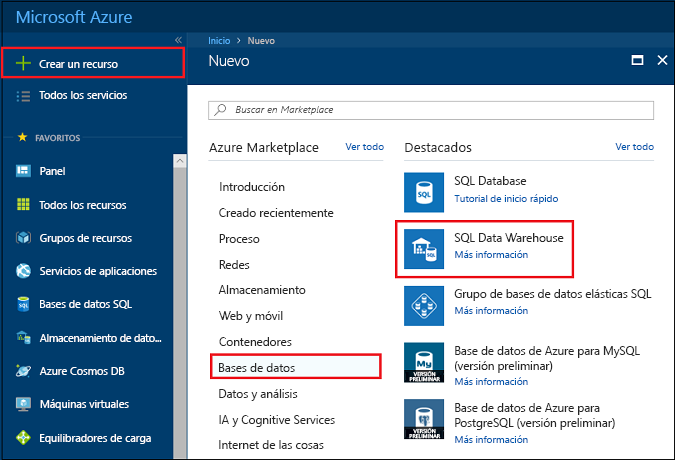

3. Rellene el formulario SQL Data Warehouse con la siguiente información:   

    | Configuración | Valor sugerido | Descripción | 
    | ------- | --------------- | ----------- | 
    | **Nombre de la base de datos** | mySampleDataWarehouse | Para conocer los nombres de base de datos válidos, consulte [Database Identifiers](/sql/relational-databases/databases/database-identifiers) (Identificadores de base de datos). Tenga en cuenta que un almacenamiento de datos es un tipo de base de datos.| 
    | **Suscripción** | Su suscripción  | Para más información acerca de sus suscripciones, consulte [Suscripciones](https://account.windowsazure.com/Subscriptions). |
    | **Grupos de recursos** | myResourceGroup | Para conocer cuáles son los nombres de grupo de recursos válidos, consulte el artículo [Naming conventions](https://docs.microsoft.com/azure/architecture/best-practices/naming-conventions) (Convenciones de nomenclatura). |
    | **Seleccionar origen** | Muestra | Especifica que se va a cargar una base de datos de ejemplo. Tenga en cuenta que un almacenamiento de datos es un tipo de base de datos. |
    | **Seleccionar ejemplo** | AdventureWorksDW | Especifica que se va a cargar la base de datos de ejemplo AdventureWorksDW.  |

    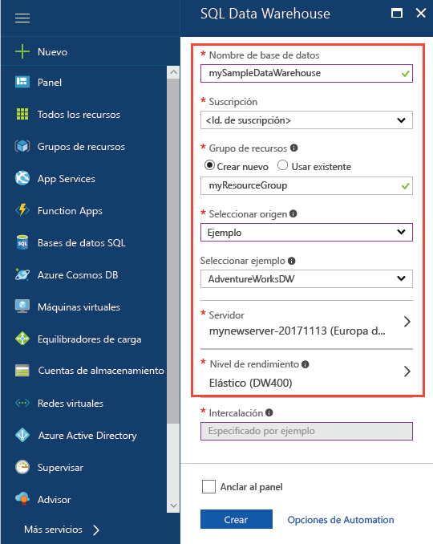

4. Haga clic en **Servidor** para crear y configurar un servidor nuevo para la nueva base de datos. Rellene el **formulario de servidor nuevo** con la siguiente información: 

    | Configuración | Valor sugerido | Descripción | 
    | ------------ | ------------------ | ------------------------------------------------- | 
    | **Nombre del servidor** | Cualquier nombre globalmente único | Para conocer cuáles son los nombres de servidor válidos, consulte el artículo [Naming conventions](https://docs.microsoft.com/azure/architecture/best-practices/naming-conventions) (Convenciones de nomenclatura). | 
    | **Inicio de sesión del administrador del servidor** | Cualquier nombre válido | Para conocer los nombres de inicio de sesión válidos, consulte [Database Identifiers](https://docs.microsoft.com/sql/relational-databases/databases/database-identifiers) (Identificadores de base de datos).|
    | **Password** | Cualquier contraseña válida | La contraseña debe tener un mínimo de ocho caracteres y debe contener caracteres de tres de las siguientes categorías: caracteres en mayúsculas, caracteres en minúsculas, números y caracteres no alfanuméricos. |
    | **Ubicación** | Cualquier ubicación válida | Para obtener información acerca de las regiones, consulte [Regiones de Azure](https://azure.microsoft.com/regions/). |

    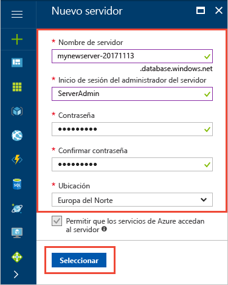

5. Haga clic en **Seleccionar**.

6. Haga clic en **Nivel de rendimiento** para especificar la configuración de rendimiento para el almacenamiento de datos.

7. Para este tutorial, seleccione el nivel de rendimiento **Optimizado para Elasticity**. De forma predeterminada, el control deslizante se establece en **DW400**.  Intente moverlo hacia arriba y hacia abajo para ver cómo funciona. 

    

8. Haga clic en **Apply**.

9. Una vez completado el formulario de SQL Database, haga clic en **Crear** para aprovisionar la base de datos. El aprovisionamiento tarda unos minutos. 

    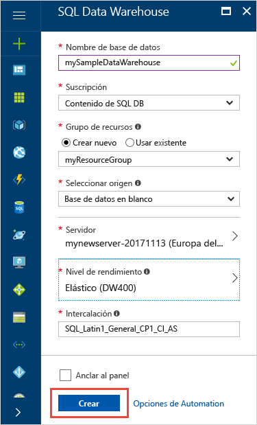

10. En la barra de herramientas, haga clic en **Notificaciones** para supervisar el proceso de implementación.
    
     

## <a name="create-a-server-level-firewall-rule"></a>Crear una regla de firewall de nivel de servidor

El servicio SQL Data Warehouse crea un firewall en el nivel de servidor, lo que impide que herramientas y aplicaciones externas se conecten al servidor o a las bases de datos del servidor. Para habilitar la conectividad, puede agregar reglas de firewall que habilitan la conectividad para direcciones IP concretas.  Siga estos pasos para crear una [regla de firewall de nivel de servidor](../sql-database/sql-database-firewall-configure.md) para la dirección IP del cliente. 

> [!NOTE]
> SQL Data Warehouse se comunica a través del puerto 1433. Si intenta conectarse desde una red corporativa, es posible que el firewall de la red no permita el tráfico saliente a través del puerto 1433. En ese caso, no puede conectarse al servidor de Azure SQL Database, salvo que el departamento de TI abra el puerto 1433.
>

1. Cuando se haya finalizado la implementación, haga clic en **Bases de datos SQL** en el menú de la izquierda y, después, haga clic en **mySampleDatabase** en la página **Bases de datos SQL**. Se abre la página de información general de la base de datos, que muestra el nombre completo del servidor (por ejemplo, **mynewserver-20171113.database.windows.net**) y proporciona opciones para otras configuraciones. 

2. Copie este nombre para conectarse a su servidor y a sus bases de datos en los inicios rápidos posteriores. Para abrir la configuración del servidor, haga clic en su nombre.

   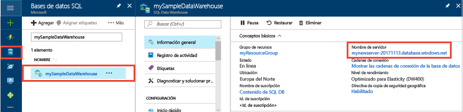 

3. Para abrir la configuración del servidor, 
4. haga clic en su nombre.

   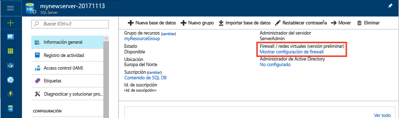 

5. Haga clic en **Mostrar configuración del firewall**. Se abrirá la página **Configuración del firewall** del servidor de SQL Database. 

   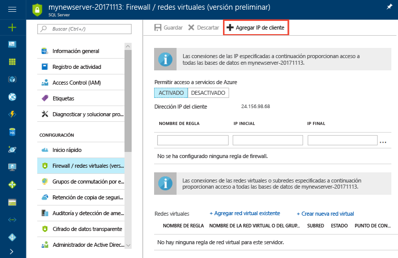 

4. Para agregar la dirección IP actual a la nueva regla de firewall, haga clic en **Agregar IP de cliente** en la barra de herramientas. La regla de firewall puede abrir el puerto 1433 para una única dirección IP o un intervalo de direcciones IP.

5. Haga clic en **Guardar**. Se crea una regla de firewall de nivel de servidor para el puerto 1433 de la dirección IP actual en el servidor lógico.

6. Haga clic en **Aceptar** y después cierre la página **Configuración de firewall**.

Ahora puede conectarse a SQL server y sus almacenamientos de datos mediante esta dirección IP. La conexión funciona desde SQL Server Management Studio u otra herramienta de su elección. Cuando se conecte, use la cuenta de ServerAdmin que creó anteriormente.  

> [!IMPORTANT]
> De forma predeterminada, el acceso a través del firewall de SQL Database está habilitado para todos los servicios de Azure. Haga clic en **DESACTIVAR** en esta página y luego haga clic en **Guardar** para deshabilitar el firewall para todos los servicios de Azure.

## <a name="get-the-fully-qualified-server-name"></a>Obtención del nombre completo del servidor

En Azure Portal encontrará el nombre completo del servidor SQL. Más adelante usará el nombre completo cuando se conecte al servidor.

1. Inicie sesión en el [Portal de Azure](https://portal.azure.com/).
2. Seleccione **SQL Database** en el menú de la izquierda y haga clic en la base de datos en la página **SQL Database**. 
3. En el panel **Essentials** de la página de Azure Portal de la base de datos, busque y copie el **nombre del servidor**. En este ejemplo, el nombre completo es mynewserver-20171113.database.windows.net. 

      

## <a name="connect-to-the-server-as-server-admin"></a>Conexión al servidor como administrador del mismo

En esta sección se usa [SQL Server Management Studio](/sql/ssms/download-sql-server-management-studio-ssms.md) (SSMS) para establecer una conexión con el servidor Azure SQL.

1. Abra SQL Server Management Studio.

2. En el cuadro de diálogo **Conectar con el servidor**, especifique la siguiente información:

   | Configuración       | Valor sugerido | Descripción | 
   | ------------ | ------------------ | ------------------------------------------------- | 
   | Tipo de servidor | Motor de base de datos | Este valor es obligatorio |
   | Nombre de servidor | Nombre completo del servidor | Este es un ejemplo: **mynewserver 20171113.database.windows.net**. |
   | Autenticación | Autenticación de SQL Server | Autenticación de SQL es el único tipo de autenticación que se ha configurado en este tutorial. |
   | Inicio de sesión | La cuenta de administrador del servidor | Es la cuenta que especificó cuando creó el servidor. |
   | Password | La contraseña de la cuenta de administrador del servidor | Es la contraseña que especificó cuando creó el servidor. |

    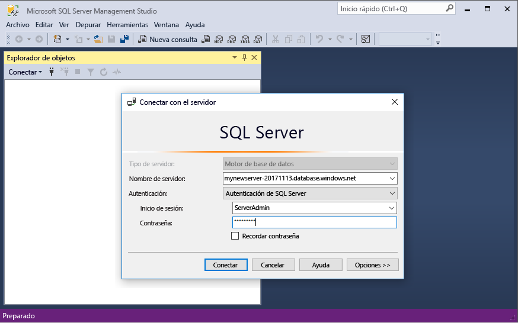

4. Haga clic en **Conectar**. Se abre la ventana del Explorador de objetos en SSMS. 

5. En el Explorador de objetos, expanda **Bases de datos**. Después, expanda **mySampleDatabase** para ver los objetos de la base de datos.

    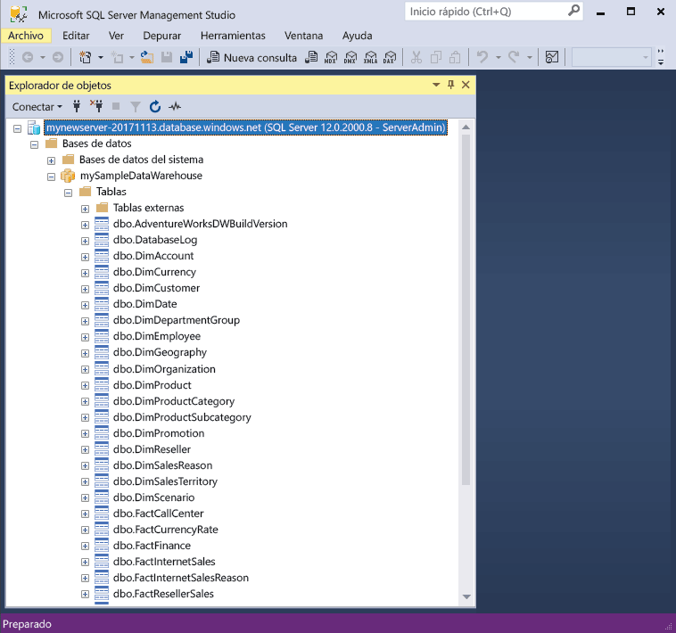 

## <a name="run-some-queries"></a>Ejecución de algunas consultas

SQL Data Warehouse utiliza T-SQL como lenguaje de consulta. Para abrir una ventana de consulta y ejecutar algunas consultas de T-SQL, siga estos pasos:

1. Haga clic con el botón derecho en **mySampleDataWarehouse** y seleccione **Nueva consulta**.  Se abre una nueva ventana de consulta.
2. En la ventana de consulta, escriba el siguiente comando para ver una lista de bases de datos.

    ```sql
    SELECT * FROM sys.databases
    ```

3. Haga clic en **Ejecutar**.  Los resultados de la consulta muestran dos bases de datos: **master** y **mySampleDataWarehouse**.

    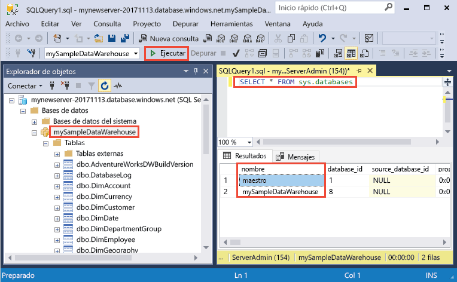

4. Para ver algunos datos, utilice el siguiente comando para ver el número de clientes cuyo apellido es Adams y que tienen tres hijos en casa. Los resultados muestran seis clientes. 

    ```sql
    SELECT LastName, FirstName FROM dbo.dimCustomer
    WHERE LastName = 'Adams' AND NumberChildrenAtHome = 3;
    ```

    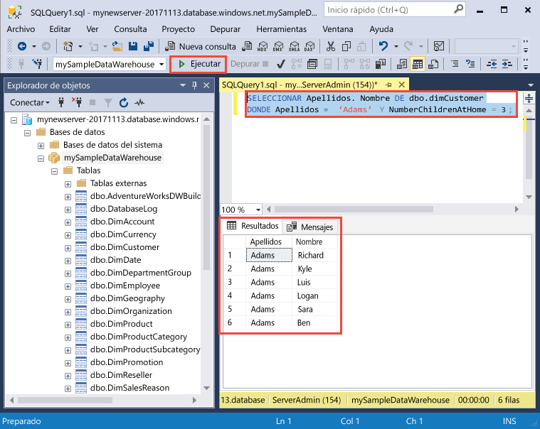

## <a name="clean-up-resources"></a>Limpieza de recursos

Se le está cobrando por unidades de almacenamiento de datos y por los datos almacenados en el almacenamiento de datos. Estos recursos de proceso y de almacenamiento se facturan por separado. 

- Si desea conservar los datos de almacenamiento, puede pausar el proceso cuando no está utilizando el almacenamiento de datos. Si se hace una pausa en el proceso, solo se carga el almacenamiento de datos. Puede reanudar el proceso siempre que esté listo para trabajar con los datos.
- Si desea quitar cobros futuros, puede eliminar el almacenamiento de datos. 

Siga estos pasos para limpiar los recursos según estime oportuno.

1. Inicie sesión en [Azure Portal](https://portal.azure.com) y haga clic en el almacenamiento de datos.

    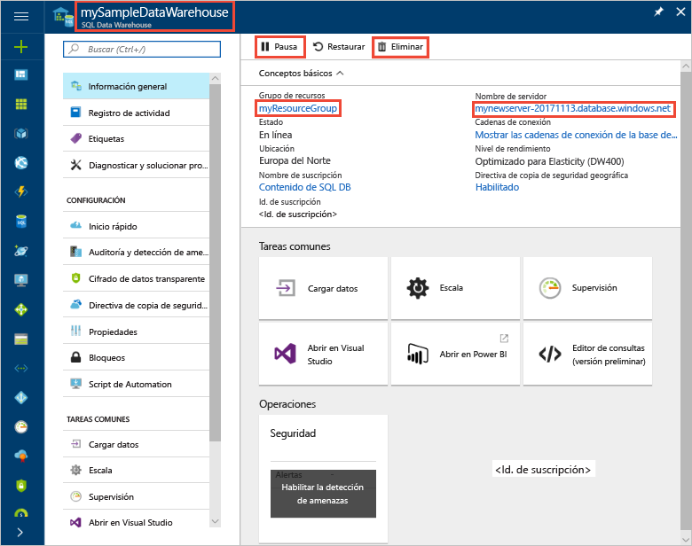

1. Para pausar el proceso, haga clic en el botón **Pausar**. Cuando el almacenamiento de datos se haya puesto en pausa, verá un botón **Iniciar**.  Para reanudar el proceso, haga clic en **Iniciar**.

2. Para quitar el almacenamiento de datos para que no se le cobre por proceso o almacenamiento, haga clic en **Eliminar**.

3. Para quitar el servidor SQL que creó, haga clic en **mynewserver-20171113.database.windows.net** en la imagen anterior y luego haga clic en **Eliminar**.  Debe tener cuidado con este procedimiento, ya que la eliminación del servidor elimina también todas las bases de datos asignadas al servidor.

4. Para quitar el grupo de recursos, haga clic en **myResourceGroup** y luego haga clic en **Eliminar grupo de recursos**.


## <a name="next-steps"></a>Pasos siguientes
Ahora ha creado un almacenamiento de datos, ha creado una regla de firewall, la ha conectado a su almacén de datos y ha ejecutado algunas consultas. Para más información sobre Azure SQL Data Warehouse, siga el tutorial para cargar los datos.
> [!div class="nextstepaction"]
>[Carga de datos en una instancia de SQL Data Warehouse](load-data-from-azure-blob-storage-using-polybase.md)