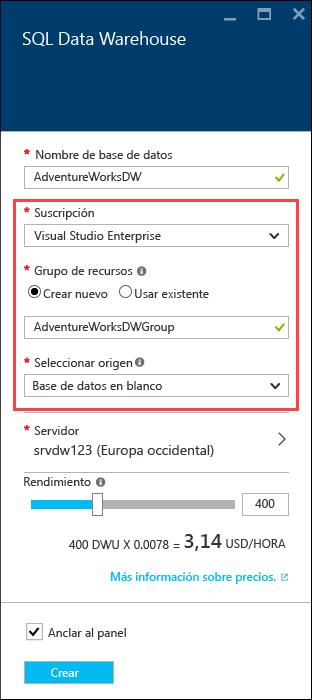
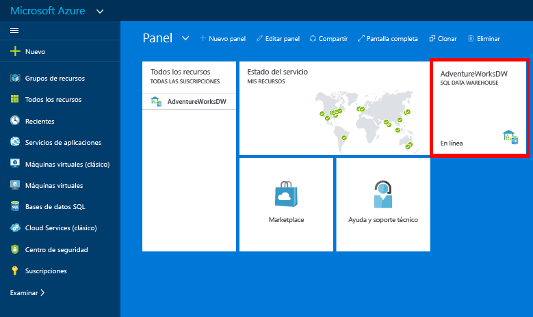

# Creación de una instancia de Almacenamiento de datos SQL de Azure
> [!div class="op_single_selector"]
> * [Azure Portal](sql-data-warehouse-get-started-provision.md)
> * [TSQL](sql-data-warehouse-get-started-create-database-tsql.md)
> * [PowerShell](sql-data-warehouse-get-started-provision-powershell.md)
>
>

En este tutorial se usa el Portal de Azure para crear una instancia de Almacenamiento de datos SQL que contiene la base de datos de ejemplo AdventureWorksDW.

## Requisitos previos
Para empezar, necesitará lo siguiente:

* **Cuenta de Azure**: visite las secciones sobre [evaluación gratuita de Azure][Azure Free Trial] o [Crédito mensual de MSDN de Azure][MSDN Azure Credits] para crear una cuenta.
* **Azure SQL Server**: consulte [Creación de una base de datos de Azure SQL con Azure Portal][Create an Azure SQL database in the Azure portal] para más información.

> [!NOTE]
> La creación de una instancia de Almacenamiento de datos SQL puede dar lugar a un nuevo servicio facturable.  Consulte [Precios de SQL Data Warehouse][SQL Data Warehouse pricing] para más información.
>
>

## Creación de Almacenamiento de datos SQL
1. Inicie sesión en el [Portal de Azure](https://portal.azure.com).
2. Haga clic en **+ Nuevo** > **Bases de datos** > **SQL Data Warehouse**.

    
3. En la hoja **Almacenamiento de datos SQL** , rellene la información necesaria y presione 'Crear' para crearlo.

    

   * **Servidor**: se recomienda que seleccione primero su servidor.  
   * **Nombre de la base de datos**: el nombre que se usa para hacer referencia a Almacenamiento de datos SQL.  Debe ser exclusivo en el servidor.
   * **Rendimiento**: se recomienda empezar con 400 [DWU][DWU]. Puede mover el control deslizante hacia la izquierda o la derecha para ajustar el rendimiento de su almacén de datos, o bien para reducirlo o escalarlo verticalmente una vez creado.  Para aprender más sobre las DWU, consulte la documentación sobre el [escalado](sql-data-warehouse-manage-compute-overview.md) o nuestra [página de precios][SQL Data Warehouse pricing].
   * **Suscripción**: seleccione la [suscripción] a la que se facturará esta instancia de Almacenamiento de datos SQL.
   * **Grupo de recursos**: los [grupos de recursos][Resource group] son contenedores diseñados para ayudarle a administrar una colección de recursos de Azure. Más información sobre los [grupos de recursos](../azure-resource-manager/resource-group-overview.md).
   * **Selección del origen**: haga clic en **Seleccionar origen** > **Ejemplo**. Azure rellena automáticamente la opción **Seleccionar muestra** con AdventureWorksDW.

   > [!NOTE]
   > La intercalación predeterminada para un Almacenamiento de datos SQL es SQL_Latin1_General_CP1_CI_AS. Si se necesita una intercalación distinta, puede utilizar [T-SQL][T-SQL] para crear la base de datos con otra intercalación.
   >
   >

1. Haga clic en **Crear** para crear su instancia de Almacenamiento de datos SQL.
2. Espere unos minutos. Cuando el almacén de datos está listo, debería volver al [Azure Portal](https://portal.azure.com). Encontrará Almacenamiento de datos SQL en el panel, entre las bases de datos SQL o en el grupo de recursos que usó para crearlo.

    

[!INCLUDE [SQL Database create server](../../includes/sql-database-create-new-server-firewall-portal.md)]

## Pasos siguientes
Ahora que ha creado una instancia de Almacenamiento de datos SQL, está listo para [conectarse](sql-data-warehouse-connect-overview.md) y empezar a realizar consultas.

Para cargar datos en Almacenamiento de datos SQL, consulte la [información general sobre la carga](sql-data-warehouse-overview-load.md).

Si está intentando migrar una base de datos existente a SQL Data Warehouse, consulte [ Información general sobre migración](sql-data-warehouse-overview-migrate.md) o use la [utilidad de migración](sql-data-warehouse-migrate-migration-utility.md).

Las reglas de firewall también se pueden configurar mediante Transact-SQL. Para más información, consulte [sp_set_firewall_rule][sp_set_firewall_rule] y [sp_set_database_firewall_rule][sp_set_database_firewall_rule].

También es una buena idea echar un vistazo a los [procedimientos recomendados][Best practices].

<!--Article references-->
[Create an Azure SQL database in the Azure portal]: ../sql-database/sql-database-get-started.md
[Create an Azure SQL database with PowerShell]: ../sql-database/sql-database-create-and-configure-database-powershell
[resource groups]: ../azure-resource-manager/resource-group-template-deploy-portal.md
[Best practices]: sql-data-warehouse-best-practices.md
[DWU]: sql-data-warehouse-overview-what-is.md
[suscripción]: ../azure-glossary-cloud-terminology.md#subscription
[resource group]: ../azure-glossary-cloud-terminology.md#resource-group
[T-SQL]: ./sql-data-warehouse-get-started-create-database-tsql.md

<!--MSDN references-->
[sp_set_firewall_rule]: https://msdn.microsoft.com/library/dn270017.aspx
[sp_set_database_firewall_rule]: https://msdn.microsoft.com/library/dn270010.aspx

<!--Other Web references-->
[SQL Data Warehouse pricing]: https://azure.microsoft.com/pricing/details/sql-data-warehouse/
[Azure Free Trial]: https://azure.microsoft.com/pricing/free-trial/?WT.mc_id=A261C142F
[MSDN Azure Credits]: https://azure.microsoft.com/pricing/member-offers/msdn-benefits-details/?WT.mc_id=A261C142F
