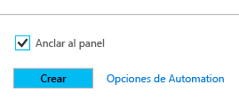
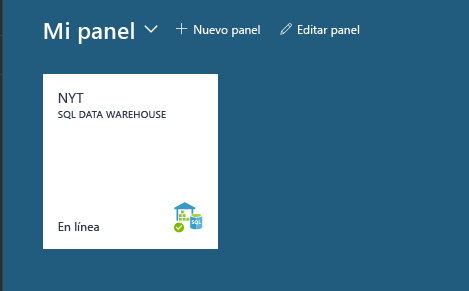
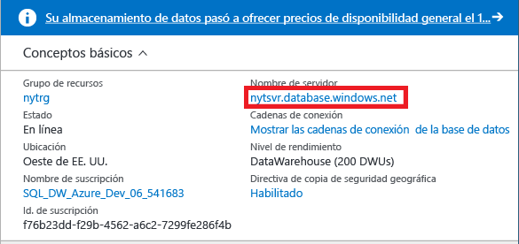
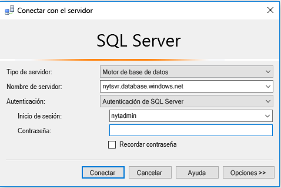
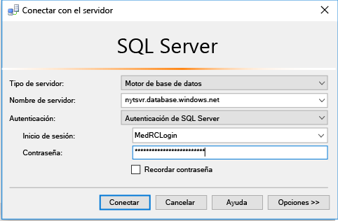
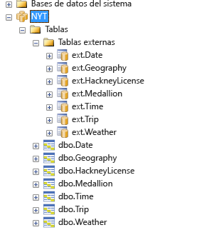
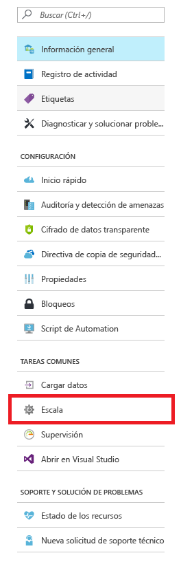
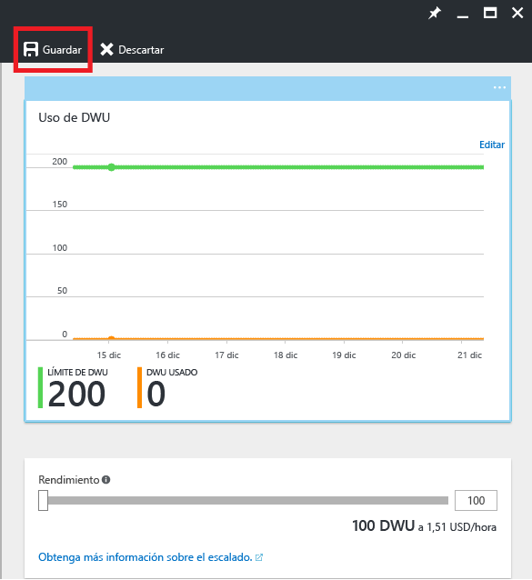

# <a name="get-started-with-sql-data-warehouse"></a>Introducción a SQL Data Warehouse

Este tutorial muestra cómo aprovisionar y cargar datos en Azure SQL Data Warehouse. También aprenderá los conceptos básicos sobre el escalado, la pausa y la optimización. Cuando haya terminado, estará preparado para consultar y explorar su almacenamiento de datos.

**Tiempo estimado para completarlo:** se trata de un tutorial completo que incluye código de ejemplo; se tarda aproximadamente 30 minutos en completarlo una vez cumplidos los requisitos previos. 

## <a name="prerequisites"></a>Requisitos previos

En el tutorial se da por hecho que está familiarizado con los conceptos básicos de SQL Data Warehouse. Si necesita una introducción, consulte [¿Qué es SQL Data Warehouse?](sql-data-warehouse-overview-what-is.md) 

### <a name="sign-up-for-microsoft-azure"></a>Suscribirse a Microsoft Azure
Si no dispone de ninguna cuenta de Microsoft Azure, deberá registrarse para utilizar este servicio. Si ya tiene una cuenta, puede omitir este paso. 

1. Vaya a las páginas de cuentas [https://azure.microsoft.com/account/](https://azure.microsoft.com/account/)
2. Cree una cuenta de Azure gratis o compre una cuenta.
3. Siga las instrucciones.

### <a name="install-appropriate-sql-client-drivers-and-tools"></a>Instalación de las herramientas y los controladores del cliente SQL adecuados

La mayoría de las herramientas del cliente SQL se pueden conectar a SQL Data Warehouse mediante JDBC, ODBC o ADO.NET. Debido al gran número de características de T-SQL que admite SQL Data Warehouse, algunas aplicaciones cliente no son totalmente compatibles con SQL Data Warehouse.

Si está ejecutando un sistema operativo Windows, se recomienda usar [Visual Studio] o [SQL Server Management Studio].

[!INCLUDE [Create a new logical server](../../includes/sql-data-warehouse-create-logical-server.md)] 

[!INCLUDE [SQL Database create server](../../includes/sql-database-create-new-server-firewall-portal.md)]

## <a name="create-a-sql-data-warehouse"></a>Creación de Almacenamiento de datos SQL

SQL Data Warehouse es un tipo especial de base de datos diseñado para el procesamiento paralelo masivo. La base de datos se distribuye en varios nodos y procesa las consultas en paralelo. SQL Data Warehouse tiene un nodo de control que orquesta las actividades de todos los nodos. Los propios nodos usan SQL Database para administrar los datos.  

> [!NOTE]
> La creación de una instancia de Almacenamiento de datos SQL puede dar lugar a un nuevo servicio facturable.  Para más información, consulte [Precios de Azure SQL Data Warehouse](https://azure.microsoft.com/pricing/details/sql-data-warehouse/).
>

### <a name="create-a-data-warehouse"></a>Creación del almacenamiento de datos

1. Inicie sesión en el [Portal de Azure](https://portal.azure.com).
2. Haga clic en **Nuevo** > **Bases de datos** > **SQL Data Warehouse**.

    
    

3. Rellene los detalles de la implementación

    **Nombre de la base de datos**: elija el que desee. Si tiene varios almacenamientos de datos, es aconsejable que los nombres incluyan detalles como su región, entorno, etc.; por ejemplo, *mydw-westus-1-test*.

    **Suscripción**: su suscripción a Azure

    **Grupo de recursos**: cree un grupo de recursos o seleccione uno existente.
    > [!NOTE]
    > Los grupos de recursos son útiles para realizar tareas de administración de recursos como el control de acceso y la implementación de plantillas. Consulte más información sobre los grupos de recursos de Azure [aquí](https://docs.microsoft.com/azure/azure-resource-manager/resource-group-overview#resource-groups).

    **Origen**: base de datos en blanco

    **Servidor**: seleccione el servidor que creó en los [Requisitos previos].

    **Intercalación**: mantenga la intercalación predeterminada: SQL_Latin1_General_CP1_CI_AS.

    **Select performance** (Seleccionar rendimiento): se recomienda mantener el estándar 400DWU.

4. Seleccione **Anclar al panel**
    

5. Póngase cómodo y espere a que el almacenamiento de datos se implemente. Lo normal es que este proceso tarde varios minutos. El portal le avisa cuando está el almacenamiento de datos está listo para usarse. 

## <a name="connect-to-sql-data-warehouse"></a>Conexión a Almacenamiento de datos SQL

Este tutorial usa SQL Server Management Studio (SSMS) para conectarse al almacenamiento de datos. Puede conectarse a SQL Data Warehouse a través de los siguientes conectores compatibles: ADO.NET, JDBC, ODBC y PHP. Recuerde que la funcionalidad podría ser limitada para herramientas no compatibles con Microsoft.


### <a name="get-connection-information"></a>Obtención de información sobre la conexión

Para conectarse a su almacenamiento de datos, debe conectarse mediante el servidor lógico de SQL Server que creó en los [Requisitos previos].

1. Seleccione su almacenamiento de datos en el panel o búsquelo en los recursos.

    

2. Busque el nombre completo del servidor lógico de SQL Server.

    

3. Abra SSMS y utilice el Explorador de objetos para conectarse a este servidor mediante las credenciales de administrador del servidor que creó en los [Requisitos previos].

    

Si todo funciona correctamente, ahora deberá estar conectado al servidor lógico de SQL Server. Puesto que ha iniciado sesión como administrador del servidor, puede conectarse a cualquier base de datos hospedada por el servidor, incluida la base de datos maestra. 

Solo hay una cuenta de administrador en el servidor, y tiene más privilegios de cualquier usuario. Tenga cuidado de no permitir que demasiadas personas de su organización conozcan la contraseña de administrador. 

También puede tener una cuenta de administrador de Azure Active Directory, pero no proporcionamos los detalles aquí. Si desea más información acerca del uso de autenticación de Azure Active Directory, consulte [Autenticación de Azure AD](https://docs.microsoft.com/azure/sql-database/sql-database-aad-authentication).

A continuación, veremos la creación de usuarios e inicios de sesión adicionales.


## <a name="create-a-database-user"></a>Creación de un usuario de base de datos

En este paso, creará una cuenta de usuario para acceder a su almacenamiento de datos. También le mostramos cómo otorgar a ese usuario la capacidad de ejecutar consultas con una gran cantidad de memoria y recursos de CPU.

### <a name="notes-about-resource-classes-for-allocating-resources-to-queries"></a>Notas acerca de las clases de recursos para asignar recursos a las consultas

- Para mantener los datos seguros, no use la cuenta de administrador del servidor para ejecutar consultas en las bases de datos de producción. Tiene más privilegios que cualquier usuario y usarlo para realizar operaciones en los datos de usuario pone los datos en peligro. Además, puesto que el administrador del servidor se ha diseñado para realizar operaciones de administración, ejecuta operaciones con solo una pequeña asignación de memoria y recursos de CPU. 

- SQL Data Warehouse usa roles de base de datos predefinidos, llamados clases de recursos, para asignar diferentes cantidades de memoria, recursos de CPU y espacios de simultaneidad a los usuarios. Cada usuario puede pertenecer a una clase de recursos pequeña, mediana, grande o extragrande. La clase de recurso del usuario determina los recursos que tiene el usuario para ejecutar consultas y operaciones de carga.

- Para optimizar la compresión de datos, normalmente el usuario necesita una carga con asignaciones de recursos grandes o extragrandes. Obtenga más información sobre las clases de recursos [aquí](./sql-data-warehouse-develop-concurrency.md#resource-classes):

### <a name="create-an-account-that-can-control-a-database"></a>Creación de una cuenta que puede controlar una base de datos

Puesto que ha iniciado sesión como administrador del servidor, tiene permisos para crear inicios de sesión y usuarios.

1. Con SSMS u otro cliente de consulta, abra una nueva consulta para **master**.

    

    

2. En la ventana de consulta, ejecute este comando T-SQL para crear un inicio de sesión llamado MedRCLogin y un usuario llamado LoadingUser. Este inicio de sesión puede conectarse al servidor lógico de SQL Server.

    ```sql
    CREATE LOGIN MedRCLogin WITH PASSWORD = 'a123reallySTRONGpassword!';
    CREATE USER LoadingUser FOR LOGIN MedRCLogin;
    ```

3. Ahora, consultando la *base de datos de SQL Data Warehouse*, cree un usuario de base de datos basado en el inicio de sesión que creó para acceder a la base de datos y realizar operaciones en ella.

    ```sql
    CREATE USER LoadingUser FOR LOGIN MedRCLogin;
    ```

4. Conceda permisos de control de usuario para la base de datos NYT. 

    ```sql
    GRANT CONTROL ON DATABASE::[NYT] to LoadingUser;
    ```
    > [!NOTE]
    > Si el nombre de la base de datos contiene guiones asegúrese de incluirlo entre corchetes. 
    >

### <a name="give-the-user-medium-resource-allocations"></a>Asignaciones de recursos de tamaño medio al usuario

1. Ejecute este comando T-SQL para convertirlo en miembro de la clase de recursos de tamaño medio, denominada mediumrc. 

    ```sql
    EXEC sp_addrolemember 'mediumrc', 'LoadingUser';
    ```
    > [!NOTE]
    > Haga clic [aquí](sql-data-warehouse-develop-concurrency.md#resource-classes) para más información sobre las clases de simultaneidad y recursos. 
    >

2. Conexión al servidor lógico con las nuevas credenciales

    


## <a name="load-data-from-azure-blob-storage"></a>Carga de datos del almacenamiento de blobs de Azure

Ahora está listo para cargar datos en el almacenamiento de datos. Este paso muestra cómo cargar datos de los taxis de Nueva York procedentes de una instancia de Azure Storage Blob público. 

- Una forma habitual de cargar datos en SQL Data Warehouse es mover los datos a Azure Blob Storage y, después, cargarlos en su almacenamiento de datos. Para que sea más fácil entender cómo se realiza la carga, tenemos datos de los taxis de Nueva York ya hospedados en una instancia de Azure Storage Blob público. 

- Para consultas futuras y aprender cómo obtener los datos en Azure Blob Storage o cómo cargarlos directamente desde el origen en SQL Data Warehouse, consulte la [introducción a la carga](sql-data-warehouse-overview-load.md).


### <a name="define-external-data"></a>Definición de datos externos

1. Cree una clave maestra. Solo necesita crear una clave maestra una vez para cada base de datos. 

    ```sql
    CREATE MASTER KEY;
    ```

2. Defina la ubicación del blob de Azure que contiene los datos de los taxis.  

    ```sql
    CREATE EXTERNAL DATA SOURCE NYTPublic
    WITH
    (
        TYPE = Hadoop,
        LOCATION = 'wasbs://2013@nytpublic.blob.core.windows.net/'
    );
    ```

3. Definición de los formatos de archivo externos

    El comando ```CREATE EXTERNAL FILE FORMAT``` se utiliza para especificar el formato de los archivos que contienen los datos externos. Dichos archivos contienen texto separado por uno o más caracteres, denominados delimitadores. Con fines de demostración, los datos de los taxis se almacenan como datos sin comprimir y como datos comprimidos con gzip.

    Ejecute estos comandos T-SQL para definir dos formatos diferentes: sin comprimir y comprimido.

    ```sql
    CREATE EXTERNAL FILE FORMAT uncompressedcsv
    WITH (
        FORMAT_TYPE = DELIMITEDTEXT,
        FORMAT_OPTIONS ( 
            FIELD_TERMINATOR = ',',
            STRING_DELIMITER = '',
            DATE_FORMAT = '',
            USE_TYPE_DEFAULT = False
        )
    );

    CREATE EXTERNAL FILE FORMAT compressedcsv
    WITH ( 
        FORMAT_TYPE = DELIMITEDTEXT,
        FORMAT_OPTIONS ( FIELD_TERMINATOR = '|',
            STRING_DELIMITER = '',
        DATE_FORMAT = '',
            USE_TYPE_DEFAULT = False
        ),
        DATA_COMPRESSION = 'org.apache.hadoop.io.compress.GzipCodec'
    );
    ```

4.  Cree un esquema para el formato de archivos externos. 

    ```sql
    CREATE SCHEMA ext;
    ```
5. Creación de la tablas externas Estas tablas hacen referencia a los datos almacenados en Azure Blob Storage. Ejecute los siguientes comandos T-SQL para crear varias tablas externas que apuntan al blob de Azure que hemos definido previamente en nuestro origen de datos externo.

```sql
    CREATE EXTERNAL TABLE [ext].[Date] 
    (
        [DateID] int NOT NULL,
        [Date] datetime NULL,
        [DateBKey] char(10) COLLATE SQL_Latin1_General_CP1_CI_AS NULL,
        [DayOfMonth] varchar(2) COLLATE SQL_Latin1_General_CP1_CI_AS NULL,
        [DaySuffix] varchar(4) COLLATE SQL_Latin1_General_CP1_CI_AS NULL,
        [DayName] varchar(9) COLLATE SQL_Latin1_General_CP1_CI_AS NULL,
        [DayOfWeek] char(1) COLLATE SQL_Latin1_General_CP1_CI_AS NULL,
        [DayOfWeekInMonth] varchar(2) COLLATE SQL_Latin1_General_CP1_CI_AS NULL,
        [DayOfWeekInYear] varchar(2) COLLATE SQL_Latin1_General_CP1_CI_AS NULL,
        [DayOfQuarter] varchar(3) COLLATE SQL_Latin1_General_CP1_CI_AS NULL,
        [DayOfYear] varchar(3) COLLATE SQL_Latin1_General_CP1_CI_AS NULL,
        [WeekOfMonth] varchar(1) COLLATE SQL_Latin1_General_CP1_CI_AS NULL,
        [WeekOfQuarter] varchar(2) COLLATE SQL_Latin1_General_CP1_CI_AS NULL,
        [WeekOfYear] varchar(2) COLLATE SQL_Latin1_General_CP1_CI_AS NULL,
        [Month] varchar(2) COLLATE SQL_Latin1_General_CP1_CI_AS NULL,
        [MonthName] varchar(9) COLLATE SQL_Latin1_General_CP1_CI_AS NULL,
        [MonthOfQuarter] varchar(2) COLLATE SQL_Latin1_General_CP1_CI_AS NULL,
        [Quarter] char(1) COLLATE SQL_Latin1_General_CP1_CI_AS NULL,
        [QuarterName] varchar(9) COLLATE SQL_Latin1_General_CP1_CI_AS NULL,
        [Year] char(4) COLLATE SQL_Latin1_General_CP1_CI_AS NULL,
        [YearName] char(7) COLLATE SQL_Latin1_General_CP1_CI_AS NULL,
        [MonthYear] char(10) COLLATE SQL_Latin1_General_CP1_CI_AS NULL,
        [MMYYYY] char(6) COLLATE SQL_Latin1_General_CP1_CI_AS NULL,
        [FirstDayOfMonth] date NULL,
        [LastDayOfMonth] date NULL,
        [FirstDayOfQuarter] date NULL,
        [LastDayOfQuarter] date NULL,
        [FirstDayOfYear] date NULL,
        [LastDayOfYear] date NULL,
        [IsHolidayUSA] bit NULL,
        [IsWeekday] bit NULL,
        [HolidayUSA] varchar(50) COLLATE SQL_Latin1_General_CP1_CI_AS NULL
    )
    WITH
    (
        LOCATION = 'Date',
        DATA_SOURCE = NYTPublic,
        FILE_FORMAT = uncompressedcsv,
        REJECT_TYPE = value,
        REJECT_VALUE = 0
    );
    
    CREATE EXTERNAL TABLE [ext].[Geography]
    (
        [GeographyID] int NOT NULL,
        [ZipCodeBKey] varchar(10) COLLATE SQL_Latin1_General_CP1_CI_AS NOT NULL,
        [County] varchar(50) COLLATE SQL_Latin1_General_CP1_CI_AS NULL,
        [City] varchar(50) COLLATE SQL_Latin1_General_CP1_CI_AS NULL,
        [State] varchar(50) COLLATE SQL_Latin1_General_CP1_CI_AS NULL,
        [Country] varchar(50) COLLATE SQL_Latin1_General_CP1_CI_AS NULL,
        [ZipCode] varchar(50) COLLATE SQL_Latin1_General_CP1_CI_AS NULL
    )
    WITH
    (
        LOCATION = 'Geography',
        DATA_SOURCE = NYTPublic,
        FILE_FORMAT = uncompressedcsv,
        REJECT_TYPE = value,
        REJECT_VALUE = 0 
    );
        
    
    CREATE EXTERNAL TABLE [ext].[HackneyLicense]
    (
        [HackneyLicenseID] int NOT NULL,
        [HackneyLicenseBKey] varchar(50) COLLATE SQL_Latin1_General_CP1_CI_AS NOT NULL,
        [HackneyLicenseCode] varchar(50) COLLATE SQL_Latin1_General_CP1_CI_AS NULL
    )
    WITH
    (
        LOCATION = 'HackneyLicense',
        DATA_SOURCE = NYTPublic,
        FILE_FORMAT = uncompressedcsv,
        REJECT_TYPE = value,
        REJECT_VALUE = 0
    )
    ;
        
    
    CREATE EXTERNAL TABLE [ext].[Medallion]
    (
        [MedallionID] int NOT NULL,
        [MedallionBKey] varchar(50) COLLATE SQL_Latin1_General_CP1_CI_AS NOT NULL,
        [MedallionCode] varchar(50) COLLATE SQL_Latin1_General_CP1_CI_AS NULL
    )
    WITH
    (
        LOCATION = 'Medallion',
        DATA_SOURCE = NYTPublic,
        FILE_FORMAT = uncompressedcsv,
        REJECT_TYPE = value,
        REJECT_VALUE = 0
    )
    ;
        
    CREATE EXTERNAL TABLE [ext].[Time]
    (
        [TimeID] int NOT NULL,
        [TimeBKey] varchar(8) COLLATE SQL_Latin1_General_CP1_CI_AS NOT NULL,
        [HourNumber] tinyint NOT NULL,
        [MinuteNumber] tinyint NOT NULL,
        [SecondNumber] tinyint NOT NULL,
        [TimeInSecond] int NOT NULL,
        [HourlyBucket] varchar(15) COLLATE SQL_Latin1_General_CP1_CI_AS NOT NULL,
        [DayTimeBucketGroupKey] int NOT NULL,
        [DayTimeBucket] varchar(100) COLLATE SQL_Latin1_General_CP1_CI_AS NOT NULL
    )
    WITH
    (
        LOCATION = 'Time',
        DATA_SOURCE = NYTPublic,
        FILE_FORMAT = uncompressedcsv,
        REJECT_TYPE = value,
        REJECT_VALUE = 0
    )
    ;
    
    
    CREATE EXTERNAL TABLE [ext].[Trip]
    (
        [DateID] int NOT NULL,
        [MedallionID] int NOT NULL,
        [HackneyLicenseID] int NOT NULL,
        [PickupTimeID] int NOT NULL,
        [DropoffTimeID] int NOT NULL,
        [PickupGeographyID] int NULL,
        [DropoffGeographyID] int NULL,
        [PickupLatitude] float NULL,
        [PickupLongitude] float NULL,
        [PickupLatLong] varchar(50) COLLATE SQL_Latin1_General_CP1_CI_AS NULL,
        [DropoffLatitude] float NULL,
        [DropoffLongitude] float NULL,
        [DropoffLatLong] varchar(50) COLLATE SQL_Latin1_General_CP1_CI_AS NULL,
        [PassengerCount] int NULL,
        [TripDurationSeconds] int NULL,
        [TripDistanceMiles] float NULL,
        [PaymentType] varchar(50) COLLATE SQL_Latin1_General_CP1_CI_AS NULL,
        [FareAmount] money NULL,
        [SurchargeAmount] money NULL,
        [TaxAmount] money NULL,
        [TipAmount] money NULL,
        [TollsAmount] money NULL,
        [TotalAmount] money NULL
    )
    WITH
    (
        LOCATION = 'Trip2013',
        DATA_SOURCE = NYTPublic,
        FILE_FORMAT = compressedcsv,
        REJECT_TYPE = value,
        REJECT_VALUE = 0
    )
    ;
    
    CREATE EXTERNAL TABLE [ext].[Weather]
    (
        [DateID] int NOT NULL,
        [GeographyID] int NOT NULL,
        [PrecipitationInches] float NOT NULL,
        [AvgTemperatureFahrenheit] float NOT NULL
    )
    WITH
    (
        LOCATION = 'Weather2013',
        DATA_SOURCE = NYTPublic,
        FILE_FORMAT = uncompressedcsv,
        REJECT_TYPE = value,
        REJECT_VALUE = 0
    )
    ;
    ```

### Import the data from Azure blob storage.

SQL Data Warehouse supports a key statement called CREATE TABLE AS SELECT (CTAS). This statement creates a new table based on the results of a select statement. The new table has the same columns and data types as the results of the select statement.  This is an elegant way to import data from Azure blob storage into SQL Data Warehouse.

1. Run this script to import your data.

    ```sql
    CREATE TABLE [dbo].[Date]
    WITH
    ( 
        DISTRIBUTION = ROUND_ROBIN,
        CLUSTERED COLUMNSTORE INDEX
    )
    AS SELECT * FROM [ext].[Date]
    OPTION (LABEL = 'CTAS : Load [dbo].[Date]')
    ;
    
    CREATE TABLE [dbo].[Geography]
    WITH
    ( 
        DISTRIBUTION = ROUND_ROBIN,
        CLUSTERED COLUMNSTORE INDEX
    )
    AS
    SELECT * FROM [ext].[Geography]
    OPTION (LABEL = 'CTAS : Load [dbo].[Geography]')
    ;
    
    CREATE TABLE [dbo].[HackneyLicense]
    WITH
    ( 
        DISTRIBUTION = ROUND_ROBIN,
        CLUSTERED COLUMNSTORE INDEX
    )
    AS SELECT * FROM [ext].[HackneyLicense]
    OPTION (LABEL = 'CTAS : Load [dbo].[HackneyLicense]')
    ;
    
    CREATE TABLE [dbo].[Medallion]
    WITH
    (
        DISTRIBUTION = ROUND_ROBIN,
        CLUSTERED COLUMNSTORE INDEX
    )
    AS SELECT * FROM [ext].[Medallion]
    OPTION (LABEL = 'CTAS : Load [dbo].[Medallion]')
    ;
    
    CREATE TABLE [dbo].[Time]
    WITH
    (
        DISTRIBUTION = ROUND_ROBIN,
        CLUSTERED COLUMNSTORE INDEX
    )
    AS SELECT * FROM [ext].[Time]
    OPTION (LABEL = 'CTAS : Load [dbo].[Time]')
    ;
    
    CREATE TABLE [dbo].[Weather]
    WITH
    ( 
        DISTRIBUTION = ROUND_ROBIN,
        CLUSTERED COLUMNSTORE INDEX
    )
    AS SELECT * FROM [ext].[Weather]
    OPTION (LABEL = 'CTAS : Load [dbo].[Weather]')
    ;
    
    CREATE TABLE [dbo].[Trip]
    WITH
    (
        DISTRIBUTION = ROUND_ROBIN,
        CLUSTERED COLUMNSTORE INDEX
    )
    AS SELECT * FROM [ext].[Trip]
    OPTION (LABEL = 'CTAS : Load [dbo].[Trip]')
    ;
    ```

2. View your data as it loads.

   You’re loading several GBs of data and compressing it into highly performant clustered columnstore indexes. Run the following query that uses a dynamic management views (DMVs) to show the status of the load. After starting the query, grab a coffee and a snack while SQL Data Warehouse does some heavy lifting.
    
    ```sql
    SELECT
        r.command,
        s.request_id,
        r.status,
        count(distinct input_name) as nbr_files,
        sum(s.bytes_processed)/1024/1024 as gb_processed
    FROM 
        sys.dm_pdw_exec_requests r
        INNER JOIN sys.dm_pdw_dms_external_work s
        ON r.request_id = s.request_id
    WHERE
        r.[label] = 'CTAS : Load [dbo].[Date]' OR
        r.[label] = 'CTAS : Load [dbo].[Geography]' OR
        r.[label] = 'CTAS : Load [dbo].[HackneyLicense]' OR
        r.[label] = 'CTAS : Load [dbo].[Medallion]' OR
        r.[label] = 'CTAS : Load [dbo].[Time]' OR
        r.[label] = 'CTAS : Load [dbo].[Weather]' OR
        r.[label] = 'CTAS : Load [dbo].[Trip]'
    GROUP BY
        r.command,
        s.request_id,
        r.status
    ORDER BY
        nbr_files desc, 
        gb_processed desc;
    ```

3. View all system queries.

    ```sql
    SELECT * FROM sys.dm_pdw_exec_requests;
    ```

4. Enjoy seeing your data nicely loaded into your Azure SQL Data Warehouse.

    


## Improve query performance

There are several ways to improve query performance and to achieve the high-speed performance that SQL Data Warehouse is designed to provide.  

### See the effect of scaling on query performance 

One way to improve query performance is to scale resources by changing the DWU service level for your data warehouse. Each service level costs more, but you can scale back or pause resources at any time. 

In this step, you compare performance at two different DWU settings.

First, let's scale the sizing down to 100 DWU so we can get an idea of how one compute node might perform on its own.

1. Go to the portal and select your SQL Data Warehouse.

2. Select scale in the SQL Data Warehouse blade. 

    

3. Scale down the performance bar to 100 DWU and hit save.

    

4. Wait for your scale operation to finish.

    > [!NOTE]
    > Queries cannot run while changing the scale. Scaling **kills** your currently running queries. You can restart them when the operation is finished.
    >
    
5. Do a scan operation on the trip data, selecting the top million entries for all the columns. If you're eager to move on quickly, feel free to select fewer rows. Take note of the time it takes to run this operation.

    ```sql
    SELECT TOP(1000000) * FROM dbo.[Trip]
    ```
6. Scale your data warehouse back to 400 DWU. Remember, each 100 DWU is adding another compute node to your Azure SQL Data Warehouse.

7. Run the query again! You should notice a significant difference. 

> [!NOTE]
> Since SQL Data Warehouse uses massively parallel processing. Queries that scan or perform analytic functions on millions of rows experience the true power of
> Azure SQL Data Warehouse.
>

### See the effect of statistics on query performance

1. Run a query that joins the Date table with the Trip table

    ```sql
    SELECT TOP (1000000) 
        dt.[DayOfWeek],
        tr.[MedallionID],
        tr.[HackneyLicenseID],
        tr.[PickupTimeID],
        tr.[DropoffTimeID],
        tr.[PickupGeographyID],
        tr.[DropoffGeographyID],
        tr.[PickupLatitude],
        tr.[PickupLongitude],
        tr.[PickupLatLong],
        tr.[DropoffLatitude],
        tr.[DropoffLongitude],
        tr.[DropoffLatLong],
        tr.[PassengerCount],
        tr.[TripDurationSeconds],
        tr.[TripDistanceMiles],
        tr.[PaymentType],
        tr.[FareAmount],
        tr.[SurchargeAmount],
        tr.[TaxAmount],
        tr.[TipAmount],
        tr.[TollsAmount],
        tr.[TotalAmount]
    FROM [dbo].[Trip] as tr
        JOIN dbo.[Date] as dt
        ON  tr.DateID = dt.DateID
    ```

    This query takes a while because SQL Data Warehouse has to shuffle data before it can perform the join. Joins do not have to shuffle data if they are designed to join data in the same way it is distributed. That's a deeper subject. 

2. Statistics make a difference. 
3. Run this statement to create statistics on the join columns.

    ```sql
    CREATE STATISTICS [dbo.Date DateID stats] ON dbo.Date (DateID);
    CREATE STATISTICS [dbo.Trip DateID stats] ON dbo.Trip (DateID);
    ```

    > [!NOTE]
    > SQL DW does not automatically manage statistics for you. Statistics are important for query
    > performance and it is highly recommended you create and update statistics.
    > 
    > **You gain the most benefit by having statistics on columns involved in joins, columns
    > used in the WHERE clause and columns found in GROUP BY.**
    >

3. Run the query from Prerequisites again and observe any performance differences. While the differences in query performance will not be as drastic as scaling up, you should notice a  speed-up. 

## Next steps

You're now ready to query and explore. Check out our best practices or tips.

If you're done exploring for the day, make sure to pause your instance! In production, you can experience enormous 
savings by pausing and scaling to meet your business needs.


## Useful readings

[Concurrency and Workload Management][]

[Best practices for Azure SQL Data Warehouse][]

[Query Monitoring][]

[Top 10 Best Practices for Building a Large Scale Relational Data Warehouse][]

[Migrating Data to Azure SQL Data Warehouse][]

[Concurrency and Workload Management]: sql-data-warehouse-develop-concurrency.md#change-a-user-resource-class-example
[Best practices for Azure SQL Data Warehouse]: sql-data-warehouse-best-practices.md#hash-distribute-large-tables
[Query Monitoring]: sql-data-warehouse-manage-monitor.md
[Top 10 Best Practices for Building a Large Scale Relational Data Warehouse]: https://blogs.msdn.microsoft.com/sqlcat/2013/09/16/top-10-best-practices-for-building-a-large-scale-relational-data-warehouse/
[Migrating Data to Azure SQL Data Warehouse]: https://blogs.msdn.microsoft.com/sqlcat/2016/08/18/migrating-data-to-azure-sql-data-warehouse-in-practice/


[!INCLUDE [Additional Resources](../../includes/sql-data-warehouse-article-footer.md)]

<!-- Internal Links -->
[Prerequisites]: sql-data-warehouse-get-started-tutorial.md#prerequisites

<!--Other Web references-->
[Visual Studio]: https://www.visualstudio.com/
[SQL Server Management Studio]: https://msdn.microsoft.com/en-us/library/mt238290.aspx

