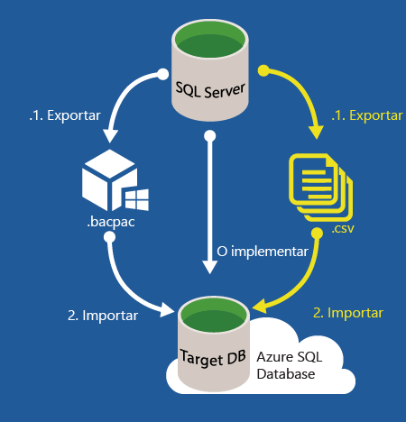
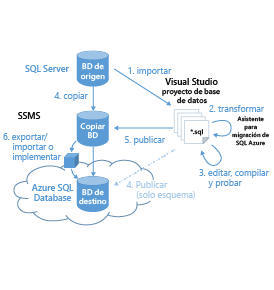

<properties
   pageTitle="Migrar una base de datos a la Base de datos SQL de Azure"
   description="Base de datos SQL de Microsoft Azure, implementación de base de datos, migración de base de datos, importación de base de datos, exportación de base de datos, asistente para migración"
   services="sql-database"
   documentationCenter=""
   authors="carlrabeler"
   manager="jeffreyg"
   editor=""/>

<tags
   ms.service="sql-database"
   ms.devlang="NA"
   ms.topic="article"
   ms.tgt_pltfrm="NA"
   ms.workload="data-management"
   ms.date="10/12/2015"
   ms.author="carlrab"/>

# Migrar una base de datos a la Base de datos SQL de Azure

La complejidad del traslado de la base de datos local a Base de datos SQL de Azure varía en función del diseño de la base de datos y la aplicación, así como de la tolerancia con respecto al tiempo de inactividad. Para bases de datos compatibles, la migración a la Base de datos SQL de Azure es una operación de movimiento de datos y esquemas sencilla que requiere pocos cambios, o ninguno, en el esquema, así como pocas operaciones de reingeniería de aplicaciones, o ninguna. [Base de datos SQL de Azure V12](../sql-database-v12-whats-new.md) ofrece una compatibilidad de motor con SQL Server 2014 y SQL Server 2016 casi completa. La mayoría de las instrucciones de SQL Server 2016 Transact-SQL son totalmente compatibles con Base de datos SQL de Microsoft Azure. Esto incluye los tipos de datos de SQL Server, los operadores y las funciones de cadena, aritméticas, lógicas y de cursor, así como los demás elementos de Transact-SQL en los que se basan la mayoría de las aplicaciones. Las funciones no admitidas o admitidas parcialmente suelen estar relacionadas con diferencias en la forma en que Base de datos SQL administra la base de datos (por ejemplo, características de seguridad, alta disponibilidad y archivo) o con características de uso especial como Service Broker. Dado que Base de datos SQL aísla muchas características de la dependencia de la base de datos maestra, muchas actividades de nivel de servidor son inadecuadas y no se admiten. Las características obsoletas de SQL Server por lo general no se admiten en Base de datos SQL. Para poder realizar la migración, será necesario efectuar tareas de reingeniería en las bases de datos y las aplicaciones que dependen de [funciones incompatibles o parcialmente compatibles](../sql-database-transact-sql-information.md).

El flujo de trabajo para migrar una base de datos SQL a una Base de datos SQL de Azure es el siguiente:

 1. [Determinar si la base de datos es compatible](#determine-if-your-database-is-compatible)
 2. [Si no es compatible, corregir los problemas de compatibilidad de la base de datos](#fix-database-compatibility-issues)
 3. [Migrar una base de datos compatible](#options-to-migrate-a-compatible-database-to-azure-sql-database)

>[AZURE.NOTE]Para migrar otros tipos de bases de datos, incluidos Microsoft Access, Sybase, MySQL Oracle y DB2 a Base de datos SQL de Azure, consulte [SQL Server Migration Assistant](http://blogs.msdn.com/b/ssma/) (Asistente para migración de SQL Server).

## Determinar si la base de datos es compatible
Hay dos principales métodos que se pueden usar para determinar si la base de datos de origen es compatible. - Exportar aplicación de capa de datos: este método usa un asistente en Management Studio para analizar la base de datos y muestra los problemas de compatibilidad de esta, si existen, en la consola. - SQLPackage: este método usa la utilidad de línea de comandos SQLPackage.exe [sqlpackage.exe](https://msdn.microsoft.com/library/hh550080.aspx) para analizar la base de datos y generar un informe. Esta utilidad se incluye con Visual Studio y SQL Server.

> [AZURE.NOTE]Existe un tercer método que usa archivos de seguimiento como información de origen adicional para probar la compatibilidad en el nivel de aplicación así como en el nivel de base de datos. Se trata del [Asistente para migración de Base de datos SQL de Microsoft Azure](http://sqlazuremw.codeplex.com/), una herramienta gratuita en CodePlex. Sin embargo, esta herramienta puede presentar errores de compatibilidad que eran problemas en la Base de datos SQL de Azure V11 pero que ya no lo son en la Base de datos SQL de Azure V12.

Si se detectan incompatibilidades de bases de datos, deberá corregir estas incompatibilidades antes de poder migrar la base de datos a Base de datos SQL de Azure. Para obtener instrucciones acerca de cómo solucionar problemas de compatibilidad de bases de datos, vaya a [Solución de problemas de compatibilidad de bases de datos](#fix-database-compatibility-issues).

> [AZURE.IMPORTANT]Estas opciones no detectan todos los problemas de compatibilidad entre diferentes niveles de Bases de datos SQL Server (es decir, el nivel 110, 100 y 90). Si va a migrar desde una base de datos más antigua (nivel 80, 90, 100 y 110), debe realizar en primer lugar el proceso de actualización (al menos en el entorno de desarrollo) y una vez en SQL Server 2014 o posterior, migrar a la Base de datos SQL de Azure.

## Determinar si la base de datos es compatible mediante sqlpackage.exe

1. Abra un símbolo del sistema y cambie a un directorio que contiene la versión más reciente de sqlpackage.exe. Esta utilidad se incluye con Visual Studio y SQL Server. También puede [descargar](https://msdn.microsoft.com/library/mt204009.aspx) la versión más reciente de SQL Server Data Tools para obtener esta utilidad.
2. Ejecute el siguiente comando sqlpackage.exe con los argumentos siguientes para su entorno:

	'sqlpackage.exe /Action:Export /ssn:< server_name > /sdn:< database_name > /tf:< target_file > /p:TableData=< schema_name.table_name > > < output_file > 2>&1'

	| Argumento | Descripción |
	|---|---|
	| < server_name > | nombre de servidor de origen |
	| < database_name > | nombre de base de datos de origen |
	| < target_file > | nombre y ubicación del archivo BACPAC |
	| < schema_name.table_name > | tablas para las que se enviarán datos al archivo de destino |
	| < output_file > | nombre y ubicación del archivo de salida con los errores, si existen |

	La razón para el argumento /p:TableName es que solo deseamos comprobar la compatibilidad de la base de datos para la exportación a la Base de datos SQL de Azure V12, en lugar de exportar los datos desde todas las tablas. Lamentablemente, el argumento de exportación para sqlpackage.exe no admite no extraer ninguna tabla, por lo que necesitará especificar una única tabla pequeña. < output_file > contendrá el informe de los errores. La cadena "> 2>&1" une la salida estándar y el error estándar resultado de la ejecución del comando en el archivo de salida especificado.

	

3. Abra el archivo de salida y revise los errores de compatibilidad, si los hay. Para obtener instrucciones acerca de cómo solucionar problemas de compatibilidad de bases de datos, vaya a [Solución de problemas de compatibilidad de bases de datos](#fix-database-compatibility-issues).

	

## Determinar si la base de datos es compatible mediante Exportar aplicación de capa de datos

1. Compruebe que dispone de la versión 13.0.600.65 o posterior de SQL Server Management Studio. Las nuevas versiones de Management Studio se actualizan mensualmente a fin de que sigan sincronizadas con las actualizaciones para el Portal de Azure.

 	 >[AZURE.IMPORTANT]Descargue la versión [más reciente](https://msdn.microsoft.com/library/mt238290.aspx) de SQL Server Management Studio. Se recomienda usar siempre la versión más reciente de Management Studio.

2. Abra Management Studio y conéctese a la base de datos de origen en el Explorador de objetos.
3. Haga clic con el botón derecho en la base de datos de origen del Explorador de objetos, seleccione **Tareas** y haga clic en **Exportar aplicación de capa de datos...**

	

4. En el asistente para la exportación, haga clic en **Siguiente** y, en la pestaña **Configuración**, configure la exportación para guardar el archivo BACPAC en una ubicación de disco local o en un blob de Azure. Solo se guardará un archivo BACPAC si no tiene problemas de compatibilidad de bases de datos. Si hay problemas de compatibilidad, se mostrarán en la consola.

	

5. Haga clic en la pestaña **Avanzadas** y desactive la casilla **Seleccionar todo** para omitir la exportación de datos. En este caso, nuestro objetivo es solo comprobar la compatibilidad.

	

6. Haga clic en **Siguiente** y, a continuación, en **Finalizar**. Los problemas de compatibilidad de bases de datos, si los hay, aparecerán después de que el asistente valide el esquema.

	

7. Si no aparece ningún error, la base de datos es compatible y estará listo para la migración. Si se producen errores, deberá corregirlos. Para ver los errores, haga clic en **Error** de **Validando esquema**. Para saber cómo corregir estos errores, vaya a [Solución de problemas de compatibilidad de bases de datos](#fix-database-compatibility-issues).

	

8.	Si el archivo *.BACPAC se generó correctamente, indica que la base de datos es compatible con la Base de datos SQL; ya puede migrar.

## Opciones para migrar una base de datos compatible a la Base de datos SQL de Azure

Después de comprobar que dispone de una base de datos compatible, debe elegir el método de migración. En primer lugar, debe decidir si puede permitirse retirar la base de datos de producción durante la migración. Si no puede, utilice la replicación de transacciones de SQL Server, que se explica más adelante. Si puede permitirse algún tiempo de inactividad o va a realizar una migración de prueba de la base de datos de producción que posteriormente puede migrar con la replicación transaccional, considere uno de los tres métodos siguientes.

***Migración de una base de datos compatible mediante SQL Server Management Studio ***
En la lista siguiente se tratan las opciones para migrar una base de datos compatible a Base de datos SQL de Azure cuando puede permitirse algún tiempo de inactividad mientras se lleva a cabo la migración y antes de apuntar a los usuarios y las aplicaciones a la base de datos migrada en Base de datos SQL de Azure. Con estos métodos, migra la base de datos tal como existe en un momento determinado.

> [AZURE.WARNING]Antes de migrar la base de datos con cualquiera de estos métodos, asegúrese de que no se está produciendo ninguna transacción activa para garantizar la coherencia transaccional durante la migración. Existen diferentes modos de poner una base de datos en modo inactivo, desde la deshabilitación de la conectividad de cliente hasta la creación de una [instantánea de base de datos](https://msdn.microsoft.com/library/ms175876.aspx).

- En las bases de datos pequeñas y medianas, migrar bases de datos [compatibles](#determine-if-your-database-is-compatible) de SQL Server 2005 o posteriores es un procedimiento tan sencillo como ejecutar el [Asistente para implementar bases de datos en Base de datos SQL de Microsoft Azure](#use-the-deploy-database-to-microsoft-azure-database-wizard) en SQL Server Management Studio. Si tiene problemas de conectividad (falta de conectividad, ancho de banda reducido o problemas de tiempo de espera), puede [usar un BACPAC para migrar](#use-a-bacpac-to-migrate-a-database-to-azure-sql-database) una Base de datos SQL Server a Base de datos SQL de Azure.
- Para bases de datos grandes y medianas o si tiene problemas de conectividad, puede [usar un BACPAC para migrar](#use-a-bacpac-to-migrate-a-database-to-azure-sql-database) una Base de datos SQL Server a Base de datos SQL de Azure. Con este método, puede usar SQL Server Management Studio para exportar los datos y el esquema a un archivo [BACPAC](https://msdn.microsoft.com/library/ee210546.aspx#Anchor_4) (almacenado localmente o en un blob de Azure) y, a continuación, importar el archivo BACPAC a la instancia SQL de Azure. Si almacena el archivo BACPAC en un blob de Azure, también puede importar el archivo BACPAC desde el [Portal de Azure](sql-database-import.md) o mediante [PowerShell](sql-database-import-powershell.md).
- En las bases de datos grandes, obtendrá el mejor rendimiento posible si migra el esquema y los datos por separado. Con este método, puede crear un [archivo BACPAC sin datos](#use-a-bacpac-to-migrate-a-database-to-azure-sql-database) e importar este BACPAC a Base de datos SQL de Azure. Una vez importado el esquema a Base de datos SQL de Azure, puede usar [BCP](https://msdn.microsoft.com/library/ms162802.aspx) para extraer los datos a archivos sin formato e importar luego estos archivos a Base de datos SQL de Azure.

	 

### Migración de una base de datos compatible sin tiempo de inactividad

Si no se puede permitir retirar la Base de datos SQL Server de producción mientras se lleva a cabo la migración, puede usar la replicación transaccional de SQL Server como solución de migración. Este método está actualmente en modo de vista previa con [SQL Server 2016](http://www.microsoft.com/server-cloud/products/sql-server-2016/). Con la replicación transaccional, todos los cambios en los datos o el esquema que se producen entre el momento en que se inicia la migración y el momento en que finaliza aparecerán en Base de datos SQL de Azure. Una vez completada la migración, basta con cambiar la cadena de conexión de las aplicaciones para que apunte a Base de datos SQL de Azure en lugar de apuntar a la base de datos local. Cuando la replicación transaccional recupera todos los cambios pendientes en la base de datos local y todas las aplicaciones apuntan a la base de datos de Azure, ya se puede desinstalar con seguridad la replicación y dejar Base de datos SQL de Azure como sistema de producción.

 

La replicación transaccional es una tecnología integrada con SQL Server desde SQL Server 6.5. Es una tecnología muy madura y comprobada, que conocen la mayoría de los administradores de base de datos y con la que tienen experiencia. Con la [vista previa de SQL Server 2016](http://www.microsoft.com/server-cloud/products/sql-server-2016/), ahora es posible configurar Base de datos SQL de Azure como un [suscriptor de replicación transaccional](https://msdn.microsoft.com/library/mt589530.aspx) a la publicación local. La experiencia que obtiene configurándolo desde Management Studio es exactamente la misma que si configura un suscriptor de replicación transaccional en un servidor local. Este escenario es compatible con las siguientes versiones de SQL Server:

 - SQL14 SP1 CU3 y versiones posteriores
 - SQL14 RTM CU10 y versiones posteriores
 - SQL11 SP2 CU8 y versiones posteriores
 - SQL11 SP3 cuando se lance

También puede usar la replicación transaccional para migrar un subconjunto de la base de datos local. La publicación que se replica en Base de datos SQL de Azure puede limitarse a un subconjunto de las tablas de la base de datos que se replica. Además, para cada tabla que se replica, puede limitar los datos a un subconjunto de filas o un subconjunto de columnas.

## Uso del Asistente de implementación de bases de datos en la Base de datos de Microsoft Azure

El Asistente para implementar bases de datos en Base de datos SQL de Microsoft Azure en SQL Server Management Studio migra bases de datos [compatibles](#determine-if-your-database-is-compatible) de SQL Server 2005 o posteriores directamente a una instancia de servidor lógica SQL de Azure.

> [AZURE.NOTE]En los pasos siguientes se da por supuesto que la instancia lógica SQL de Azure está ya [aprovisionada](../sql-database-get-started.md) y que tiene a mano la información de conexión.

1. Compruebe que dispone de la versión 13.0.600.65 o posterior de SQL Server Management Studio. Las nuevas versiones de Management Studio se actualizan mensualmente a fin de que sigan sincronizadas con las actualizaciones para el Portal de Azure.

	 >[AZURE.IMPORTANT]Descargue la versión [más reciente](https://msdn.microsoft.com/library/mt238290.aspx) de SQL Server Management Studio. Se recomienda usar siempre la versión más reciente de Management Studio.

2. Abra Management Studio y conéctese a la base de datos de origen en el Explorador de objetos.
3. Haga clic con el botón derecho en la base de datos de origen del Explorador de objetos, seleccione **Tareas** y haga clic en **Implementar base de datos en Base de datos SQL de Azure...**

	

4.	En el asistente para la implementación, haga clic en **Siguiente** y en **Conectar** para configurar la conexión con el servidor de Base de datos SQL de Azure.

	

5. En el cuadro de diálogo Conectar con el servidor, escriba la información de conexión para conectarse a su servidor de Base de datos SQL de Azure.

	

5.	Proporcione el **Nuevo nombre de base de datos** para la base de datos en Base de datos SQL de Azure, establezca **Edición de Base de datos SQL de Microsoft Azure** (nivel de servicio), **Tamaño máximo de la base de datos**, **Objetivo de servicio** (nivel de rendimiento) y **Nombre de archivo temporal** para el archivo BACPAC que crea este asistente durante el proceso de migración. Consulte [Niveles de servicio de Base de datos SQL de Azure](sql-database-service-tiers.md) para obtener más información sobre los niveles de servicio y de rendimiento.

	

6.	Complete el asistente para migrar la base de datos. Según el tamaño y la complejidad de la base de datos, es posible que la implementación tarde desde unos minutos hasta varias horas.
7.	Con el Explorador de objetos, conéctese a la base de datos migrada en el servidor de Base de datos SQL de Azure.
8.	Mediante el Portal de Azure, vea la base de datos y sus propiedades.

## Use un archivo BACPAC para migrar una Base de datos SQL Server a la Base de datos SQL de Azure.

Para bases de datos grandes y medianas o si tiene problemas de conectividad, puede separar el proceso de migración en dos pasos independientes. Puede exportar el esquema y sus datos a un archivo [BACPAC](https://msdn.microsoft.com/library/ee210546.aspx#Anchor_4) con uno o dos métodos.

- [Exportación a un archivo BACPAC mediante SQL Server Management Studio](#export-a-compatible-sql-server-database-to-a-bacpac-file-using-sql-server-management-studio)
- [Exportación a un archivo BACPAC mediante SqlPackage](#export-a-compatible-sql-server-database-to-a-bacpac-file-using-sqlpackage)

Este archivo BACPAC se puede almacenar localmente o en un blob de Azure. A continuación, puede importar este archivo BACPAC a la Base de datos SQL de Azure mediante uno de varios métodos.

- [Importación de un archivo BACPAC a la Base de datos SQL de Azure mediante SQL Server Management Studio](#import-from-a-bacpac-file-into-azure-sql-database-using-sql-server-management-studio)
- [Importación de un archivo BACPAC a la Base de datos SQL de Azure mediante SqlPackage](#import-from-a-bacpac-file-into-azure-sql-database-using-sqlpackage)
- [Importación de un archivo BACPAC a la Base de datos SQL de Azure mediante el Portal de Azure](sql-database-import.md)
- [Importación de un archivo BACPAC a la Base de datos SQL de Azure mediante PowerShell](sql-database-import-powershell.md)

## Exportación de una Base de datos SQL Server compatible a un archivo BACPAC mediante SQL Server Management Studio

Use los pasos siguientes para que Management Studio exporte una Base de datos SQL Server [compatible](#determine-if-your-database-is-compatible) de migración a un archivo BACPAC.

1. Compruebe que dispone de la versión 13.0.600.65 o posterior de SQL Server Management Studio. Las nuevas versiones de Management Studio se actualizan mensualmente a fin de que sigan sincronizadas con las actualizaciones para el Portal de Azure.

	 >[AZURE.IMPORTANT]Descargue la versión [más reciente](https://msdn.microsoft.com/library/mt238290.aspx) de SQL Server Management Studio. Se recomienda usar siempre la versión más reciente de Management Studio.

2. Abra Management Studio y conéctese a la base de datos de origen en el Explorador de objetos.

	

3. Haga clic con el botón derecho en la base de datos de origen del Explorador de objetos, seleccione **Tareas** y haga clic en **Exportar aplicación de capa de datos...**

	

4. En el asistente para la exportación, configure la exportación para guardar el archivo BACPAC en una ubicación de disco local o en un blob de Azure. El archivo BACPAC exportado siempre incluye el esquema de la base de datos completa y, de manera predeterminada, los datos de todas las tablas. Si desea excluir los datos de algunas o todas las tablas, use la pestaña de opciones avanzadas. Por ejemplo, puede exportar únicamente los datos para las tablas de referencia en lugar de desde todas las tablas.

	

## Exportación de una Base de datos SQL Server compatible a un archivo BACPAC mediante SqlPackage

Use los pasos siguientes para que la utilidad de línea de comandos [SqlPackage.exe](https://msdn.microsoft.com/library/hh550080.aspx) exporte una base de datos [compatible](#determine-if-your-database-is-compatible) de migración a un archivo BACPAC.

> [AZURE.NOTE]En los pasos siguientes se da por supuesto que un servidor de la Base de datos SQL de Azure está ya aprovisionado, que tiene a mano la información de conexión y ha comprobado que la base de datos de origen es compatible.

1. Abra un símbolo del sistema y cambie a un directorio que contiene la utilidad de línea de comandos sqlpackage.exe; esta utilidad se incluye con Visual Studio y SQL Server.
2. Ejecute el siguiente comando sqlpackage.exe con los argumentos siguientes para su entorno:

	'sqlpackage.exe /Action:Export /ssn:< server_name > /sdn:< database_name > /tf:< target_file >

	| Argumento | Descripción |
	|---|---|
	| < server_name > | nombre de servidor de origen |
	| < database_name > | nombre de base de datos de origen |
	| < target_file > | nombre y ubicación del archivo BACPAC |

	

## Importación de un archivo BACPAC a la Base de datos SQL de Azure mediante SQL Server Management Studio

Use los pasos siguientes para importar desde un archivo BACPAC a la Base de datos SQL de Azure.

> [AZURE.NOTE]En los pasos siguientes se da por supuesto que la instancia lógica SQL de Azure está ya aprovisionada y que tiene a mano la información de conexión.

1. Compruebe que dispone de la versión 13.0.600.65 o posterior de SQL Server Management Studio. Las nuevas versiones de Management Studio se actualizan mensualmente a fin de que sigan sincronizadas con las actualizaciones para el Portal de Azure.

	> [AZURE.IMPORTANT]Descargue la versión [más reciente](https://msdn.microsoft.com/library/mt238290.aspx) de SQL Server Management Studio. Se recomienda usar siempre la versión más reciente de Management Studio.

2. Abra Management Studio y conéctese a la base de datos de origen en el Explorador de objetos.

	

3. Una vez creado el archivo BACPAC, conéctese al servidor de Base de datos SQL de Azure, haga clic con el botón derecho en la carpeta **Bases de datos** y seleccione **Importar aplicación de capa de datos...**

    

4.	En el Asistente para importación, elija el archivo BACPAC que acaba de exportar para crear la nueva base de datos en Base de datos SQL de Azure.

    

5.	Proporcione el **Nuevo nombre de base de datos** para la base de datos en Base de datos SQL de Azure, establezca **Edición de Base de datos SQL de Microsoft Azure** (nivel de servicio), **Tamaño máximo de la base de datos** y **Objetivo de servicio** (nivel de rendimiento).

    

6.	Haga clic en **Siguiente** y, a continuación, en **Finalizar** para importar el archivo BACPAC a una nueva base de datos en el servidor de Base de datos SQL de Azure.

7. Con el Explorador de objetos, conéctese a la base de datos migrada en el servidor de Base de datos SQL de Azure.

8.	Mediante el Portal de Azure, vea la base de datos y sus propiedades.

## Importación de un archivo BACPAC a la Base de datos SQL de Azure mediante SqlPackage

Use los pasos siguientes para que la utilidad de línea de comandos [SqlPackage.exe](https://msdn.microsoft.com/library/hh550080.aspx) importe una Base de datos SQL Server compatible (o una Base de datos SQL de Azure) desde un archivo BACPAC.

> [AZURE.NOTE]En los pasos siguientes se da por supuesto que un servidor de la Base de datos SQL de Azure está ya aprovisionado y que tiene a mano la información de conexión.

1. Abra un símbolo del sistema y cambie a un directorio que contiene la utilidad de línea de comandos sqlpackage.exe; esta utilidad se incluye con Visual Studio y SQL Server.
2. Ejecute el siguiente comando sqlpackage.exe con los argumentos siguientes para su entorno:

	'sqlpackage.exe /Action:Import /tsn:< server_name > /tdn:< database_name > /tu:< user_name > /tp:< password > /sf:< source_file >

	| Argumento | Descripción |
	|---|---|
	| < server_name > | nombre de servidor de destino |
	| < database_name > | nombre de base de datos de destino |
	| < user_name > | nombre de usuario en el servidor de destino |
	| < password > | contraseña del usuario |
	| < source_file > | nombre y ubicación del archivo BACPAC que se importa |

	

## Solución de problemas de compatibilidad de bases de datos

Si determina que la Base de datos SQL Server de origen no es compatible, tiene varias opciones para corregir los problemas de compatibilidad de bases de datos [identificados anteriormente](#determine-if-your-database-is-compatible).

- Use el [Asistente para migración de Base de datos SQL de Microsoft Azure](http://sqlazuremw.codeplex.com/). Puede usar esta herramienta de CodePlex para generar un script T-SQL desde una base de datos de origen que luego la transforma el Asistente para que sea compatible con la Base de datos SQL y después se conecte a la Base de datos SQL de Azure para ejecutar el script. Esta herramienta también analizará los archivos de seguimiento para determinar problemas de compatibilidad. El script puede generarse solo con el esquema o puede incluir datos en formato BCP. Hay documentación adicional, incluidas instrucciones paso a paso, disponible en Codeplex en el [Asistente para migración de Base de datos SQL de Microsoft Azure](http://sqlazuremw.codeplex.com/).  

 

 >[AZURE.NOTE]Tenga en cuenta que no todos los esquemas incompatibles que pueden ser detectados por el asistente se pueden procesar por sus transformaciones integradas. El script incompatible que no se pueda resolver se notificará como un error, con comentarios insertados en el script generado. Si se detectan numerosos errores, use Visual Studio o SQL Server Management Studio para analizar y corregir cada error que no se pudo corregir con el Asistente para migración de SQL Server.

- Usar Visual Studio. Puede usar Visual Studio para importar el esquema de base de datos a un proyecto de base de datos de Visual Studio para análisis. Para efectuar el análisis, especifique la plataforma de destino del proyecto como Base de datos SQL V12 y, a continuación, compile el proyecto. Si la compilación se realiza correctamente, esto significa que la base de datos es compatible. Si se produce un error en la compilación, puede resolver los errores de SQL Server Data Tools para Visual Studio ("SSDT"). Una vez que el proyecto se compila correctamente, puede publicarlo como una copia de la base de datos de origen y, a continuación, usar la función de comparación de datos de SSDT para copiar los datos de la base de datos de origen en la base de datos compatible con Azure SQL V12. Dicha base de datos actualizada se implementa en Base de datos SQL de Azure mediante las opciones [tratadas anteriormente](#options-to-migrate-a-compatible-database-to-azure-sql-database).

 

 >[AZURE.NOTE]Si solo es necesaria la migración del esquema, es posible publicar el esquema directamente desde Visual Studio a la base de datos SQL de Azure. Use este método cuando el esquema de la base de datos requiera más cambios de los que se pueden controlar mediante el asistente para la migración por sí solo.

- SQL Server Management Studio. Puede corregir los problemas en Management Studio con varios comandos de Transact-SQL, como **ALTER DATABASE**.

<!---HONumber=Nov15_HO1-->