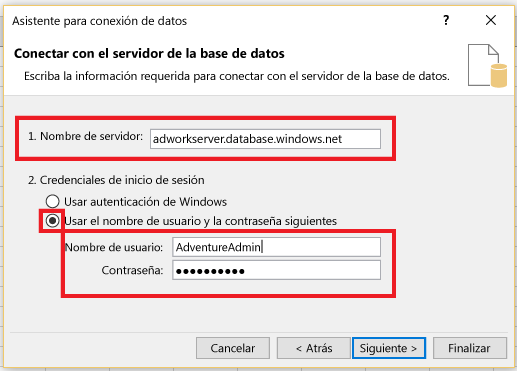
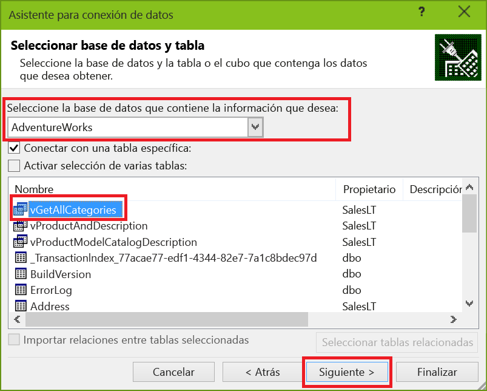
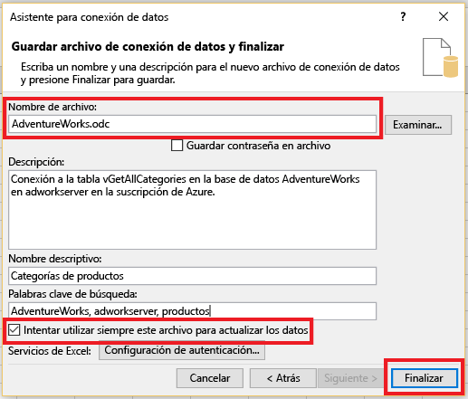
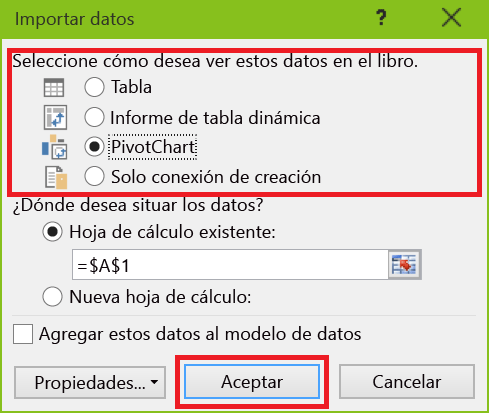
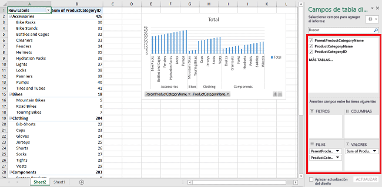

# Conexión de Excel a una Base de datos SQL de Azure y creación de un informe

Conecte Excel a una instancia de SQL Database en la nube e importe datos y cree tablas y gráficos basados en los valores de la base de datos. En este tutorial va a configurar la conexión entre Excel y una tabla de base de datos, guardar el archivo que almacena los datos y la información de conexión de Excel y, finalmente, crear un gráfico dinámico a partir de los valores de la base de datos.

Antes de comenzar, necesitará una Base de datos SQL en Azure. Si no tiene una, consulte [Creación de la primera Base de datos SQL de Azure](sql-database-get-started-portal.md) para tener una base de datos con datos de ejemplo en funcionamiento en unos minutos. En este artículo se importarán los datos de ejemplo en Excel de dicho artículo, pero puede seguir los pasos con sus propios datos.

También necesitará una copia de Excel. Este artículo usa [Microsoft Excel 2016](https://products.office.com/).

## Conexión de Excel a una Base de datos SQL y creación de un archivo odc
1. Para conectar Excel a Base de datos SQL, abra Excel y cree un libro nuevo o abra uno existente.
2. En la barra de menús de la parte superior de la página, haga clic sucesivamente en **Datos**, **De otros orígenes** y **De SQL Server**.
   
   
   
   Se abre el Asistente para la conexión de datos.
3. En el cuadro de diálogo **Conectar con el servidor de la base de datos**, escriba el **nombre del servidor** de SQL Database al que quiere conectarse con el formato <*nombreDeServidor*>**.database.windows.net**. Por ejemplo, **adworkserver.database.windows.net**.
4. En **Credenciales de inicio de sesión**, haga clic en **Usar el nombre de usuario y la contraseña siguientes**, escriba el **nombre de usuario** y la **contraseña** que haya configurado para el servidor de SQL Database cuando la creó y, finalmente, haga clic en **Siguiente**.
   
   
   
   > [!TIP]
   > Dependiendo de su entorno de red, es posible que no pueda conectarse o que pierda la conexión si el servidor de Base de datos SQL no permite el tráfico de la dirección IP del cliente. Vaya al [Portal de Azure](https://portal.azure.com/), haga clic en Servidores SQL Server, haga clic en su servidor, haga clic en Firewall en Configuración y agregue la dirección IP de cliente. Consulte [Configuración del firewall](sql-database-configure-firewall-settings.md) para obtener más detalles.
   > 
   > 
5. En el cuadro de diálogo **Seleccionar base de datos y tabla**, seleccione en la lista la base de datos con la que desea trabajar y, después, haga clic en las tablas o vistas con las que desea trabajar (hemos elegido **vGetAllCategories**) y, finalmente, haga clic en **Siguiente**.
   
    
   
    Se abre el cuadro de diálogo **Guardar archivo de conexión de datos y finalizar** , donde se proporciona información sobre el archivo de conexión de base de datos de Office (*.odc) que utiliza Excel. Puede dejar los valores predeterminados o personalizar sus selecciones.
6. Puede dejar los valores predeterminados, pero tenga en cuenta el **nombre de archivo** en particular. Pueden ayudarle los valores de los campos **Descripción**, **Nombre descriptivo** y **Palabras clave de búsqueda**, y otros usuarios recuerdan a lo que va a conectar y encuentran la conexión. Haga clic en **Intentar utilizar siempre este archivo para actualizar los datos** si desea que la información de conexión se almacene en el archivo odc, para que puede actualizarse cuando se conecta a él y, después, haga clic en **Finalizar**.
   
    
   
    Aparece el cuadro de diálogo **Importar datos** .

## Importación de los datos a Excel y creación de un gráfico dinámico
Ahora que ha establecido la conexión y ha creado el archivo con la información de conexión y de datos, va a importar los datos.

1. En el cuadro de diálogo **Importar datos**, haga clic en la opción que desee para presentar los datos en la hoja de cálculo y, después, haga clic en **Aceptar**. Elegimos **Gráfico dinámico**. También puede optar por crear una **nueva hoja de cálculo** o **Agregar estos datos al Modelo de datos**. Para más información sobre los modelos de datos, consulte [Crear un modelo de datos en Excel](https://support.office.com/article/Create-a-Data-Model-in-Excel-87E7A54C-87DC-488E-9410-5C75DBCB0F7B). Haga clic en **Propiedades** para explorar la información sobre el archivo odc que creó en el paso anterior y elegir las opciones para actualizar los datos.
   
    
   
    La hoja de cálculo ahora tiene una tabla y un gráfico dinámicos vacíos.
2. En **Campos de tabla dinámica**, seleccione todas las casillas de los campos que desea ver.
   
    

> [!TIP]
> Si quiere conectar otros libros y hojas de cálculo de Excel a la base de datos, haga clic sucesivamente en **Datos**, en **Conexiones**, en **Agregar**, elija la conexión que creó en la lista y, finalmente, haga clic en **Abrir**.
> 
> 
> 

## Pasos siguientes
* Consulte [Conexión a la Base de datos SQL con SQL Server Management Studio y realización de una consulta de T-SQL de ejemplo](sql-database-connect-query-ssms.md) para obtener más información sobre consultas y análisis avanzados.
* Más información sobre las ventajas de los [grupos elásticos](sql-database-elastic-pool.md).
* Más información en [Crear una aplicación ASP.NET MVC con la autenticación y Base de datos SQL e implementar al Servicio de aplicaciones de Azure](../app-service/app-service-web-tutorial-dotnet-sqldatabase.md).

