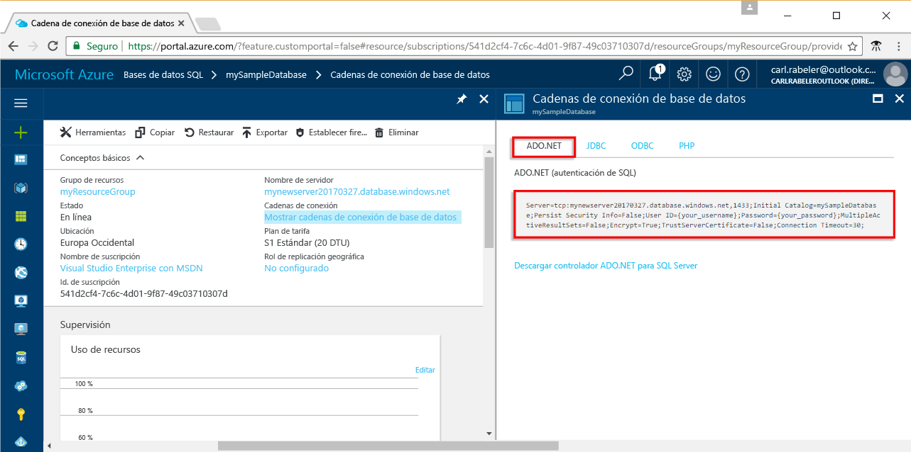

# <a name="use-net-core-c-to-query-an-azure-sql-database"></a>Uso de .NET Core (C#) para consultar una instancia de Azure SQL Database

Este tutorial de inicio rápido muestra cómo usar [.NET Core](https://www.microsoft.com/net/) en Windows, Linux o macOS para crear un programa de C# que se conecta a una instancia de Azure SQL Database y utiliza instrucciones Transact-SQL para consultar los datos.

## <a name="prerequisites"></a>Requisitos previos

Para completar este tutorial, asegúrese de que dispone de lo siguiente:

[!INCLUDE [prerequisites-create-db](../../includes/sql-database-connect-query-prerequisites-create-db-includes.md)]

- Una [regla de firewall de nivel de servidor](sql-database-get-started-portal.md#create-a-server-level-firewall-rule) para la dirección IP pública del equipo que usa para seguir este tutorial de inicio rápido.

- Ha instalado [.NET Core para su sistema operativo](https://www.microsoft.com/net/core). 

## <a name="sql-server-connection-information"></a>Información de conexión de SQL server

[!INCLUDE [prerequisites-server-connection-info](../../includes/sql-database-connect-query-prerequisites-server-connection-info-includes.md)]

#### <a name="for-adonet"></a>Para ADO.NET

1. Continúe haciendo clic en **Mostrar las cadenas de conexión de la base de datos**.

2. Revise la cadena de conexión completa de **ADO.NET**.

    

> [!IMPORTANT]
> Debe tener una regla de firewall activa para la dirección IP pública del equipo en el que sigue este tutorial. Si se encuentra en un equipo diferente o tiene una dirección IP pública diferente, cree una [regla de firewall de nivel de servidor mediante Azure Portal](sql-database-get-started-portal.md#create-a-server-level-firewall-rule). 
>
  
## <a name="create-a-new-net-project"></a>Creación de un nuevo proyecto de .NET

1. Abra un símbolo del sistema y cree una carpeta denominada *sqltest*. Navegue hasta la carpeta que ha creado y ejecute el siguiente comando:

    ```
    dotnet new console
    ```

2. Abra ***sqltest.csproj*** con el editor de texto y agregue System.Data.SqlClient como una dependencia con el código siguiente:

    ```xml
    <ItemGroup>
        <PackageReference Include="System.Data.SqlClient" Version="4.4.0" />
    </ItemGroup>
    ```

## <a name="insert-code-to-query-sql-database"></a>Inserción de código para consultar la base de datos SQL

1. En el entorno de desarrollo o en el editor de texto, abra **Program.cs**

2. Reemplace el contenido con el código siguiente y agregue los valores adecuados para el servidor, la base de datos, el usuario y la contraseña.

```csharp
using System;
using System.Data.SqlClient;
using System.Text;

namespace sqltest
{
    class Program
    {
        static void Main(string[] args)
        {
            try 
            { 
                SqlConnectionStringBuilder builder = new SqlConnectionStringBuilder();
                builder.DataSource = "your_server.database.windows.net"; 
                builder.UserID = "your_user";            
                builder.Password = "your_password";     
                builder.InitialCatalog = "your_database";

                using (SqlConnection connection = new SqlConnection(builder.ConnectionString))
                {
                    Console.WriteLine("\nQuery data example:");
                    Console.WriteLine("=========================================\n");
                    
                    connection.Open();       
                    StringBuilder sb = new StringBuilder();
                    sb.Append("SELECT TOP 20 pc.Name as CategoryName, p.name as ProductName ");
                    sb.Append("FROM [SalesLT].[ProductCategory] pc ");
                    sb.Append("JOIN [SalesLT].[Product] p ");
                    sb.Append("ON pc.productcategoryid = p.productcategoryid;");
                    String sql = sb.ToString();

                    using (SqlCommand command = new SqlCommand(sql, connection))
                    {
                        using (SqlDataReader reader = command.ExecuteReader())
                        {
                            while (reader.Read())
                            {
                                Console.WriteLine("{0} {1}", reader.GetString(0), reader.GetString(1));
                            }
                        }
                    }                    
                }
            }
            catch (SqlException e)
            {
                Console.WriteLine(e.ToString());
            }
            Console.ReadLine();
        }
    }
}
```

## <a name="run-the-code"></a>Ejecución del código

1. En el símbolo del sistema, ejecute los siguientes comandos:

   ```csharp
   dotnet restore
   dotnet run
   ```

2. Compruebe que se han devuelto las primeras 20 filas y, a continuación, cierre la ventana de la aplicación.


## <a name="next-steps"></a>Pasos siguientes

- [Introducción a .NET Core en Windows, Linux y macOS mediante la línea de comandos](/dotnet/core/tutorials/using-with-xplat-cli).
- Obtenga información acerca de cómo [conectarse y consultar una base de datos SQL de Azure mediante .NET Framework y Visual Studio](sql-database-connect-query-dotnet-visual-studio.md).  
- Obtenga información acerca de cómo [diseñar la primera base de datos SQL de Azure con SSMS](sql-database-design-first-database.md) o [diseñar la primera base de datos SQL de Azure mediante .NET](sql-database-design-first-database-csharp.md).
- Para más información acerca de. NET, consulte la [Documentación de .NET](https://docs.microsoft.com/dotnet/).
