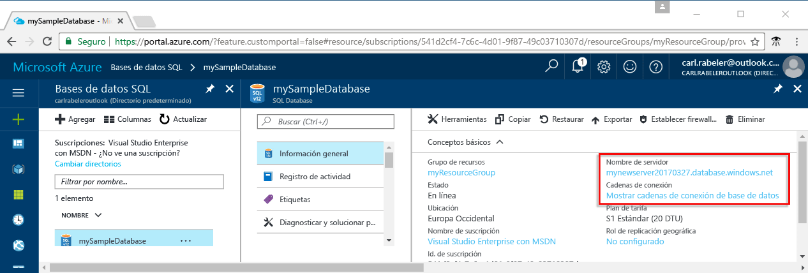

# <a name="azure-sql-database-use-net-c-to-connect-and-query-data"></a>Azure SQL Database: uso de .NET (C#) para conectar y consultar datos

Use [C# y ADO.NET](https://msdn.microsoft.com/library/kb9s9ks0.aspx) para conectarse a una instancia de Azure SQL Database y realizar consultas en ella. En esta guía se explica cómo utilizar C# para conectarse a una instancia de Azure SQL Database y, después, ejecutar la consulta, insertar instrucciones, actualizarlas y eliminarlas.

En esta guía de inicio rápido se utilizan como punto de partida los recursos creados en una de las siguientes guías:

- [Creación de la base de datos: Azure Portal](sql-database-get-started-portal.md)
- [Creación de la base de datos: CLI](sql-database-get-started-cli.md)

## <a name="configure-development-environment"></a>Configuración del entorno de desarrollo

En las secciones siguientes se explica cómo configurar entornos de desarrollo de Mac OS, Linux (Ubuntu) y Windows existentes para trabajar con Azure SQL Database.

### <a name="mac-os"></a>**Mac OS**
Abra el terminal y navegue al directorio en que planea crear un proyecto de .NET Core. Escriba los siguientes comandos para instalar **brew**, **OpenSSL** y **.NET Core**. 

```C#
ruby -e "$(curl -fsSL https://raw.githubusercontent.com/Homebrew/install/master/install)"
brew update
brew install openssl
mkdir -p /usr/local/lib
ln -s /usr/local/opt/openssl/lib/libcrypto.1.0.0.dylib /usr/local/lib/
ln -s /usr/local/opt/openssl/lib/libssl.1.0.0.dylib /usr/local/lib/
```

Instale .NET Core en macOS. Descargue el [instalador oficial](https://go.microsoft.com/fwlink/?linkid=843444). Este instalador instalará las herramientas y las colocará en su RUTA DE ACCESO para que pueda ejecutar dotnet desde la consola

### <a name="linux-ubuntu"></a>**Linux (Ubuntu)**
Abra el terminal y navegue al directorio en que planea crear un proyecto de .NET Core. Escriba los siguientes comandos para instalar **.NET Core**.

```C#
sudo sh -c 'echo "deb [arch=amd64] https://apt-mo.trafficmanager.net/repos/dotnet-release/ xenial main" > /etc/apt/sources.list.d/dotnetdev.list'
sudo apt-key adv --keyserver hkp://keyserver.ubuntu.com:80 --recv-keys 417A0893
sudo apt-get update
sudo apt-get install dotnet-dev-1.0.1
```

### <a name="windows"></a>**Windows**
Instale Visual Studio 2015 Community Edition y .NET Framework. Si Visual Studio ya está instalado en el equipo, omita los pasos siguientes.

Visual Studio 2015 Community es un IDE gratuito, ampliable y rico en contenido para la creación de aplicaciones modernas para Android, iOS, Windows, así como aplicaciones web y de base de datos, y servicios en la nube.

1. Descargue el [instalador](https://go.microsoft.com/fwlink/?LinkId=691978). 
2. Ejecute el instalador y siga las indicaciones para completar la instalación.

## <a name="get-connection-information"></a>Obtención de información sobre la conexión

Obtenga la cadena de conexión en Azure Portal. La cadena de conexión se usa para conectarse a Azure SQL Database.

1. Inicie sesión en [Azure Portal](https://portal.azure.com/).
2. Seleccione **Bases de datos SQL** en el menú de la izquierda y haga clic en la base de datos en la página **Bases de datos SQL**. 
3. En el panel **Essentials** de la base de datos, revise el nombre completo del servidor. 

    

4. Haga clic en **Mostrar las cadenas de conexión de la base de datos**.

5. Revise la cadena de conexión de**ADO.NET** completa.

    
    
## <a name="add-systemdatasqlclient"></a>Adición de System.Data.SqlClient
Si usa .NET Core, agregue System.Data.SqlClient al archivo ***csproj*** de su proyecto como una dependencia.

```xml
<ItemGroup>
    <PackageReference Include="System.Data.SqlClient" Version="4.3.0" />
</ItemGroup>
```

## <a name="select-data"></a>Selección de datos

1. En el entorno de desarrollo, abra un archivo de código en blanco.
2. Agregue ```using System.Data.SqlClient``` al archivo de código ([espacio de nombres System.Data.SqlClient](https://msdn.microsoft.com/library/system.data.sqlclient.aspx)). 

3. Use [SqlCommand.ExecuteReader](https://msdn.microsoft.com/library/system.data.sqlclient.sqlcommand.executereader.aspx) con una instrucción [SELECT](https://msdn.microsoft.com/library/ms189499.aspx) de Transact-SQL para consultar los datos de la instancia de Azure SQL Database. Agregue los valores apropiados para el servidor

```csharp
using System;
using System.Data;
using System.Data.SqlClient;

namespace ConsoleApplication1
{
    class Program
    {
        static void Main(string[] args)
        {
            try 
            { 
                SqlConnectionStringBuilder builder = new SqlConnectionStringBuilder();
                builder.DataSource = "your_server.database.windows.net"; 
                builder.UserID = "your_user";            
                builder.Password = "your_password";     
                builder.InitialCatalog = "your_database";

                using (SqlConnection connection = new SqlConnection(builder.ConnectionString))
                {
                    Console.WriteLine("\nQuery data example:");
                    Console.WriteLine("=========================================\n");
                    
                    connection.Open();       
                    StringBuilder sb = new StringBuilder();
                    sb.Append("SELECT TOP 20 pc.Name as CategoryName, p.name as ProductName ");
                    sb.Append("FROM [SalesLT].[ProductCategory] pc ");
                    sb.Append("JOIN [SalesLT].[Product] p ");
                    sb.Append("ON pc.productcategoryid = p.productcategoryid;");
                    String sql = sb.ToString();

                    using (SqlCommand command = new SqlCommand(sql, connection))
                    {
                        using (SqlDataReader reader = command.ExecuteReader())
                        {
                            while (reader.Read())
                            {
                                Console.WriteLine("{0} {1}", reader.GetString(0), reader.GetString(1));
                            }
                        }
                    }                    
                }
            }
            catch (SqlException e)
            {
                Console.WriteLine(e.ToString());
            }
        }
    }
}
```

## <a name="insert-data"></a>Inserción de datos

Use [SqlCommand.ExecuteNonQuery](https://msdn.microsoft.com/library/system.data.sqlclient.sqlcommand.executenonquery.aspx) con una instrucción [INSERT](https://msdn.microsoft.com/library/ms174335.aspx) de Transact-SQL para insertar datos en Azure SQL Database.

```csharp
using System;
using System.Data;
using System.Data.SqlClient;

namespace ConsoleApplication1
{
    class Program
    {
        static void Main(string[] args)
        {
            try 
            { 
                SqlConnectionStringBuilder builder = new SqlConnectionStringBuilder();
                builder.DataSource = "your_server.database.windows.net"; 
                builder.UserID = "your_user";            
                builder.Password = "your_password";     
                builder.InitialCatalog = "your_database";

                using (SqlConnection connection = new SqlConnection(builder.ConnectionString))
                {
                    Console.WriteLine("\nInsert data example:");
                    Console.WriteLine("=========================================\n");

                    connection.Open();       
                    StringBuilder sb = new StringBuilder();
                    sb.Append("INSERT INTO [SalesLT].[Product] ([Name], [ProductNumber], [Color], [StandardCost], [ListPrice], [SellStartDate]) ");
                    sb.Append("VALUES (@Name, @ProductNumber, @Color, @StandardCost, @ListPrice, @SellStartDate);");
                    String sql = sb.ToString();
                    using (SqlCommand command = new SqlCommand(sql, connection))
                    {
                        command.Parameters.AddWithValue("@Name", "BrandNewProduct");
                        command.Parameters.AddWithValue("@ProductNumber", "200989");
                        command.Parameters.AddWithValue("@Color", "Blue");
                        command.Parameters.AddWithValue("@StandardCost", 75);
                        command.Parameters.AddWithValue("@ListPrice", 80);
                        command.Parameters.AddWithValue("@SellStartDate", "7/1/2016");
                        int rowsAffected = command.ExecuteNonQuery();
                        Console.WriteLine(rowsAffected + " row(s) inserted");
                    }         
                }
            }
            catch (SqlException e)
            {
                Console.WriteLine(e.ToString());
            }
        }
    }
}
```

## <a name="update-data"></a>Actualización de datos

Use [SqlCommand.ExecuteNonQuery](https://msdn.microsoft.com/library/system.data.sqlclient.sqlcommand.executenonquery.aspx) con una instrucción [UPDATE](https://msdn.microsoft.com/library/ms177523.aspx) de Transact-SQL para actualizar datos en la instancia de Azure SQL Database.

```csharp
using System;
using System.Data;
using System.Data.SqlClient;

namespace ConsoleApplication1
{
    class Program
    {
        static void Main(string[] args)
        {
            try 
            { 
                SqlConnectionStringBuilder builder = new SqlConnectionStringBuilder();
                builder.DataSource = "your_server.database.windows.net"; 
                builder.UserID = "your_user";            
                builder.Password = "your_password";     
                builder.InitialCatalog = "your_database";

                using (SqlConnection connection = new SqlConnection(builder.ConnectionString))
                {
                    Console.WriteLine("\nUpdate data example");
                    Console.WriteLine("=========================================\n");

                    connection.Open();       
                    StringBuilder sb = new StringBuilder();
                    sb.Append("UPDATE [SalesLT].[Product] SET ListPrice = @ListPrice WHERE Name = @Name;");
                    String sql = sb.ToString();
                    using (SqlCommand command = new SqlCommand(sql, connection))
                    {
                        command.Parameters.AddWithValue("@Name", "BrandNewProduct");
                        command.Parameters.AddWithValue("@ListPrice", 500);
                        int rowsAffected = command.ExecuteNonQuery();
                        Console.WriteLine(rowsAffected + " row(s) updated");
                    }         
                }
            }
            catch (SqlException e)
            {
                Console.WriteLine(e.ToString());
            }
        }
    }
}
```

## <a name="delete-data"></a>Eliminación de datos

Use [SqlCommand.ExecuteNonQuery](https://msdn.microsoft.com/library/system.data.sqlclient.sqlcommand.executenonquery.aspx) con una instrucción [DELETE](https://msdn.microsoft.com/library/ms189835.aspx) de Transact-SQL para eliminar datos de la instancia de Azure SQL Database.

```csharp
using System;
using System.Data;
using System.Data.SqlClient;

namespace ConsoleApplication1
{
    class Program
    {
        static void Main(string[] args)
        {
            try 
            { 
                SqlConnectionStringBuilder builder = new SqlConnectionStringBuilder();
                builder.DataSource = "your_server.database.windows.net"; 
                builder.UserID = "your_user";            
                builder.Password = "your_password";     
                builder.InitialCatalog = "your_database";

                using (SqlConnection connection = new SqlConnection(builder.ConnectionString))
                {
                    Console.WriteLine("\nDelete data example");
                    Console.WriteLine("=========================================\n");

                    connection.Open();       
                    StringBuilder sb = new StringBuilder();
                    sb.Append("DELETE FROM SalesLT.Product WHERE Name = @Name;");
                    String sql = sb.ToString();
                    using (SqlCommand command = new SqlCommand(sql, connection))
                    {
                        command.Parameters.AddWithValue("@Name", "BrandNewProduct");
                        int rowsAffected = command.ExecuteNonQuery();
                        Console.WriteLine(rowsAffected + " row(s) deleted");
                    }         
                }
            }
            catch (SqlException e)
            {
                Console.WriteLine(e.ToString());
            }
        }
    }
}
```

## <a name="next-steps"></a>Pasos siguientes

- Para obtener documentación acerca de .NET, consulte la [documentación de .NET](https://docs.microsoft.com/dotnet/).
- Para obtener información acerca de cómo consultar y editar datos mediante Visual Studio Code, consulte [Visual Studio Code](https://code.visualstudio.com/docs).

