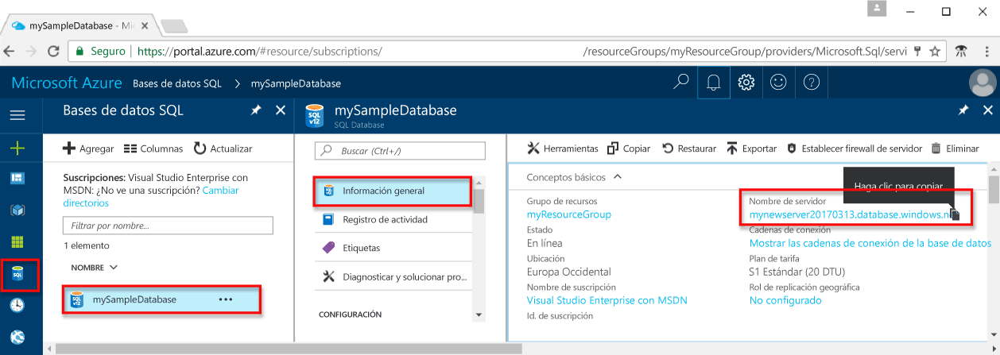

# <a name="use-java-to-query-an-azure-sql-database"></a>Uso de Java para consultar una base de datos SQL de Azure

Esta guía de introducción muestra cómo utilizar [Java](https://docs.microsoft.com/sql/connect/jdbc/microsoft-jdbc-driver-for-sql-server) para conectarse a una base de datos SQL de Azure y utilizar instrucciones Transact-SQL para consultar los datos.

## <a name="prerequisites"></a>Requisitos previos

Para completar este tutorial, asegúrese de cumplir los siguientes requisitos previos:

- Una base de datos SQL de Azure. En esta guía de inicio rápido se utilizan como punto de partida los recursos creados en una de las siguientes guías: 

   - [Creación de la base de datos: Azure Portal](sql-database-get-started-portal.md)
   - [Creación de la base de datos: CLI](sql-database-get-started-cli.md)
   - [Creación de la base de datos: PowerShell](sql-database-get-started-powershell.md)

- Una [regla de firewall de nivel de servidor](sql-database-get-started-portal.md#create-a-server-level-firewall-rule) para la dirección IP pública del equipo que usa para seguir este tutorial.

- Ha instalado Java y el software relacionado para el sistema operativo.

    - **MacOS**: instalación de Homebrew y Java y, a continuación, instalación de Maven. Consulte [pasos 1.2 y 1.3](https://www.microsoft.com/sql-server/developer-get-started/java/mac/).
    - **Ubuntu**: instalación del Kit de desarrollo de Java e instalación de Maven. Consulte [pasos 1.2, 1.3 y 1.4](https://www.microsoft.com/sql-server/developer-get-started/java/ubuntu/).
    - **Windows**: instalación del Kit de desarrollo de Java e instalación de Maven. Consulte [pasos 1.2 y 1.3](https://www.microsoft.com/sql-server/developer-get-started/java/windows/).    

## <a name="sql-server-connection-information"></a>Información de conexión de SQL server

Obtención de la información de conexión necesaria para conectarse a Azure SQL Database. En los procedimientos siguientes, necesitará el nombre completo del servidor, el nombre de la base de datos y la información de inicio de sesión.

1. Inicie sesión en [Azure Portal](https://portal.azure.com/).
2. Seleccione **Bases de datos SQL** en el menú de la izquierda y haga clic en la base de datos en la página **Bases de datos SQL**. 
3. En la página **Información general** de la base de datos, revise el nombre completo del servidor tal como se muestra en la siguiente imagen: puede mantener el ratón sobre el nombre del servidor para que aparezca la opción **Haga clic aquí para copiar**.  

    

4. Si ha olvidado la información de inicio de sesión, vaya a la página del servidor de SQL Database para ver el nombre del administrador del servidor.  Si es necesario, restablezca la contraseña.     

## <a name="create-maven-project-and-dependencies"></a>**Creación de un proyecto de Maven y sus dependencias**
1. Desde el terminal, cree un nuevo proyecto de Maven llamado **sqltest**. 

   ```bash
   mvn archetype:generate "-DgroupId=com.sqldbsamples" "-DartifactId=sqltest" "-DarchetypeArtifactId=maven-archetype-quickstart" "-Dversion=1.0.0"
   ```

2. Cuando se le solicite, escriba **Y** (Sí).
3. Cambie al directorio **sqltest** y abra ***pom.xml*** con el editor de texto.  Agregue **Microsoft JDBC Driver para SQL Server** a las dependencias del proyecto mediante el código siguiente:

   ```xml
   <dependency>
       <groupId>com.microsoft.sqlserver</groupId>
       <artifactId>mssql-jdbc</artifactId>
       <version>6.2.1.jre8</version>
   </dependency>
   ```

4. También en ***pom.xml***, agregue las siguientes propiedades al proyecto.  Si no tiene una sección de propiedades, puede agregarla después de las dependencias.

   ```xml
   <properties>
       <maven.compiler.source>1.8</maven.compiler.source>
       <maven.compiler.target>1.8</maven.compiler.target>
   </properties>
   ```

5. Guarde y cierre el archivo ***pom.xml***.

## <a name="insert-code-to-query-sql-database"></a>Inserción de código para consultar la base de datos SQL

1. Ya debe tener un archivo denominado ***App.java*** en el proyecto Maven ubicado en: ..\sqltest\src\main\java\com\sqlsamples\App.java

2. Abra el archivo y reemplace el contenido con el código siguiente y agregue los valores adecuados para el servidor, la base de datos, el usuario y la contraseña.

   ```java
   package com.sqldbsamples;

   import java.sql.Connection;
   import java.sql.Statement;
   import java.sql.PreparedStatement;
   import java.sql.ResultSet;
   import java.sql.DriverManager;

   public class App {

    public static void main(String[] args) {
    
        // Connect to database
           String hostName = "your_server.database.windows.net";
           String dbName = "your_database";
           String user = "your_username";
           String password = "your_password";
           String url = String.format("jdbc:sqlserver://%s:1433;database=%s;user=%s;password=%s;encrypt=true;hostNameInCertificate=*.database.windows.net;loginTimeout=30;", hostName, dbName, user, password);
           Connection connection = null;

           try {
                   connection = DriverManager.getConnection(url);
                   String schema = connection.getSchema();
                   System.out.println("Successful connection - Schema: " + schema);

                   System.out.println("Query data example:");
                   System.out.println("=========================================");

                   // Create and execute a SELECT SQL statement.
                   String selectSql = "SELECT TOP 20 pc.Name as CategoryName, p.name as ProductName " 
                       + "FROM [SalesLT].[ProductCategory] pc "  
                       + "JOIN [SalesLT].[Product] p ON pc.productcategoryid = p.productcategoryid";
                
                   try (Statement statement = connection.createStatement();
                       ResultSet resultSet = statement.executeQuery(selectSql)) {

                           // Print results from select statement
                           System.out.println("Top 20 categories:");
                           while (resultSet.next())
                           {
                               System.out.println(resultSet.getString(1) + " "
                                   + resultSet.getString(2));
                           }
                    connection.close();
                   }                   
           }
           catch (Exception e) {
                   e.printStackTrace();
           }
       }
   }
   ```

## <a name="run-the-code"></a>Ejecución del código

1. En el símbolo del sistema, ejecute los siguientes comandos:

   ```bash
   mvn package
   mvn -q exec:java "-Dexec.mainClass=com.sqldbsamples.App"
   ```

2. Compruebe que se han devuelto las primeras 20 filas y, a continuación, cierre la ventana de la aplicación.


## <a name="next-steps"></a>Pasos siguientes
- [Diseño de su primera base de datos SQL de Azure](sql-database-design-first-database.md)
- [Controlador JDBC de Microsoft para SQL Server](https://github.com/microsoft/mssql-jdbc)
- [Informe de los problemas y realización de preguntas](https://github.com/microsoft/mssql-jdbc/issues)

