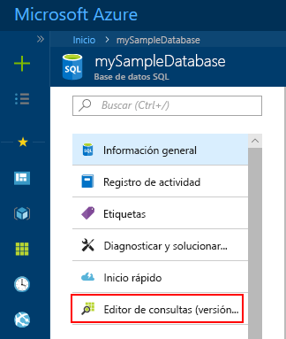
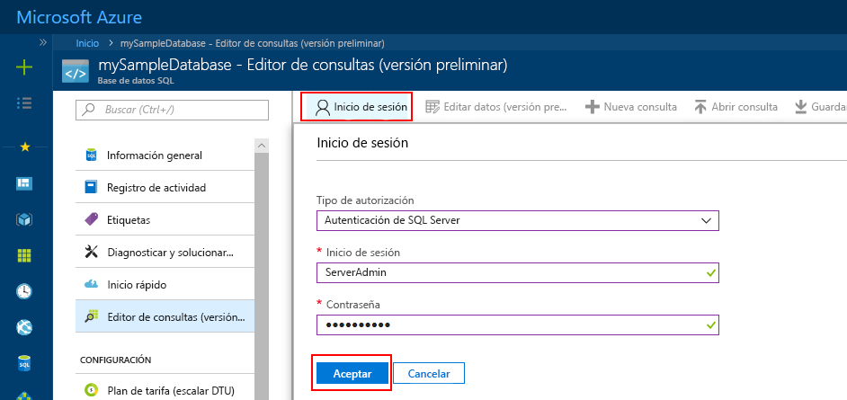
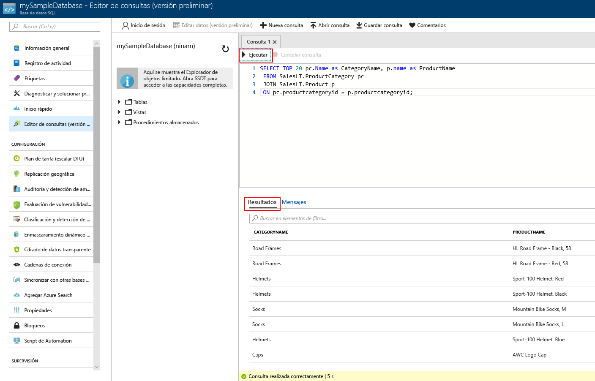

# <a name="azure-portal-use-the-sql-query-editor-to-connect-and-query-data"></a>Azure Portal: uso del Editor de consultas de SQL para conectarse y consultar datos

El Editor de consultas de SQL es una herramienta de consulta de explorador que proporciona una manera eficaz y flexible de ejecutar consultas SQL en Azure SQL Database o Azure SQL Data Warehouse sin salir de Azure Portal. Esta guía de inicio rápido muestra cómo usar el Editor de consultas para conectarse a una base de datos SQL y, después, usar instrucciones Transact-SQL para realizar consultas, insertar, actualizar y eliminar datos de la base de datos.

## <a name="prerequisites"></a>requisitos previos

En esta guía de inicio rápido se utilizan como punto de partida los recursos creados en una de las siguientes guías:

[!INCLUDE [prerequisites-create-db](../../includes/sql-database-connect-query-prerequisites-create-db-includes.md)]

## <a name="log-in-to-the-azure-portal"></a>Iniciar sesión en Azure Portal

Inicie sesión en [Azure Portal](https://portal.azure.com/).


## <a name="connect-using-sql-authentication"></a>Conexión con la autenticación de SQL
> [!NOTE]
> Asegúrese de que la opción "Permitir el acceso a servicios de Azure" esté establecida en "Activado" en la configuración de firewall de SQL Server. Esta opción proporciona al Editor de consultas de SQL acceso a las bases de datos y almacenes de datos.

1. Haga clic en **Bases de datos SQL** en el menú izquierdo y haga clic en la base de datos que desea consultar.

2. En la página de SQL Database, busque y haga clic en **Explorador de datos (versión preliminar)** en el menú de la izquierda.

    

3. Haga clic en **Inicio de sesión** y, después, cuando se le solicite, seleccione **Autenticación de SQL Server** y especifique el inicio de sesión y la contraseña de administrador del servidor que proporcionó al crear la base de datos.

    

4. Haga clic en **Aceptar** para iniciar sesión.


## <a name="connect-using-azure-ad"></a>Conexión mediante Azure AD

La configuración de un administrador de Active Directory le permite usar una identidad única para iniciar sesión en Azure Portal y en la base de datos SQL. Siga estos pasos para configurar un administrador de Active Directory para la instancia de SQL Server que creó.

> [!NOTE]
> Las cuentas de correo electrónico (por ejemplo outlook.com, hotmail.com, live.com, gmail.com, yahoo.com) ya no se admiten como administradores de Active Directory. Asegúrese de elegir un usuario que se creara de forma nativa en Azure Active Directory, o esté federado en Azure Active directory.

1. Seleccione **Servidores SQL Server** en el menú izquierdo y su servidor SQL Server en la lista de servidores.

2. Seleccione el valor **Administrador de Active Directory** en el menú de configuración de SQL Server.

3. En la hoja de administración de Active Directory, haga clic en el comando **Establecer administrador** y seleccione el usuario o grupo que será el administrador de Active Directory.

    

4. En la parte superior de la hoja de administración de Active Directory, haga clic en el comando **Guardar** para establecer el administrador de Active Directory.

Vaya a la base de datos de SQL Database que desea consultar, haga clic en **Explorador de datos (versión preliminar)** en el menú de la izquierda. La página del Explorador de datos se abre y se conecta automáticamente con la base de datos.


## <a name="run-query-using-query-editor"></a>Ejecución de la consulta mediante el Editor de consultas

Una vez autenticado, escriba la siguiente consulta en el panel del Editor de consultas para consultar los 20 primeros productos de la categoría.

```sql
 SELECT TOP 20 pc.Name as CategoryName, p.name as ProductName
 FROM SalesLT.ProductCategory pc
 JOIN SalesLT.Product p
 ON pc.productcategoryid = p.productcategoryid;
```

Haga clic en **Ejecución** y revise los resultados de la consulta en el panel **Resultados**.



## <a name="insert-data-using-query-editor"></a>Inserción de datos mediante el Editor de consultas

Utilice el código siguiente para insertar un nuevo producto en la tabla SalesLT.Product con la instrucción Transact-SQL [INSERT](https://msdn.microsoft.com/library/ms174335.aspx).

1. En la ventana Consulta, reemplace la consulta anterior con la siguiente consulta:

   ```sql
   INSERT INTO [SalesLT].[Product]
           ( [Name]
           , [ProductNumber]
           , [Color]
           , [ProductCategoryID]
           , [StandardCost]
           , [ListPrice]
           , [SellStartDate]
           )
     VALUES
           ('myNewProduct'
           ,123456789
           ,'NewColor'
           ,1
           ,100
           ,100
           ,GETDATE() );
   ```

2. En la barra de herramientas, haga clic en **Ejecutar** para insertar una nueva fila en la tabla Product.

## <a name="update-data-using-query-editor"></a>Actualización de datos mediante el Editor de consultas

Utilice el código siguiente para actualizar el nuevo producto que ha agregado anteriormente con la instrucción Transact-SQL [UPDATE](https://msdn.microsoft.com/library/ms177523.aspx).

1. En la ventana Consulta, reemplace la consulta anterior con la siguiente consulta:

   ```sql
   UPDATE [SalesLT].[Product]
   SET [ListPrice] = 125
   WHERE Name = 'myNewProduct';
   ```

2. En la barra de herramientas, haga clic en **Ejecutar** para actualizar la fila especificada en la tabla Product.

## <a name="delete-data-using-query-editor"></a>Eliminación de datos mediante el Editor de consultas

Utilice el código siguiente para eliminar el nuevo producto que ha agregado anteriormente con la instrucción Transact-SQL [DELETE](https://msdn.microsoft.com/library/ms189835.aspx).

1. En la ventana Consulta, reemplace la consulta anterior con la siguiente consulta:

   ```sql
   DELETE FROM [SalesLT].[Product]
   WHERE Name = 'myNewProduct';
   ```

2. En la barra de herramientas, haga clic en **Ejecutar** para eliminar la fila especificada en la tabla Product.


## <a name="query-editor-considerations"></a>Consideraciones acerca del Editor de consultas

Hay algunos aspectos que debe conocer al trabajar con el Editor de consultas mientras permanece en estado de versión preliminar:

1. Asegúrese de que ha establecido la opción "Permitir el acceso a servicios de Azure" en "Activado" en la configuración de firewall de Azure SQL Server. Esta opción proporciona al Editor de consultas de SQL acceso a los almacenes de datos y bases de datos de SQL.

2. El inicio de sesión del administrador de Azure Active Directory no funciona con cuentas que tengan habilitada la autenticación en dos fases.

3. Las cuentas de correo electrónico (por ejemplo outlook.com, hotmail.com, live.com, gmail.com, yahoo.com) ya no se admiten como administradores de Active Directory. Asegúrese de elegir un usuario que se creara de forma nativa en Azure Active Directory, o esté federado en Azure Active directory

4. Aún no se admiten consultas de tipos de datos espaciales en el Editor de consultas. La consulta de las columnas espaciales producirá un error 'System.IO.FileNotFoundException'.

5. No hay compatibilidad con IntelliSense para las vistas y las tablas de base de datos. Sin embargo, el editor permite autocompletar los nombres que ya se han escrito.

6. Al presionar la tecla F5, se actualizará la página del Editor de consultas y se perderá la consulta en la que se esté trabajando. Utilice el botón Ejecutar de la barra de herramientas para ejecutar consultas.


## <a name="next-steps"></a>pasos siguientes

- Para obtener información acerca de los comandos de Transact-SQL admitidos en las bases de datos de Azure SQL, vea [Diferencias de Transact-SQL en la base de datos SQL](sql-database-transact-sql-information.md).
