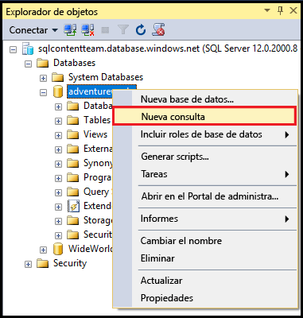
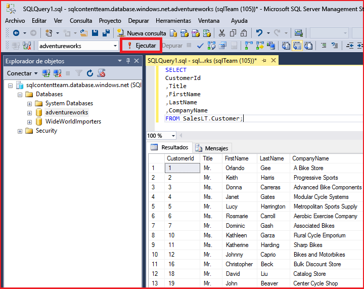

# Conexión a Base de datos SQL con SQL Server Management Studio y ejecución de una consulta T-SQL de ejemplo
> [!div class="op_single_selector"]
> * [Visual Studio](sql-database-connect-query.md)
> * [SSMS](sql-database-connect-query-ssms.md)
> * [Excel](sql-database-connect-excel.md)
> 
> 

Este artículo explica cómo conectarse a una Base de datos SQL de Azure con SQL Server Management Studio (SSMS). Después de conectarse correctamente, ejecutamos una consulta de Transact-SQL (T-SQL) simple para comprobar la comunicación con la base de datos.

[!INCLUDE [Instalación de SSMS](../../includes/sql-server-management-studio-install.md)]

[!INCLUDE [Conexión SSMS](../../includes/sql-database-sql-server-management-studio-connect-server-principal.md)]

## Ejecutar consultas de ejemplo
Después de conectarse al servidor, puede conectarse a una base de datos y ejecutar una consulta de ejemplo. Si no está familiarizado con la escritura de consultas, consulte [Escribir instrucciones Transact-SQL](https://msdn.microsoft.com/library/ms365303.aspx).

1. En el **Explorador de objetos**, vaya a una base de datos del servidor como la base de datos de ejemplo **AdventureWorks**.
2. Haga clic con el botón derecho en la base de datos y seleccione **Nueva consulta**:
   
    
3. En la ventana de consulta, copie y pegue lo siguiente:
   
        SELECT
        CustomerId
        ,Title
        ,FirstName
        ,LastName
        ,CompanyName
        FROM SalesLT.Customer;
4. Haga clic en el botón **Ejecutar**:
   
    

## Pasos siguientes
Puede usar instrucciones T-SQL para crear y administrar bases de datos en Azure casi de la misma manera que con SQL Server. Si está familiarizado con el uso de T-SQL con SQL Server, consulte [Información sobre Transact-SQL de Base de datos SQL de Azure](sql-database-transact-sql-information.md) para obtener un resumen de las diferencias.

Si no está familiarizado con T-SQL, consulte [Tutorial: Escribir instrucciones Transact-SQL](https://msdn.microsoft.com/library/ms365303.aspx) y [Referencia de Transact-SQL (motor de base de datos)](https://msdn.microsoft.com/library/bb510741.aspx).

Para comenzar con la creación de usuarios de base de datos y administradores de usuarios de base de datos, consulte [Introducción a la seguridad de Base de datos SQL de Azure](sql-database-get-started-security.md).

Para más información acerca de SSMS, consulte [Usar SQL Server Management Studio](https://msdn.microsoft.com/library/ms174173.aspx).

<!---HONumber=AcomDC_0824_2016-->