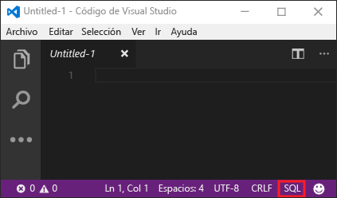
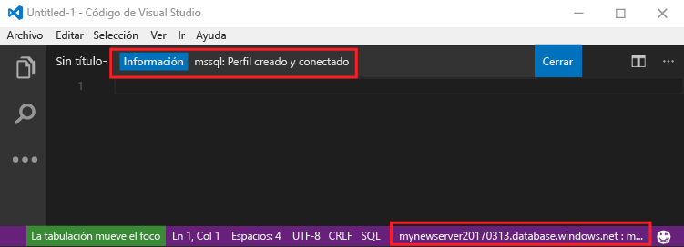
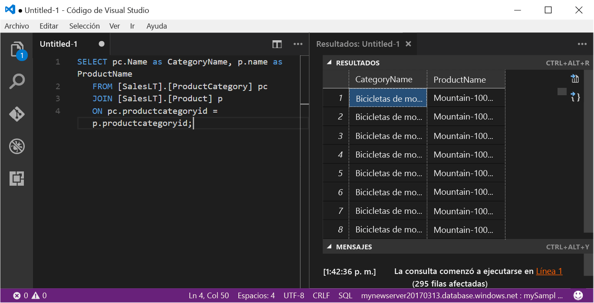

# <a name="azure-sql-database-use-visual-studio-code-to-connect-and-query-data"></a>Azure SQL Database: uso de Visual Studio Code para conectar y consultar datos

[Visual Studio Code](https://code.visualstudio.com/docs) es un editor de código gráfico para Linux, Mac OS y Windows que admite extensiones, incluidas la [extensión mssql](https://aka.ms/mssql-marketplace) para realizar consultas en Microsoft SQL Server, Azure SQL Database y SQL Data Warehouse. Esta guía de inicio rápido muestra cómo usar Visual Studio Code para conectarse a una base de datos de SQL Azure Database y después usar las instrucciones Transact-SQL para consultar, insertar, actualizar y eliminar datos en la base de datos.

## <a name="prerequisites"></a>Requisitos previos

En esta guía de inicio rápido se utilizan como punto de partida los recursos creados en una de las siguientes guías:

[!INCLUDE [prerequisites-create-db](../../includes/sql-database-connect-query-prerequisites-create-db-includes.md)]

#### <a name="install-vs-code"></a>Instalación de VS Code

Antes de empezar, asegúrese de que tiene instalada la versión más reciente de [Visual Studio Code](https://code.visualstudio.com/Download) y cargue la [extensión mssql](https://aka.ms/mssql-marketplace). Para obtener instrucciones de instalación para la extensión mssql, vea [Install VS Code](https://docs.microsoft.com/sql/linux/sql-server-linux-develop-use-vscode#install-vs-code) (Instalación de VS Code) y [mssql for Visual Studio Code](https://marketplace.visualstudio.com/items?itemName=ms-mssql.mssql) (mssql para Visual Studio Code). 

## <a name="configure-vs-code"></a>Configuración del código de VS 

### <a name="mac-os"></a>**Mac OS**
Para macOS, debe instalar OpenSSL, que es un requisito previo para DotNet Core que la extensión mssql utiliza. Abra el terminal y escriba los siguientes comandos para instalar **brew** y **OpenSSL**. 

```bash
ruby -e "$(curl -fsSL https://raw.githubusercontent.com/Homebrew/install/master/install)"
brew update
brew install openssl
mkdir -p /usr/local/lib
ln -s /usr/local/opt/openssl/lib/libcrypto.1.0.0.dylib /usr/local/lib/
ln -s /usr/local/opt/openssl/lib/libssl.1.0.0.dylib /usr/local/lib/
```

### <a name="linux-ubuntu"></a>**Linux (Ubuntu)**

No se necesita ninguna configuración especial.

### <a name="windows"></a>**Windows**

No se necesita ninguna configuración especial.

## <a name="sql-server-connection-information"></a>Información de conexión de SQL server

Obtención de la información de conexión necesaria para conectarse a Azure SQL Database. En los procedimientos siguientes, necesitará el nombre completo del servidor, el nombre de la base de datos y la información de inicio de sesión.

[!INCLUDE [prerequisites-server-connection-info](../../includes/sql-database-connect-query-prerequisites-server-connection-info-includes.md)]

## <a name="set-language-mode-to-sql"></a>Definición del modo de lenguaje en SQL

El modo de lenguaje está establecido en **SQL** en Visual Studio Code para habilitar comandos mssql y T-SQL IntelliSense.

1. Abra una nueva ventana de Visual Studio Code. 

2. Haga clic en **Texto sin formato** en la esquina inferior derecha de la barra de estado.
3. En menú desplegable **Seleccionar modo de lenguaje** que se abre, escriba **SQL** y, a continuación, presione **ENTRAR** para establecer el modo de lenguaje en SQL. 

   

## <a name="connect-to-your-database"></a>Conectarse a la base de datos

Use Visual Studio Code para establecer una conexión con el servidor de Azure SQL Database.

> [!IMPORTANT]
> Antes de continuar, asegúrese de que están preparados el servidor, la base de datos y la lista de información de inicio de sesión. Cuando comience a escribir la información de perfil de conexión, si cambia el foco de Visual Studio Code, tendrá que reiniciar la creación del perfil de conexión.
>

1. En VS Code, presione **CTRL + MAYÚS + P** (o **F1**) para abrir la paleta de comandos.

2. Escriba **sqlcon** y presione **ENTRAR**.

3. Presione **ENTRAR** para seleccionar **Create Connection Profile** (Crear perfil de conexión). Al hacerlo, se creará un perfil de conexión para la instancia de SQL Server.

4. Siga las indicaciones para especificar las propiedades de conexión para el nuevo perfil de conexión. Después de especificar cada valor, presione **ENTRAR** para continuar. 

   | Configuración       | Valor sugerido | Descripción |
   | ------------ | ------------------ | ------------------------------------------------- | 
   | **Nombre de servidor | Nombre completo del servidor | Dicho nombre debe parecerse al siguiente: **mynewserver20170313.database.windows.net**. |
   | **Nombre de la base de datos** | mySampleDatabase | El nombre de la base de datos con la que se realizará la conexión. |
   | **Autenticación** | Inicio de sesión SQL| Autenticación de SQL es el único tipo de autenticación que hemos configurado en este tutorial. |
   | **Nombre de usuario** | La cuenta de administrador del servidor | Es la cuenta que especificó cuando creó el servidor. |
   | **Contraseña (Inicio de sesión de SQL)** | La contraseña de la cuenta de administrador del servidor | Es la contraseña que especificó cuando creó el servidor. |
   | **¿Guardar la contraseña?** | Sí o no | Seleccione Sí si no desea escribir la contraseña cada vez que inicie sesión. |
   | **Escribir un nombre para este perfil** | Un nombre de perfil, como **mySampleDatabase** | Un nombre de perfil guardado acelera la conexión en los inicios de sesión posteriores. | 

5. Presione la tecla **ESC** para cerrar el mensaje de información que indica que el perfil se ha creado y conectado.

6. Compruebe la conexión en la barra de estado.

   

## <a name="query-data"></a>Datos de consulta

Utilice el código siguiente para consultar los 20 primeros productos por categoría con la instrucción Transact-SQL [SELECT](https://msdn.microsoft.com/library/ms189499.aspx).

1. En la ventana del **editor**, escriba la siguiente consulta en la ventana de consulta vacía:

   ```sql
   SELECT pc.Name as CategoryName, p.name as ProductName
   FROM [SalesLT].[ProductCategory] pc
   JOIN [SalesLT].[Product] p
   ON pc.productcategoryid = p.productcategoryid;
   ```

2. Presione **CTRL + MAYÚS + E** para recuperar datos de las tablas Product y ProductCategory.

    

## <a name="insert-data"></a>Insertar datos

Utilice el código siguiente para insertar un nuevo producto en la tabla SalesLT.Product con la instrucción Transact-SQL [INSERT](https://msdn.microsoft.com/library/ms174335.aspx).

1. En la ventana del **editor**, elimine la consulta anterior y escriba la siguiente consulta:

   ```sql
   INSERT INTO [SalesLT].[Product]
           ( [Name]
           , [ProductNumber]
           , [Color]
           , [ProductCategoryID]
           , [StandardCost]
           , [ListPrice]
           , [SellStartDate]
           )
     VALUES
           ('myNewProduct'
           ,123456789
           ,'NewColor'
           ,1
           ,100
           ,100
           ,GETDATE() );
   ```

2. Presione **CTRL + MAYÚS + E** para insertar una nueva fila en la tabla Product.

## <a name="update-data"></a>Actualización de datos

Utilice el código siguiente para actualizar el nuevo producto que ha agregado anteriormente con la instrucción Transact-SQL [UPDATE](https://msdn.microsoft.com/library/ms177523.aspx).

1.  En la ventana del **editor**, elimine la consulta anterior y escriba la siguiente consulta:

   ```sql
   UPDATE [SalesLT].[Product]
   SET [ListPrice] = 125
   WHERE Name = 'myNewProduct';
   ```

2. Presione **CTRL + MAYÚS + E** para actualizar la fila especificada en la tabla Product.

## <a name="delete-data"></a>Eliminación de datos

Utilice el código siguiente para eliminar el nuevo producto que ha agregado anteriormente con la instrucción Transact-SQL [DELETE](https://docs.microsoft.com/sql/t-sql/statements/delete-transact-sql).

1. En la ventana del **editor**, elimine la consulta anterior y escriba la siguiente consulta:

   ```sql
   DELETE FROM [SalesLT].[Product]
   WHERE Name = 'myNewProduct';
   ```

2. Presione **CTRL + MAYÚS + E** para eliminar la fila especificada en la tabla Product.

## <a name="next-steps"></a>Pasos siguientes

- Para conectarse y realizar consultas mediante SQL Server Management Studio, consulte el artículo de [Conexión y realización de consultas con SSMS](sql-database-connect-query-ssms.md).
- Para conectarse y consultar mediante Azure Portal, consulte [Conexión y consulta con el editor de consultas SQL de Azure Portal](sql-database-connect-query-portal.md).
- Si está interesado en ver un artículo de la revista de MSDN sobre el uso de Visual Studio Code, consulte la entrada del blob sobre cómo [crear un IDE de base de datos con la extensión MSSQL](https://msdn.microsoft.com/magazine/mt809115).
