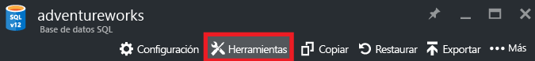
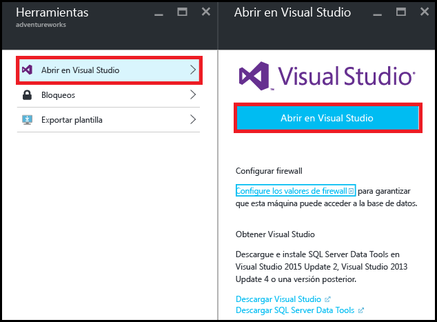
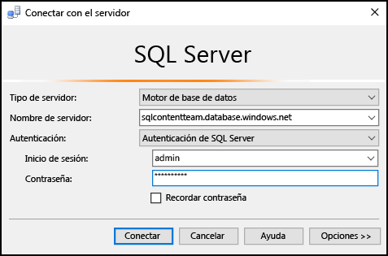
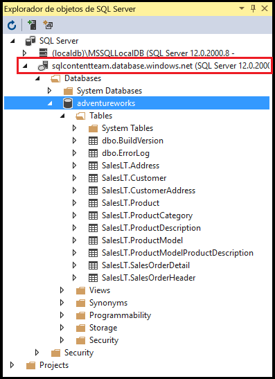
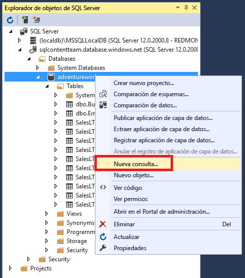
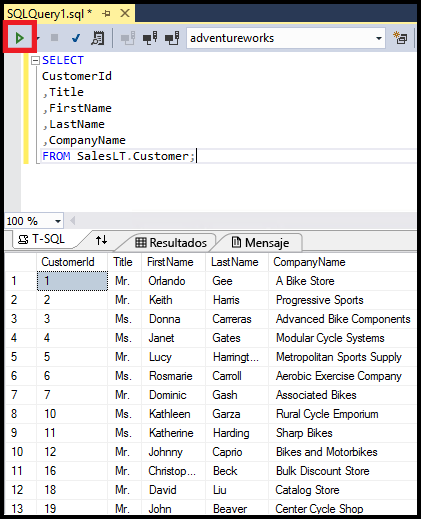

<properties
	pageTitle="Conexión a Base de datos SQL con una consulta en C# | Microsoft Azure"
	description="Escribir un programa en C# para realizar consultas y conectarse a Base de datos SQL. Información acerca de direcciones IP, cadenas de conexión, inicio de sesión seguro y Visual Studio gratuito."
	services="sql-database"
	keywords="consulta de base de datos en c#, consulta en c#, conectarse a base de datos, SQL C#"
	documentationCenter=""
	authors="stevestein"
	manager="jhubbard"
	editor=""/>

<tags
	ms.service="sql-database"
	ms.workload="data-management"
	ms.tgt_pltfrm="na"
	ms.devlang="dotnet"
	ms.topic="get-started-article"
	ms.date="08/17/2016"
	ms.author="stevestein"/>

# Conexión a una base de datos SQL con Visual Studio

> [AZURE.SELECTOR]
- [Visual Studio](sql-database-connect-query.md)
- [SSMS](sql-database-connect-query-ssms.md)
- [Excel](sql-database-connect-excel.md)

Aprenda a conectarse a una base de datos SQL de Azure con Visual Studio.

## Requisitos previos

Para conectarse a una base de datos SQL con Visual Studio, necesita lo siguiente:

- Una Base de datos SQL a la que conectarse. Este artículo usa la base de datos de ejemplo **AdventureWorks**. Para conseguir la base de datos de ejemplo AdventureWorks, consulte [Creación de la base de datos de demostración](sql-database-get-started.md).

- Visual Studio 2013, actualización 4 o posterior. Microsoft ahora ofrece Visual Studio Community *gratis*.
 - [Visual Studio Community, descarga](http://www.visualstudio.com/products/visual-studio-community-vs)
 - [Más opciones para Visual Studio gratis](http://www.visualstudio.com/products/free-developer-offers-vs.aspx)

## Abra Visual Studio desde el Portal de Azure

1. Inicie sesión en el [Portal de Azure](https://portal.azure.com/).

2. Haga clic en **More Services** (Más servicios) > **Bases de datos SQL**
3. Abra hoja de la base de datos **AdventureWorks** y haga clic en la base de datos *AdventureWorks*.

6. En la parte superior de la hoja de la base de datos, haga clic en **Herramientas**:

	

7. Haga clic en **Abrir en Visual Studio** (si necesita Visual Studio, haga clic en el vínculo de descarga):

	

8. Visual Studio se abre con la ventana **Conectar con el servidor** ya establecida para conectarse al servidor y a la base de datos que seleccionó en el portal. (Haga clic en **Opciones** para comprobar que se ha establecido la conexión a la base de datos correcta). Escriba la contraseña de administrador del servidor y haga clic en **Conectar**.

	

8. Si no dispone de una regla de firewall configurada para la dirección IP del equipo, aparecerá el mensaje *No se puede conectar* en este momento. Para crear una regla de firewall, consulte [Configuración de un firewall de nivel de servidor en Base de datos SQL de Azure mediante el Portal de Azure](sql-database-configure-firewall-settings.md).

9. Después de conectarse correctamente, se abrirá la ventana del **Explorador de objetos de SQL Server** con una conexión a la base de datos.

	

## Ejecución de una consulta de ejemplo

Una vez conectados a la base de datos, los pasos siguientes muestran cómo ejecutar una consulta simple:

2. Haga clic con el botón derecho en la base de datos y seleccione **Nueva consulta**.

	

3. En la ventana de consulta, copie y pegue el código siguiente.

		SELECT
		CustomerId
		,Title
		,FirstName
		,LastName
		,CompanyName
		FROM SalesLT.Customer;

4. Haga clic en el botón **Ejecutar** para ejecutar la consulta:

	

## Pasos siguientes

- La apertura de bases de datos SQL en Visual Studio SQL Server Data Tools. Para más información, consulte [SQL Server Data Tools](https://msdn.microsoft.com/library/hh272686.aspx).
- Para conectarse a una base de datos SQL mediante código, consulte [Conexión a Base de datos SQL mediante .NET (C#)](sql-database-develop-dotnet-simple.md).

<!----HONumber=AcomDC_0824_2016-->