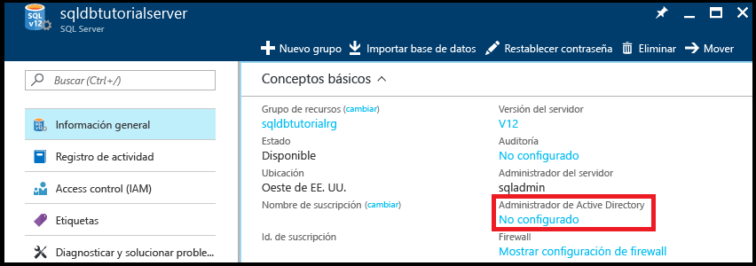
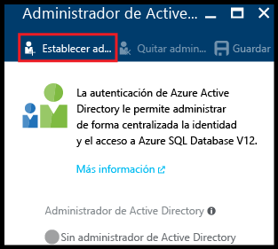
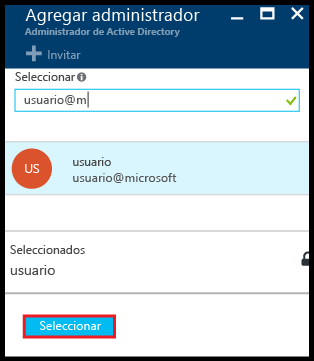
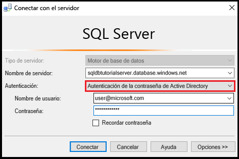
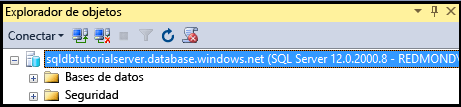
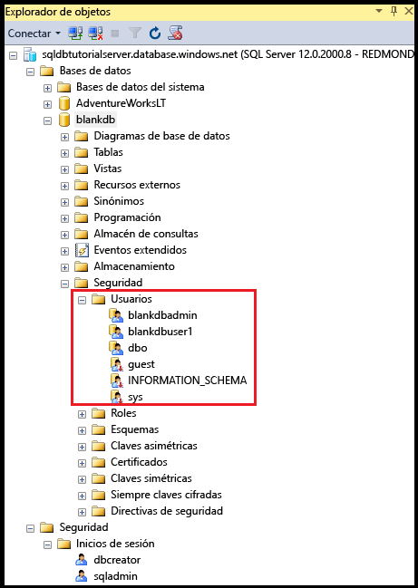
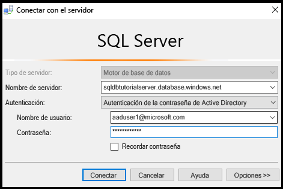
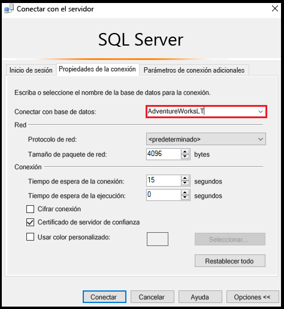
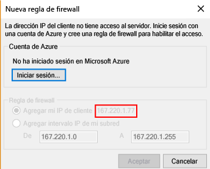
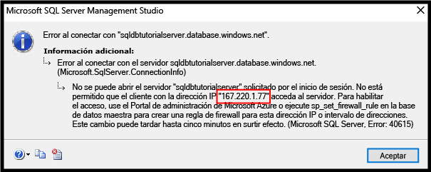

# <a name="sql-database-tutorial-aad-authentication-logins-and-user-accounts-database-roles-permissions-server-level-firewall-rules-and-database-level-firewall-rules"></a>Tutorial de SQL Database: Autenticación, inicios de sesión y cuentas de usuario de AAD, roles de base de datos, permisos, reglas de firewall de nivel de servidor y de nivel de base de datos
En este tutorial de introducción, aprenderá a usar SQL Server Management Studio para trabajar con la autenticación, los inicios de sesión, los usuarios y roles de base de datos de Azure Active Directory que conceden acceso y permisos a los servidores y bases de datos de Azure SQL Database. Aprenderá a:

- Ver los permisos de usuario en la base de datos maestra y en las bases de datos de usuario
- Crear inicios de sesión y usuarios basados en la autenticación de Azure Active Directory
- Conceder permisos específicos de base de datos para todo el servidor a los usuarios
- Iniciar sesión en una base de datos de usuario como un usuario sin derechos de administrador
- Crear reglas de firewall de nivel de base de datos para los usuarios de la base de datos
- Crear reglas de firewall de nivel de servidor para los administradores de este

**Estimación del tiempo**: este tutorial se realiza en 45 minutos (suponiendo que ya se hayan cumplido los requisitos previos).

## <a name="prerequisites"></a>Requisitos previos

* Necesitará una cuenta de Azure. Puede [abrir una cuenta gratuita de Azure](/pricing/free-trial/?WT.mc_id=A261C142F) o [activar las ventajas que disfrutan los suscriptores de Visual Studio](/pricing/member-offers/msdn-benefits-details/?WT.mc_id=A261C142F). 

* Debe poder conectarse a Azure Portal mediante una cuenta que sea miembro del rol de colaborador o propietario de la suscripción. Para más información sobre el acceso basado en roles (RBAC), consulte [Introducción a la administración de acceso en Azure Portal](../active-directory/role-based-access-control-what-is.md).

* Ha finalizado la [introducción a los servidores, las bases de datos y las reglas de firewalls de Azure SQL Database mediante Azure Portal y SQL Server Management Studio](sql-database-get-started.md) o la [versión de PowerShell](sql-database-get-started-powershell.md) equivalente de este tutorial. Si no es así, realice el tutorial que es requisito previo o ejecute el script de PowerShell al final de la [versión de PowerShell](sql-database-get-started-powershell.md) de este tutorial antes de continuar.

   > [!NOTE]
   > La finalización del tutorial relacionado para la autenticación de SQL Server, [SQL Database tutorial: SQL authentication, logins and user accounts, database roles, permissions, server-level firewall rules, and database-level firewall rules](sql-database-control-access-sql-authentication-get-started.md)(Tutorial de SQL Database: Autenticación, inicios de sesión y cuentas de usuario de SQL, roles de base de datos, permisos, reglas de firewall de nivel de servidor y de nivel de base de datos), es opcional. Sin embargo, hay conceptos que se tratan en ese tutorial y que no se repiten aquí. Los procedimientos de este tutorial relacionados con las reglas de firewall de nivel de servidor y de nivel de base de datos no son obligatorios si ya ha completado este tutorial en los mismos equipos (con las mismas direcciones IP) y están marcados como opcionales por esa razón. Igualmente, en las capturas de pantalla de este tutorial se supone que ya ha completado el tutorial relacionado. 
   >

* Ha creado y rellenado una instancia de Azure Active Directory. Para más información, consulte [Integración de las identidades locales con Azure Active Directory](../active-directory/active-directory-aadconnect.md), [Incorporación de su nombre de dominio personalizado a Azure Active Directory](../active-directory/active-directory-add-domain.md), [Microsoft Azure now supports federation with Windows Server Active Directory](https://azure.microsoft.com/blog/2012/11/28/windows-azure-now-supports-federation-with-windows-server-active-directory/) (Microsoft Azure admite ahora Windows Server Active Directory), [Administración de su directorio de Azure AD](https://msdn.microsoft.com/library/azure/hh967611.aspx), [Administración de Azure AD mediante Windows PowerShell](https://msdn.microsoft.com/library/azure/jj151815.aspx) y [Hybrid Identity Required Ports and Protocols](../active-directory/active-directory-aadconnect-ports.md) (Puertos y protocolos requeridos para la identidad híbrida).

> [!NOTE]
> Este tutorial le servirá para conocer el contenido de estos temas: [Control de acceso a Azure SQL Database](sql-database-control-access.md), [Control y concesión de acceso a bases de datos](sql-database-manage-logins.md), [Entidades de seguridad](https://msdn.microsoft.com/library/ms181127.aspx), [Roles de nivel de base de datos](https://msdn.microsoft.com/library/ms189121.aspx), [Introducción a las reglas de firewall de Azure SQL Database](sql-database-firewall-configure.md), y [Azure Active Directory authentication](sql-database-aad-authentication.md) (Autenticación de Azure Active Directory). 
>  

## <a name="sign-in-to-the-azure-portal-using-your-azure-account"></a>Inicie sesión en Azure Portal con su cuenta.
Con una [suscripción existente](https://account.windowsazure.com/Home/Index), siga estos pasos para conectarse al portal de Azure.

1. Abra el explorador que prefiera y conéctese al [Portal de Azure](https://portal.azure.com/).
2. Inicie sesión en el [Portal de Azure](https://portal.azure.com/).
3. En la página **Iniciar sesión** , proporcione las credenciales de la suscripción.
   
   


<a name="create-logical-server-bk"></a>

## <a name="provision-an-azure-active-directory-admin-for-your-sql-logical-server"></a>Aprovisionamiento de un administrador de Azure Active Directory para el servidor lógico de SQL

En esta sección del tutorial, puede ver información sobre la configuración de seguridad del servidor lógico en Azure Portal.

1. Abra la hoja **SQL Server** del servidor lógico y lea la información de la página de **introducción**. Tenga en cuenta que no se ha configurado un administrador de Azure Active Directory.

   

2. Haga clic en **No configurado** en el panel **Información esencial** para abrir la hoja **Administrador de Active Directory**.

   

3. Haga clic en **Establecer administrador** para que se abra la hoja **Agregar administrador** y, a continuación, seleccione una cuenta de usuario o grupo de Active Directory como administrador de Active Directory para el servidor.

   

4. Haga clic en **Seleccionar** y después en **Guardar**.

   

> [!NOTE]
> Para revisar la información de conexión de este servidor, vaya a [View or update server settings](sql-database-view-update-server-settings.md) (Visualización o actualización de la configuración del servidor). Para esta serie de tutoriales, el nombre completo del servidor es 'sqldbtutorialserver.database.windows.net'.
>

## <a name="connect-to-sql-server-using-sql-server-management-studio-ssms"></a>Conexión con SQL Server mediante SQL Server Management Studio (SSMS)

1. Si aún no lo ha hecho descargue e instale la versión más reciente de SSMS en [Descarga de SQL Server Management Studio](https://msdn.microsoft.com/library/mt238290.aspx). Para estar siempre actualizado, la versión más reciente de SSMS le avisará cuando haya una nueva versión disponible para su descarga.

2. Después de la instalación, escriba **Microsoft SQL Server Management Studio** en el cuadro de búsqueda de Windows y haga clic en **Entrar** para abrir SSMS.

   

3. En el cuadro de diálogo **Conectar al servidor**, seleccione uno de los métodos de autenticación de Active Directory y, a continuación, proporcione la información de autenticación adecuada. Para obtener información sobre cómo elegir un método, consulte [Autenticación con Azure Active Directory](sql-database-aad-authentication.md) y [SSMS support for Azure AD MFA](sql-database-ssms-mfa-authentication.md) (Compatibilidad con SSMS de Azure AD MFA).

   

4. Escriba la información necesaria para conectarse a su servidor SQL Server mediante la autenticación de SQL Server y la cuenta de administrador del servidor.

5. Haga clic en **Conectar**.

   

## <a name="view-the-server-admin-account-and-its-permissions"></a>Visualización de la cuenta de administrador del servidor y sus permisos 
En esta sección del tutorial, puede ver información acerca de la cuenta de administrador del servidor y sus permisos en la base de datos maestra y en las bases de datos de usuario.

1. En el Explorador de objetos, expanda **Bases de datos**, expanda **Bases de datos de sistema**, expanda **Maestra**, expanda **Seguridad** y, finalmente, expanda **Usuarios**. Tenga en cuenta que se ha creado una cuenta de usuario en la base de datos maestra para el administrador de Active Directory. Observe también que no se ha creado ningún inicio de sesión para la cuenta de usuario de administrador de Active Directory.

   

   > [!NOTE]
   > Para más información acerca de las cuentas de usuario que aparecen, consulte [Entidades de seguridad](https://msdn.microsoft.com/library/ms181127.aspx).
   >

2. En el Explorador de objetos, haga clic con el botón derecho en **Maestra** y, a continuación, haga clic en **Nueva consulta** para abrir una ventana de consulta conectada a la base de datos maestra.
3. En la ventana de consulta, ejecute la siguiente consulta para que devuelva información sobre el usuario que ejecuta la consulta. Tenga en cuenta que se devuelve user@microsoft.com para la cuenta de usuario que ejecuta esta consulta (se obtendrá un resultado diferente cuando se consulte una base de datos de usuario más adelante en este procedimiento).

   ```
   SELECT USER;
   ```

   

4. En la ventana de consulta, ejecute la siguiente consulta para que devuelva información sobre los permisos del usuario administrador de Active Directory. Observe que el usuario administrador de Active Directory tiene permisos para conectarse a la base de datos maestra, crear inicios de sesión y usuarios, seleccionar la información de la tabla sys.sql_logins y agregar usuarios a los roles de base de datos dbmanager y dbcreator. Estos permisos se suman a los permisos concedidos al rol público desde el que todos los usuarios heredan permisos (como los permisos para seleccionar información de determinadas tablas). Para más información, consulte [Permisos](https://msdn.microsoft.com/library/ms191291.aspx).

   ```
   SELECT prm.permission_name
      , prm.class_desc
      , prm.state_desc
      , p2.name as 'Database role'
      , p3.name as 'Additional database role' 
   FROM sys.database_principals p
   JOIN sys.database_permissions prm
      ON p.principal_id = prm.grantee_principal_id
      LEFT JOIN sys.database_principals p2
      ON prm.major_id = p2.principal_id
      LEFT JOIN sys.database_role_members r
      ON p.principal_id = r.member_principal_id
      LEFT JOIN sys.database_principals p3
      ON r.role_principal_id = p3.principal_id
   WHERE p.name = 'user@microsoft.com';
   ```

   

6. En el Explorador de objetos, expanda **blankdb**, expanda **Seguridad** y, finalmente, expanda **Usuarios**. Observe que no hay ninguna cuenta de usuario denominada user@microsoft.com en esta base de datos.

   

7. En el Explorador de objetos, haga clic con el botón derecho en **blankdb** y, después, haga clic en **Nueva consulta**.

8. En la ventana de consulta, ejecute la siguiente consulta para que devuelva información sobre el usuario que ejecuta la consulta. Observe que se devuelve dbo para la cuenta de usuario que ejecuta esta consulta (de forma predeterminada, el inicio de sesión de administrador del servidor se asigna a la cuenta de usuario de dbo de cada base de datos de usuario).

   ```
   SELECT USER;
   ```

   

9. En la ventana de consulta, ejecute la siguiente consulta para que devuelva información sobre los permisos del usuario dbo. Observe que dbo es un miembro del rol público y también un miembro del rol fijo de base de datos db_owner. Consulte [Roles de nivel de base de datos](https://msdn.microsoft.com/library/ms189121.aspx) para más información.

   ```
   SELECT prm.permission_name
      , prm.class_desc
      , prm.state_desc
      , p2.name as 'Database role'
      , p3.name as 'Additional database role' 
   FROM sys.database_principals AS p
   JOIN sys.database_permissions AS prm
      ON p.principal_id = prm.grantee_principal_id
      LEFT JOIN sys.database_principals AS p2
      ON prm.major_id = p2.principal_id
      LEFT JOIN sys.database_role_members r
      ON p.principal_id = r.member_principal_id
      LEFT JOIN sys.database_principals AS p3
      ON r.role_principal_id = p3.principal_id
   WHERE p.name = 'dbo';
   ```

   

10. Si lo desea, repita los tres pasos anteriores para la base de datos de usuario AdventureWorksLT.

## <a name="create-a-new-user-in-the-adventureworkslt-database-with-select-permissions"></a>Creación de un nuevo usuario en la base de datos AdventureWorksLT con permisos SELECT

En esta sección del tutorial, va a crear una cuenta de usuario en la base de datos AdventureWorksLT basada en un nombre principal de un usuario de Azure AD o en el nombre para mostrar de un grupo de Azure AD, va a probar los permisos de usuario como miembro del rol público, conceder permisos SELECT a este usuario y, finalmente, probar de nuevo los permisos de este.

> [!NOTE]
> Los usuarios de nivel de base de datos ([usuarios contenidos](https://msdn.microsoft.com/library/ff929188.aspx)) aumentan la portabilidad de la base de datos, una funcionalidad que se explorará en tutoriales posteriores.
>

1. En el Explorador de objetos, haga clic con el botón derecho en **AdventureWorksLT** y, a continuación, haga clic en **Nueva consulta** para abrir una ventana de consulta conectada a la base de datos AdventureWorksLT.
2. Ejecute la instrucción siguiente para crear una cuenta de usuario en la base de datos AdventureWorksLT para un usuario del dominio de Microsoft denominado aaduser1.

   ```
   CREATE USER [aaduser1@microsoft.com]
   FROM EXTERNAL PROVIDER;
   ```
   

3. En la ventana de consulta, ejecute la siguiente consulta para que devuelva información sobre los permisos del usuario user1. Observe que los únicos permisos que tiene user1 son los permisos heredados del rol público.

   ```
   SELECT prm.permission_name
      , prm.class_desc
      , prm.state_desc
      , p2.name as 'Database role'
      , p3.name as 'Additional database role' 
   FROM sys.database_principals AS p
   JOIN sys.database_permissions AS prm
      ON p.principal_id = prm.grantee_principal_id
      LEFT JOIN sys.database_principals AS p2
      ON prm.major_id = p2.principal_id
      LEFT JOIN sys.database_role_members r
      ON p.principal_id = r.member_principal_id
      LEFT JOIN sys.database_principals AS p3
      ON r.role_principal_id = p3.principal_id
   WHERE p.name = 'aaduser1@microsoft.com';
   ```

   

4. Ejecute las siguientes consultas para intentar consultar una tabla en la base de datos AdventureWorksLT como user1.

   ```
   EXECUTE AS USER = 'aaduser1@microsoft.com';  
   SELECT * FROM [SalesLT].[ProductCategory];
   REVERT;
   ```

   

5. Ejecute la siguiente instrucción para conceder a user1 permisos SELECT en la tabla ProductCategory del esquema SalesLT.

   ```
   GRANT SELECT ON OBJECT::[SalesLT].[ProductCategory] to [aaduser1@microsoft.com];
   ```

   

6. Ejecute las siguientes consultas para intentar consultar una tabla en la base de datos AdventureWorksLT como user1.

   ```
   EXECUTE AS USER = 'aaduser1@microsoft.com';  
   SELECT * FROM [SalesLT].[ProductCategory];
   REVERT;
   ```

   

## <a name="create-a-database-level-firewall-rule-for-adventureworkslt-database-users"></a>Creación de una regla de firewall de nivel de base de datos para los usuarios de la base de datos AdventureWorksLT

> [!NOTE]
> No es necesario completar este procedimiento si ya completó el procedimiento equivalente del tutorial relacionado sobre autenticación de SQL Server, [SQL Database tutorial: SQL authentication, logins and user accounts, database roles, permissions, server-level firewall rules, and database-level firewall rules](sql-database-control-access-sql-authentication-get-started.md) (Tutorial de SQL Database: Autenticación, inicios de sesión y cuentas de usuario de SQL, roles de base de datos, permisos, reglas de firewall de nivel de servidor y de nivel de base de datos), y está utilizando el mismo equipo con la misma dirección IP.
>

En esta sección del tutorial, va a iniciar sesión con la nueva cuenta de usuario desde un equipo con una dirección IP diferente, va a crear una regla de firewall de nivel de base de datos como administrador del servidor y, finalmente, iniciará sesión correctamente mediante esta nueva regla de firewall de nivel de base de datos. 

> [!NOTE]
> [Las reglas de firewall de nivel de base de datos](sql-database-firewall-configure.md) aumentan la portabilidad de la base de datos, una funcionalidad que se explorará en tutoriales posteriores.
>

1. En otro equipo para el que aún no se ha creado una regla de firewall de nivel de servidor, abra SQL Server Management Studio.

   > [!IMPORTANT]
   > Use siempre la versión más reciente de SSMS, que puede encontrar en [Descarga de SQL Server Management Studio (SSMS)](https://msdn.microsoft.com/library/mt238290.aspx). 
   >

2. En la ventana **Conectar con el servidor**, escriba el nombre del servidor y la información de autenticación para conectarse mediante la autenticación de SQL Server con la cuenta aaduser1@microsoft.com. 
    
   

3. Haga clic en **Opciones** para especificar la base de datos a la que desea conectarse y, a continuación, escriba **AdventureWorksLT** en el cuadro desplegable **Conectar con base de datos** de la pestaña **Propiedades de conexión**.
   
   

4. Haga clic en **Conectar**. Aparece un cuadro de diálogo que le informa de que el equipo desde el que está intentando conectarse a SQL Database no tiene una regla de firewall que permita el acceso a la base de datos. El cuadro de diálogo que recibe tendrá dos variantes según los pasos que haya realizado anteriormente con los firewalls, pero normalmente se obtiene el primer cuadro de diálogo mostrado.

   

   

   > [!NOTE]
   > Las versiones más recientes de SSMS incluyen la funcionalidad que permite a los propietarios de suscripciones y colaboradores iniciar sesión en Microsoft Azure y crear una regla de firewall de nivel de servidor.
   > 

4. Copie la dirección IP del cliente de este cuadro de diálogo para su uso en el paso 7.
5. Haga clic en **Cancelar** pero no cierre el cuadro de diálogo **Conectar con el servidor**.
6. Vuelva a cambiar a un equipo para el que ya se ha creado una regla de firewall de nivel de servidor y conéctese al servidor con la cuenta de administrador del servidor.
7. En una nueva ventana de consulta conectada a la base de datos AdventureWorksLT como administrador del servidor, ejecute la instrucción siguiente para crear un firewall de nivel de base de datos mediante la ejecución de [sp_set_database_firewall_rule](https://msdn.microsoft.com/library/dn270010.aspx) y utilizando la dirección IP del paso 4:

   ```
   EXEC sp_set_database_firewall_rule @name = N'AdventureWorksLTFirewallRule', 
     @start_ip_address = 'x.x.x.x', @end_ip_address = 'x.x.x.x';
   ```

   

8. Cambie los equipos de nuevo y haga clic en **Conectar** en el cuadro de diálogo **Conectar con el servidor** para conectarse a AdventureWorksLT como aaduser1. 

9. En el Explorador de objetos, expanda **Bases de datos**, expanda **AdventureWorksLT**y, a continuación, expanda **Tablas**. Observe que user1 solo tiene permiso para ver una sola tabla, la denominada **SalesLT.ProductCategory**. 

10. En el Explorador de objetos, haga clic con el botón derecho en **SalesLT.ProductCategory** y haga clic en **Select Top 1000 Rows** (Seleccionar las 1000 primeras filas).   

## <a name="next-steps"></a>Pasos siguientes
- Para obtener información general de acceso y control en SQL Database, consulte [Control de acceso a Azure SQL Database](sql-database-control-access.md).
- Para obtener información general de los inicios de sesión, usuarios y roles de base de datos de SQL Database, consulte [Control y concesión de acceso a bases de datos](sql-database-manage-logins.md).
- Para más información acerca de las entidades de seguridad de bases de datos, consulte [Entidades de seguridad](https://msdn.microsoft.com/library/ms181127.aspx).
- Para más información acerca de los roles de base de datos, consulte [Roles de nivel de base de datos](https://msdn.microsoft.com/library/ms189121.aspx).
- Para más información general acerca de las reglas de firewall de SQL Database, consulte [Introducción a las reglas de firewall de Azure SQL Database](sql-database-firewall-configure.md).


<!--HONumber=Jan17_HO2-->


