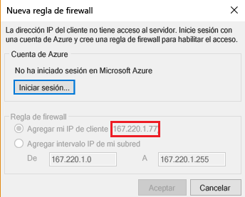
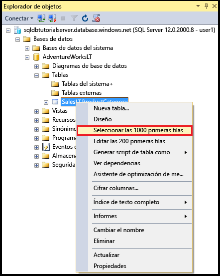
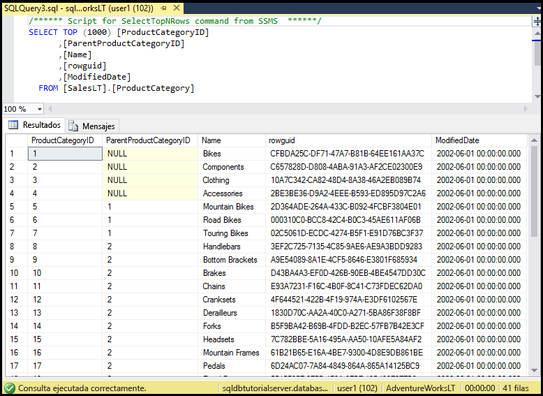

# <a name="sql-database-tutorial-sql-server-authentication-logins-and-user-accounts-database-roles-permissions-server-level-firewall-rules-and-database-level-firewall-rules"></a>Tutorial de SQL Database: Autenticación, inicios de sesión y cuentas de usuario de SQL Server, roles de base de datos, permisos, reglas de firewall de nivel de servidor y de nivel de base de datos
En este tutorial de introducción, aprenderá a usar SQL Server Management Studio para trabajar con la autenticación, los inicios de sesión, los usuarios y roles de base de datos de SQL Server que conceden acceso y permisos a los servidores y bases de datos de Azure SQL Database. Aprenderá a:

- Ver los permisos de usuario en la base de datos maestra y en las bases de datos de usuario
- Creación de inicios de sesión y usuarios basados en la autenticación de SQL Server
- Conceder permisos específicos de base de datos para todo el servidor a los usuarios
- Iniciar sesión en una base de datos de usuario como un usuario sin derechos de administrador
- Crear reglas de firewall de nivel de base de datos para los usuarios de la base de datos
- Crear reglas de firewall de nivel de servidor para los administradores de este

**Estimación del tiempo**: este tutorial se realiza en 45 minutos (suponiendo que ya se hayan cumplido los requisitos previos).

## <a name="prerequisites"></a>Requisitos previos

* Necesitará una cuenta de Azure. Puede [abrir una cuenta gratuita de Azure](/pricing/free-trial/?WT.mc_id=A261C142F) o [activar las ventajas que disfrutan los suscriptores de Visual Studio](/pricing/member-offers/msdn-benefits-details/?WT.mc_id=A261C142F). 

* Debe poder conectarse a Azure Portal mediante una cuenta que sea miembro del rol de colaborador o propietario de la suscripción. Para más información sobre el acceso basado en roles (RBAC), consulte [Introducción a la administración de acceso en Azure Portal](../active-directory/role-based-access-control-what-is.md).

* Ha finalizado la [introducción a los servidores, las bases de datos y las reglas de firewalls de Azure SQL Database mediante Azure Portal y SQL Server Management Studio](sql-database-get-started.md) o la [versión de PowerShell](sql-database-get-started-powershell.md) equivalente de este tutorial. Si no es así, realice el tutorial que es requisito previo o ejecute el script de PowerShell al final de la [versión de PowerShell](sql-database-get-started-powershell.md) de este tutorial antes de continuar.

> [!NOTE]
> Este tutorial le servirá para conocer el contenido de estos temas: [Control de acceso a Azure SQL Database](sql-database-control-access.md), [Control y concesión de acceso a bases de datos](sql-database-manage-logins.md), [Entidades de seguridad](https://msdn.microsoft.com/library/ms181127.aspx), [Roles de nivel de base de datos](https://msdn.microsoft.com/library/ms189121.aspx) e [Introducción a las reglas de firewall de Azure SQL Database](sql-database-firewall-configure.md).
>  

## <a name="sign-in-to-the-azure-portal-using-your-azure-account"></a>Inicie sesión en Azure Portal con su cuenta.
Con una [suscripción existente](https://account.windowsazure.com/Home/Index), siga estos pasos para conectarse al portal de Azure.

1. Abra el explorador que prefiera y conéctese al [Portal de Azure](https://portal.azure.com/).
2. Inicie sesión en el [Portal de Azure](https://portal.azure.com/).
3. En la página **Iniciar sesión** , proporcione las credenciales de la suscripción.
   
   


<a name="create-logical-server-bk"></a>

## <a name="view-information-about-the-security-configuration-for-your-logical-server"></a>Visualización de la información acerca de la configuración de seguridad del servidor lógico

En esta sección del tutorial, puede ver información sobre la configuración de seguridad del servidor lógico en Azure Portal.

1. Abra la hoja **SQL Server** del servidor lógico y lea la información de la página de **introducción**.

   

2. Tome nota del nombre de la cuenta de administrador del servidor para el servidor lógico. Si no recuerda la contraseña, haga clic en **Restablecer contraseña** para establecer una nueva contraseña.

> [!NOTE]
> Para revisar la información de conexión de este servidor, vaya a [View or update server settings](sql-database-view-update-server-settings.md) (Visualización o actualización de la configuración del servidor). Para esta serie de tutoriales, el nombre completo del servidor es 'sqldbtutorialserver.database.windows.net'.
>

## <a name="connect-to-sql-server-using-sql-server-management-studio-ssms"></a>Conexión con SQL Server mediante SQL Server Management Studio (SSMS)

1. Si aún no lo ha hecho descargue e instale la versión más reciente de SSMS en [Descarga de SQL Server Management Studio](https://msdn.microsoft.com/library/mt238290.aspx). Para estar siempre actualizado, la versión más reciente de SSMS le avisará cuando haya una nueva versión disponible para su descarga.

2. Después de la instalación, escriba **Microsoft SQL Server Management Studio** en el cuadro de búsqueda de Windows y haga clic en **Entrar** para abrir SSMS.

   

3. En el cuadro de diálogo **Conectar con el servidor**, escriba la información necesaria para conectarse a su servidor SQL Server mediante la autenticación de SQL Server y la cuenta de administrador del servidor.

   

4. Haga clic en **Conectar**.

   

## <a name="view-the-server-admin-account-and-its-permissions"></a>Visualización de la cuenta de administrador del servidor y sus permisos 
En esta sección del tutorial, puede ver información acerca de la cuenta de administrador del servidor y sus permisos en la base de datos maestra y en las bases de datos de usuario.

1. En el Explorador de objetos, expanda **Seguridad**y, a continuación, expanda **Inicios de sesión** para ver los inicios de sesión existentes para el servidor de Azure SQL Database. Observe que aparece un inicio de sesión para la cuenta de administrador del servidor especificada durante el aprovisionamiento: el inicio de sesión sqladmin para esta serie de tutoriales.

   

2. En el Explorador de objetos, expanda **Bases de datos**, expanda **Bases de datos de sistema**, expanda **Maestra**, expanda **Seguridad** y, finalmente, expanda **Usuarios**. Tenga en cuenta que se ha creado una cuenta de usuario en la base de datos maestra para el inicio de sesión de administrador del servidor, con el mismo nombre de cuenta de usuario que el del inicio de sesión (los nombres no tienen que coincidir obligatoriamente, aunque es recomendable para evitar la confusión).

   

   > [!NOTE]
   > Para más información acerca de las cuentas de usuario que aparecen, consulte [Entidades de seguridad](https://msdn.microsoft.com/library/ms181127.aspx).
   >

3. En el Explorador de objetos, haga clic con el botón derecho en **Maestra** y, a continuación, haga clic en **Nueva consulta** para abrir una ventana de consulta conectada a la base de datos maestra.
4. En la ventana de consulta, ejecute la siguiente consulta para que devuelva información sobre el usuario que ejecuta la consulta. Tenga en cuenta que se devuelve sqladmin para la cuenta de usuario que ejecuta esta consulta (se obtendrá un resultado diferente cuando se consulte una base de datos de usuario más adelante en este procedimiento).

   ```
   SELECT USER;
   ```

   

5. En la ventana de consulta, ejecute la siguiente consulta para que devuelva información sobre los permisos del usuario sqladmin. Observe que sqladmin tiene permisos para conectarse a la base de datos maestra, crear inicios de sesión y usuarios, seleccionar la información de la tabla sys.sql_logins y agregar usuarios a los roles de base de datos dbmanager y dbcreator. Estos permisos se suman a los permisos concedidos al rol público desde el que todos los usuarios heredan permisos (como los permisos para seleccionar información de determinadas tablas). Para más información, consulte [Permisos](https://msdn.microsoft.com/library/ms191291.aspx).

   ```
   SELECT prm.permission_name
      , prm.class_desc
      , prm.state_desc
      , p2.name as 'Database role'
      , p3.name as 'Additional database role' 
   FROM sys.database_principals p
   JOIN sys.database_permissions prm
      ON p.principal_id = prm.grantee_principal_id
      LEFT JOIN sys.database_principals p2
      ON prm.major_id = p2.principal_id
      LEFT JOIN sys.database_role_members r
      ON p.principal_id = r.member_principal_id
      LEFT JOIN sys.database_principals p3
      ON r.role_principal_id = p3.principal_id
   WHERE p.name = 'sqladmin';
   ```

   

6. En el Explorador de objetos, expanda **blankdb**, expanda **Seguridad** y, finalmente, expanda **Usuarios**. Observe que no hay ninguna cuenta de usuario denominada sqladmin en esta base de datos.

   

7. En el Explorador de objetos, haga clic con el botón derecho en **blankdb** y, después, haga clic en **Nueva consulta**.

8. En la ventana de consulta, ejecute la siguiente consulta para que devuelva información sobre el usuario que ejecuta la consulta. Observe que se devuelve dbo para la cuenta de usuario que ejecuta esta consulta (de forma predeterminada, el inicio de sesión de administrador del servidor se asigna a la cuenta de usuario de dbo de cada base de datos de usuario).

   ```
   SELECT USER;
   ```

   

9. En la ventana de consulta, ejecute la siguiente consulta para que devuelva información sobre los permisos del usuario dbo. Observe que dbo es un miembro del rol público y también un miembro del rol fijo de base de datos db_owner. Consulte [Roles de nivel de base de datos](https://msdn.microsoft.com/library/ms189121.aspx) para más información.

   ```
   SELECT prm.permission_name
      , prm.class_desc
      , prm.state_desc
      , p2.name as 'Database role'
      , p3.name as 'Additional database role' 
   FROM sys.database_principals AS p
   JOIN sys.database_permissions AS prm
      ON p.principal_id = prm.grantee_principal_id
      LEFT JOIN sys.database_principals AS p2
      ON prm.major_id = p2.principal_id
      LEFT JOIN sys.database_role_members r
      ON p.principal_id = r.member_principal_id
      LEFT JOIN sys.database_principals AS p3
      ON r.role_principal_id = p3.principal_id
   WHERE p.name = 'dbo';
   ```

   

10. Si lo desea, repita los tres pasos anteriores para la base de datos de usuario AdventureWorksLT.

## <a name="create-a-new-user-in-the-adventureworkslt-database-with-select-permissions"></a>Creación de un nuevo usuario en la base de datos AdventureWorksLT con permisos SELECT

En esta sección del tutorial, va a crear una cuenta de usuario en la base de datos AdventureWorksLT, va a probar los permisos de usuario como miembro del rol público, conceder permisos SELECT a este usuario y, finalmente, probar de nuevo los permisos de este.

> [!NOTE]
> Los usuarios de nivel de base de datos ([usuarios contenidos](https://msdn.microsoft.com/library/ff929188.aspx)) aumentan la portabilidad de la base de datos, una funcionalidad que se explorará en tutoriales posteriores.
>

1. En el Explorador de objetos, haga clic con el botón derecho en **AdventureWorksLT** y, a continuación, haga clic en **Nueva consulta** para abrir una ventana de consulta conectada a la base de datos AdventureWorksLT.
2. Ejecute la instrucción siguiente para crear un usuario denominado user1 en la base de datos AdventureWorksLT.

   ```
   CREATE USER user1
   WITH PASSWORD = 'p@ssw0rd';
   ```
   

3. En la ventana de consulta, ejecute la siguiente consulta para que devuelva información sobre los permisos del usuario user1. Observe que los únicos permisos que tiene user1 son los permisos heredados del rol público.

   ```
   SELECT prm.permission_name
      , prm.class_desc
      , prm.state_desc
      , p2.name as 'Database role'
      , p3.name as 'Additional database role' 
   FROM sys.database_principals AS p
   JOIN sys.database_permissions AS prm
      ON p.principal_id = prm.grantee_principal_id
      LEFT JOIN sys.database_principals AS p2
      ON prm.major_id = p2.principal_id
      LEFT JOIN sys.database_role_members r
      ON p.principal_id = r.member_principal_id
      LEFT JOIN sys.database_principals AS p3
      ON r.role_principal_id = p3.principal_id
   WHERE p.name = 'user1';
   ```

   

4. Ejecute las siguientes consultas para intentar consultar una tabla en la base de datos AdventureWorksLT como user1.

   ```
   EXECUTE AS USER = 'user1';  
   SELECT * FROM [SalesLT].[ProductCategory];
   REVERT;
   ```

   

5. Ejecute la siguiente instrucción para conceder a user1 permisos SELECT en la tabla ProductCategory del esquema SalesLT.

   ```
   GRANT SELECT ON OBJECT::[SalesLT].[ProductCategory] to user1;
   ```

   

6. Ejecute las siguientes consultas para intentar consultar una tabla en la base de datos AdventureWorksLT como user1.

   ```
   EXECUTE AS USER = 'user1';  
   SELECT * FROM [SalesLT].[ProductCategory];
   REVERT;
   ```

   

## <a name="create-a-database-level-firewall-rule-for-an-adventureworkslt-database-user"></a>Creación de una regla de firewall de nivel de base de datos para un usuario de la base de datos AdventureWorksLT

En esta sección del tutorial, va a iniciar sesión desde un equipo con una dirección IP diferente, va a crear una regla de firewall de nivel de base de datos como administrador del servidor y, finalmente, iniciará sesión mediante esta nueva regla de firewall de nivel de base de datos. 

> [!NOTE]
> [Las reglas de firewall de nivel de base de datos](sql-database-firewall-configure.md) aumentan la portabilidad de la base de datos, una funcionalidad que se explorará en tutoriales posteriores.
>

1. En otro equipo para el que aún no se ha creado una regla de firewall de nivel de servidor, abra SQL Server Management Studio.

   > [!IMPORTANT]
   > Use siempre la versión más reciente de SSMS, que puede encontrar en [Descarga de SQL Server Management Studio (SSMS)](https://msdn.microsoft.com/library/mt238290.aspx). 
   >

2. En la ventana **Conectar con el servidor**, escriba el nombre del servidor y la información de autenticación para conectarse mediante la autenticación de SQL Server con la cuenta user1. 
    
   

3. Haga clic en **Opciones** para especificar la base de datos a la que desea conectarse y, a continuación, escriba **AdventureWorksLT** en el cuadro desplegable **Conectar con base de datos** de la pestaña **Propiedades de conexión**.
   
   

4. Haga clic en **Conectar**. Aparece un cuadro de diálogo que le informa de que el equipo desde el que está intentando conectarse a SQL Database no tiene una regla de firewall que permita el acceso a la base de datos. El cuadro de diálogo que recibe tendrá dos variantes según los pasos que haya realizado anteriormente con los firewalls, pero normalmente se obtiene el primer cuadro de diálogo mostrado.

   

   

   > [!NOTE]
   > Las versiones más recientes de SSMS incluyen la funcionalidad que permite a los propietarios de suscripciones y colaboradores iniciar sesión en Microsoft Azure y crear una regla de firewall de nivel de servidor.
   > 

4. Copie la dirección IP del cliente de este cuadro de diálogo para su uso en el paso 7.
5. Haga clic en **Cancelar** pero no cierre el cuadro de diálogo **Conectar con el servidor**.
6. Vuelva a cambiar a un equipo para el que ya se ha creado una regla de firewall de nivel de servidor y conéctese al servidor con la cuenta de administrador del servidor.
7. En una nueva ventana de consulta conectada a la base de datos AdventureWorksLT como administrador del servidor, ejecute la instrucción siguiente para crear un firewall de nivel de base de datos mediante la ejecución de [sp_set_database_firewall_rule](https://msdn.microsoft.com/library/dn270010.aspx) y utilizando la dirección IP del paso 4:

   ```
   EXEC sp_set_database_firewall_rule @name = N'AdventureWorksLTFirewallRule', 
     @start_ip_address = 'x.x.x.x', @end_ip_address = 'x.x.x.x';
   ```

   

8. Cambie los equipos de nuevo y haga clic en **Conectar** en el cuadro de diálogo **Conectar con el servidor** para conectarse a AdventureWorksLT como user1. 

   

9. En el Explorador de objetos, expanda **Bases de datos**, expanda **AdventureWorksLT**y, a continuación, expanda **Tablas**. Observe que user1 solo tiene permiso para ver una sola tabla, la denominada **SalesLT.ProductCategory**. 

   

10. En el Explorador de objetos, haga clic con el botón derecho en **SalesLT.ProductCategory** y haga clic en **Select Top 1000 Rows** (Seleccionar las 1000 primeras filas).   

   

   

## <a name="create-a-new-user-in-the-blankdb-database-with-dbowner-database-role-permissions-and-a-database-level-firewall-rule"></a>Creación de un nuevo usuario en la base de datos blankdb con permisos de rol de base de datos db_owner y una regla de firewall de nivel de base de datos

En esta sección del tutorial, creará un usuario en la base de datos blankdb con permisos de rol de base de datos db_owner y creará un firewall de nivel de base de datos para esta base de datos mediante la cuenta de administrador del servidor. 

1. Cambie al equipo con conexión a SQL Database mediante la cuenta de administrador del servidor.
2. Abra una ventana de consulta conectada a la base de datos blankdb y ejecute la instrucción siguiente para crear un usuario llamado blankdbadmin en la base de datos.

   ```
   CREATE USER blankdbadmin
   WITH PASSWORD = 'p@ssw0rd';
   ```

3. En la misma ventana de consulta, ejecute la instrucción siguiente para agregar el usuario blankdbadmin al rol de base de datos db_owner. Este usuario ya puede realizar todas las acciones necesarias para administrar la base de datos blankdb.

   ```
   ALTER ROLE db_owner ADD MEMBER blankdbadmin; 
   ```

4. En la misma ventana de consulta, ejecute la instrucción siguiente para crear un firewall de nivel de base de datos mediante la ejecución de [sp_set_database_firewall_rule](https://msdn.microsoft.com/library/dn270010.aspx) y utilizando la dirección IP del paso 4 del procedimiento anterior (o un intervalo de direcciones IP para los usuarios de esta base de datos):

   ```
   EXEC sp_set_database_firewall_rule @name = N'blankdbFirewallRule', 
     @start_ip_address = 'x.x.x.x', @end_ip_address = 'x.x.x.x';
   ```

5. Cambie de equipo (use uno para el que haya creado una regla de firewall de nivel de base de datos) y conéctese a la base de datos blankdb mediante la cuenta de usuario blankdbadmin.
6. Abra una ventana de consulta a la base de datos blankdb y ejecute la instrucción siguiente para crear un usuario llamado blankdbuser1 en la base de datos.

   ```
   CREATE USER blankdbuser1
   WITH PASSWORD = 'p@ssw0rd';
   ```
 
7. Según sea necesario para su entorno de aprendizaje, cree una regla de firewall adicional de nivel de base de datos para este usuario. 

## <a name="create-a-new-login-and-user-in-the-master-database-with-dbmanager-permissions-and-create-a-server-level-firewall-rule"></a>Creación de un nuevo inicio de sesión y usuario en la base de datos maestra con permisos de dbmanager y creación de una regla de firewall de nivel de servidor

En esta sección del tutorial, creará un inicio de sesión y un usuario en la base de datos maestra con permisos para crear y administrar nuevas bases de datos de usuario. También creará una regla de firewall adicional de nivel de servidor mediante Transact-SQL y la regla [sp_set_firewall_rule](https://msdn.microsoft.com/library/dn270017.aspx).

> [!NOTE]
> Es obligatorio crear inicios de sesión en la base de datos maestra y una cuenta de usuario a partir de un inicio de sesión, para que el titular de la cuenta de administrador del servidor pueda delegar permisos de creación de base de datos a otro usuario. No obstante, crear inicios de sesión y usuarios a partir de inicios de sesión reduce la portabilidad del entorno. Se analizarán las consecuencias de esto en próximos tutoriales, incluido el análisis de la anticipación y el control como parte de la planeación en caso de recuperación ante desastres.
>

1. Cambie al equipo con conexión a SQL Database mediante la cuenta de administrador del servidor.
2. Abra una ventana de consulta conectada a la base de datos maestra y ejecute la instrucción siguiente para crear un inicio de sesión llamado dbcreator en la base de datos maestra.

   ```
   CREATE LOGIN dbcreator
   WITH PASSWORD = 'p@ssw0rd';
   ```

3. En la misma ventana de consulta, 

   ```
   CREATE USER dbcreator
   FROM LOGIN dbcreator;
   ```

3. En la misma ventana de consulta, ejecute la consulta siguiente para agregar el usuario dbcreator al rol de base de datos dbmanager. Este usuario puede ya crear y administrar bases de datos creadas por el usuario.

   ```
   ALTER ROLE dbmanager ADD MEMBER dbcreator; 
   ```

4. En la misma ventana de consulta, ejecute la consulta siguiente para crear un firewall de nivel de servidor mediante la ejecución de [sp_set_database_firewall_rule](https://msdn.microsoft.com/library/dn270010.aspx) y mediante una dirección IP adecuada para su entorno:

   ```
   EXEC sp_set_firewall_rule @name = N'dbcreatorFirewallRule', 
     @start_ip_address = 'x.x.x.x', @end_ip_address = 'x.x.x.x';
   ```

5. Cambie de equipo (use uno para el que haya creado una regla de firewall de nivel de servidor) y conéctese a la base de datos maestra mediante la cuenta de usuario dbcreator.
6. Abra una ventana de consulta en la base de datos maestra y ejecute la consulta siguiente para crear una base de datos denominada foo.

   ```
   CREATE DATABASE FOO (EDITION = 'basic');
   ```
 7. Si lo desea, elimine esta base de datos para ahorrar dinero mediante la siguiente instrucción:

   ```
   DROP DATABASE FOO;
   ```

## <a name="complete-script"></a>Completar script

Para crear los inicios de sesión y usuarios, agregarlos a los roles, concederles permisos, crear reglas de firewall de nivel de base de datos y crear reglas de firewall de nivel de servidor, ejecute las siguientes instrucciones en las bases de datos adecuadas del servidor.

### <a name="master-database"></a>base de datos maestra
Ejecute estas instrucciones en la base de datos maestra con la cuenta de administrador de servidor agregando las direcciones IP (o intervalo de direcciones) adecuadas.

```
CREATE LOGIN dbcreator WITH PASSWORD = 'p@ssw0rd';
CREATE USER dbcreator FROM LOGIN dbcreator;
ALTER ROLE dbmanager ADD MEMBER dbcreator;
EXEC sp_set_firewall_rule @name = N'dbcreatorFirewallRule', 
     @start_ip_address = 'x.x.x.x', @end_ip_address = 'x.x.x.x';
```

### <a name="adventureworkslt-database"></a>Base de datos AdventureWorksLT
Ejecute estas instrucciones en la base de datos AdventureWorksLT con la cuenta de administrador de servidor agregando las direcciones IP (o intervalo de direcciones) adecuadas.

```
CREATE USER user1 WITH PASSWORD = 'p@ssw0rd';
GRANT SELECT ON OBJECT::[SalesLT].[ProductCategory] to user1;
EXEC sp_set_database_firewall_rule @name = N'AdventureWorksLTFirewallRule', 
     @start_ip_address = 'x.x.x.x', @end_ip_address = 'x.x.x.x';
```

### <a name="blankdb-database"></a>base de datos blankdb
Ejecute estas instrucciones en la base de datos blankdb con la cuenta de administrador de servidor agregando las direcciones IP (o intervalo de direcciones) adecuadas.

```
CREATE USER blankdbadmin
   WITH PASSWORD = 'p@ssw0rd';
ALTER ROLE db_owner ADD MEMBER blankdbadmin;
EXEC sp_set_database_firewall_rule @name = N'blankdbFirewallRule', 
     @start_ip_address = 'x.x.x.x', @end_ip_address = 'x.x.x.x';
CREATE USER blankdbuser1
   WITH PASSWORD = 'p@ssw0rd';
```

## <a name="next-steps"></a>Pasos siguientes
- Para obtener información general de acceso y control en SQL Database, consulte [Control de acceso a Azure SQL Database](sql-database-control-access.md).
- Para obtener información general de los inicios de sesión, usuarios y roles de base de datos de SQL Database, consulte [Control y concesión de acceso a bases de datos](sql-database-manage-logins.md).
- Para más información acerca de las entidades de seguridad de bases de datos, consulte [Entidades de seguridad](https://msdn.microsoft.com/library/ms181127.aspx).
- Para más información acerca de los roles de base de datos, consulte [Roles de nivel de base de datos](https://msdn.microsoft.com/library/ms189121.aspx).
- Para más información general acerca de las reglas de firewall de SQL Database, consulte [Introducción a las reglas de firewall de Azure SQL Database](sql-database-firewall-configure.md).
- Para ver un tutorial que use la autenticación de Azure Active Directory, consulte [Tutorial de SQL Database: Autenticación, inicios de sesión y cuentas de usuario de AAD, roles de base de datos, permisos, reglas de firewall de nivel de servidor y de nivel de base de datos](sql-database-control-access-sql-authentication-get-started.md).


<!--HONumber=Jan17_HO3-->


