# <a name="sql-server-authentication-access-and-database-level-firewall-rules"></a>Autenticación de SQL Server, acceso y reglas de firewall de nivel de base de datos

En este tutorial, aprenderá a usar SQL Server Management Studio para trabajar con la autenticación, los inicios de sesión, los usuarios y roles de base de datos de SQL Server que conceden acceso y permisos a los servidores y bases de datos de Azure SQL Database. Cuando termine este tutorial, sabrá hacer lo siguiente:

- Creación de inicios de sesión y usuarios basados en la autenticación de SQL Server
- Agregar usuarios a roles y conceder permisos a los roles
- Usar T-SQL para crear una regla de firewall de nivel de base de datos o servidor 
- Conectarse como usuario a una base de datos específica con SSMS
- Ver los permisos de usuario en la base de datos maestra y en las bases de datos de usuario

**Estimación del tiempo**: este tutorial se realiza en 45 minutos (suponiendo que ya se hayan cumplido los requisitos previos).

> [!NOTE]
> Este tutorial le servirá para conocer el contenido de estos temas: [Control de acceso a Azure SQL Database](sql-database-control-access.md), [Control y concesión de acceso a bases de datos](sql-database-manage-logins.md), [Entidades de seguridad](https://msdn.microsoft.com/library/ms181127.aspx), [Roles de nivel de base de datos](https://msdn.microsoft.com/library/ms189121.aspx) e [Introducción a las reglas de firewall de Azure SQL Database](sql-database-firewall-configure.md). Para un tutorial sobre la autenticación de Azure Active Directory, consulte el artículo sobre [autenticación y autorización de Azure AD](sql-database-control-access-aad-authentication-get-started.md).
>  

## <a name="prerequisites"></a>Requisitos previos

* **Una cuenta de Azure**. Necesitará una cuenta de Azure. Puede [abrir una cuenta gratuita de Azure](https://azure.microsoft.com/free/) o [activar las ventajas que disfrutan los suscriptores de Visual Studio](https://azure.microsoft.com/pricing/member-offers/msdn-benefits/). 

* **Permisos de creación de Azure**. Debe poder conectarse a Azure Portal mediante una cuenta que sea miembro del rol de colaborador o propietario de la suscripción. Para más información sobre el acceso basado en roles (RBAC), consulte [Introducción a la administración de acceso en Azure Portal](../active-directory/role-based-access-control-what-is.md).

* **SQL Server Management Studio**. Puede descargar e instalar la versión de SQL Server Management Studio (SSMS) más reciente de [Descarga de SQL Server Management Studio (SSMS)](https://msdn.microsoft.com/library/mt238290.aspx). Utilice siempre la versión más reciente de SSMS al conectarse a Azure SQL Database, ya que se lanzan funcionalidades nuevas constantemente.

* **Tutorial básico terminado**. Ha finalizado la [introducción a los servidores, las bases de datos y las reglas de firewalls de Azure SQL Database mediante Azure Portal y SQL Server Management Studio](sql-database-get-started.md) o la [versión de PowerShell](sql-database-get-started-powershell.md) equivalente de este tutorial. Si no es así, realice el tutorial que es requisito previo o ejecute el script de PowerShell al final de la [versión de PowerShell](sql-database-get-started-powershell.md) de este tutorial antes de continuar.


## <a name="sign-in-to-the-azure-portal-using-your-azure-account"></a>Inicie sesión en Azure Portal con su cuenta.
Los pasos de este procedimiento muestran cómo conectarse a Azure Portal con la cuenta de Azure (https://account.windowsazure.com/Home/Index).

1. Abra el explorador que prefiera y conéctese al [Portal de Azure](https://portal.azure.com/).
2. Inicie sesión en el [Portal de Azure](https://portal.azure.com/).
3. En la página **Iniciar sesión** , proporcione las credenciales de la suscripción.
   
   


<a name="create-logical-server-bk"></a>

## <a name="view-logical-server-security-information-in-the-azure-portal"></a>Visualización de la información de seguridad del servidor lógico en Azure Portal

Los pasos de este procedimiento muestran cómo ver información sobre la configuración de seguridad del servidor lógico en Azure Portal.

1. Abra la hoja **SQL Server** del servidor lógico y consulte la información de la página **Información general**.

   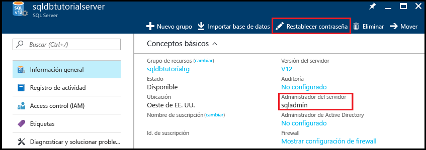

2. Anote el nombre de administrador del servidor lógico. 

3. Si no recuerda la contraseña, haga clic en **Restablecer contraseña** para establecer una nueva contraseña.

4. Si necesita la información de conexión de este servidor, haga clic en **Propiedades**.

## <a name="view-server-admin-permissions-using-ssms"></a>Visualización de los permisos de administrador del servidor con SSMS

Los pasos de este procedimiento muestran cómo consultar información de la cuenta de administrador del servidor y sus permisos en la base de datos maestra y en las bases de datos de usuario.

1. Abra SQL Server Management Studio y conéctese al servidor como administrador del servidor mediante la autenticación de SQL Server y la cuenta de administrador del servidor.

   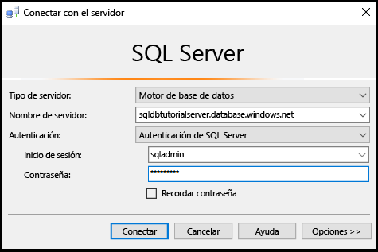

2. Haga clic en **Conectar**.

   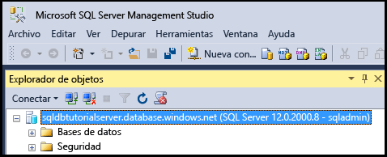

3. En el Explorador de objetos, expanda **Seguridad** e **Inicios de sesión** para ver los inicios de sesión existentes para el servidor: el único inicio de sesión en un servidor nuevo es el de la cuenta de administrador del servidor.

   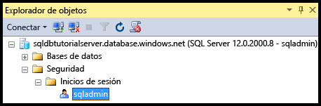

4. En el Explorador de objetos, expanda **Bases de datos**, expanda **Bases de datos del sistema**, **Maestro**, **Seguridad** y **Usuarios** para ver la cuenta de usuario que se creó para el inicio de sesión de administrador del servidor en esta base de datos.

   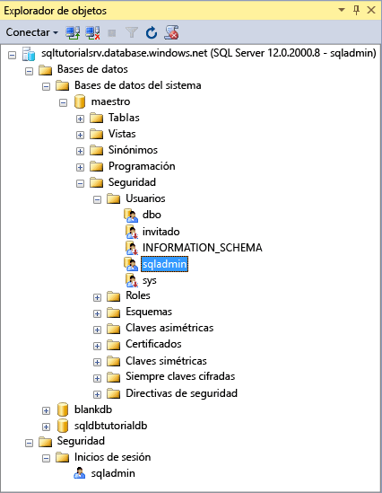

   > [!NOTE]
   > Para más información acerca de las otras cuentas de usuario que aparecen en el nodo Usuarios, consulte [Entidades de seguridad](https://msdn.microsoft.com/library/ms181127.aspx).
   >

5. En el Explorador de objetos, haga clic con el botón derecho en **Maestra** y, a continuación, haga clic en **Nueva consulta** para abrir una ventana de consulta conectada a la base de datos maestra.
6. En la ventana de consulta, ejecute la siguiente consulta para que devuelva información sobre el usuario que ejecuta la consulta. 

   ```
   SELECT USER;
   ```

   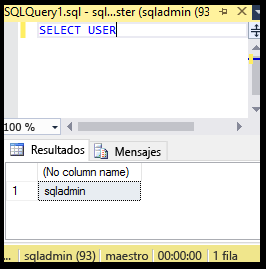

7. En la ventana de consulta, ejecute la siguiente consulta para que devuelva información sobre los permisos del usuario sqladmin en la base de datos **maestra**. 

   ```
   SELECT prm.permission_name
      , prm.class_desc
      , prm.state_desc
      , p2.name as 'Database role'
      , p3.name as 'Additional database role' 
   FROM sys.database_principals p
   JOIN sys.database_permissions prm
      ON p.principal_id = prm.grantee_principal_id
      LEFT JOIN sys.database_principals p2
      ON prm.major_id = p2.principal_id
      LEFT JOIN sys.database_role_members r
      ON p.principal_id = r.member_principal_id
      LEFT JOIN sys.database_principals p3
      ON r.role_principal_id = p3.principal_id
   WHERE p.name = 'sqladmin';
   ```

   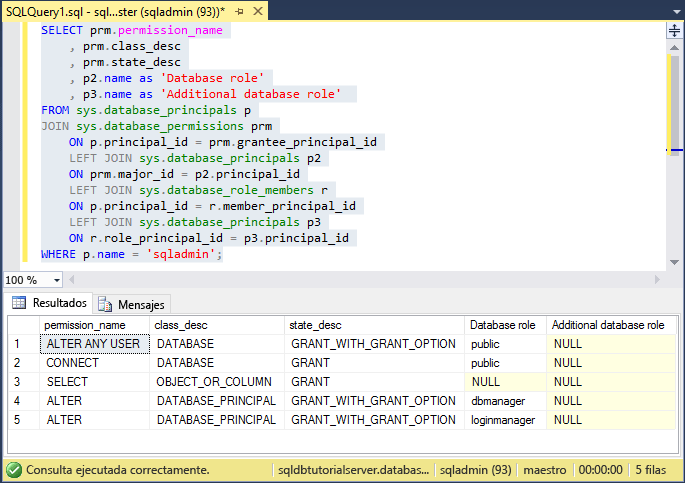

   >[!NOTE]
   > El administrador del servidor tiene permisos para conectarse a la base de datos maestra, crear inicios de sesión y usuarios, seleccionar la información de la tabla sys.sql_logins y agregar usuarios a los roles de base de datos dbmanager y dbcreator. Estos permisos se suman a los permisos concedidos al rol público desde el que todos los usuarios heredan permisos (como los permisos para seleccionar información de determinadas tablas). Para más información, consulte [Permisos](https://msdn.microsoft.com/library/ms191291.aspx).
   >

8. En el Explorador de objetos, expanda **blankdb**, **Seguridad** y **Usuarios** para ver la cuenta de usuario que se creó para el inicio de sesión de administrador del servidor en esta base de datos (y en las de los usuarios).

   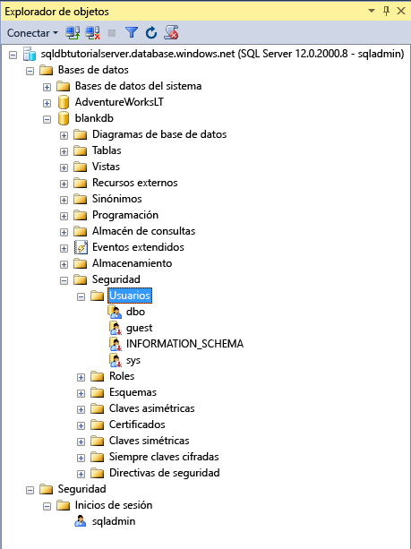

9. En el Explorador de objetos, haga clic con el botón derecho en **blankdb** y, después, haga clic en **Nueva consulta**.

10. En la ventana de consulta, ejecute la siguiente consulta para que devuelva información sobre el usuario que ejecuta la consulta.

   ```
   SELECT USER;
   ```

   

11. En la ventana de consulta, ejecute la siguiente consulta para que devuelva información sobre los permisos del usuario dbo. 

   ```
   SELECT prm.permission_name
      , prm.class_desc
      , prm.state_desc
      , p2.name as 'Database role'
      , p3.name as 'Additional database role' 
   FROM sys.database_principals AS p
   JOIN sys.database_permissions AS prm
      ON p.principal_id = prm.grantee_principal_id
      LEFT JOIN sys.database_principals AS p2
      ON prm.major_id = p2.principal_id
      LEFT JOIN sys.database_role_members r
      ON p.principal_id = r.member_principal_id
      LEFT JOIN sys.database_principals AS p3
      ON r.role_principal_id = p3.principal_id
   WHERE p.name = 'dbo';
   ```

   

   > [!NOTE]
   > El usuario dbo es un miembro del rol público y también del rol fijo de base de datos db_owner. Consulte [Roles de nivel de base de datos](https://msdn.microsoft.com/library/ms189121.aspx) para más información.
   >

## <a name="create-a-new-user-with-select-permissions"></a>Creación de un usuario nuevo con permisos SELECT

Los pasos de este procedimiento muestran cómo crear un usuario de nivel de base de datos, probar los permisos predeterminados de un usuario nuevo (con un rol público), conceder permisos **SELECT** a un usuario y ver estos permisos modificados.

> [!NOTE]
> Los usuarios de nivel de base de datos también se denominan [usuarios de base de datos independiente](https://msdn.microsoft.com/library/ff929188.aspx) y aumentan la portabilidad de la base de datos. Para información acerca de las ventajas de la portabilidad, consulte [Configuración y administración de la seguridad de Azure SQL Database para la restauración geográfica o la conmutación por error a un servidor secundario](sql-database-geo-replication-security-config.md).
>

1. En el Explorador de objetos, haga clic con el botón derecho en **sqldbtutorialdb** y en **Nueva consulta**.
2. Ejecute la instrucción siguiente en esta ventana de consulta para crear un usuario denominado **user1** en la base de datos sqldbtutorialdb.

   ```
   CREATE USER user1
   WITH PASSWORD = 'p@ssw0rd';
   ```
   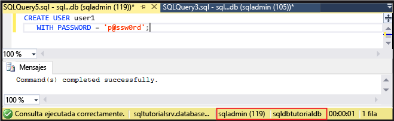

3. En la ventana de consulta, ejecute la siguiente consulta para que devuelva información sobre los permisos del usuario user1.

   ```
   SELECT prm.permission_name
      , prm.class_desc
      , prm.state_desc
      , p2.name as 'Database role'
      , p3.name as 'Additional database role' 
   FROM sys.database_principals AS p
   JOIN sys.database_permissions AS prm
      ON p.principal_id = prm.grantee_principal_id
      LEFT JOIN sys.database_principals AS p2
      ON prm.major_id = p2.principal_id
      LEFT JOIN sys.database_role_members r
      ON p.principal_id = r.member_principal_id
      LEFT JOIN sys.database_principals AS p3
      ON r.role_principal_id = p3.principal_id
   WHERE p.name = 'user1';
   ```

   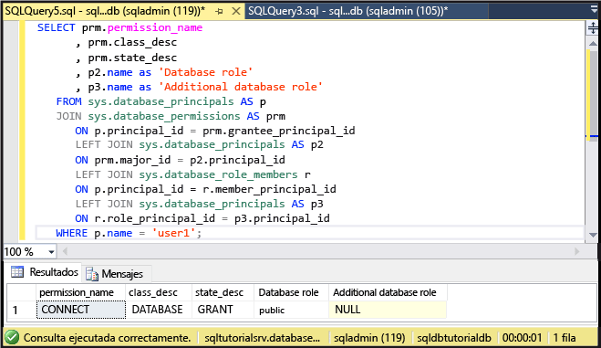

   > [!NOTE]
   > Los usuarios nuevos en una base de datos solo tienen los permisos que hereden del rol público.
   >

4. Ejecute las siguientes consultas mediante la instrucción **EXECUTE AS USER** para intentar consultar la tabla SalesLT.ProductCategory en la base de datos sqldbtutorialdb como **user1** solo con los permisos heredados del rol público.

   ```
   EXECUTE AS USER = 'user1';  
   SELECT * FROM [SalesLT].[ProductCategory];
   REVERT;
   ```

   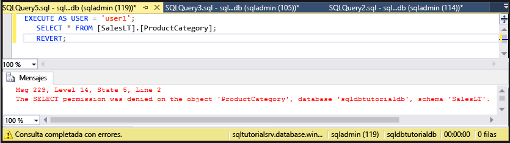

   > [!NOTE]
   > De forma predeterminada, el rol público no concede permisos **SELECT** en objetos de usuario.
   >

5. Ejecute la siguiente instrucción para conceder a **user1** permisos **SELECT** en la tabla SalesLT.ProductCategory.

   ```
   GRANT SELECT ON OBJECT::[SalesLT].[ProductCategory] to user1;
   ```

   

6. Ejecute las siguientes para consultar correctamente la tabla SalesLT.ProductCategory en la base de datos sqldbtutorialdb como **user1**.

   ```
   EXECUTE AS USER = 'user1';  
   SELECT * FROM [SalesLT].[ProductCategory];
   REVERT;
   ```

   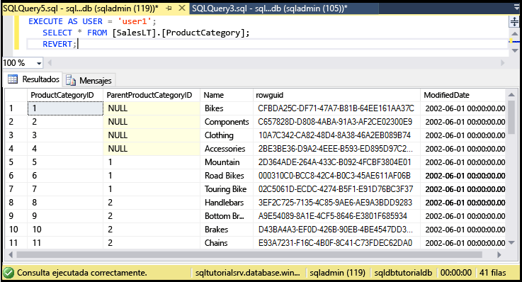

## <a name="create-a-database-level-firewall-rule-using-t-sql"></a>Configuración de una regla de firewall de nivel de base de datos mediante T-SQL

Los pasos de este procedimiento muestran cómo crear una regla de firewall de nivel de base de datos mediante el procedimiento [sp_set_database_firewall_rule](https://msdn.microsoft.com/library/dn270010.aspx) almacenado del sistema. Una regla de firewall de nivel de base de datos hace posible que un administrador del servidor permita usuarios a través del firewall de Azure SQL Database solo para determinadas bases de datos.

> [!NOTE]
> Las [reglas de firewall de nivel de base de datos](sql-database-firewall-configure.md) aumentan la portabilidad de la base de datos. Para información acerca de las ventajas de la portabilidad, consulte [Configuración y administración de la seguridad de Azure SQL Database para la restauración geográfica o la conmutación por error a un servidor secundario](sql-database-geo-replication-security-config.md).
>

> [!IMPORTANT]
> Para probar una regla de firewall de nivel de base de datos, conéctese desde otro equipo (o elimine la regla de firewall de nivel de servidor en Azure Portal).
>

1. Abra SQL Server Management Studio en otro equipo sin regla de firewall de nivel de servidor.

2. En la ventana **Conectar con el servidor**, escriba el nombre del servidor y la información de autenticación para conectarse mediante la autenticación de SQL Server con la cuenta de **user1**. 
    
   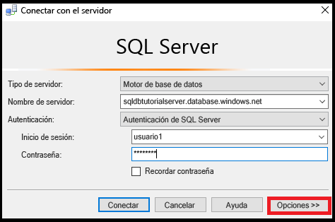

3. Haga clic en **Opciones** para especificar la base de datos a la que desea conectarse y escriba **sqldbtutorialdb** en el cuadro desplegable **Conectar con base de datos** de la pestaña **Propiedades de conexión**.
   
   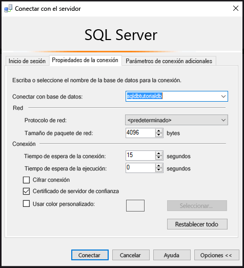

4. Haga clic en **Conectar**. 

   Aparece un cuadro de diálogo que le informa de que el equipo desde el que está intentando conectarse a SQL Database no tiene una regla de firewall que permita el acceso a la base de datos. 

   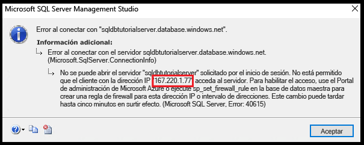


5. Copie la dirección IP del cliente de este cuadro de diálogo para usarlo en el paso 8.
6. Haga clic en **Aceptar** para cerrar el cuadro de diálogo de error, pero no cierre el de **Conectar con el servidor**.
7. Vuelva a cambiar a un equipo para el que ya se ha creado una regla de firewall de nivel de servidor. 
8. Conéctese a la base de datos sqldbtutorialdb en SSMS como administrador del servidor y ejecute la instrucción siguiente para crear un firewall de nivel de base de datos con la dirección IP (o el intervalo de direcciones) del paso 5.  

   ```
   EXEC sp_set_database_firewall_rule @name = N'sqldbtutorialdbFirewallRule', 
     @start_ip_address = 'x.x.x.x', @end_ip_address = 'x.x.x.x';
   ```

   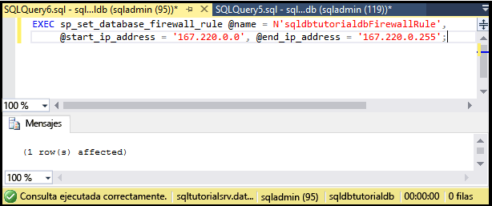

9. Cambie los equipos de nuevo y haga clic en **Conectar** en el cuadro de diálogo **Conectar con el servidor** para conectarse a sqldbtutorialdb como user1. 

   > [!NOTE]
   > Después de crear la regla de firewall de nivel de base de datos, puede tardar hasta 5 minutos en activarse.
   >

10. Después de conectarse correctamente, expanda **Bases de datos** en el Explorador de objetos. Tenga en cuenta que **user1** solo puede ver la base de datos **sqldbtutorialdb**.

   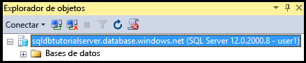

11. Expanda **sqldbtutorialdb**y **Tablas**. Observe que user1 solo tiene permiso para ver una sola tabla, la denominada **SalesLT.ProductCategory**. 

   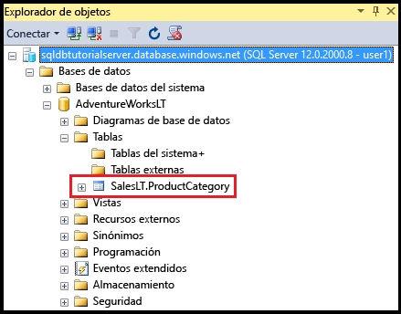

## <a name="create-a-new-user-as-dbowner-and-a-database-level-firewall-rule"></a>Creación de un nuevo usuario como db_owner y una regla de firewall de nivel de base de datos

Los pasos de este procedimiento muestran cómo crear un usuario en otra base de datos con permisos de rol de db_owner y un firewall de nivel de base de datos para esta otra. Este nuevo usuario perteneciente al rol **db_owner** solo podrá conectarse y administrar esta base de datos única.

1. Cambie al equipo con conexión a SQL Database mediante la cuenta de administrador del servidor.
2. Abra una ventana de consulta conectada a la base de datos **blankdb** y ejecute la instrucción siguiente para crear en ella un usuario llamado blankdbadmin.

   ```
   CREATE USER blankdbadmin
   WITH PASSWORD = 'p@ssw0rd';
   ```

3. En la misma ventana de consulta, ejecute la instrucción siguiente para agregar el usuario blankdbadmin al rol de base de datos db_owner. Este usuario ya puede realizar todas las acciones necesarias para administrar la base de datos blankdb.

   ```
   ALTER ROLE db_owner ADD MEMBER blankdbadmin; 
   ```

4. En la misma ventana de consulta, ejecute la instrucción siguiente para crear un firewall de nivel de base de datos mediante la ejecución de [sp_set_database_firewall_rule](https://msdn.microsoft.com/library/dn270010.aspx) y utilizando la dirección IP del paso 4 del procedimiento anterior (o un intervalo de direcciones IP para los usuarios de esta base de datos):

   ```
   EXEC sp_set_database_firewall_rule @name = N'blankdbFirewallRule', 
     @start_ip_address = 'x.x.x.x', @end_ip_address = 'x.x.x.x';
   ```

5. Cambie de equipo (use uno para el que haya creado una regla de firewall de nivel de base de datos) y conéctese a la base de datos blankdb mediante la cuenta de usuario blankdbadmin.
6. Abra una ventana de consulta a la base de datos blankdb y ejecute la instrucción siguiente para crear un usuario llamado blankdbuser1 en la base de datos.

   ```
   CREATE USER blankdbuser1
   WITH PASSWORD = 'p@ssw0rd';
   ```
 
7. Según sea necesario para su entorno de aprendizaje, cree una regla de firewall adicional de nivel de base de datos para este usuario. Sin embargo, si ha creado la regla de firewall de nivel de base de datos con un intervalo de direcciones IP, esto puede no ser necesario.

## <a name="grant-dbmanager-permissions-and-create-a-server-level-firewall-rule"></a>Concesión de permisos de dbmanager y creación de una regla de firewall de nivel de servidor

Los pasos de este procedimiento muestran cómo crear un inicio de sesión y un usuario en la base de datos maestra con permisos para crear y administrar nuevas bases de datos de usuario. A través de estos pasos también se crea una regla de firewall adicional de nivel de servidor con Transact-SQL y la regla [sp_set_firewall_rule](https://msdn.microsoft.com/library/dn270017.aspx). 

> [!IMPORTANT]
>La primera regla de firewall de nivel de servidor siempre debe crearse en Azure (en Azure Portal, con PowerShell o la API de REST).
>

> [!IMPORTANT]
> Es obligatorio crear inicios de sesión en la base de datos maestra y una cuenta de usuario a partir de un inicio de sesión para que el administrador del servidor pueda delegar los permisos de creación de base de datos a otro usuario. Sin embargo, crear primero los inicios de sesión y después los usuarios de inicio de sesión reduce la portabilidad del entorno.
>

1. Cambie al equipo con conexión a SQL Database mediante la cuenta de administrador del servidor.
2. Abra una ventana de consulta conectada a la base de datos maestra y ejecute la instrucción siguiente para crear un inicio de sesión llamado dbcreator en la base de datos maestra.

   ```
   CREATE LOGIN dbcreator
   WITH PASSWORD = 'p@ssw0rd';
   ```

3. En la misma ventana de consulta, 

   ```
   CREATE USER dbcreator
   FROM LOGIN dbcreator;
   ```

3. En la misma ventana de consulta, ejecute la consulta siguiente para agregar el usuario dbcreator al rol de base de datos dbmanager. Este usuario puede ya crear y administrar bases de datos creadas por el usuario.

   ```
   ALTER ROLE dbmanager ADD MEMBER dbcreator; 
   ```

4. En la misma ventana de consulta, ejecute la siguiente para crear un firewall de nivel de servidor mediante la ejecución de [sp_set_firewall_rule](https://msdn.microsoft.com/library/dn270017.aspx) y con una dirección IP adecuada para el entorno:

   ```
   EXEC sp_set_firewall_rule @name = N'dbcreatorFirewallRule', 
     @start_ip_address = 'x.x.x.x', @end_ip_address = 'x.x.x.x';
   ```

5. Cambie de equipo (use uno para el que haya creado una regla de firewall de nivel de servidor) y conéctese a la base de datos maestra mediante la cuenta de usuario dbcreator.
6. Abra una ventana de consulta en la base de datos maestra y ejecute la consulta siguiente para crear una base de datos denominada foo.

   ```
   CREATE DATABASE FOO (EDITION = 'basic');
   ```
 7. Si lo desea, elimine esta base de datos para ahorrar dinero mediante la siguiente instrucción:

   ```
   DROP DATABASE FOO;
   ```

## <a name="complete-script"></a>Completar script

Para crear los inicios de sesión y usuarios, agregarlos a los roles, concederles permisos, crear reglas de firewall de nivel de base de datos y crear reglas de firewall de nivel de servidor, ejecute las siguientes instrucciones en las bases de datos adecuadas del servidor.

### <a name="master-database"></a>base de datos maestra
Ejecute estas instrucciones en la base de datos maestra con la cuenta de administrador de servidor agregando las direcciones IP (o intervalo de direcciones) adecuadas.

```
CREATE LOGIN dbcreator WITH PASSWORD = 'p@ssw0rd';
CREATE USER dbcreator FROM LOGIN dbcreator;
ALTER ROLE dbmanager ADD MEMBER dbcreator;
EXEC sp_set_firewall_rule @name = N'dbcreatorFirewallRule', 
     @start_ip_address = 'x.x.x.x', @end_ip_address = 'x.x.x.x';
```

### <a name="sqldbtutorialdb-database"></a>base de datos sqldbtutorialdb
Ejecute estas instrucciones en la base de datos sqldbtutorialdb con la cuenta de administrador de servidor agregando las direcciones IP (o intervalo de direcciones) adecuadas.

```
CREATE USER user1 WITH PASSWORD = 'p@ssw0rd';
GRANT SELECT ON OBJECT::[SalesLT].[ProductCategory] to user1;
EXEC sp_set_database_firewall_rule @name = N'sqldbtutorialdbFirewallRule', 
     @start_ip_address = 'x.x.x.x', @end_ip_address = 'x.x.x.x';
```

### <a name="blankdb-database"></a>base de datos blankdb
Ejecute estas instrucciones en la base de datos blankdb con la cuenta de administrador de servidor agregando las direcciones IP (o intervalo de direcciones) adecuadas.

```
CREATE USER blankdbadmin
   WITH PASSWORD = 'p@ssw0rd';
ALTER ROLE db_owner ADD MEMBER blankdbadmin;
EXEC sp_set_database_firewall_rule @name = N'blankdbFirewallRule', 
     @start_ip_address = 'x.x.x.x', @end_ip_address = 'x.x.x.x';
CREATE USER blankdbuser1
   WITH PASSWORD = 'p@ssw0rd';
```

## <a name="next-steps"></a>Pasos siguientes
- Para obtener información general de acceso y control en SQL Database, consulte [Control de acceso a Azure SQL Database](sql-database-control-access.md).
- Para obtener información general de los inicios de sesión, usuarios y roles de base de datos de SQL Database, consulte [Control y concesión de acceso a bases de datos](sql-database-manage-logins.md).
- Para más información acerca de las entidades de seguridad de bases de datos, consulte [Entidades de seguridad](https://msdn.microsoft.com/library/ms181127.aspx).
- Para más información acerca de los roles de base de datos, consulte [Roles de nivel de base de datos](https://msdn.microsoft.com/library/ms189121.aspx).
- Para más información general acerca de las reglas de firewall de SQL Database, consulte [Introducción a las reglas de firewall de Azure SQL Database](sql-database-firewall-configure.md).
- Para ver un tutorial sobre el uso de la autenticación de Azure Active Directory, consulte [Autenticación y autorización de Azure AD](sql-database-control-access-aad-authentication-get-started.md).


