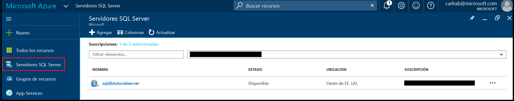

# <a name="create-azure-sql-database-servers"></a>Creación de servidores de Azure SQL Database

Puede crear un servidor de Azure SQL Database mediante [Azure Portal](https://portal.azure.com/), PowerShell, la API de REST o C#. 

## <a name="create-an-azure-sql-database-server-using-the-azure-portal"></a>Creación de un servidor de Azure SQL Database mediante Azure Portal

1. Abra la hoja **Servidores SQL Server** de [Azure Portal](https://portal.azure.com/). 

    

2. Haga clic en **Agregar** para crear un servidor SQL Server

    

> [!TIP]
> Para ver un tutorial de introducción al uso de Azure Portal y SQL Server Management Studio, consulte [Empezar a trabajar con servidores, bases de datos y reglas de firewall de Azure SQL Database mediante Azure Portal y SQL Server Management Studio](sql-database-get-started.md).
>

## <a name="create-an-azure-sql-database-server-using-powershell"></a>Creación de un servidor de Azure SQL Database mediante PowerShell

Para crear un servidor de base de datos de SQL, use el cmdlet [New-AzureRmSqlServer](https://docs.microsoft.com/powershell/resourcemanager/azurerm.sql/v2.3.0/new-azurermsqlserver). Reemplace *server1* por el nombre del servidor. Los nombres de servidores deben ser únicos en todos los servidores de base de datos de Azure SQL. Recibirá un mensaje de error si ya existe el nombre del servidor. Este comando puede tardar varios minutos en completarse. El grupo de recursos ya debe existir en la suscripción.

```
$resourceGroupName = "resourcegroup1"

$sqlServerName = "server1"
$sqlServerVersion = "12.0"
$sqlServerLocation = "northcentralus"
$serverAdmin = "loginname"
$serverPassword = "password" 
$securePassword = ConvertTo-SecureString -String $serverPassword -AsPlainText -Force
$creds = New-Object -TypeName System.Management.Automation.PSCredential -ArgumentList $serverAdmin, $securePassword


$sqlServer = New-AzureRmSqlServer -ServerName $sqlServerName `
 -SqlAdministratorCredentials $creds -Location $sqlServerLocation `
 -ResourceGroupName $resourceGroupName -ServerVersion $sqlServerVersion
```

> [!TIP]
> Para ver un script de ejemplo, consulte [Creación de un script de PowerShell de SQL Database](sql-database-get-started-powershell.md).
>

## <a name="additional-resources"></a>Recursos adicionales
* Para ver información general de las herramientas de administración, consulte el [artículo al respecto](sql-database-manage-overview.md).
* Para ver cómo realizar tareas de administración con Azure Portal, lea [Administración de instancias de Azure SQL Database mediante Azure Portal](sql-database-manage-portal.md).
* Para ver cómo realizar otras tareas de administración con PowerShell, visite [Administración de Azure SQL Database mediante PowerShell](sql-database-manage-powershell.md).
* Para ver cómo realizar otras tareas con SQL Server Management Studio, consulte [SQL Server Management Studio](sql-database-manage-azure-ssms.md).
* Para obtener más información sobre el servicio SQL Database, lea el [artículo en el que se describe qué es SQL Database](sql-database-technical-overview.md). 
* Para obtener más información sobre las características y los servidores de bases de datos de Azure SQL Database, visite [el artículo al respecto](sql-database-features.md).


<!--HONumber=Dec16_HO3-->


