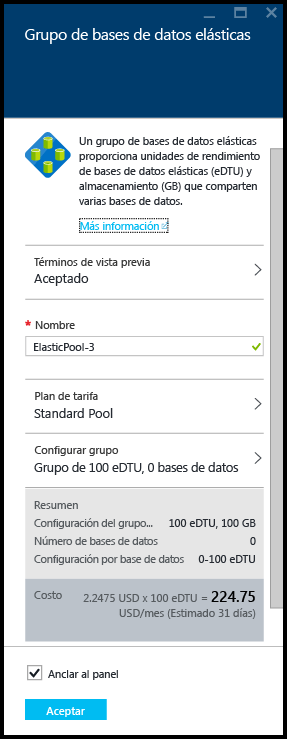
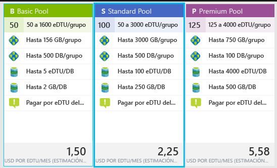
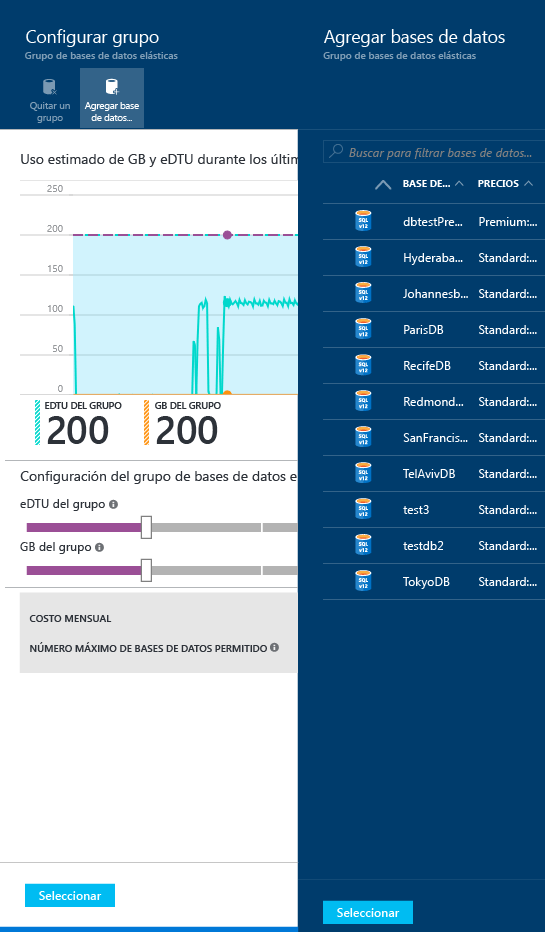
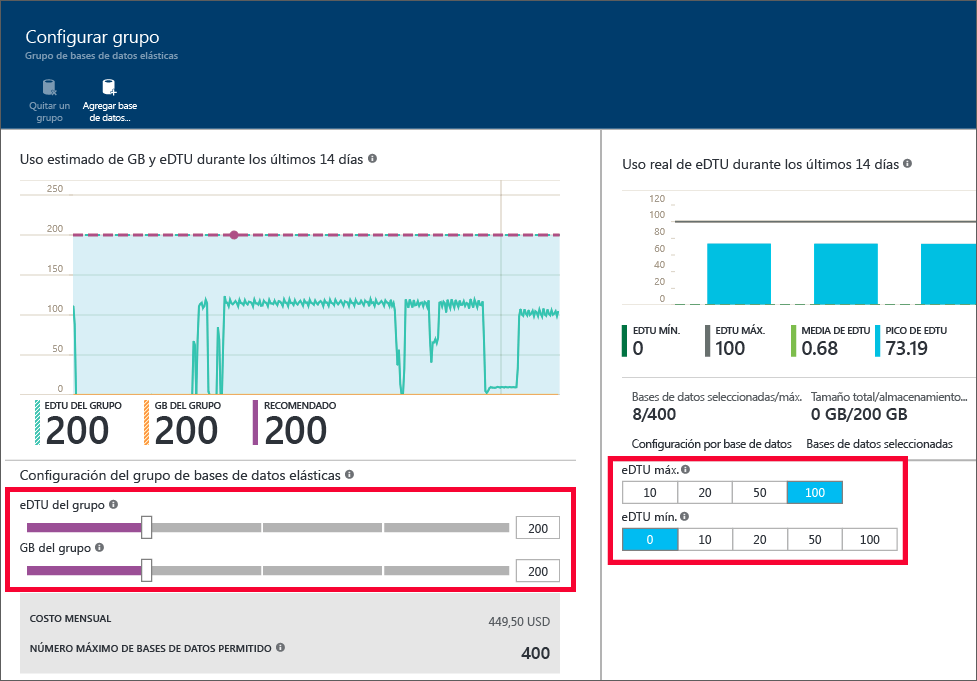

<properties
	pageTitle="Creación de un nuevo grupo de bases de datos elásticas con el Portal de Azure | Microsoft Azure"
	description="Cómo agregar un grupo de bases de datos elásticas escalables a la configuración de la Base de datos SQL para una administración y un uso compartido de los recursos más sencillos entre varias bases de datos."
	keywords="base de datos escalable,configuración de base de datos"
	services="sql-database"
	documentationCenter=""
	authors="ninarn"
	manager="jhubbard"
	editor=""/>

<tags
	ms.service="sql-database"
	ms.devlang="NA"
	ms.date="07/20/2016"
	ms.author="ninarn"
	ms.workload="data-management"
	ms.topic="get-started-article"
	ms.tgt_pltfrm="NA"/>

# Creación de un nuevo grupo de bases de datos elásticas con el Portal de Azure

> [AZURE.SELECTOR]
- [Portal de Azure](sql-database-elastic-pool-create-portal.md)
- [PowerShell](sql-database-elastic-pool-create-powershell.md)
- [C#](sql-database-elastic-pool-create-csharp.md)

En este artículo se muestra cómo crear un [grupo de bases de datos elásticas](sql-database-elastic-pool.md) escalable con el [Portal de Azure](https://portal.azure.com/). Hay dos maneras de crear un grupo. Puede partir de cero si conoce la configuración deseada del grupo, o comenzar con una recomendación del servicio. Base de datos SQL es una base de datos inteligente que recomienda la configuración de grupo más rentable, en función de los datos de telemetría de uso pasados de las bases de datos.

Puede agregar varios grupos a un servidor, pero no puede agregar bases de datos de servidores diferentes al mismo grupo. Para crear un grupo, necesita al menos una base de datos en un servidor V12. Si no la tiene, consulte [Tutorial de Base de datos SQL: creación de una Base de datos SQL en cuestión de minutos con datos de ejemplo y el Portal de Azure](sql-database-get-started.md). Puede crear un grupo con una única base de datos pero los grupos solo son rentables con varias bases de datos. Consulte [Consideraciones de precio y rendimiento para un grupo de bases de datos elásticas](sql-database-elastic-pool-guidance.md).

> [AZURE.NOTE] Los grupos solo están disponibles con servidores V12 de Base de datos SQL. Si tiene bases de datos en un servidor V11, puede [usar un script de PowerShell para identificarlas como candidatas a un grupo](sql-database-elastic-pool-database-assessment-powershell.md) en un servidor V12 y luego [usar PowerShell para actualizar a V12 y crear un grupo](sql-database-upgrade-server-powershell.md) en un solo paso.

## Paso 1: Crear un grupo

Este artículo muestra cómo crear un nuevo grupo a partir de una hoja de **servidor** que ya existe en el portal, que es la forma más sencilla de mover bases de datos existentes a un grupo.

> [AZURE.NOTE] Independientemente de si ya tiene un servidor o no, también puede crear un nuevo grupo desde la hoja **Grupos elásticos de SQL** (situado debajo de la lista en el lado izquierdo del portal, haga clic en **Examinar** **>** **Grupos elásticos de SQL**). Si hace clic en **+ Agregar** en la hoja **Grupos elásticos de SQL** se proporcionarán los pasos para crear un nuevo servidor durante el flujo de trabajo de aprovisionamiento del grupo.

1. En el [Portal de Azure](http://portal.azure.com/), debajo de la lista situada en el lado izquierdo, haga clic en **Examinar** **>** **Servidores SQL Server** y, luego, en el servidor que contiene las bases de datos que desea agregar a un grupo.
2. Haga clic en **Grupo nuevo**.

    

    **O**

    Quizá vea un mensaje que indica que existen grupos de bases de datos elásticas recomendados para el servidor (solo V12). Haga clic en el mensaje para ver los grupos recomendados según la telemetría de uso histórica de base de datos y, después, en el nivel para ver más detalles y personalizar el grupo. Consulte [Descripción de las recomendaciones de grupos](#understand-pool-recommendations) más adelante en este tema para ver cómo se realiza la recomendación.

    

    Aparecerá la hoja **Grupo de bases de datos elásticas**, que es donde va a configurar el grupo. Si hizo clic en **Grupo nuevo** en el paso anterior, el portal elige la opción **Grupo Standard** en **Plan de tarifa**, un valor de **Nombre** único para el grupo y una configuración predeterminada para el grupo. Si ha elegido un grupo recomendado, el plan y la configuración recomendados del grupo ya están elegidos pero puede cambiarlos.

    

3. Especifique un nombre para el grupo elástico o deje el valor predeterminado.

## Paso 2: Elegir un plan de tarifa

El plan de tarifa del grupo determina las características disponibles para las bases de datos elásticas del grupo, además de la cantidad máxima de eDTU (eDTU MÁX.) y el almacenamiento (GB) disponibles para cada base de datos. Para más detalles, consulte Niveles de servicio.

Para cambiar el plan de tarifa del grupo, haga clic en **Plan de tarifa**, luego en el plan de tarifa que prefiera y, después, en **Seleccionar**.

> [AZURE.IMPORTANT] Después de elegir el plan de tarifa y hacer clic en **Aceptar** en el último paso para confirmar los cambios, no podrá cambiar el plan de tarifa del grupo. Para cambiar el nivel de precios de un grupo de bases de datos elásticas existente, cree un nuevo grupo de bases de datos elásticas en el nivel de precios que quiera y migre las bases de datos elásticas al nuevo grupo.

## Paso 3: Configurar el grupo

Después de establecer el plan de tarifa, haga clic en Configurar grupo donde agregar bases de datos, establezca las EDTU y el almacenamiento (GB del grupo) del grupo y el lugar en que se establecen las EDTU mínima y máxima para las bases de datos elásticas del grupo.

1. Haga clic en **Configurar grupo**
2. Seleccione las bases de datos que desea agregar al grupo. Este paso es opcional al crear el grupo. Se pueden agregar bases de datos una vez creado el grupo. Para agregar bases de datos, haga clic en **Agregar base de datos**, luego en las bases de datos que quiera agregar y después en el botón **Seleccionar**.

    

    Si está trabajando con bases de datos que tienen suficiente telemetría de historial de uso, el gráfico **Uso estimado de eDTU y GB** y el gráfico de barras **Uso real de eDTU** se actualizan para ayudarle a tomar decisiones de configuración. Además, el servicio puede proporcionar un mensaje de recomendación que le ayuda a ajustar el tamaño correcto del grupo. Consulte [Recomendaciones dinámicas](#dynamic-recommendations).

3. Use los controles de la página **Configurar grupo** para explorar las opciones y establecer la configuración del grupo. Consulte los [límites de los grupos elásticos](sql-database-elastic-pool.md#edtu-and-storage-limits-for-elastic-pools-and-elastic-databases) para ver más detalles sobre los límites de cada nivel de servicio y las [consideraciones sobre precios y rendimiento para los grupos de bases de datos elásticas](sql-database-elastic-pool-guidance.md) para ver instrucciones detalladas sobre el ajuste de tamaño correcto de un grupo. Para más información sobre la configuración de grupo, consulte [Propiedades del grupo de bases de datos elásticas](sql-database-elastic-pool.md#elastic-database-pool-properties).

	

4. Haga clic en **Seleccionar** en la hoja **Configurar grupo** después de cambiar la configuración.
5. Haga clic en **Aceptar** para crear el grupo.

## Descripción de las recomendaciones de grupos

El servicio Base de datos SQL evalúa el historial de uso y recomienda uno o varios grupos cuando sea más económico que usar bases de datos únicas. Cada recomendación se configura con un subconjunto único de las bases de datos del servidor que mejor se ajustan al grupo.

La recomendación de grupo consta de:

- Un plan de tarifa del grupo (Basic, Standard o Premium).
- Las **eDTU del grupo** adecuadas (también denominadas eDTU máx. por grupo)
- Las **eDTU máx.** y **eDTU mín.** por base de datos
- La lista de bases de datos recomendadas para el grupo

El servicio tiene en cuenta los últimos 30 días de telemetría al recomendar grupos. Para que una base de datos se considere candidata para un grupo de bases de datos elásticas, debe tener una existencia mínima de siete días. Las bases de datos que ya están en un grupo de bases de datos elásticas no se consideran candidatas para las recomendaciones de grupos de bases de datos elásticas.

El servicio evalúa las necesidades de recursos y la rentabilidad de mover las bases de datos únicas de cada nivel de servicio a grupos del mismo nivel. Por ejemplo, se evalúan todas las bases de datos Standard en un servidor para que quepan en un bloque de bases de datos elásticas Standard. Esto significa que el servicio no hace recomendaciones entre niveles como, por ejemplo, mover una base de datos Standard a un grupo Premium.

### Recomendaciones dinámicas:

Después de agregar las bases de datos al grupo, las recomendaciones se generarán dinámicamente basándose en el historial de uso de las bases de datos que se han seleccionado. Estas recomendaciones se mostrarán en el gráfico de uso de eDTU y GB, así como en un mensaje emergente de recomendación en la parte superior de la hoja **Configurar grupo**. Estas recomendaciones están pensadas para ayudarle a crear un grupo optimizado para sus bases de datos concretas.

## Recursos adicionales

- [Manage a SQL Database elastic pool with the portal (Administración de un grupo elástico de Base de datos SQL con el portal)](sql-database-elastic-pool-manage-portal.md)
- [Manage a SQL Database elastic pool with PowerShell (Administración de un grupo elástico de Base de datos SQL con PowerShell)](sql-database-elastic-pool-manage-powershell.md)
- [Creación y administración de bases de datos SQL con C#](sql-database-elastic-pool-manage-csharp.md)
- [Escalado horizontal con Base de datos SQL de Azure](sql-database-elastic-scale-introduction.md)

<!---HONumber=AcomDC_0727_2016-->