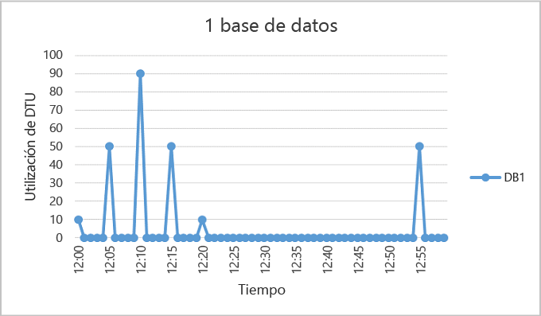
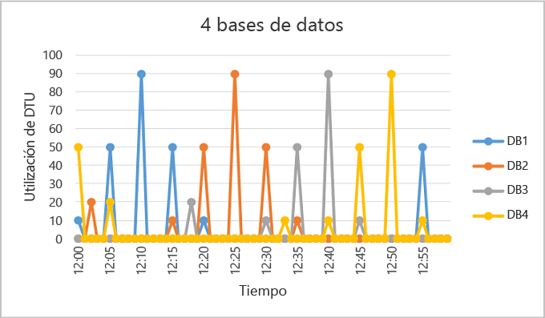
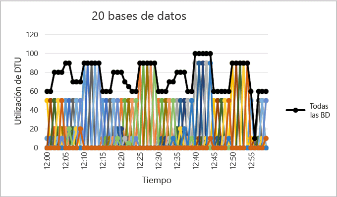

# ¿Cuándo se debe utilizar un grupo elástico?
Determine si, en función de los patrones de uso de la base de datos y las diferencias de precios entre un grupo elástico y las bases de datos únicas, resulta rentable utilizar un grupo elástico. Le proporcionaremos asesoramiento adicional para determinar el tamaño que debe tener al grupo actual para albergar un conjunto de bases de datos SQL existente.  

* Para obtener información general de grupos, consulte [Grupos elásticos de bases de datos SQL](sql-database-elastic-pool.md).

> [!NOTE]
> Los grupos elásticos están disponibles con carácter general (GA) en todas las regiones de Azure excepto oeste de la India, donde actualmente se encuentran en versión preliminar. La disponibilidad general de los grupos elásticos en esta región se ofrecerá tan pronto como sea posible.
>
>

## Grupos elásticos
Los desarrolladores de SaaS crean aplicaciones en los niveles superiores de datos de la escala que constan de varias bases de datos. Un patrón de aplicación común es aprovisionar una base de datos única para cada cliente. Sin embargo, cada cliente suele tener patrones de uso variables e impredecibles y resulta difícil predecir los requisitos de recursos de cada usuario de bases de datos individuales. Por lo tanto, el desarrollador puede realizar un aprovisionamiento excesivo de los recursos con un gasto considerable para garantizar un rendimiento y unos tiempos de repuesta favorables para todas las bases de datos. El desarrollador también puede gastar menos y arriesgar en una experiencia de rendimiento insuficiente para sus clientes. Para más información sobre los patrones de diseño de las aplicaciones SaaS que usan grupos elásticos, consulte [Design Patterns for Multi-tenant SaaS Applications with Azure SQL Database](sql-database-design-patterns-multi-tenancy-saas-applications.md)(Diseño de patrones para aplicaciones SaaS multiempresa con Base de datos SQL de Azure).

Los grupos elásticos en Base de datos SQL de Azure permiten a los desarrolladores de SaaS optimizar el rendimiento del precio para un grupo de bases de datos dentro de un presupuesto prescrito a la vez que se ofrece elasticidad de rendimiento para cada base de datos. Los grupos permiten al desarrollador adquirir unidades de transacción de base de datos elástica (eDTU) para un grupo compartido entre varias bases de datos con el fin de dar cabida a periodos impredecibles de uso por bases de datos individuales. El requisito de eDTU para un grupo se determina mediante el uso agregado de sus bases de datos. El número de eDTU disponibles para el grupo se controla mediante el presupuesto del desarrollador. Los grupos facilitan al desarrollador razonar el impacto del presupuesto en el rendimiento y viceversa para su grupo. El desarrollador simplemente agrega bases de datos al grupo, establece el número mínimo y máximo de eDTU para las bases de datos y luego establece la eDTU del grupo según el presupuesto. Un desarrollador puede usar grupos para aumentar de forma eficiente su servicio a partir de un método Lean Startup hasta un negocio con madurez a una escala cada vez mayor.  

## Cuándo considerar un grupo
Los grupos son apropiados para un amplio número de bases de datos con patrones de utilización específicos. Para una base de datos determinada, este patrón está caracterizado por una utilización media baja con picos de utilización relativamente poco frecuentes.

Cuantas más bases de datos pueda agregar a un grupo, mayores ahorros habrá. Según su patrón de uso de la aplicación, es posible ver los ahorros con tan solo dos bases de datos S3.  

En las secciones siguientes, obtendrá ayuda para evaluar si resulta beneficioso que la colección específica de bases de datos se incluya en un grupo. Los ejemplos usan grupos Estándar, pero también se aplican los mismos principios a grupos Básico y Premium.

### Evaluación de los patrones de utilización de base de datos
La siguiente ilustración muestra un ejemplo de una base de datos que está mucho tiempo inactiva, pero que también tiene picos periódicos de actividad. Se trata de un patrón de uso que es apropiado para un grupo:

   

En el período de cinco minutos de la ilustración, DB1 llega a las 90 DTU, pero su uso medio es inferior a cinco DTU. Se requiere un nivel de rendimiento S3 para ejecutar esta carga de trabajo en una base de datos única, pero esto deja a la mayoría de los recursos sin usar durante los períodos de baja actividad.

Con un grupo, estas DTU sin usar pueden compartirse entre varias bases de datos, lo que permite reducir el número total de DTU necesarias y el costo general.

Según el ejemplo anterior, suponga que existen bases de datos adicionales con patrones de utilización similares como DB1. En las siguientes dos figuras, la utilización de cuatro bases de datos y 20 bases de datos se estratifican en el mismo gráfico para mostrar la naturaleza de no solapamiento de su utilización con el paso del tiempo:

   

  

En la ilustración anterior, el uso total de DTU en las 20 bases de datos está representado por la línea negra. Esto muestra que la utilización de DTU agregada nunca supera las 100 DTU e indica que las 20 bases de datos pueden compartir 100 eDTU en este período. El resultado es una reducción multiplicada por 20 en las DTU y una reducción del precio 13 veces menor en comparación con la colocación de cada base de datos en los niveles de rendimiento S3 para bases de datos únicas.

Este ejemplo es ideal por las siguientes razones:

* Existen grandes diferencias entre la utilización de picos y la utilización media por base de datos.  
* La utilización de picos para cada base de dato se produce en puntos de tiempo distintos.
* Las eDTU se comparten entre varias bases de datos.

El precio de un grupo es una función de las eDTU del grupo. Aunque el precio unitario de una eDTU para un grupo es 1,5 veces mayor que el de una DTU para una base de datos única, **las eDTU de grupo pueden compartirse entre muchas bases de datos, por lo que el número total de eDTU que se necesitan es menor**. Estas distinciones de precio y uso compartido de la eDTU son la base de la posibilidad de ahorro en el precio que pueden proporcionar los grupos.  

Las siguientes reglas generales relacionadas con el recuento de base de datos y la utilización de base de datos ayudan a garantizar que un grupo proporciona costes reducidos en comparación con el uso de niveles de rendimiento para bases de datos únicas.

### Número mínimo de bases de datos
Si la suma de las DTU de los niveles de rendimiento de las bases de datos únicas supera en más de 1,5 al de las eDTU necesarias para el grupo, es más rentable usar un grupo elástico. Para tamaños disponibles, consulte [Límites de almacenamiento y de eDTU para grupos de bases de datos elásticas y bases de datos elásticas](sql-database-elastic-pool.md#edtu-and-storage-limits-for-elastic-pools).

***Ejemplo*** 
: al menos dos bases de datos S3 o 15 bases de datos S0 son necesarias para que un grupo de 100 eDTU sea más rentable que usar niveles de rendimiento para bases de datos únicas.

### Número máximo de bases de datos de picos simultáneamente
Cuando se comparten eDTU, no todas las bases de datos de un grupo pueden usar simultáneamente las eDTU hasta el límite disponible al usar niveles de rendimiento para bases de datos únicas. Cuantas menos bases de datos con un pico simultáneo haya, más bajo puede establecerse el número de eDTU de grupo y más rentable resultará el grupo. En general, no más de los 2/3 (o el 67%) de las bases de datos del grupo deben alcanzar el límite de eDTU establecido como pico de forma simultánea.

***Ejemplo*** 
: para reducir los costos de tres bases de datos S3 de un grupo de 200 eDTU, como mucho dos de estas bases de datos pueden alcanzar simultáneamente el pico de uso máximo. De lo contrario, si más de dos de estas cuatro bases de datos S3 establecen simultáneamente el pico, tendría que establecerse un tamaño del grupo en más de 200 eDTU. Si el tamaño del grupo se cambia a más de 200 eDTU, será necesario agregar más bases de datos S3 al grupo para que los costos sigan siendo inferiores a los niveles de rendimiento de las bases de datos únicas.

Tenga en cuenta que este ejemplo no tiene en cuenta la utilización de otras bases de datos en el grupo. Si en un momento determinado se están usando todas las bases de datos, menos de los 2/3 (o el 67%) de las bases de datos podrán alcanzar simultáneamente el pico de uso.

### Utilización de DTU por base de datos
Una gran diferencia entre el pico y la utilización media de una base de datos indica largos períodos de poca utilización y breves períodos de uso intenso. Este patrón de uso es ideal para compartir recursos entre bases de datos. Debe considerarse utilizar una base de datos para un grupo cuando su uso máximo es aproximadamente 1,5 veces mayor que su uso medio.

***Ejemplo*** 
: una base de datos S3 que establece un pico en 100 DTU y de media usa 67 DTU o menos es una buena candidata para compartir DTU en un grupo. O bien, una base de datos S1 con un pico de hasta 20 DTU y que de media usa 13 DTU o menos es una buena candidata para un grupo.

## Cambio del tamaño de un grupo elástico
El mejor tamaño para un grupo depende de las eDTU agregadas y los recursos de almacenamiento necesarios para todas las bases de datos del grupo. Esto implica determinar la cantidad mayor de lo siguiente:

* Número máximo de DTU utilizado por todas las bases de datos en el grupo.
* Número máximo de bytes de almacenamiento utilizado por todas las bases de datos en el grupo.

Para tamaños disponibles, consulte [Límites de almacenamiento y de eDTU para grupos de bases de datos elásticas y bases de datos elásticas](sql-database-elastic-pool.md#edtu-and-storage-limits-for-elastic-pools).

Base de datos SQL evalúa automáticamente el historial de uso de recursos de bases de datos en un servidor de Base de datos SQL existente y recomienda la configuración de grupo apropiada en el Portal de Azure. Además de las recomendaciones, una experiencia integrada calcula el uso de eDTU para un grupo personalizado de bases de datos en el servidor. Esto le permite realizar un análisis de hipótesis agregando bases de datos interactivamente al grupo y quitándolas para obtener análisis de uso de recursos y consejos de cambio de tamaño antes de confirmar los cambios. Para ver un procedimiento, consulte [Supervisión y administración de un grupo de bases de datos elásticas con el Portal de Azure](sql-database-elastic-pool-manage-portal.md).

Si desea realizar evaluaciones más flexibles sobre el uso de recursos que permitan estimaciones de cambio de tamaño ad hoc en servidores anteriores a la versión V12, así como estimaciones sobre el cambio de tamaño en bases de datos de diferentes servidores, consulte [Script de PowerShell para identificar bases de datos adecuadas para un grupo de bases de datos elásticas](sql-database-elastic-pool-database-assessment-powershell.md).

| Capacidad | Experiencia del portal | Script de PowerShell |
|:--- |:--- |:--- |
| Granularidad |15 segundos |15 segundos |
| Tiene en cuenta las diferencias de precio entre un grupo y los niveles de rendimiento de bases de datos únicas |Sí |No |
| Permite personalizar la lista de las bases de datos analizadas |Sí |Sí |
| Permite personalizar el período de tiempo que se utiliza en el análisis |No |Sí |
| Permite personalizar la lista de bases de datos analizadas entre diferentes servidores |No |Sí |
| Permite personalizar la lista de bases de datos analizadas en servidores de la versión v11 |No |Sí |

En casos donde no se pueden usar herramientas, las siguientes instrucciones paso a paso pueden ayudarle a estimar si un grupo es más rentable que las bases de datos únicas:

1. Calcule las eDTU necesarias para el grupo de la siguiente forma:

   MAX(<*Número total de bases de datos* X *promedio de uso de DTU por base de datos*>, 
   <*Número de bases de datos con picos simultáneos* X *Uso de picos de DTU por base de datos*)
2. Calcule el espacio de almacenamiento necesario para el grupo agregando el número de bytes necesarios para todas las bases de datos del grupo. A continuación, determine el tamaño del grupo de eDTU que proporciona esta cantidad de almacenamiento. Para conocer los límites de almacenamiento de grupo basados en el tamaño de grupo de eDTU, consulte [Límites de almacenamiento y de eDTU para grupos de bases de datos elásticas y bases de datos elásticas](sql-database-elastic-pool.md#edtu-and-storage-limits-for-elastic-pools).
3. Tome el mayor de los cálculos de eDTU de los pasos 1 y 2.
4. Consulte la [página de precios de Base de datos SQL](https://azure.microsoft.com/pricing/details/sql-database/) y busque el tamaño de grupo de eDTU más pequeño que sea mayor que el cálculo del paso 3.
5. Compare el precio del grupo del paso 5 con el precio de uso de los niveles de rendimiento adecuados para bases de datos únicas.

## Resumen
No todas las bases de datos únicas son candidatas óptimas para los grupos. Las bases de datos con patrones de uso que se caractericen por una utilización media baja y picos de utilización relativamente poco frecuentes son candidatas excelentes. Los patrones de uso de las aplicaciones son dinámicos. Por tanto, puede usar la información y las herramientas que se describen en este artículo para realizar una evaluación inicial y ver si un grupo es una buena opción para algunas de las bases de datos o para todas. Este artículo es tan solo el punto de partida para ayudarle a decidir si el grupo elástico es apropiado para usted. Recuerde que debe supervisar constantemente el historial de uso de recursos y volver a evaluar los niveles de rendimiento de todas las bases de datos. Tenga en cuenta que puede trasladar fácilmente bases de datos dentro y fuera de grupos elásticos y, si dispone de un gran número de bases de datos, puede contar con varios grupos de distintos tamaños en los que puede dividir las bases de datos.

## Pasos siguientes
* [Creación de un grupo elástico](sql-database-elastic-pool-create-portal.md)
* [Supervisión y administración de un grupo de bases de datos elásticas con Azure Portal](sql-database-elastic-pool-manage-portal.md)
* [Opciones y rendimiento de Base de datos SQL: comprender lo que está disponible en cada nivel de servicio](sql-database-service-tiers.md)
* [Script de PowerShell para identificar bases de datos adecuadas para un grupo de bases de datos elásticas](sql-database-elastic-pool-database-assessment-powershell.md)

<!--HONumber=Jan17_HO1-->

