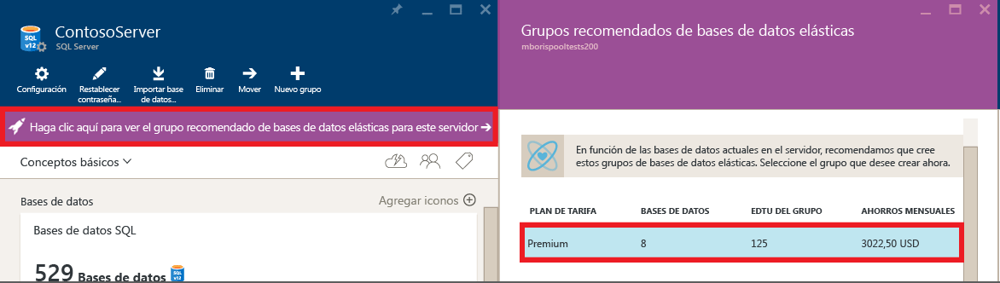
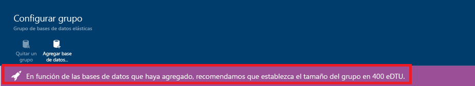

# Los grupos elásticos pueden ayudarle a administrar y escalar varias instancias de Azure SQL Database

Los grupos elásticos de SQL Database son una solución simple y rentable para la administración y escalado de varias bases de datos que tienen distintas e imprevisibles demandas de uso. Las bases de datos de un grupo elástico se encuentran en un único servidor de Azure SQL Database y comparten un número establecido de recursos [[unidades de transacción de bases de datos elásticas](sql-database-what-is-a-dtu.md) (eDTUs)] a un precio establecido. Los grupos elásticos en Base de datos SQL de Azure permiten a los desarrolladores de SaaS optimizar el rendimiento del precio para un grupo de bases de datos dentro de un presupuesto prescrito a la vez que se ofrece elasticidad de rendimiento para cada base de datos. 

> [!NOTE]
> Los grupos elásticos están disponibles con carácter general (GA) en todas las regiones de Azure excepto oeste de la India, donde actualmente se encuentran en versión preliminar. La disponibilidad general de grupos elásticos en esta región se producirá tan pronto como sea posible.
>

## ¿Qué son los grupos elásticos de SQL? 

Los desarrolladores de SaaS crean aplicaciones en los niveles superiores de datos de la escala que constan de varias bases de datos. Un patrón de aplicación común es aprovisionar una base de datos única para cada cliente. Sin embargo, cada cliente suele tener patrones de uso variables e impredecibles y resulta difícil predecir los requisitos de recursos de cada usuario de bases de datos individuales. Tradicionalmente, había dos opciones: 

- Aprovisionar recursos en exceso basándose en el uso máximo y pagando de más, o
- Aprovisionar por debajo de lo necesario para ahorrar costos a expensas del rendimiento y satisfacción del cliente durante las horas de máxima actividad. 

Los grupos elásticos solucionan este problema y se aseguran de que las bases de datos obtengan los recursos de rendimiento que necesitan y en el momento en que los necesitan. Proporcionan un mecanismo de asignación de recursos simples dentro de un presupuesto predecible. Para más información sobre los patrones de diseño de las aplicaciones SaaS que usan grupos elásticos, consulte [Design Patterns for Multi-tenant SaaS Applications with Azure SQL Database](sql-database-design-patterns-multi-tenancy-saas-applications.md)(Diseño de patrones para aplicaciones SaaS multiempresa con Base de datos SQL de Azure).

> [!VIDEO https://channel9.msdn.com/Blogs/Azure/Elastic-databases-helps-SaaS-developers-tame-explosive-growth/player]
>

Los grupos elásticos permiten al desarrollador adquirir [unidades de transacción de base de datos elástica](sql-database-what-is-a-dtu.md) (eDTU) para un grupo compartido entre varias bases de datos con el fin de dar cabida a periodos impredecibles de uso por bases de datos individuales. El requisito de eDTU para un grupo se determina mediante el uso agregado de sus bases de datos. El número de eDTU disponibles para el grupo se controla mediante el presupuesto del desarrollador. El desarrollador simplemente agrega bases de datos al grupo, establece el número mínimo y máximo de eDTU para las bases de datos y luego establece la eDTU del grupo según el presupuesto. Un desarrollador puede usar grupos para aumentar de forma eficiente su servicio a partir de un método Lean Startup hasta un negocio con madurez a una escala cada vez mayor.

Dentro del grupo, a las bases de datos individuales se les proporciona la flexibilidad de escalarse automáticamente dentro de unos parámetros establecidos. Con cargas elevadas, una base de datos puede consumir más eDTU para satisfacer la demanda. Las bases de datos con cargas ligeras consumen menos y las bases de datos sin carga no consumen ninguna eDTU. El aprovisionamiento de recursos para el grupo entero en lugar de para bases de datos únicas simplifica las tareas de administración. Además, cuenta con un presupuesto predecible para el grupo. Se pueden agregar eDTU adicionales a un grupo existente sin que haya un tiempo de inactividad de la base de datos, excepto en los casos en los que las bases de datos se deben mover para proporcionar los recursos de proceso adicionales para la reserva de nuevas eDTU. De manera similar, si ya no se necesitan eDTU adicionales, se pueden quitar de un grupo existente en cualquier momento dado. Y puede agregar bases de datos al grupo o quitar bases de datos del grupo. Si una base de datos infrautiliza recursos de forma predecible, sáquela del grupo.

## ¿Cuándo se debe usar un grupo elástico de SQL Database?

Los grupos son apropiados para un amplio número de bases de datos con patrones de utilización específicos. Para una base de datos determinada, este patrón está caracterizado por una utilización media baja con picos de utilización relativamente poco frecuentes.

Cuantas más bases de datos pueda agregar a un grupo, mayores ahorros habrá. Según su patrón de uso de la aplicación, es posible ver los ahorros con tan solo dos bases de datos S3. 

En las secciones siguientes, obtendrá ayuda para evaluar si resulta beneficioso que la colección específica de bases de datos se incluya en un grupo. Los ejemplos usan grupos Estándar, pero también se aplican los mismos principios a grupos Básico y Premium.

### Evaluación de los patrones de utilización de base de datos

La siguiente ilustración muestra un ejemplo de una base de datos que está mucho tiempo inactiva, pero que también tiene picos periódicos de actividad. Se trata de un patrón de uso que es apropiado para un grupo:

   

En el período de cinco minutos de la ilustración, DB1 llega a las 90 DTU, pero su uso medio es inferior a cinco DTU. Se requiere un nivel de rendimiento S3 para ejecutar esta carga de trabajo en una base de datos única, pero esto deja a la mayoría de los recursos sin usar durante los períodos de baja actividad.

Con un grupo, estas DTU sin usar pueden compartirse entre varias bases de datos, lo que permite reducir el número total de DTU necesarias y el costo general.

Según el ejemplo anterior, suponga que existen bases de datos adicionales con patrones de utilización similares como DB1. En las siguientes dos figuras, la utilización de cuatro bases de datos y 20 bases de datos se estratifican en el mismo gráfico para mostrar la naturaleza de no solapamiento de su utilización con el paso del tiempo:

   

   

En la ilustración anterior, el uso total de DTU en las 20 bases de datos está representado por la línea negra. Esto muestra que la utilización de DTU agregada nunca supera las 100 DTU e indica que las 20 bases de datos pueden compartir 100 eDTU en este período. El resultado es una reducción multiplicada por 20 en las DTU y una reducción del precio 13 veces menor en comparación con la colocación de cada base de datos en los niveles de rendimiento S3 para bases de datos únicas.

Este ejemplo es ideal por las siguientes razones:

* Existen grandes diferencias entre la utilización de picos y la utilización media por base de datos. 
* La utilización de picos para cada base de dato se produce en puntos de tiempo distintos.
* Las eDTU se comparten entre varias bases de datos.

El precio de un grupo es una función de las eDTU del grupo. Aunque el precio unitario de una eDTU para un grupo es 1,5 veces mayor que el de una DTU para una base de datos única, **las eDTU de grupo pueden compartirse entre muchas bases de datos, por lo que el número total de eDTU que se necesitan es menor**. Estas distinciones de precio y uso compartido de la eDTU son la base de la posibilidad de ahorro en el precio que pueden proporcionar los grupos. 

Las siguientes reglas generales relacionadas con el recuento de base de datos y la utilización de base de datos ayudan a garantizar que un grupo proporciona costes reducidos en comparación con el uso de niveles de rendimiento para bases de datos únicas.

### Número mínimo de bases de datos

Si la suma de las DTU de los niveles de rendimiento de las bases de datos únicas supera en más de 1,5 al de las eDTU necesarias para el grupo, es más rentable usar un grupo elástico. Para tamaños disponibles, consulte [Límites de almacenamiento y de eDTU para grupos de bases de datos elásticas y bases de datos elásticas](sql-database-resource-limits.md#elastic-pool-storage-sizes-and-performance-levels).

***Ejemplo*** 
: al menos dos bases de datos S3 o 15 bases de datos S0 son necesarias para que un grupo de 100 eDTU sea más rentable que usar niveles de rendimiento para bases de datos únicas.

### Número máximo de bases de datos de picos simultáneamente

Cuando se comparten eDTU, no todas las bases de datos de un grupo pueden usar simultáneamente las eDTU hasta el límite disponible al usar niveles de rendimiento para bases de datos únicas. Cuantas menos bases de datos con un pico simultáneo haya, más bajo puede establecerse el número de eDTU de grupo y más rentable resultará el grupo. En general, no más de los 2/3 (o el 67%) de las bases de datos del grupo deben alcanzar el límite de eDTU establecido como pico de forma simultánea.

***Ejemplo*** 
: para reducir los costos de tres bases de datos S3 de un grupo de 200 eDTU, como mucho dos de estas bases de datos pueden alcanzar simultáneamente el pico de uso máximo. De lo contrario, si más de dos de estas cuatro bases de datos S3 establecen simultáneamente el pico, tendría que establecerse un tamaño del grupo en más de 200 eDTU. Si el tamaño del grupo se cambia a más de 200 eDTU, será necesario agregar más bases de datos S3 al grupo para que los costos sigan siendo inferiores a los niveles de rendimiento de las bases de datos únicas.

Tenga en cuenta que este ejemplo no tiene en cuenta la utilización de otras bases de datos en el grupo. Si en un momento determinado se están usando todas las bases de datos, menos de los 2/3 (o el 67%) de las bases de datos podrán alcanzar simultáneamente el pico de uso.

### Utilización de DTU por base de datos
Una gran diferencia entre el pico y la utilización media de una base de datos indica largos períodos de poca utilización y breves períodos de uso intenso. Este patrón de uso es ideal para compartir recursos entre bases de datos. Debe considerarse utilizar una base de datos para un grupo cuando su uso máximo es aproximadamente 1,5 veces mayor que su uso medio.

***Ejemplo*** 
: una base de datos S3 que establece un pico en 100 DTU y de media usa 67 DTU o menos es una buena candidata para compartir DTU en un grupo. O bien, una base de datos S1 con un pico de hasta 20 DTU y que de media usa 13 DTU o menos es una buena candidata para un grupo.

## ¿Cómo se elige el tamaño de grupo correcto?

El mejor tamaño para un grupo depende de las eDTU agregadas y los recursos de almacenamiento necesarios para todas las bases de datos del grupo. Esto implica determinar la cantidad mayor de lo siguiente:

* Número máximo de DTU utilizado por todas las bases de datos en el grupo.
* Número máximo de bytes de almacenamiento utilizado por todas las bases de datos en el grupo.

Para tamaños disponibles, consulte [Límites de almacenamiento y de eDTU para grupos de bases de datos elásticas y bases de datos elásticas](sql-database-resource-limits.md#elastic-pool-storage-sizes-and-performance-levels).

Base de datos SQL evalúa automáticamente el historial de uso de recursos de bases de datos en un servidor de Base de datos SQL existente y recomienda la configuración de grupo apropiada en el Portal de Azure. Además de las recomendaciones, una experiencia integrada calcula el uso de eDTU para un grupo personalizado de bases de datos en el servidor. Esto le permite realizar un análisis de hipótesis agregando bases de datos interactivamente al grupo y quitándolas para obtener análisis de uso de recursos y consejos de cambio de tamaño antes de confirmar los cambios. Para ver un procedimiento, consulte [Supervisión y administración de un grupo de bases de datos elásticas con el Portal de Azure](sql-database-elastic-pool-manage-portal.md).

En casos donde no se pueden usar herramientas, las siguientes instrucciones paso a paso pueden ayudarle a estimar si un grupo es más rentable que las bases de datos únicas:

1. Calcule las eDTU necesarias para el grupo de la siguiente forma:

   MAX(<*Número total de bases de datos* X *promedio de uso de DTU por base de datos*>, 
   <*Número de bases de datos con picos simultáneos* X *Uso de picos de DTU por base de datos*)
2. Calcule el espacio de almacenamiento necesario para el grupo agregando el número de bytes necesarios para todas las bases de datos del grupo. A continuación, determine el tamaño del grupo de eDTU que proporciona esta cantidad de almacenamiento. Para conocer los límites de almacenamiento de grupo basados en el tamaño de grupo de eDTU, consulte [Límites de almacenamiento y de eDTU para grupos de bases de datos elásticas y bases de datos elásticas](sql-database-resource-limits.md#elastic-pool-storage-sizes-and-performance-levels).
3. Tome el mayor de los cálculos de eDTU de los pasos 1 y 2.
4. Consulte la [página de precios de Base de datos SQL](https://azure.microsoft.com/pricing/details/sql-database/) y busque el tamaño de grupo de eDTU más pequeño que sea mayor que el cálculo del paso 3.
5. Compare el precio del grupo del paso 5 con el precio de uso de los niveles de rendimiento adecuados para bases de datos únicas.

## Empleo de otras características de SQL Database con grupos elásticos

### Trabajos elásticos y grupos elásticos

Con un grupo, las tareas de administración se simplifican al ejecutarse los scripts en **[trabajos elásticos](sql-database-elastic-jobs-overview.md)**. Un trabajo elástico elimina la mayoría de las tediosas tareas asociadas con un gran número de bases de datos. Para comenzar, consulte [Introducción a Trabajos de base de datos elástica](sql-database-elastic-jobs-getting-started.md).

Para más información sobre otras herramientas de bases de datos para trabajar con varias bases de datos, consulte [Escalado horizontal con Azure SQL Database](sql-database-elastic-scale-introduction.md).

### Opciones de continuidad de negocio para bases de datos de un grupo elástico
Las bases de datos agrupadas suelen ser compatibles con las mismas [características de continuidad empresarial](sql-database-business-continuity.md) que encontrará en las bases de datos únicas.

- **Restauración a un momento dado**: la restauración a un momento dado usa copias de seguridad automáticas de bases de datos para recuperar una base de datos de un grupo en un momento específico. Consulte [Restauración a un momento dado](sql-database-recovery-using-backups.md#point-in-time-restore)

- **Georestauración**: la georestauración proporciona la opción de recuperación predeterminada cuando una base de datos no está disponible debido a una incidencia en la región en la que se hospeda. Consulte [Restauración de una base de datos SQL de Azure o una conmutación por error en una secundaria](sql-database-disaster-recovery.md)

- **Replicación geográfica activa**: en el caso de aplicaciones con requisitos de recuperación más exigentes que los que puede ofrecer la georestauración, configure la [replicación geográfica activa](sql-database-geo-replication-overview.md).

## Administración de grupos elásticos y bases de datos mediante Azure Portal

### Creación de un nuevo grupo elástico de SQL Database mediante Azure Portal

Hay dos maneras de crear un grupo elástico en Azure Portal. Puede partir de cero si conoce la configuración deseada del grupo, o comenzar con una recomendación del servicio. Base de datos SQL es una base de datos inteligente que recomienda la configuración de grupo elástico más rentable, en función de los datos de telemetría de uso pasados de las bases de datos. 

Crear un grupo elástico a partir de una página de servidor que ya existe en el portal es la forma más sencilla de mover bases de datos existentes a un grupo elástico. También puede crear un grupo elástico si busca **grupo elástico de SQL** en **Marketplace** o hace clic en **+Agregar** en la página Grupos elásticos de SQL. Puede especificar un servidor nuevo o existente por medio de este flujo de trabajo de aprovisionamiento de grupo.

> [!NOTE]
> Puede crear varios grupos a un servidor, pero no puede agregar bases de datos de servidores diferentes al mismo grupo.
> 

El plan de tarifa del grupo determina las características disponibles para las bases de datos elásticas del grupo, además de la cantidad máxima de eDTU (eDTU MÁX.) y el almacenamiento (GB) disponibles para cada base de datos. Si desea conocer más detalles, consulte los [Límites de recursos para los grupos elásticos](sql-database-resource-limits.md#elastic-pool-storage-sizes-and-performance-levels).

Para cambiar el plan de tarifa del grupo, haga clic en **Plan de tarifa**, en el plan de tarifa que prefiera y en **Seleccionar**.

> [!IMPORTANT]
> Después de elegirlo y hacer clic en **Aceptar** en el último paso para confirmar los cambios, no podrá cambiar el plan de tarifa del grupo. Para cambiar el plan de tarifa de un grupo elástico existente, cree un grupo elástico en el plan de tarifa que quiera y migre las bases de datos al nuevo grupo.
>

Si está trabajando con bases de datos que tienen suficiente telemetría de historial de uso, el gráfico **Estimated eDTU and GB usage** (Uso estimado de eDTU y GB) y el gráfico de barras **Actual eDTU usage** (Uso real de eDTU) se actualizan para ayudarle a tomar decisiones de configuración. Además, el servicio puede proporcionar un mensaje de recomendación que le ayuda a ajustar el tamaño correcto del grupo.

El servicio Base de datos SQL evalúa el historial de uso y recomienda uno o varios grupos cuando sea más económico que usar bases de datos únicas. Cada recomendación se configura con un subconjunto único de las bases de datos del servidor que mejor se ajustan al grupo.

 

La recomendación de grupo consta de:

- Un plan de tarifa del grupo (Básico, Estándar, Premium o Premium RS)
- Las **eDTU del grupo** adecuadas (también denominadas eDTU máx. por grupo)
- Las **eDTU máx.** y **eDTU mín.** por base de datos
- La lista de bases de datos recomendadas para el grupo

> [!IMPORTANT]
> El servicio tiene en cuenta los últimos 30 días de telemetría al recomendar grupos. Para que una base de datos se considere una candidata para un grupo elástico, debe tener una existencia mínima de 7 días. Las bases de datos que ya están en un grupo elástico no se consideran candidatas para las recomendaciones de grupos elásticos.
>

El servicio evalúa las necesidades de recursos y la rentabilidad de mover las bases de datos únicas de cada nivel de servicio a grupos del mismo nivel. Por ejemplo, se evalúan todas las bases de datos Standard en un servidor para que quepan en un bloque de bases de datos elásticas Standard. Esto significa que el servicio no hace recomendaciones entre niveles como, por ejemplo, mover una base de datos Standard a un grupo Premium.

Después de agregar las bases de datos al grupo, las recomendaciones se generarán dinámicamente basándose en el historial de uso de las bases de datos que se han seleccionado. Estas recomendaciones se muestran en el gráfico de uso de eDTU y GB, y en un mensaje emergente de recomendación en la parte superior de la página **Configurar grupo**. Estas recomendaciones están pensadas para ayudarle a crear un grupo elástico optimizado para sus bases de datos concretas.

### Administración y supervisión de un grupo elástico

En Azure Portal puede supervisar el uso de un grupo elástico y las bases de datos de ese grupo. También puede realizar un conjunto de cambios en el grupo elástico y enviar todos los cambios a la vez. Estos cambios incluyen agregar o quitar bases de datos, cambiar la configuración del grupo elástico o cambiar la configuración de la base de datos.

El siguiente gráfico muestra un grupo elástico de ejemplo. La vista incluye:

* Los gráficos para supervisar el uso de recursos del grupo elástico y las bases de datos contenidas en el grupo.
* El botón **Configurar grupo** para realizar cambios en el grupo elástico.
* El botón **Crear base de datos** que crea una base de datos y la agrega al grupo elástico actual.
* Los trabajos elásticos que le ayudarán a administran un gran número de bases de datos mediante la ejecución de scripts de Transact SQL en todas las bases de datos de una lista.

Puede ir a un grupo concreto para ver su utilización de recursos. De forma predeterminada, el grupo está configurado para mostrar el almacenamiento y el uso de eDTU durante la última hora. El gráfico puede configurarse para mostrar métricas diferentes en varias ventanas de tiempo. Haga clic en el gráfico **Uso de recursos** de **Supervisión de grupo elástico** para mostrar una vista detallada de las métricas especificadas durante la ventana de tiempo determinada.

### Personalización de la visualización del gráfico

Puede editar el gráfico y la página de métricas para mostrar otras métricas, como el porcentaje de CPU, el porcentaje de E/S de datos y el porcentaje de E/S de registro usados.

En el formulario **Editar gráfico**, puede seleccionar un intervalo de tiempo (última hora, hoy o semana pasada) o hacer clic en **Personalizado** para seleccionar cualquier intervalo de fechas de las últimas dos semanas. Puede elegir entre un gráfico de barras o de líneas y luego seleccionar los recursos que se van a supervisar.

> [!Note]
> Solo las métricas con la misma unidad de medida se pueden mostrar en el gráfico al mismo tiempo. Por ejemplo, si selecciona el "porcentaje de eDTU", solo podrá seleccionar otras métricas con porcentaje como unidad de medida.
>

### Administración y supervisión de bases de datos en un grupo elástico

También se pueden supervisar bases de datos individuales en caso de un problema potencial. En **Supervisión de base de datos elástica**hay un gráfico que muestra las métricas para cinco bases de datos. De forma predeterminada, el gráfico muestra las 5 bases de datos principales en el grupo por uso promedio de eDTU durante la última hora. 

Haga clic en el **uso de eDTU de las bases de datos en la última hora** en **Supervisión de base de datos elástica**. Así se abre **Uso de recursos de base de datos**, que proporciona una vista detallada del uso de la base de datos en el grupo. Mediante la cuadrícula situada en la parte inferior de la página, puede seleccionar las bases de datos del grupo para mostrar su uso en el gráfico (hasta cinco bases de datos). También puede personalizar la ventana de tiempo y métricas que se muestra en el gráfico; para ello, haga clic en **Editar gráfico**.

### Personalización de la vista

Puede editar el gráfico para seleccionar un intervalo de tiempo (última hora o últimas 24 horas) o hacer clic en **Personalizado** para seleccionar otro día de las últimas dos semanas.

También puede hacer clic en la lista desplegable **Comparar bases de datos por** para seleccionar otra métrica para usarla al comparar bases de datos.

### Selección de las bases de datos que se supervisarán

En la lista de bases de datos de la página de **Uso de recursos de bases de datos** puede encontrar bases de datos específicas consultando las páginas de la lista o escribiendo el nombre de una base de datos. Utilice la casilla para seleccionar la base de datos.

### Adición de una alerta a un recurso de grupos elásticos

Puede agregar reglas a un grupo elástico que envía correos electrónicos a personas o cadenas de alerta a puntos de conexión de URL cuando el grupo elástico alcanza un umbral de uso que establezca.

**Para agregar una alerta para cualquier recurso, siga estos pasos:**

1. Haga clic en el gráfico **Uso de recursos** para abrir la página **Métrica**, haga clic en **Agregar alerta** y rellene la información de la página **Agregar una regla de alerta** (el campo **Recurso** se establece automáticamente en el grupo con el que está trabajando).
2. Escriba un **nombre** y una **descripción** que identifique la alerta de cara a usted y a los destinatarios.
3. Elija en la lista la **Métrica** para la que quiera que se generen alertas.

   El gráfico muestra dinámicamente el uso de recursos relativos a esa métrica a fin de ayudarle a elegir un umbral.

4. Elija una **condición** (mayor que, menor que, etc.) y un **umbral**.
5. Elija un **Período** de tiempo que debe cumplir la regla de métrica antes de que se desencadene la alerta.
6. Haga clic en **Aceptar**.

Para más información, consulte cómo [crear alertas de SQL Database en Azure Portal](sql-database-insights-alerts-portal.md).

### Movimiento de una base de datos a un grupo elástico

Puede agregar o quitar las bases de datos de un grupo existente. Las bases de datos pueden encontrarse en otros grupos. Sin embargo, solo puede agregar bases de datos que estén en el mismo servidor lógico.

 

### Movimiento de una base de datos fuera de un grupo elástico

### Cambio de la configuración de rendimiento de un grupo elástico

Cuando supervise el uso de recursos de un grupo elástico, es posible que descubra que son necesarios algunos ajustes. Quizás el grupo necesita un cambio en los límites de almacenamiento o rendimiento. Posiblemente desee cambiar la configuración de la base de datos en el grupo. Puede cambiar la configuración del grupo en cualquier momento para obtener el mejor equilibrio entre rendimiento y costo. Consulte [¿Cuándo se debe utilizar un grupo elástico?](sql-database-elastic-pool.md) para más información.

Para cambiar los límites de almacenamiento o eDTU por grupo y las eDTU por base de datos:

## Administración de grupos elásticos y bases de datos mediante PowerShell

Para crear y administrar grupos elásticos de SQL Database con Azure PowerShell, use los siguientes cmdlets de PowerShell. Si necesita instalar o actualizar PowerShell, consulte [Install and configure Azure PowerShell](/powershell/azure/install-azurerm-ps) (Instalación y configuración de Azure PowerShell). Para crear y administrar bases de datos, servidores y reglas de firewall, vea [Administración de servidores, bases de datos y firewalls de Azure SQL con PowerShell](sql-database-servers-databases.md#manage-azure-sql-servers-databases-and-firewalls-using-powershell). 

> [!TIP]
> Para obtener scripts de ejemplo de PowerShell, vea [Creación de grupos elásticos y traslado de bases de datos de un grupo a otro y fuera de un grupo mediante PowerShell](scripts/sql-database-move-database-between-pools-powershell.md) y [Uso de PowerShell para supervisar y escalar un grupo elástico de SQL en Azure SQL Database](scripts/sql-database-monitor-and-scale-pool-powershell.md).
>

| Cmdlet | Descripción |
| --- | --- |
|[New-AzureRmSqlElasticPool](/powershell/module/azurerm.sql/new-azurermsqlelasticpool)|Crea un grupo de bases de datos elásticas en un servidor SQL Server lógico.|
|[Get-AzureRmSqlElasticPool](/powershell/module/azurerm.sql/get-azurermsqlelasticpool)|Obtiene los grupos elásticos y los valores de sus propiedades de un servidor SQL Server lógico.|
|[Set-AzureRmSqlElasticPool](/powershell/module/azurerm.sql/set-azurermsqlelasticpool)|Modifica las propiedades de un grupo de bases de datos elásticas en un servidor SQL Server lógico. Por ejemplo, use la propiedad **StorageMB** para modificar el almacenamiento máximo de un grupo elástico.|
|[Remove-AzureRmSqlElasticPool](/powershell/module/azurerm.sql/remove-azurermsqlelasticpool)|Elimina un grupo de bases de datos elásticas en un servidor SQL Server lógico.|
|[Get-AzureRmSqlElasticPoolActivity](/powershell/module/azurerm.sql/get-azurermsqlelasticpoolactivity)|Obtiene el estado de las operaciones en un grupo elástico en un servidor SQL Server lógico.|
|[New-AzureRmSqlDatabase](/powershell/module/azurerm.sql/new-azurermsqldatabase)|Crea una nueva base de datos en un grupo existente o como una sola base de datos. |
|[Get-AzureRmSqlDatabase](/powershell/module/azurerm.sql/get-azurermsqldatabase)|Obtiene una o más bases de datos.|
|[Set-AzureRmSqlDatabase](/powershell/module/azurerm.sql/set-azurermsqldatabase)|Establece las propiedades de una base de datos o mueve una base de datos existente a un grupo elástico, fuera de él o entre grupos elásticos.|
|[Remove-AzureRmSqlDatabase](/powershell/module/azurerm.sql/remove-azurermsqldatabase)|Quita una base de datos.|

> [!TIP]
> La creación de varias bases de datos en un grupo elástico puede tardar tiempo cuando se realiza mediante el portal o los cmdlets de PowerShell que crean una base de datos única cada vez. Para automatizar la creación en un grupo elástico, vea [CreateOrUpdateElasticPoolAndPopulate](https://gist.github.com/billgib/d80c7687b17355d3c2ec8042323819ae).
>

## Administración de grupos elásticos y bases de datos mediante la CLI de Azure

Para crear y administrar grupos elásticos de SQL Database con la [CLI de Azure](/cli/azure/overview), use los siguientes comandos de la [CLI de Azure para SQL Database](/cli/azure/sql/db). Use [Cloud Shell](/azure/cloud-shell/overview) para ejecutar la CLI en el explorador o [instálela](/cli/azure/install-azure-cli) en Windows, Linux o macOS. 

> [!TIP]
> Para obtener scripts de ejemplo de la CLI de Azure, vea [Uso de la CLI para mover una instancia de Azure SQL Database a un grupo elástico de SQL](scripts/sql-database-move-database-between-pools-cli.md) y [Uso de la CLI de Azure para escalar un grupo elástico de SQL en Azure SQL Database](scripts/sql-database-scale-pool-cli.md).
>

| Cmdlet | Descripción |
| --- | --- |
|[az sql elastic-pool create](/cli/azure/sql/elastic-pool#az_sql_elastic_pool_create)|Crea un grupo elástico.|
|[az sql elastic-pool list](/cli/azure/sql/elastic-pool#az_sql_elastic_pool_list)|Devuelve una lista de grupos elásticos de un servidor.|
|[az sql elastic-pool list-dbs](/cli/azure/sql/elastic-pool#az_sql_elastic_pool_list_dbs)|Devuelve una lista de bases de datos de un grupo elástico.|
|[az sql elastic-pool list-editions](/cli/azure/sql/elastic-pool#az_sql_elastic_pool_list_editions)|Además incluye los parámetros disponibles de DTU de grupo, los límites de almacenamiento y la configuración por base de datos. Para reducir el nivel de detalle, los límites de almacenamiento y la configuración por base de datos adicionales están ocultos de forma predeterminada.|
|[az sql elastic-pool update](/cli/azure/sql/elastic-pool#az_sql_elastic_pool_update)|Actualiza un grupo elástico.|
|[az sql elastic-pool delete](/cli/azure/sql/elastic-pool#az_sql_elastic_pool_delete)|Elimina el grupo elástico.|

## Administración de bases de datos dentro de grupos elásticos mediante Transact-SQL

Para crear y mover bases de datos en grupos elásticos existentes o para devolver información sobre un grupo elástico de SQL Database con Transact-SQL, use los siguientes comandos de T-SQL. Puede emitir estos comandos mediante Azure Portal, [SQL Server Management Studio](/sql/ssms/use-sql-server-management-studio), [Visual Studio Code](https://code.visualstudio.com/docs) o cualquier otro programa que pueda conectarse a un servidor de Azure SQL Database y pasar comandos de Transact-SQL. Para crear y administrar bases de datos, servidores y reglas de firewall, vea [Administración de servidores, bases de datos y firewalls de Azure SQL con Transact-SQL](sql-database-servers-databases.md#manage-azure-sql-servers-databases-and-firewalls-using-transact-sql).

> [!IMPORTANT]
> No es posible crear, actualizar ni eliminar un grupo elástico de Azure SQL Database mediante Transact-SQL. Puede agregar o quitar bases de datos de un grupo elástico y puede usar DMV para devolver información sobre grupos elásticos existentes.
>

| Comando | Descripción |
| --- | --- |
|[CREATE DATABASE (Azure SQL Database)](/sql/t-sql/statements/create-database-azure-sql-database)|Crea una nueva base de datos en un grupo existente o como una sola base de datos. Debe estar conectado a la base de datos maestra para crear una base de datos.|
| [ALTER DATABASE (Base de datos SQL de Azure)](/sql/t-sql/statements/alter-database-azure-sql-database) |Mueve una base de datos a un grupo elástico, fuera de él o entre grupos elásticos.|
|[DROP DATABASE (Transact-SQL)](/sql/t-sql/statements/drop-database-transact-sql)|Permite eliminar una base de datos.|
|[sys.elastic_pool_resource_stats (Azure SQL Database)](/sql/relational-databases/system-catalog-views/sys-elastic-pool-resource-stats-azure-sql-database)|Devuelve estadísticas de uso de recursos de todos los grupos de bases de datos elásticas de un servidor lógico. Para cada grupo de bases de datos elásticas hay una fila por cada ventana de informe de 15 segundos (cuatro filas por minuto). Esto incluye uso de CPU, E/S, registro, almacenamiento y empleo simultáneo de solicitudes o sesiones por parte de todas las bases de datos del grupo.|
|[sys.database_service_objectives (Azure SQL Database)](/sql/relational-databases/system-catalog-views/sys-database-service-objectives-azure-sql-database)|Devuelve la edición (nivel de servicio), el objetivo de servicio (plan de tarifa) y el nombre del grupo elástico, si existe, para una base de datos SQL de Azure o una instancia de Azure SQL Data Warehouse. Si inició sesión en la base de datos maestra en un servidor de Azure SQL Database, devuelve información sobre todas las bases de datos. Para Azure SQL Data Warehouse, debe estar conectado a la base de datos maestra.|

## Administración de grupos elásticos y bases de datos mediante la API de REST

Para crear y administrar grupos elásticos de SQL Database, use estas solicitudes de la API de REST.

| Comando | Descripción |
| --- | --- |
|[Elastic Pools - Create Or Update](/rest/api/sql/elasticpools/createorupdate)|Crea un nuevo grupo elástico o actualiza uno ya existente.|
|[Elastic Pools - Delete](/rest/api/sql/elasticpools/delete)|Elimina el grupo elástico.|
|[Elastic Pools - Get](/rest/api/sql/elasticpools/get)|Obtiene un grupo elástico.|
|[Elastic Pools - List By Server](/rest/api/sql/elasticpools/listbyserver)|Devuelve una lista de grupos elásticos de un servidor.|
|[Elastic Pools - Update](/rest/api/sql/elasticpools/update)|Actualiza un grupo elástico ya existente.|
|[Recommended Elastic Pools - Get](/rest/api/sql/recommendedelasticpools/get)|Obtiene un grupo elástico recomendado.|
|[Recommended Elastic Pools - List By Server](/rest/api/sql/recommendedelasticpools/listbyserver)|Devuelve los grupos elásticos recomendados.|
|[Recommended Elastic Pools - List Metrics](/rest/api/sql/recommendedelasticpools/listmetrics)|Devuelve las métricas de los grupos elásticos recomendados.|
|[Elastic Pool Activities](/rest/api/sql/elasticpoolactivities)|Devuelve las actividades de los grupos elásticos.|
|[Elastic Pool Database Activities](/rest/api/sql/elasticpooldatabaseactivities)|Devuelve la actividad de las bases de datos de un grupo elástico.|
|[Databases - Create Or Update](/rest/api/sql/databases/createorupdate)|Crea una nueva base de datos o actualiza una ya existente.|
|[Databases - Get](/rest/api/sql/databases/get)|Obtiene una base de datos.|
|[Databases - Get By Elastic Pool](/rest/api/sql/databases/getbyelasticpool)|Obtiene una base de datos dentro de un grupo elástico.|
|[Databases - Get By Recommended Elastic Pool](/rest/api/sql/databases/getbyrecommendedelasticpool)|Obtiene una base de datos dentro de un grupo elástico recomendado.|
|[Databases - List By Elastic Pool](/rest/api/sql/databases/listbyelasticpool)|Devuelve una lista de bases de datos de un grupo elástico.|
|[Databases - List By Recommended Elastic Pool](/rest/api/sql/databases/listbyrecommendedelasticpool)|Devuelve una lista de bases de datos dentro de un grupo elástico recomendado.|
|[Databases - List By Server](/rest/api/sql/databases/listbyserver)|Devuelve una lista de bases de datos de un servidor.|
|[Databases - Update](/rest/api/sql/databases/update)|Actualiza una base de datos ya existente.|

## Pasos siguientes

* Para ver un vídeo, vea el [Curso de vídeo de la Academia virtual de Microsoft sobre las funcionalidades de las bases de datos elásticas en Azure SQL Database](https://mva.microsoft.com/training-courses/elastic-database-capabilities-with-azure-sql-db-16554).
* Para más información sobre los patrones de diseño de las aplicaciones SaaS que usan grupos elásticos, consulte [Design Patterns for Multi-tenant SaaS Applications with Azure SQL Database](sql-database-design-patterns-multi-tenancy-saas-applications.md)(Diseño de patrones para aplicaciones SaaS multiempresa con Base de datos SQL de Azure).
* Para obtener un tutorial sobre SaaS con grupos elásticos, vea [Introducción a la aplicación de SaaS Wingtip](sql-database-wtp-overview.md).
