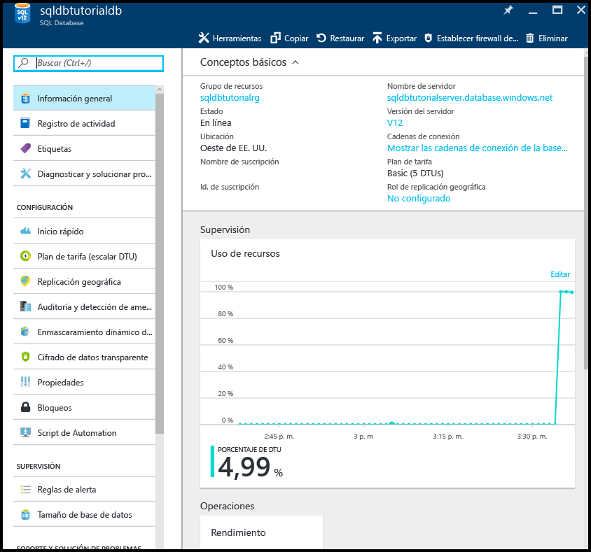
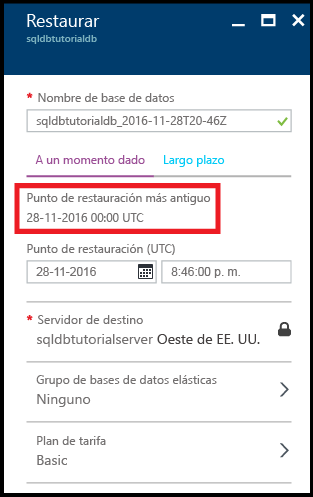
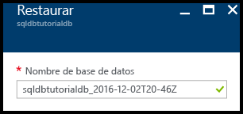
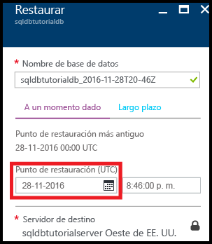
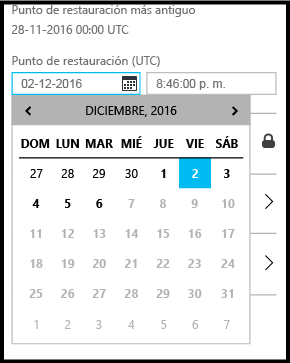
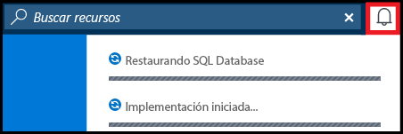
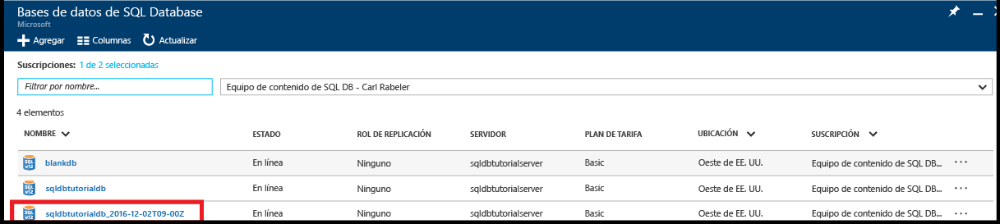
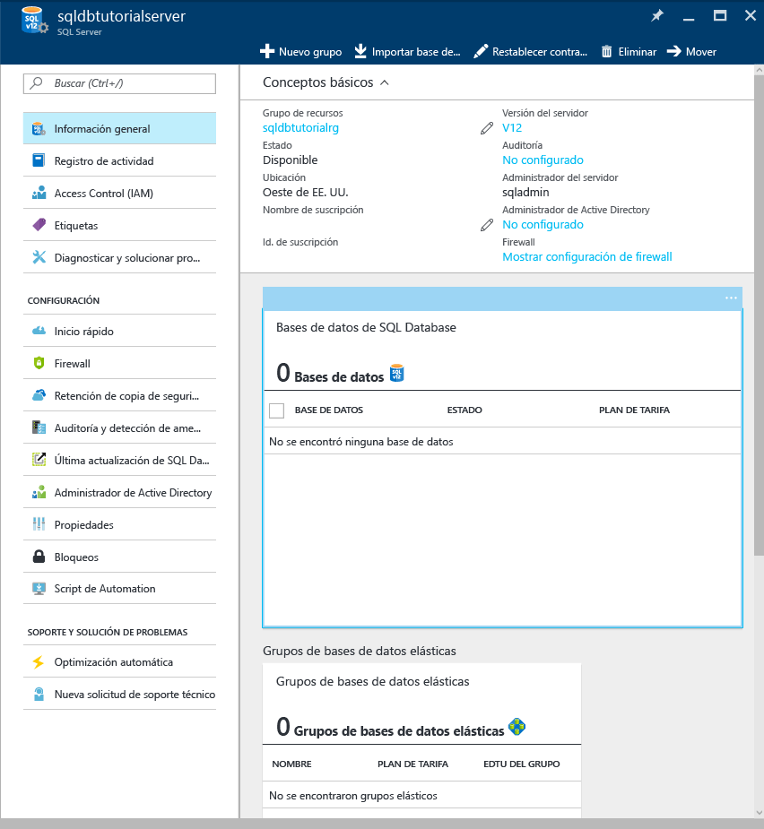
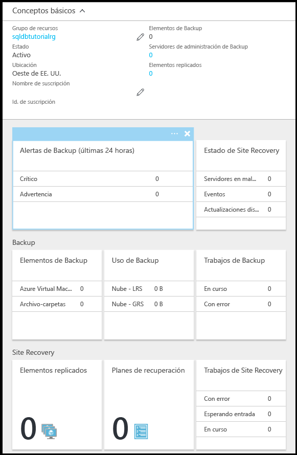

# Tutorial: copia de seguridad y restauración de una instancia de Azure SQL Database mediante Azure Portal
En este tutorial, aprenderá a usar el Portal de Azure para:

- Ver copias de seguridad existentes de una base de datos
- Restaurar una base de datos a un momento anterior en el tiempo
- Configurar la retención a largo plazo de un archivo de copia de seguridad de base de datos en el almacén de Azure Recovery Services
- Restaurar una base de datos del almacén de Azure Recovery Services

**Estimación del tiempo**: este tutorial se realiza en 30 minutos (suponiendo que ya se hayan cumplido los requisitos previos).

> [!TIP]
> Puede realizar las mismas tareas del tutorial de introducción con [PowerShell](sql-database-get-started-backup-recovery-powershell.md).
>

## Requisitos previos

* Necesitará una cuenta de Azure. Puede [abrir una cuenta gratuita de Azure](https://azure.microsoft.com/free/) o [activar las ventajas que disfrutan los suscriptores de Visual Studio](https://azure.microsoft.com/pricing/member-offers/msdn-benefits/). 

* Debe poder conectarse a Azure Portal mediante una cuenta que sea miembro del rol de colaborador o propietario de la suscripción. Para más información sobre el acceso basado en roles (RBAC), consulte [Introducción a la administración de acceso en Azure Portal](../active-directory/role-based-access-control-what-is.md).

* Ha finalizado la [introducción a los servidores, las bases de datos y las reglas de firewalls de Azure SQL Database mediante Azure Portal y SQL Server Management Studio](sql-database-get-started.md) o la [versión de PowerShell](sql-database-get-started-powershell.md) equivalente de este tutorial. Si no es así, realice el tutorial que es requisito previo o ejecute el script de PowerShell al final de la [versión de PowerShell](sql-database-get-started-powershell.md) de este tutorial antes de continuar.

> [!NOTE]
> Este tutorial le servirá para obtener información sobre el contenido de estos temas: [Copias de seguridad de SQL Database](sql-database-automated-backups.md), [Retención de copia de seguridad a largo plazo](sql-database-long-term-retention.md) y [Recuperación de una instancia de Azure SQL Database mediante copias de seguridad automatizadas](sql-database-recovery-using-backups.md).
>  

## Inicie sesión en Azure Portal con su cuenta.
Con una [suscripción existente](https://account.windowsazure.com/Home/Index), siga estos pasos para conectarse al portal de Azure.

1. Abra el explorador que prefiera y conéctese al [Portal de Azure](https://portal.azure.com/).
2. Inicie sesión en el [Portal de Azure](https://portal.azure.com/).
3. En la página **Iniciar sesión** , proporcione las credenciales de la suscripción.
   
   

## Visualización del punto de restauración más antiguo de las copias de seguridad generadas por el servicio de una base de datos

En esta sección del tutorial, verá información sobre el punto de restauración más antiguo de las [copias de seguridad automatizadas generadas por el servicio](sql-database-automated-backups.md) de su base de datos. 

1. Abra la hoja **SQL Database** de la base de datos **sqldbtutorialdb**.

   

2. En la barra de herramientas, haga clic en **Restaurar**.

   

3. En la hoja Restaurar, revise el punto de restauración más antiguo.

   

## Restauración de una base de datos a un momento anterior en el tiempo

En esta sección del tutorial, restaurará la base de datos en una nueva base de datos a partir de un momento específico en el tiempo.

1. En la hoja **Restaurar** de la base de datos, revise el nombre predeterminado de la nueva base de datos en la que va a restaurar su base de datos a un momento anterior en el tiempo (el nombre es el nombre de la base de datos existente anexado una marca de tiempo). Este nombre se cambia para reflejar la hora que especifique en los siguientes pasos.

   

2. Haga clic en el icono de **calendario** en el cuadro de entrada **Punto de restauración (UTC)**.

   

2. En el calendario, seleccione una fecha dentro del período de retención.

   

3. En el cuadro de entrada **Punto de restauración (UTC)**, especifique la hora en la fecha seleccionada a la que desea restaurar los datos de la base de datos de las copias de seguridad de base de datos automatizadas.

   

   >[!NOTE]
   >Observe que el nombre de la base de datos ha cambiado para reflejar la fecha y la hora seleccionadas. Observe también que no se puede cambiar el servidor en el que va a restaurar a un momento específico en el tiempo. Para restaurar en un servidor diferente, use [Georestauración](sql-database-disaster-recovery.md#recover-using-geo-restore). Por último, tenga en cuenta que la restauración se puede realizar en un [grupo elástico](sql-database-elastic-jobs-overview.md) o en otro plan de tarifa. 
   >

4. Haga clic en **Aceptar** para restaurar la base de datos a un momento anterior en el tiempo en la nueva base de datos.

5. En la barra de herramientas, haga clic en el icono de notificación para ver el estado del trabajo de restauración.

   

6. Cuando finalice el trabajo de restauración, abra la hoja **Bases de datos SQL** para ver la base de datos recién restaurada.

   

> [!NOTE]
> Desde aquí, puede conectarse a la base de datos restaurada mediante SQL Server Management Studio para realizar las tareas necesarias, como [extraer un bit de datos de la base de datos restaurada para copiarlo en la base de datos existente o para eliminar la base de datos existente y cambiar el nombre de la base de datos restaurada por el nombre de la base de datos existente](sql-database-recovery-using-backups.md#point-in-time-restore).
>

## Configuración de la retención a largo plazo de copias de seguridad automatizadas en un almacén de Azure Recovery Services 

En esta sección del tutorial, [configurará un almacén de Azure Recovery Services para conservar copias de seguridad automatizadas](sql-database-long-term-retention.md) durante un período más largo que el período de retención del nivel de servicio. 

> [!TIP]
> Para eliminar las copias de seguridad en la retención de copias de seguridad a largo plazo, consulte [Administración de la retención de copia de seguridad a largo plazo mediante PowerShell](sql-database-manage-long-term-backup-retention-powershell.md).
>

1. Abra la hoja **SQL Server** de su servidor, **sqldbtutorialserver**.

   

2. Haga clic en **Long-term backup retention** (Retención de copia de seguridad a largo plazo).

   

3. En la hoja **sqldbtutorial - Long-term backup retention** (sqldbtutorial: Retención de copia de seguridad a largo plazo), revise y acepte los términos de versión preliminar (a no ser que ya lo haya hecho, o esta característica ya no esté en versión preliminar).

   

4. Para configurar la retención de copia de seguridad a largo plazo para la base de datos sqldbtutorialdb, seleccione esa base de datos en la cuadrícula y luego haga clic en **Configurar** en la barra de herramientas.

   

5. En la hoja **Configurar**, haga clic en **Configurar los valores obligatorios** en **Recovery service vault** (Almacén de servicios de recuperación).

   

6. En la hoja **Recovery services vault** (Almacén de servicios de recuperación), seleccione un almacén existente, si lo hay. Si no se encuentra ningún almacén de servicios de recuperación para su suscripción, haga clic para salir del flujo y crear uno.

   

7. En la hoja **Almacenes de Recovery Services**, haga clic en **Agregar**.

   
   
8. En la hoja **Almacén de Recovery Services**, proporcione un nombre válido para el almacén de Recovery Services.

   

9. Seleccione la suscripción y el grupo de recursos y luego seleccione la ubicación del almacén. Cuando termine, haga clic en **Crear**.

   

   > [!IMPORTANT]
   > El almacén debe estar ubicado en la misma región que el servidor lógico de Azure SQL y debe usar el mismo grupo de recursos que el servidor lógico.
   >

10. Después de crear el nuevo almacén, ejecute los pasos necesarios para volver a la hoja **Almacén de Recovery Services**.

11. En la hoja **Almacén de Recovery Services**, haga clic en el almacén y luego en **Seleccionar**.

   

12. En la hoja **Configurar**, proporcione un nombre válido para la nueva directiva de retención, modifique la directiva de retención predeterminada según sea apropiado y luego haga clic en **Aceptar**.

   

13. En la hoja **sqldbtutorial - Long-term backup retention** (sqldbtutorial: Retención de copia de seguridad a largo plazo), haga clic en **Guardar** y luego en **Aceptar** para aplicar la directiva de retención de copia de seguridad a largo plazo a todas las bases de datos seleccionadas.

   

14. Haga clic en **Guardar** para habilitar la retención de copia de seguridad a largo plazo mediante esta nueva directiva para el almacén de Azure Recovery Services que ha configurado.

   

15. Cuando haya habilitado la retención de copia de seguridad a largo plazo, abra la hoja **sqldbtutorialvault** (vaya a **Todos los recursos** y selecciónela en la lista de recursos de su suscripción).

   

> [!IMPORTANT]
> Una vez configurado, las copias de seguridad se mostrarán en el almacén en los próximos siete días. No continúe con este tutorial hasta que las copias de seguridad se muestren en el almacén.
>

## Visualización de copias de seguridad con retención a largo plazo

En esta sección del tutorial, verá información sobre las copias de seguridad de base de datos con [retención a largo plazo](sql-database-long-term-retention.md). 

1. Abra la hoja **sqldbtutorialvault** (vaya a **Todos los recursos** y selecciónela de la lista de recursos de su suscripción) para ver la cantidad de almacenamiento que usan las copias de seguridad de base de datos en el almacén.

   

2. Abra la hoja **SQL Database** de la base de datos **sqldbtutorialdb**.

   

3. En la barra de herramientas, haga clic en **Restaurar**.

   

4. En la hoja Restaurar, haga clic en **A largo plazo**.

5. En Azure vault backups (Copias de seguridad de Azure Vault), haga clic en **Seleccionar una copia de seguridad** para ver las copias de seguridad de base de datos disponibles con retención a largo plazo.

   

## Restauración de una base de datos de una copia de seguridad con retención a largo plazo

En esta sección del tutorial, restaurará la base de datos en una nueva desde una copia de seguridad del almacén de Azure Recovery Services.

1. En la hoja **Azure vault backups** (Copias de seguridad de Azure Vault), haga clic en la copia de seguridad que quiere restaurar y luego haga clic en **Seleccionar**.

   

2. En el cuadro de texto **Nombre de la base de datos**, proporcione el nombre de la base de datos restaurada.

   

3. Haga clic en **Aceptar** para restaurar la base de datos de la copia de seguridad del almacén en la nueva base de datos.

4. En la barra de herramientas, haga clic en el icono de notificación para ver el estado del trabajo de restauración.

   

5. Cuando finalice el trabajo de restauración, abra la hoja **Bases de datos SQL** para ver la base de datos recién restaurada.

   

> [!NOTE]
> Desde aquí, puede conectarse a la base de datos restaurada mediante SQL Server Management Studio para realizar las tareas necesarias, como [extraer un bit de datos de la base de datos restaurada para copiarlo en la base de datos existente o para eliminar la base de datos existente y cambiar el nombre de la base de datos restaurada por el nombre de la base de datos existente](sql-database-recovery-using-backups.md#point-in-time-restore).
>

## Pasos siguientes

- Para aprender sobre las copias de seguridad automáticas generadas por el servicio, consulte [copias de seguridad automáticas](sql-database-automated-backups.md)
- Para más información sobre la retención de copia de seguridad a largo plazo, consulte sobre la [retención de copia de seguridad a largo plazo](sql-database-long-term-retention.md).
- Para aprender sobre la restauración a partir de copias de seguridad, consulte sobre la [restauración desde una copia de seguridad](sql-database-recovery-using-backups.md).

