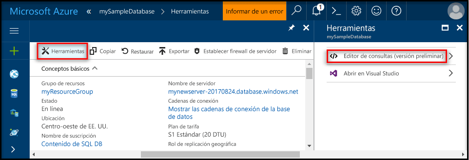
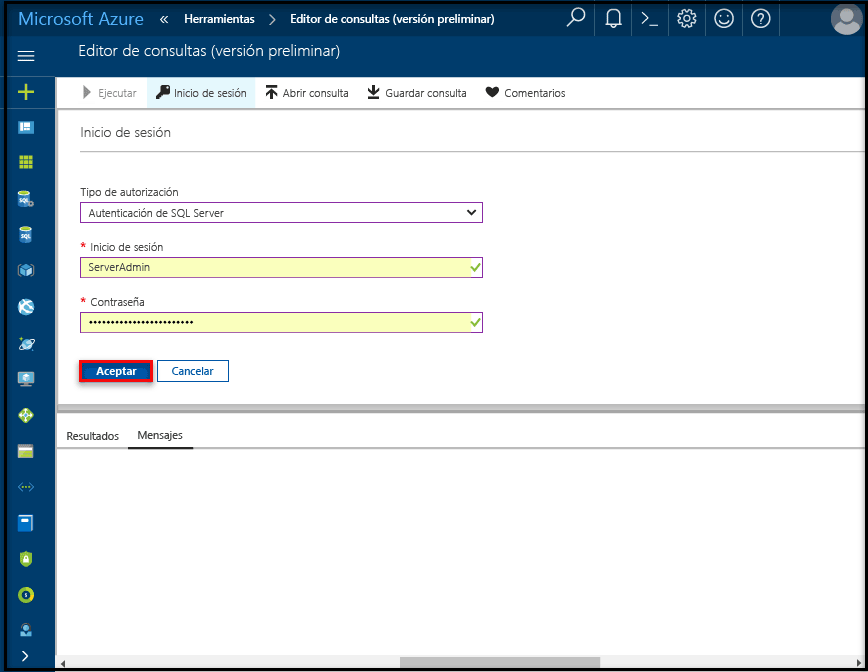

# <a name="create-an-azure-sql-database-in-the-azure-portal"></a>Creación de una instancia de Azure SQL Database en Azure Portal

Este tutorial de inicio rápido le guía por el proceso de creación de una instancia de SQL Database en Azure. Azure SQL Database es una oferta de "base de datos como servicio" que permite ejecutar y escalar bases de datos de SQL Server de alta disponibilidad en la nube. En esta guía de inicio rápido se muestra cómo comenzar mediante la creación de una instancia de SQL Database a través de Azure Portal.

Si no tiene una suscripción a Azure, cree una cuenta [gratuita](https://azure.microsoft.com/free/) antes de empezar.

## <a name="log-in-to-the-azure-portal"></a>Iniciar sesión en el portal de Azure

Inicie sesión en el [Portal de Azure](https://portal.azure.com/).

## <a name="create-a-sql-database"></a>Creación de una Base de datos SQL

Se crea una base de datos SQL de Azure con un conjunto definido de [recursos de proceso y almacenamiento](sql-database-service-tiers.md). La base de datos se crea dentro de un [grupo de recursos de Azure](../azure-resource-manager/resource-group-overview.md) y en un [servidor lógico de Azure SQL Database](sql-database-features.md). 

Siga estos pasos para crear una instancia de SQL Database que contenga los datos de ejemplo de Adventure Works LT. 

1. Haga clic en el botón **Nuevo** de la esquina superior izquierda de Azure Portal.

2. En la página **Nuevo**, seleccione **Bases de datos** y, en la página **Bases de datos**, seleccione **SQL Database**.

    

3. Rellene el formulario de SQL Database con la siguiente información, como se muestra en la imagen anterior:     
   - Nombre de la base de datos: **mySampleDatabase**
   - Grupo de recursos: **myResourceGroup**
   - Origen: **Sample (AdventureWorksLT)** [Ejemplo (AdventureWorksLT)]

   > [!IMPORTANT]
   > Debe seleccionar la base de datos de ejemplo de este formulario porque se utiliza en el resto de esta guía de inicio rápido.
   > 

4. Haga clic en **Servidor** y rellene el **formulario de servidor nuevo**, en el que debe especificar un nombre de servidor único global, indique un nombre para el inicio de sesión de administrador del servidor y especifique la contraseña que desee. 

   > [!IMPORTANT]
   > Se requiere el inicio de sesión y la contraseña de administrador de servidor que especifique aquí para iniciar sesión en el servidor y a sus bases de datos más adelante en esta guía de inicio rápido. Recuerde o grabe esta información para su uso posterior. 
   >  

    
5. Cuando haya completado el formulario, haga clic en **Seleccionar**.

6. Haga clic en **Plan de tarifa** para especificar el tanto el nivel de rendimiento como el nivel de servicio de la nueva base de datos. Utilice el control deslizante para seleccionar **20 DTU** y **250** GB de almacenamiento. Para más información acerca de las DTU, consulte [¿Qué es una DTU?](sql-database-what-is-a-dtu.md).

    

7. Después de seleccionar la cantidad de DTU, haga clic en **Aplicar**.  

8. Una vez completado el formulario de SQL Database, haga clic en **Crear** para aprovisionar la base de datos. El aprovisionamiento tarda unos minutos. 

9. En la barra de herramientas, haga clic en **Notificaciones** para supervisar el proceso de implementación.

    


## <a name="create-a-server-level-firewall-rule"></a>Crear una regla de firewall de nivel de servidor

El servicio SQL Database crea un firewall en el nivel de servidor, lo que impide que herramientas y aplicaciones externas se conecten al servidor o a las bases de datos del servidor, a menos que se cree una regla de firewall para abrir el firewall para direcciones IP concretas. Siga estos pasos para crear una [regla de firewall de nivel de servidor de SQL Database](sql-database-firewall-configure.md) para la dirección IP de su cliente y habilite la conectividad externa a través de dicho firewall solo para su dirección IP. 

> [!NOTE]
> SQL Database se comunica a través del puerto 1433. Si intenta conectarse desde dentro de una red corporativa, es posible que el firewall de la red no permita el tráfico de salida a través del puerto 1433. Si es así, no podrá conectarse al servidor de Azure SQL Database, a menos que el departamento de TI abra el puerto 1433.
>

1. Cuando se haya finalizado la implementación, haga clic en **SQL Database** en el menú izquierdo y después haga clic **mySampleDatabase** en la página de base de datos de SQL Database. Se abre la página de información general de la base de datos, que muestra el nombre completo del servidor (por ejemplo, **mynewserver20170411.database.windows.net**) y proporciona opciones para otras configuraciones.

   > [!IMPORTANT]
   > Necesitará este nombre completo del servidor para conectarse a su servidor y a sus bases de datos en las siguientes guías de inicio rápido.
   > 

       

2. Haga clic en **Establecer el firewall del servidor** en la barra de herramientas, como se muestra en la imagen anterior. Se abrirá la página **Configuración del firewall** del servidor de SQL Database. 

       


3. Haga clic en **Agregar IP de cliente** en la barra de herramientas para agregar la dirección IP actual a la nueva regla de firewall. La regla de firewall puede abrir el puerto 1433 para una única dirección IP o un intervalo de direcciones IP.

4. Haga clic en **Guardar**. Se crea una regla de firewall de nivel de servidor para el puerto 1433 de la dirección IP actual en el servidor lógico.

       

4. Haga clic en **Aceptar** y después cierre la página **Configuración de firewall**.

Ahora puede conectarse al servidor de SQL Database y a sus bases de datos mediante SQL Server Management Studio o cualquier otra herramienta que elija desde esta dirección IP usando la cuenta de administrador del servidor creada con anterioridad.

> [!IMPORTANT]
> De forma predeterminada, el acceso a través del firewall de SQL Database está habilitado para todos los servicios de Azure. Haga clic en **OFF** en esta página para deshabilitar todos los servicios de Azure.

## <a name="query-the-sql-database"></a>Consulta a SQL Database

Ahora que ha creado una base de datos de ejemplo en Azure, vamos a usar la herramienta de consulta integrada en Azure Portal para confirmar que puede conectarse a la base de datos y consultar los datos. 

1. En la barra de herramientas de la página SQL Database de la base de datos, haga clic en **Herramientas**. Se abre la página **Herramientas**.

      

2. Haga clic en **Editor de consultas (versión preliminar)**, en la casilla de verificación **Términos de vista previa** y en **Aceptar**. Se abre la página Editor de consultas.

3. Haga clic en **Inicio de sesión** y después, cuando se le solicite, seleccione **Autenticación de servidor SQL Server** y especifique el inicio de sesión y la contraseña de administrador de servidor que creó antes.

     

4. Haga clic en **Aceptar** para iniciar sesión.

5. Una vez autenticado, escriba la siguiente consulta en el panel del editor de consultas.

   ```
   SELECT TOP 20 pc.Name as CategoryName, p.name as ProductName
   FROM SalesLT.ProductCategory pc
   JOIN SalesLT.Product p
   ON pc.productcategoryid = p.productcategoryid;
   ```

6. Haga clic en **Ejecución** y revise los resultados de la consulta en el panel **Resultados**.

    

7. Cierre la página **Editor de consultas** y la página **Herramientas**.

## <a name="clean-up-resources"></a>Limpieza de recursos

Si no necesita estos recursos para otro inicio rápido o tutorial (consulte [Pasos siguientes](#next-steps)), puede eliminarlos de la siguiente manera:


1. En el menú izquierdo de Azure Portal, haga clic en **Grupos de recursos** y en **myResourceGroup**. 
2. En la página del grupo de recursos, haga clic en **Eliminar**, escriba **myResourceGroup** en el cuadro de texto y haga clic en **Eliminar**.

## <a name="next-steps"></a>Pasos siguientes

Ahora que tiene una base de datos, puede conectarse y realizar consultas con las herramientas que desee. Para más información, seleccione una de las herramientas siguientes:

- [SQL Server Management Studio](sql-database-connect-query-ssms.md)
- [código de Visual Studio](sql-database-connect-query-vscode.md)
- [.NET](sql-database-connect-query-dotnet.md)
- [PHP](sql-database-connect-query-php.md)
- [Node.js](sql-database-connect-query-nodejs.md)
- [Java](sql-database-connect-query-java.md)
- [Python](sql-database-connect-query-python.md)
- [Ruby](sql-database-connect-query-ruby.md)

