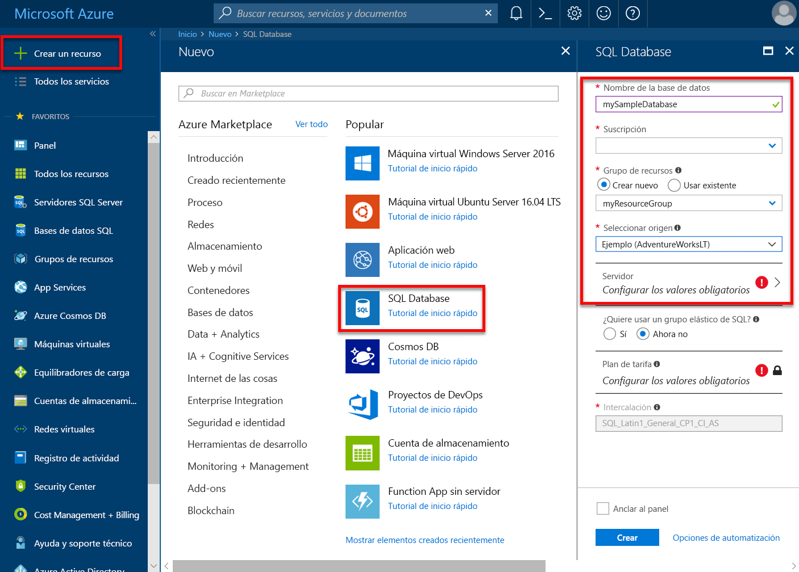
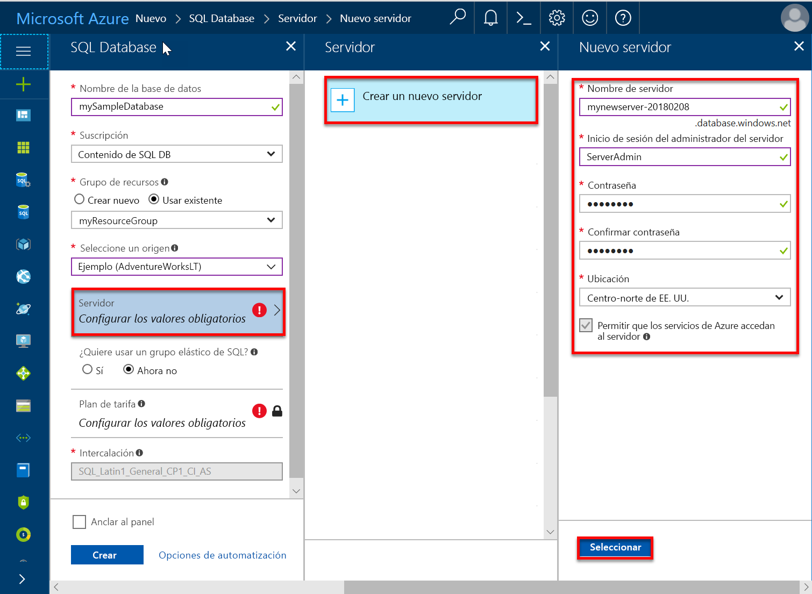
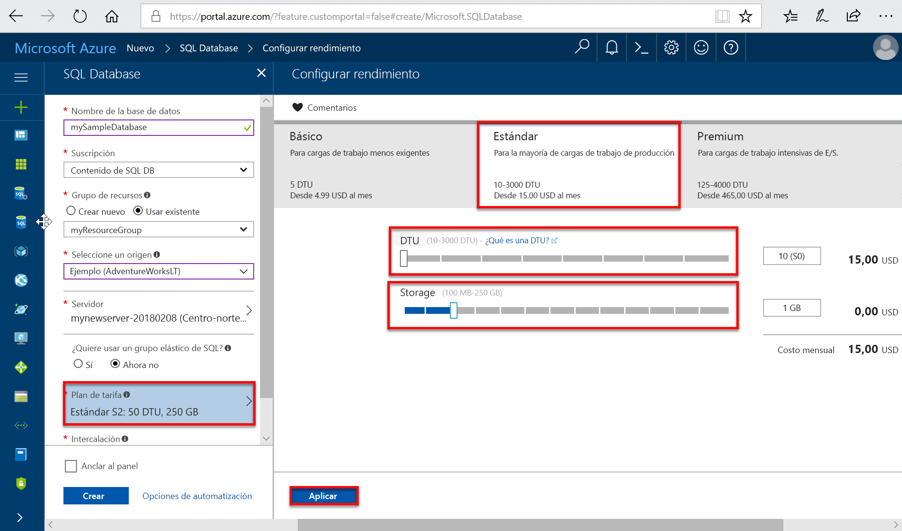
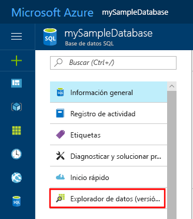
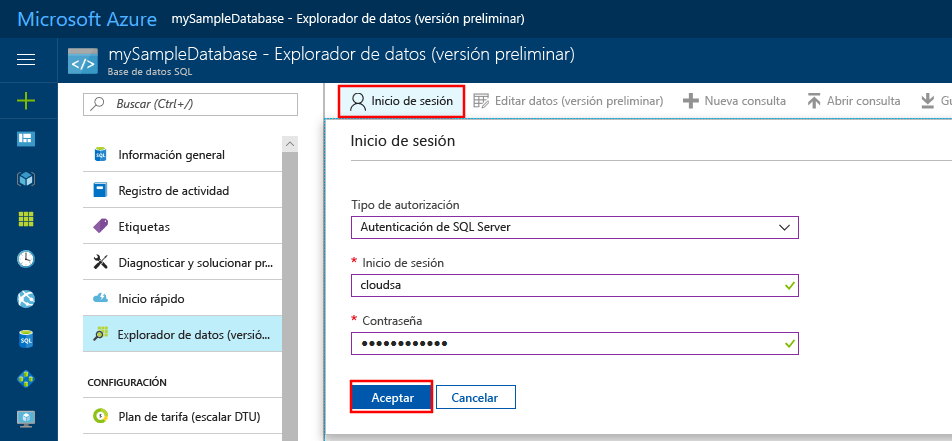
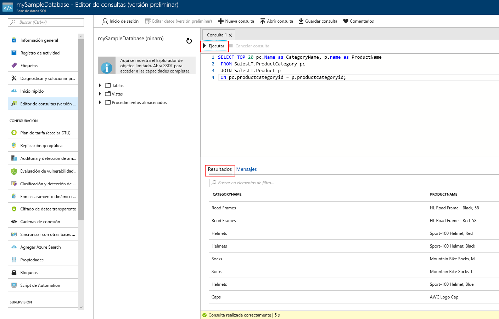

# <a name="create-an-azure-sql-database-in-the-azure-portal"></a>Creación de una instancia de Azure SQL Database en Azure Portal

Este tutorial de inicio rápido le guía por el proceso de creación de una instancia de SQL Database en Azure. Azure SQL Database es una oferta de "base de datos como servicio" que permite ejecutar y escalar bases de datos de SQL Server de alta disponibilidad en la nube. En esta guía de inicio rápido se muestra cómo comenzar mediante la creación de una instancia de SQL Database a través de Azure Portal.

Si no tiene una suscripción a Azure, cree una cuenta [gratuita](https://azure.microsoft.com/free/) antes de empezar.

## <a name="log-in-to-the-azure-portal"></a>Iniciar sesión en Azure Portal

Inicie sesión en [Azure Portal](https://portal.azure.com/).

## <a name="create-a-sql-database"></a>Creación de una base de datos SQL

Se crea una instancia de Azure SQL Database con un conjunto definido de [recursos de proceso y almacenamiento](sql-database-service-tiers.md). La base de datos se crea dentro de un [grupo de recursos de Azure](../azure-resource-manager/resource-group-overview.md) y en un [servidor lógico de Azure SQL Database](sql-database-features.md).

Siga estos pasos para crear una base de datos SQL que contenga los datos de ejemplo de Adventure Works LT.

1. Haga clic en el botón **Nuevo** de la esquina superior izquierda de Azure Portal.

2. Seleccione **Bases de datos** en la página **Nuevo** y seleccione **Crear** en **SQL Database** en la página **Nuevo**.

   

3. Rellene el formulario de SQL Database con la siguiente información, como se muestra en la imagen anterior:   

   | Configuración       | Valor sugerido | DESCRIPCIÓN |
   | ------------ | ------------------ | ------------------------------------------------- |
   | **Nombre de la base de datos** | mySampleDatabase | Para conocer los nombres de base de datos válidos, consulte [Database Identifiers](https://docs.microsoft.com/sql/relational-databases/databases/database-identifiers) (Identificadores de base de datos). |
   | **Suscripción** | Su suscripción  | Para más información acerca de sus suscripciones, consulte [Suscripciones](https://account.windowsazure.com/Subscriptions). |
   | **Grupos de recursos**  | myResourceGroup | Para conocer cuáles son los nombres de grupo de recursos válidos, consulte el artículo [Naming conventions](https://docs.microsoft.com/azure/architecture/best-practices/naming-conventions) (Convenciones de nomenclatura). |
   | **Seleccionar origen** | Ejemplo (AdventureWorksLT) | Carga el esquema y los datos de AdventureWorksLT en la base de datos nueva |

   > [!IMPORTANT]
   > Debe seleccionar la base de datos de ejemplo de este formulario porque se utiliza en el resto de esta guía de inicio rápido.
   >

4. En **Servidor**, haga clic en **Configurar los valores obligatorios** y rellene el formulario de SQL Server (servidor lógico) con la siguiente información, como se muestra en la imagen siguiente:   

   | Configuración       | Valor sugerido | DESCRIPCIÓN |
   | ------------ | ------------------ | ------------------------------------------------- |
   | **Nombre del servidor** | Cualquier nombre globalmente único | Para conocer cuáles son los nombres de servidor válidos, consulte el artículo [Naming conventions](https://docs.microsoft.com/azure/architecture/best-practices/naming-conventions) (Convenciones de nomenclatura). |
   | **Inicio de sesión del administrador del servidor** | Cualquier nombre válido | Para conocer los nombres de inicio de sesión válidos, consulte [Database Identifiers](https://docs.microsoft.com/sql/relational-databases/databases/database-identifiers) (Identificadores de base de datos). |
   | **Password** | Cualquier contraseña válida | La contraseña debe tener un mínimo de 8 caracteres y debe contener caracteres de tres de las siguientes categorías: caracteres en mayúsculas, caracteres en minúsculas, números y caracteres no alfanuméricos. |
   | **Suscripción** | Su suscripción | Para más información acerca de sus suscripciones, consulte [Suscripciones](https://account.windowsazure.com/Subscriptions). |
   | **Grupos de recursos** | myResourceGroup | Para conocer cuáles son los nombres de grupo de recursos válidos, consulte el artículo [Naming conventions](https://docs.microsoft.com/azure/architecture/best-practices/naming-conventions) (Convenciones de nomenclatura). |
   | **Ubicación** | Cualquier ubicación válida | Para obtener información acerca de las regiones, consulte [Regiones de Azure](https://azure.microsoft.com/regions/). |

   > [!IMPORTANT]
   > Se requiere el inicio de sesión y la contraseña de administrador de servidor que especifique aquí para iniciar sesión en el servidor y a sus bases de datos más adelante en esta guía de inicio rápido. Recuerde o grabe esta información para su uso posterior.
   >  

   

5. Cuando haya completado el formulario, haga clic en **Seleccionar**.

6. Haga clic en **Plan de tarifa** para especificar el nivel de servicio, el número de DTU y la cantidad de almacenamiento. Explore las opciones de cantidad de almacenamiento y de DTU que están a su disposición para cada nivel de servicio.

   > [!IMPORTANT]
   > \* Los tamaños de almacenamiento mayores que la cantidad de almacenamiento incluida están en su versión preliminar y pueden generar costos adicionales. Para obtener información detallada, vea [Precios de SQL Database](https://azure.microsoft.com/pricing/details/sql-database/).
   >
   >\* En el nivel Premium, más de 1 TB de almacenamiento se encuentra actualmente disponible en las siguientes regiones: este de EE. UU. 2, oeste de EE. UU., Virginia Gob. EE. UU., Europa Occidental, centro de Alemania, Asia Suroriental, Japón Oriental, este de Australia, centro de Canadá y este de Canadá. Consulte [Limitaciones actuales P11-P15](sql-database-resource-limits.md#single-database-limitations-of-p11-and-p15-when-the-maximum-size-greater-than-1-tb).  
   >

7. Para este tutorial de inicio rápido, seleccione el nivel de servicio **Estándar** y, a continuación, utilice el control deslizante para seleccionar **100 DTU (S3)** y **400** GB de almacenamiento.

   

8. Acepte los términos de la versión preliminar para usar la opción de **almacenamiento de complementos**.

   > [!IMPORTANT]
   > \* Los tamaños de almacenamiento mayores que la cantidad de almacenamiento incluida están en su versión preliminar y pueden generar costos adicionales. Para obtener información detallada, vea [Precios de SQL Database](https://azure.microsoft.com/pricing/details/sql-database/).
   >
   >\* En el nivel Premium, más de 1 TB de almacenamiento se encuentra actualmente disponible en las siguientes regiones: este de EE. UU. 2, oeste de EE. UU., Virginia Gob. EE. UU., Europa Occidental, centro de Alemania, Asia Suroriental, Japón Oriental, este de Australia, centro de Canadá y este de Canadá. Consulte [Limitaciones actuales P11-P15](sql-database-resource-limits.md#single-database-limitations-of-p11-and-p15-when-the-maximum-size-greater-than-1-tb).  
   >

9. Después de seleccionar el nivel del servidor, el número de DTU y la cantidad de almacenamiento, haga clic en **Aplicar**.  

10. Una vez completado el formulario de SQL Database, haga clic en **Crear** para aprovisionar la base de datos. El aprovisionamiento tarda unos minutos.

11. En la barra de herramientas, haga clic en **Notificaciones** para supervisar el proceso de implementación.

     

## <a name="create-a-server-level-firewall-rule"></a>Crear una regla de firewall de nivel de servidor

El servicio SQL Database crea un firewall en el nivel de servidor, lo que impide que herramientas y aplicaciones externas se conecten al servidor o a las bases de datos del servidor, a menos que se cree una regla de firewall para abrir el firewall para direcciones IP concretas. Siga estos pasos para crear una [regla de firewall de nivel de servidor de SQL Database](sql-database-firewall-configure.md) para la dirección IP de su cliente y habilite la conectividad externa a través de dicho firewall solo para su dirección IP.

> [!NOTE]
> SQL Database se comunica a través del puerto 1433. Si intenta conectarse desde dentro de una red corporativa, es posible que el firewall de la red no permita el tráfico de salida a través del puerto 1433. En ese caso, no puede conectarse al servidor de Azure SQL Database, salvo que el departamento de TI abra el puerto 1433.
>

1. Cuando se haya finalizado la implementación, haga clic en **Bases de datos SQL** en el menú de la izquierda y, después, haga clic en **mySampleDatabase** en la página **Bases de datos SQL**. Se abre la página de información general de la base de datos, que muestra el nombre completo del servidor (por ejemplo, **mynewserver-20170824.database.windows.net**) y proporciona opciones para otras configuraciones.

2. Copie este nombre para conectarse a su servidor y a sus bases de datos en los inicios rápidos posteriores.

   

3. Haga clic en **Establecer el firewall del servidor** en la barra de herramientas, como se muestra en la imagen anterior. Se abrirá la página **Configuración del firewall** del servidor de SQL Database.

   

4. Haga clic en **Agregar IP de cliente** en la barra de herramientas para agregar la dirección IP actual a la nueva regla de firewall. La regla de firewall puede abrir el puerto 1433 para una única dirección IP o un intervalo de direcciones IP.

5. Haga clic en **Save**(Guardar). Se crea una regla de firewall de nivel de servidor para el puerto 1433 de la dirección IP actual en el servidor lógico.

6. Haga clic en **Aceptar** y después cierre la página **Configuración de firewall**.

Ahora puede conectarse al servidor de SQL Database y a sus bases de datos mediante SQL Server Management Studio o cualquier otra herramienta que elija desde esta dirección IP usando la cuenta de administrador del servidor creada con anterioridad.

> [!IMPORTANT]
> De forma predeterminada, el acceso a través del firewall de SQL Database está habilitado para todos los servicios de Azure. Haga clic en **OFF** en esta página para deshabilitar todos los servicios de Azure.
>

## <a name="query-the-sql-database"></a>Consulta a SQL Database

Ahora que ha creado una base de datos de ejemplo en Azure, vamos a usar la herramienta de consulta integrada en Azure Portal para confirmar que puede conectarse a la base de datos y consultar los datos.

1. En la página de SQL Database, busque y haga clic en **Explorador de datos (versión preliminar)** en el menú de la izquierda.

   

2. Haga clic en **Inicio de sesión**, revise la información de inicio de sesión y, a continuación, haga clic en **Aceptar** para iniciar sesión mediante la autenticación de SQL Server con el inicio de sesión y la contraseña de administrador de servidor que creó anteriormente.

   

3. Haga clic en **Aceptar** para iniciar sesión.

4. Una vez autenticado como **ServerAdmin**, escriba la siguiente consulta en el panel del editor de consultas.

   ```sql
   SELECT TOP 20 pc.Name as CategoryName, p.name as ProductName
   FROM SalesLT.ProductCategory pc
   JOIN SalesLT.Product p
   ON pc.productcategoryid = p.productcategoryid;
   ```

5. Haga clic en **Ejecución** y revise los resultados de la consulta en el panel **Resultados**.

   

6. Cierre la página **Explorador de datos** y haga clic en **Aceptar** para descartar los cambios no guardados.

## <a name="clean-up-resources"></a>Limpieza de recursos

Guarde estos recursos si desea volver a la sección [Pasos siguientes](#next-steps) y aprender a conectarse y consultar la base de datos mediante una serie de métodos diferentes. Si desea eliminar los recursos que ha creado en este inicio rápido, siga estos pasos.


1. En el menú izquierdo de Azure Portal, haga clic en **Grupos de recursos** y en **myResourceGroup**.
2. En la página del grupo de recursos, haga clic en **Eliminar**, escriba **myResourceGroup** en el cuadro de texto y haga clic en **Eliminar**.

## <a name="next-steps"></a>pasos siguientes

Ahora que tiene una base de datos, puede conectarse y realizar consultas con las herramientas que desee. Para más información, seleccione una de las herramientas siguientes:

- [SQL Server Management Studio](sql-database-connect-query-ssms.md)
- [código de Visual Studio](sql-database-connect-query-vscode.md)
- [.NET](sql-database-connect-query-dotnet.md)
- [PHP](sql-database-connect-query-php.md)
- [Node.js](sql-database-connect-query-nodejs.md)
- [Java](sql-database-connect-query-java.md)
- [Python](sql-database-connect-query-python.md)
- [Ruby](sql-database-connect-query-ruby.md)
