# <a name="quick-start-tutorial-your-first-azure-sql-database"></a>Tutorial de inicio rápido: su primera base de datos de Azure SQL Database

En este tutorial de inicio rápido, aprenderá cómo:

* [Crear un servidor lógico nuevo](sql-database-get-started.md#create-a-new-logical-sql-server) 
* [Ver las propiedades de servidor lógico](sql-database-get-started.md#view-the-logical-server-properties) 
* [Crear una regla de firewall de nivel de servidor](sql-database-get-started.md#create-a-server-level-firewall-rule) 
* [Conectarse al servidor con SSMS](sql-database-get-started.md#connect-to-the-server-with-ssms) 
* [Crear una base de datos con datos de ejemplo](sql-database-get-started.md#create-a-database-with-sample-data) 
* [Ver las propiedades de la base de datos](sql-database-get-started.md#view-the-database-properties) 
* [Consultar la base de datos en Azure Portal](sql-database-get-started.md#query-the-database-in-the-azure-portal) 
* [Conectarse y consultar la base de datos con SSMS](sql-database-get-started.md#connect-and-query-the-database-with-ssms) 
* [Crear una base de datos vacía con SSMS](sql-database-get-started.md#create-a-blank-database-with-ssms) 
* [Solucionar problemas de conectividad](sql-database-get-started.md#troubleshoot-connectivity) 
* [Eliminar una base de datos](sql-database-get-started.md#delete-a-single-database) 


En este tutorial de inicio rápido va a crear una base de datos de ejemplo y una base de datos vacía en ejecución en un grupo de recursos de Azure y que estarán conectadas a un servidor lógico. También va a crear dos reglas de firewall de nivel de servidor configuradas para que la entidad de seguridad de nivel de servidor pueda iniciar sesión en el servidor desde dos direcciones IP especificadas. Por último, aprenderá a consultar una base de datos en Azure Portal y cómo conectarse y consultar con SQL Server Management Studio. 

**Tiempo estimado**: este tutorial dura aproximadamente 30 minutos (si ya cumple los requisitos previos).

> [!TIP]
> Puede realizar estas mismas tareas con [C#](sql-database-get-started-csharp.md) o [PowerShell](sql-database-get-started-powershell.md).
>

## <a name="prerequisites"></a>Requisitos previos

* Necesitará una cuenta de Azure. Puede [abrir una cuenta gratuita de Azure](/pricing/free-trial/?WT.mc_id=A261C142F) o [activar las ventajas que disfrutan los suscriptores de Visual Studio](/pricing/member-offers/msdn-benefits-details/?WT.mc_id=A261C142F). 

* Debe poder conectarse a Azure Portal con una cuenta que sea miembro del rol de colaborador o propietario de la suscripción. Para más información sobre el acceso basado en roles (RBAC), consulte [Introducción a la administración de acceso en Azure Portal](../active-directory/role-based-access-control-what-is.md).

> [!NOTE]
> Este tutorial de inicio rápido le servirá para obtener información sobre el contenido de estos temas: [Introducción al servidor de SQL Database](sql-database-server-overview.md), [Introducción a SQL Database](sql-database-overview.md) e [Introducción a las reglas de firewall de Azure SQL Database](sql-database-firewall-configure.md).
>  


### <a name="sign-in-to-the-azure-portal-with-your-azure-account"></a>Inicio de sesión en Azure Portal con su cuenta de Azure
Con su [cuenta de Azure](https://account.windowsazure.com/Home/Index), siga estos pasos para conectarse a Azure Portal.

1. Abra el explorador que prefiera y conéctese al [Portal de Azure](https://portal.azure.com/).
2. Inicie sesión en el [Portal de Azure](https://portal.azure.com/).
3. En la página **Iniciar sesión** , proporcione las credenciales de la suscripción.
   
   


<a name="create-logical-server-bk"></a>

## <a name="create-a-new-logical-sql-server"></a>Crear un servidor lógico nuevo

Siga los pasos de este procedimiento para crear un nuevo servidor lógico con Azure Portal en la región de su elección.

1. Haga clic en **Nuevo**, escriba **sql server** y haga clic en **ENTRAR**.

    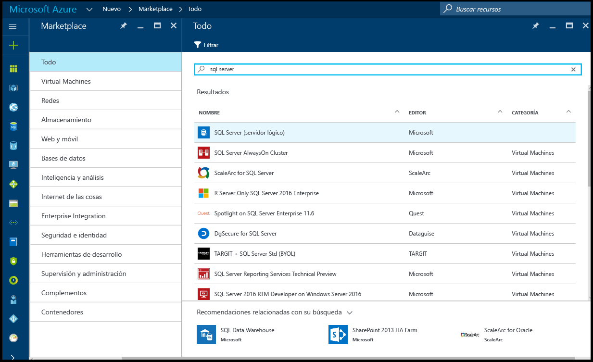
2. Haga clic en **SQL server (servidor lógico)**.
   
    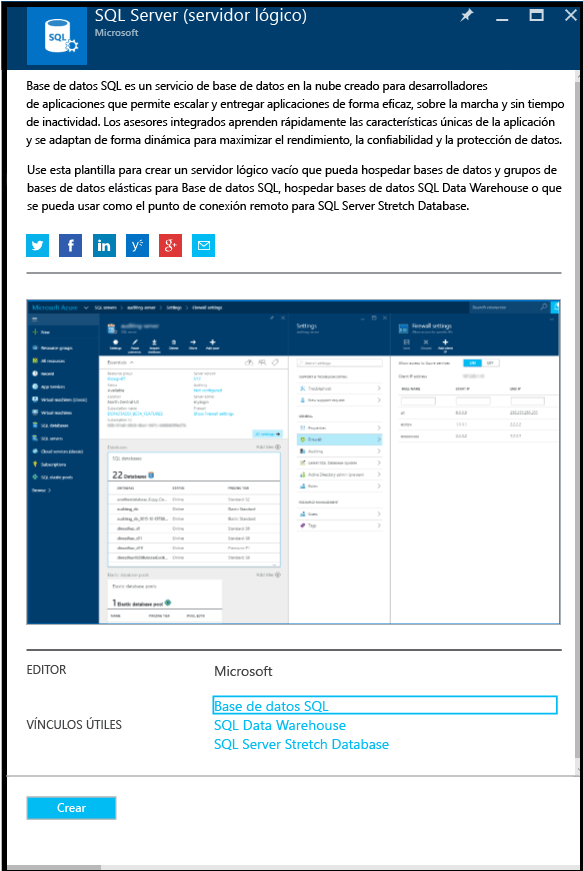
3. Haga clic en **Crear** para abrir la nueva hoja SQL Server (servidor lógico).

    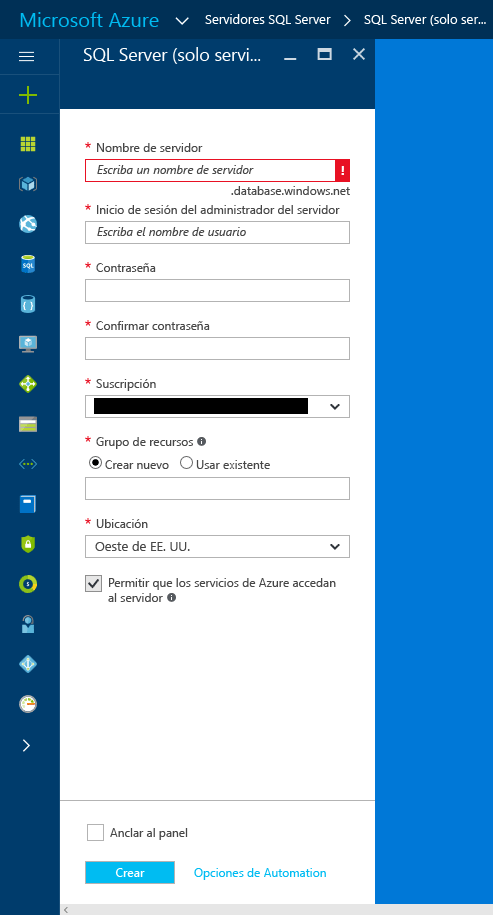
3. En el cuadro de texto Nombre de servidor, proporcione un nombre válido para el nuevo servidor lógico. Una marca de verificación verde indica que ha proporcionado un nombre válido.
    
    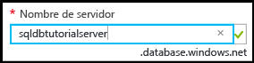

    > [!IMPORTANT]
    > El nombre completo del nuevo servidor tiene el formato <nombreDeSuServidor>.database.windows.net.
    >
    
4. En el cuadro de texto de inicio de sesión del administrador del servidor, proporcione un nombre de usuario para el inicio de sesión de autenticación de SQL para este servidor. Este inicio de sesión se conoce como el inicio de sesión de la entidad de seguridad del servidor. Una marca de verificación verde indica que ha proporcionado un nombre válido.
    
    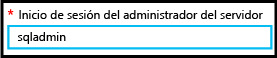
5. En los cuadros de texto **Contraseña** y **Confirmar contraseña**, escriba una contraseña para la cuenta de inicio de sesión de la entidad de seguridad del servidor. Una marca de verificación verde indica que ha proporcionado una contraseña válida.
    
    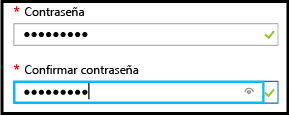
6. Seleccione una suscripción en la que tenga permiso para crear objetos.

    
7. En el cuadro de texto Grupo de recursos, seleccione **Crear nuevo** y, en el cuadro de texto del grupo de recursos, proporcione un nombre válido para el nuevo grupo de recursos (también puede usar un grupo de recursos existente si ya ha creado uno para sí mismo). Una marca de verificación verde indica que ha proporcionado un nombre válido.

    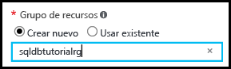

8. En el cuadro de texto **Ubicación**, seleccione un centro de datos adecuado para su ubicación; por ejemplo, "Este de Australia".
    
    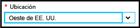
    
    > [!TIP]
    > La casilla de verificación **Permitir que los servicios de Azure accedan al servidor** no se puede cambiar en esta hoja. Puede cambiar esta configuración en la hoja del firewall del servidor. Para más información, consulte [Get started with security](sql-database-control-access-sql-authentication-get-started.md) (Introducción a la seguridad).
    >
    
9. Haga clic en **Crear**.

    

## <a name="view-the-logical-server-properties"></a>Ver las propiedades de servidor lógico

Siga los pasos de este procedimiento para ver las propiedades del servidor con Azure Portal. Necesita el nombre completo del servidor para conectarse a este servidor en un procedimiento posterior. 

1. En Azure Portal, haga clic en **Más servicios**.

    
2. En el cuadro de texto Filtrar, escriba **SQL** y, después, haga clic en la estrella de los servidores de SQL Server para especificarlos como favoritos en Azure. 

    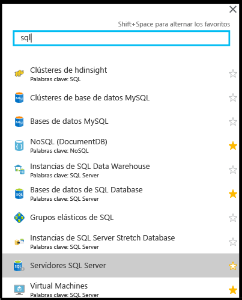
3. En la hoja predeterminada, haga clic en **Servidores SQL Server** para abrir la lista de servidores SQL Server en su suscripción de Azure. 

    

4. Haga clic en el nuevo servidor SQL para ver sus propiedades en Azure Portal. Los tutoriales siguientes le ayudarán a comprender las opciones disponibles en esta hoja.

    
5. En Configuración, haga clic en **Propiedades** para ver varias propiedades del servidor SQL lógico.

    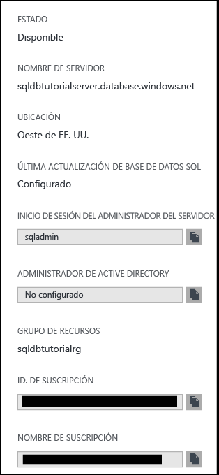
6. Copie el nombre completo del servidor en el Portapapeles para usarlo un poco más adelante en este tutorial.

    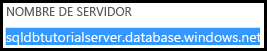

## <a name="create-a-server-level-firewall-rule"></a>Crear una regla de firewall de nivel de servidor

Siga los pasos de este procedimiento para crear una nueva regla de firewall de nivel de servidor con Azure Portal para que pueda conectarse a su servidor con SQL Server Management Studio en el procedimiento siguiente.

1. En la hoja SQL Server, en Configuración, haga clic en **Firewall** para abrir la hoja Firewall para el servidor SQL Server.

    

2. Haga clic en **Agregar IP de cliente** en la barra de herramientas.

    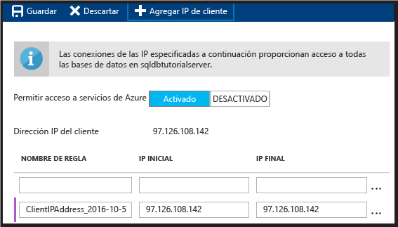

    > [!NOTE]
    > Puede abrir el firewall de SQL Database en el servidor para una sola dirección IP o para un intervalo de direcciones. Abrir el firewall permite a los administradores y usuarios de SQL iniciar sesión en cualquier base de datos del servidor para el que tengan unas credenciales válidas.
    >

4. Haga clic en **Guardar** en la barra de herramientas para guardar esta regla de firewall de nivel de servidor y, después, haga clic en **Aceptar**.

    

## <a name="connect-to-the-server-with-ssms"></a>Conectarse al servidor con SSMS

Siga los pasos de este procedimiento para conectarse con el servidor lógico de SQL con SQL Server Management Studio.

1. Si aún no lo ha hecho descargue e instale la versión más reciente de SSMS en [Descarga de SQL Server Management Studio](https://msdn.microsoft.com/library/mt238290.aspx). Para estar siempre actualizado, la versión más reciente de SSMS le avisará cuando haya una nueva versión disponible para su descarga.

2. Después de la instalación, escriba **Microsoft SQL Server Management Studio** en el cuadro de búsqueda de Windows y haga clic en **Entrar** para abrir SSMS:

    
3. En el cuadro de diálogo Conectar con el servidor, escriba la información necesaria para conectarse a su servidor SQL Server con la autenticación de SQL Server.

    
4. Haga clic en **Conectar**.

    
5. En el Explorador de objetos, expanda **Bases de datos**, expanda **Bases de datos de sistema** y expanda **Maestra** para ver los objetos de la base de datos maestra.

    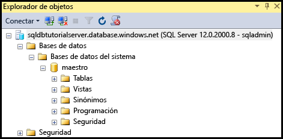
6. Haga clic con el botón derecho en **maestra** y luego haga clic en **Nueva consulta**.

    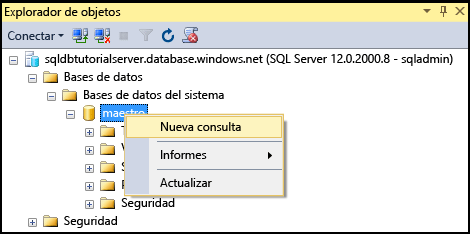

8. Escriba la siguiente consulta en la ventana de consulta:

   ```select * from sys.objects```

9.  En la barra de herramientas, haga clic en **Ejecutar** para devolver una lista de todos los objetos del sistema en la base de datos maestra.

    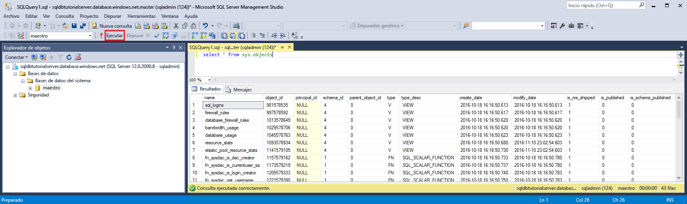

    > [!NOTE]
    > Para explorar la seguridad de SQL, consulte la [introducción a la seguridad de SQL](sql-database-control-access-sql-authentication-get-started.md).
    >

## <a name="create-a-database-with-sample-data"></a>Crear una base de datos con datos de ejemplo

Siga los pasos de este procedimiento para crear una base de datos con datos de ejemplo con Azure Portal. Crea esta base de datos conectada al servidor lógico que creó anteriormente. Si el nivel de servicio Básico no está disponible en la región en la que se creó el servidor, elimínelo y vuelva a crearlo en otra región. Para ver los pasos de eliminación, consulte el último procedimiento en este tutorial.

1. En Azure Portal, haga clic en **Bases de datos SQL**, en la hoja predeterminada.

    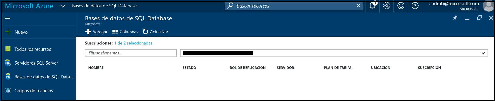
2. En la hoja Bases de datos SQL, haga clic en **Agregar**.

    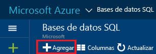
3. En la hoja SQL Database, revise la información que se completa automáticamente.

    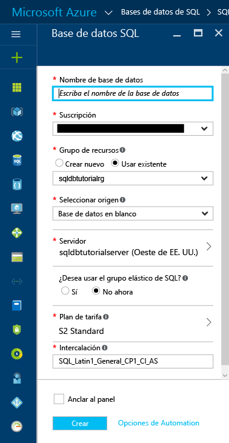
4. Proporcione un nombre de base de datos válido.

    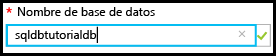
5. En Seleccionar origen, haga clic en **Muestra** y, en Seleccionar muestra, haga clic en **AdventureWorksLT [V12]**.
   
    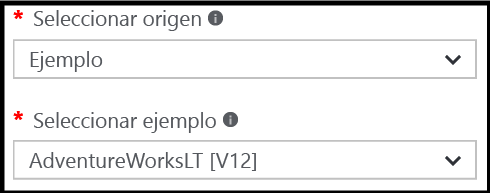
6. En Servidor, indique el nombre de usuario y la contraseña de inicio de sesión del administrador del servidor.

    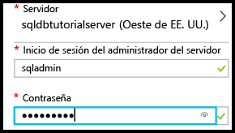

    > [!NOTE]
    > Al agregar una base de datos a un servidor, puede agregarse como una base de datos única (el valor predeterminado) o a un grupo elástico. Para más información sobre los grupos elásticos, consulte [Grupos elásticos](sql-database-elastic-pool.md).
    >

7. En Plan de tarifa, cambie el plan de tarifa a **Básico** (puede aumentar el plan de tarifa más adelante si lo desea pero, con fines de aprendizaje, se recomienda usar el plan de tarifa más bajo).

    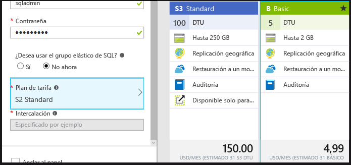
8. Haga clic en **Crear**.

    

## <a name="view-the-database-properties"></a>Ver las propiedades de la base de datos

Siga los pasos de este procedimiento para consultar la base de datos con Azure Portal.

1. En la hoja Bases de datos SQL, haga clic en la nueva base de datos para ver sus propiedades en Azure Portal. Los tutoriales siguientes le ayudarán a comprender las opciones disponibles en esta hoja. 

    
2. Haga clic en **Propiedades** para ver información adicional acerca de la base de datos.

    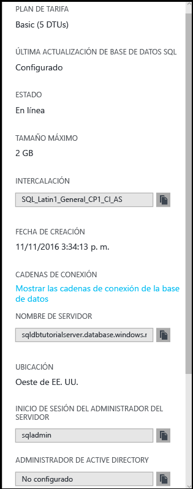

3. Haga clic en **Mostrar las cadenas de conexión de la base de datos**.

    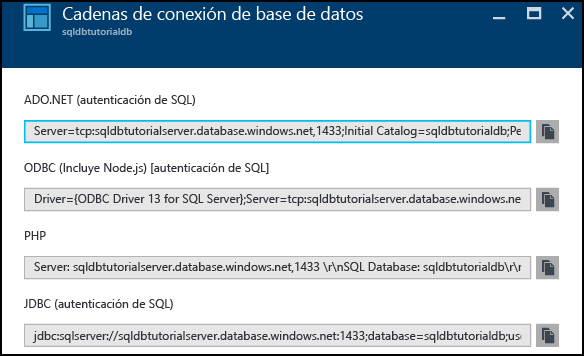
4. Haga clic en **Introducción** y, después, haga clic en el nombre del servidor en el panel Essentials.
    
    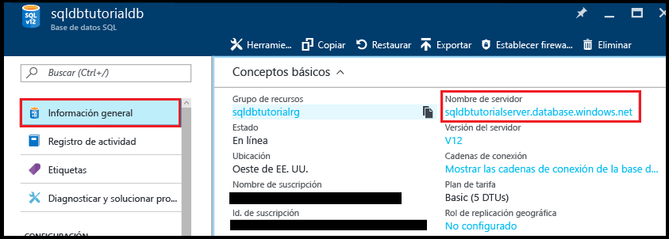
5. En el panel Essentials del servidor, consulte la base de datos recién agregada.

    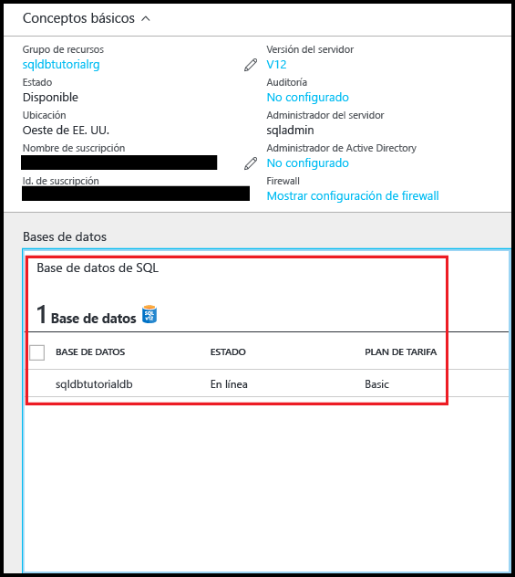

## <a name="query-the-database-in-the-azure-portal"></a>Consultar la base de datos en Azure Portal

Siga los pasos de este procedimiento para consultar la base de datos con el editor de consultas en Azure Portal. La consulta muestra los objetos de la base de datos.

1. En la hoja Bases de datos SQL, haga clic en **Herramientas** en la barra de herramientas.

    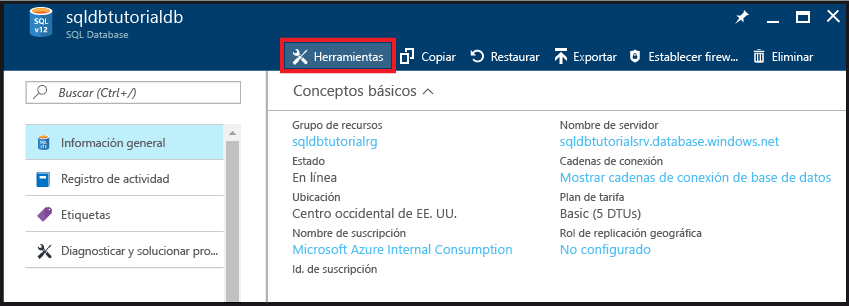
2. En la hoja Herramientas, haga clic en **Editor de consultas (versión preliminar)**.

    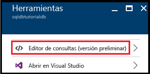
3. Haga clic en la casilla para confirmar que el editor de consultas es una característica en versión preliminar y después haga clic en **Aceptar**.
4. En la hoja **Editor de consultas**, haga clic en **Iniciar sesión**.

    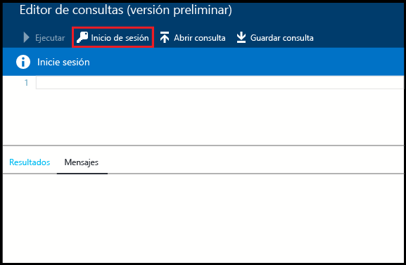
5. Revise el tipo de autorización y el inicio de sesión, e indique la contraseña para este inicio de sesión. 

    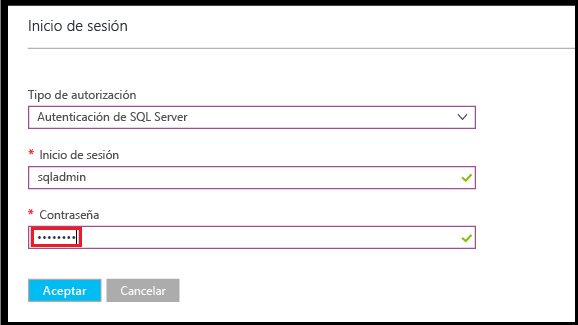
6. Haga clic en **Aceptar** para intentar iniciar sesión.
7. Cuando recibe un error de inicio de sesión que indica que el cliente no tiene permiso para iniciar sesión debido a la ausencia de una regla de firewall para la dirección IP del cliente, copie la dirección IP del cliente en la ventana de error y, en la hoja de SQL Server para esta base de datos, cree una regla de firewall de nivel de servidor.

    
8. Repita los 6 pasos anteriores para iniciar sesión en la base de datos.
9. Una vez autenticado, en la ventana de consulta, escriba la siguiente consulta:

   ```select * from sys.objects```

    
10.  Haga clic en **Ejecutar**.
11. Revise los resultados de la consulta en el panel **Resultados**.

    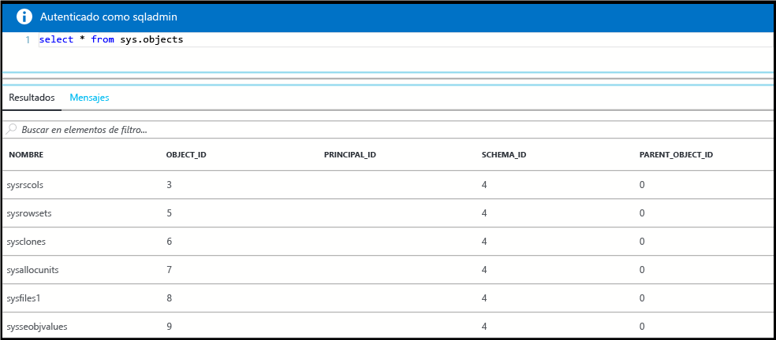

## <a name="connect-and-query-the-database-with-ssms"></a>Conectarse y consultar la base de datos con SSMS

Siga los pasos de este procedimiento para conectarse a la base de datos con SQL Server Management Studio y, después, consulte los datos de ejemplo para ver los objetos de la base de datos.

1. Cambie a SQL Server Management Studio y, en el Explorador de objetos, haga clic en **Bases de datos** y, después, haga clic en **Actualizar** en la barra de herramientas para ver la base de datos de ejemplo.

    
2. En el Explorador de objetos, expanda la nueva base de datos para ver sus objetos.

    
3. Haga clic con el botón derecho en la base de datos de ejemplo y, después, haga clic en **Nueva consulta**.

    
4. Escriba la siguiente consulta en la ventana de consulta:

   ```select * from sys.objects```
   
9.  En la barra de herramientas, haga clic en **Ejecutar** para devolver una lista de todos los objetos del sistema en la base de datos de ejemplo.

    

## <a name="create-a-blank-database-with-ssms"></a>Crear una base de datos vacía con SSMS

Siga los pasos de este procedimiento para crear una nueva base de datos en el servidor lógico con SQL Server Management Studio.

1. En el Explorador de objetos, haga clic con el botón derecho en **Bases de datos** y, después, haga clic en **Nueva base de datos**.

    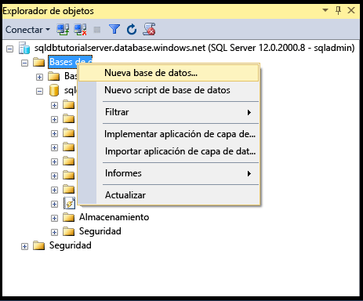

    > [!NOTE]
    > También puede hacer que SSMS cree un script de creación de base de datos para crear una nueva base de datos con Transact-SQL.
    >

2. En el cuadro de diálogo Nueva base de datos, proporcione un nombre de base de datos en el cuadro de texto Nombre de base de datos. 

    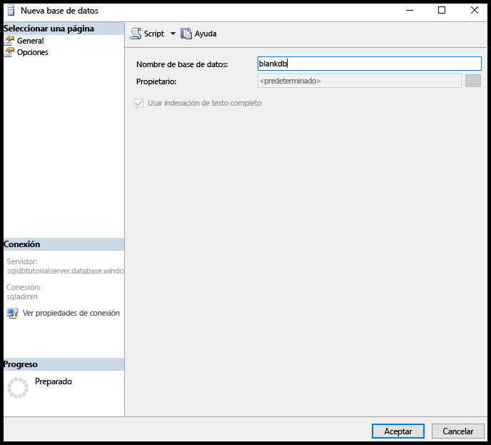

3. En el cuadro de diálogo Nueva base de datos, haga clic en **Opciones** y, después, cambie la edición a **Básica**.

    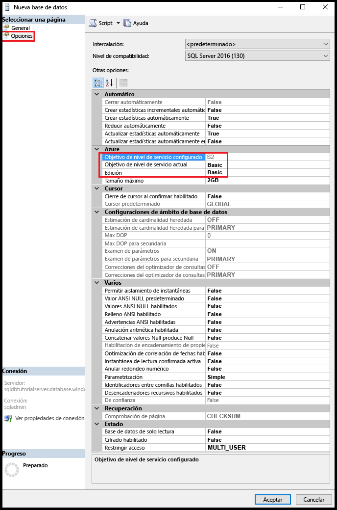

    > [!TIP]
    > Revise las demás opciones de este cuadro de diálogo que pueda modificar para una base de datos SQL de Azure. Para más información sobre estas opciones, consulte [Creación de una base de datos](https://msdn.microsoft.com/library/dn268335.aspx).
    >

4. Haga clic en **Aceptar** para crear la base de datos vacía.
5. Cuando haya finalizado, actualice el nodo Base de datos en el Explorador de objetos para ver la base de datos vacía recién creada. 

    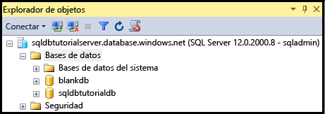

## <a name="troubleshoot-connectivity"></a>Solución de problemas de conectividad

> [!IMPORTANT]
> Si tiene problemas de conectividad, consulte [Problemas de conectividad](sql-database-troubleshoot-common-connection-issues.md).
> 

## <a name="delete-a-single-database"></a>Eliminación de una base de datos única

Siga los pasos de este procedimiento para eliminar una base de datos única con Azure Portal.

1. En la hoja de Azure Portal para la instancia de SQL Database, haga clic en **Eliminar**.

    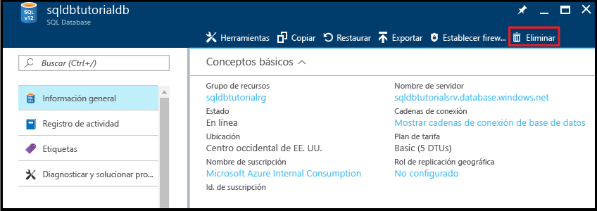
2. Haga clic en **Sí** para confirmar que desea eliminar la base de datos de forma permanente.

    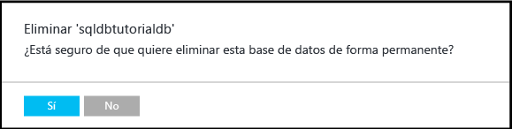

> [!TIP]
> Durante el período de retención para la base de datos, puede restaurarla desde las copias de seguridad automáticas iniciadas por el servicio. Las bases de datos de la edición Básica se pueden restaurar en un plazo de siete días. Sin embargo, no elimine un servidor. Si lo hace, no podrá recuperar el servidor ni las bases de datos eliminadas. Para más información acerca de las copias de seguridad de la base de datos, consulte [Más información sobre las copias de seguridad de SQL Database](sql-database-automated-backups.md) y, para obtener información sobre cómo restaurar una base de datos a partir de copias de seguridad, consulte el artículo sobre la [recuperación de bases de datos](sql-database-recovery-using-backups.md). Para un artículo de procedimientos sobre cómo restaurar una base de datos eliminada, consulte [Restauración de una instancia de Azure SQL Database eliminada con Azure Portal](sql-database-restore-deleted-database-portal.md).
>


## <a name="next-steps"></a>Pasos siguientes
Ahora que ha completado este tutorial, hay otros tutoriales que quizás desee explorar para afianzar lo que ha aprendido en este tutorial. 

- Para una introducción al tutorial de autenticación de SQL Server, consulte [Autenticación y autorización de SQL](sql-database-control-access-sql-authentication-get-started.md)
- Para una introducción al tutorial de autenticación de Azure Active Directory, consulte [Autenticación y autorización de AAD](sql-database-control-access-aad-authentication-get-started.md)
* Si desea consultar la base de datos de ejemplo en Azure Portal, consulte [Public preview: Interactive query experience for SQL databases](https://azure.microsoft.com/en-us/updates/azure-sql-database-public-preview-t-sql-editor/) (Versión preliminar pública: experiencia de consultas interactiva para instancias de SQL Database).
* Si conoce Excel, consulte [Conexión a una base de datos SQL con Excel](sql-database-connect-excel.md).
* Si está listo para comenzar a codificar, elija el lenguaje de programación en [Bibliotecas de conexiones para SQL Database y SQL Server](sql-database-libraries.md).
* Si desea mover las bases de datos de SQL Server locales a Azure, consulte [Migrar una base de datos a SQL Database](sql-database-cloud-migrate.md).
* Si desea cargar datos en una tabla nueva desde un archivo CSV con la herramienta de línea de comandos BCP, consulte cómo [cargar datos en SQL Database desde un archivo CSV con BCP](sql-database-load-from-csv-with-bcp.md).
* Si desea empezar a crear tablas y otros objetos, consulte el tema "Crear una tabla" en [Creación de una tabla](https://msdn.microsoft.com/library/ms365315.aspx).

## <a name="additional-resources"></a>Recursos adicionales

- Para obtener una descripción general técnica, consulte [¿Qué es SQL Database?](sql-database-technical-overview.md)
- Para obtener información de precios, consulte [Precio de Azure SQL Database](https://azure.microsoft.com/pricing/details/sql-database/).


<!--HONumber=Feb17_HO2-->


