<properties
	pageTitle="Tutorial de Base de datos SQL: creación de una base de datos SQL | Microsoft Azure"
	description="Obtenga información sobre cómo configurar un servidor lógico de SQL Database, una regla de firewall del servidor, una base de datos SQL y datos de ejemplo. Aprenda también a conectarse con herramientas de cliente, configurar usuarios y configurar una regla de firewall de base de datos."
	keywords="tutorial de base de datos SQL, creación de una base de datos SQL"
	services="sql-database"
	documentationCenter=""
	authors="CarlRabeler"
	manager="jhubbard"
	editor=""/>

<tags
	ms.service="sql-database"
	ms.workload="data-management"
	ms.tgt_pltfrm="na"
	ms.devlang="na"
	ms.topic="hero-article"
	ms.date="09/07/2016"
	ms.author="carlrab"/>

# Tutorial de SQL Database: creación de una base de datos SQL en cuestión de minutos con datos de ejemplo y el portal de Azure

> [AZURE.SELECTOR]
- [Portal de Azure](sql-database-get-started.md)
- [C#](sql-database-get-started-csharp.md)
- [PowerShell](sql-database-get-started-powershell.md)

En este tutorial, aprenderá a usar el Portal de Azure para:

- Crear una instancia de Azure SQL Database con datos de ejemplo.
- Crear una regla de firewall de nivel de servidor para una única dirección IP o un intervalo de direcciones IP.

Puede realizar estas mismas tareas con [C#](sql-database-get-started-csharp.md) o [PowerShell](sql-database-get-started-powershell.md).

[AZURE.INCLUDE [Inicio de sesión](../../includes/azure-getting-started-portal-login.md)]

## Creación de la primera base de datos SQL de Azure 

1. Si no está conectado, conéctese al [portal de Azure](http://portal.azure.com).
2. Haga clic en **Nuevo**, haga clic en **Datos y almacenamiento** y busque **Base de datos SQL**.

    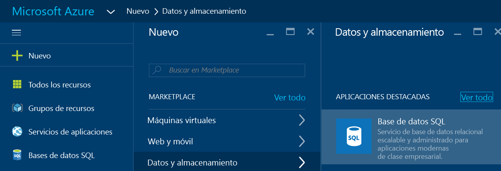

3. Haga clic en **Base de datos SQL** para abrir la hoja Base de datos SQL. El contenido de esta hoja varía según el número de suscripciones y los objetos existentes (por ejemplo, los servidores existentes).

    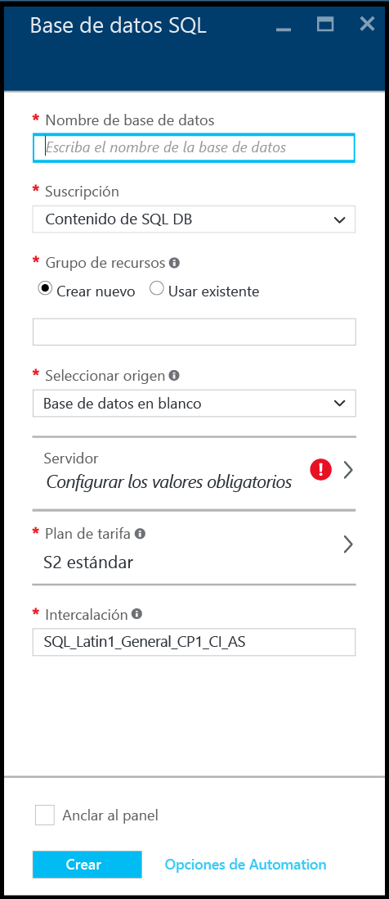

4. En el cuadro de texto **Nombre de la base de datos**, escriba un nombre para la primera base de datos; por ejemplo, "mi-base-de-datos". Una marca de verificación verde indica que ha proporcionado un nombre válido.

    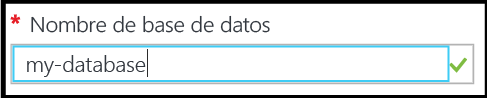

5. Si tiene varias suscripciones, seleccione una.
6. Bajo **Grupo de recursos**, haga clic en **Crear nuevo** y proporcione un nombre para el primer grupo de recursos - por ejemplo; por ejemplo, "mi-grupo-de-recursos". Una marca de verificación verde indica que ha proporcionado un nombre válido.

    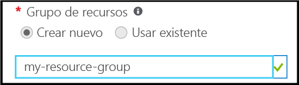

7. Bajo **Seleccionar origen**, haga clic en **Muestra** y, en **Seleccionar muestra**, haga clic en **AdventureWorksLT [V12]**.

    

8. Bajo **Servidor**, haga clic en **Configurar los valores obligatorios**.

    

9. En la hoja Servidor, haga clic en **Crear un nuevo servidor**. Se crea una instancia de Azure SQL Database dentro de un objeto de servidor, que puede ser un nuevo servidor o un servidor existente.

    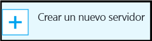

10. Revise la hoja **Nuevo servidor** para conocer la información que debe proporcionar para su nuevo servidor.

    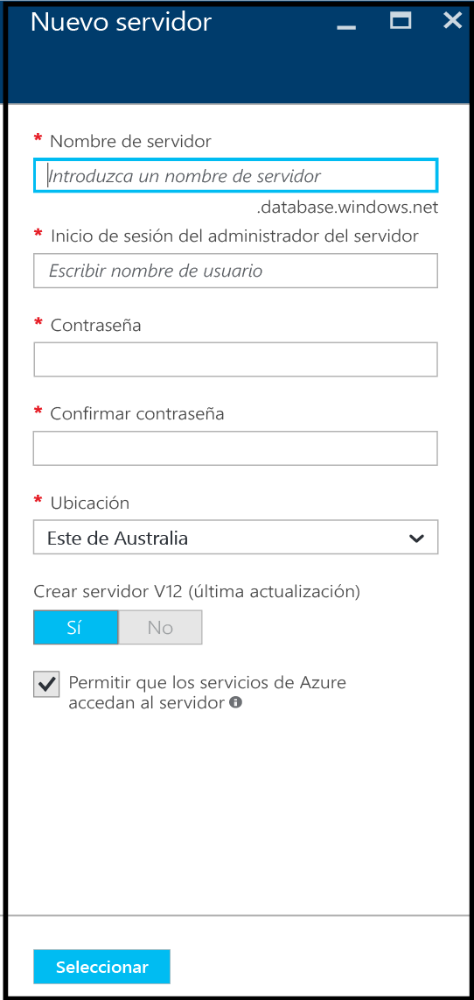

11. En el cuadro de texto **Nombre de servidor**, escriba un nombre para el primer servidor; por ejemplo, "mi-nuevo-objeto-de-servidor". Una marca de verificación verde indica que ha proporcionado un nombre válido.

    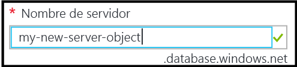
 
12. Bajo ** Inicio de sesión del administrador del servidor**, proporcione un nombre de usuario para el inicio de sesión del administrador para este servidor; por ejemplo, "mi-cuenta-de-administrador". Este inicio de sesión se conoce como el inicio de sesión de la entidad de seguridad del servidor. Una marca de verificación verde indica que ha proporcionado un nombre válido.

    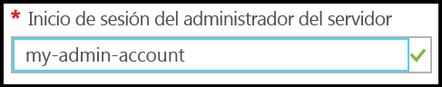

13. Bajo **Contraseña** y **Confirmar contraseña**, proporcione una contraseña para la cuenta de inicio de sesión de la entidad de seguridad del servidor; por ejemplo, "p@ssw0rd1". Una marca de verificación verde indica que ha proporcionado una contraseña válida.

    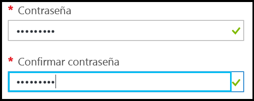
 
14. Bajo **Ubicación**, seleccione un centro de datos adecuado para su ubicación; por ejemplo, "Este de Australia".

    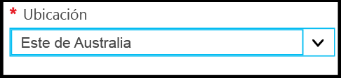

15. Bajo **Crear servidor V12 (última actualización), observe que solo tiene la opción de crear una versión actual del servidor de SQL Azure.

    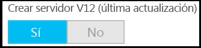

16. Observe que, de forma predeterminada, la casilla **Permitir que los servicios de Azure accedan al servidor** está seleccionada y no se puede cambiar aquí. Se trata de una opción avanzada. Puede cambiarla en la configuración de firewall del servidor para este objeto de servidor, aunque en la mayoría de los casos no es necesario.

    

17. En la hoja Nuevo servidor, revise las selecciones y haga clic en **Seleccionar** para seleccionar este nuevo servidor para la nueva base de datos.

    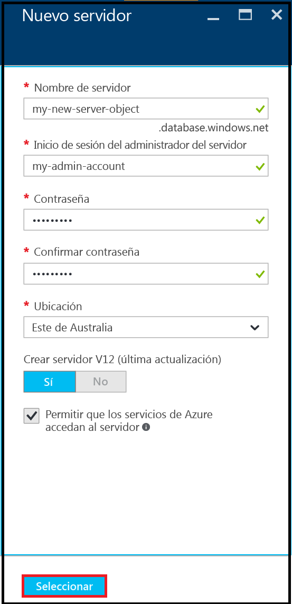

18. En la hoja Base de datos SQL, en **Plan de tarifa**, haga clic en **S2 Standard** (S2 estándar) y, a continuación, en **Básico** para elegir el plan de tarifa menos costoso para su primera base de datos. Siempre puede cambiar el plan de tarifa más adelante.

    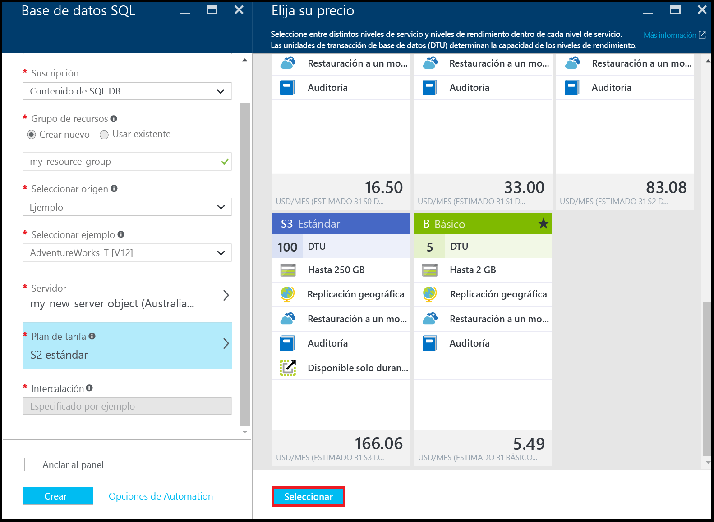

19. En la hoja Base de datos SQL, revise las selecciones y haga clic en **Crear** para crear el primer servidor y la base de datos. Los valores proporcionados se validan y se inicia la implementación.

    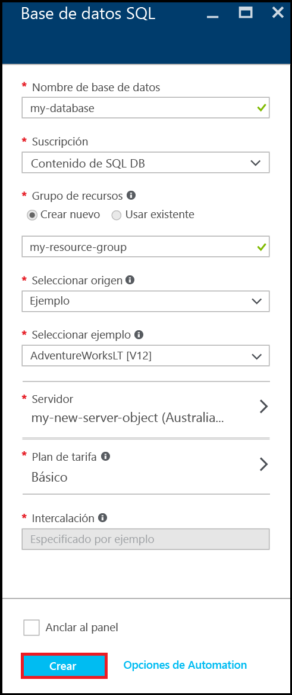

20. En la barra de herramientas del portal, haga clic en los elementos de **notificaciones** para comprobar el estado de la implementación.

    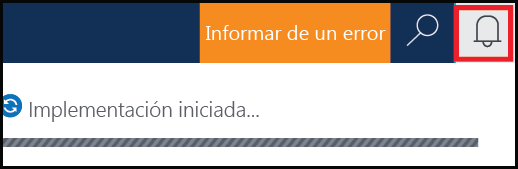

>[AZURE.IMPORTANT]Cuando finalice la implementación, el servidor de SQL Azure y la base de datos se crean en Azure. No podrá conectarse a su nuevo servidor o base de datos mediante las herramientas de SQL Server hasta que cree una regla del firewall del servidor para abrir el firewall de SQL Database para las conexiones desde fuera de Azure.

[AZURE.INCLUDE [Creación de una regla de firewall del servidor](../../includes/sql-database-create-new-server-firewall-portal.md)]

## Pasos siguientes
Ahora que completó este tutorial de SQL Database y que creó una base de datos con algunos datos de ejemplo, está listo para explorar con sus herramientas favoritas.

- Si está familiarizado con Transact-SQL y SQL Server Management Studio, consulte [Conexión y consulta de una base de datos SQL con SSMS](sql-database-connect-query-ssms.md).

- Si conoce Excel, consulte [Conexión a una base de datos SQL con Excel](sql-database-connect-excel.md).

- Si está listo para comenzar a codificar, elija el lenguaje de programación en [Bibliotecas de conexiones para SQL Database y SQL Server](sql-database-libraries.md).

- Si desea mover las bases de datos de SQL Server locales a Azure, consulte [Migrar una base de datos a SQL Database](sql-database-cloud-migrate.md) para más información.

- Si desea cargar datos en una tabla nueva desde un archivo CSV con la herramienta de línea de comandos BCP, consulte cómo [cargar datos en SQL Database desde un archivo CSV con BCP](sql-database-load-from-csv-with-bcp.md).

- Si desea empezar a explorar la seguridad de Azure SQL Database, consulte el artículo sobre la [introducción a la seguridad](sql-database-get-started-security.md).

## Recursos adicionales

[¿Qué es Base de datos SQL?](sql-database-technical-overview.md)

<!----HONumber=AcomDC_0914_2016-->